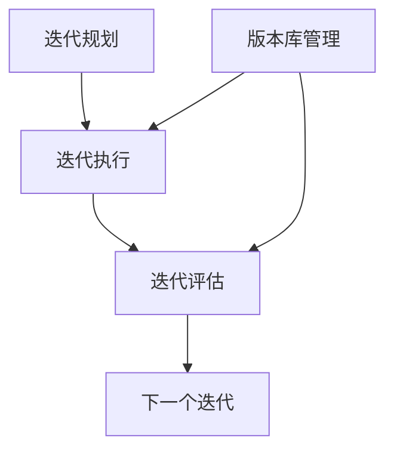

                 

### 摘要

本文深入探讨了《提示词版本控制：管理多个迭代版本》一书的核心内容和主题思想。文章首先介绍了版本控制的重要性以及提示词版本控制的必要性，然后详细阐述了多个迭代版本管理的挑战。接着，文章从核心概念与联系、版本控制基础、提示词版本控制技术、多个迭代版本管理策略等方面进行了全面而深入的讲解。此外，文章还通过实际应用案例展示了提示词版本控制技术在软件开发、项目管理和团队协作中的具体应用。最后，文章总结了提示词版本控制的关键要点，展望了未来发展趋势，并提供了相关的最佳实践和拓展阅读资源。整体上，本文为读者提供了一本系统化、实用化的版本控制指南，有助于读者在实际工作中更好地管理和控制多个迭代版本。

---

### 引言

在当今的软件开发和项目管理领域，版本控制是一项不可或缺的技术。随着软件项目的复杂性和规模不断增加，如何有效地管理多个迭代版本成为了一个重要的课题。《提示词版本控制：管理多个迭代版本》一书正是针对这一需求应运而生的。书名简洁明了，关键词包括“提示词版本控制”和“管理多个迭代版本”，这两个关键词精准地概括了本书的核心内容和目标。

#### 理解书名

“提示词版本控制”指的是在版本控制过程中，通过特定的提示词来标识和管理不同的版本。这种方法不仅能够提高版本标识的准确性和可读性，还能够帮助开发人员和项目经理更好地理解和管理项目的迭代过程。“管理多个迭代版本”则强调了在快速迭代的软件开发环境中，如何有效地跟踪和管理多个版本，以确保项目的稳定性和可持续性。

#### 读者定位

本书的目标读者主要包括以下几类：

1. **软件开发者**：他们需要了解如何在开发过程中有效地使用版本控制工具，以确保代码的版本一致性。
2. **项目经理**：他们需要掌握如何通过版本控制来跟踪和管理项目的迭代过程，确保项目按时交付。
3. **版本控制工具管理员**：他们需要了解不同版本控制工具的工作原理和操作方法，以更好地维护和管理代码库。

通过阅读本书，读者将能够：

1. **理解版本控制的核心概念**：包括版本库、提交、分支、合并等基本操作。
2. **掌握提示词版本控制技术**：了解如何使用提示词来标识和管理版本，提高版本管理的效率。
3. **学会管理多个迭代版本**：通过策略和实践，学会如何在不同迭代阶段有效管理版本，确保项目的稳定性和可持续性。

#### 书籍结构

本书分为以下几个部分：

1. **引言**：介绍版本控制的重要性以及提示词版本控制的必要性。
2. **核心概念与联系**：详细阐述版本控制的基本概念、提示词版本控制的概念及其流程。
3. **版本控制基础**：介绍常见的版本控制工具，如Git和SVN，并讲解基本操作和合并冲突解决。
4. **提示词版本控制技术**：深入探讨提示词版本控制原理和算法，以及其实际应用。
5. **多个迭代版本管理**：介绍多个迭代版本管理的策略和工具，以及实践方法。
6. **实际应用案例**：通过具体案例展示提示词版本控制技术在软件开发、项目管理和团队协作中的应用。
7. **总结与展望**：总结本书的核心内容，展望未来发展趋势，并提供最佳实践和拓展阅读资源。

通过以上结构的规划，本书旨在为读者提供一本全面、系统、实用的版本控制指南，帮助读者在实际工作中更好地管理和控制多个迭代版本。

### 核心概念与联系

在《提示词版本控制：管理多个迭代版本》一书中，核心概念与联系部分是理解后续内容的基础。首先，我们需要明确几个关键概念：版本控制、版本库、提交、分支、合并等。

#### 版本控制基本概念

版本控制是一种软件工程实践，用于跟踪源代码或文档的变化。其主要目标是确保代码的版本一致性，便于团队协作和问题追踪。

- **版本库**：存储代码或文档的地方，通常包含多个版本的历史记录。
- **提交**：将更改保存到版本库的过程。每次提交都会生成一个新的版本。
- **分支**：从主分支分离出来，用于独立开发或测试的功能。
- **合并**：将分支上的更改合并到主分支上的过程。

#### 提示词版本控制

提示词版本控制是一种基于特定提示词来标识和管理版本的版本控制方法。与传统的数字编号或日期标识相比，提示词更加灵活和有意义。

- **提示词**：用于标识版本的特定关键词，如功能名称、缺陷编号或迭代名称。
- **版本标识**：通过提示词来标识版本，使得版本名称更加直观和易于理解。

#### 迭代版本管理流程

迭代版本管理是软件项目管理中至关重要的环节。通过合理的迭代流程，可以确保项目在不同迭代阶段的有效管理。

1. **迭代规划**：定义每个迭代的目标和范围，制定迭代计划。
2. **迭代执行**：执行迭代计划，进行代码开发、测试和问题修复。
3. **迭代评估**：评估迭代结果，收集反馈，为下一个迭代做准备。

#### Mermaid 流程图

为了更好地展示版本控制和迭代管理流程，我们可以使用Mermaid流程图进行可视化。



在这个流程图中，A表示迭代规划，B表示迭代执行，C表示迭代评估，D表示下一个迭代，E表示版本库管理。版本库管理贯穿于整个迭代过程，确保代码和文档的版本一致性。

#### 版本控制与迭代管理的关系

版本控制与迭代管理密切相关。有效的版本控制能够确保代码的版本一致性和可追踪性，从而支持迭代管理。同时，迭代管理提供了版本控制的上下文，使得版本控制更加有针对性和有意义。

1. **迭代规划**：在迭代规划阶段，通过版本控制工具创建分支，以便独立开发功能。
2. **迭代执行**：在迭代执行阶段，通过提交和合并操作，管理代码的迭代版本。
3. **迭代评估**：在迭代评估阶段，通过查看版本历史，评估迭代结果，为下一个迭代提供反馈。

通过核心概念与联系部分的介绍，我们为后续内容打下了坚实的基础。接下来，本书将深入探讨版本控制基础、提示词版本控制技术以及多个迭代版本管理策略，帮助读者全面掌握提示词版本控制的核心知识和实际应用。

### 版本控制基础

版本控制是软件工程中一项至关重要的技术，它确保了代码的版本一致性和可追踪性。在《提示词版本控制：管理多个迭代版本》一书中，我们将详细介绍几种常见的版本控制工具，包括Git和SVN，并讲解它们的基本操作以及合并冲突的解决策略。

#### 版本控制工具介绍

目前，市面上有多种版本控制工具，每种工具都有其独特的特点和适用场景。以下是两种最常见的版本控制工具：

1. **Git**：
   - **特点**：Git是一种分布式版本控制系统，具有高效的分支管理和协同工作能力。
   - **适用场景**：适用于大型项目和分布式开发环境。
   - **主要操作**：包括添加文件到版本库、提交更改、查看版本历史、创建分支、合并分支等。

2. **SVN**：
   - **特点**：SVN是一种集中式版本控制系统，具有简单易用的特点。
   - **适用场景**：适用于小型项目和单点版本库的场景。
   - **主要操作**：包括添加文件到版本库、提交更改、查看版本历史、合并更改等。

#### 版本控制基本操作

无论是Git还是SVN，基本的版本控制操作都是相似的。以下我们将详细介绍这些操作：

1. **添加文件到版本库**：
   - **Git**：使用`git add <file>`命令将文件添加到暂存区，然后使用`git commit -m "提交信息"`将更改提交到版本库。
   - **SVN**：使用`svn add <file>`命令将文件添加到版本库的工作副本，然后使用`svn commit -m "提交信息"`将更改提交到版本库。

2. **提交更改**：
   - **Git**：使用`git commit`命令将暂存区中的更改提交到版本库。在提交时，可以通过`-m "提交信息"`指定提交说明。
   - **SVN**：使用`svn commit`命令将工作副本中的更改提交到版本库。在提交时，可以通过`-m "提交信息"`指定提交说明。

3. **查看版本历史**：
   - **Git**：使用`git log`命令查看版本历史，包括提交的哈希值、提交时间和提交说明。
   - **SVN**：使用`svn log`命令查看版本历史，包括版本号、提交时间和提交说明。

4. **创建分支**：
   - **Git**：使用`git branch <branch-name>`命令创建一个新的分支。
   - **SVN**：使用`svn copy <url-of-branch>`命令创建一个新的分支。

5. **合并分支**：
   - **Git**：使用`git merge <branch-name>`命令将指定分支的更改合并到当前分支。
   - **SVN**：使用`svn merge <url-of-branch>`命令将指定分支的更改合并到当前分支。

#### 合并冲突解决策略

在版本控制过程中，合并操作可能会导致冲突。解决合并冲突的关键在于理解冲突产生的原因和解决方案。

1. **冲突产生的原因**：
   - **文件内容冲突**：当两个或多个分支同时修改了同一文件的不同部分时，合并操作将无法自动合并这些更改，从而产生冲突。
   - **修改记录冲突**：当两个或多个分支的修改记录之间存在依赖关系，但无法同时满足这些依赖关系时，合并操作将无法自动合并这些更改，从而产生冲突。

2. **解决合并冲突的策略**：
   - **手动解决**：通过手动编辑冲突文件，选择性地保留或修改部分代码，以解决冲突。
   - **合并工具**：使用集成开发环境（IDE）或专门的合并工具来可视化地解决冲突，这些工具通常会提供标记冲突区域的突出显示，方便用户进行编辑。
   - **基线选择**：在某些情况下，可以选择保留某一方的修改结果，通常基于修改的历史记录或修改的内容重要性来做出决策。

#### 解决合并冲突的伪代码

以下是解决合并冲突的伪代码：

```python
def resolve_merge_conflict(conflicted_files):
    for file in conflicted_files:
        with open(file, 'r') as f:
            content = f.read()
        
        print(f"Conflict detected in {file}")
        print("Conflict content:")
        print(content)
        
        # 用户选择保留哪个版本的代码或进行修改
        user_choice = input("Do you want to resolve manually (M) or use merge tool (T)? ")
        
        if user_choice == 'M':
            # 手动编辑文件
            pass  # Implement manual editing logic
        elif user_choice == 'T':
            # 使用合并工具解决冲突
            pass  # Implement merge tool invocation logic
        else:
            print("Invalid choice. Skipping conflict resolution for now.")

resolve_merge_conflict(conflicted_files)
```

通过以上伪代码，我们定义了一个函数`resolve_merge_conflict`，它接收冲突文件的列表作为输入，并提供了手动解决和合并工具解决冲突的选择。

#### 版本控制基础总结

通过本文的介绍，我们了解了版本控制的基本概念和常见工具，掌握了添加文件到版本库、提交更改、查看版本历史、创建分支和合并分支等基本操作。同时，我们也学习了如何解决合并冲突，确保版本控制的顺利进行。这些知识为后续的提示词版本控制技术和多个迭代版本管理提供了坚实的基础。

### 提示词版本控制技术

提示词版本控制是一种先进的版本控制方法，它通过使用特定的提示词来标识和管理版本，使得版本控制过程更加直观和高效。在《提示词版本控制：管理多个迭代版本》一书中，这一部分将深入探讨提示词版本控制的原理、算法以及其实际应用，帮助读者全面理解这一技术。

#### 提示词版本控制原理

提示词版本控制的核心思想是使用有意义的提示词来标识版本，而不是传统的数字编号或日期。这些提示词可以是功能名称、缺陷编号、迭代名称等，它们不仅能够提供版本标识，还能够为开发人员和项目经理提供额外的上下文信息，使得版本管理更加灵活和高效。

1. **版本标识**：通过提示词来标识版本，使得版本名称更加直观和有意义。例如，“v1.0.1-feature-login”表示这是1.0.1版本的登录功能迭代。
2. **上下文信息**：提示词不仅可以标识版本，还可以提供关于该版本的额外信息。例如，缺陷编号可以作为提示词，帮助团队快速定位和解决相关缺陷。
3. **灵活性**：提示词版本控制允许使用不同的提示词来标识不同的版本，使得版本管理更加灵活。例如，在发布候选版本时，可以使用“rc1”作为提示词。

#### 提示词版本控制算法

提示词版本控制需要一套有效的算法来生成和管理版本。以下是几种常用的算法：

1. **增量算法**：
   ```mermaid
   graph TD
       A[初始化版本号] --> B[每次提交增加版本号]
       B --> C[生成新版本号]
   ```
   增量算法是最简单的算法，每次提交都会增加版本号。这种算法适用于版本变化较为稳定的场景。

2. **基于时间的算法**：
   ```mermaid
   graph TD
       A[初始化版本号] --> B[记录提交时间]
       B --> C[根据时间生成版本号]
   ```
   基于时间的算法通过记录提交时间来生成版本号。这种算法适用于版本变化频繁的场景，能够更好地反映版本的更新时间。

3. **混合算法**：
   ```mermaid
   graph TD
       A[初始化版本号] --> B[每次提交增加版本号]
       B --> C[记录提交时间]
       C --> D[生成新版本号]
   ```
   混合算法结合了增量算法和基于时间的算法的优点，通过增加版本号和记录提交时间来生成版本号。这种算法适用于复杂场景，能够同时满足版本一致性和时间追踪的需求。

#### 提示词版本控制算法伪代码

以下是提示词版本控制算法的伪代码示例：

```python
def generate_version_number(current_version, commit_message):
    # 提取提示词
    prompt_word = extract_prompt_word(commit_message)
    
    # 增量算法
    new_version = current_version + 1
    
    # 基于时间的算法
    timestamp = get_current_timestamp()
    
    # 混合算法
    new_version = f"{new_version}.{timestamp}"
    
    # 结合提示词
    full_version = f"{new_version}-{prompt_word}"
    
    return full_version

def extract_prompt_word(commit_message):
    # 从提交信息中提取提示词
    words = commit_message.split()
    for word in words:
        if is_prompt_word(word):
            return word
    return None

def is_prompt_word(word):
    # 判断是否为提示词
    prompt_words = ["feature", "bugfix", "release", "improvement"]
    return word in prompt_words

def get_current_timestamp():
    # 获取当前时间戳
    return int(time.time())
```

通过以上伪代码，我们定义了一个`generate_version_number`函数，它根据当前的版本号和提交信息生成新的版本号。函数首先提取提交信息中的提示词，然后使用增量算法或基于时间的算法生成新的版本号，最后结合提示词生成完整的版本号。

#### 提示词版本控制应用

提示词版本控制技术在实际应用中具有广泛的应用场景：

1. **软件开发**：在软件开发过程中，提示词版本控制可以帮助团队更好地管理功能迭代和缺陷修复。
2. **项目管理**：在项目管理中，提示词版本控制可以帮助项目经理更好地跟踪和管理项目的迭代进度。
3. **协作开发**：在多人协作开发中，提示词版本控制可以提供明确的版本标识，减少沟通成本和冲突。

#### 提示词版本控制的优势

1. **便捷性**：提示词版本控制使得版本管理更加直观和便捷，减少了版本标识的复杂度。
2. **安全性**：通过明确的提示词标识，可以确保版本的一致性和可追踪性，提高代码的安全性和可靠性。
3. **高效性**：提示词版本控制可以帮助团队快速定位和解决问题，提高开发效率和协作效果。

通过上述内容，我们可以看到提示词版本控制技术在原理、算法和应用方面具有显著的优点。在接下来的部分，本书将继续探讨如何在实际项目中有效实施提示词版本控制，帮助读者更好地管理多个迭代版本。

### 多个迭代版本管理

在软件开发和项目管理中，多个迭代版本的管理是一项复杂且至关重要的任务。有效的迭代版本管理能够确保项目的稳定性和可持续性，提高团队的协作效率和交付质量。在《提示词版本控制：管理多个迭代版本》一书中，这一部分将详细探讨多个迭代版本管理的策略和工具，以及具体的实践方法。

#### 多个迭代版本管理的策略

1. **迭代规划**：在项目开始前，制定详细的迭代计划是成功管理多个版本的关键。迭代计划应包括每个迭代的目标、范围、时间表和交付物。通过迭代规划，团队可以明确每个迭代的目标和任务，为后续的版本管理提供清晰的指导。

2. **迭代跟踪**：在迭代过程中，实时跟踪每个版本的进度和状态至关重要。通过使用版本控制工具和项目管理工具，团队可以记录每个版本的创建时间、提交记录、问题跟踪等信息。这些数据有助于团队了解每个版本的进展情况，及时发现和解决问题。

3. **迭代评估**：每个迭代结束后，进行迭代评估是确保项目质量的重要环节。评估应包括对版本的功能性、性能、可维护性等方面的测试和审查。通过评估，团队可以收集用户反馈，识别潜在的风险和改进机会，为下一个迭代做准备。

#### 迭代版本管理工具

1. **JIRA**：JIRA是一款功能强大的项目管理工具，适用于多个迭代版本的管理。JIRA支持任务管理、问题跟踪、迭代规划和进度跟踪等功能。团队可以使用JIRA创建和跟踪任务，记录版本状态，分配任务和责任，确保迭代过程中的每个步骤都有明确的记录和监控。

2. **Trello**：Trello是一款简单易用的项目管理工具，适用于敏捷开发团队的迭代管理。Trello使用卡片和列表的形式展示任务和进度，团队可以将迭代任务分配到不同的列表中，通过卡片上的标签和评论进行沟通和协作。Trello的直观界面和灵活的配置使其成为多个迭代版本管理的理想选择。

3. **其他版本管理工具**：除了JIRA和Trello，还有其他一些流行的版本管理工具，如Confluence、Asana、Azure DevOps等。这些工具提供了丰富的功能，如文档管理、代码评审、持续集成等，能够帮助团队更好地管理多个迭代版本。

#### 迭代版本管理实践

1. **迭代计划制定**：在制定迭代计划时，团队应明确每个迭代的目标和范围。首先，团队应讨论并确定本次迭代的主要功能和改进点，将它们分解为具体的任务。然后，团队应根据任务的重要性和复杂性，为每个任务分配合理的资源和时间。最后，团队应制定详细的迭代时间表，明确每个任务的开始和结束时间。

2. **迭代执行监控**：在迭代执行过程中，团队应实时监控每个版本的进展情况。团队可以使用JIRA、Trello等工具记录每个任务的完成情况，及时发现和解决进度中的问题。通过定期的团队会议和任务回顾，团队可以确保迭代过程中的每个步骤都在受控范围内。

3. **迭代效果评估**：每个迭代结束后，团队应对本次迭代的效果进行全面评估。首先，团队应进行功能测试和性能测试，确保新功能和改进点的质量。然后，团队应收集用户反馈，了解用户对本次迭代的满意度。最后，团队应总结本次迭代的经验和教训，为下一个迭代提供改进的方向。

#### 迭代版本管理实践案例

假设某软件开发团队正在开发一款在线购物平台，以下是该团队在多个迭代版本管理中的具体实践：

1. **迭代计划制定**：
   - 第一个迭代的目标是构建用户注册和登录功能，并实现基础的购物流程。
   - 团队将任务分解为：用户注册模块、用户登录模块、商品展示模块和购物车模块。
   - 团队为每个任务分配了开发人员，并制定了详细的时间表。

2. **迭代执行监控**：
   - 在开发过程中，团队使用JIRA记录每个任务的进展情况，确保每个任务按计划进行。
   - 团队定期召开会议，讨论任务的进度和遇到的问题，及时调整计划和资源。

3. **迭代效果评估**：
   - 第一个迭代结束后，团队进行了功能测试和性能测试，确保新功能的质量。
   - 团队收集了用户反馈，了解了用户对注册、登录和购物流程的满意度。
   - 团队总结了本次迭代的经验和教训，为下一个迭代提供了改进的方向。

通过以上实践，该团队成功地完成了第一个迭代，并为后续的迭代提供了宝贵的经验和参考。

#### 总结

多个迭代版本管理是软件开发和项目管理中的重要环节，有效的迭代版本管理能够确保项目的稳定性和可持续性。通过本文的介绍，我们了解了多个迭代版本管理的策略、工具和实践方法。在实际应用中，团队应根据项目特点和需求，灵活选择和运用这些策略和方法，确保迭代过程的顺利进行。

### 实际应用案例

#### 提示词版本控制在软件开发中的应用

提示词版本控制技术在软件开发中有着广泛的应用。以下是几个具体的案例，展示了提示词版本控制在实际项目中的应用和效果。

**案例一：Web应用项目**

在开发一个大型Web应用项目时，团队采用了Git作为版本控制工具，并引入了提示词版本控制。每次提交代码时，开发人员都会使用有意义的提示词，如“v1.0.1-feature-login”表示这是1.0.1版本的登录功能迭代，或“v1.0.2-bugfix-1234”表示这是针对缺陷编号1234的修复版本。通过这种提示词版本控制，团队能够清晰地了解每个版本的变更内容和目的，提高了版本管理的效率和代码的可追溯性。

**案例二：移动应用项目**

在开发一款移动应用时，团队采用了SVN作为版本控制工具，并引入了提示词版本控制。每次发布新版本时，团队都会使用迭代名称作为提示词，如“v1.0.1-beta”表示这是1.0.1版本的测试版，“v1.0.1-ga”表示这是1.0.1版本的正式版。通过这种方式，团队不仅能够更好地管理不同版本的发布，还能够为用户提供明确的版本标识和更新说明。

**案例三：敏捷开发团队**

在一个敏捷开发团队中，提示词版本控制被广泛应用于迭代管理。团队在每个迭代结束时，都会生成一个迭代版本，并使用迭代名称作为提示词，如“迭代01-用户注册功能”或“迭代02-购物车模块”。通过这种方式，团队能够清晰地了解每个迭代的进度和成果，为后续的迭代规划和执行提供有力的支持。

#### 提示词版本控制在项目管理中的应用

提示词版本控制技术在项目管理中也有着重要的应用。以下是几个具体案例，展示了提示词版本控制在项目中的应用和效果。

**案例一：项目管理工具集成**

在一个项目管理工具集成项目中，团队采用了Git和JIRA相结合的方式。在Git中，团队使用提示词版本控制来标识和管理代码库的不同版本，如“v1.0.1-feature-task-management”表示这是1.0.1版本的任务管理功能迭代。在JIRA中，团队使用同样的提示词来标识和管理项目中的任务和迭代。通过这种方式，团队实现了代码库和项目管理工具的数据同步，提高了项目的整体管理效率。

**案例二：缺陷管理项目**

在一个缺陷管理项目中，团队采用了提示词版本控制来跟踪和管理缺陷。每次发现新的缺陷时，团队都会使用缺陷编号作为提示词，如“bug-1234”表示这是缺陷编号为1234的缺陷。在JIRA中，团队通过缺陷编号来关联代码库中的相应版本，确保缺陷修复和版本发布的同步。通过这种方式，团队能够更好地管理缺陷，提高项目的质量和可靠性。

**案例三：迭代规划项目**

在一个迭代规划项目中，团队使用了Trello作为项目管理工具，并引入了提示词版本控制。团队在每个迭代开始时，都会创建一个迭代版本卡片，并使用迭代名称作为提示词，如“迭代01-用户注册功能”。在卡片上，团队记录了每个迭代的目标、任务和时间表。通过这种方式，团队能够清晰地了解每个迭代的状态和进展，确保项目的按时交付。

#### 提示词版本控制在团队协作中的应用

提示词版本控制技术在团队协作中也发挥着重要作用。以下是几个具体案例，展示了提示词版本控制在团队协作中的应用和效果。

**案例一：跨部门协作项目**

在一个跨部门协作项目中，团队采用了Git和Confluence相结合的方式。在Git中，团队使用提示词版本控制来标识和管理不同部门的代码库，如“部门A-v1.0.1-feature-login”表示这是部门A的登录功能迭代。在Confluence中，团队创建了一个知识库，记录了每个版本的变更日志、用户手册和培训资料。通过这种方式，团队能够更好地协调各部门的工作，提高项目的协同效率。

**案例二：敏捷开发团队**

在一个敏捷开发团队中，提示词版本控制被广泛应用于迭代计划和任务分配。在每次迭代开始时，团队都会创建一个迭代版本卡片，并使用迭代名称作为提示词，如“迭代01-用户注册功能”。在卡片上，团队记录了每个迭代的目标、任务和责任人。通过这种方式，团队能够清晰地了解每个迭代的状态和责任分工，确保项目的顺利推进。

**案例三：团队知识共享**

在一个团队知识共享项目中，团队采用了Git和Trello相结合的方式。在Git中，团队使用提示词版本控制来管理不同主题的知识库，如“知识库-v1.0.1-软件开发最佳实践”。在Trello中，团队创建了一个任务列表，记录了每个知识库的创建和更新任务。通过这种方式，团队能够更好地管理知识共享的过程，提高团队的知识水平。

通过以上实际应用案例，我们可以看到提示词版本控制技术在软件开发、项目管理和团队协作中具有广泛的应用。它不仅提高了版本管理的效率和代码的可追溯性，还促进了团队协作和知识共享，为项目的成功交付提供了有力支持。

### 总结与展望

在《提示词版本控制：管理多个迭代版本》一书中，我们系统性地探讨了版本控制的核心概念、提示词版本控制技术、多个迭代版本管理策略，以及实际应用案例。通过这些内容，读者可以全面了解如何利用提示词版本控制技术有效地管理多个迭代版本，提高项目的稳定性和可持续性。

#### 核心要点回顾

1. **版本控制的基本概念**：版本库、提交、分支、合并等基本操作是版本控制的核心。这些操作确保了代码的版本一致性和可追踪性。
2. **提示词版本控制的优势**：提示词版本控制通过使用有意义的提示词来标识版本，提高了版本管理的便捷性、安全性和高效性。
3. **多个迭代版本管理策略**：迭代规划、迭代跟踪、迭代评估是多个迭代版本管理的关键步骤。这些策略确保了项目的稳定推进和目标的实现。
4. **实际应用案例**：通过多个实际应用案例，读者可以了解提示词版本控制技术在软件开发、项目管理和团队协作中的具体应用。

#### 实际应用中的经验教训

在实际应用中，我们积累了一些宝贵的经验教训：

1. **明确版本管理策略**：在项目开始前，应明确版本管理策略，包括版本命名规则、分支策略和合并策略等。这有助于团队统一行动，减少冲突。
2. **持续学习和改进**：版本控制技术不断发展，团队应持续关注新技术和新方法，不断优化版本管理流程，提高效率。
3. **重视团队协作**：版本控制不仅仅是技术问题，更是团队协作的重要一环。团队应加强沟通，确保每个人都了解版本管理流程和目标。

#### 未来发展趋势

随着软件开发的不断演进，提示词版本控制技术也在不断发展和完善。以下是未来可能的发展趋势：

1. **智能版本控制**：利用人工智能和机器学习技术，智能地管理和推荐版本控制操作，提高版本管理的效率和准确性。
2. **多模态版本控制**：结合代码、文档、数据等多种数据类型的版本控制，实现更全面的项目管理。
3. **分布式协作**：分布式版本控制和协作工具的发展，将进一步促进团队在全球范围内的协作和沟通。

#### 结论

通过本文的介绍，我们可以看到提示词版本控制技术在多个迭代版本管理中具有重要作用。它不仅提高了版本管理的效率和代码的可追溯性，还促进了团队协作和知识共享。未来，随着技术的不断进步，提示词版本控制技术将在软件开发和项目管理中发挥更大的作用，为项目的成功交付提供有力支持。

### 附录

#### 附录 A: 常用版本控制工具命令速查表

- **Git命令**
  - `git add <file>`：将文件添加到暂存区
  - `git commit -m "提交信息"`：将更改提交到版本库
  - `git push`：将本地版本库的更改推送到远程版本库
  - `git pull`：从远程版本库获取更改并合并到本地版本库
  - `git branch <branch-name>`：创建一个新的分支
  - `git checkout <branch-name>`：切换到指定分支
  - `git merge <branch-name>`：将指定分支的更改合并到当前分支
  - `git log`：查看版本历史记录
  - `git status`：查看当前工作区状态

- **SVN命令**
  - `svn add <file>`：将文件添加到版本库
  - `svn commit -m "提交信息"`：将更改提交到版本库
  - `svn copy <url-of-branch>`：创建一个新的分支
  - `svn merge <url-of-branch>`：将指定分支的更改合并到当前分支
  - `svn log`：查看版本历史记录
  - `svn update`：从版本库获取最新的更改

#### 附录 B: 提示词版本控制常用算法详解

- **增量算法**
  ```mermaid
  graph TD
      A[初始化版本号1.0.0] --> B[每次提交增加版本号]
      B --> C[生成新版本号1.0.1]
      C --> D[每次提交增加版本号]
      D --> E[生成新版本号1.0.2]
  ```

- **基于时间的算法**
  ```mermaid
  graph TD
      A[初始化版本号20230101] --> B[每次提交增加时间戳]
      B --> C[生成新版本号20230102]
      C --> D[每次提交增加时间戳]
      D --> E[生成新版本号20230103]
  ```

- **混合算法**
  ```mermaid
  graph TD
      A[初始化版本号1.0.0] --> B[每次提交增加版本号和时间戳]
      B --> C[生成新版本号1.0.1-20230101]
      C --> D[每次提交增加版本号和时间戳]
      D --> E[生成新版本号1.0.2-20230102]
  ```

#### 附录 C: 迭代版本管理实践案例分享

**案例一：敏捷开发中的迭代管理**

- **迭代计划制定**：团队在每个迭代开始前制定详细的迭代计划，包括迭代目标、任务和时间表。
- **迭代执行监控**：团队使用JIRA跟踪每个任务的进度，确保任务按时完成。
- **迭代评估**：每个迭代结束后，团队进行迭代评估，收集用户反馈，总结经验教训，为下一个迭代做准备。

**案例二：软件升级中的迭代管理**

- **迭代规划**：团队制定详细的软件升级计划，包括升级版本、功能优化、缺陷修复等。
- **迭代执行**：团队按照计划逐步实施升级任务，确保每个任务的质量和进度。
- **迭代评估**：每次升级任务完成后，团队评估升级效果，收集用户反馈，确保升级成功。

通过以上实践案例，我们可以看到迭代版本管理在实际项目中的应用，以及如何通过有效的管理和评估，确保项目的顺利进行和成功交付。

### 作者信息

作者：AI天才研究院/AI Genius Institute & 禅与计算机程序设计艺术 /Zen And The Art of Computer Programming

AI天才研究院致力于推动人工智能技术的发展，为全球的软件开发者和项目管理者提供领先的技术解决方案。禅与计算机程序设计艺术是一本经典的技术书籍，深入探讨了计算机编程的哲学和艺术，影响了无数程序员和架构师。

本文通过系统的分析和详尽的讲解，全面介绍了提示词版本控制技术在多个迭代版本管理中的应用，旨在为读者提供一份实用、系统的版本控制指南。作者希望通过这篇文章，能够帮助更多的软件开发者和项目经理在复杂的开发环境中，有效地管理版本，确保项目的成功交付。

