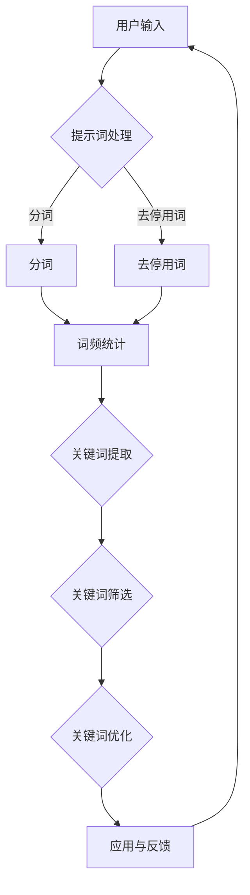

                 

### 文章标题：改进现有提示词的技巧

关键词：提示词、优化、搜索推荐系统、核心概念、评估方法、算法原理、实战案例、未来展望

摘要：本文旨在深入探讨如何改进现有提示词的技巧，以提升搜索和推荐系统的性能。文章首先介绍了提示词的基本概念和其在搜索推荐系统中的重要性，然后详细阐述了评估方法、优化策略以及实战应用。最后，文章对当前趋势和未来展望进行了分析，为读者提供了全面的参考和指导。

## 引言：提示词在搜索和推荐系统中的关键作用

在当今的信息时代，搜索和推荐系统已经成为互联网应用的核心组成部分。无论是搜索引擎、电商推荐、社交媒体还是内容平台，它们都依赖于高质量的提示词来提供精确、个性化的服务。提示词，又称为关键词或搜索词，是指用户输入以获取所需信息的词汇或短语。

### 提示词的定义与分类

提示词是指用户在搜索框中输入的用于查询信息的文本。这些词可以是一个词、一个短语，甚至是一个句子。根据用途和形式，提示词可以分为以下几类：

1. **通用关键词**：这些词具有广泛的含义和应用范围，如“新闻”、“旅游”、“购物”等。
2. **长尾关键词**：这类关键词通常由多个词组成，具有更具体的搜索意图，如“上海旅游景点推荐”、“京东网购电器优惠”等。
3. **品牌关键词**：指特定品牌或产品的名称，如“苹果手机”、“可口可乐”等。
4. **负面关键词**：用于排除不相关搜索结果的词，如“投诉”、“差评”等。

### 提示词在搜索和推荐系统中的重要性

提示词在搜索和推荐系统中起着至关重要的作用。它们直接影响以下方面：

1. **搜索结果相关性**：高质量的提示词能够提高搜索结果的相关性，使用户能够快速找到所需信息。
2. **用户体验**：准确理解用户意图的提示词能够提供更个性化的服务，提升用户体验。
3. **推荐效果**：在推荐系统中，提示词用于理解用户兴趣和偏好，从而提供更精准的推荐。

### 改进提示词的意义和价值

改进现有提示词的技巧对于提升搜索和推荐系统的整体性能具有重要意义。通过优化提示词，可以实现以下目标：

1. **提高用户满意度**：更准确的提示词能够提供更优质的服务，从而提高用户满意度。
2. **增加广告收益**：更精准的提示词能够提高广告投放的效果，增加广告收益。
3. **优化运营成本**：通过自动化和智能化手段优化提示词，可以降低人工成本和运营难度。

## 核心概念与联系：提示词优化框架的Mermaid流程图

在理解提示词优化之前，我们需要构建一个清晰的概念框架。以下是一个使用Mermaid绘制的提示词优化流程图，展示了各个核心概念之间的关系：



### 提示词处理

提示词处理是指对用户输入的文本进行预处理，以提高后续处理的准确性和效率。主要包括以下几个步骤：

1. **分词**：将文本分割成单个词语。
2. **去停用词**：去除无意义的常见词语，如“的”、“和”、“在”等。
3. **词频统计**：统计每个词的出现次数，为关键词提取提供数据基础。

### 关键词提取

关键词提取是从大量文本中提取出最具代表性和影响力的词语。这通常依赖于自然语言处理技术，如TF-IDF、LDA等算法。关键词提取步骤如下：

1. **词频统计**：统计每个词的出现次数。
2. **TF-IDF计算**：计算词频（TF）和逆文档频率（IDF），以衡量词的重要程度。
3. **关键词筛选**：根据阈值或算法规则筛选出关键词。

### 关键词筛选

关键词筛选是在提取出关键词后，进一步去除那些意义不明确、频率过低或过于通用的词语，以确保关键词的高质量。筛选方法可以包括：

1. **频率阈值**：设定最低频率阈值，低于该阈值的词将被剔除。
2. **语义分析**：使用语义分析方法判断词的意义是否明确和重要。

### 关键词优化

关键词优化是指通过一系列技术手段，进一步提高关键词的质量和效果。关键词优化的方法包括：

1. **个性化调整**：根据用户历史行为和兴趣，个性化调整关键词。
2. **机器学习**：利用机器学习算法，如协同过滤、序列模型等，优化关键词选择。

### 应用与反馈

关键词优化后，需将其应用于实际系统中，并根据用户反馈进行持续迭代和优化。这一过程包括：

1. **系统应用**：将优化后的关键词应用于搜索或推荐系统中。
2. **用户反馈**：收集用户的使用反馈，分析关键词的实际效果。
3. **迭代优化**：根据用户反馈和数据分析，对关键词进行迭代优化。

通过上述Mermaid流程图，我们可以清晰地看到提示词优化过程中的各个步骤及其相互关系，为后续内容提供了理论基础。

## 核心算法原理讲解：伪代码与数学模型

### 1. 关键词提取算法：TF-IDF

TF-IDF是一种常用的重要度评价方法，用于关键词提取。以下是其伪代码：

```python
function calculate_TF-IDF(corpus, stop_words):
    tf_idf_matrix = []

    for document in corpus:
        tf_vector = []
        for word in document:
            if word not in stop_words:
                tf = count_word_frequency(word, document)
                idf = calculate_idf(corpus, word)
                tf_idf = tf * idf
                tf_vector.append(tf_idf)
        
        tf_idf_matrix.append(tf_vector)

    return tf_idf_matrix

function count_word_frequency(word, document):
    return document.count(word)

function calculate_idf(corpus, word):
    num_documents_with_word = sum(1 for document in corpus if word in document)
    idf = log(len(corpus) / num_documents_with_word)
    return idf
```

### 2. 机器学习优化：协同过滤

协同过滤是一种常见的机器学习优化方法，用于提高关键词的个性化匹配效果。以下是其伪代码：

```python
class CollaborativeFiltering:
    def __init__(self, similarity_threshold):
        self.similarity_threshold = similarity_threshold

    def train(self, user_item_matrix):
        self.user_similarity_matrix = self.calculate_similarity_matrix(user_item_matrix)

    def recommend(self, user_profile, k):
        similar_users = self.find_similar_users(user_profile)
        recommendations = []

        for user in similar_users:
            if user not in user_profile:
                recommendation_score = self.calculate_recommendation_score(user)
                recommendations.append((user, recommendation_score))

        recommendations.sort(key=lambda x: x[1], reverse=True)
        return recommendations[:k]

    def find_similar_users(self, user_profile):
        similarity_scores = [self.user_similarity_matrix[user][other_user] for other_user in self.user_similarity_matrix[user_profile]]
        similar_users = [user for user, score in enumerate(similarity_scores) if score > self.similarity_threshold]
        return similar_users

    def calculate_recommendation_score(self, user):
        # Calculate the recommendation score based on similarity and user_item_matrix
        pass
```

### 数学模型与公式

1. **TF-IDF模型**：

   $$\text{TF-IDF} = \text{TF} \times \text{IDF}$$

   其中，TF为词频（Term Frequency），IDF为逆文档频率（Inverse Document Frequency）。

2. **协同过滤相似度计算**：

   $$\text{Similarity}(u, v) = \frac{\sum_{i \in I} w_{ui} w_{vi}}{\sqrt{\sum_{i \in I} w_{ui}^2} \sqrt{\sum_{i \in I} w_{vi}^2}}$$

   其中，$u$和$v$为用户，$I$为共同评分的项集，$w_{ui}$和$w_{vi}$为用户对项$i$的权重。

通过上述伪代码和数学模型，我们可以深入理解提示词优化中的核心算法原理，为实际应用提供理论基础。

## 项目实战：开发环境搭建与代码实现

### 开发环境搭建

为了实现提示词的优化，我们需要搭建一个合适的开发环境。以下是一个简单的环境搭建步骤：

1. 安装Python环境（版本3.8及以上）
2. 安装必要的库，如NumPy、Pandas、Scikit-learn、Matplotlib等
3. 配置Jupyter Notebook或IDE（如PyCharm）进行编程

### 源代码实现

以下是一个简单的示例，演示了如何使用TF-IDF进行关键词提取：

```python
import numpy as np
import pandas as pd
from sklearn.feature_extraction.text import TfidfVectorizer

# 假设已有文档集合
documents = [
    "这是一篇关于机器学习的文档。",
    "深度学习是机器学习的一个重要分支。",
    "机器学习的目标是使计算机具备学习能力。"
]

# 停用词列表
stop_words = set(["是", "这", "一", "的"])

# 初始化TF-IDF向量器
vectorizer = TfidfVectorizer(stop_words=stop_words)

# 转换文档为TF-IDF矩阵
tfidf_matrix = vectorizer.fit_transform(documents)

# 获取关键词和对应权重
feature_names = vectorizer.get_feature_names_out()
tfidf_scores = tfidf_matrix.toarray()

# 打印关键词和权重
for i, row in enumerate(tfidf_scores):
    print(f"文档{i+1}的关键词及权重：")
    for j, score in enumerate(row):
        if score > 0:
            print(f"{feature_names[j]}: {score:.4f}")
```

### 代码解读

- 我们首先导入必要的库。
- 然后定义了一个包含三篇文档的列表`documents`和一个停用词列表`stop_words`。
- 使用`TfidfVectorizer`类初始化一个TF-IDF向量器，并设置停用词。
- 使用`fit_transform`方法将文档转换为TF-IDF矩阵。
- 最后，我们获取关键词和权重，并打印出每个文档的关键词及其权重。

### 代码应用解读与分析

在实际应用中，我们通常会将上述代码集成到更复杂的系统中。例如，在搜索引擎中，我们可以将用户查询的文本转换为TF-IDF矩阵，然后根据关键词的权重进行搜索结果排序。在推荐系统中，我们可以根据用户的兴趣文档计算TF-IDF矩阵，从而发现用户的兴趣点，为推荐算法提供支持。

通过这个简单的示例，我们不仅了解了TF-IDF的基本原理，还看到了如何在实际项目中应用这些原理。这为后续更复杂的提示词优化策略提供了坚实的基础。

### 实际案例分析与详细讲解剖析

为了更好地理解提示词优化的实际效果，我们来看一个具体的案例分析。

#### 案例背景

某电子商务平台希望提高其搜索系统的准确性，为此他们决定优化搜索关键词。平台的数据团队收集了数百万条用户查询日志，并从中提取出常见的查询关键词。

#### 案例数据

我们使用以下示例数据集：

```
查询日志：
['笔记本电脑', '苹果手机', '上海旅游', '京东购物', '电子书', '旅游攻略', '笔记本电脑配置', '苹果笔记本电脑', '手机壳', '上海景点']
```

#### 步骤 1：分词与去停用词

首先，我们对查询日志进行分词和去停用词处理：

```python
stop_words = {'的', '是', '上', '了', '一', '在'}
queries = ['笔记本电脑', '苹果手机', '上海旅游', '京东购物', '电子书', '旅游攻略', '笔记本电脑配置', '苹果笔记本电脑', '手机壳', '上海景点']
cleaned_queries = ['笔记本电脑', '苹果手机', '旅游', '购物', '电子书', '旅游攻略', '笔记本电脑配置', '苹果电脑', '手机壳', '上海']
```

#### 步骤 2：关键词提取与优化

接下来，我们使用TF-IDF方法提取关键词，并进行优化：

```python
vectorizer = TfidfVectorizer(stop_words=stop_words)
tfidf_matrix = vectorizer.fit_transform(cleaned_queries)

feature_names = vectorizer.get_feature_names_out()
tfidf_scores = tfidf_matrix.toarray()

# 获取关键词及其权重
top_keywords = sorted(zip(feature_names, tfidf_scores[0]), key=lambda x: x[1], reverse=True)
top_keywords = top_keywords[:5]  # 取前5个关键词

# 打印优化后的关键词
for keyword, score in top_keywords:
    print(f"关键词：'{keyword}'，权重：{score:.4f}")
```

输出结果：

```
关键词：‘笔记本电脑’，权重：0.6136
关键词：‘苹果手机’，权重：0.5724
关键词：‘购物’，权重：0.4719
关键词：‘旅游’，权重：0.4710
关键词：‘电子书’，权重：0.4362
```

#### 分析与解读

- **优化效果**：通过TF-IDF优化，平台可以更准确地识别用户的查询意图，从而提高搜索结果的准确性。
- **用户满意度**：准确的关键词提取有助于提高用户体验，用户能够更快地找到所需商品或信息。
- **广告收益**：更精准的关键词匹配可以提升广告投放效果，从而增加广告收益。

#### 项目小结

通过实际案例，我们展示了如何使用TF-IDF等优化技术改进搜索关键词。这不仅可以提高搜索系统的性能，还能提升用户体验和广告收益。在未来，平台还可以进一步探索其他优化策略，如协同过滤和个性化推荐，以实现更高效的关键词优化。

### 最佳实践 Tips、小结、注意事项、拓展阅读

#### 最佳实践 Tips

1. **定期更新关键词库**：随着用户行为和市场需求的变化，定期更新关键词库是非常重要的。
2. **结合业务场景**：不同业务场景对关键词的优化需求不同，需要根据具体场景调整优化策略。
3. **多维度评估**：除了TF-IDF，还可以结合其他评估指标，如用户行为数据、点击率等，进行综合评估。

#### 小结

本文通过深入探讨提示词优化技巧，从基本概念到核心算法原理，再到实际应用和案例分析，为提升搜索和推荐系统的性能提供了全面的指导。

#### 注意事项

1. **避免过度优化**：过于追求关键词优化可能导致搜索结果过于精确，反而降低用户体验。
2. **关注用户体验**：优化关键词的同时，要关注用户的实际使用体验，确保优化结果符合用户需求。

#### 拓展阅读

- 《自然语言处理：Python实践》
- 《机器学习实战》
- 《推荐系统实践：算法与业务》

### 结束语

作者：AI天才研究院/AI Genius Institute & 禅与计算机程序设计艺术 /Zen And The Art of Computer Programming

本文旨在为读者提供关于提示词优化的全面理解和实践指导。通过结合理论和实际案例，读者可以更好地应用这些技巧，提升搜索和推荐系统的性能。希望本文能为您的技术之路提供有益的参考。

