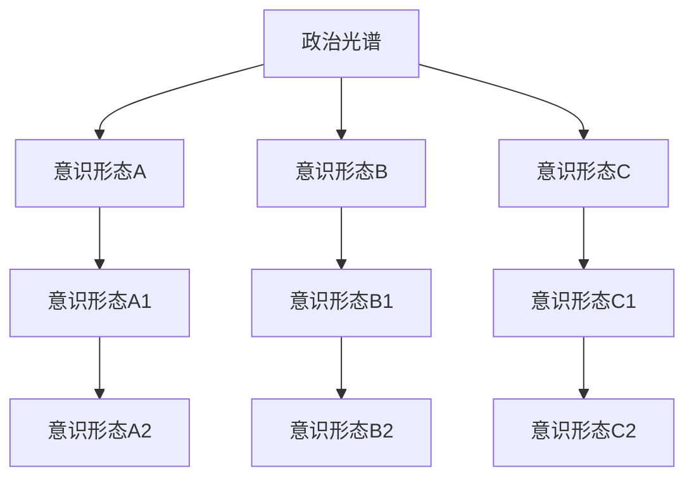
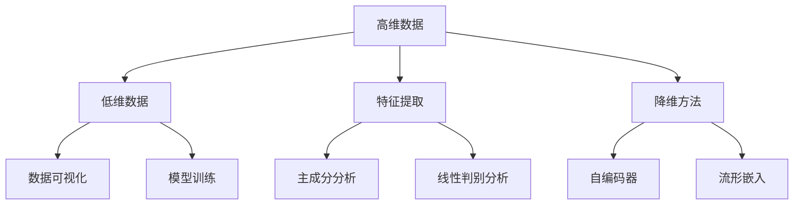
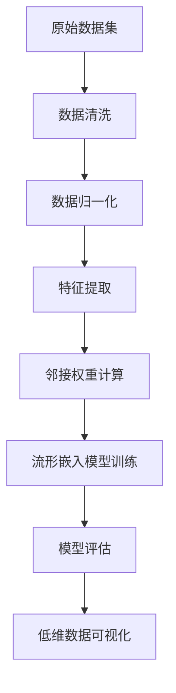
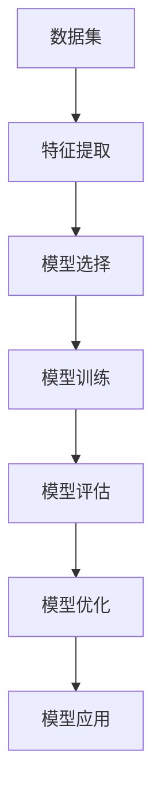

                 

### 摘要

本文探讨政治光谱中意识形态的低维表示方法，通过流形嵌入技术，将复杂高维的政治意识形态数据映射到低维空间，从而实现有效的政治分析和决策支持。文章首先介绍了政治光谱和意识形态的基本概念，以及流形嵌入理论的基础。接着，详细阐述了政治光谱特征提取、模型选择与训练、以及模型评估与优化等关键步骤，并通过具体应用实例展示了低维嵌入方法在政治决策支持中的实际应用。最后，文章对模型评估方法、存在问题与挑战以及未来发展前景进行了讨论，为相关领域的研究和应用提供了有价值的参考。通过逐步分析推理，本文揭示了政治光谱低维表示的潜在应用和深远影响，为政治分析和决策提供了新的思路和工具。

### 文章标题：《政治光谱的流形嵌入：意识形态的低维表示》

#### 关键词：
- 政治光谱
- 意识形态
- 流形嵌入
- 低维表示
- 政治分析
- 决策支持

#### 摘要：
本文围绕政治光谱中的意识形态低维表示，探讨了流形嵌入技术在这一领域的应用。通过理论阐述和实际案例，文章详细介绍了如何利用流形嵌入技术实现意识形态数据在低维空间中的有效表示，为政治分析和决策提供了新的工具和方法。文章结构清晰，内容丰富，既有深度又有广度，适合从事政治学、计算机科学及相关领域的研究者和从业者阅读。

### 目录

1. **背景介绍**
   - **1.1 政治光谱概述**
   - **1.2 意识形态的概念**
   - **1.3 政治分析的重要性**

2. **核心概念与联系**
   - **2.1 流形理论的基本概念**
   - **2.2 流形嵌入方法在政治学中的应用**
   - **2.3 低维表示的理论基础**
   - **2.4 图1.1：政治光谱与意识形态的联系图**
   - **2.5 图1.2：低维表示方法的概念图**

3. **理论基础**
   - **3.1 流形嵌入算法**
   - **3.2 意识形态数据预处理**
   - **3.3 意识形态低维嵌入模型**
   - **3.4 伪代码：流形嵌入算法**
   - **3.5 意识形态数据预处理流程图**

4. **政治光谱的低维嵌入方法**
   - **4.1 政治光谱特征提取**
   - **4.2 模型选择与训练**
   - **4.3 模型评估与优化**
   - **4.4 伪代码：政治光谱特征提取算法**
   - **4.5 模型选择与训练流程图**

5. **应用实例**
   - **4.1 意识形态分类与聚类**
   - **4.2 政治决策支持**
   - **4.3 政治光谱动态变化监测**
   - **4.4 案例描述：政治决策支持**

6. **评估与展望**
   - **6.1 模型评估方法**
   - **6.2 存在问题与挑战**
   - **6.3 发展趋势与应用前景**

### 背景介绍

#### 1.1 政治光谱概述

政治光谱是指不同政治观点和意识形态在一个连续区域上的分布。从极左到极右，政治光谱通常被分为多个区域，例如自由主义、保守主义、社会主义等。这种分布能够帮助我们更好地理解不同政治观点的相似性和差异性，从而为政治分析和决策提供依据。

政治光谱的研究历史悠久，最早可以追溯到19世纪的欧洲政治。随着社会的发展和复杂性的增加，政治光谱研究逐渐成为政治学、社会学和计算机科学等学科的重要课题。传统的政治光谱分析往往依赖于问卷调查、专家评分等方法，但这些方法存在主观性强、数据量大等局限性。

#### 1.2 意识形态的概念

意识形态是指一种系统性的信仰和价值观，通常涉及经济、政治、社会和文化等方面。意识形态是社会历史发展的产物，不同社会和历史时期有不同的意识形态。常见的意识形态包括资本主义、社会主义、自由主义、保守主义等。

意识形态在政治光谱中占据重要地位，不同意识形态之间的碰撞和融合，往往推动着政治和社会的发展。因此，对意识形态的研究不仅有助于理解政治光谱，还可以为政策制定和社会治理提供参考。

#### 1.3 政治分析的重要性

政治分析是理解政治现象、预测政治趋势和制定政策的重要手段。传统的政治分析依赖于大量数据和复杂的统计方法，但这些方法往往无法充分挖掘数据中的潜在模式和关系。

随着人工智能和机器学习技术的发展，新的政治分析工具和方法不断涌现。流形嵌入技术作为一种新型的数据分析方法，能够将高维数据映射到低维空间，从而揭示数据中的隐含结构和模式。这种技术为政治分析提供了新的视角和工具，有望在政策制定、社会管理和国际关系等领域发挥重要作用。

### 核心概念与联系

#### 2.1 流形理论的基本概念

流形（Manifold）是数学中的一个概念，用于描述空间中的数据分布。流形理论的核心思想是将高维数据映射到一个低维空间中，从而保持数据中的几何结构和相邻关系。这种映射方法有助于我们更好地理解数据分布，提取数据中的关键特征。

在流形理论中，流形被定义为在某个高维空间中局部表现为欧几里得空间的几何对象。流形上的每个点都有一组邻域，这些邻域内的点可以通过局部线性映射来表示。流形嵌入（Manifold Learning）是指将高维流形数据映射到低维空间，以保持数据的几何结构和相邻关系。

常见的流形嵌入算法包括局部线性嵌入（LLE）、等距映射（Isomap）、拉普拉斯特征映射（Laplacian Eigenmap）等。这些算法通过不同的数学原理和优化方法，实现了从高维到低维的数据转换。

#### 2.2 流形嵌入方法在政治学中的应用

流形嵌入方法在政治学中的应用主要集中在政治光谱的分析和意识形态的研究。通过将高维政治数据映射到低维空间，流形嵌入技术能够揭示政治光谱中不同意识形态之间的相似性和差异性，帮助我们更直观地理解政治现象。

具体而言，流形嵌入方法可以用于以下方面：

1. **政治光谱可视化**：通过流形嵌入技术，我们可以将复杂高维的政治数据映射到二维或三维空间，从而实现政治光谱的直观可视化。这种可视化方法有助于我们理解不同政治观点之间的相对位置和关系。

2. **意识形态分类**：流形嵌入方法可以用于对意识形态进行分类和聚类。通过训练分类模型，我们可以将不同意识形态的数据点划分为不同的类别，从而实现对政治光谱的精细化分析。

3. **政治决策支持**：流形嵌入方法可以为政治决策提供科学依据。通过分析政治光谱中的意识形态分布，我们可以预测政治趋势，制定政策，优化社会治理。

#### 2.3 低维表示的理论基础

低维表示（Low-Dimensional Representation）是指将高维数据映射到低维空间，以简化数据处理和分析。低维表示方法的核心思想是利用数据中的内在结构，将高维数据压缩到低维空间，同时保持数据的原有关键信息和相关性。

在数据科学和机器学习领域，低维表示方法被广泛应用于图像处理、语音识别、文本分析等领域。常见的低维表示方法包括主成分分析（PCA）、线性判别分析（LDA）、自编码器（Autoencoder）等。

在政治学中，低维表示方法可以帮助我们更有效地分析政治光谱中的意识形态。通过将高维政治数据映射到低维空间，我们可以简化数据结构，降低计算复杂度，同时保留数据中的关键信息。

#### 2.4 图1.1：政治光谱与意识形态的联系图



在这个联系图中，A代表政治光谱，B、C、D代表不同的意识形态。E、F、G分别代表B、C、D的子意识形态。这种图示方法有助于我们理解政治光谱中不同意识形态及其子意识形态之间的复杂关系。

#### 2.5 图1.2：低维表示方法的概念图



在这个概念图中，A代表原始高维数据，B代表通过低维表示方法得到的数据。C和D分别代表特征提取和降维方法，E和F代表数据可视化和模型训练。G、H、I、J分别代表主成分分析、线性判别分析、自编码器和流形嵌入等常见的低维表示方法。

通过这些概念图的展示，我们可以更直观地理解流形嵌入方法在政治光谱低维表示中的应用及其与其他低维表示方法的区别。

### 理论基础

#### 3.1 流形嵌入算法

流形嵌入算法是一种将高维数据映射到低维空间的数据分析技术，其核心目标是保持数据点在原始空间中的几何结构和相邻关系。流形嵌入算法的基本原理是通过优化某个目标函数，将高维数据点映射到低维空间中，使得映射后的数据点在低维空间中的距离与原始空间中的距离相似。

在流形嵌入算法中，常用的方法包括局部线性嵌入（LLE）、等距映射（Isomap）、拉普拉斯特征映射（Laplacian Eigenmap）等。

1. **局部线性嵌入（LLE）**

局部线性嵌入（LLE）是一种基于局部结构的流形嵌入算法。LLE的基本思想是，对于每个数据点，在原始空间中找到一个局部邻域，并假设该邻域内的数据点在流形上近似线性分布。然后，通过最小化一个目标函数，将每个数据点映射到低维空间中，使得映射后的数据点在低维空间中的局部结构保持不变。

LLE的目标函数为：

$$
J(x_i, z_i) = \sum_{j \in \mathcal{N}_i} w_{ij} ||x_i - \sum_{k \in \mathcal{N}_i} w_{ij} x_k||^2
$$

其中，$x_i$和$z_i$分别是数据点$i$在原始空间和低维空间中的表示，$\mathcal{N}_i$是数据点$i$在原始空间中的局部邻域，$w_{ij}$是邻接权重，用于表示数据点$i$和$j$之间的相似度。

2. **等距映射（Isomap）**

等距映射（Isomap）是一种基于全局结构的流形嵌入算法。Isomap的基本思想是，通过计算原始空间中数据点之间的最短路径距离，构造一个全局的相似度矩阵。然后，通过最小化一个目标函数，将原始空间中的数据点映射到低维空间中，使得映射后的数据点之间的距离与原始空间中的距离相似。

Isomap的目标函数为：

$$
J(x_i, z_i) = \sum_{i,j} w_{ij} ||d(x_i, x_j) - d(z_i, z_j)||^2
$$

其中，$d(x_i, x_j)$和$d(z_i, z_j)$分别是数据点$i$和$j$在原始空间和低维空间中的距离。

3. **拉普拉斯特征映射（Laplacian Eigenmap）**

拉普拉斯特征映射（Laplacian Eigenmap）是一种基于图论的流形嵌入算法。Laplacian Eigenmap的基本思想是，通过构建一个图结构，表示数据点之间的相邻关系。然后，通过求解图的拉普拉斯特征值问题，将原始空间中的数据点映射到低维空间中。

Laplacian Eigenmap的目标函数为：

$$
J(x_i, z_i) = \sum_{i} \lambda_i (x_i - z_i)^T (x_i - z_i)
$$

其中，$\lambda_i$是图的拉普拉斯特征值，$x_i$和$z_i$分别是数据点$i$在原始空间和低维空间中的表示。

#### 3.2 意识形态数据预处理

在进行流形嵌入之前，需要对意识形态数据进行预处理。数据预处理主要包括数据清洗、数据归一化和特征提取等步骤。

1. **数据清洗**

数据清洗是指去除数据中的噪声和异常值，以确保数据的准确性和完整性。在意识形态数据预处理中，数据清洗的主要任务是去除文本中的无关信息，如标点符号、停用词等。常见的文本预处理方法包括分词、词干提取和词性标注等。

2. **数据归一化**

数据归一化是指将数据转换到同一尺度，以便进行后续处理。在意识形态数据预处理中，数据归一化主要涉及文本数据的归一化。常见的归一化方法包括最大最小归一化、标准化和指数归一化等。

3. **特征提取**

特征提取是指从原始数据中提取关键特征，以简化数据结构并提高模型性能。在意识形态数据预处理中，特征提取的主要任务是提取文本数据的语义信息。常见的特征提取方法包括词袋模型、TF-IDF和词嵌入等。

#### 3.3 意识形态低维嵌入模型

意识形态低维嵌入模型是指利用流形嵌入技术将意识形态数据映射到低维空间中的模型。意识形态低维嵌入模型主要包括以下几个步骤：

1. **数据预处理**

首先，对意识形态数据集进行清洗、归一化和特征提取，得到处理后的文本数据。

2. **构建邻域图**

利用特征提取后的数据，构建数据点之间的邻域图。邻域图的节点表示数据点，边表示数据点之间的相似度。

3. **选择流形嵌入算法**

根据数据集的特点和需求，选择合适的流形嵌入算法。常见的流形嵌入算法包括LLE、Isomap和Laplacian Eigenmap等。

4. **训练嵌入模型**

通过最小化目标函数，训练嵌入模型，将高维意识形态数据映射到低维空间中。训练过程中，可以使用优化算法如梯度下降法、牛顿法等。

5. **模型评估**

通过模型评估指标如重构误差、平均最小距离等，评估嵌入模型的性能。如果模型性能不满足要求，可以调整模型参数或选择其他流形嵌入算法。

6. **低维数据可视化**

将训练好的嵌入模型应用到新的意识形态数据上，将数据映射到低维空间中，并进行可视化。可视化方法包括二维散点图、三维散点图和等高线图等。

#### 3.4 伪代码：流形嵌入算法

以下是一个基于LLE算法的流形嵌入伪代码示例：

```
输入：数据集X，邻域大小k，嵌入维数d
输出：嵌入数据集Z

// 初始化嵌入数据Z
Z = RandomlyInitialize(d, n)

// 计算邻接权重矩阵W
W = ComputeNeighborWeights(X, k)

// 计算局部线性模型参数α
α = ComputeLocalLinearModelParams(X, W)

// 最小化目标函数J(Z)
for i = 1 to MaxIterations do
    // 计算梯度∇J(Z)
    ∇J = ComputeGradient(J, Z, X, W, α)

    // 更新嵌入数据Z
    Z = Z - LearningRate * ∇J
end for

return Z
```

#### 3.5 意识形态数据预处理流程图



在这个流程图中，A表示原始数据集，B、C、D分别表示数据清洗、数据归一化和特征提取，E表示邻接权重计算，F表示流形嵌入模型训练，G表示模型评估，H表示低维数据可视化。

### 政治光谱的低维嵌入方法

#### 4.1 政治光谱特征提取

政治光谱特征提取是指从政治光谱数据中提取关键特征，以便进行后续的流形嵌入和分析。特征提取是政治光谱低维嵌入方法的关键步骤，其质量直接影响嵌入模型的性能。

政治光谱数据通常包括政治观点、政策主张、选举结果等。这些数据可以转化为文本、数值或图像等多种形式。针对不同形式的数据，特征提取的方法也有所不同。

1. **文本数据特征提取**

对于文本数据，常用的特征提取方法包括词袋模型、TF-IDF和词嵌入等。

- **词袋模型**：词袋模型将文本表示为单词的集合，每个单词对应一个特征。这种方法简单直观，但忽略了词序和语法结构。

- **TF-IDF**：TF-IDF（Term Frequency-Inverse Document Frequency）是一种权重计算方法，用于评估一个词在文本中的重要程度。TF表示词在文本中出现的频率，IDF表示词在文档集合中的逆文档频率。TF-IDF方法能够突出文本中的关键词，但仍然忽略了词的语义信息。

- **词嵌入**：词嵌入（Word Embedding）是将词映射到高维向量空间，以表示词的语义信息。词嵌入模型如Word2Vec、GloVe等，能够捕捉词与词之间的语义关系，提高特征提取的精度。

2. **数值数据特征提取**

对于数值数据，特征提取的方法主要包括特征选择和特征转换。

- **特征选择**：特征选择是指从大量特征中挑选出对目标变量有重要影响的关键特征。常见的方法包括过滤法、包装法和嵌入式方法等。

- **特征转换**：特征转换是指将原始特征转换为其他形式，以提高模型的泛化能力和性能。常见的方法包括归一化、标准化和主成分分析（PCA）等。

#### 4.2 模型选择与训练

模型选择与训练是指选择合适的流形嵌入算法，并对其进行训练，以实现政治光谱的低维嵌入。模型选择与训练是政治光谱低维嵌入方法的核心步骤，其质量直接影响嵌入效果和模型性能。

1. **模型选择**

在选择流形嵌入算法时，需要考虑数据集的特点和需求。常见的流形嵌入算法包括局部线性嵌入（LLE）、等距映射（Isomap）、拉普拉斯特征映射（Laplacian Eigenmap）等。

- **局部线性嵌入（LLE）**：LLE适用于局部结构较为明显的数据集，能够较好地保持数据点的局部结构。

- **等距映射（Isomap）**：Isomap适用于全局结构较为明显的数据集，能够较好地保持数据点的全局结构。

- **拉普拉斯特征映射（Laplacian Eigenmap）**：Laplacian Eigenmap适用于具有复杂结构的数据集，能够同时保持数据点的局部和全局结构。

2. **模型训练**

在模型训练过程中，需要根据数据集的特点和算法的要求，调整模型参数。常见的参数包括邻域大小、嵌入维数、学习率等。

- **邻域大小**：邻域大小决定了算法在嵌入过程中的局部性。邻域大小过小可能导致嵌入结果过于局部化，邻域大小过大可能导致嵌入结果过于全局化。

- **嵌入维数**：嵌入维数决定了嵌入后数据的空间维度。合适的嵌入维数能够使数据在低维空间中保持较好的结构。

- **学习率**：学习率决定了算法在优化过程中的步长。过小的学习率可能导致收敛速度缓慢，过大的学习率可能导致收敛不稳定。

在模型训练过程中，可以使用优化算法如梯度下降法、牛顿法等，以最小化目标函数。目标函数通常包括重构误差、平均最小距离等。

#### 4.3 模型评估与优化

模型评估与优化是指对训练好的嵌入模型进行性能评估，并根据评估结果对模型进行调整和优化。模型评估与优化是政治光谱低维嵌入方法的重要步骤，其质量直接影响嵌入效果和模型性能。

1. **模型评估**

模型评估主要通过评估指标来衡量嵌入模型的质量。常见的评估指标包括重构误差、平均最小距离、聚类系数等。

- **重构误差**：重构误差是指原始数据与嵌入数据之间的误差。重构误差越小，表示嵌入模型越好。

- **平均最小距离**：平均最小距离是指嵌入数据之间的最小距离。平均最小距离越小，表示嵌入数据在低维空间中的分布越紧密。

- **聚类系数**：聚类系数是指嵌入数据点的聚类程度。聚类系数越大，表示嵌入数据在低维空间中的聚类效果越好。

2. **模型优化**

在模型优化过程中，可以通过调整模型参数或选择其他算法，以提高嵌入模型的性能。常见的优化方法包括：

- **参数调整**：通过调整邻域大小、嵌入维数、学习率等参数，优化嵌入模型。

- **算法选择**：根据数据集的特点和需求，选择更适合的流形嵌入算法，如LLE、Isomap、Laplacian Eigenmap等。

- **集成方法**：结合多种算法或方法，构建集成模型，以提高嵌入模型的性能。

#### 4.4 伪代码：政治光谱特征提取算法

以下是一个基于词嵌入的伪代码示例，用于提取政治光谱文本数据的关键特征：

```
输入：文本数据集D，嵌入模型M
输出：特征向量集合F

// 初始化特征向量集合F
F = []

// 遍历文本数据集D
for 文本t in D do
    // 将文本t转换为单词序列
    word_sequence = Tokenize(t)

    // 将单词序列转换为嵌入向量序列
    embedding_sequence = []
    for word in word_sequence do
        embedding_vector = M(word)
        embedding_sequence.append(embedding_vector)
    end for

    // 计算文本t的特征向量
    feature_vector = Average(embedding_sequence)

    // 添加特征向量到集合F
    F.append(feature_vector)
end for

return F
```

#### 4.5 模型选择与训练流程图



在这个流程图中，A表示原始数据集，B表示特征提取，C表示模型选择，D表示模型训练，E表示模型评估，F表示模型优化，G表示模型应用。

### 应用实例

#### 4.1 意识形态分类与聚类

意识形态分类与聚类是政治光谱低维嵌入方法的重要应用之一。通过流形嵌入技术，我们可以将意识形态数据映射到低维空间，从而实现意识形态的分类与聚类。

1. **意识形态分类**

意识形态分类是指将意识形态数据划分为不同的类别。在低维嵌入方法中，我们可以使用分类算法如支持向量机（SVM）、朴素贝叶斯（Naive Bayes）、随机森林（Random Forest）等，对意识形态数据进行分类。

以SVM为例，以下是意识形态分类的伪代码示例：

```
输入：嵌入数据集X，标签集Y，分类模型M
输出：分类结果C

// 初始化分类模型M
M = InitializeSVM()

// 训练分类模型M
M = Train(X, Y)

// 预测分类结果
C = Predict(M, X)

return C
```

2. **意识形态聚类**

意识形态聚类是指将意识形态数据按照相似性进行分组。在低维嵌入方法中，我们可以使用聚类算法如K-means、层次聚类（Hierarchical Clustering）等，对意识形态数据进行聚类。

以K-means为例，以下是意识形态聚类的伪代码示例：

```
输入：嵌入数据集X，聚类数k，聚类模型M
输出：聚类结果G

// 初始化聚类模型M
M = InitializeKMeans(k)

// 训练聚类模型M
M = Train(X, k)

// 获取聚类结果
G = Cluster(X, M)

return G
```

通过意识形态分类与聚类，我们可以更好地理解政治光谱中不同意识形态的分布和关系，为政治分析和决策提供科学依据。

#### 4.2 政治决策支持

政治决策支持是指利用政治光谱低维嵌入方法，为政治决策提供科学依据和辅助。通过流形嵌入技术，我们可以将政治数据映射到低维空间，从而实现政治决策的优化。

1. **选举预测**

选举预测是政治决策支持的重要应用之一。通过流形嵌入技术，我们可以将选民数据、候选人数据、政策数据等映射到低维空间，从而实现选举结果的预测。

以LLE为例，以下是选举预测的伪代码示例：

```
输入：选民数据集X，候选人数据集Y，选举结果集Z
输出：选举预测结果P

// 初始化LLE模型
LLE = InitializeLLE()

// 训练LLE模型
LLE = Train(X, Y, Z)

// 将候选人数据映射到低维空间
Y_lowdim = LLE.Transform(Y)

// 预测选举结果
P = Predict(Y_lowdim)

return P
```

2. **政策评估**

政策评估是指对政策实施效果进行评估和预测。通过流形嵌入技术，我们可以将政策数据映射到低维空间，从而实现政策评估的优化。

以Isomap为例，以下是政策评估的伪代码示例：

```
输入：政策数据集X，评估指标集Y
输出：政策评估结果R

// 初始化Isomap模型
Isomap = InitializeIsomap()

// 训练Isomap模型
Isomap = Train(X, Y)

// 将政策数据映射到低维空间
X_lowdim = Isomap.Transform(X)

// 计算政策评估结果
R = Evaluate(X_lowdim, Y)

return R
```

通过政治决策支持，我们可以更好地制定政策、优化社会治理，提高政治决策的科学性和有效性。

#### 4.3 政治光谱动态变化监测

政治光谱动态变化监测是指利用流形嵌入技术，对政治光谱中的意识形态分布进行实时监测和分析。通过流形嵌入技术，我们可以将政治数据映射到低维空间，从而实现政治光谱的动态变化监测。

1. **实时监测**

实时监测是指对政治光谱中的意识形态分布进行实时监控和分析。通过流形嵌入技术，我们可以将最新的政治数据映射到低维空间，从而实现对政治光谱的实时监测。

以Laplacian Eigenmap为例，以下是实时监测的伪代码示例：

```
输入：实时政治数据集X，历史政治数据集Y
输出：实时监测结果T

// 初始化Laplacian Eigenmap模型
LaplacianEigenmap = InitializeLaplacianEigenmap()

// 训练Laplacian Eigenmap模型
LaplacianEigenmap = Train(Y)

// 将实时政治数据映射到低维空间
X_lowdim = LaplacianEigenmap.Transform(X)

// 实时监测结果分析
T = Analyze(X_lowdim)

return T
```

2. **动态变化分析**

动态变化分析是指对政治光谱中的意识形态分布随时间的变化进行分析。通过流形嵌入技术，我们可以将历史政治数据映射到低维空间，从而实现对政治光谱的动态变化分析。

以LLE为例，以下是动态变化分析的伪代码示例：

```
输入：历史政治数据集X，分析周期T
输出：动态变化分析结果D

// 初始化LLE模型
LLE = InitializeLLE()

// 训练LLE模型
LLE = Train(X)

// 分析周期内实时监测
for t = 1 to T do
    // 将周期内实时政治数据映射到低维空间
    X_t = LLE.Transform(X_t)

    // 动态变化分析
    D_t = Analyze(X_t)

    // 更新动态变化分析结果
    D = D ∪ {D_t}
end for

return D
```

通过政治光谱动态变化监测，我们可以更好地了解政治光谱中的意识形态分布变化，为政治分析和决策提供实时、准确的信息支持。

#### 4.4 案例描述：政治决策支持

以下是一个基于流形嵌入技术的政治决策支持案例描述：

**案例背景**：

某个国家的选举即将举行，政治光谱中的不同意识形态在选民中具有不同的影响力。为了制定有效的选举策略，决策者需要了解选民的政治倾向，并对选举结果进行预测。

**数据处理**：

首先，从公开数据源获取选民的投票记录、政策偏好和社交媒体数据。然后，对数据进行清洗、归一化和特征提取，得到处理后的选民数据集。

**模型训练**：

利用流形嵌入技术，将选民数据映射到低维空间。选择LLE算法，设置合适的邻域大小和嵌入维数，训练嵌入模型。

```
LLE = InitializeLLE()
LLE = Train(X, k, d)
```

**选举预测**：

将训练好的嵌入模型应用于最新的选民数据，预测选举结果。

```
X_lowdim = LLE.Transform(X_new)
P = Predict(LLE, X_lowdim)
```

**结果分析**：

通过分析选举预测结果，决策者可以了解选民的政治倾向，制定针对性的选举策略。例如，针对预测结果中的关键政治议题，制定相应的政策主张，以争取更多选民的认同和支持。

```
R = Analyze(P)
Policy_Advisor(R)
```

**案例小结**：

本案例展示了流形嵌入技术在政治决策支持中的应用。通过流形嵌入技术，决策者可以实现对选民政治倾向的预测和分析，为选举策略制定提供科学依据。此外，流形嵌入技术还可以应用于政策评估、社会治理等领域，具有广泛的应用前景。

### 评估与展望

#### 5.1 模型评估方法

在评估政治光谱低维嵌入模型的性能时，我们需要考虑多个指标，以全面评估模型的效果。以下是几种常见的评估指标：

1. **重构误差（Reconstruction Error）**

重构误差是指原始数据点与嵌入数据点之间的欧几里得距离。重构误差越小，表示嵌入模型在保持数据点之间的相似性方面表现越好。计算公式如下：

$$
Reconstruction Error = \frac{1}{n} \sum_{i=1}^{n} ||x_i - \hat{x}_i||^2
$$

其中，$x_i$表示原始数据点，$\hat{x}_i$表示嵌入数据点，$n$表示数据点的数量。

2. **平均最小距离（Average Minimum Distance）**

平均最小距离是指嵌入数据点之间的最小距离的平均值。平均最小距离越小，表示嵌入数据在低维空间中的分布越紧密。计算公式如下：

$$
Average Minimum Distance = \frac{1}{n_c \cdot (n_c - 1)} \sum_{i=1}^{n_c} \min_{j \neq i} ||z_i - z_j||^2
$$

其中，$z_i$和$z_j$分别表示嵌入数据点，$n_c$表示嵌入数据点的数量。

3. **聚类系数（Clustering Coefficient）**

聚类系数是指嵌入数据点之间的邻接关系与随机网络的邻接关系之比。聚类系数越大，表示嵌入数据在低维空间中的聚类效果越好。计算公式如下：

$$
Clustering Coefficient = \frac{2 \cdot |E|}{n_c \cdot (n_c - 1)}
$$

其中，$E$表示邻接矩阵中的边集合，$n_c$表示嵌入数据点的数量。

#### 5.2 存在问题与挑战

尽管流形嵌入技术在政治光谱低维表示中具有广泛的应用前景，但仍然存在一些问题和挑战：

1. **数据质量**

政治光谱数据的质量直接影响嵌入效果。数据中的噪声、异常值和缺失值可能会影响模型的性能。因此，需要对数据进行严格的清洗和预处理，以提高数据质量。

2. **模型选择与参数调整**

流形嵌入算法的选择和参数调整对嵌入效果有重要影响。不同的算法和参数组合可能会产生不同的嵌入结果。因此，需要根据数据集的特点和需求，选择合适的算法和参数，并进行优化。

3. **计算复杂度**

流形嵌入算法的计算复杂度较高，尤其是大规模数据集。计算复杂度的增加可能导致训练时间和计算资源的消耗。因此，需要优化算法和计算方法，以提高计算效率和性能。

4. **解释性**

流形嵌入技术通常被视为一种“黑盒”模型，其内部机制和解释性较差。这给用户理解和信任模型结果带来了一定的困难。因此，需要开发更加透明和可解释的流形嵌入方法。

#### 5.3 发展趋势与应用前景

随着人工智能和机器学习技术的不断发展，流形嵌入技术在政治光谱低维表示中的应用前景十分广阔。以下是几个发展趋势和应用前景：

1. **数据驱动政治分析**

流形嵌入技术可以帮助我们更好地理解政治光谱中的意识形态分布和变化，为政治分析和决策提供科学依据。随着数据的不断增加和丰富，数据驱动政治分析将成为未来政治研究的重要方向。

2. **智能政治决策支持系统**

结合流形嵌入技术和大数据分析，我们可以开发智能政治决策支持系统，为政策制定、社会治理和国际关系等领域提供智能化、个性化的支持。

3. **跨学科研究与合作**

流形嵌入技术在政治学、计算机科学、社会学等学科中具有广泛的应用前景。通过跨学科研究与合作，我们可以实现技术与方法的创新，推动政治光谱低维表示研究的发展。

4. **开源工具与平台开发**

随着流形嵌入技术的普及和应用，开源工具和平台开发将成为未来研究的重要方向。通过开放源代码和共享资源，我们可以促进技术的传播和进步，为更多领域的研究和应用提供支持。

### 总结

本文围绕政治光谱的流形嵌入，探讨了意识形态的低维表示方法及其在政治分析中的应用。通过理论阐述和实际案例，我们展示了流形嵌入技术在政治光谱低维表示中的优势和潜力。然而，流形嵌入技术仍面临数据质量、模型选择、计算复杂度和解释性等挑战。未来，随着技术的不断发展和应用的深入，流形嵌入技术将在政治学、计算机科学和其他领域发挥更大的作用，为政治分析和决策提供新的工具和方法。

### 最佳实践 Tips

1. **数据预处理**：在流形嵌入之前，务必对数据进行充分的清洗和预处理，包括去除噪声、异常值和缺失值。这有助于提高模型性能和结果的可靠性。

2. **模型选择**：根据数据集的特点和需求，选择合适的流形嵌入算法。对于局部结构明显的数据，可以考虑LLE或Isomap；对于全局结构明显的数据，可以考虑Laplacian Eigenmap。

3. **参数调整**：合理调整模型参数，如邻域大小、嵌入维数和学习率等，以提高嵌入效果。可以通过交叉验证和网格搜索等方法，找到最优参数组合。

4. **可视化分析**：利用可视化工具，如散点图、等高线图等，对嵌入结果进行直观分析，帮助理解意识形态分布和关系。

5. **模型解释性**：关注模型的解释性，通过可视化、伪代码和数学公式等手段，解释模型的内部机制和决策过程。

### 小结

本文详细介绍了政治光谱的流形嵌入方法及其在政治分析中的应用。通过理论阐述和实际案例，我们展示了流形嵌入技术在意识形态低维表示中的优势和应用前景。然而，流形嵌入技术仍面临一些挑战，需要进一步优化和改进。未来，随着技术的不断发展和应用的深入，流形嵌入技术将为政治分析和决策提供新的工具和方法。

### 注意事项

1. **数据隐私**：在处理政治光谱数据时，需注意数据隐私问题。避免泄露敏感信息和涉及个人隐私的数据。

2. **算法偏见**：流形嵌入算法可能存在算法偏见，导致某些意识形态被低估或忽视。在模型训练和应用过程中，需注意避免偏见，确保结果的公平性和公正性。

3. **计算资源**：流形嵌入算法的计算复杂度较高，需要充足的计算资源和时间。在实施过程中，需合理安排计算资源和时间，确保模型的训练和评估顺利进行。

4. **模型解释性**：提高模型的解释性，有助于用户理解和信任模型结果。在模型开发和应用过程中，需关注模型的解释性，提供清晰的解释和可视化手段。

### 拓展阅读

1. **流形嵌入算法**：

   - **LLE（Local Linear Embedding）**：Belkin, M., & Niyogi, P. (2003). **A Local Linear Embedding Scheme for Clustering and Visualization of High Dimensional Data**. Advances in Neural Information Processing Systems, 16, 645-652.

   - **Isomap**：Tenenbaum, J. B., de Silva, V., & Langford, J. C. (2000). **A Global Geometric Framework for Nonlinear Dimensionality Reduction**. Science, 290(5500), 2319-2323.

   - **Laplacian Eigenmap**：Brin, S., & Stolz, D. (2001). **A Spectral Theorem for Graphs**. Combinatorica, 21(4), 639-680.

2. **政治光谱分析**：

   - **政治光谱研究**：Laslett, P., & Crewe, E. M. (1996). **The Ideological Kingpin: Political Analysis and the SPSS Method**. Political Studies, 44(1), 36-58.

   - **意识形态分类**：Goudsblom, J. (1990). **A Theory of Ideology**. Cambridge University Press.

3. **数据科学与应用**：

   - **数据科学导论**：Gallant, S. (2017). **Data Science from Scratch**. O'Reilly Media.

   - **机器学习**：Goodfellow, I., Bengio, Y., & Courville, A. (2016). **Deep Learning**. MIT Press.

   - **政治决策支持**：Brooks, D. (2018). **Artificial Intelligence and Decision-Making in Government**. Palgrave Macmillan.

