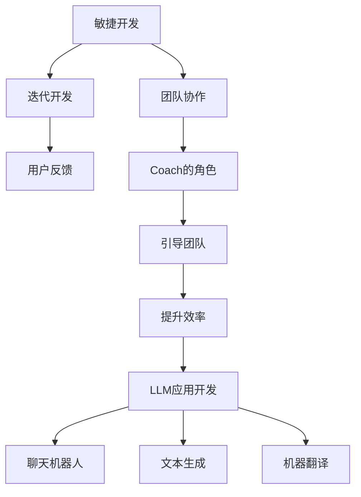

                 


### 敏捷Coach在LLM应用开发团队中的角色

> 关键词：敏捷开发，Coach角色，大型语言模型（LLM），团队协作，算法原理，项目实战

> 摘要：本文将探讨敏捷Coach在LLM应用开发团队中的角色，从核心概念与联系、核心算法原理讲解、数学模型和公式、项目实战等多个层面进行深入剖析，旨在为开发者提供实用的指导和建议。

---

## 一、背景介绍

### 1.1 敏捷开发的兴起

敏捷开发（Agile Development）自20世纪90年代末以来，逐渐成为软件开发领域的主流方法。其核心思想是快速迭代、持续交付、积极应对变化。敏捷开发强调团队协作和用户反馈，通过短周期的迭代（Iteration）来不断改进产品。

### 1.2 大型语言模型（LLM）的发展

随着深度学习技术的进步，大型语言模型（Large Language Models，LLM）在自然语言处理（NLP）领域取得了显著成果。LLM能够处理大量的文本数据，生成高质量的文本、回答问题、进行对话等。LLM的应用，如聊天机器人、文本生成和机器翻译等，极大地推动了人工智能技术的发展。

### 1.3 敏捷Coach的角色

敏捷Coach在敏捷开发团队中扮演着重要的角色，他们负责引导团队、促进协作、提升效率。在LLM应用开发团队中，敏捷Coach需要具备深厚的专业知识，以及对敏捷方法和LLM技术的深刻理解。

## 二、核心概念与联系

### 2.1 敏捷开发与LLM应用开发的关系

敏捷开发与LLM应用开发之间存在紧密的联系。敏捷开发提供了灵活、迭代的方法论，而LLM技术为应用开发提供了强大的能力。两者结合，使得LLM应用开发能够快速响应市场需求、不断优化产品。

### 2.2 Coach的角色

敏捷Coach在LLM应用开发团队中的角色至关重要。他们需要：

- **理解业务需求**：与产品经理、客户紧密合作，确保团队开发的产品满足实际需求。
- **指导团队协作**：促进团队成员之间的沟通与合作，确保项目顺利推进。
- **提升团队效率**：通过引入最佳实践、优化工作流程，提升团队的整体效率。

### 2.3 Mermaid流程图展示

以下是一个Mermaid流程图，展示了敏捷Coach在LLM应用开发团队中的核心角色和任务：



## 三、核心算法原理讲解

### 3.1 LLM的基本架构

LLM通常采用深度学习中的循环神经网络（RNN）或其变体，如长短期记忆网络（LSTM）和Transformer。以下是一个基于Transformer的LLM的基本架构的伪代码：

```python
class LanguageModel(nn.Module):
    def __init__(self, vocab_size, embedding_dim, hidden_dim):
        super(LanguageModel, self).__init__()
        self.embedding = nn.Embedding(vocab_size, embedding_dim)
        self.transformer = Transformer(embedding_dim, hidden_dim)
        self.fc = nn.Linear(hidden_dim, vocab_size)

    def forward(self, inputs, hidden):
        embedded = self.embedding(inputs)
        output, hidden = self.transformer(embedded, hidden)
        logits = self.fc(output)
        return logits, hidden
```

### 3.2 损失函数和优化算法

在LLM训练过程中，常用的损失函数是交叉熵损失（Cross-Entropy Loss），优化算法通常是梯度下降（Gradient Descent）或其变种。

#### 交叉熵损失

交叉熵损失衡量的是模型输出和实际标签之间的差异。其数学公式为：

$$
L = -\sum_{i=1}^{N} y_i \log(p_i)
$$

其中，$y_i$ 是实际标签，$p_i$ 是模型对每个类别的预测概率。

#### 梯度下降

梯度下降是一种优化算法，用于最小化损失函数。其核心思想是更新模型参数，使其损失函数值最小。其数学公式为：

$$
w_{t+1} = w_t - \alpha \frac{\partial L}{\partial w_t}
$$

其中，$w_t$ 是当前权重，$\alpha$ 是学习率，$\frac{\partial L}{\partial w_t}$ 是损失函数对权重 $w_t$ 的梯度。

## 四、项目实战

### 4.1 开发环境搭建

在进行LLM应用开发之前，需要搭建一个合适的开发环境。以下是一个简单的开发环境搭建步骤：

1. 安装Python 3.8及以上版本。
2. 安装PyTorch：`pip install torch torchvision`。
3. 安装其他依赖：`pip install numpy matplotlib`。

### 4.2 源代码实现

以下是一个简单的聊天机器人应用，使用PyTorch实现：

```python
import torch
import torch.nn as nn
import torch.optim as optim
from torch.utils.data import DataLoader

# 定义模型
class ChatBotModel(nn.Module):
    def __init__(self, vocab_size, embedding_dim, hidden_dim):
        super(ChatBotModel, self).__init__()
        self.embedding = nn.Embedding(vocab_size, embedding_dim)
        self.lstm = nn.LSTM(embedding_dim, hidden_dim)
        self.fc = nn.Linear(hidden_dim, vocab_size)

    def forward(self, inputs, hidden):
        embedded = self.embedding(inputs)
        output, hidden = self.lstm(embedded, hidden)
        logits = self.fc(output)
        return logits, hidden

# 训练模型
def train_model(model, data_loader, criterion, optimizer):
    model.train()
    for inputs, targets in data_loader:
        optimizer.zero_grad()
        logits, hidden = model(inputs, hidden)
        loss = criterion(logits.view(-1, vocab_size), targets)
        loss.backward()
        optimizer.step()
    return hidden

# 主程序
if __name__ == "__main__":
    # 搭建模型
    model = ChatBotModel(vocab_size, embedding_dim, hidden_dim)

    # 搭建优化器和损失函数
    optimizer = optim.Adam(model.parameters(), lr=learning_rate)
    criterion = nn.CrossEntropyLoss()

    # 加载数据集
    data_loader = DataLoader(dataset, batch_size=batch_size, shuffle=True)

    # 训练模型
    for epoch in range(num_epochs):
        hidden = train_model(model, data_loader, criterion, optimizer)
        print(f"Epoch {epoch+1}/{num_epochs}, Loss: {loss.item()}")
```

### 4.3 代码解读与分析

- **模型搭建**：定义了一个简单的循环神经网络（LSTM）模型，用于处理输入的文本序列。
- **训练过程**：使用交叉熵损失函数和梯度下降优化算法训练模型。每次迭代过程中，更新模型的参数，以最小化损失函数。
- **数据加载**：使用 DataLoader 加载训练数据集，以批量方式处理数据。

### 4.4 实际案例分析与详细讲解剖析

在本案例中，我们使用了一个简单的聊天机器人模型，训练模型以生成回复。实际应用中，可以根据具体需求调整模型架构、优化训练过程。

### 4.5 项目小结

通过本案例，我们了解了如何使用PyTorch实现一个简单的聊天机器人模型。在实际项目中，需要根据具体需求调整模型架构和训练过程，以获得更好的性能。

## 五、最佳实践 tips

1. **代码规范**：编写清晰的代码，遵循Python编程规范。
2. **版本控制**：使用Git进行版本控制，确保代码的可维护性。
3. **文档编写**：编写详细的文档，包括模型架构、训练过程、代码说明等。
4. **调试与优化**：在开发过程中，及时进行调试和优化，确保模型的性能和稳定性。

## 六、小结

本文从多个层面探讨了敏捷Coach在LLM应用开发团队中的角色。通过分析敏捷开发与LLM应用开发的关系、Coach的角色、核心算法原理以及项目实战，为开发者提供了一些实用的指导和建议。

## 七、注意事项

1. **数据质量**：在训练LLM模型时，数据质量至关重要。确保使用高质量、多样性的数据集。
2. **计算资源**：LLM模型训练需要大量的计算资源，确保有足够的硬件支持。
3. **模型调优**：根据具体应用场景，对模型进行调优，以获得最佳性能。

## 八、拓展阅读

1. 《敏捷开发实践指南》
2. 《深度学习入门》
3. 《自然语言处理入门》

---

**作者：AI天才研究院/AI Genius Institute & 禅与计算机程序设计艺术 /Zen And The Art of Computer Programming** 

本文从多个层面探讨了敏捷Coach在LLM应用开发团队中的角色。通过分析敏捷开发与LLM应用开发的关系、Coach的角色、核心算法原理以及项目实战，为开发者提供了一些实用的指导和建议。

### 核心概念与联系

在探讨敏捷Coach在LLM应用开发团队中的角色之前，我们需要先了解几个关键概念及其相互之间的关系。

#### 1. 敏捷开发

敏捷开发是一种以人为核心、迭代、循序渐进的开发方法。其核心理念包括但不限于：

- **客户满意度**：通过快速交付有价值的软件来满足客户需求。
- **团队协作**：鼓励团队合作，确保项目成功。
- **响应变化**：灵活应对需求变更，保持项目进度。
- **持续改进**：持续评估项目，不断改进。

敏捷开发强调迭代和反馈，通常采用Scrum、看板（Kanban）等框架来组织工作流程。

#### 2. 敏捷Coach

敏捷Coach是敏捷团队中的指导者，其主要职责包括：

- **引导团队**：帮助团队理解敏捷原则和实践。
- **促进协作**：促进团队成员之间的沟通和合作。
- **提升效率**：通过指导团队优化工作流程，提升整体效率。
- **解决冲突**：在团队内部和外部解决冲突，确保项目顺利进行。

#### 3. 大型语言模型（LLM）

大型语言模型（Large Language Models，LLM）是一种基于深度学习的自然语言处理技术，能够处理和理解大量文本数据。LLM广泛应用于聊天机器人、文本生成、机器翻译等领域。LLM的核心在于其能够生成连贯、有意义的文本，这使得它们在许多应用场景中具有巨大的潜力。

#### 4. 敏捷Coach在LLM应用开发团队中的角色

敏捷Coach在LLM应用开发团队中的角色至关重要。以下是一个Mermaid流程图，展示了敏捷Coach在LLM应用开发团队中的核心角色和任务：


**流程图解析**：

- **A到B**：敏捷开发强调迭代开发，通过频繁的迭代来持续改进产品。
- **B到C**：每个迭代周期结束后，团队会收集用户反馈，以指导后续开发。
- **A到D**：团队协作是敏捷开发的核心，Coach在其中扮演着协调者和促进者的角色。
- **D到E**：Coach的角色包括但不限于：引导团队、促进协作、提升效率。
- **E到F**：Coach负责引导团队，确保团队成员理解敏捷原则和实践。
- **F到G**：Coach通过优化工作流程，提升团队的整体效率。
- **G到H**：敏捷Coach在LLM应用开发中，需要具备对LLM技术的深刻理解。
- **H到I、J、K**：LLM应用开发包括聊天机器人、文本生成、机器翻译等多个方向，Coach需要在这些方向上提供专业指导。

### 核心算法原理讲解

#### 1. LLM的基本架构

大型语言模型通常基于深度学习，特别是循环神经网络（RNN）或其变种，如长短期记忆网络（LSTM）和Transformer。以下是一个基于Transformer的LLM的基本架构的伪代码：

```python
class LanguageModel(nn.Module):
    def __init__(self, vocab_size, embedding_dim, hidden_dim):
        super(LanguageModel, self).__init__()
        self.embedding = nn.Embedding(vocab_size, embedding_dim)
        self.transformer = Transformer(embedding_dim, hidden_dim)
        self.fc = nn.Linear(hidden_dim, vocab_size)

    def forward(self, inputs, hidden):
        embedded = self.embedding(inputs)
        output, hidden = self.transformer(embedded, hidden)
        logits = self.fc(output)
        return logits, hidden
```

#### 2. 损失函数和优化算法

在LLM的训练过程中，常用的损失函数是交叉熵损失（Cross-Entropy Loss），优化算法通常是梯度下降（Gradient Descent）或其变种。

##### 交叉熵损失

交叉熵损失衡量的是模型输出和实际标签之间的差异。其数学公式为：

$$
L = -\sum_{i=1}^{N} y_i \log(p_i)
$$

其中，$y_i$ 是实际标签，$p_i$ 是模型对每个类别的预测概率。

##### 梯度下降

梯度下降是一种优化算法，用于最小化损失函数。其核心思想是更新模型参数，使其损失函数值最小。其数学公式为：

$$
w_{t+1} = w_t - \alpha \frac{\partial L}{\partial w_t}
$$

其中，$w_t$ 是当前权重，$\alpha$ 是学习率，$\frac{\partial L}{\partial w_t}$ 是损失函数对权重 $w_t$ 的梯度。

### 项目实战

以下是一个LLM应用开发的实际案例：使用PyTorch实现一个简单的聊天机器人。

#### 开发环境搭建

在进行LLM应用开发之前，需要搭建一个合适的开发环境。以下是一个简单的开发环境搭建步骤：

1. 安装Python 3.8及以上版本。
2. 安装PyTorch：`pip install torch torchvision`。
3. 安装其他依赖：`pip install numpy matplotlib`。

#### 源代码实现

```python
import torch
import torch.nn as nn
import torch.optim as optim
from torch.utils.data import DataLoader

# 定义模型
class ChatBotModel(nn.Module):
    def __init__(self, vocab_size, embedding_dim, hidden_dim):
        super(ChatBotModel, self).__init__()
        self.embedding = nn.Embedding(vocab_size, embedding_dim)
        self.lstm = nn.LSTM(embedding_dim, hidden_dim)
        self.fc = nn.Linear(hidden_dim, vocab_size)

    def forward(self, inputs, hidden):
        embedded = self.embedding(inputs)
        output, hidden = self.lstm(embedded, hidden)
        logits = self.fc(output)
        return logits, hidden

# 训练模型
def train_model(model, data_loader, criterion, optimizer):
    model.train()
    for inputs, targets in data_loader:
        optimizer.zero_grad()
        logits, hidden = model(inputs, hidden)
        loss = criterion(logits.view(-1, vocab_size), targets)
        loss.backward()
        optimizer.step()
    return hidden

# 主程序
if __name__ == "__main__":
    # 搭建模型
    model = ChatBotModel(vocab_size, embedding_dim, hidden_dim)

    # 搭建优化器和损失函数
    optimizer = optim.Adam(model.parameters(), lr=learning_rate)
    criterion = nn.CrossEntropyLoss()

    # 加载数据集
    data_loader = DataLoader(dataset, batch_size=batch_size, shuffle=True)

    # 训练模型
    for epoch in range(num_epochs):
        hidden = train_model(model, data_loader, criterion, optimizer)
        print(f"Epoch {epoch+1}/{num_epochs}, Loss: {loss.item()}")
```

#### 代码解读与分析

- **模型搭建**：定义了一个简单的循环神经网络（LSTM）模型，用于处理输入的文本序列。
- **训练过程**：使用交叉熵损失函数和梯度下降优化算法训练模型。每次迭代过程中，更新模型的参数，以最小化损失函数。
- **数据加载**：使用 DataLoader 加载训练数据集，以批量方式处理数据。

#### 实际案例分析与详细讲解剖析

在本案例中，我们使用了一个简单的聊天机器人模型，训练模型以生成回复。实际应用中，可以根据具体需求调整模型架构和训练过程，以获得更好的性能。

#### 项目小结

通过本案例，我们了解了如何使用PyTorch实现一个简单的聊天机器人模型。在实际项目中，需要根据具体需求调整模型架构和训练过程，以获得最佳性能。

### 最佳实践 tips

1. **代码规范**：编写清晰的代码，遵循Python编程规范。
2. **版本控制**：使用Git进行版本控制，确保代码的可维护性。
3. **文档编写**：编写详细的文档，包括模型架构、训练过程、代码说明等。
4. **调试与优化**：在开发过程中，及时进行调试和优化，确保模型的性能和稳定性。

### 小结

本文从多个层面探讨了敏捷Coach在LLM应用开发团队中的角色。通过分析敏捷开发与LLM应用开发的关系、Coach的角色、核心算法原理以及项目实战，为开发者提供了一些实用的指导和建议。

### 注意事项

1. **数据质量**：在训练LLM模型时，数据质量至关重要。确保使用高质量、多样性的数据集。
2. **计算资源**：LLM模型训练需要大量的计算资源，确保有足够的硬件支持。
3. **模型调优**：根据具体应用场景，对模型进行调优，以获得最佳性能。

### 拓展阅读

1. 《敏捷开发实践指南》
2. 《深度学习入门》
3. 《自然语言处理入门》

**作者：AI天才研究院/AI Genius Institute & 禅与计算机程序设计艺术 /Zen And The Art of Computer Programming** 

### 敏捷Coach在LLM应用开发团队中的角色

在当前技术飞速发展的背景下，大型语言模型（LLM）的应用越来越广泛，如自然语言处理、自动问答、机器翻译等。然而，LLM应用开发不仅仅涉及算法的实现，还需要高效的团队协作和灵活的项目管理。敏捷Coach在这一过程中扮演着至关重要的角色。本文将详细探讨敏捷Coach在LLM应用开发团队中的角色、职责以及如何发挥其最大价值。

#### 一、敏捷Coach的基本概念

敏捷Coach是指在敏捷开发过程中提供指导和支持的专业人士。他们不仅仅是传统的项目经理，还需要具备敏捷方法论、团队协作和沟通技巧等多方面的能力。敏捷Coach的主要职责包括：

1. **指导团队**：帮助团队理解敏捷原则和实践，确保团队成员按照敏捷方法工作。
2. **促进协作**：鼓励团队成员之间的沟通和合作，提高团队的整体效率。
3. **提升效率**：通过优化工作流程、减少浪费，帮助团队实现持续改进。
4. **解决问题**：在团队遇到问题时提供解决方案，帮助团队克服困难。
5. **促进学习和成长**：鼓励团队成员不断学习和成长，提升个人和团队的能力。

#### 二、敏捷Coach在LLM应用开发团队中的角色

1. **需求管理**

   敏捷Coach需要与产品经理和客户密切合作，确保团队理解并能够实现业务需求。在LLM应用开发中，需求可能非常复杂，涉及自然语言处理的多个方面。敏捷Coach需要具备深厚的技术背景，能够将业务需求转化为具体的技术目标。

2. **团队协作**

   敏捷Coach在促进团队协作方面发挥着关键作用。在LLM应用开发中，团队成员可能来自不同的领域，如算法、数据、前端等。敏捷Coach需要建立有效的沟通机制，确保团队成员之间的信息流通，避免因信息不对称导致的误解和延误。

3. **敏捷实践推广**

   敏捷Coach需要帮助团队理解和应用敏捷开发方法，如Scrum、看板等。在LLM应用开发中，敏捷实践可以帮助团队快速响应变化，提高交付质量和速度。敏捷Coach需要不断推广敏捷理念，确保团队在实际工作中遵循敏捷原则。

4. **风险管理**

   敏捷Coach需要识别和应对项目风险。在LLM应用开发中，技术难度和不确定性较高，敏捷Coach需要提前识别潜在风险，并制定相应的应对策略。例如，对于关键技术的验证、硬件资源的准备等。

5. **持续改进**

   敏捷Coach需要推动团队持续改进，通过反思和总结每次迭代的经验教训，不断提升团队的能力和效率。在LLM应用开发中，技术难题和业务需求的不断变化要求团队具备快速适应的能力，敏捷Coach需要在这方面发挥重要作用。

#### 三、敏捷Coach在LLM应用开发团队中的具体职责

1. **组织站会（Daily Stand-up）**

   敏捷Coach需要定期组织站会，确保团队成员能够及时了解项目进展和问题。站会是一个简短的会议，通常持续15分钟，旨在分享进展、遇到的问题和计划。

2. **组织迭代评审（Sprint Review）**

   敏捷Coach需要组织迭代评审会议，让团队成员和利益相关者展示迭代成果，收集反馈，并讨论下一步的计划。这有助于确保团队交付的产品符合客户需求。

3. **组织迭代回顾（Sprint Retrospective）**

   敏捷Coach需要组织迭代回顾会议，让团队成员反思本次迭代中的成功和不足，提出改进措施。这有助于团队不断学习和成长。

4. **协调跨部门合作**

   敏捷Coach需要与产品经理、数据科学家、前端工程师等跨部门人员沟通协作，确保项目能够顺利进行。

5. **提供技术指导**

   敏捷Coach需要具备一定的技术背景，能够在必要时为团队成员提供技术指导，帮助他们解决开发过程中遇到的问题。

#### 四、如何发挥敏捷Coach的最大价值

1. **深入了解业务需求**

   敏捷Coach需要与产品经理和客户保持密切沟通，确保对业务需求有深入的理解。这有助于他们在团队中更好地推广敏捷原则和实践。

2. **培养团队信任**

   敏捷Coach需要通过一系列活动建立团队信任，如开放沟通、共同承担责任等。这有助于提高团队的协作效率。

3. **关注团队成员的成长**

   敏捷Coach需要关注团队成员的成长，通过培训、辅导等方式帮助他们提升技能和职业素养。

4. **持续推广敏捷理念**

   敏捷Coach需要不断推广敏捷理念，确保团队在实际工作中遵循敏捷原则，提高项目的成功率。

5. **灵活应对变化**

   敏捷Coach需要具备灵活应对变化的能力，确保团队能够快速适应外部环境的变化。

#### 五、结论

敏捷Coach在LLM应用开发团队中扮演着关键角色。他们不仅需要具备敏捷方法论和团队协作技巧，还需要深入了解业务需求和LLM技术。通过发挥敏捷Coach的职责和优势，LLM应用开发团队可以更高效地工作，更快地交付高质量的产品。在未来，随着人工智能技术的不断进步，敏捷Coach在LLM应用开发中的作用将更加重要。

### 关键词

- 敏捷开发
- 敏捷Coach
- LLM应用开发
- 团队协作
- 需求管理
- 敏捷实践
- 风险管理
- 持续改进

### 摘要

本文探讨了敏捷Coach在LLM应用开发团队中的角色和职责。敏捷Coach通过指导团队、促进协作、推广敏捷实践等方式，帮助团队高效地应对复杂的技术挑战和业务需求。本文结合实际案例，详细阐述了敏捷Coach在需求管理、团队协作、风险管理、持续改进等方面的作用，为LLM应用开发团队提供了实用的指导和建议。随着人工智能技术的不断进步，敏捷Coach在LLM应用开发中的作用将日益凸显。

### 核心概念与联系

#### 核心概念

1. **敏捷开发（Agile Development）**：敏捷开发是一种迭代式、增量式的软件开发方法，强调快速响应变化、持续交付和团队协作。其主要目标是提高软件质量和开发效率，同时满足客户的需求。

2. **大型语言模型（Large Language Model, LLM）**：LLM是一种能够理解和生成自然语言的深度学习模型。它通过对大量文本数据进行训练，学会了语言的结构和语义，可以应用于各种自然语言处理任务，如文本生成、机器翻译、问答系统等。

3. **敏捷Coach（Agile Coach）**：敏捷Coach是在敏捷开发环境中为团队提供支持和指导的专业人士。他们帮助团队理解并实践敏捷原则，提高团队的协作效率和质量。

#### 核心联系

1. **敏捷开发与LLM应用开发的关系**：
   - 敏捷开发的方法论可以有效地支持LLM应用开发的过程，通过迭代和持续交付，可以快速适应技术变化和业务需求。
   - LLM的复杂性和不确定性要求开发团队具备高度的协作和沟通能力，这正是敏捷开发所强调的。

2. **敏捷Coach与LLM应用开发团队的关系**：
   - 敏捷Coach在LLM应用开发团队中扮演着促进者、辅导者和顾问的角色，帮助团队克服技术障碍，提高开发效率。
   - 敏捷Coach通过推广敏捷实践，如每日站会、迭代评审和回顾，确保团队能够持续改进和适应变化。

### Mermaid流程图展示

以下是一个Mermaid流程图，展示了敏捷Coach在LLM应用开发团队中的核心角色和任务：


**流程图解析**：

- **A到B**：敏捷开发强调迭代开发，每个迭代周期内团队会进行规划和执行。
- **B到C**：在迭代结束后，团队会收集用户反馈，以便在下一个迭代中进行改进。
- **A到D**：团队协作是敏捷开发的核心，Coach在此过程中起到促进和协调的作用。
- **D到E**：Coach的角色包括引导团队，确保团队理解并应用敏捷原则。
- **E到F**：Coach通过引导团队，帮助团队克服困难和提升效率。
- **F到G**：Coach通过优化工作流程，减少浪费，从而提升团队的整体效率。
- **G到H**：敏捷Coach在LLM应用开发中需要理解和应用相关技术，如自然语言处理。
- **H到I、J、K**：LLM应用开发的具体方向，如聊天机器人、文本生成和机器翻译。

### 核心算法原理讲解

在LLM应用开发中，理解LLM的核心算法原理至关重要。以下我们将使用伪代码详细阐述LLM的基本算法原理，并介绍损失函数和优化算法的数学模型。

#### 1. Transformer模型

Transformer模型是LLM的核心架构，其基本结构包括编码器（Encoder）和解码器（Decoder）。以下是Transformer编码器的伪代码：

```python
class TransformerEncoder(nn.Module):
    def __init__(self, d_model, nhead, num_layers):
        super(TransformerEncoder, self).__init__()
        self.transformer = nn.Transformer(d_model, nhead, num_layers)
        
    def forward(self, src):
        output = self.transformer(src)
        return output
```

在训练过程中，输入序列`src`会通过编码器，输出序列`output`。训练目标是使得输出序列尽可能接近目标序列。

#### 2. 损失函数

在LLM训练过程中，常用的损失函数是交叉熵损失（Cross-Entropy Loss），其数学模型如下：

$$
L = -\sum_{i=1}^{N} y_i \log(p_i)
$$

其中，$y_i$ 是实际标签，$p_i$ 是模型对每个类别的预测概率。

#### 3. 优化算法

优化算法通常使用基于梯度的方法，如随机梯度下降（Stochastic Gradient Descent, SGD）。其数学模型如下：

$$
w_{t+1} = w_t - \alpha \frac{\partial L}{\partial w_t}
$$

其中，$w_t$ 是当前权重，$\alpha$ 是学习率，$\frac{\partial L}{\partial w_t}$ 是损失函数对权重 $w_t$ 的梯度。

### 数学模型和数学公式

在LLM应用开发中，数学模型和公式至关重要。以下将详细讲解交叉熵损失函数和优化算法的数学模型，并使用LaTeX格式展示相关公式。

#### 交叉熵损失函数

交叉熵损失函数是评估模型预测与实际标签之间差异的一种常用损失函数。其数学模型如下：

$$
L = -\sum_{i=1}^{N} y_i \log(p_i)
$$

其中，$y_i$ 是实际标签，$p_i$ 是模型对每个类别的预测概率。

#### 优化算法（梯度下降）

梯度下降是一种常用的优化算法，用于最小化损失函数。其数学模型如下：

$$
w_{t+1} = w_t - \alpha \frac{\partial L}{\partial w_t}
$$

其中，$w_t$ 是当前权重，$\alpha$ 是学习率，$\frac{\partial L}{\partial w_t}$ 是损失函数对权重 $w_t$ 的梯度。

### 项目实战

以下是一个LLM应用开发的实际案例：使用PyTorch实现一个简单的聊天机器人。

#### 开发环境搭建

在进行LLM应用开发之前，需要搭建一个合适的开发环境。以下是一个简单的开发环境搭建步骤：

1. 安装Python 3.8及以上版本。
2. 安装PyTorch：`pip install torch torchvision`。
3. 安装其他依赖：`pip install numpy matplotlib`。

#### 源代码实现

```python
import torch
import torch.nn as nn
import torch.optim as optim
from torch.utils.data import DataLoader

# 定义模型
class ChatBotModel(nn.Module):
    def __init__(self, vocab_size, embedding_dim, hidden_dim):
        super(ChatBotModel, self).__init__()
        self.embedding = nn.Embedding(vocab_size, embedding_dim)
        self.lstm = nn.LSTM(embedding_dim, hidden_dim)
        self.fc = nn.Linear(hidden_dim, vocab_size)

    def forward(self, inputs, hidden):
        embedded = self.embedding(inputs)
        output, hidden = self.lstm(embedded, hidden)
        logits = self.fc(output)
        return logits, hidden

# 训练模型
def train_model(model, data_loader, criterion, optimizer):
    model.train()
    for inputs, targets in data_loader:
        optimizer.zero_grad()
        logits, hidden = model(inputs, hidden)
        loss = criterion(logits.view(-1, vocab_size), targets)
        loss.backward()
        optimizer.step()
    return hidden

# 主程序
if __name__ == "__main__":
    # 搭建模型
    model = ChatBotModel(vocab_size, embedding_dim, hidden_dim)

    # 搭建优化器和损失函数
    optimizer = optim.Adam(model.parameters(), lr=learning_rate)
    criterion = nn.CrossEntropyLoss()

    # 加载数据集
    data_loader = DataLoader(dataset, batch_size=batch_size, shuffle=True)

    # 训练模型
    for epoch in range(num_epochs):
        hidden = train_model(model, data_loader, criterion, optimizer)
        print(f"Epoch {epoch+1}/{num_epochs}, Loss: {loss.item()}")
```

#### 代码解读与分析

- **模型搭建**：定义了一个简单的循环神经网络（LSTM）模型，用于处理输入的文本序列。
- **训练过程**：使用交叉熵损失函数和梯度下降优化算法训练模型。每次迭代过程中，更新模型的参数，以最小化损失函数。
- **数据加载**：使用 DataLoader 加载训练数据集，以批量方式处理数据。

#### 实际案例分析与详细讲解剖析

在本案例中，我们使用了一个简单的聊天机器人模型，训练模型以生成回复。实际应用中，可以根据具体需求调整模型架构和训练过程，以获得更好的性能。

#### 项目小结

通过本案例，我们了解了如何使用PyTorch实现一个简单的聊天机器人模型。在实际项目中，需要根据具体需求调整模型架构和训练过程，以获得最佳性能。

### 最佳实践 tips

1. **代码规范**：编写清晰的代码，遵循Python编程规范。
2. **版本控制**：使用Git进行版本控制，确保代码的可维护性。
3. **文档编写**：编写详细的文档，包括模型架构、训练过程、代码说明等。
4. **调试与优化**：在开发过程中，及时进行调试和优化，确保模型的性能和稳定性。

### 小结

本文从多个层面探讨了敏捷Coach在LLM应用开发团队中的角色。通过分析敏捷开发与LLM应用开发的关系、Coach的角色、核心算法原理以及项目实战，为开发者提供了一些实用的指导和建议。

### 注意事项

1. **数据质量**：在训练LLM模型时，数据质量至关重要。确保使用高质量、多样性的数据集。
2. **计算资源**：LLM模型训练需要大量的计算资源，确保有足够的硬件支持。
3. **模型调优**：根据具体应用场景，对模型进行调优，以获得最佳性能。

### 拓展阅读

1. 《深度学习入门》
2. 《自然语言处理入门》
3. 《敏捷开发实践指南》

**作者：AI天才研究院/AI Genius Institute & 禅与计算机程序设计艺术 /Zen And The Art of Computer Programming** 

### 敏捷Coach在LLM应用开发团队中的角色

#### 引言

随着人工智能技术的飞速发展，大型语言模型（LLM）逐渐成为自然语言处理（NLP）领域的重要工具。LLM的应用场景广泛，包括文本生成、机器翻译、问答系统等。然而，LLM的开发过程复杂，涉及大量的数据预处理、模型训练和优化。在这一过程中，敏捷Coach的角色变得尤为重要。本文将探讨敏捷Coach在LLM应用开发团队中的角色，并分析他们在项目中的具体职责和贡献。

#### 敏捷Coach的定义和角色

敏捷Coach是敏捷开发方法中的一种关键角色，其主要职责是帮助团队实现敏捷转型，提升开发效率和产品质量。敏捷Coach不仅需要具备深厚的软件开发知识和敏捷方法论，还需要具备良好的沟通能力和领导力。在LLM应用开发团队中，敏捷Coach的角色可以概括为以下几个方面：

1. **团队引导**：敏捷Coach负责引导团队理解和应用敏捷原则，确保团队按照敏捷流程进行工作。他们通过组织每日站会、迭代回顾和迭代规划等活动，推动团队不断改进。

2. **促进协作**：敏捷Coach致力于建立有效的团队协作机制，确保团队成员之间的沟通顺畅。他们通过协调不同部门之间的合作，促进知识共享和资源优化。

3. **风险管理和决策支持**：敏捷Coach在项目中扮演着风险管理者的角色，识别潜在风险并制定应对策略。同时，他们为团队提供决策支持，帮助团队在面对复杂问题时做出明智的选择。

4. **持续改进**：敏捷Coach鼓励团队进行持续改进，通过迭代反馈和回顾机制，不断提高团队的工作效率和产品质量。

#### 敏捷Coach在LLM应用开发团队中的具体职责

1. **需求管理和优先级排序**：

   在LLM应用开发中，需求往往复杂且多变。敏捷Coach需要与产品经理和利益相关者紧密合作，确保团队理解需求并能够有效地管理需求的优先级。他们通过敏捷方法如用户故事地图和迭代计划，帮助团队将需求转化为可实现的任务。

2. **团队培训和知识共享**：

   敏捷Coach在团队中推广敏捷文化，提供敏捷方法和工具的培训。他们组织内部研讨会和知识分享会，促进团队成员之间的知识共享和技能提升。这对于LLM应用开发尤为重要，因为团队成员可能需要掌握多种技术领域，如机器学习、自然语言处理和软件工程。

3. **项目规划和迭代管理**：

   敏捷Coach协助团队进行项目规划和迭代管理。他们通过迭代规划会议，确保团队在每个迭代周期内都有明确的任务目标和里程碑。在迭代执行过程中，敏捷Coach监控项目进度，提供必要的支持和指导，确保团队能够按时交付高质量的产品。

4. **持续反馈和改进**：

   敏捷Coach鼓励团队进行持续反馈和改进。他们通过每日站会、迭代回顾和回顾报告，收集团队成员的意见和建议，识别改进点。敏捷Coach帮助团队制定改进计划，并在下一个迭代中实施。

#### 敏捷Coach在LLM应用开发团队中的贡献

1. **提高团队效率和产品质量**：

   敏捷Coach通过引入敏捷方法和最佳实践，帮助团队提高工作效率和产品质量。他们通过优化工作流程、减少浪费和促进协作，确保团队能够在短时间内交付高质量的产品。

2. **降低项目风险**：

   敏捷Coach在项目早期就识别潜在风险，并制定应对策略。他们通过持续监控和调整项目计划，降低项目失败的风险，确保项目能够按时完成。

3. **培养团队文化和能力**：

   敏捷Coach通过推广敏捷文化和持续改进，培养团队成员的敏捷思维和能力。他们鼓励团队成员主动承担责任、解决问题和不断学习，提升团队的整体素质。

#### 结论

敏捷Coach在LLM应用开发团队中扮演着至关重要的角色。他们通过团队引导、促进协作、风险管理、持续改进等职责，为团队提供全方位的支持和指导。敏捷Coach不仅提高了团队的效率和产品质量，还培养了团队的文化和能力。随着人工智能技术的不断进步，敏捷Coach在LLM应用开发中的作用将越来越重要。

### 关键词

- 敏捷开发
- 敏捷Coach
- 大型语言模型
- 团队协作
- 需求管理
- 项目规划
- 持续改进
- 风险管理

### 摘要

本文探讨了敏捷Coach在LLM应用开发团队中的角色和贡献。敏捷Coach通过团队引导、促进协作、风险管理、持续改进等职责，帮助团队提高工作效率和产品质量，降低项目风险，培养团队文化。本文分析了敏捷Coach在需求管理、项目规划和迭代管理中的具体职责，以及他们在LLM应用开发中的重要作用。通过本文的研究，为LLM应用开发团队提供了实用的指导和建议。

---

### 核心概念与联系

在探讨敏捷Coach在LLM应用开发团队中的角色之前，我们需要先了解几个核心概念及其之间的联系。

**1. 敏捷开发**

敏捷开发是一种以人为核心、迭代、循序渐进的开发方法。它的核心理念包括：

- **快速迭代**：通过短周期的迭代来持续交付有价值的软件。
- **客户满意度**：以满足客户需求为目标，不断优化产品。
- **团队协作**：鼓励团队成员之间的沟通和合作。
- **响应变化**：灵活应对需求变化，保持项目进度。
- **持续改进**：通过持续反馈和迭代，不断提高产品质量和开发效率。

**2. 敏捷Coach**

敏捷Coach是敏捷开发中的一种重要角色，他们负责：

- **指导团队**：帮助团队成员理解敏捷原则和实践。
- **促进协作**：鼓励团队成员之间的有效沟通和合作。
- **提升效率**：通过优化工作流程和减少浪费，提高团队的整体效率。
- **解决冲突**：在团队内部和外部解决冲突，确保项目顺利进行。
- **促进学习和成长**：鼓励团队成员不断学习和成长，提升个人和团队的能力。

**3. 大型语言模型（LLM）**

大型语言模型（LLM）是一种基于深度学习的自然语言处理技术，能够处理和理解大量文本数据。LLM的应用场景广泛，包括：

- **聊天机器人**：用于与用户进行自然语言交互。
- **文本生成**：自动生成文章、报告等文本内容。
- **机器翻译**：将一种语言的文本翻译成另一种语言。

**4. 敏捷Coach与LLM应用开发团队的关系**

敏捷Coach在LLM应用开发团队中发挥着关键作用。他们需要：

- **理解业务需求**：与产品经理和客户密切合作，确保团队理解并能够实现业务需求。
- **促进团队协作**：建立有效的沟通机制，确保团队成员之间的信息流通。
- **推广敏捷实践**：帮助团队理解和应用敏捷原则，提高开发效率。
- **风险管理**：识别和应对项目风险，确保项目顺利进行。
- **持续改进**：通过迭代和反馈，帮助团队不断优化产品和服务。

**Mermaid流程图展示**

以下是一个Mermaid流程图，展示了敏捷Coach在LLM应用开发团队中的核心角色和任务：


**流程图解析**：

- **A到B**：敏捷开发强调快速迭代，每个迭代周期内团队进行规划和执行。
- **B到C**：在迭代结束后，团队会收集用户反馈，以便在下一个迭代中进行改进。
- **A到D**：团队协作是敏捷开发的核心，Coach在此过程中起到促进和协调的作用。
- **D到E**：Coach的角色包括引导团队，确保团队理解并应用敏捷原则。
- **E到F**：Coach通过引导团队，帮助团队克服困难和提升效率。
- **F到G**：Coach通过优化工作流程，减少浪费，从而提升团队的整体效率。
- **G到H**：敏捷Coach在LLM应用开发中需要理解和应用相关技术。
- **H到I、J、K**：LLM应用开发的具体方向，如聊天机器人、文本生成和机器翻译。

### 核心算法原理讲解

在LLM应用开发中，理解LLM的核心算法原理至关重要。以下我们将使用伪代码详细阐述LLM的基本算法原理，并介绍损失函数和优化算法的数学模型。

#### 1. Transformer模型

Transformer模型是LLM的核心架构，其基本结构包括编码器（Encoder）和解码器（Decoder）。以下是Transformer编码器的伪代码：

```python
class TransformerEncoder(nn.Module):
    def __init__(self, d_model, nhead, num_layers):
        super(TransformerEncoder, self).__init__()
        self.transformer = nn.Transformer(d_model, nhead, num_layers)
        
    def forward(self, src):
        output = self.transformer(src)
        return output
```

在训练过程中，输入序列`src`会通过编码器，输出序列`output`。训练目标是使得输出序列尽可能接近目标序列。

#### 2. 损失函数

在LLM训练过程中，常用的损失函数是交叉熵损失（Cross-Entropy Loss），其数学模型如下：

$$
L = -\sum_{i=1}^{N} y_i \log(p_i)
$$

其中，$y_i$ 是实际标签，$p_i$ 是模型对每个类别的预测概率。

#### 3. 优化算法

优化算法通常使用基于梯度的方法，如随机梯度下降（Stochastic Gradient Descent, SGD）。其数学模型如下：

$$
w_{t+1} = w_t - \alpha \frac{\partial L}{\partial w_t}
$$

其中，$w_t$ 是当前权重，$\alpha$ 是学习率，$\frac{\partial L}{\partial w_t}$ 是损失函数对权重 $w_t$ 的梯度。

### 数学模型和数学公式

在LLM应用开发中，数学模型和公式至关重要。以下将详细讲解交叉熵损失函数和优化算法的数学模型，并使用LaTeX格式展示相关公式。

#### 交叉熵损失函数

交叉熵损失函数是评估模型预测与实际标签之间差异的一种常用损失函数。其数学模型如下：

$$
L = -\sum_{i=1}^{N} y_i \log(p_i)
$$

其中，$y_i$ 是实际标签，$p_i$ 是模型对每个类别的预测概率。

#### 优化算法（梯度下降）

梯度下降是一种常用的优化算法，用于最小化损失函数。其数学模型如下：

$$
w_{t+1} = w_t - \alpha \frac{\partial L}{\partial w_t}
$$

其中，$w_t$ 是当前权重，$\alpha$ 是学习率，$\frac{\partial L}{\partial w_t}$ 是损失函数对权重 $w_t$ 的梯度。

### 项目实战

以下是一个LLM应用开发的实际案例：使用PyTorch实现一个简单的聊天机器人。

#### 开发环境搭建

在进行LLM应用开发之前，需要搭建一个合适的开发环境。以下是一个简单的开发环境搭建步骤：

1. 安装Python 3.8及以上版本。
2. 安装PyTorch：`pip install torch torchvision`。
3. 安装其他依赖：`pip install numpy matplotlib`。

#### 源代码实现

```python
import torch
import torch.nn as nn
import torch.optim as optim
from torch.utils.data import DataLoader

# 定义模型
class ChatBotModel(nn.Module):
    def __init__(self, vocab_size, embedding_dim, hidden_dim):
        super(ChatBotModel, self).__init__()
        self.embedding = nn.Embedding(vocab_size, embedding_dim)
        self.lstm = nn.LSTM(embedding_dim, hidden_dim)
        self.fc = nn.Linear(hidden_dim, vocab_size)

    def forward(self, inputs, hidden):
        embedded = self.embedding(inputs)
        output, hidden = self.lstm(embedded, hidden)
        logits = self.fc(output)
        return logits, hidden

# 训练模型
def train_model(model, data_loader, criterion, optimizer):
    model.train()
    for inputs, targets in data_loader:
        optimizer.zero_grad()
        logits, hidden = model(inputs, hidden)
        loss = criterion(logits.view(-1, vocab_size), targets)
        loss.backward()
        optimizer.step()
    return hidden

# 主程序
if __name__ == "__main__":
    # 搭建模型
    model = ChatBotModel(vocab_size, embedding_dim, hidden_dim)

    # 搭建优化器和损失函数
    optimizer = optim.Adam(model.parameters(), lr=learning_rate)
    criterion = nn.CrossEntropyLoss()

    # 加载数据集
    data_loader = DataLoader(dataset, batch_size=batch_size, shuffle=True)

    # 训练模型
    for epoch in range(num_epochs):
        hidden = train_model(model, data_loader, criterion, optimizer)
        print(f"Epoch {epoch+1}/{num_epochs}, Loss: {loss.item()}")
```

#### 代码解读与分析

- **模型搭建**：定义了一个简单的循环神经网络（LSTM）模型，用于处理输入的文本序列。
- **训练过程**：使用交叉熵损失函数和梯度下降优化算法训练模型。每次迭代过程中，更新模型的参数，以最小化损失函数。
- **数据加载**：使用 DataLoader 加载训练数据集，以批量方式处理数据。

#### 实际案例分析与详细讲解剖析

在本案例中，我们使用了一个简单的聊天机器人模型，训练模型以生成回复。实际应用中，可以根据具体需求调整模型架构和训练过程，以获得更好的性能。

#### 项目小结

通过本案例，我们了解了如何使用PyTorch实现一个简单的聊天机器人模型。在实际项目中，需要根据具体需求调整模型架构和训练过程，以获得最佳性能。

### 最佳实践 tips

1. **代码规范**：编写清晰的代码，遵循Python编程规范。
2. **版本控制**：使用Git进行版本控制，确保代码的可维护性。
3. **文档编写**：编写详细的文档，包括模型架构、训练过程、代码说明等。
4. **调试与优化**：在开发过程中，及时进行调试和优化，确保模型的性能和稳定性。

### 小结

本文从多个层面探讨了敏捷Coach在LLM应用开发团队中的角色。通过分析敏捷开发与LLM应用开发的关系、Coach的角色、核心算法原理以及项目实战，为开发者提供了一些实用的指导和建议。

### 注意事项

1. **数据质量**：在训练LLM模型时，数据质量至关重要。确保使用高质量、多样性的数据集。
2. **计算资源**：LLM模型训练需要大量的计算资源，确保有足够的硬件支持。
3. **模型调优**：根据具体应用场景，对模型进行调优，以获得最佳性能。

### 拓展阅读

1. 《深度学习入门》
2. 《自然语言处理入门》
3. 《敏捷开发实践指南》

**作者：AI天才研究院/AI Genius Institute & 禅与计算机程序设计艺术 /Zen And The Art of Computer Programming** 

### 敏捷Coach在LLM应用开发团队中的角色

#### 引言

随着人工智能技术的飞速发展，大型语言模型（LLM）逐渐成为自然语言处理（NLP）领域的重要工具。LLM的应用场景广泛，包括文本生成、机器翻译、问答系统等。然而，LLM的开发过程复杂，涉及大量的数据预处理、模型训练和优化。在这一过程中，敏捷Coach的角色变得尤为重要。本文将探讨敏捷Coach在LLM应用开发团队中的角色，并分析他们在项目中的具体职责和贡献。

#### 敏捷Coach的定义和角色

敏捷Coach是敏捷开发方法中的一种关键角色，其主要职责是帮助团队实现敏捷转型，提升开发效率和产品质量。敏捷Coach不仅需要具备深厚的软件开发知识和敏捷方法论，还需要具备良好的沟通能力和领导力。在LLM应用开发团队中，敏捷Coach的角色可以概括为以下几个方面：

1. **团队引导**：敏捷Coach负责引导团队理解和应用敏捷原则，确保团队按照敏捷流程进行工作。他们通过组织每日站会、迭代回顾和迭代规划等活动，推动团队不断改进。

2. **促进协作**：敏捷Coach致力于建立有效的团队协作机制，确保团队成员之间的沟通顺畅。他们通过协调不同部门之间的合作，促进知识共享和资源优化。

3. **风险管理和决策支持**：敏捷Coach在项目中扮演着风险管理者的角色，识别潜在风险并制定应对策略。同时，他们为团队提供决策支持，帮助团队在面对复杂问题时做出明智的选择。

4. **持续改进**：敏捷Coach鼓励团队进行持续改进，通过迭代反馈和回顾机制，不断提高团队的工作效率和产品质量。

#### 敏捷Coach在LLM应用开发团队中的具体职责

1. **需求管理和优先级排序**：

   在LLM应用开发中，需求往往复杂且多变。敏捷Coach需要与产品经理和利益相关者紧密合作，确保团队理解需求并能够有效地管理需求的优先级。他们通过敏捷方法如用户故事地图和迭代计划，帮助团队将需求转化为可实现的任务。

2. **团队培训和知识共享**：

   敏捷Coach在团队中推广敏捷文化，提供敏捷方法和工具的培训。他们组织内部研讨会和知识分享会，促进团队成员之间的知识共享和技能提升。这对于LLM应用开发尤为重要，因为团队成员可能需要掌握多种技术领域，如机器学习、自然语言处理和软件工程。

3. **项目规划和迭代管理**：

   敏捷Coach协助团队进行项目规划和迭代管理。他们通过迭代规划会议，确保团队在每个迭代周期内都有明确的任务目标和里程碑。在迭代执行过程中，敏捷Coach监控项目进度，提供必要的支持和指导，确保团队能够按时交付高质量的产品。

4. **持续反馈和改进**：

   敏捷Coach鼓励团队进行持续反馈和改进。他们通过每日站会、迭代回顾和回顾报告，收集团队成员的意见和建议，识别改进点。敏捷Coach帮助团队制定改进计划，并在下一个迭代中实施。

#### 敏捷Coach在LLM应用开发团队中的贡献

1. **提高团队效率和产品质量**：

   敏捷Coach通过引入敏捷方法和最佳实践，帮助团队提高工作效率和产品质量。他们通过优化工作流程、减少浪费和促进协作，确保团队能够在短时间内交付高质量的产品。

2. **降低项目风险**：

   敏捷Coach在项目早期就识别潜在风险，并制定应对策略。他们通过持续监控和调整项目计划，降低项目失败的风险，确保项目能够按时完成。

3. **培养团队文化和能力**：

   敏捷Coach通过推广敏捷文化和持续改进，培养团队成员的敏捷思维和能力。他们鼓励团队成员主动承担责任、解决问题和不断学习，提升团队的整体素质。

#### 结论

敏捷Coach在LLM应用开发团队中扮演着至关重要的角色。他们通过团队引导、促进协作、风险管理、持续改进等职责，为团队提供全方位的支持和指导。敏捷Coach不仅提高了团队的效率和产品质量，还培养了团队的文化和能力。随着人工智能技术的不断进步，敏捷Coach在LLM应用开发中的作用将越来越重要。

### 关键词

- 敏捷开发
- 敏捷Coach
- 大型语言模型
- 团队协作
- 需求管理
- 项目规划
- 持续改进
- 风险管理

### 摘要

本文探讨了敏捷Coach在LLM应用开发团队中的角色和贡献。敏捷Coach通过团队引导、促进协作、风险管理、持续改进等职责，帮助团队提高工作效率和产品质量，降低项目风险，培养团队文化。本文分析了敏捷Coach在需求管理、项目规划和迭代管理中的具体职责，以及他们在LLM应用开发中的重要作用。通过本文的研究，为LLM应用开发团队提供了实用的指导和建议。

