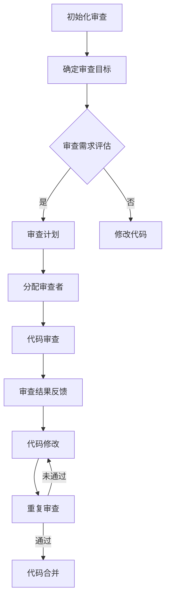

                 


# 文章标题：敏捷中的代码审查实践：提高LLM代码质量

> 关键词：敏捷开发，代码审查，LLM，质量保证，最佳实践

> 摘要：本文探讨了敏捷开发中的代码审查实践，重点分析了如何在大型语言模型（LLM）开发过程中应用代码审查来提高代码质量。文章从敏捷开发的背景出发，介绍了代码审查的概念和原理，阐述了LLM与代码审查之间的联系，并通过实际案例、审查工具和技术、持续改进和最佳实践等方面详细阐述了如何在敏捷开发中有效地进行代码审查。

## 引言

在当今快速发展的软件行业中，敏捷开发已成为一种主流的开发方法。它强调团队协作、快速迭代和持续交付高质量软件。随着人工智能技术的快速发展，大型语言模型（LLM）的开发变得越来越重要。然而，LLM的复杂性和规模使得代码质量保证变得更具挑战性。代码审查作为一种有效的代码质量保证方法，在敏捷开发中发挥着关键作用。本文将详细探讨如何在敏捷开发中应用代码审查实践，以提高LLM的代码质量。

## 敏捷开发概述

### 敏捷宣言和原则

敏捷开发起源于2001年的敏捷宣言，它提倡个体和互动重于过程与工具、可工作的软件重于详尽的文档、客户合作重于合同谈判以及响应变化重于遵循计划。敏捷开发的核心原则包括：

1. **个体和互动重于过程与工具**：强调团队成员之间的沟通和协作，而非过分依赖工具。
2. **可工作的软件重于详尽的文档**：重视实际可运行的软件，文档作为辅助。
3. **客户合作重于合同谈判**：与客户紧密合作，及时响应需求变化。
4. **响应变化重于遵循计划**：灵活性应对变化，而非严格执行计划。

### 敏捷开发的核心价值观

敏捷开发的核心价值观包括：

1. **价值驱动**：以用户价值为中心，持续交付用户期望的功能。
2. **团队协作**：鼓励团队成员之间的合作，共同完成项目。
3. **迭代开发**：通过短周期迭代，不断改进和优化产品。
4. **适应性**：根据项目进展和反馈，灵活调整计划和策略。

### 敏捷开发的方法论

敏捷开发的方法论主要包括：

1. **Scrum**：一种迭代式增量软件开发方法，包括冲刺（Sprint）、产品待办列表（Product Backlog）和每日站会（Daily Stand-up）等实践。
2. **Kanban**：一种视觉化的工作流程管理方法，通过看板（Kanban Board）来跟踪任务的状态和进度。
3. **XP（极限编程）**：一种注重实践和团队协作的敏捷方法，包括测试驱动开发（TDD）、代码重构等实践。

## 代码审查的概念和原理

### 代码审查的定义

代码审查是一种软件开发过程中用于评估代码质量的方法。它通常由一名或多名开发人员（审查者）对另一位开发人员（提交者）编写的代码进行评估。代码审查的主要目的是：

1. **识别错误**：发现代码中的错误、缺陷和潜在风险。
2. **提升代码质量**：通过审查，提高代码的可读性、可维护性和可测试性。
3. **促进知识共享**：审查过程有助于团队成员之间的知识交流和学习。

### 代码审查的类型

代码审查可以分为以下几种类型：

1. **同行评审**：团队成员之间的相互审查，通常用于源代码管理系统中。
2. **差分审查**：基于提交的代码与现有代码的对比，通常使用自动化工具进行。
3. **形式化审查**：使用正式的方法和工具对代码进行审查，以确保满足特定的标准和规范。

### 代码审查的原则

代码审查应遵循以下原则：

1. **公正性和透明度**：审查过程应公正、透明，避免个人偏见。
2. **质量保证**：确保审查过程能够有效发现代码中的问题。
3. **效率和协作**：审查过程应高效，同时促进团队成员之间的协作。

## LLM和敏捷代码审查的联系

### LLM的特点

大型语言模型（LLM）具有以下特点：

1. **规模庞大**：LLM通常包含数百万甚至数十亿个参数，使得代码复杂度极高。
2. **高复杂性**：LLM涉及深度学习、自然语言处理等多个领域，开发过程中面临多种挑战。
3. **需求变化快**：随着人工智能技术的快速发展，LLM的需求和功能可能频繁变化。

### 代码审查在LLM开发中的重要性

代码审查在LLM开发中具有以下重要性：

1. **确保代码质量**：代码审查有助于发现LLM代码中的错误和缺陷，提高代码质量。
2. **促进知识共享**：代码审查过程有助于团队成员之间分享关于LLM开发的知识和经验。
3. **提高开发效率**：通过代码审查，可以减少代码中的错误，降低后续修复成本，提高开发效率。

### 敏捷代码审查在LLM中的应用

在LLM开发中，敏捷代码审查的应用主要包括以下方面：

1. **迭代式审查**：在每次迭代中，对提交的代码进行审查，确保代码质量。
2. **自动化工具**：使用自动化工具对代码进行差分审查和静态分析，提高审查效率。
3. **持续反馈**：通过代码审查，及时反馈给开发者，帮助其改进代码。

## 实际案例分享

### 案例介绍

以下是一个敏捷代码审查在LLM开发中的实际案例：

- **项目背景**：某公司开发一款基于大型语言模型（LLM）的智能问答系统。
- **挑战**：由于LLM代码的复杂性和规模，团队面临代码质量问题，包括代码可读性差、错误率高和开发效率低等问题。
- **解决方案**：团队采用敏捷代码审查实践，通过迭代式审查、自动化工具和持续反馈，逐步提高了代码质量。

### 案例分析

1. **审查过程**：
   - **迭代式审查**：每次迭代结束后，对提交的LLM代码进行审查。
   - **自动化工具**：使用代码分析工具进行差分审查和静态分析，提高审查效率。
   - **持续反馈**：审查结果及时反馈给开发者，帮助其改进代码。

2. **审查结果**：
   - **代码质量提升**：通过代码审查，团队发现了多个潜在的代码错误和缺陷，及时进行了修复。
   - **开发效率提高**：代码质量的提升使得后续的开发和测试工作更加高效。
   - **团队协作增强**：代码审查促进了团队成员之间的知识共享和协作。

## 审查工具和技术

### 常见代码审查工具

在敏捷开发中，以下是一些常见的代码审查工具：

1. **GitLab**：提供基于Git的代码审查功能，支持多人协作审查。
2. **GitHub**：提供基于Git的代码审查功能，支持自动化审查和反馈。
3. **SonarQube**：一款强大的静态代码分析工具，支持多种编程语言。
4. **Checkstyle**：用于Java代码的静态代码分析工具，可以检查代码风格和潜在错误。

### 代码审查技术

代码审查技术主要包括以下方面：

1. **审查策略**：制定合适的审查策略，包括审查的频率、范围和参与人员等。
2. **审查方法**：选择合适的审查方法，如同行评审、差分审查和形式化审查等。
3. **审查流程**：建立清晰的审查流程，确保审查过程的规范化和高效性。

## 持续改进和最佳实践

### 持续改进的方法

在敏捷代码审查中，持续改进是关键。以下是一些持续改进的方法：

1. **收集反馈**：定期收集团队成员关于代码审查的反馈，了解存在的问题和改进需求。
2. **优化审查流程**：根据反馈，不断优化审查流程，提高审查效率和质量。
3. **培训与分享**：组织培训活动，提高团队成员的代码审查技能和知识。

### 最佳实践

以下是一些敏捷代码审查的最佳实践：

1. **明确审查目标**：在每次审查前，明确审查的目标和范围，确保审查的针对性。
2. **公正和透明**：确保审查过程公正、透明，避免个人偏见和歧视。
3. **自动化工具辅助**：充分利用自动化工具进行代码审查，提高审查效率。
4. **持续反馈**：及时反馈审查结果，帮助开发者改进代码。

## 总结

敏捷开发中的代码审查实践对于提高LLM的代码质量至关重要。通过引入敏捷开发的方法论和代码审查的原则，团队可以更有效地进行代码审查，发现并修复代码中的错误和缺陷，提高代码质量和开发效率。本文通过实际案例、审查工具和技术、持续改进和最佳实践等方面，详细阐述了如何在敏捷开发中应用代码审查实践，为LLM开发提供了有益的指导。

## 作者信息

作者：AI天才研究院/AI Genius Institute & 禅与计算机程序设计艺术 /Zen And The Art of Computer Programming

## 参考文献

1. Beck, K. (2000). **Extreme Programming Explained: Embrace Change**. Addison-Wesley.
2. Beck, K., Beedle, M., van Bennekom, J., Cockburn, A., Cunningham, W., Fowler, M., ... & Highsmith, J. (2001). **Manifesto for Agile Software Development**. Agile Alliance.
3. Giger, E. (2014). **Test-Driven Development: A Practical Guide**. Pearson Education.
4. Johansson, H. (2017). **Kanban from the Inside Out**. Lean Kanban Inc.
5. Martin, R. C. (2009). **Clean Code: A Handbook of Agile Software Craftsmanship**. Prentice Hall.
6. SonarSource. (n.d.). **SonarQube Documentation**. SonarSource.
7. Stachowiak, R., & Poppendieck, M. (2006). **Agile Project Management: Creating Innovative Products**. Addison-Wesley.

## 附录

### 附录A：代码审查流程图



### 附录B：代码审查伪代码示例

```python
function code_review(code, reviewer):
    # 检查代码格式
    if not check_format(code):
        return "格式错误"
    
    # 执行静态代码分析
    analysis_results = static_analysis(code)
    
    # 检查代码中的潜在错误
    if analysis_results.error_count > 0:
        return "代码错误：\n" + analysis_results.errors
    
    # 代码审查结束
    return "代码通过审查"

# 审查代码
review_result = code_review(submitted_code, reviewer)
print(review_result)
```

### 附录C：代码审查示例代码

```java
// 示例代码：计算两个数的和
public class SumCalculator {
    public int calculateSum(int a, int b) {
        return a + b;
    }
}

// 审查建议：
// 1. 添加输入参数检查
// 2. 使用静态代码分析工具检查代码风格
```

### 附录D：代码审查注意事项

1. **确保审查过程的公正性和透明度**：审查过程应公开透明，避免个人偏见。
2. **合理分配审查任务**：根据团队成员的技能和经验，合理分配审查任务。
3. **及时反馈审查结果**：确保审查结果及时反馈给开发者，促进代码质量的提升。

### 附录E：拓展阅读

1. **《敏捷开发实践指南》**：详细介绍了敏捷开发的实践方法，包括代码审查的相关内容。
2. **《代码大全》**：一本经典的软件工程书籍，提供了关于代码质量和代码审查的深入讨论。
3. **《软件工程：实践者的研究方法》**：探讨了软件工程中的各种方法和实践，包括代码审查。

## 结束语

本文探讨了敏捷开发中的代码审查实践，重点分析了如何在大型语言模型（LLM）开发过程中应用代码审查来提高代码质量。通过实际案例、审查工具和技术、持续改进和最佳实践等方面的详细阐述，希望为读者提供有价值的参考。在未来的工作中，我们可以不断探索和实践，不断提高代码审查的效果，推动敏捷开发在LLM开发中的进一步应用。作者：AI天才研究院/AI Genius Institute & 禅与计算机程序设计艺术 /Zen And The Art of Computer Programming。

