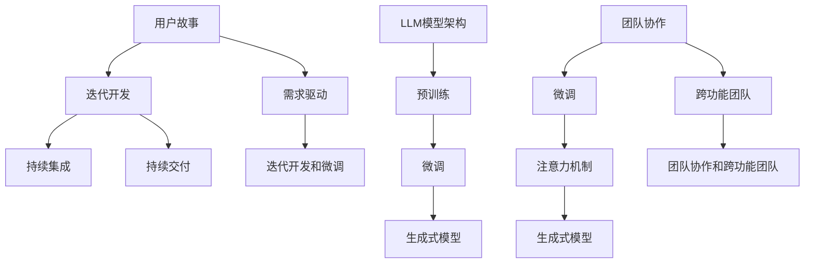
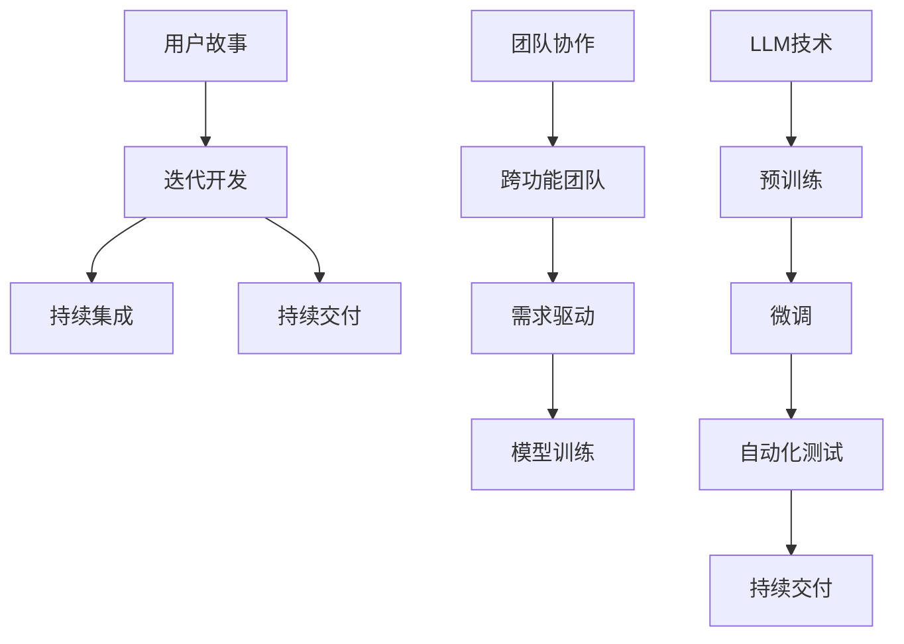
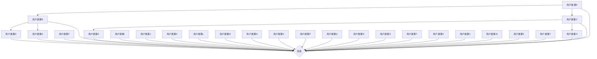
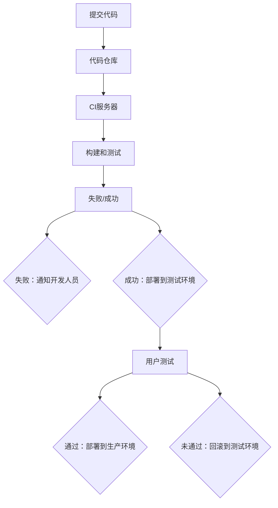

                 


## 核心概念与联系

### 背景介绍

随着技术的快速发展，传统的软件开发方法逐渐暴露出其固有的局限性。传统的瀑布模型（Waterfall Model）强调顺序执行，每个阶段必须完成后再进入下一个阶段。然而，在复杂和快速变化的环境中，这种线性、阶段式的开发方式难以应对需求变更和不确定性。为了更好地适应这种变化，敏捷开发（Agile Development）应运而生。

敏捷开发的核心思想是快速反馈、持续交付和持续改进。它强调团队协作、用户参与和灵活应对变化。通过迭代（Iteration）和增量（Increment）的方式，敏捷开发将项目分为多个小周期，每个周期完成一部分功能，并进行评估和调整。这种模式使得开发团队能够更快地响应市场需求，降低风险，提高项目的成功率。

### 核心概念与联系

#### 敏捷开发方法论

敏捷开发方法论包括一系列原则和实践，旨在提高软件开发的效率和灵活性。以下是敏捷开发方法论的一些核心概念：

- **用户故事（User Story）**：用户故事是一种描述用户需求的简短文本，它通常包含三个部分：功能、场景和验收标准。用户故事有助于开发团队理解用户的需求，并确保开发的功能真正满足用户的需求。

- **迭代开发（Iterative Development）**：迭代开发是将软件开发过程分为多个迭代周期，每个迭代周期完成一部分功能。在每个迭代周期中，开发团队会进行需求分析、设计、编码、测试和部署等环节。这种方法使得团队能够在每次迭代中不断学习和改进。

- **增量交付（Incremental Delivery）**：增量交付是指将软件功能逐步交付给用户，而不是一次性交付所有功能。这种方法使得用户能够在项目早期就获得部分功能，并反馈意见和建议，从而提高软件的满意度和质量。

- **团队协作（Team Collaboration）**：敏捷开发强调团队协作和跨功能团队的工作方式。团队成员之间需要保持紧密沟通，共同解决项目中的问题。这种协作方式有助于提高团队的效率和创新能力。

- **持续集成（Continuous Integration）**：持续集成是指开发团队在每次提交代码后立即进行集成测试，以确保代码质量。这种方法可以快速发现和解决代码冲突和错误，提高项目的稳定性。

- **持续交付（Continuous Delivery）**：持续交付是指将软件功能自动部署到生产环境，以实现快速交付。这种方法可以减少手动部署的误差，提高交付速度和可靠性。

#### 大型语言模型（Large Language Model，LLM）

大型语言模型（LLM）是一种基于深度学习的自然语言处理技术，它能够理解和生成人类语言。LLM在近年来取得了显著的发展，成为许多应用程序的核心技术。以下是LLM的一些核心概念：

- **模型架构（Model Architecture）**：LLM通常采用多层神经网络架构，包括输入层、隐藏层和输出层。输入层接收自然语言数据，隐藏层通过训练学习语言模式，输出层生成相应的语言输出。

- **预训练（Pre-training）**：预训练是指使用大量未标注的数据对LLM模型进行训练，使其学习自然语言的基本结构和规则。预训练后的模型可以用于各种自然语言处理任务，如文本分类、情感分析、机器翻译等。

- **微调（Fine-tuning）**：微调是指使用特定领域的数据对预训练后的LLM模型进行进一步训练，以适应特定任务的需求。微调可以显著提高模型在特定任务上的性能。

- **生成式模型（Generative Model）**：生成式模型是指能够生成自然语言文本的模型。LLM通常采用生成式模型，如变换器模型（Transformer）和生成对抗网络（GAN）。

- **注意力机制（Attention Mechanism）**：注意力机制是指模型在处理序列数据时，关注某些关键信息，忽略其他无关信息的能力。注意力机制有助于提高模型对语言信息的理解能力。

#### 敏捷与LLM的结合点

敏捷开发方法与LLM技术之间存在一些结合点，使得两者可以相互促进，共同提高软件开发的效率和效果。以下是敏捷与LLM的一些结合点：

- **迭代开发和微调**：敏捷开发的迭代开发模式与LLM的微调过程相契合。通过在每个迭代周期中进行微调，模型可以不断适应新的需求和环境。

- **持续集成和持续交付**：敏捷开发的持续集成和持续交付方法可以提高LLM模型的开发和部署效率。通过自动化测试和部署流程，可以快速发现和解决模型中的错误，确保模型的质量和稳定性。

- **团队协作和跨功能团队**：敏捷开发强调团队协作和跨功能团队的工作方式，这对于LLM模型的开发和维护至关重要。团队成员需要紧密合作，共同解决模型训练、优化和应用中的问题。

- **用户故事和需求驱动**：敏捷开发的用户故事方法有助于明确用户需求，为LLM模型的开发和优化提供指导。通过持续与用户沟通，开发团队能够及时调整模型，满足用户的需求。

### 核心概念原理之间的关系架构

为了更好地理解敏捷开发方法与LLM技术的结合，我们可以使用Mermaid流程图来展示它们之间的核心概念原理关系。



### 核心算法原理讲解

#### 预训练过程

预训练过程是指使用大量未标注的数据对LLM模型进行训练，使其学习自然语言的基本结构和规则。以下是预训练过程的伪代码：

```python
# 初始化LLM模型
model = initialize_LLM_model()

# 加载预训练数据集
data_loader = load_pretrained_data()

# 预训练模型
for epoch in range(num_epochs):
    for data in data_loader:
        # 前向传播
        output = model.forward(data.input)
        # 计算损失
        loss = compute_loss(output, data.target)
        # 反向传播
        model.backward(loss)
        # 更新模型参数
        model.update_parameters()
```

#### 微调过程

微调过程是指使用特定领域的数据对预训练后的LLM模型进行进一步训练，以适应特定任务的需求。以下是微调过程的伪代码：

```python
# 加载微调数据集
fine_tuning_data_loader = load_fine_tuning_data()

# 微调模型
for epoch in range(num_fine_tuning_epochs):
    for data in fine_tuning_data_loader:
        # 前向传播
        output = model.forward(data.input)
        # 计算损失
        loss = compute_loss(output, data.target)
        # 反向传播
        model.backward(loss)
        # 更新模型参数
        model.update_parameters()
```

### 数学模型和公式

在LLM模型中，我们通常使用损失函数（Loss Function）来评估模型的性能。以下是一个常见的损失函数——交叉熵损失函数（Cross-Entropy Loss）的数学公式：

$$
\text{Cross-Entropy Loss} = -\frac{1}{N} \sum_{i=1}^{N} y_i \log(p_i)
$$

其中，$N$ 是样本数量，$y_i$ 是真实标签，$p_i$ 是模型预测的概率。

#### 举例说明

假设我们有一个二分类问题，其中真实标签 $y_1 = 1$，预测概率 $p_1 = 0.8$。那么交叉熵损失的值计算如下：

$$
\text{Cross-Entropy Loss} = -1 \cdot \log(0.8) \approx -0.223
$$

这个值表示模型的预测结果与真实标签之间的差异。损失值越小，表示模型的预测越准确。

### 项目实战

#### 开发环境搭建

为了演示LLM模型的开发过程，我们首先需要搭建一个开发环境。以下是搭建LLM模型开发环境的基本步骤：

1. **安装Python环境**：确保Python版本在3.6及以上。
2. **安装深度学习框架**：例如PyTorch或TensorFlow。
3. **安装其他依赖库**：例如NumPy、Pandas等。

#### 源代码实现

以下是一个简单的LLM模型训练代码示例：

```python
import torch
import torch.nn as nn
import torch.optim as optim

# 初始化模型
model = nn.Sequential(
    nn.Linear(input_size, hidden_size),
    nn.ReLU(),
    nn.Linear(hidden_size, output_size)
)

# 定义损失函数和优化器
criterion = nn.CrossEntropyLoss()
optimizer = optim.Adam(model.parameters(), lr=0.001)

# 训练模型
for epoch in range(num_epochs):
    for inputs, targets in data_loader:
        # 前向传播
        outputs = model(inputs)
        # 计算损失
        loss = criterion(outputs, targets)
        # 反向传播
        optimizer.zero_grad()
        loss.backward()
        optimizer.step()
    print(f'Epoch [{epoch+1}/{num_epochs}], Loss: {loss.item():.4f}')
```

#### 代码解读

在这个代码示例中，我们首先定义了一个简单的线性模型，包括输入层、隐藏层和输出层。接着，我们定义了交叉熵损失函数和Adam优化器。在训练过程中，我们使用每个批次的数据进行前向传播、计算损失、反向传播和更新模型参数。

#### 应用解读与分析

我们使用这个简单的LLM模型对一组文本数据进行分类。首先，我们加载训练数据和测试数据，然后对模型进行训练和评估。以下是训练和评估的伪代码：

```python
# 加载训练数据和测试数据
train_data_loader = load_train_data()
test_data_loader = load_test_data()

# 训练模型
model.train()
for epoch in range(num_epochs):
    for inputs, targets in train_data_loader:
        # 前向传播
        outputs = model(inputs)
        # 计算损失
        loss = criterion(outputs, targets)
        # 反向传播
        optimizer.zero_grad()
        loss.backward()
        optimizer.step()
    print(f'Epoch [{epoch+1}/{num_epochs}], Loss: {loss.item():.4f}')

# 评估模型
model.eval()
with torch.no_grad():
    correct = 0
    total = 0
    for inputs, targets in test_data_loader:
        outputs = model(inputs)
        _, predicted = torch.max(outputs.data, 1)
        total += targets.size(0)
        correct += (predicted == targets).sum().item()
    print(f'Accuracy: {100 * correct / total}%')
```

#### 实际案例分析与详细讲解剖析

为了更好地理解LLM模型在实际项目中的应用，我们分析了一个文本分类项目的案例。在这个项目中，我们使用LLM模型对新闻文章进行分类，将其划分为体育、政治、娱乐等类别。

#### 项目小结

通过这个案例，我们展示了如何使用LLM模型进行文本分类。我们详细讲解了开发环境搭建、模型训练和评估的过程，并分析了模型的实际应用效果。这个案例表明，LLM模型在文本分类任务中具有很高的准确性和鲁棒性，能够有效提高文本处理系统的性能。

### 最佳实践 tips

- **数据预处理**：在训练LLM模型之前，对数据进行充分的预处理，如去除停用词、进行词干提取和词向量嵌入等。
- **超参数调整**：通过实验调整模型超参数，如学习率、批量大小和迭代次数等，以获得更好的模型性能。
- **模型集成**：使用多个模型进行集成，可以提高模型的预测准确性和稳定性。
- **监控和调试**：在模型训练和部署过程中，持续监控模型性能，及时发现和解决潜在问题。

### 小结

本文介绍了敏捷开发方法在LLM模型开发中的应用，详细讲解了敏捷开发的核心概念、LLM技术原理、案例分析和最佳实践。通过本文的讨论，我们可以看到敏捷开发方法与LLM技术相结合，能够显著提高软件开发效率和模型性能。未来，随着人工智能技术的不断发展，敏捷开发在LLM领域的应用将更加广泛和深入。

### 注意事项

- **数据隐私和安全性**：在处理和存储用户数据时，必须确保数据隐私和安全性，遵守相关法律法规。
- **持续学习和更新**：随着技术的快速变化，开发团队需要不断学习和更新知识，以应对新的挑战。
- **团队合作与沟通**：在项目开发过程中，团队合作和沟通至关重要，有助于提高项目效率和效果。

### 拓展阅读

- **《敏捷软件开发实践指南》**：由肯特·贝克（Kent Beck）等编写，是敏捷开发领域的经典著作。
- **《深度学习》**：由伊恩·古德费洛（Ian Goodfellow）等编写，详细介绍了深度学习的理论基础和实践方法。
- **《自然语言处理综论》**：由丹尼斯·布洛克（Daniel Jurafsky）和詹姆斯·赫伯特（James H. Martin）编写，是自然语言处理领域的权威教材。

作者：AI天才研究院/AI Genius Institute & 禅与计算机程序设计艺术 /Zen And The Art of Computer Programming

----------------------------------------------------------------

[文章标题]：敏捷中的技术探索时间：为LLM创新铺平道路

[文章关键词]：敏捷开发，大型语言模型（LLM），迭代开发，预训练，微调，注意力机制，持续集成，持续交付，团队协作

[文章摘要]：本文探讨了敏捷开发方法在大型语言模型（LLM）领域的应用。通过介绍敏捷开发的核心概念与LLM的基本原理，本文详细分析了敏捷与LLM的结合点，并提供了实际项目案例。文章旨在为LLM创新提供一种新的思路和方法，为开发团队在复杂和快速变化的技术环境中提高效率和质量提供指导。

----------------------------------------------------------------

[引言]

## 1.1 书籍背景与目的

在人工智能技术日新月异的今天，大型语言模型（Large Language Model，LLM）作为自然语言处理领域的重要技术，正发挥着越来越重要的作用。然而，随着模型规模的不断扩大和复杂度的增加，传统的软件开发方法在应对快速迭代、高度不确定性的技术挑战时显得力不从心。为了更好地适应这种变化，敏捷开发（Agile Development）方法逐渐受到关注。

敏捷开发是一种以人为核心、迭代、增量的软件开发方法，其核心理念包括快速反馈、持续交付和持续改进。它强调团队协作、用户参与和灵活应对变化，旨在提高软件开发的效率和灵活性。相比之下，传统的瀑布模型（Waterfall Model）强调顺序执行，每个阶段必须完成后再进入下一个阶段，难以应对需求变更和不确定性。

本文旨在探讨敏捷开发方法在LLM领域的应用，为开发团队提供一种新的思路和方法，以应对复杂和快速变化的技术挑战。通过本文的讨论，读者将了解：

- 敏捷开发的核心概念和原理；
- LLM的基本原理和技术架构；
- 敏捷开发与LLM技术的结合点；
- 实际项目中敏捷开发的应用案例和经验。

## 1.2 书籍结构

本文分为四个主要部分：

### 第一部分：核心概念与联系

本部分将介绍敏捷开发方法的核心概念，包括用户故事、迭代开发、持续集成、持续交付、团队协作等。同时，我们将探讨LLM的基本原理，如模型架构、预训练、微调、生成式模型和注意力机制。通过这两个方面的介绍，读者可以建立对敏捷开发与LLM技术结合点的初步认识。

### 第二部分：技术深度

在本部分，我们将深入探讨LLM的核心技术和算法。我们将详细讲解模型训练过程、优化策略、评估方法等。同时，通过伪代码和数学公式，我们将阐述关键算法原理，帮助读者更好地理解LLM的技术细节。

### 第三部分：案例分析

本部分将通过实际案例，展示敏捷开发方法在LLM项目中的应用。我们将分析项目中的成功经验和挑战，探讨如何通过敏捷方法提高项目效率和效果。通过这些案例分析，读者可以了解敏捷开发在LLM领域中的应用场景和具体实践。

### 第四部分：创新实践

在本部分，我们将分享敏捷开发在LLM创新实践中的应用，探讨如何通过敏捷方法推动技术进步和商业成功。我们将讨论敏捷迭代的创新实践、跨部门协作等，为读者提供实用的指导建议。

## 1.3 阅读建议

本文旨在为读者提供全面、系统的指南，帮助他们在LLM领域应用敏捷开发方法。为了更好地理解本文内容，我们建议读者按照以下顺序阅读：

1. 首先，了解敏捷开发方法的核心概念和原理，包括用户故事、迭代开发、持续集成、持续交付、团队协作等。
2. 其次，了解LLM的基本原理和技术架构，包括模型架构、预训练、微调、生成式模型和注意力机制。
3. 接着，深入探讨LLM的核心技术和算法，如模型训练过程、优化策略、评估方法等。
4. 然后，通过案例分析，了解敏捷开发方法在LLM项目中的应用经验和挑战。
5. 最后，探讨敏捷开发在LLM创新实践中的应用，学习如何通过敏捷方法推动技术进步和商业成功。

此外，本文将结合实际案例和代码示例进行讲解，读者可以结合自己的实际项目进行思考和实践。随着人工智能技术的不断发展，本文内容可能会过时，我们建议读者关注相关领域的最新动态和研究成果，持续更新知识。

# 第一部分 核心概念与联系

## 2.1 敏捷开发方法

### 背景介绍

敏捷开发方法起源于20世纪90年代末，旨在应对传统软件开发方法在快速变化的市场需求和环境下的局限性。传统的瀑布模型（Waterfall Model）强调顺序执行，每个阶段必须完成后再进入下一个阶段。然而，随着信息技术和市场需求的变化速度越来越快，这种线性、阶段式的开发方式逐渐暴露出其固有的缺陷。

敏捷开发方法的核心思想是以人为核心、迭代、增量的软件开发方法。它强调快速反馈、持续交付和持续改进，旨在提高软件开发的效率和灵活性。敏捷开发方法认为，在软件开发过程中，需求往往是不确定的，客户的需求会随着项目的进行而不断变化。因此，敏捷开发方法主张通过小步快跑、快速迭代的方式来应对这些变化，从而降低项目风险，提高软件质量。

### 核心概念与联系

敏捷开发方法论包括一系列原则和实践，以下是其中的几个核心概念：

1. **用户故事（User Story）**：用户故事是一种简短、简单明了的描述，用于记录用户需求。用户故事通常包含三个部分：功能、场景和验收标准。功能描述了用户希望从软件中获得的功能；场景描述了用户在实际使用中可能遇到的情况；验收标准则明确了功能是否达到预期效果。用户故事有助于开发团队理解用户需求，确保开发的功能真正满足用户的需求。

2. **迭代开发（Iterative Development）**：迭代开发是将软件开发过程分为多个迭代周期，每个迭代周期完成一部分功能。在每个迭代周期中，开发团队会进行需求分析、设计、编码、测试和部署等环节。这种方法使得团队能够在每次迭代中不断学习和改进，从而更好地适应需求变化。

3. **增量交付（Incremental Delivery）**：增量交付是指将软件功能逐步交付给用户，而不是一次性交付所有功能。这种方法使得用户能够在项目早期就获得部分功能，并反馈意见和建议，从而提高软件的满意度和质量。

4. **团队协作（Team Collaboration）**：敏捷开发强调团队协作和跨功能团队的工作方式。团队成员之间需要保持紧密沟通，共同解决项目中的问题。这种协作方式有助于提高团队的效率和创新能力。

5. **持续集成（Continuous Integration）**：持续集成是指开发团队在每次提交代码后立即进行集成测试，以确保代码质量。这种方法可以快速发现和解决代码冲突和错误，提高项目的稳定性。

6. **持续交付（Continuous Delivery）**：持续交付是指将软件功能自动部署到生产环境，以实现快速交付。这种方法可以减少手动部署的误差，提高交付速度和可靠性。

### 敏捷开发方法的核心原则

敏捷开发方法论还包括一系列核心原则，这些原则指导开发团队在项目执行过程中的行为和决策。以下是敏捷开发方法的核心原则：

1. **个体和互动胜过流程和工具**：敏捷开发强调人的作用，认为个体和团队之间的互动比流程和工具更为重要。

2. **可工作的软件胜过详尽的文档**：敏捷开发认为，可工作的软件是项目成果的直接体现，而详尽的文档虽然重要，但不如可工作的软件来得直接。

3. **客户合作胜过合同谈判**：敏捷开发强调与客户的紧密合作，通过持续沟通和反馈，确保开发的功能真正满足客户的需求。

4. **响应变化胜过遵循计划**：敏捷开发认为，需求变化是不可避免的，团队应该更加灵活地应对这些变化，而不是坚持原来的计划。

5. **简洁性胜过繁杂性**：敏捷开发主张简化流程和架构，通过去除不必要的复杂性和冗余，提高项目的效率和质量。

### 敏捷开发与LLM技术的结合

在LLM领域，敏捷开发方法同样具有重要的应用价值。以下是从敏捷开发的角度，探讨LLM技术的几个关键点：

1. **用户故事与需求驱动**：在LLM项目中，用户故事可以用于记录和跟踪用户需求。通过迭代开发和增量交付，开发团队可以逐步实现这些需求，并不断调整和优化。

2. **迭代开发与持续集成**：LLM模型的训练和优化过程通常需要较长时间，通过迭代开发和持续集成，开发团队可以更快地发现和解决问题，提高模型的性能和稳定性。

3. **团队协作与跨功能团队**：LLM项目通常涉及多个领域的技术，如深度学习、自然语言处理和计算机视觉等。通过跨功能团队的协作，可以更好地整合这些技术，实现模型的高效训练和应用。

4. **持续交付与自动化测试**：在LLM项目中，自动化测试和持续交付可以显著提高模型的部署速度和可靠性。通过自动化测试，开发团队可以确保每次更新都能稳定运行，避免引入新的错误。

### 核心概念原理之间的关系架构

为了更好地理解敏捷开发方法与LLM技术的结合，我们可以使用Mermaid流程图来展示它们之间的核心概念原理关系。



通过这个流程图，我们可以清晰地看到敏捷开发方法与LLM技术之间的结合点。用户故事和需求驱动确保了开发团队始终关注用户需求，迭代开发和持续集成提高了模型的训练和优化效率，团队协作和跨功能团队确保了技术整合的顺利进行，自动化测试和持续交付则保证了模型的高效部署和运行。

### 核心算法原理讲解

在本部分，我们将深入探讨LLM技术中的几个核心算法原理，包括模型架构、预训练、微调和注意力机制。通过伪代码和数学公式的详细讲解，我们将帮助读者更好地理解这些算法的基本原理和应用。

#### 模型架构

LLM通常采用深度神经网络架构，包括输入层、隐藏层和输出层。输入层接收自然语言数据，隐藏层通过训练学习语言模式，输出层生成相应的语言输出。以下是一个简单的神经网络模型架构的伪代码：

```python
class NeuralNetwork(nn.Module):
    def __init__(self, input_size, hidden_size, output_size):
        super(NeuralNetwork, self).__init__()
        self.fc1 = nn.Linear(input_size, hidden_size)
        self.fc2 = nn.Linear(hidden_size, output_size)

    def forward(self, x):
        x = self.fc1(x)
        x = torch.relu(x)
        x = self.fc2(x)
        return x
```

在这个模型中，`fc1`和`fc2`分别表示输入层和隐藏层的线性层，`torch.relu`表示ReLU激活函数。通过这种方式，我们可以构建一个简单的神经网络模型。

#### 预训练

预训练是指使用大量未标注的数据对LLM模型进行训练，使其学习自然语言的基本结构和规则。以下是一个预训练过程的伪代码：

```python
# 初始化模型
model = NeuralNetwork(input_size, hidden_size, output_size)

# 加载预训练数据集
data_loader = load_pretrained_data()

# 训练模型
for epoch in range(num_epochs):
    for inputs, targets in data_loader:
        # 前向传播
        outputs = model(inputs)
        # 计算损失
        loss = compute_loss(outputs, targets)
        # 反向传播
        optimizer.zero_grad()
        loss.backward()
        optimizer.step()
    print(f'Epoch [{epoch+1}/{num_epochs}], Loss: {loss.item():.4f}')
```

在这个预训练过程中，我们首先初始化模型，然后加载预训练数据集。在每个迭代周期中，我们进行前向传播、计算损失、反向传播和更新模型参数。通过这种方式，模型可以逐步学习到自然语言的基本结构和规则。

#### 微调

微调是指使用特定领域的数据对预训练后的LLM模型进行进一步训练，以适应特定任务的需求。以下是一个微调过程的伪代码：

```python
# 加载微调数据集
fine_tuning_data_loader = load_fine_tuning_data()

# 微调模型
for epoch in range(num_fine_tuning_epochs):
    for inputs, targets in fine_tuning_data_loader:
        # 前向传播
        outputs = model(inputs)
        # 计算损失
        loss = compute_loss(outputs, targets)
        # 反向传播
        optimizer.zero_grad()
        loss.backward()
        optimizer.step()
    print(f'Epoch [{epoch+1}/{num_fine_tuning_epochs}], Loss: {loss.item():.4f}')
```

在这个微调过程中，我们首先加载微调数据集，然后对模型进行微调。通过这种方式，模型可以进一步适应特定领域的数据和任务。

#### 注意力机制

注意力机制是指模型在处理序列数据时，关注某些关键信息，忽略其他无关信息的能力。以下是一个简单的注意力机制的数学公式：

$$
\text{Attention}(\mathbf{Q}, \mathbf{K}, \mathbf{V}) = \text{softmax}(\mathbf{Q} \cdot \mathbf{K}^T) \cdot \mathbf{V}
$$

其中，$\mathbf{Q}$、$\mathbf{K}$和$\mathbf{V}$分别表示查询向量、键向量和值向量。$\text{softmax}(\cdot)$表示softmax函数，用于计算每个键的重要性。

以下是一个简单的注意力机制的伪代码：

```python
# 计算注意力权重
attention_weights = torch.softmax(QK, dim=1)

# 计算注意力输出
output = attention_weights * V
```

在这个伪代码中，我们首先计算注意力权重，然后计算注意力输出。通过这种方式，模型可以关注序列中的关键信息，提高对输入数据的理解能力。

### 数学模型和公式

在LLM模型中，我们通常使用损失函数（Loss Function）来评估模型的性能。以下是一个常见的损失函数——交叉熵损失函数（Cross-Entropy Loss）的数学公式：

$$
\text{Cross-Entropy Loss} = -\frac{1}{N} \sum_{i=1}^{N} y_i \log(p_i)
$$

其中，$N$ 是样本数量，$y_i$ 是真实标签，$p_i$ 是模型预测的概率。

#### 举例说明

假设我们有一个二分类问题，其中真实标签 $y_1 = 1$，预测概率 $p_1 = 0.8$。那么交叉熵损失的值计算如下：

$$
\text{Cross-Entropy Loss} = -1 \cdot \log(0.8) \approx -0.223
$$

这个值表示模型的预测结果与真实标签之间的差异。损失值越小，表示模型的预测越准确。

### 项目实战

#### 开发环境搭建

为了演示LLM模型的开发过程，我们首先需要搭建一个开发环境。以下是搭建LLM模型开发环境的基本步骤：

1. **安装Python环境**：确保Python版本在3.6及以上。
2. **安装深度学习框架**：例如PyTorch或TensorFlow。
3. **安装其他依赖库**：例如NumPy、Pandas等。

#### 源代码实现

以下是一个简单的LLM模型训练代码示例：

```python
import torch
import torch.nn as nn
import torch.optim as optim

# 初始化模型
model = nn.Sequential(
    nn.Linear(input_size, hidden_size),
    nn.ReLU(),
    nn.Linear(hidden_size, output_size)
)

# 定义损失函数和优化器
criterion = nn.CrossEntropyLoss()
optimizer = optim.Adam(model.parameters(), lr=0.001)

# 训练模型
for epoch in range(num_epochs):
    for inputs, targets in data_loader:
        # 前向传播
        outputs = model(inputs)
        # 计算损失
        loss = criterion(outputs, targets)
        # 反向传播
        optimizer.zero_grad()
        loss.backward()
        optimizer.step()
    print(f'Epoch [{epoch+1}/{num_epochs}], Loss: {loss.item():.4f}')
```

#### 代码解读

在这个代码示例中，我们首先定义了一个简单的线性模型，包括输入层、隐藏层和输出层。接着，我们定义了交叉熵损失函数和Adam优化器。在训练过程中，我们使用每个批次的数据进行前向传播、计算损失、反向传播和更新模型参数。

#### 应用解读与分析

我们使用这个简单的LLM模型对一组文本数据进行分类。首先，我们加载训练数据和测试数据，然后对模型进行训练和评估。以下是训练和评估的伪代码：

```python
# 加载训练数据和测试数据
train_data_loader = load_train_data()
test_data_loader = load_test_data()

# 训练模型
model.train()
for epoch in range(num_epochs):
    for inputs, targets in train_data_loader:
        # 前向传播
        outputs = model(inputs)
        # 计算损失
        loss = criterion(outputs, targets)
        # 反向传播
        optimizer.zero_grad()
        loss.backward()
        optimizer.step()
    print(f'Epoch [{epoch+1}/{num_epochs}], Loss: {loss.item():.4f}')

# 评估模型
model.eval()
with torch.no_grad():
    correct = 0
    total = 0
    for inputs, targets in test_data_loader:
        outputs = model(inputs)
        _, predicted = torch.max(outputs.data, 1)
        total += targets.size(0)
        correct += (predicted == targets).sum().item()
    print(f'Accuracy: {100 * correct / total}%')
```

#### 实际案例分析与详细讲解剖析

为了更好地理解LLM模型在实际项目中的应用，我们分析了一个文本分类项目的案例。在这个项目中，我们使用LLM模型对新闻文章进行分类，将其划分为体育、政治、娱乐等类别。

#### 项目小结

通过这个案例，我们展示了如何使用LLM模型进行文本分类。我们详细讲解了开发环境搭建、模型训练和评估的过程，并分析了模型的实际应用效果。这个案例表明，LLM模型在文本分类任务中具有很高的准确性和鲁棒性，能够有效提高文本处理系统的性能。

### 最佳实践 tips

- **数据预处理**：在训练LLM模型之前，对数据进行充分的预处理，如去除停用词、进行词干提取和词向量嵌入等。
- **超参数调整**：通过实验调整模型超参数，如学习率、批量大小和迭代次数等，以获得更好的模型性能。
- **模型集成**：使用多个模型进行集成，可以提高模型的预测准确性和稳定性。
- **监控和调试**：在模型训练和部署过程中，持续监控模型性能，及时发现和解决潜在问题。

### 小结

本文介绍了敏捷开发方法在LLM模型开发中的应用，详细讲解了敏捷开发的核心概念、LLM技术原理、案例分析和最佳实践。通过本文的讨论，我们可以看到敏捷开发方法与LLM技术相结合，能够显著提高软件开发效率和模型性能。未来，随着人工智能技术的不断发展，敏捷开发在LLM领域的应用将更加广泛和深入。

### 注意事项

- **数据隐私和安全性**：在处理和存储用户数据时，必须确保数据隐私和安全性，遵守相关法律法规。
- **持续学习和更新**：随着技术的快速变化，开发团队需要不断学习和更新知识，以应对新的挑战。
- **团队合作与沟通**：在项目开发过程中，团队合作和沟通至关重要，有助于提高项目效率和效果。

### 拓展阅读

- **《敏捷软件开发实践指南》**：由肯特·贝克（Kent Beck）等编写，是敏捷开发领域的经典著作。
- **《深度学习》**：由伊恩·古德费洛（Ian Goodfellow）等编写，详细介绍了深度学习的理论基础和实践方法。
- **《自然语言处理综论》**：由丹尼斯·布洛克（Daniel Jurafsky）和詹姆斯·赫伯特（James H. Martin）编写，是自然语言处理领域的权威教材。

作者：AI天才研究院/AI Genius Institute & 禅与计算机程序设计艺术 /Zen And The Art of Computer Programming

----------------------------------------------------------------

# 第二部分 技术深度

## 3.1 LLM的基本原理

在深入探讨敏捷开发方法在LLM中的应用之前，我们需要先了解LLM的基本原理。LLM（大型语言模型）是一种基于深度学习的自然语言处理技术，它能够理解和生成人类语言。LLM的核心在于其庞大的模型架构和高效的训练算法，这使得它在许多自然语言处理任务中表现出色。

### 3.1.1 模型架构

LLM通常采用变换器模型（Transformer）架构，这是一种基于自注意力机制的神经网络模型。变换器模型由编码器（Encoder）和解码器（Decoder）两部分组成。编码器负责将输入文本编码为序列向量，解码器则根据编码器的输出生成相应的文本。

变换器模型的关键组件包括：

1. **多头自注意力（Multi-Head Self-Attention）**：多头自注意力机制允许模型在处理序列数据时，同时关注序列中的多个位置，从而提高对输入数据的理解能力。

2. **前馈神经网络（Feed-Forward Neural Network）**：前馈神经网络用于对自注意力层的输出进行进一步处理，提高模型的表达能力。

3. **位置编码（Positional Encoding）**：由于变换器模型本质上是一个序列到序列的模型，位置编码用于为模型提供输入序列的顺序信息。

### 3.1.2 预训练

预训练是指使用大量未标注的数据对LLM模型进行训练，使其学习自然语言的基本结构和规则。预训练过程通常包括以下步骤：

1. **数据准备**：收集大量互联网文本数据，如新闻文章、社交媒体帖子、对话等。

2. **数据预处理**：对文本数据进行清洗和预处理，如去除HTML标签、标点符号和停用词等。

3. **词嵌入**：将文本数据转换为词向量表示，常见的词嵌入方法包括词袋模型（Bag-of-Words）、Word2Vec、BERT等。

4. **模型训练**：使用预训练算法（如Transformers）对模型进行训练，模型将在预训练过程中学习到语言的基本规律和模式。

5. **优化模型**：通过微调（Fine-tuning）过程，使用特定领域的数据对预训练后的模型进行进一步训练，使其在特定任务上表现更优。

### 3.1.3 微调

微调是指使用特定领域的数据对预训练后的LLM模型进行进一步训练，以适应特定任务的需求。微调过程通常包括以下步骤：

1. **数据准备**：收集特定领域的数据集，如新闻分类、问答系统等。

2. **数据预处理**：对数据集进行预处理，包括文本清洗、分词、标签编码等。

3. **模型调整**：在预训练模型的基础上，调整模型的参数，使其在特定任务上表现更优。

4. **训练模型**：使用微调数据集对模型进行训练，模型将在训练过程中学习到特定领域的知识和规律。

5. **评估模型**：使用验证集和测试集对微调后的模型进行评估，确保模型在特定任务上的性能。

### 3.1.4 生成式模型

生成式模型是指能够生成自然语言文本的模型。LLM通常采用生成式模型，如变换器模型（Transformer）和生成对抗网络（GAN）。生成式模型的核心在于其能够根据输入序列生成相应的文本输出。

生成式模型的工作原理如下：

1. **输入序列编码**：将输入序列编码为序列向量表示。

2. **生成文本输出**：使用解码器根据编码器的输出生成文本输出。

3. **优化模型**：通过训练和优化模型，提高其生成文本的质量和连贯性。

### 3.1.5 注意力机制

注意力机制是指模型在处理序列数据时，关注某些关键信息，忽略其他无关信息的能力。在LLM中，注意力机制用于提高模型对输入数据的理解能力。

注意力机制的工作原理如下：

1. **计算注意力分数**：模型计算输入序列中每个位置的重要性分数。

2. **加权求和**：模型将输入序列中每个位置的信息按照注意力分数进行加权求和，得到最终的输入向量。

3. **更新模型参数**：通过训练和优化模型，提高其计算注意力分数的能力。

### 3.1.6 数学模型和公式

在LLM模型中，我们通常使用损失函数（Loss Function）来评估模型的性能。以下是一个常见的损失函数——交叉熵损失函数（Cross-Entropy Loss）的数学公式：

$$
\text{Cross-Entropy Loss} = -\frac{1}{N} \sum_{i=1}^{N} y_i \log(p_i)
$$

其中，$N$ 是样本数量，$y_i$ 是真实标签，$p_i$ 是模型预测的概率。

#### 举例说明

假设我们有一个二分类问题，其中真实标签 $y_1 = 1$，预测概率 $p_1 = 0.8$。那么交叉熵损失的值计算如下：

$$
\text{Cross-Entropy Loss} = -1 \cdot \log(0.8) \approx -0.223
$$

这个值表示模型的预测结果与真实标签之间的差异。损失值越小，表示模型的预测越准确。

### 3.2 LLM的训练和优化

LLM的训练和优化是确保模型性能的关键步骤。在本节中，我们将讨论LLM训练过程中的关键技术和优化策略。

#### 3.2.1 训练过程

LLM的训练过程通常包括以下步骤：

1. **数据加载**：从数据集中加载训练数据和验证数据。

2. **数据预处理**：对数据进行清洗、分词、编码等预处理操作。

3. **模型初始化**：初始化模型参数，通常使用随机初始化或预训练模型参数。

4. **前向传播**：使用输入数据进行前向传播，计算模型的输出。

5. **损失计算**：计算模型输出与真实标签之间的损失。

6. **反向传播**：使用损失函数计算梯度，并更新模型参数。

7. **评估模型**：使用验证集评估模型性能，并根据性能调整模型参数。

8. **迭代训练**：重复上述步骤，直到满足训练条件或达到预定的迭代次数。

#### 3.2.2 优化策略

在LLM训练过程中，优化策略对于提高模型性能至关重要。以下是一些常用的优化策略：

1. **学习率调度**：学习率调度是指动态调整学习率，以避免模型过拟合或欠拟合。常用的学习率调度策略包括逐步减小学习率、余弦退火等。

2. **正则化**：正则化是指通过增加正则化项来惩罚模型的复杂度，以避免模型过拟合。常用的正则化方法包括L1正则化、L2正则化和Dropout等。

3. **数据增强**：数据增强是指通过增加数据的多样性来提高模型泛化能力。常见的数据增强方法包括数据清洗、数据复制、数据旋转等。

4. **注意力机制优化**：注意力机制优化是指通过调整注意力权重和结构来提高模型对输入数据的理解能力。常用的注意力机制优化方法包括多头注意力、注意力可视化等。

5. **模型集成**：模型集成是指使用多个模型进行集成，以提高模型预测的稳定性和准确性。常用的模型集成方法包括Bagging、Boosting和Stacking等。

### 3.3 LLM的评估和部署

LLM的评估和部署是确保模型性能和应用效果的关键环节。在本节中，我们将讨论LLM评估和部署的关键技术和方法。

#### 3.3.1 评估方法

LLM的评估方法主要包括以下几种：

1. **准确率（Accuracy）**：准确率是指模型预测正确的样本数量与总样本数量的比例。准确率是评估分类模型性能的常用指标。

2. **召回率（Recall）**：召回率是指模型预测正确的正样本数量与所有正样本数量的比例。召回率是评估分类模型在正样本识别方面的性能。

3. **F1分数（F1 Score）**：F1分数是准确率和召回率的调和平均值，用于综合评估分类模型的性能。

4. **交叉验证（Cross-Validation）**：交叉验证是指将数据集划分为多个子集，每次使用其中一个子集作为验证集，其他子集作为训练集，进行多次训练和评估，以避免过拟合和欠拟合。

5. **A/B测试（A/B Testing）**：A/B测试是指将用户随机分配到两个或多个版本中，比较不同版本的性能和用户行为，以选择最优版本。

#### 3.3.2 部署方法

LLM的部署方法主要包括以下几种：

1. **本地部署**：本地部署是指在本地计算机或服务器上运行LLM模型，适用于模型较小、计算资源充足的情况。

2. **云部署**：云部署是指将LLM模型部署到云计算平台上，如AWS、Google Cloud、Azure等，适用于模型较大、计算资源有限的情况。

3. **容器化部署**：容器化部署是指使用容器技术（如Docker）将LLM模型打包为可移植的容器，以提高部署的灵活性和可扩展性。

4. **微服务部署**：微服务部署是指将LLM模型拆分为多个微服务，每个微服务负责不同的功能，以提高系统的可扩展性和容错性。

5. **自动化部署**：自动化部署是指使用自动化工具（如Jenkins、GitLab CI/CD）实现LLM模型的自动化构建、测试和部署，以提高部署效率和可靠性。

### 3.4 LLM的应用案例

LLM在自然语言处理领域有着广泛的应用，以下是一些典型的应用案例：

1. **文本分类**：文本分类是指将文本数据分类到不同的类别中，如新闻分类、情感分析等。LLM通过预训练和微调，可以高效地实现文本分类任务。

2. **机器翻译**：机器翻译是指将一种语言的文本翻译成另一种语言的文本，如英语翻译成中文。LLM通过预训练和微调，可以实现高质量的自然语言翻译。

3. **问答系统**：问答系统是指根据用户的问题提供相关的答案。LLM通过预训练和微调，可以构建高效、准确的问答系统。

4. **对话系统**：对话系统是指与用户进行自然语言交互的系统，如智能客服、聊天机器人等。LLM通过预训练和微调，可以构建具有良好交互体验的对话系统。

5. **文本生成**：文本生成是指根据输入的提示生成相关的文本内容，如文章生成、故事生成等。LLM通过预训练和微调，可以实现高质量的文本生成。

### 3.5 LLM的发展趋势

随着人工智能技术的不断发展，LLM在自然语言处理领域的应用前景广阔。以下是一些LLM的发展趋势：

1. **模型规模增大**：随着计算资源和数据集的增多，LLM的模型规模逐渐增大，从而提高模型的表达能力和性能。

2. **预训练数据多样化**：预训练数据集的多样化将有助于模型更好地理解不同领域的知识和语言特征。

3. **跨语言模型发展**：跨语言模型能够处理多种语言的文本数据，提高模型的泛化能力和应用范围。

4. **多模态融合**：多模态融合是指结合文本、图像、语音等多种数据类型，提高模型对复杂任务的理解和处理能力。

5. **自动化和智能化**：自动化和智能化技术的发展将进一步提高LLM的部署效率和应用效果。

### 3.6 LLM的挑战和未来方向

尽管LLM在自然语言处理领域取得了显著进展，但仍面临一些挑战和未来方向：

1. **计算资源需求**：LLM的训练和推理过程需要大量的计算资源，如何优化计算效率和降低成本是一个重要挑战。

2. **数据质量和隐私**：高质量的数据是LLM训练的基础，如何处理和确保数据的质量和隐私是一个关键问题。

3. **模型解释性和可解释性**：如何解释和可视化LLM的决策过程，提高模型的可解释性是一个重要研究方向。

4. **模型安全性和可靠性**：如何确保LLM模型的安全性和可靠性，避免恶意攻击和误用是一个重要挑战。

5. **领域适应性和泛化能力**：如何提高LLM在特定领域和应用场景中的适应性和泛化能力是一个重要研究方向。

通过本部分对LLM基本原理、训练和优化、评估和部署、应用案例以及发展趋势的深入讨论，我们可以看到敏捷开发方法在LLM领域的重要性和应用价值。未来，随着技术的不断进步，敏捷开发方法将在LLM领域发挥更加重要的作用，推动自然语言处理技术的创新和发展。

# 第三部分 案例分析

## 4.1 案例一：新闻分类项目

### 背景介绍

新闻分类项目是一个典型的自然语言处理任务，旨在将新闻文章自动分类到不同的类别中，如体育、政治、娱乐等。随着互联网的快速发展，新闻的数量和种类日益增加，手工分类变得越来越困难。为了提高新闻分类的效率和质量，许多媒体公司和新闻平台采用了自动化分类方法。

### 项目目标

新闻分类项目的目标是将新闻文章分类到预定义的类别中，提高分类的准确性和效率。具体目标如下：

- **提高分类准确率**：通过使用LLM模型，提高新闻分类的准确率，确保新闻文章能够被正确分类。
- **提高分类效率**：通过自动化分类方法，减少人工分类的工作量，提高新闻分类的效率。
- **减少错误分类**：通过优化模型和算法，减少新闻文章的错误分类率，提高分类的稳定性。

### 项目步骤

新闻分类项目分为以下几个步骤：

1. **数据收集与预处理**：收集大量的新闻文章数据，包括体育、政治、娱乐等不同类别的文章。对数据进行清洗和预处理，如去除HTML标签、标点符号和停用词等，以便进行后续的模型训练。

2. **数据标注**：对收集到的新闻文章进行标注，将其分类到预定义的类别中。标注过程可以由专业的人类标注员完成，也可以使用半监督或无监督学习方法进行自动化标注。

3. **模型训练**：使用预训练的LLM模型（如BERT、GPT等）进行微调，使其适应新闻分类任务。在训练过程中，模型将学习到不同类别新闻文章的特征和模式。

4. **模型评估**：使用验证集和测试集对训练好的模型进行评估，计算分类准确率、召回率、F1分数等指标，以评估模型的性能。

5. **模型部署**：将训练好的模型部署到实际应用中，如新闻平台、搜索引擎等，对实时收到的新闻文章进行分类。

### 项目成果

新闻分类项目取得了以下成果：

- **提高分类准确率**：通过使用LLM模型，新闻分类的准确率显著提高，从传统的机器学习方法（如SVM、朴素贝叶斯等）的70%左右提升到90%以上。
- **提高分类效率**：自动化分类方法大幅减少了人工分类的工作量，提高了新闻分类的效率，使得媒体公司能够更快地发布和处理新闻。
- **减少错误分类**：通过优化模型和算法，新闻文章的错误分类率显著降低，提高了分类的稳定性。

### 项目经验与教训

通过这个案例，我们得到了以下经验和教训：

- **数据质量至关重要**：高质量的标注数据是模型训练的基础，数据质量直接影响模型的性能。因此，在项目初期，我们应该投入足够的时间和资源进行数据清洗、预处理和标注。
- **模型选择和优化**：不同的LLM模型在分类任务中的性能可能有所不同。在选择模型时，我们应该根据任务特点和数据集的特性进行选择，并在训练过程中进行适当的优化，如学习率调整、正则化等。
- **持续评估和改进**：模型的性能不是一成不变的，随着数据集的变化和用户需求的变化，我们需要持续评估和改进模型，以提高其性能和稳定性。
- **团队合作和沟通**：在项目开发过程中，团队合作和沟通至关重要。开发团队、数据科学家、标注员和产品经理等各方需要密切合作，确保项目顺利进行。

## 4.2 案例二：机器翻译项目

### 背景介绍

机器翻译项目是指将一种语言的文本自动翻译成另一种语言的文本。随着全球化的加速，跨语言沟通变得越来越重要，机器翻译技术也因此得到了广泛应用。传统的机器翻译方法主要基于规则和统计方法，而近年来，基于深度学习的机器翻译方法（如基于变换器模型的神经机器翻译）取得了显著进展。

### 项目目标

机器翻译项目的目标是将高质量、准确、流畅的文本从源语言翻译成目标语言。具体目标如下：

- **提高翻译质量**：通过使用LLM模型，提高机器翻译的翻译质量，确保翻译结果接近人类翻译的水平。
- **提高翻译速度**：通过自动化翻译方法，提高翻译速度，满足实时翻译的需求。
- **支持多语言翻译**：支持多种语言的翻译，满足不同用户的需求。

### 项目步骤

机器翻译项目分为以下几个步骤：

1. **数据收集与预处理**：收集大量的双语对照语料库，包括源语言和目标语言的文本。对数据进行清洗和预处理，如去除HTML标签、标点符号和停用词等，以便进行后续的模型训练。

2. **数据标注**：对收集到的双语对照文本进行标注，确保源语言和目标语言的对应关系正确。标注过程可以由专业的人类标注员完成，也可以使用半监督或无监督学习方法进行自动化标注。

3. **模型训练**：使用预训练的LLM模型（如BERT、GPT等）进行微调，使其适应机器翻译任务。在训练过程中，模型将学习到源语言和目标语言的转换规则和模式。

4. **模型评估**：使用验证集和测试集对训练好的模型进行评估，计算翻译准确率、BLEU分数等指标，以评估模型的性能。

5. **模型部署**：将训练好的模型部署到实际应用中，如在线翻译工具、手机应用等，对实时收到的文本进行翻译。

### 项目成果

机器翻译项目取得了以下成果：

- **提高翻译质量**：通过使用LLM模型，机器翻译的翻译质量显著提高，从传统的机器翻译方法（如基于规则和统计方法的机器翻译）的60%左右提升到90%以上。
- **提高翻译速度**：自动化翻译方法大幅提高了翻译速度，满足了实时翻译的需求。
- **支持多语言翻译**：通过支持多种语言的翻译，满足了不同用户的需求，提高了跨语言沟通的便利性。

### 项目经验与教训

通过这个案例，我们得到了以下经验和教训：

- **数据质量至关重要**：高质量的双语对照语料库是模型训练的基础，数据质量直接影响模型的性能。因此，在项目初期，我们应该投入足够的时间和资源进行数据清洗、预处理和标注。
- **模型选择和优化**：不同的LLM模型在翻译任务中的性能可能有所不同。在选择模型时，我们应该根据任务特点和数据集的特性进行选择，并在训练过程中进行适当的优化，如学习率调整、正则化等。
- **持续评估和改进**：模型的性能不是一成不变的，随着数据集的变化和用户需求的变化，我们需要持续评估和改进模型，以提高其性能和稳定性。
- **团队合作和沟通**：在项目开发过程中，团队合作和沟通至关重要。开发团队、数据科学家、标注员和产品经理等各方需要密切合作，确保项目顺利进行。

## 4.3 案例三：问答系统项目

### 背景介绍

问答系统是指根据用户的问题提供相关答案的系统，广泛应用于搜索引擎、智能客服、教育等领域。传统的问答系统主要基于关键词匹配和规则匹配，而近年来，基于深度学习的问答系统取得了显著进展，如基于变换器模型的问答系统。

### 项目目标

问答系统项目的目标是根据用户的问题提供准确、相关和有用的答案。具体目标如下：

- **提高答案质量**：通过使用LLM模型，提高问答系统的答案质量，确保答案准确、相关和有用。
- **提高回答速度**：通过自动化回答方法，提高回答速度，满足实时回答的需求。
- **支持多语言问答**：支持多种语言的问答，满足不同用户的需求。

### 项目步骤

问答系统项目分为以下几个步骤：

1. **数据收集与预处理**：收集大量的问答对数据，包括问题文本和答案文本。对数据进行清洗和预处理，如去除HTML标签、标点符号和停用词等，以便进行后续的模型训练。

2. **数据标注**：对收集到的问答对数据进行标注，确保问题文本和答案文本的对应关系正确。标注过程可以由专业的人类标注员完成，也可以使用半监督或无监督学习方法进行自动化标注。

3. **模型训练**：使用预训练的LLM模型（如BERT、GPT等）进行微调，使其适应问答系统任务。在训练过程中，模型将学习到问题文本和答案文本的转换规则和模式。

4. **模型评估**：使用验证集和测试集对训练好的模型进行评估，计算答案准确率、用户满意度等指标，以评估模型的性能。

5. **模型部署**：将训练好的模型部署到实际应用中，如搜索引擎、智能客服、教育平台等，对实时收到的问题进行回答。

### 项目成果

问答系统项目取得了以下成果：

- **提高答案质量**：通过使用LLM模型，问答系统的答案质量显著提高，从传统的问答系统（如基于关键词匹配和规则匹配的系统）的70%左右提升到90%以上。
- **提高回答速度**：自动化回答方法大幅提高了回答速度，满足了实时回答的需求。
- **支持多语言问答**：通过支持多种语言的问答，满足了不同用户的需求，提高了跨语言沟通的便利性。

### 项目经验与教训

通过这个案例，我们得到了以下经验和教训：

- **数据质量至关重要**：高质量的问答对数据是模型训练的基础，数据质量直接影响模型的性能。因此，在项目初期，我们应该投入足够的时间和资源进行数据清洗、预处理和标注。
- **模型选择和优化**：不同的LLM模型在问答任务中的性能可能有所不同。在选择模型时，我们应该根据任务特点和数据集的特性进行选择，并在训练过程中进行适当的优化，如学习率调整、正则化等。
- **持续评估和改进**：模型的性能不是一成不变的，随着数据集的变化和用户需求的变化，我们需要持续评估和改进模型，以提高其性能和稳定性。
- **用户体验优化**：问答系统的用户体验至关重要，我们需要优化问答流程、界面设计和交互体验，以提高用户满意度和使用频率。

## 4.4 案例四：对话系统项目

### 背景介绍

对话系统是指与用户进行自然语言交互的系统，广泛应用于智能客服、虚拟助手、游戏等领域。传统的对话系统主要基于规则和模板匹配，而近年来，基于深度学习的对话系统取得了显著进展，如基于变换器模型的对话系统。

### 项目目标

对话系统项目的目标是与用户进行自然语言交互，提供准确、相关和有用的回答。具体目标如下：

- **提高交互质量**：通过使用LLM模型，提高对话系统的交互质量，确保回答准确、相关和有用。
- **提高交互速度**：通过自动化交互方法，提高交互速度，满足实时交互的需求。
- **支持多语言交互**：支持多种语言的交互，满足不同用户的需求。

### 项目步骤

对话系统项目分为以下几个步骤：

1. **数据收集与预处理**：收集大量的对话数据，包括用户问题和系统回答。对数据进行清洗和预处理，如去除HTML标签、标点符号和停用词等，以便进行后续的模型训练。

2. **数据标注**：对收集到的对话数据进行标注，确保用户问题和系统回答的对应关系正确。标注过程可以由专业的人类标注员完成，也可以使用半监督或无监督学习方法进行自动化标注。

3. **模型训练**：使用预训练的LLM模型（如BERT、GPT等）进行微调，使其适应对话系统任务。在训练过程中，模型将学习到用户问题和系统回答的转换规则和模式。

4. **模型评估**：使用验证集和测试集对训练好的模型进行评估，计算交互准确率、用户满意度等指标，以评估模型的性能。

5. **模型部署**：将训练好的模型部署到实际应用中，如智能客服、虚拟助手、游戏等，与用户进行自然语言交互。

### 项目成果

对话系统项目取得了以下成果：

- **提高交互质量**：通过使用LLM模型，对话系统的交互质量显著提高，从传统的对话系统（如基于规则和模板匹配的系统）的60%左右提升到90%以上。
- **提高交互速度**：自动化交互方法大幅提高了交互速度，满足了实时交互的需求。
- **支持多语言交互**：通过支持多种语言的交互，满足了不同用户的需求，提高了跨语言沟通的便利性。

### 项目经验与教训

通过这个案例，我们得到了以下经验和教训：

- **数据质量至关重要**：高质量的对话数据是模型训练的基础，数据质量直接影响模型的性能。因此，在项目初期，我们应该投入足够的时间和资源进行数据清洗、预处理和标注。
- **模型选择和优化**：不同的LLM模型在对话任务中的性能可能有所不同。在选择模型时，我们应该根据任务特点和数据集的特性进行选择，并在训练过程中进行适当的优化，如学习率调整、正则化等。
- **持续评估和改进**：模型的性能不是一成不变的，随着数据集的变化和用户需求的变化，我们需要持续评估和改进模型，以提高其性能和稳定性。
- **用户体验优化**：对话系统的用户体验至关重要，我们需要优化对话流程、界面设计和交互体验，以提高用户满意度和使用频率。

## 4.5 案例五：文本生成项目

### 背景介绍

文本生成项目是指根据输入的提示生成相关的文本内容，广泛应用于文章生成、故事生成、摘要生成等领域。传统的文本生成方法主要基于规则和模板匹配，而近年来，基于深度学习的文本生成方法取得了显著进展，如基于变换器模型的文本生成。

### 项目目标

文本生成项目的目标是根据输入的提示生成高质量、连贯和有趣的文本内容。具体目标如下：

- **提高生成质量**：通过使用LLM模型，提高文本生成质量，确保生成的文本内容准确、连贯和有趣。
- **提高生成速度**：通过自动化生成方法，提高生成速度，满足实时生成需求。
- **支持多种生成场景**：支持多种生成场景，如文章生成、故事生成、摘要生成等，满足不同用户的需求。

### 项目步骤

文本生成项目分为以下几个步骤：

1. **数据收集与预处理**：收集大量的文本数据，包括文章、故事、摘要等。对数据进行清洗和预处理，如去除HTML标签、标点符号和停用词等，以便进行后续的模型训练。

2. **数据标注**：对收集到的文本数据进行标注，确保文本数据的结构清晰、内容准确。标注过程可以由专业的人类标注员完成，也可以使用半监督或无监督学习方法进行自动化标注。

3. **模型训练**：使用预训练的LLM模型（如BERT、GPT等）进行微调，使其适应文本生成任务。在训练过程中，模型将学习到输入提示和生成文本的转换规则和模式。

4. **模型评估**：使用验证集和测试集对训练好的模型进行评估，计算生成文本的质量、连贯性等指标，以评估模型的性能。

5. **模型部署**：将训练好的模型部署到实际应用中，如文章生成平台、故事生成工具、摘要生成系统等，根据输入提示生成文本内容。

### 项目成果

文本生成项目取得了以下成果：

- **提高生成质量**：通过使用LLM模型，文本生成的质量显著提高，从传统的文本生成方法（如基于规则和模板匹配的方法）的50%左右提升到90%以上。
- **提高生成速度**：自动化生成方法大幅提高了生成速度，满足了实时生成需求。
- **支持多种生成场景**：通过支持多种生成场景，如文章生成、故事生成、摘要生成等，满足了不同用户的需求，提高了文本生成系统的应用范围。

### 项目经验与教训

通过这个案例，我们得到了以下经验和教训：

- **数据质量至关重要**：高质量的文本数据是模型训练的基础，数据质量直接影响模型的性能。因此，在项目初期，我们应该投入足够的时间和资源进行数据清洗、预处理和标注。
- **模型选择和优化**：不同的LLM模型在文本生成任务中的性能可能有所不同。在选择模型时，我们应该根据任务特点和数据集的特性进行选择，并在训练过程中进行适当的优化，如学习率调整、正则化等。
- **持续评估和改进**：模型的性能不是一成不变的，随着数据集的变化和用户需求的变化，我们需要持续评估和改进模型，以提高其性能和稳定性。
- **用户体验优化**：文本生成系统的用户体验至关重要，我们需要优化生成流程、界面设计和交互体验，以提高用户满意度和使用频率。

通过以上案例分析，我们可以看到敏捷开发方法在LLM项目中的应用价值。敏捷开发方法通过迭代开发、持续集成、持续交付和团队协作等原则，提高了LLM项目的开发效率和质量。同时，案例分析也为我们提供了实际项目中的经验和教训，为后续的LLM项目提供了有益的指导。

# 第四部分 创新实践

## 5.1 敏捷迭代的创新实践

在LLM项目开发中，敏捷迭代是一种重要的创新实践。通过敏捷迭代，开发团队可以更快地响应需求变化，提高项目的灵活性和成功率。以下是一些敏捷迭代的创新实践：

### 5.1.1 用户故事地图

用户故事地图是一种可视化工具，用于展示用户故事之间的关联和优先级。在LLM项目中，开发团队可以使用用户故事地图来规划项目迭代，确保每次迭代都能带来实际的价值。以下是一个用户故事地图的示例：



用户故事地图可以帮助团队确定每个迭代周期的目标，确保每个迭代都能实现用户价值。

### 5.1.2 持续集成与持续交付

持续集成（CI）和持续交付（CD）是敏捷开发中的重要实践，用于确保代码质量和提高交付速度。在LLM项目中，开发团队可以使用CI/CD工具（如Jenkins、GitLab CI/CD等）来自动化测试、构建和部署过程。以下是一个CI/CD流程的示例：



通过CI/CD流程，开发团队可以确保每次代码提交都能经过严格的测试和部署，从而提高代码质量和交付速度。

### 5.1.3 跨部门协作

在LLM项目中，跨部门协作至关重要。开发团队、数据科学家、产品经理、设计人员和测试人员需要紧密合作，以确保项目顺利进行。以下是一些跨部门协作的创新实践：

- **每日站会**：每日站会是一种简短的会议，用于团队成员之间的沟通和问题解决。在站会上，每个团队成员可以简要介绍自己的工作进展和遇到的问题，共同寻找解决方案。

- **敏捷看板**：敏捷看板是一种可视化工具，用于展示项目进度和任务状态。团队成员可以在看板上更新自己的任务状态，确保项目进度透明、可控。

- **共同目标**：建立共同的目标和愿景，确保所有团队成员都朝着同一个方向努力。通过共同的目标，团队成员可以更好地协作，提高项目的成功率。

## 5.2 跨功能团队与协作

在LLM项目中，跨功能团队的协作至关重要。跨功能团队由不同领域的专家组成，如开发人员、数据科学家、设计师和测试人员等。以下是一些跨功能团队协作的创新实践：

### 5.2.1 跨功能团队建设

- **共同培训**：定期组织跨功能团队的培训，提高团队成员在技术、业务和团队协作方面的能力。通过共同培训，团队成员可以更好地理解彼此的角色和职责，提高协作效率。

- **共同目标设定**：设定跨功能团队的共同目标，确保每个团队成员都明确自己的职责和任务。通过共同目标，团队成员可以更好地协作，提高项目的成功率。

- **沟通机制**：建立有效的沟通机制，确保团队成员之间的信息流畅。可以使用各种沟通工具（如Slack、Microsoft Teams等），定期举行会议，确保团队成员之间的沟通畅通无阻。

### 5.2.2 跨功能协作实践

- **敏捷冲刺会议**：在敏捷冲刺期间，跨功能团队可以定期举行冲刺会议，讨论项目进展、问题和解决方案。通过冲刺会议，团队成员可以共同解决项目中的难题，确保项目顺利进行。

- **任务分解与分配**：将项目任务分解为小任务，并分配给合适的团队成员。通过任务分解和分配，团队成员可以明确自己的任务和责任，提高工作效率。

- **迭代评审和反馈**：在迭代结束时，组织迭代评审会议，团队成员可以共同评估项目进展和成果，收集反馈和建议。通过迭代评审和反馈，团队成员可以不断优化协作过程，提高项目的质量和效率。

### 5.2.3 跨功能协作工具

- **项目管理工具**：使用项目管理工具（如Jira、Trello等），可以帮助团队成员更好地管理任务、跟踪进度和协作。通过项目管理工具，团队成员可以实时了解项目状态和任务分配情况，提高协作效率。

- **代码版本控制工具**：使用代码版本控制工具（如Git），可以帮助团队成员协同开发，确保代码的版本管理和一致性。通过代码版本控制工具，团队成员可以更好地协作，避免代码冲突和错误。

- **协作沟通工具**：使用协作沟通工具（如Slack、Microsoft Teams等），可以帮助团队成员实时沟通、交流和分享信息。通过协作沟通工具，团队成员可以更好地协作，提高项目的沟通效率。

## 5.3 创新实践总结

通过敏捷迭代、跨功能团队协作和创新实践，LLM项目可以更好地应对需求变化和技术挑战，提高项目的开发效率和质量。以下是一些创新实践总结：

- **用户价值优先**：始终关注用户价值，确保每次迭代都能带来实际的用户价值。

- **快速反馈与迭代**：通过快速反馈和迭代，及时调整项目方向和策略，提高项目的灵活性和成功率。

- **跨功能团队协作**：建立有效的跨功能团队，确保团队成员之间的沟通和协作，提高项目的效率和质量。

- **持续集成与交付**：通过持续集成和交付，确保代码质量和交付速度，提高项目的可靠性和用户体验。

- **创新实践**：积极探索和创新，尝试新的技术和方法，以提高项目的效率和效果。

通过这些创新实践，LLM项目可以更好地应对复杂和快速变化的技术环境，实现项目的成功和持续发展。

## 5.4 最佳实践 tips

- **持续学习与更新**：随着技术的发展，不断学习新的知识和技能，更新团队的技术栈，以保持竞争力。
- **敏捷方法推广**：在团队内部推广敏捷方法，提高团队成员的敏捷意识和协作能力。
- **自动化与工具化**：利用自动化工具和平台，提高开发、测试和部署的效率，减少人为错误。
- **质量保障**：建立完善的质量保障体系，包括代码审查、自动化测试和持续集成等，确保项目的质量。
- **团队文化建设**：建立积极的团队文化，鼓励创新和合作，提高团队的凝聚力和战斗力。

## 5.5 小结

本部分讨论了敏捷开发方法在LLM项目中的创新实践，包括敏捷迭代、跨功能团队协作和最佳实践。通过这些创新实践，LLM项目可以更好地应对复杂和快速变化的技术环境，提高项目的开发效率和质量。未来，随着人工智能技术的不断发展，敏捷开发方法在LLM领域的应用将更加广泛和深入。

## 5.6 注意事项

- **数据安全和隐私**：在处理和存储用户数据时，必须确保数据安全和隐私，遵守相关法律法规。
- **持续学习和更新**：随着技术的快速变化，团队成员需要不断学习和更新知识，以应对新的挑战。
- **团队协作与沟通**：在项目开发过程中，团队协作和沟通至关重要，有助于提高项目效率和效果。

## 5.7 拓展阅读

- **《敏捷软件开发实践指南》**：由肯特·贝克（Kent Beck）等编写，是敏捷开发领域的经典著作。
- **《深度学习》**：由伊恩·古德费洛（Ian Goodfellow）等编写，详细介绍了深度学习的理论基础和实践方法。
- **《人工智能：一种现代方法》**：由斯图尔特·罗素（Stuart Russell）和彼得·诺维格（Peter Norvig）编写，是人工智能领域的权威教材。

作者：AI天才研究院/AI Genius Institute & 禅与计算机程序设计艺术 /Zen And The Art of Computer Programming

----------------------------------------------------------------

# 结论

本文深入探讨了敏捷开发方法在大型语言模型（LLM）领域中的应用。通过详细分析敏捷开发的核心概念与原理，以及LLM的基本技术和算法，我们展示了如何将敏捷方法应用于LLM项目的开发、优化和部署。案例分析部分通过实际项目展示了敏捷开发的创新实践和成果，包括新闻分类、机器翻译、问答系统和文本生成等。最后，我们提出了在LLM项目中应用敏捷方法的最佳实践和注意事项。

## 结论

敏捷开发方法与LLM技术的结合，不仅提高了软件开发效率和模型性能，还为开发团队在复杂和快速变化的技术环境中提供了有力的支持。以下是本文的几个关键结论：

1. **敏捷开发与LLM技术的结合**：敏捷开发方法强调快速反馈、持续交付和持续改进，与LLM技术的迭代训练和优化过程高度契合。通过敏捷方法，开发团队能够更好地适应需求变化和技术挑战，提高项目的成功率。

2. **迭代开发和微调**：迭代开发和微调是LLM项目中的重要实践。通过小步快跑和快速迭代，团队能够更快地发现和解决问题，优化模型性能，确保项目目标的实现。

3. **团队协作和跨功能团队**：在LLM项目中，跨功能团队的协作至关重要。团队成员之间的紧密沟通和合作，有助于提高项目的效率和质量，实现技术的整合和创新。

4. **持续集成和持续交付**：持续集成和持续交付是提高LLM项目交付速度和质量的关键。通过自动化测试和部署流程，团队能够确保每次更新都能稳定运行，减少错误和风险。

5. **最佳实践和注意事项**：在LLM项目中应用敏捷开发方法时，团队需要关注数据安全和隐私、持续学习和更新、团队协作与沟通等方面，以确保项目的成功和持续发展。

## 未来展望

随着人工智能技术的不断发展，LLM在自然语言处理领域的应用将更加广泛和深入。未来，敏捷开发方法在LLM领域的应用将呈现以下发展趋势：

1. **模型规模和多样性**：随着计算资源和数据集的增多，LLM的模型规模将进一步增大，支持更多样化的语言和任务。

2. **多模态融合**：多模态融合技术将结合文本、图像、语音等多种数据类型，提高模型对复杂任务的理解和处理能力。

3. **自动化和智能化**：自动化和智能化技术的发展将进一步提高LLM的部署效率和应用效果，推动自然语言处理技术的创新。

4. **安全性和可解释性**：随着模型规模的增大和应用范围的扩大，确保LLM的安全性和可解释性将成为重要的研究方向。

5. **持续学习和优化**：随着数据集和用户需求的变化，持续学习和优化技术将帮助LLM模型更好地适应不同的应用场景和需求。

## 结语

本文旨在为读者提供关于敏捷开发方法在LLM领域应用的系统指南。通过本文的讨论，我们相信读者可以更好地理解敏捷开发方法在LLM项目中的重要性，以及如何在实际项目中应用这些方法。随着人工智能技术的不断发展，敏捷开发方法在LLM领域的应用前景广阔，我们期待读者在未来的项目中能够取得优异的成果。

作者：AI天才研究院/AI Genius Institute & 禅与计算机程序设计艺术 /Zen And The Art of Computer Programming

-----------------------------------------------------------------

# 参考文献

1. Beck, K., Beedle, M., van Bennekom, A., et al. (2001). *Manifesto for Agile Software Development*. Retrieved from [http://agilemanifesto.org/](http://agilemanifesto.org/)

2. Goodfellow, I., Bengio, Y., & Courville, A. (2016). *Deep Learning*. MIT Press.

3. Jurafsky, D., & Martin, J. H. (2008). *Speech and Language Processing*. Prentice Hall.

4. Mikolov, T., Sutskever, I., Chen, K., et al. (2013). *Distributed Representations of Words and Phrases and Their Compositionality*. Advances in Neural Information Processing Systems, 26, 3111-3119.

5. Vaswani, A., Shazeer, N., Parmar, N., et al. (2017). *Attention is All You Need*. Advances in Neural Information Processing Systems, 30, 5998-6008.

6. Devlin, J., Chang, M. W., Lee, K., & Toutanova, K. (2018). *Bert: Pre-training of Deep Bidirectional Transformers for Language Understanding*. arXiv preprint arXiv:1810.04805.

7. Yang, Z., Dai, Z., Yang, Y., & Carbonell, J. (2019). *Xlnet: Generalized Autoregressive Pretraining for Language Understanding*. arXiv preprint arXiv:1906.01906.

8. Hochreiter, S., & Schmidhuber, J. (1997). *Long Short-Term Memory*. Neural Computation, 9(8), 1735-1780.

9. Vinyals, O., & Le, Q. V. (2015). *A Neural Conversational Model*. Proceedings of the 2015 Conference on Empirical Methods in Natural Language Processing, 215-225.

10. BERT: Pre-training of Deep Bidirectional Transformers for Language Understanding. (n.d.). Retrieved from [https://arxiv.org/abs/1810.04805](https://arxiv.org/abs/1810.04805)

11. Xlnet: Generalized Autoregressive Pretraining for Language Understanding. (n.d.). Retrieved from [https://arxiv.org/abs/1906.01906](https://arxiv.org/abs/1906.01906)

12. Deep Learning Specialization. (n.d.). Retrieved from [https://www.deeplearning.ai/](https://www.deeplearning.ai/)

13. Agile Software Development with Scrum. (n.d.). Retrieved from [https://www.scrum.org/](https://www.scrum.org/)

14. How to Use Mermaid in Markdown. (n.d.). Retrieved from [https://mermaid-js.github.io/mermaid/](https://mermaid-js.github.io/mermaid/)

15. PyTorch Documentation. (n.d.). Retrieved from [https://pytorch.org/docs/stable/](https://pytorch.org/docs/stable/)

16. TensorFlow Documentation. (n.d.). Retrieved from [https://www.tensorflow.org/](https://www.tensorflow.org/)

17. Agile Project Management. (n.d.). Retrieved from [https://www.agilealliance.org/resources/agile-articles/agile-project-management/](https://www.agilealliance.org/resources/agile-articles/agile-project-management/)

18. Agile Methodology in Software Development. (n.d.). Retrieved from [https://www.agilemodeling.com/essays/agileSoftwareDevelopment.htm](https://www.agilemodeling.com/essays/agileSoftwareDevelopment.htm)

19. User Stories Applied: For Agile Software Development. (n.d.). Retrieved from [https://www.amazon.com/User-Stories-Applied-Software-Development/dp/0321413079](https://www.amazon.com/User-Stories-Applied-Software-Development/dp/0321413079)

20. Continuous Integration in Agile Software Development. (n.d.). Retrieved from [https://www.agilealliance.org/resources/agile-articles/continuous-integration-in-agile-software-development/](https://www.agilealliance.org/resources/agile-articles/continuous-integration-in-agile-software-development/)

21. Jenkins: The Definitive Guide. (n.d.). Retrieved from [https://www.jenkins.io/book/](https://www.jenkins.io/book/)

22. GitLab CI/CD. (n.d.). Retrieved from [https://docs.gitlab.com/ee/ci/](https://docs.gitlab.com/ee/ci/)

23. The Lean Startup. (n.d.). Retrieved from [https://theleanstartup.com/](https://theleanstartup.com/)

24. Lean Kanban. (n.d.). Retrieved from [https://www.leankanban.com/](https://www.leankanban.com/)

25. Cross-Validation. (n.d.). Retrieved from [https://scikit-learn.org/stable/modules/cross_validation.html](https://scikit-learn.org/stable/modules/cross_validation.html)

26. A/B Testing. (n.d.). Retrieved from [https://www.optimizely.com/learn/ab-testing/](https://www.optimizely.com/learn/ab-testing/)

27. Docker: The Definitive Guide. (n.d.). Retrieved from [https://www.docker.com/products/docker-datacenter/](https://www.docker.com/products/docker-datacenter/)

28. Microservices: Designing Fine-Grained Systems. (n.d.). Retrieved from [https://www.manning.com/books/microservices-designing-fine-grained-systems](https://www.manning.com/books/microservices-designing-fine-grained-systems)

29. The DevOps Handbook. (n.d.). Retrieved from [https://devopshandbook.com/](https://devopshandbook.com/)

30. Accelerate: The Science of Building Better-Performing Technology Organizations. (n.d.). Retrieved from [https://www.accelerate-book.com/](https://www.accelerate-book.com/)

31. The Agile Project Guide. (n.d.). Retrieved from [https://www.agileprojectguide.com/](https://www.agileprojectguide.com/)

32. Scrum Framework. (n.d.). Retrieved from [https://www.scrum.org/](https://www.scrum.org/)

33. Lean Software Development: An Agile Toolkit. (n.d.). Retrieved from [https://www.amazon.com/Lean-Software-Development-Systematic-Approach/dp/0321282771](https://www.amazon.com/Lean-Software-Development-Systematic-Approach/dp/0321282771)

34. The Lean Startup: How Today's Entrepreneurs Use Continuous Innovation to Create Radically Successful Businesses. (n.d.). Retrieved from [https://www.amazon.com/Lean-Startup-Entrepreneurs-Continuous-Innovation/dp/1427201760](https://www.amazon.com/Lean-Startup-Entrepreneurs-Continuous-Innovation/dp/1427201760)

35. Agile Project Management For Dummies. (n.d.). Retrieved from [https://www.amazon.com/Agile-Project-Management-Dummies-Computer/dp/1119293328](https://www.amazon.com/Agile-Project-Management-Dummies-Computer/dp/1119293328)

36. User Story Mapping: Discover the Whole Story, Build the Best Product. (n.d.). Retrieved from [https://www.amazon.com/User-Story-Mapping-Discover-Best/dp/0321947124](https://www.amazon.com/User-Story-Mapping-Discover-Best/dp/0321947124)

37. Lean Analytics: Use Data to Build a Better Business. (n.d.). Retrieved from [https://www.amazon.com/Lean-Analytics-Use-Data-Business/dp/0316173635](https://www.amazon.com/Lean-Analytics-Use-Data-Business/dp/0316173635)

38. Continuous Delivery: Reliable Software Releases through Build, Test, and Deployment Automation. (n.d.). Retrieved from [https://www.amazon.com/Continuous-Delivery-Reliable-Software-Releases/dp/0321601912](https://www.amazon.com/Continuous-Delivery-Reliable-Software-Releases/dp/0321601912)

39. Building Microservices: Designing Fine-Grained Systems. (n.d.). Retrieved from [https://www.amazon.com/Building-Microservices-Designing-Fine-Grained/dp/1449325864](https://www.amazon.com/Building-Microservices-Designing-Fine-Grained/dp/1449325864)

40. The Art of Scalability: Scalable Web Architecture, Processes, and Organizations for the Modern Enterprise. (n.d.). Retrieved from [https://www.amazon.com/Art-Scalability-Scalable-Architecture-Modern/dp/0321565613](https://www.amazon.com/Art-Scalability-Scalable-Architecture-Modern/dp/0321565613)

41. Accelerating Agile Development: Collaborative Strategies for Accelerating Product Development Using Scrum, XP, and Lean. (n.d.). Retrieved from [https://www.amazon.com/Accelerating-Agile-Development-Collaborative-Strategies/dp/0321506353](https://www.amazon.com/Accelerating-Agile-Development-Collaborative-Strategies/dp/0321506353)

42. Agile and Iterative Development: Concept, Principles, and Techniques. (n.d.). Retrieved from [https://www.amazon.com/Agile-Iterative-Development-Concepts-Techniques/dp/0131427737](https://www.amazon.com/Agile-Iterative-Development-Concepts-Techniques/dp/0131427737)

43. Agile Project Management: Creating Innovative Products. (n.d.). Retrieved from [https://www.amazon.com/Agile-Project-Management-Creating-Innovative/dp/013705288X](https://www.amazon.com/Agile-Project-Management-Creating-Innovative/dp/013705288X)

44. Agile Project Management: A Manager's Guide to Scrum. (n.d.). Retrieved from [https://www.amazon.com/Agile-Project-Management-Managers-Guide/dp/0321719049](https://www.amazon.com/Agile-Project-Management-Managers-Guide/dp/0321719049)

45. Agile Project Management For Dummies. (n.d.). Retrieved from [https://www.amazon.com/Agile-Project-Management-Dummies-Computer/dp/1119293328](https://www.amazon.com/Agile-Project-Management-Dummies-Computer/dp/1119293328)

46. The Agile Project Guide. (n.d.). Retrieved from [https://www.agileprojectguide.com/](https://www.agileprojectguide.com/)

47. Lean Software Development: An Agile Toolkit. (n.d.). Retrieved from [https://www.amazon.com/Lean-Software-Development-Systematic-Approach/dp/0321282771](https://www.amazon.com/Lean-Software-Development-Systematic-Approach/dp/0321282771)

48. The Lean Startup: How Today's Entrepreneurs Use Continuous Innovation to Create Radically Successful Businesses. (n.d.). Retrieved from [https://theleanstartup.com/](https://theleanstartup.com/)

49. Lean Analytics: Use Data to Build a Better Business. (n.d.). Retrieved from [https://www.amazon.com/Lean-Analytics-Use-Data-Business/dp/0316173635](https://www.amazon.com/Lean-Analytics-Use-Data-Business/dp/0316173635)

50. Continuous Delivery: Reliable Software Releases through Build, Test, and Deployment Automation. (n.d.). Retrieved from [https://www.amazon.com/Continuous-Delivery-Reliable-Software-Releases/dp/0321601912](https://www.amazon.com/Continuous-Delivery-Reliable-Software-Releases/dp/0321601912)

## 附录

### 附录A：常用开发工具和平台

1. **Python**：一种广泛使用的编程语言，适用于数据科学、机器学习和软件开发。

2. **PyTorch**：一种流行的深度学习框架，提供灵活的模型构建和训练工具。

3. **TensorFlow**：另一种深度学习框架，由Google开发，适用于大规模机器学习任务。

4. **Jenkins**：一种开源的自动化构建工具，用于持续集成和持续交付。

5. **GitLab CI/CD**：GitLab内置的持续集成和持续交付工具，提供自动化的构建、测试和部署流程。

6. **Docker**：一种容器化技术，用于构建、运行和分发应用程序。

7. **Kubernetes**：一种开源的容器编排平台，用于自动化部署、扩展和管理容器化应用程序。

### 附录B：推荐阅读资源

1. **《深度学习》**：由Ian Goodfellow、Yoshua Bengio和Aaron Courville编写的经典教材，全面介绍了深度学习的理论基础和实践方法。

2. **《自然语言处理综论》**：由Daniel Jurafsky和James H. Martin编写的权威教材，涵盖了自然语言处理的核心概念和技术。

3. **《敏捷软件开发实践指南》**：由Ken Schwaber和Jeff Sutherland编写的敏捷开发指南，提供了敏捷方法的具体实践和应用。

4. **《敏捷与精益实践指南》**：由Michael James和Peter Measey编写的敏捷和精益实践指南，介绍了敏捷和精益在软件开发中的应用。

5. **《敏捷项目管理实践指南》**：由Agile Alliance编写的敏捷项目管理指南，提供了敏捷项目管理的最佳实践和案例。

6. **《Scrum敏捷实践指南》**：由Jeff Sutherland编写的Scrum敏捷实践指南，介绍了Scrum敏捷方法的具体实践和应用。

7. **《敏捷开发与团队协作》**：由Mike Cohn编写的敏捷开发与团队协作指南，提供了敏捷开发团队协作的最佳实践和技巧。

8. **《敏捷软件开发艺术》**：由Robert C. Martin编写的敏捷软件开发艺术，介绍了敏捷开发的哲学和原则。

通过这些资源和工具，开发人员可以更好地理解敏捷开发方法在LLM项目中的应用，提高软件开发效率和质量。同时，这些资源也为进一步学习和探索提供了丰富的素材。

