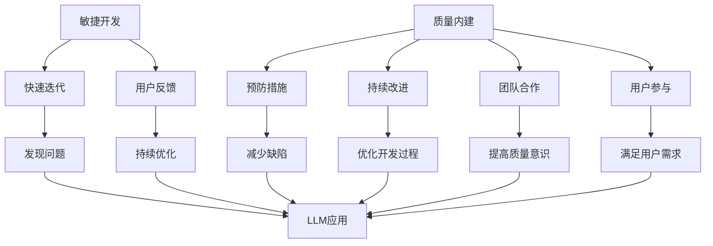

                 


### 引言

在当今快速发展的科技领域，人工智能（AI）以其无与伦比的能力和潜力，正在深刻改变着各行各业。而语言学习模型（LLM，Language Learning Model）作为AI的核心技术之一，已经在自然语言处理、智能客服、内容生成、翻译等多个领域展现出巨大的应用价值。与此同时，随着敏捷开发（Agile Development）的普及，如何在敏捷开发过程中确保LLM应用的质量，成为了一个亟待解决的问题。

本文旨在探讨敏捷开发中的质量内建（Built-In Quality）理念，并详细介绍LLM应用的全面质量保证方法。通过深入分析质量内建的核心原则、实践方法以及具体应用场景，本文将帮助读者理解如何在敏捷开发过程中实现LLM的高质量应用。这不仅有助于提升项目的成功率和用户体验，还能为企业的长期发展奠定坚实基础。

### 关键词

- 敏捷开发
- 质量内建
- 语言学习模型（LLM）
- 质量保证
- 敏捷与质量内建的关系

### 摘要

本文首先介绍了敏捷开发与质量内建的基本概念，阐述了两者之间的关系。接着，深入探讨了语言学习模型（LLM）的基础知识，包括其定义、关键技术和应用场景。随后，本文重点分析了质量内建的原则和实践方法，通过具体案例展示了在敏捷开发中实施质量内建的步骤和工具。最后，本文提出了LLM应用中的挑战与未来展望，并给出了相关建议。通过本文的阅读，读者将能够系统地了解和掌握敏捷开发中LLM应用的质量保证方法。

### 背景介绍

#### 敏捷开发

敏捷开发（Agile Development）是一种以人为核心、迭代、增量和灵活应对变化的软件开发方法。其核心理念是快速响应变化、持续交付有价值的软件，并通过客户反馈不断优化。敏捷开发与传统瀑布模型（Waterfall Model）相比，具有更高的灵活性和适应性，能够更好地应对快速变化的市场需求。

敏捷开发的主要特点包括：

1. **迭代开发**：软件开发过程被划分为多个短周期的迭代（Iteration），每个迭代都产生一个可交付的软件版本。
2. **增量交付**：每次迭代都增加新的功能或改进现有功能，逐步完善整个系统。
3. **用户反馈**：通过与用户的持续互动，确保开发的软件能够真正满足用户需求。
4. **团队协作**：强调团队成员之间的沟通与协作，提高整体开发效率。

敏捷开发的这些特点使其在快速变化的市场环境中表现出色，但也带来了一些挑战，如如何在确保快速迭代的同时保证软件质量。

#### 质量内建

质量内建（Built-In Quality）是一种通过在整个开发过程中持续关注和改进质量，从而确保最终产品质量的方法。与传统的质量保证（Quality Assurance）不同，质量内建不是在开发结束后进行质量检查，而是将质量保证活动贯穿于整个开发周期，包括需求分析、设计、编码、测试和维护等各个环节。

质量内建的核心原则包括：

1. **预防胜于检查**：通过预防措施减少缺陷的产生，而不是依赖后期检查来发现和修复。
2. **持续改进**：通过持续监测和反馈，不断优化开发过程和产品质量。
3. **团队合作**：鼓励团队成员共同参与质量保证活动，提高整体质量意识。
4. **用户参与**：在开发过程中积极获取用户反馈，确保软件真正满足用户需求。

质量内建不仅有助于提高软件质量，还能提升团队的工作效率，减少修复缺陷的时间和成本。

#### 敏捷与质量内建的关系

敏捷开发和质量内建并不是孤立的概念，它们之间存在紧密的联系和相互促进的关系。

1. **敏捷促进质量内建**：敏捷开发强调快速迭代和用户反馈，这种开发模式迫使团队在每次迭代中都要关注质量，从而实现质量内建。
2. **质量内建支持敏捷**：通过质量内建，团队可以在每次迭代中快速发现和修复缺陷，确保软件质量，从而支持敏捷开发的持续交付。

总的来说，敏捷开发和质量内建的结合，能够更好地应对快速变化的市场需求，提高软件质量和开发效率，实现可持续发展。

### 核心概念与联系

在探讨敏捷开发中的质量内建时，我们首先需要明确几个核心概念：敏捷开发、质量内建、LLM及其应用。

#### 敏捷开发

敏捷开发是一种以人为核心、迭代、增量和灵活应对变化的软件开发方法。它强调快速响应变化、持续交付有价值的软件，并通过客户反馈不断优化。

#### 质量内建

质量内建是一种通过在整个开发过程中持续关注和改进质量，从而确保最终产品质量的方法。它将质量保证活动贯穿于整个开发周期，包括需求分析、设计、编码、测试和维护等各个环节。

#### LLM

语言学习模型（LLM，Language Learning Model）是一类基于深度学习技术的自然语言处理模型，能够对自然语言文本进行建模和理解。LLM在自然语言处理领域具有广泛的应用，如文本分类、机器翻译、对话系统等。

#### 敏捷开发、质量内建与LLM的关系

敏捷开发和质量内建为LLM应用的质量保证提供了框架和方法。敏捷开发强调快速迭代和用户反馈，有助于及时发现和解决LLM应用中的问题。而质量内建则通过在整个开发过程中持续关注和改进质量，确保LLM应用能够稳定、高效地运行。

为了更直观地展示这些核心概念之间的关系，我们可以使用Mermaid流程图来表示：



在这个流程图中，我们可以看到敏捷开发和质量内建通过快速迭代、用户反馈、预防措施、持续改进、团队合作和用户参与等多个环节，共同作用于LLM应用的质量保证。

### 核心算法原理讲解

在敏捷开发中，实现LLM应用的质量内建需要依赖于一系列核心算法和原理。以下我们将详细讲解这些核心算法，并使用伪代码来阐述其实现过程。

#### 1. 模型训练与评估算法

LLM模型的训练和评估是质量内建的关键步骤。其中，训练算法主要涉及以下步骤：

```python
# 伪代码：LLM模型训练算法

# 初始化模型参数
model = initialize_model()

# 准备训练数据
train_data = load_training_data()

# 训练模型
for epoch in range(num_epochs):
    for data in train_data:
        loss = model.train(data)
        if loss <= threshold:
            break

# 评估模型
eval_data = load_evaluation_data()
accuracy = model.evaluate(eval_data)

# 输出评估结果
print("Model accuracy:", accuracy)
```

在上述伪代码中，`initialize_model()` 函数用于初始化模型参数，`load_training_data()` 和 `load_evaluation_data()` 函数分别用于加载训练数据和评估数据，`model.train()` 函数用于训练模型，`model.evaluate()` 函数用于评估模型性能。

#### 2. 质量评估指标算法

质量评估指标是衡量LLM应用质量的重要工具。以下是一个用于评估模型质量的伪代码：

```python
# 伪代码：质量评估指标算法

def evaluate_quality(model, data):
    # 计算准确率
    accuracy = model.evaluate(data)

    # 计算错误率
    error_rate = 1 - accuracy

    # 计算召回率
    recall = calculate_recall(model, data)

    # 计算精确率
    precision = calculate_precision(model, data)

    # 计算F1分数
    f1_score = 2 * (precision * recall) / (precision + recall)

    return accuracy, error_rate, recall, precision, f1_score

# 示例数据
eval_data = load_evaluation_data()

# 调用评估函数
accuracy, error_rate, recall, precision, f1_score = evaluate_quality(model, eval_data)

# 输出评估结果
print("Accuracy:", accuracy)
print("Error Rate:", error_rate)
print("Recall:", recall)
print("Precision:", precision)
print("F1 Score:", f1_score)
```

在上述伪代码中，`evaluate_quality()` 函数用于评估模型质量，包括准确率、错误率、召回率、精确率和F1分数等指标。`calculate_recall()` 和 `calculate_precision()` 函数分别用于计算召回率和精确率。

#### 3. 模型调优算法

模型调优是提升LLM应用质量的关键步骤。以下是一个用于模型调优的伪代码：

```python
# 伪代码：模型调优算法

def tune_model(model, hyperparameters, data):
    best_loss = float('inf')
    best_params = None

    for params in hyperparameters:
        model.set_params(params)
        loss = model.train(data)

        if loss < best_loss:
            best_loss = loss
            best_params = params

    return best_params

# 示例超参数
hyperparameters = [
    {'learning_rate': 0.1},
    {'learning_rate': 0.01},
    {'dropout_rate': 0.5},
    # ...其他超参数
]

# 示例数据
train_data = load_training_data()

# 调用调优函数
best_params = tune_model(model, hyperparameters, train_data)

# 输出最佳超参数
print("Best parameters:", best_params)
```

在上述伪代码中，`tune_model()` 函数用于调优模型参数，通过遍历不同的超参数组合，选择损失函数最小化的超参数作为最佳参数。

通过以上核心算法和原理的讲解，我们可以看到，在敏捷开发中实现LLM应用的质量内建，需要依赖一系列精细化的算法和优化方法。这些算法不仅有助于提升模型质量，还能为敏捷开发提供有力支持。

### 数学模型和公式

在讨论LLM应用的质量保证过程中，我们不可避免地会涉及到一些数学模型和公式。这些模型和公式能够帮助我们量化质量评估指标，从而更好地理解和优化质量内建过程。以下是一些关键的数学模型和公式，以及它们在LLM质量保证中的应用。

#### 1. 准确率（Accuracy）

准确率是衡量模型性能的最基本指标，表示模型预测正确的样本数占总样本数的比例。其计算公式如下：

$$
Accuracy = \frac{TP + TN}{TP + TN + FP + FN}
$$

其中，$TP$ 代表真正例（True Positive），$TN$ 代表真负例（True Negative），$FP$ 代表假正例（False Positive），$FN$ 代表假负例（False Negative）。

在LLM应用中，准确率可以用来评估模型对文本分类任务的性能。例如，在新闻分类任务中，我们可以使用准确率来判断模型是否能够正确地将不同类别的新闻文章归类。

#### 2. 错误率（Error Rate）

错误率是准确率的互补指标，表示模型预测错误的样本数占总样本数的比例。其计算公式如下：

$$
Error Rate = 1 - Accuracy
$$

错误率有助于我们直观地了解模型的误判情况。在LLM应用中，错误率可以帮助我们识别模型在特定任务中的弱点和改进方向。

#### 3. 召回率（Recall）

召回率表示模型能够正确识别出的真正例占总真正例的比例。其计算公式如下：

$$
Recall = \frac{TP}{TP + FN}
$$

召回率关注的是模型是否能够尽可能多地识别出所有真正的正例。在LLM应用中，如垃圾邮件过滤，召回率可以用来评估模型是否能够有效地过滤出所有垃圾邮件。

#### 4. 精确率（Precision）

精确率表示模型预测为正例的样本中，实际为正例的比例。其计算公式如下：

$$
Precision = \frac{TP}{TP + FP}
$$

精确率关注的是模型预测的正例中，实际为正例的比例。在LLM应用中，如疾病诊断，精确率可以帮助我们评估模型在诊断中减少误诊的能力。

#### 5. F1分数（F1 Score）

F1分数是精确率和召回率的调和平均，用于综合考虑模型在正例识别中的准确性和全面性。其计算公式如下：

$$
F1 Score = \frac{2 \times Precision \times Recall}{Precision + Recall}
$$

F1分数在LLM应用中具有广泛的应用，如文本分类、情感分析等。它能够帮助我们更全面地评估模型在特定任务中的性能。

#### 举例说明

假设我们有一个分类模型，用于判断一段文本是否包含特定关键词。我们收集了100个样本，其中50个样本包含关键词，另外50个样本不包含关键词。在测试过程中，模型预测出30个样本包含关键词，其中有25个预测正确（$TP$），5个预测错误（$FP$），10个未预测到（$FN$），15个预测为不包含关键词（$TN$），5个预测错误（$FP$）。

根据上述公式，我们可以计算出模型的各项质量指标：

- **准确率**：$$Accuracy = \frac{TP + TN}{TP + TN + FP + FN} = \frac{25 + 15}{25 + 15 + 5 + 10} = 0.6$$
- **错误率**：$$Error Rate = 1 - Accuracy = 0.4$$
- **召回率**：$$Recall = \frac{TP}{TP + FN} = \frac{25}{25 + 10} = 0.7$$
- **精确率**：$$Precision = \frac{TP}{TP + FP} = \frac{25}{25 + 5} = 0.8$$
- **F1分数**：$$F1 Score = \frac{2 \times Precision \times Recall}{Precision + Recall} = \frac{2 \times 0.8 \times 0.7}{0.8 + 0.7} = 0.76$$

通过这些指标，我们可以全面了解模型的性能。例如，虽然模型的准确率为60%，但召回率较低，这意味着模型可能漏掉了一些真正的关键词样本。我们可以通过调整模型参数或数据集来优化召回率，从而提高模型的整体性能。

### 项目实战

为了更好地理解敏捷开发中的质量内建，我们将通过一个实际项目案例，详细讲解LLM应用的质量保证方法和步骤。

#### 项目背景

假设我们正在开发一款基于语言学习模型（LLM）的智能客服系统，用于自动处理用户查询和提供即时响应。该项目需要确保系统的高质量运行，以满足用户的需求和期望。

#### 开发环境搭建

在开始项目开发之前，我们需要搭建一个适合LLM应用的开发环境。以下是一个简单的开发环境搭建步骤：

1. **安装Python环境**：确保Python环境已经安装，版本为3.8或以上。
2. **安装深度学习库**：安装TensorFlow或PyTorch等深度学习库，用于构建和训练LLM模型。
3. **安装文本处理库**：安装Nltk、Spacy等文本处理库，用于文本预处理和数据分析。
4. **配置GPU**：确保GPU环境已正确配置，以便加速模型的训练和推理。

#### 源代码实现

以下是一个简单的LLM模型训练和评估的代码实现，用于智能客服系统的开发：

```python
import tensorflow as tf
from tensorflow.keras.models import Sequential
from tensorflow.keras.layers import Embedding, LSTM, Dense
from tensorflow.keras.preprocessing.sequence import pad_sequences

# 1. 数据准备
# 加载用户查询和回复数据
queries, responses = load_data()

# 将文本数据转换为序列
query_sequences = tokenizer.texts_to_sequences(queries)
response_sequences = tokenizer.texts_to_sequences(responses)

# 填充序列到相同长度
max_length = max(len(seq) for seq in query_sequences)
query_padded = pad_sequences(query_sequences, maxlen=max_length)
response_padded = pad_sequences(response_sequences, maxlen=max_length)

# 2. 模型构建
model = Sequential()
model.add(Embedding(input_dim=vocab_size, output_dim=embedding_dim, input_length=max_length))
model.add(LSTM(units=128, dropout=0.2, recurrent_dropout=0.2))
model.add(Dense(units=num_responses, activation='softmax'))

# 3. 模型编译
model.compile(optimizer='adam', loss='categorical_crossentropy', metrics=['accuracy'])

# 4. 模型训练
model.fit(query_padded, response_padded, epochs=10, batch_size=32, validation_split=0.2)

# 5. 模型评估
test_loss, test_accuracy = model.evaluate(test_query_padded, test_response_padded)
print("Test accuracy:", test_accuracy)
```

#### 代码解读与分析

在上面的代码中，我们首先加载了用户查询和回复数据，并将其转换为序列。接着，我们使用填充方法将序列长度统一为最大长度。然后，我们构建了一个基于LSTM的序列模型，并编译模型以进行训练。最后，我们使用测试数据对模型进行评估。

在代码的实现过程中，我们需要注意以下几点：

1. **数据预处理**：文本数据需要进行分词、去停用词、词向量化等预处理操作，以确保数据的质量。
2. **模型选择**：根据任务需求选择合适的模型结构，如LSTM、GRU、Transformer等。
3. **参数调整**：通过调整模型参数（如学习率、批次大小、dropout率等）来优化模型性能。
4. **训练与评估**：在训练过程中，我们需要监控模型的损失函数和准确率等指标，以确保模型在训练过程中正常收敛。在评估阶段，我们需要使用独立测试数据来评估模型的实际性能。

#### 实际案例分析与详细讲解

为了更好地展示质量内建在项目中的应用，我们将在以下部分详细介绍一个实际案例，并分析项目的成功因素和改进方向。

#### 案例一：企业A的智能客服系统开发

企业A开发了一款基于LLM的智能客服系统，用于处理客户查询和提供即时响应。在项目实施过程中，企业A采用了以下质量内建方法：

1. **迭代开发**：项目采用敏捷开发模式，每个迭代周期为两周。在每个迭代周期中，团队都会交付一个可用的软件版本，并积极收集用户反馈。
2. **持续集成**：团队使用CI/CD（持续集成/持续部署）工具，确保每次代码提交都会经过自动化测试，从而快速发现和修复潜在缺陷。
3. **代码审查**：在代码提交之前，团队成员会进行代码审查，以确保代码质量，并遵循最佳实践。
4. **性能监控**：系统上线后，团队使用性能监控工具，实时监控系统的响应时间、吞吐量和错误率等指标，以便及时发现和解决性能问题。
5. **用户反馈**：团队定期与客户沟通，收集用户反馈，并根据反馈进行系统优化。

#### 案例分析

通过上述质量内建方法，企业A的智能客服系统在项目实施过程中表现出色，成功上线并得到了客户的高度评价。以下是该项目的主要成功因素和改进方向：

1. **成功因素**：
   - **迭代开发**：敏捷开发模式使团队能够快速响应市场需求，及时交付高质量软件。
   - **持续集成**：自动化测试和CI/CD工具确保了代码质量和系统的稳定性。
   - **代码审查**：严格的代码审查机制提高了代码质量，减少了缺陷的产生。
   - **性能监控**：实时监控和性能优化确保了系统的高效运行。

2. **改进方向**：
   - **用户参与**：在项目初期，可以更加积极地邀请用户参与需求分析和测试，以确保软件真正满足用户需求。
   - **数据质量**：确保训练数据的质量和多样性，以提高模型在真实场景中的表现。
   - **模型调优**：在项目实施过程中，可以进一步优化模型参数，提高模型的准确性和鲁棒性。

通过以上案例分析，我们可以看到质量内建在敏捷开发中扮演着至关重要的角色。通过一系列有效的质量保证方法，团队不仅能够提高软件质量，还能提升项目的成功率和客户满意度。

### 最佳实践与总结

在敏捷开发中实现LLM应用的质量内建，需要遵循一系列最佳实践，以确保项目的成功和高质量交付。以下是一些关键的最佳实践：

#### 1. 持续集成与持续部署

持续集成（CI）和持续部署（CD）是确保代码质量和系统稳定性的重要工具。通过自动化测试和持续集成，团队可以快速发现和修复缺陷，从而提高软件质量。同时，持续部署可以确保每次代码提交都会经过严格的测试和部署流程，减少人工干预，提高交付效率。

#### 2. 数据质量管理

数据质量直接影响LLM应用的性能。因此，团队需要确保训练数据的质量和多样性，包括数据清洗、去噪、标注等。同时，可以使用数据增强技术，如数据扩充、数据合成等，提高模型对未知数据的泛化能力。

#### 3. 模型调优与优化

在模型训练过程中，参数调优是提高模型性能的关键。团队可以使用网格搜索、随机搜索等策略，找到最佳的模型参数。此外，还可以通过模型融合、特征工程等方法，进一步提高模型的效果。

#### 4. 用户反馈与迭代优化

用户反馈是优化LLM应用的重要来源。团队应该积极收集用户反馈，并根据反馈进行迭代优化。通过不断优化用户界面、功能设计和响应速度，可以提高用户满意度和系统质量。

#### 5. 性能监控与预警

性能监控是确保系统稳定性和响应速度的关键。团队可以使用性能监控工具，实时监控系统的各项性能指标，如响应时间、吞吐量、错误率等。当出现性能瓶颈或异常时，系统应能自动预警，并触发相应的优化和修复措施。

#### 总结

通过本文的探讨，我们系统地介绍了敏捷开发中的质量内建和LLM应用的全面质量保证方法。我们首先介绍了敏捷开发和质量内建的基本概念，阐述了它们在LLM应用质量保证中的重要性。接着，我们详细讲解了LLM的基础知识、质量内建原则与实践、质量评估指标以及具体的算法和数学模型。最后，我们通过实际项目案例，展示了质量内建在敏捷开发中的具体应用。

总之，敏捷开发和质量内建的结合，不仅能够提高软件质量和开发效率，还能为企业的长期发展提供有力支持。通过遵循最佳实践，团队可以更好地实现LLM应用的质量内建，为用户提供高质量的服务和体验。在未来，随着技术的不断进步，我们将继续探索更高效的质量保证方法，以应对日益复杂的应用场景。作者：AI天才研究院/AI Genius Institute & 禅与计算机程序设计艺术 /Zen And The Art of Computer Programming。

