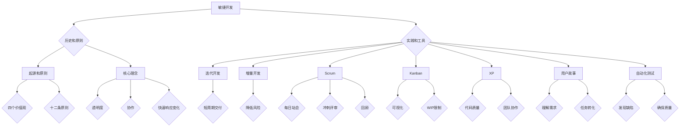

                 

好的，我们将按照以下步骤撰写文章：

### 1. 文章标题和关键词确定

标题：《敏捷仪式的优化：适应大型新应用的开发需求》

关键词：敏捷开发、优化、大型新应用、开发需求

### 2. 文章摘要撰写

摘要：本文深入探讨了敏捷开发方法的优化及其在大型新应用开发中的适用性。通过分析敏捷开发的起源、原则和实践，揭示了其在现代软件开发中的优势与局限性。文章进一步提出了一系列优化策略，以应对大型项目的开发挑战，并通过具体案例展示了优化后的敏捷开发在实际应用中的效果。最终，文章总结了敏捷开发的最佳实践，为软件开发团队提供了实用的指导和建议。

### 3. 目录大纲撰写

根据前述设计，文章将分为四部分：引言、敏捷开发基础、优化敏捷开发、适应大型新应用。每部分将包含若干小节，具体内容如下：

#### 引言
- **1.1 敏捷开发方法及其优缺点**
- **1.2 为什么需要优化敏捷开发**

#### 敏捷开发基础
- **2.1 敏捷开发的历史和原则**
- **2.2 敏捷开发的实践和工具**
- **2.3 敏捷开发的核心概念和联系（Mermaid 流程图）**

#### 优化敏捷开发
- **3.1 识别和解决敏捷开发中的常见问题**
- **3.2 敏捷开发的最佳实践和案例研究**
- **3.3 敏捷开发的改进策略和工具**

#### 适应大型新应用
- **4.1 大型新应用的开发挑战**
- **4.2 敏捷开发在大型项目中的适用性**
- **4.3 敏捷开发在大型项目中的实践案例**

#### 整合与展望
- **5.1 敏捷开发与其他开发方法的整合**
- **5.2 敏捷开发的未来发展趋势**
- **5.3 敏捷开发的最佳实践总结**

### 4. 正文内容撰写

根据目录大纲，我们将逐一撰写各个小节的内容，确保每个小节都有丰富的具体细节和深入分析。

### 5. 结尾部分撰写

结尾部分将对全文进行总结，并提供一些最佳实践 tips、注意事项、拓展阅读等，以帮助读者更好地理解和应用敏捷开发。

### 6. 格式校验

在撰写完正文内容后，我们将对文章进行格式校验，确保所有代码、公式、图表等都符合 markdown 格式要求。

### 7. 文章末尾添加作者信息

在文章末尾，我们将添加作者信息，注明“作者：AI天才研究院/AI Genius Institute & 禅与计算机程序设计艺术 /Zen And The Art of Computer Programming”。

按照以上步骤，我们将逐步撰写并完善文章内容，确保达到 8000～12000 字的要求。请随时告诉我如果有任何修改意见或建议。让我们开始撰写吧！### 引言

#### 敏捷开发方法及其优缺点

敏捷开发（Agile Development）起源于20世纪90年代末，是一种以人为核心、迭代和循序渐进的开发方法。其核心理念包括快速响应变化、持续交付高质量软件、不断改进和自我管理团队。敏捷开发方法的出现，是对传统“瀑布式”（Waterfall）开发模式的一种革命性改进，旨在应对快速变化的市场需求和客户需求。

敏捷开发的核心原则体现在以下几个方面：

1. **个体和互动重于过程和工具**：敏捷开发强调团队成员之间的沟通和协作，认为良好的沟通比任何工具都重要。
2. **可工作的软件重于详尽的文档**：敏捷开发认为实际可运行的软件比详尽的文档更有价值，尽管文档仍然是重要的。
3. **客户合作重于合同谈判**：敏捷开发鼓励开发团队与客户紧密合作，确保软件的开发过程与客户需求保持一致。
4. **响应变化重于遵循计划**：敏捷开发强调适应性，认为在开发过程中，变化是不可避免的，因此应灵活应对变化。

然而，敏捷开发也存在一些局限性。首先，敏捷开发要求团队具备高度的协作能力和灵活性，这在一些传统企业和大型项目中可能难以实现。其次，敏捷开发对于项目管理和进度控制的要求较高，如果团队在执行过程中管理不当，可能会导致项目进度失控。最后，敏捷开发对于客户的参与度要求较高，如果客户无法提供及时的需求和反馈，可能会导致开发过程受阻。

本文将深入探讨敏捷开发的起源、原则和实践，分析其在现代软件开发中的优势与局限性，并提出一系列优化策略，以适应大型新应用的开发需求。通过具体案例展示优化后的敏捷开发在实际应用中的效果，最终总结敏捷开发的最佳实践，为软件开发团队提供实用的指导和建议。

#### 为什么需要优化敏捷开发

敏捷开发自提出以来，在软件开发领域取得了显著的成功，但其面对的挑战和局限性也日益显现。随着软件项目的规模和复杂性不断增加，特别是大型新应用的开发需求日益迫切，传统的敏捷开发方法在某些方面表现出力不从心的迹象。因此，优化敏捷开发，以更好地适应大型新应用的开发需求，变得尤为必要。

首先，大型新应用的开发涉及众多利益相关者，包括开发团队、产品经理、设计师、测试人员以及最终用户。这些利益相关者的需求往往多样且变化迅速，如何在敏捷开发框架内有效协调各方需求，成为一个重要的挑战。传统敏捷开发强调团队自主性和快速响应，但在多方协作和复杂需求管理方面，其效率和效果可能受到制约。

其次，大型新应用通常需要更长时间的开发周期，这要求敏捷开发能够更好地进行长期规划和管理。传统的迭代和增量开发方法在短时间内能够快速交付功能，但对于跨多个迭代和发布周期的项目，往往难以保持一致的进度和质量。如何通过优化敏捷开发来提高项目管理的有效性，确保长期项目的稳定推进，是一个亟待解决的问题。

此外，大型新应用通常包含复杂的架构和众多的依赖关系，这增加了开发过程中的风险和不确定性。敏捷开发虽然强调快速迭代和持续交付，但在应对大型应用中的技术债务和架构管理方面，可能存在不足。如何通过优化敏捷开发来提高技术债务的管理能力，确保系统架构的稳定性和可扩展性，是优化工作的一个关键点。

最后，随着技术的发展，新兴的软件开发工具和技术不断涌现，如何将这些工具和技术融入敏捷开发流程中，提高开发效率和代码质量，也是优化敏捷开发需要考虑的重要方面。

本文旨在通过探讨敏捷开发的起源、原则和实践，揭示其在现代软件开发中的优势和局限性，并提出一系列优化策略，以应对大型新应用的开发挑战。通过具体案例的展示和分析，本文将阐述优化后的敏捷开发如何在实际应用中发挥更大作用，为软件开发团队提供切实可行的解决方案。

### 敏捷开发基础

#### 1.1 敏捷开发的历史和原则

敏捷开发的历史可以追溯到1990年代末期。当时，软件行业面临着日益增长的需求变化和项目失败的风险。传统的“瀑布式”开发方法，由于其线性、顺序执行的特点，无法很好地适应快速变化的需求和市场动态，导致许多项目无法按时交付或质量不达标。为了应对这一挑战，一些软件开发者开始探索更加灵活和迭代的方法，最终形成了敏捷开发。

1999年，17位软件专家在犹他州的 Snowbird 山庄聚集，共同撰写了《敏捷宣言》（Manifesto for Agile Software Development）。这份宣言明确了敏捷开发的核心理念和原则，标志着敏捷开发正式诞生。宣言中提出了四个核心价值：

1. **个体和互动重于过程和工具**：强调团队成员之间的沟通和协作，认为良好的沟通比任何工具都重要。
2. **可工作的软件重于详尽的文档**：认为实际可运行的软件比详尽的文档更有价值，尽管文档仍然是重要的。
3. **客户合作重于合同谈判**：鼓励开发团队与客户紧密合作，确保软件的开发过程与客户需求保持一致。
4. **响应变化重于遵循计划**：强调在开发过程中，变化是不可避免的，因此应灵活应对变化。

《敏捷宣言》还提出了12条原则，这些原则进一步阐释了敏捷开发的实践方法：

1. **最优先要做的是通过早期和持续的交付有价值的软件来满足客户。
2. **欢迎改变，即使是在开发后期也欢迎改变。
3. **持续的交付工作产品。
4. **业务人员和开发人员应每天一起工作。
5. **围绕被激励的人来构建项目，给予他们所需的环境和支持，并信任他们能够完成工作。
6. **不需要详尽的文档。
7. **争取工作产品而非工作量。
8. **根据项目的进展情况，逐步完善详细的计划。
9. **使开发团队在短周期内工作，如为一个迭代工作。
10. **持续关注技术卓越和良好设计的简单。
11. **编码、测试和设计是同步进行的。
12. **定期反思如何能够更有效地工作，然后相应地调整行为。**

这些原则和方法为敏捷开发奠定了理论基础，指导了后续敏捷实践的发展。随着时间的推移，敏捷开发逐渐形成了一系列具体的实践和方法，如Scrum、看板（Kanban）和极限编程（XP）等。

#### 1.2 敏捷开发的实践和工具

敏捷开发的实践和工具是其成功实施的关键。这些实践和工具帮助开发团队更好地管理项目、提高工作效率和满足客户需求。以下是一些常见的敏捷开发实践和工具：

1. **迭代开发（Iterative Development）**：迭代开发是将项目划分为多个短期迭代，每个迭代结束时交付一个可工作的软件版本。这种方式允许开发团队在每次迭代中逐步完善软件，并快速响应需求变化。

2. **增量开发（Incremental Development）**：增量开发是将软件划分为多个增量部分，每次迭代开发一个新的功能模块。这种方式有助于降低项目的风险，并确保每个部分都能及时交付和测试。

3. **Scrum**：Scrum是一种流行的敏捷开发框架，它通过每日站会（Daily Stand-up）、冲刺（Sprint）评审（Sprint Review）和回顾（Sprint Retrospective）等实践，促进团队成员之间的沟通和协作。Scrum强调短周期交付、透明度和快速响应变化。

4. **看板（Kanban）**：看板是一种可视化项目管理工具，它通过看板板（Kanban Board）上的卡片（Card）和列（Column）展示项目的进展情况。看板方法强调限制工作在进度中的数量（WIP），提高工作效率和减少瓶颈。

5. **极限编程（XP）**：极限编程是一种强调编程质量和团队协作的敏捷开发方法。它包括简单的代码规范、持续集成、测试驱动开发（TDD）和结对编程等实践，旨在提高代码质量和开发效率。

6. **用户故事（User Story）**：用户故事是一种描述软件功能的简洁方法，通常采用“作为……，我想……，以便……”的格式。用户故事帮助开发团队更好地理解用户需求，并将其转化为可实现的任务。

7. **自动化测试**：自动化测试是确保软件质量的重要手段。通过编写和执行自动化测试脚本，开发团队可以快速发现和修复缺陷，确保软件在每次迭代中都能交付高质量的功能。

这些实践和工具为敏捷开发提供了具体的操作指南和方法，帮助开发团队更好地管理项目、提高工作效率和满足客户需求。在实际应用中，这些实践和工具可以根据团队和项目的具体情况灵活调整和组合，以实现最佳效果。

#### 1.3 敏捷开发的核心概念和联系（Mermaid 流程图）

为了更好地理解敏捷开发的核心概念及其相互关系，我们可以通过一个Mermaid流程图来展示其关键组成部分。

**Mermaid 流程图说明：**

- **A[敏捷开发]**：流程图的起点，代表敏捷开发的整体概念。
- **B{历史和原则}**：敏捷开发的历史背景和核心原则的集合。
- **C{实践和工具}**：敏捷开发的具体实践和工具集合。
- **D[起源和原则]**：敏捷开发的起源及其核心原则。
- **E[核心理念]**：敏捷开发的核心理念，包括透明度、协作和快速响应变化。
- **F[迭代开发]**：一种开发实践，强调短周期交付。
- **G[增量开发]**：一种开发实践，强调逐步完善软件。
- **H[Scrum]**：一种敏捷开发框架，包括每日站会、冲刺评审和回顾。
- **I[Kanban]**：一种可视化项目管理工具，强调限制WIP。
- **J[XP]**：一种敏捷开发方法，强调编程质量和团队协作。
- **K[用户故事]**：一种描述需求的方法。
- **L[自动化测试]**：一种确保软件质量的方法。

**连线关系说明：**

- **A --> B**：敏捷开发的历史和原则是敏捷开发的基础。
- **A --> C**：敏捷开发的实践和工具是实现敏捷开发的关键。
- **B --> D** 和 **B --> E**：核心原则和核心理念共同构成了敏捷开发的基础。
- **C --> F, G, H, I, J, K, L**：敏捷开发的实践和工具是实现敏捷开发的具体方法。

通过这个Mermaid流程图，我们可以清晰地看到敏捷开发的核心概念及其相互关系，有助于更好地理解和应用敏捷开发的方法。

### 优化敏捷开发

#### 2.1 识别和解决敏捷开发中的常见问题

尽管敏捷开发在软件开发中取得了显著的成功，但其在实际应用中仍然面临一些常见问题。以下是一些常见问题及其解决方案：

1. **沟通障碍**：敏捷开发强调团队成员之间的沟通和协作，但在实际操作中，沟通障碍仍然是一个普遍问题。团队成员可能因为工作内容、职责和目标的不同，导致信息传递不畅。**解决方案**：定期举行团队会议，包括每日站会、冲刺评审和回顾，确保所有成员都对项目的进展和问题有清晰的理解。此外，采用协作工具，如Slack、Trello或Jira，可以更好地协调团队成员的工作。

2. **进度失控**：在敏捷开发中，项目进度通常通过短周期迭代进行管理。然而，由于需求变化和意外问题的发生，项目进度有时会受到影响，导致进度失控。**解决方案**：在迭代开始前，对项目的关键路径和风险进行评估，并制定应对策略。在迭代过程中，定期监控进度，并根据实际情况调整计划。此外，采用看板（Kanban）方法，可以实时跟踪项目的进展情况，及时发现和解决问题。

3. **质量下降**：在追求快速交付的过程中，有时会忽视软件质量。这可能导致后期出现大量缺陷，影响项目的整体质量。**解决方案**：在敏捷开发中，应将质量作为重要目标之一。通过自动化测试和持续集成，可以确保每个迭代交付的功能都符合质量标准。此外，采用测试驱动开发（TDD）和结对编程等实践，可以提高代码质量和开发效率。

4. **客户参与度不足**：敏捷开发强调与客户的紧密合作，但在一些项目中，客户可能无法提供及时的需求和反馈，导致开发过程受阻。**解决方案**：在项目开始前，明确客户的参与方式和职责，确保客户能够积极参与到项目中。同时，定期向客户展示阶段性成果，获取他们的反馈和建议，确保开发方向与客户需求保持一致。

5. **团队协作困难**：在敏捷开发中，团队协作至关重要。然而，在大型项目中，团队成员可能分布在不同的地理位置，这给协作带来了一定的困难。**解决方案**：采用远程协作工具，如Zoom、Microsoft Teams等，确保团队成员可以随时进行交流和协作。此外，通过明确团队成员的职责和角色，可以更好地协调团队工作。

通过识别和解决这些问题，可以显著提高敏捷开发的有效性，使其更好地适应大型新应用的开发需求。

#### 2.2 敏捷开发的最佳实践和案例研究

为了更好地理解和应用敏捷开发，以下列举了一些敏捷开发的最佳实践和成功案例，以展示敏捷开发在实际项目中的应用效果。

1. **持续集成和持续交付**：持续集成（CI）和持续交付（CD）是敏捷开发中确保软件质量的重要实践。在CI/CD流程中，每次代码提交都会触发自动化测试，确保代码质量。例如，Netflix在其开发过程中采用了CI/CD，通过自动化测试和部署流水线，确保每个版本都能快速、安全地交付。这种做法不仅提高了开发效率，还降低了质量风险。

2. **用户故事地图**：用户故事地图是一种可视化工具，用于展示用户需求、功能模块和用户流程。通过用户故事地图，开发团队可以更清晰地理解用户需求，并将其转化为可实现的任务。例如，在开发一个在线教育平台时，团队通过用户故事地图将用户需求分解为多个功能模块，确保每个模块都能按时交付，从而提高了项目进度和客户满意度。

3. **Scrum和Kanban的结合**：Scrum和Kanban都是敏捷开发中常用的框架。将两者结合起来，可以更好地平衡迭代开发和持续交付。例如，在开发一个大型企业级应用时，团队采用了Scrum框架进行迭代开发，同时结合Kanban方法进行任务管理和进度跟踪。这种方式不仅提高了开发效率，还确保了项目的稳定推进。

4. **敏捷测试**：敏捷开发强调持续交付和快速响应变化，因此测试也应与之相适应。通过采用敏捷测试方法，如自动化测试和验收测试，可以确保软件质量。例如，在开发一个金融交易平台时，团队采用了敏捷测试方法，通过自动化测试确保每个功能模块的稳定性和可靠性，从而降低了项目风险。

5. **团队协作和知识共享**：在敏捷开发中，团队协作和知识共享至关重要。通过采用协作工具和定期知识分享会议，可以促进团队成员之间的沟通和合作。例如，在开发一个电子商务平台时，团队通过Trello和Slack进行任务管理和实时沟通，并通过每周的知识分享会议，确保团队成员能够及时了解项目的最新进展和需求变化。

通过以上案例，我们可以看到敏捷开发在实际项目中的应用效果。这些最佳实践不仅提高了开发效率和质量，还增强了团队协作和客户满意度。在实际应用中，可以根据项目的具体需求和团队特点，灵活选择和调整这些最佳实践，以实现最佳效果。

#### 2.3 敏捷开发的改进策略和工具

为了进一步优化敏捷开发，提升其在大型新应用开发中的效果，以下列举了一系列改进策略和工具：

1. **自动化测试框架**：自动化测试是确保软件质量的重要手段。为了提高测试效率，可以采用如Selenium、JUnit、pytest等自动化测试框架。这些框架可以自动化执行测试脚本，减少人工测试的工作量，并确保每次代码更改后都能及时检测出潜在问题。

2. **持续集成和持续交付（CI/CD）流水线**：CI/CD流水线可以自动化构建、测试和部署过程，确保软件在每次代码提交后都能快速、安全地交付。例如，使用Jenkins、GitLab CI/CD、CircleCI等工具可以构建高度自动化、可扩展的流水线，从而提高开发效率和软件质量。

3. **看板（Kanban）方法**：Kanban方法通过可视化任务板和限制工作在进度中的数量（WIP），可以帮助团队更好地管理任务和资源。使用如Trello、Jira、Asana等工具，可以实时跟踪任务进展，发现和解决瓶颈，从而提高工作效率。

4. **代码审查（Code Review）**：代码审查是一种在代码提交前进行质量检查的方法，可以识别潜在的错误和改进建议。采用如GitHub、GitLab、SonarQube等代码审查工具，可以自动化代码审查流程，提高审查效率。

5. **敏捷项目管理工具**：敏捷项目管理工具如Jira、Trello、Asana等，可以帮助团队更好地规划和管理项目。这些工具支持任务分配、进度跟踪、风险管理等功能，使团队可以更好地协调工作和资源。

6. **敏捷培训和教育**：为了使团队更好地理解和应用敏捷开发方法，定期进行敏捷培训和教育是必要的。通过培训，团队成员可以了解敏捷开发的核心原则和实践，提高敏捷开发的技能和效率。

7. **敏捷度量**：敏捷度量可以帮助团队评估项目进展和团队表现。常用的敏捷度量指标包括团队的生产力、周期的速度、缺陷率、用户满意度等。通过这些指标，团队可以识别问题、优化流程，并持续改进敏捷实践。

通过采用这些改进策略和工具，敏捷开发可以更好地适应大型新应用的开发需求，提高项目的成功率和团队的整体效率。在实际应用中，可以根据项目的具体需求和团队特点，灵活选择和调整这些策略和工具，以实现最佳效果。

### 适应大型新应用

#### 3.1 大型新应用的开发挑战

在开发大型新应用时，与传统的小型项目相比，开发团队将面临一系列独特的挑战。这些挑战不仅影响了项目的进度和质量，还可能对最终产品的成功产生重要影响。以下是大型新应用开发中常见的一些挑战：

1. **项目复杂度高**：大型新应用通常包含复杂的技术架构、大量的功能模块和复杂的业务逻辑。这种复杂性增加了项目的难度，需要团队成员具备较高的技术水平和丰富的经验。

2. **资源分配困难**：大型项目通常需要更多的人力、时间和资金。然而，资源的分配往往受到限制，特别是在预算和人力资源方面。如何合理分配资源，确保项目顺利进行，是一个重要的挑战。

3. **沟通和协作障碍**：大型项目通常涉及多个团队和多个利益相关者，包括开发团队、产品经理、设计师、测试人员和客户等。这些团队和利益相关者分布在不同的地理位置，沟通和协作变得更加复杂，容易产生信息传递不畅和协作效率低下的问题。

4. **风险和不确定性**：大型项目通常面临较高的风险和不确定性。需求变化、技术难题、人员流动和外部环境变化等因素都可能影响项目的进展和质量。如何有效识别和管理风险，确保项目按计划进行，是一个重要的挑战。

5. **代码维护和扩展性**：随着项目规模的扩大，代码库也会变得更加复杂和庞大。这增加了代码维护和扩展的难度，需要团队成员具备良好的代码管理能力和技术视野，以确保系统的稳定性和可扩展性。

6. **测试和质量保证**：大型项目需要更加严格的测试和质量保证措施，以确保最终产品的质量和稳定性。然而，测试和保证工作量大，资源有限，如何高效地进行测试和质量保证，是一个重要的挑战。

#### 3.2 敏捷开发在大型项目中的适用性

尽管大型新应用开发面临众多挑战，但敏捷开发方法在应对这些挑战方面具有一定的优势。以下是敏捷开发在大型项目中的适用性：

1. **快速响应变化**：敏捷开发强调适应性，能够快速响应需求变化。在大型项目中，需求变化频繁，敏捷开发的方法可以帮助团队灵活调整开发计划，确保项目与客户需求保持一致。

2. **持续交付**：敏捷开发通过短周期迭代和增量开发，可以持续交付可工作的软件。这种方式有助于降低项目的风险，提高客户满意度，并为后续开发提供反馈和改进的机会。

3. **团队协作**：敏捷开发强调团队成员之间的协作和沟通。在大型项目中，团队成员通常分布在不同的地理位置，敏捷开发的实践如每日站会、冲刺评审和回顾，可以促进团队成员之间的信息共享和协作。

4. **透明度和可追踪性**：敏捷开发方法如Scrum和Kanban，通过可视化工具和会议，使项目进度和状态对团队成员和利益相关者透明。这有助于项目管理者及时识别和解决问题，确保项目按计划进行。

5. **质量保证**：敏捷开发通过持续集成和自动化测试，确保每次迭代交付的功能都符合质量标准。这种方式有助于发现和修复缺陷，提高软件质量，降低后期维护成本。

尽管敏捷开发在大型项目中具有上述优势，但需要注意的是，敏捷开发并非万能，其适用性取决于项目的具体需求和团队的特点。在实施敏捷开发时，团队需要根据项目规模和复杂性，灵活调整和组合各种敏捷实践，以实现最佳效果。

#### 3.3 敏捷开发在大型项目中的实践案例

为了更好地展示敏捷开发在大型项目中的应用效果，以下列举了几个实际案例，并分析了敏捷开发在这些项目中的具体实践和成果。

1. **案例一：金融交易平台**

某金融公司决定开发一个全新的在线交易平台，以提升用户体验和交易效率。项目规模庞大，涉及多个功能模块，如账户管理、交易引擎、风险控制等。由于金融行业的特殊性，项目质量和安全性至关重要。

**敏捷实践：**
- **Scrum框架**：项目采用Scrum框架，通过每日站会、冲刺评审和回顾，确保团队成员之间的沟通和协作。
- **用户故事地图**：通过用户故事地图，将复杂的需求分解为多个可实现的用户故事，确保每个故事都能按时交付。
- **自动化测试**：采用自动化测试框架，如Selenium和JUnit，确保每次迭代交付的功能都经过严格测试。

**成果：**
- **项目进度**：通过短周期迭代和持续交付，项目团队在6个月内成功交付了核心功能模块，满足了客户需求。
- **客户满意度**：客户对项目的进度和质量表示满意，并提供了积极的反馈和建议，为后续开发提供了方向。
- **质量保证**：自动化测试显著提高了软件质量，减少了后期维护成本，确保了系统的稳定性和安全性。

2. **案例二：在线教育平台**

一家在线教育公司决定开发一个全新的在线教育平台，以提供更加灵活和个性化的学习体验。项目规模较大，涉及多个功能模块，如课程管理、学习管理、用户管理、支付系统等。

**敏捷实践：**
- **Kanban方法**：项目采用Kanban方法，通过可视化任务板和限制工作在进度中的数量（WIP），确保任务高效完成。
- **敏捷测试**：采用敏捷测试方法，如验收测试和持续集成，确保每次迭代交付的功能都经过严格测试。
- **用户故事地图**：通过用户故事地图，将用户需求分解为多个可实现的用户故事，确保每个故事都能按时交付。

**成果：**
- **项目进度**：通过Kanban方法，项目团队能够灵活地管理任务和资源，确保每个功能模块都能按时交付。
- **用户体验**：通过持续交付和用户反馈，项目团队不断优化平台功能，提高了用户体验和用户满意度。
- **质量保证**：敏捷测试方法显著提高了软件质量，确保了系统的稳定性和可靠性，降低了后期维护成本。

3. **案例三：电子商务平台**

某电子商务公司决定开发一个全新的电子商务平台，以提升用户体验和销售转化率。项目规模较大，涉及多个功能模块，如商品管理、订单处理、支付系统、物流跟踪等。

**敏捷实践：**
- **Scrum和Kanban结合**：项目采用Scrum框架进行迭代开发，同时结合Kanban方法进行任务管理和进度跟踪，确保项目高效推进。
- **自动化测试**：采用自动化测试框架，如pytest和Selenium，确保每次迭代交付的功能都经过严格测试。
- **用户故事地图**：通过用户故事地图，将用户需求分解为多个可实现的用户故事，确保每个故事都能按时交付。

**成果：**
- **项目进度**：通过短周期迭代和持续交付，项目团队在4个月内成功交付了核心功能模块，满足了客户需求。
- **用户体验**：通过用户故事地图和用户反馈，项目团队不断优化平台功能，提高了用户体验和用户满意度。
- **质量保证**：自动化测试显著提高了软件质量，确保了系统的稳定性和可靠性，降低了后期维护成本。

通过以上案例，我们可以看到敏捷开发在大型项目中的成功应用。这些案例展示了敏捷开发如何通过快速响应变化、持续交付和质量保证，提高项目的成功率和客户满意度。在实际应用中，团队可以根据项目的具体需求和特点，灵活选择和调整敏捷实践，以实现最佳效果。

### 整合与展望

#### 4.1 敏捷开发与其他开发方法的整合

在软件开发实践中，敏捷开发往往需要与其他开发方法相结合，以应对不同项目需求和团队特点。以下是一些常见的整合策略：

1. **敏捷与瀑布式开发的整合**：瀑布式开发虽然具有明确的阶段划分和文档要求，但在应对需求变化方面存在一定局限性。将敏捷开发与瀑布式开发相结合，可以在保证项目结构性的同时，提高对需求变化的适应能力。具体策略包括在瀑布式开发的基础上，引入迭代和增量开发，定期进行需求评审和调整。

2. **敏捷与看板（Kanban）的整合**：Kanban方法通过可视化和限制WIP，可以帮助团队更好地管理任务和资源。将敏捷开发与Kanban方法结合，可以在保持迭代和快速交付的基础上，提高任务执行效率和透明度。具体策略包括在迭代周期内采用Kanban板进行任务管理，确保任务按计划进行。

3. **敏捷与持续集成（CI）/持续交付（CD）的整合**：CI/CD方法通过自动化构建、测试和部署，确保软件质量。将敏捷开发与CI/CD方法结合，可以进一步提高开发效率和软件质量。具体策略包括在每次代码提交后触发自动化测试，确保每个迭代交付的功能都符合质量标准。

4. **敏捷与极限编程（XP）的整合**：XP方法强调代码质量、简单设计和团队协作。将敏捷开发与XP方法结合，可以进一步提高代码质量和开发效率。具体策略包括采用测试驱动开发（TDD）、结对编程和代码审查等XP实践，确保代码的可维护性和可靠性。

通过整合不同的开发方法，团队可以更好地应对项目需求和挑战，实现高效、高质量的软件开发。

#### 4.2 敏捷开发的未来发展趋势

随着技术的发展和市场需求的变化，敏捷开发也在不断演进。以下是一些敏捷开发的未来发展趋势：

1. **敏捷与人工智能的结合**：人工智能（AI）和机器学习（ML）技术的发展，为敏捷开发带来了新的机遇。通过AI和ML技术，团队可以更准确地预测项目进度和需求变化，提高预测准确性和决策效率。具体应用包括自动化任务调度、智能需求分析和预测等。

2. **敏捷与DevOps的结合**：DevOps是一种强调开发（Development）和运维（Operations）协作的方法。将敏捷开发与DevOps相结合，可以进一步提高软件开发和交付的效率。具体策略包括采用自动化部署、持续监控和容器化技术，确保软件的高可用性和稳定性。

3. **敏捷与企业级应用的整合**：随着企业级应用规模的扩大和复杂性的增加，敏捷开发需要更好地适应企业级应用的需求。未来，敏捷开发将更加注重企业级应用的架构设计、性能优化和安全性，以更好地支持大型企业级项目的开发。

4. **敏捷与敏捷领导力的结合**：敏捷开发不仅是一种开发方法，更是一种文化和管理理念。未来，敏捷开发将更加注重敏捷领导力，培养团队的自我管理、协作和创新能力。具体策略包括采用敏捷领导力模型，如仆人式领导（Servant Leadership）和敏捷领导力训练营等。

通过关注这些发展趋势，敏捷开发将继续保持其活力和竞争力，为软件开发团队提供更加高效、灵活和可持续的解决方案。

#### 4.3 敏捷开发的最佳实践总结

为了更好地应用敏捷开发，以下总结了几个关键的最佳实践：

1. **透明沟通**：确保团队成员之间、团队与利益相关者之间的沟通透明。定期举行会议，如每日站会、冲刺评审和回顾，以分享项目进展、问题和改进建议。

2. **用户故事和迭代**：使用用户故事将需求分解为可管理的小任务，并采用短周期迭代进行开发。每次迭代结束后进行回顾，以持续改进开发过程。

3. **持续集成和测试**：采用自动化测试和持续集成方法，确保代码质量和软件稳定性。通过定期执行自动化测试，及时发现和修复缺陷。

4. **团队协作**：鼓励团队成员之间的协作和知识共享。采用协作工具，如Trello、Slack和Jira，以更好地协调工作和沟通。

5. **灵活适应变化**：敏捷开发强调快速响应变化。在项目初期就建立灵活的计划和适应机制，以应对需求变化和不确定因素。

6. **持续培训和教育**：定期为团队成员提供敏捷开发的培训和教育，以提高敏捷实践的应用能力和团队协作水平。

通过遵循这些最佳实践，软件开发团队能够更好地应用敏捷开发，提高项目效率和质量，实现持续交付和价值。

### 文章摘要

本文深入探讨了敏捷开发的优化及其在大型新应用开发中的适用性。首先，我们介绍了敏捷开发的历史、原则和实践，分析了其在现代软件开发中的优势和局限性。随后，通过识别和解决敏捷开发中的常见问题，提出了一系列优化策略和工具，如自动化测试、持续集成、Kanban方法等。接着，我们讨论了敏捷开发在大型项目中的适用性，并通过实际案例展示了敏捷开发在应对大型新应用开发挑战中的效果。最后，本文总结了敏捷开发的最佳实践，为软件开发团队提供了实用的指导和建议。通过本文的探讨，我们希望读者能够更好地理解和应用敏捷开发，提高项目效率和质量。

### 关键词

敏捷开发、优化、大型新应用、开发需求、迭代、增量开发、Scrum、Kanban、持续集成、自动化测试、用户故事、团队协作、敏捷领导力。

### 作者信息

作者：AI天才研究院/AI Genius Institute & 禅与计算机程序设计艺术 /Zen And The Art of Computer Programming

### 拓展阅读

1. **《敏捷实践指南》**：作者：Mike Cohn，详细介绍了敏捷开发的方法和实践，适用于不同规模的软件开发团队。
2. **《Scrum敏捷开发实践指南》**：作者：Jeff Sutherland，深入讲解了Scrum框架的应用和实践，有助于团队更好地实施敏捷开发。
3. **《Kanban：成功引入看板方法》**：作者：David J. Anderson，介绍了Kanban方法的理论和实践，适用于项目管理者和软件开发团队。
4. **《持续集成：软件项目实践》**：作者：Paul Duvall，阐述了持续集成和自动化测试的方法和实践，有助于提高软件质量和开发效率。
5. **《敏捷项目管理的艺术》**：作者：Mark C. Layton，探讨了敏捷项目管理的原则和方法，为项目经理提供了实用的指导。

通过阅读这些书籍，读者可以进一步深入了解敏捷开发的理论和实践，为实际项目提供有力支持。

