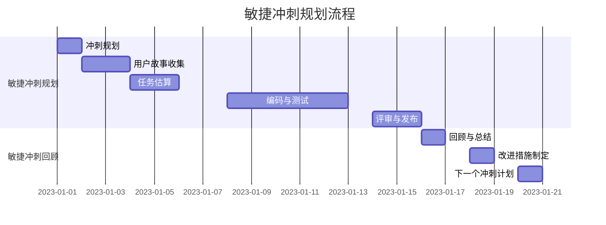

                 

### 引言

敏捷开发是一种以用户需求为中心，提倡快速迭代、持续交付的高效软件开发方法。在敏捷开发中，冲刺（Sprint）是核心周期，每个冲刺通常持续2-4周，团队在此期间集中精力完成一系列预定的任务。然而，随着项目的发展，需求往往会发生变化，这对敏捷冲刺规划提出了新的挑战。

#### 敏捷开发的基本概念

敏捷开发起源于2001年，由一群软件开发专家在《敏捷宣言》中提出。该宣言强调了个体和互动、可工作的软件、客户合作和响应变化的重要性。敏捷开发采用迭代和增量的方法，将项目分解为若干短周期（即冲刺）进行开发和交付。

#### 敏捷冲刺与规划

冲刺是敏捷开发中的一个核心周期，通常持续2-4周。在每次冲刺开始前，团队会召开规划会议，确定本次冲刺的目标和要完成的任务。冲刺结束时，团队会进行回顾会议，总结经验教训，并为下一个冲刺做准备。

#### 需求变化对敏捷冲刺的影响

需求变化是软件开发中不可避免的现象。敏捷方法提倡适应性，但需求变化对冲刺规划仍然构成了挑战。首先，变化可能导致原本的冲刺目标无法实现；其次，需求变更可能会影响资源分配和任务优先级；最后，频繁的需求变化可能导致团队工作不稳定，影响工作效率。

### 敏捷冲刺规划的核心原则

敏捷冲刺规划的核心原则包括透明性、可靠性、反馈和改进。这些原则确保了团队在面临需求变化时能够灵活应对，同时保持项目的高效运行。

#### 敏捷宣言与价值观

敏捷宣言强调了个体和互动的重要性，可工作的软件的优先级高于详尽的文档，客户合作和响应变化的重要性。这些价值观为敏捷冲刺规划提供了指导。

#### 敏捷冲刺流程

敏捷冲刺流程包括冲刺规划、冲刺执行、冲刺评审和冲刺回顾。每个阶段都有明确的任务和目标，确保团队高效完成工作。

#### 敏捷团队角色与职责

敏捷团队由产品负责人、开发人员和测试人员组成。产品负责人负责定义产品愿景和需求，开发人员负责编写代码，测试人员负责确保软件质量。

### 需求变化的管理

需求变化是软件开发中常见的现象，有效的需求变化管理能够帮助团队更好地适应变化，确保项目顺利进行。

#### 需求变化的类型

需求变化可以分为新增需求、修改需求和删除需求。新增需求是指在项目进行过程中，客户或产品负责人提出的新功能或改进建议。修改需求是指对已存在需求的修改或优化。删除需求是指撤销已提出的需求。

#### 需求变化的评估

在收到需求变更请求后，团队需要对变更的影响进行评估。这包括评估变更对项目时间、资源和质量的影响，以及变更的优先级。

#### 需求变更的控制

为了有效管理需求变更，团队需要建立一套变更控制流程。这包括变更请求的提交、评估、批准和实施。变更控制流程应确保变更的影响在可控范围内，避免对项目造成不必要的风险。

### 敏捷冲刺规划的调整策略

面对需求变化，敏捷团队需要采取灵活的调整策略，以确保项目能够顺利推进。这些策略包括时间调整、资源调整和任务调整。

#### 时间调整

时间调整是指根据需求变化重新安排冲刺时间。这可以通过调整冲刺长度或调整冲刺计划中的任务顺序来实现。时间调整的关键是确保团队成员能够适应新的时间安排，并保持项目进度。

#### 资源调整

资源调整是指根据需求变化重新分配团队成员的工作职责。这可以包括增加或减少团队成员，或调整团队成员的工作内容。资源调整的目的是确保团队拥有足够的资源完成变更后的任务。

#### 任务调整

任务调整是指根据需求变化重新安排任务优先级和任务分配。这可以通过重新排列冲刺计划中的任务顺序，或调整任务的难度和完成时间来实现。任务调整的目的是确保团队能够高效完成变更后的任务。

### 灵活调整冲刺规划的方法

为了更好地应对需求变化，敏捷团队可以采用以下方法进行冲刺规划的灵活调整。

#### 用户故事地图

用户故事地图是一种帮助团队理解和规划用户需求的方法。通过绘制用户故事地图，团队可以更好地识别和优先处理关键需求，提高项目交付效率。

#### 先锋冲刺

先锋冲刺是一种探索性方法，通过在一个简短的冲刺中快速实现部分功能，以验证需求的可行性和价值。这种方法有助于团队在项目早期识别潜在问题，并及时进行调整。

#### 敏捷看板

敏捷看板是一种可视化工具，用于跟踪和管理冲刺任务。通过敏捷看板，团队可以实时了解项目进展，识别和解决潜在问题，确保项目按计划推进。

### 案例研究：实际应用中的灵活调整

在本节中，我们将通过实际案例研究，探讨敏捷团队在需求变化情况下如何进行灵活调整。

#### 案例一：需求频繁变更的项目

在一个大型企业级软件项目中，由于客户需求频繁变更，团队面临着巨大的挑战。通过采用用户故事地图和敏捷看板，团队成功识别和优先处理关键需求，同时调整冲刺计划，确保项目按计划推进。

#### 案例二：资源调配不当的项目

在一个初创公司项目中，由于团队成员职责分工不明确，导致资源调配不当。通过资源调整和任务调整，团队重新明确了团队成员的职责，提高了项目效率。

#### 案例三：时间估算不准确的项目

在一个跨国家项目开发中，由于时间估算不准确，导致项目进度延误。通过调整冲刺时间和任务顺序，团队成功解决了时间管理问题，确保项目按时交付。

### 结论与展望

敏捷冲刺规划的灵活调整是应对需求变化的关键。通过采用合适的调整策略和方法，敏捷团队可以更好地应对变化，确保项目顺利进行。未来，随着敏捷开发方法的应用日益广泛，敏捷冲刺规划的灵活调整将成为软件开发中不可或缺的一部分。

### 对敏捷开发团队的启示

对于敏捷开发团队，灵活调整冲刺规划具有重要的启示。首先，团队需要保持开放和适应性，及时识别和应对需求变化。其次，团队应注重沟通和协作，确保团队成员之间信息畅通。最后，团队应不断学习和改进，提高应对需求变化的能力。

### 附录

#### A.1 敏捷冲刺规划工具与技术

敏捷冲刺规划涉及多种工具和技术，如用户故事地图、敏捷看板、Scrum等。这些工具和技术有助于团队更好地管理需求和任务，提高项目效率。

#### A.2 敏捷开发最佳实践

敏捷开发最佳实践包括明确产品愿景和需求、持续集成和部署、定期回顾和改进等。遵循这些最佳实践，团队可以更好地实施敏捷方法，提高项目成功概率。

#### A.3 常见问题与解决方案

在敏捷开发过程中，团队可能会遇到多种问题，如需求变更、资源调配不当、沟通不畅等。针对这些问题，团队可以采用相应的解决方案，如需求变更管理、资源优化和沟通工具等，确保项目顺利进行。

### Mermaid 流程图



### 伪代码示例

```python
function calculate_project_completion_time(tasks, deadlines):
    # 初始化完成时间和延迟变量
    completion_time = 0
    delay = 0

    # 遍历任务列表
    for task in tasks:
        # 更新完成时间和延迟
        completion_time += task.duration
        delay = max(delay, completion_time - deadlines[task.id])

    return completion_time, delay
```

### 数学模型

$$
\text{成本} = \sum_{i=1}^{n} \text{任务}_i \times \text{任务难度}_i
$$

其中，$\text{任务}_i$ 表示第 $i$ 个任务的完成情况，$\text{任务难度}_i$ 表示第 $i$ 个任务的难度。

### 数学公式详细讲解

#### 成本计算模型

成本计算模型用于评估整个项目的成本。在敏捷开发中，每个任务都需要根据其难度和完成情况进行成本估算。公式中的 $n$ 表示任务的总数，$\text{任务}_i$ 代表第 $i$ 个任务的完成情况，如果任务已完成则 $\text{任务}_i = 1$，否则 $\text{任务}_i = 0$。$\text{任务难度}_i$ 表示第 $i$ 个任务的难度，通常是一个介于0和1之间的值，难度越大，其对应的成本越高。

### 举例说明

假设一个项目中有三个任务，任务1的难度为0.5，任务2的难度为0.8，任务3的难度为0.6。在第一个冲刺中，任务1已完成，任务2和任务3未完成。根据成本计算模型，项目的成本计算如下：

$$
\text{成本} = 1 \times 0.5 + 0 \times 0.8 + 0 \times 0.6 = 0.5
$$

这个例子说明，在第一个冲刺中，项目成本为0.5，表示项目已经完成了一半的任务，因此成本为总任务难度的一半。

---

### 总结

敏捷冲刺规划的灵活调整是敏捷开发中至关重要的一环。通过本文，我们介绍了敏捷开发的基本概念、冲刺规划的核心原则、需求变化的管理方法以及灵活调整冲刺规划的具体策略。我们还通过实际案例研究了敏捷团队在不同情境下的灵活调整实践。

在敏捷开发过程中，面对需求变化，团队需要保持开放和适应性，不断调整冲刺规划，以确保项目能够顺利推进。同时，敏捷开发团队应注重沟通和协作，提高应对变化的能力，遵循最佳实践，持续改进开发过程。

### 拓展阅读

- 《Scrum敏捷实践指南》
- 《用户故事映射实践指南》
- 《敏捷项目管理：实践指南》

通过深入学习和实践，敏捷开发团队可以更好地应对需求变化，提高项目成功率。让我们共同探索敏捷开发的广阔天地，为软件开发带来更多的创新与突破。作者：AI天才研究院/AI Genius Institute & 禅与计算机程序设计艺术 /Zen And The Art of Computer Programming。

