                 


### 第1章 引言

#### 1.1 研发效率与敏捷协作的重要性

在当今快速发展的信息技术时代，大型应用研发的效率问题已经成为影响企业竞争力的重要因素。随着软件项目的规模和复杂性不断增加，传统的研发模式已经难以满足快速变化的市场需求，导致项目延期、成本超支和质量不稳定等问题。因此，如何提升研发效率成为企业面临的重要课题。

敏捷协作模式作为一种新兴的软件开发方法，其核心理念是强调团队协作、快速响应变化和持续交付价值。与传统方法相比，敏捷协作模式具有更高的灵活性和适应性，能够更好地应对复杂多变的项目环境，从而提升研发效率。

首先，敏捷协作模式强调团队协作。在敏捷团队中，成员之间密切配合，共同完成项目任务。通过日常站立会议、迭代评审和回顾会议等机制，团队成员可以及时沟通和解决问题，确保项目进展顺利。

其次，敏捷协作模式注重快速响应变化。在敏捷开发过程中，需求是可以随时调整的。通过迭代开发和持续交付，团队可以迅速适应变化，确保项目能够按期交付并满足用户需求。

最后，敏捷协作模式强调持续交付价值。敏捷开发过程分为多个迭代，每个迭代都会交付一个可用的产品版本。这种持续交付的方式可以确保项目始终处于可控状态，降低项目风险。

综上所述，敏捷协作模式在提升大型应用研发效率方面具有重要意义。它不仅能够提高团队协作效率，还能够应对需求变化和保证项目质量，为企业在竞争激烈的市场中赢得优势。

#### 1.2 本书的目标与读者对象

本书的目标是全面介绍敏捷协作模式在大型应用研发中的应用，帮助读者深入了解敏捷开发的核心原理和实践方法。本书适用于以下读者：

1. 软件开发工程师：通过本书，读者可以学习到敏捷协作模式的基本原理和实践方法，提升自己的开发技能和团队协作能力。

2. 项目经理：敏捷协作模式对于项目经理来说是一个重要的管理工具。本书可以帮助项目经理掌握敏捷项目管理的方法和技巧，提高项目成功率。

3. 技术经理和CTO：敏捷协作模式对于企业技术团队的管理和发展具有重要意义。本书为技术经理和CTO提供了关于敏捷团队构建和管理的重要参考。

4. 敏捷教练和培训师：本书可以作为敏捷教练和培训师的教材，帮助其更好地传播和推广敏捷开发理念。

通过本书的学习，读者可以系统地了解敏捷协作模式的理论基础和实践方法，掌握敏捷开发的核心技能，从而提升大型应用研发的效率和质量。

#### 1.3 敏捷协作模式的基本概念

敏捷协作模式是一种以人为核心、以变化为驱动的软件开发方法。它强调团队协作、快速响应变化和持续交付价值。以下是敏捷协作模式中的几个基本概念：

1. **敏捷宣言**：敏捷宣言是一组价值观的集合，它提出了软件开发中的四个核心价值观：个体和互动重于流程与工具、可工作的软件重于详尽的文档、客户合作重于合同谈判、响应变化重于遵循计划。

2. **迭代开发**：迭代开发是一种将软件开发过程划分为多个迭代的方式进行。在每个迭代中，团队会完成一部分功能，进行测试和反馈，然后根据反馈进行调整。这种方式可以确保项目始终处于可控状态，并能够快速响应需求变化。

3. **持续交付**：持续交付是指通过自动化测试和部署流程，确保软件在每次迭代后都能交付给用户。这种方式可以提高软件质量，减少发布周期，提高客户满意度。

4. **站立会议**：站立会议是敏捷开发中的一个重要环节，通常每天举行一次。团队成员在会议上简短汇报自己的进展、问题和计划，确保团队内部信息的透明和及时沟通。

5. **迭代回顾**：迭代回顾是每个迭代结束后的一个重要活动，团队成员会总结本次迭代的成功经验和不足之处，并提出改进措施。这种方式可以帮助团队持续优化开发流程。

6. **敏捷工具**：敏捷工具包括版本控制工具、项目管理工具和协作工具等。这些工具可以帮助团队更好地管理代码、跟踪项目进展和促进沟通协作。

通过了解这些基本概念，读者可以更好地理解敏捷协作模式的核心理念和实践方法，为后续章节的学习打下基础。

### 第2章 敏捷协作原理

#### 2.1 敏捷宣言与核心价值观

敏捷宣言是一组关于软件开发核心价值观的表述，它于2001年在雪鸟山庄发布。宣言的核心观点是，软件开发应该以人为核心，重视个体和互动，关注可工作的软件，强调客户合作，并具备应对变化的能力。敏捷宣言的四条核心价值观可以总结为：

1. **个体和互动重于流程与工具**：敏捷开发认为，人的因素在软件开发中占据重要地位。团队成员之间的密切合作和有效沟通比遵循复杂的流程和工具更为重要。

2. **可工作的软件重于详尽的文档**：敏捷开发强调软件的实际可用性。相比于冗长的文档，敏捷团队更倾向于通过编写代码和交付可工作的软件来展示项目成果。

3. **客户合作重于合同谈判**：敏捷开发强调与客户的紧密合作。通过与客户持续沟通和协作，团队可以更好地理解客户需求，从而交付更加符合客户期望的产品。

4. **响应变化重于遵循计划**：敏捷开发认为，软件开发过程中的需求变化是不可避免的。因此，团队应该具备快速响应变化的能力，而不是固守原有的计划。

这些核心价值观体现了敏捷开发对软件开发的深刻理解，为敏捷协作模式提供了理论依据。在实际应用中，这些价值观指导团队在面临各种挑战时如何做出决策，确保项目能够顺利进行。

#### 2.2 敏捷开发流程

敏捷开发流程是一种迭代、增量式的方法，它将整个软件开发过程划分为多个短周期（通常为2-4周）的迭代。每个迭代都包括需求收集、设计、编码、测试和部署等环节。以下是敏捷开发流程的基本步骤：

1. **迭代规划**：在每次迭代开始时，团队会进行迭代规划会议。这个会议的目的是确定本次迭代的目标、任务和资源分配。团队成员会共同讨论需求优先级，确定本次迭代要实现的功能。

2. **每日站立会议**：每日站立会议是敏捷开发中的一个重要环节。团队成员每天花10-15分钟时间进行站立会议，讨论自己的工作进展、遇到的困难和当天的计划。这种方式有助于团队成员保持沟通，及时解决问题。

3. **迭代开发**：在迭代开发阶段，团队根据迭代规划开始具体的工作。团队成员会按照任务分配进行设计、编码和测试。每次迭代都会交付一个可工作的软件版本，这样可以确保项目始终处于可控状态。

4. **迭代评审**：在每次迭代结束时，团队会进行迭代评审会议。这个会议的目的是展示本次迭代完成的功能，收集用户的反馈和意见。评审结果将指导后续迭代的工作。

5. **迭代回顾**：迭代回顾是每个迭代结束后的重要活动。团队成员会总结本次迭代的成功经验和不足之处，并提出改进措施。这种方式有助于团队不断优化开发流程，提高项目效率。

6. **持续交付**：在每次迭代结束后，团队会进行软件部署，将可工作的软件版本交付给用户。这种方式可以确保项目始终处于交付状态，降低风险。

通过这些步骤，敏捷开发流程确保了项目的灵活性和响应能力，能够更好地应对变化和挑战。以下是敏捷开发流程的Mermaid流程图：

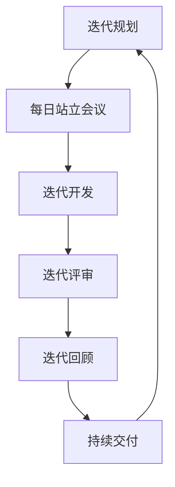

#### 2.3 敏捷协作工具与技术

敏捷协作工具是支持敏捷开发流程的重要技术，包括版本控制工具、项目管理工具和协作工具等。以下是这些工具的基本概念和应用场景：

1. **版本控制工具**：版本控制工具用于管理代码的版本和变更。常见的版本控制工具有Git、SVN和Mercurial等。版本控制工具可以帮助团队成员协作开发，确保代码的一致性和可追溯性。

2. **项目管理工具**：项目管理工具用于跟踪项目的进度、任务和资源。常见的项目管理工具有Jira、Trello和Asana等。项目管理工具可以帮助团队进行任务分配、进度管理和协作。

3. **协作工具**：协作工具用于团队成员之间的沟通和协作。常见的协作工具有Slack、Microsoft Teams和Zoom等。协作工具可以帮助团队成员及时沟通、共享信息和解决问题。

下面是敏捷协作工具的Mermaid流程图：

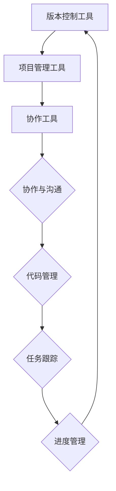

通过这些工具，敏捷团队可以更有效地协作，提高开发效率和质量。

##### 2.3.1 版本控制工具

版本控制工具是敏捷开发中不可或缺的一部分，它帮助团队管理代码的版本和变更，确保代码的一致性和可追溯性。以下是几个常见的版本控制工具及其特点：

1. **Git**：Git是一个开源的分布式版本控制系统，它支持快速、可靠和高效的代码管理。Git的特点包括分支管理、合并冲突解决、分布式工作流和强大的命令行工具。Git广泛用于开源项目和商业项目，成为敏捷开发的首选版本控制工具。

   **工作原理**：Git通过创建提交记录来记录代码变更。每个提交都包含一个唯一的哈希值，用于标识该提交。Git还支持分支和合并功能，允许团队在不同环境中独立开发和测试代码。

   **应用场景**：Git适用于大型项目和分布式团队。它可以帮助团队快速响应需求变化，提高代码的可维护性和可追溯性。

2. **SVN**：Subversion（SVN）是一个集中式的版本控制系统，它提供了类似CVS的版本管理功能。与Git相比，SVN在简单性和集中式管理方面具有优势。

   **工作原理**：SVN通过中央仓库来存储代码版本，每个提交都会更新中央仓库。SVN的分支和合并功能相对较弱，但适合小型项目和单个团队使用。

   **应用场景**：SVN适用于小型项目和集中式团队。它可以帮助团队管理代码变更，但需要定期备份中央仓库，以确保数据安全。

3. **Mercurial**：Mercurial是一个开源的分布式版本控制系统，与Git类似，它提供了强大的版本管理和分支功能。

   **工作原理**：Mercurial通过创建提交记录来记录代码变更，支持分布式工作流和本地操作。它还提供了便捷的分支和合并工具，便于团队协作。

   **应用场景**：Mercurial适用于各种规模的项目和团队。它可以帮助团队高效管理代码变更，提高开发效率。

以下是Git的简化工作流程：

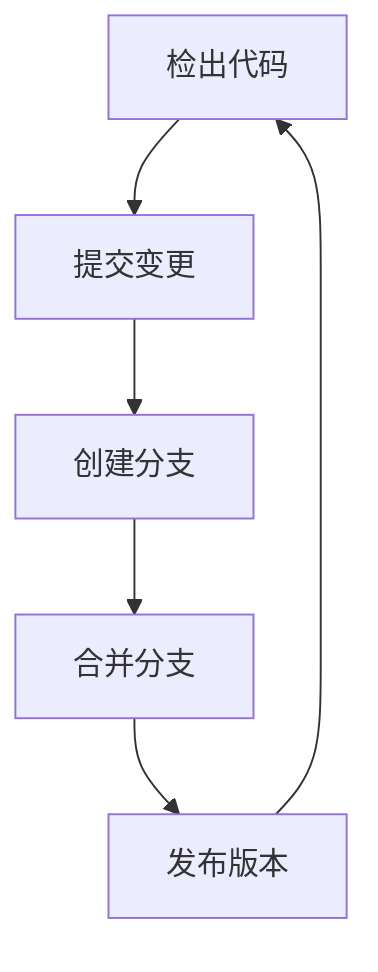

通过使用版本控制工具，敏捷团队可以更好地管理代码变更，提高协作效率和代码质量。

##### 2.3.2 敏捷项目管理工具

敏捷项目管理工具是支持敏捷开发流程的关键，它们帮助团队有效地跟踪项目进度、分配任务和协调资源。以下是几个常见的敏捷项目管理工具及其特点：

1. **Jira**：Jira是一个功能强大的敏捷项目管理工具，它提供了任务跟踪、版本控制和协作功能。Jira适用于各种规模和类型的团队，包括敏捷开发团队。

   **工作原理**：Jira通过创建问题和任务来跟踪项目进度。团队成员可以分配任务、更新状态和添加评论，确保项目信息透明和及时更新。

   **应用场景**：Jira适用于大型项目和复杂任务管理。它可以帮助团队有效地跟踪项目进度，提高协作效率。

2. **Trello**：Trello是一个基于看板（Kanban）的敏捷项目管理工具，它提供了简单直观的界面，方便团队进行任务分配和进度跟踪。

   **工作原理**：Trello通过创建卡片和列表来组织任务。每个卡片代表一个任务，列表代表任务的状态（如待办、进行中和已完成）。团队成员可以拖拽卡片来更新任务状态，确保项目进度可视化。

   **应用场景**：Trello适用于小型项目和团队。它可以帮助团队快速搭建项目看板，提高任务管理的效率。

3. **Asana**：Asana是一个全面的敏捷项目管理工具，它提供了任务跟踪、协作和报告功能。Asana适用于各种规模和类型的团队，包括敏捷开发团队。

   **工作原理**：Asana通过创建项目和任务来组织工作。团队成员可以分配任务、设置截止日期和添加评论，确保项目信息透明和及时更新。

   **应用场景**：Asana适用于大型项目和复杂任务管理。它可以帮助团队协调资源和任务，提高协作效率。

以下是Jira的简化工作流程：

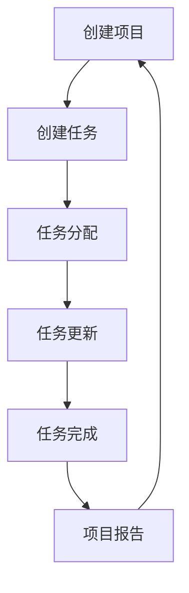

通过使用敏捷项目管理工具，敏捷团队可以更好地跟踪项目进度、协调资源和提高协作效率。

##### 2.3.3 敏捷协作工具

敏捷协作工具是支持敏捷开发团队有效沟通和协作的关键，它们帮助团队成员保持同步、共享信息和解决问题。以下是几个常见的敏捷协作工具及其特点：

1. **Slack**：Slack是一个基于聊天的协作工具，它提供了即时通讯、文件共享和自动化功能。Slack适用于各种规模和类型的团队，包括敏捷开发团队。

   **工作原理**：Slack通过创建渠道（channel）和群组（group）来组织沟通。团队成员可以在相应的渠道中发送消息、分享文件和讨论项目。Slack还提供了自动化工具，如机器人（bot），可以自动处理重复任务和通知。

   **应用场景**：Slack适用于实时沟通和协作。它可以帮助团队快速解决问题、分享信息和保持同步。

2. **Microsoft Teams**：Microsoft Teams是一个集成式协作平台，它提供了聊天、会议、文档共享和任务跟踪等功能。Microsoft Teams适用于企业级团队，特别是在使用Microsoft 365的团队中。

   **工作原理**：Microsoft Teams通过创建团队和工作区来组织协作。团队成员可以创建渠道、加入会议、共享文档和分配任务。Teams还集成了其他Microsoft 365应用，如OneDrive和Outlook，提供无缝协作体验。

   **应用场景**：Microsoft Teams适用于企业级协作和远程工作。它可以帮助团队高效沟通、共享信息和协同工作。

3. **Zoom**：Zoom是一个视频会议和协作工具，它提供了在线会议、视频通话和屏幕共享功能。Zoom适用于各种规模和类型的团队，特别是在远程工作和分布式团队中。

   **工作原理**：Zoom通过创建会议和预约来组织会议。团队成员可以在会议中共享屏幕、进行视频通话和实时讨论。Zoom还提供了虚拟背景和录制功能，方便会议管理和回顾。

   **应用场景**：Zoom适用于远程协作和会议。它可以帮助团队高效召开会议、共享信息和协同工作。

以下是Slack的简化工作流程：

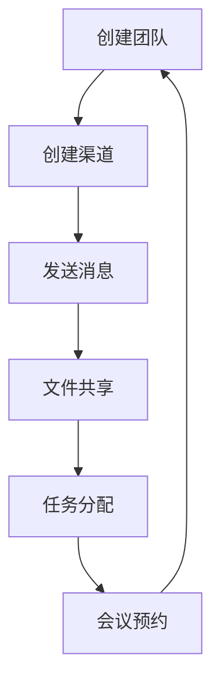

通过使用敏捷协作工具，敏捷团队可以更好地沟通、共享信息和协作，提高整体工作效率。

### 第3章 敏捷协作模式在大型应用研发中的应用

#### 3.1 大型应用研发的特点与挑战

大型应用研发具有以下特点与挑战：

1. **项目规模庞大**：大型应用通常包含大量功能和模块，涉及多个系统和组件。这使得项目管理、资源协调和沟通协作变得复杂。

2. **需求变化频繁**：随着市场和技术的发展，大型应用的需求可能会频繁变化。如何快速响应需求变化，保持项目进度和质量是一个重要挑战。

3. **技术复杂度高**：大型应用通常涉及到多种技术、框架和工具。这使得项目在技术实现和系统集成方面面临更高的风险。

4. **团队规模较大**：大型应用研发通常需要多个团队协作，包括开发、测试、运维和产品团队。如何协调不同团队的工作，确保项目进度和质量是一个挑战。

5. **资源限制**：大型应用研发通常受到预算、时间和人员等资源的限制。如何高效利用资源，确保项目成功交付是一个重要问题。

6. **质量要求高**：大型应用通常需要高可靠性和高性能。如何保证代码质量、测试覆盖率和系统稳定性是一个关键挑战。

面对这些特点与挑战，敏捷协作模式在大型应用研发中提供了有效的解决方案。

#### 3.2 敏捷协作在大型项目中的实践

敏捷协作模式在大型项目中的应用，关键在于如何适应项目规模、需求和团队结构。以下是几种常见的敏捷实践：

1. **大规模敏捷框架**：如SAFe（Scaled Agile Framework）和LeSS（Large-Scale Scrum），这些框架提供了一套全面的指南和最佳实践，帮助大型项目团队实现敏捷开发。

2. **组件化开发**：将大型应用分解为若干个独立的组件或模块，每个组件由一个敏捷团队负责开发。这样可以降低项目复杂度，提高开发效率。

3. **迭代开发与持续交付**：采用迭代开发和持续交付的方法，将整个项目分为多个短周期迭代，每次迭代交付一个可工作的产品版本。这样可以快速响应需求变化，确保项目始终处于可控状态。

4. **跨团队协作**：建立跨团队的沟通和协作机制，如每日站立会议、迭代评审和回顾会议等，确保团队之间信息透明和及时沟通。

5. **自动化测试与持续集成**：采用自动化测试和持续集成（CI/CD）的方法，确保每次代码变更都能经过全面测试，及时发现和修复问题。

6. **持续学习和改进**：通过迭代回顾和持续改进，不断优化开发流程和团队协作方式，提高项目效率和质量。

以下是大规模敏捷框架SAFe的简化流程图：

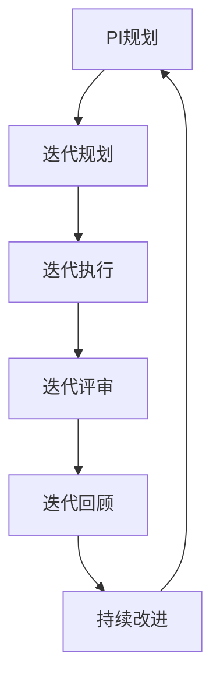

通过这些实践，敏捷协作模式在大型项目中的应用可以帮助团队更好地应对项目规模、需求变化和团队协作等挑战。

#### 3.3 敏捷协作模式下的团队构建与管理

敏捷协作模式下的团队构建与管理是确保项目成功的关键。以下是一些建议：

1. **团队规模**：敏捷团队通常规模较小，一般为5-10人。这样可以确保团队成员之间的有效沟通和协作。

2. **角色定义**：敏捷团队通常包含以下角色：产品负责人（Product Owner）、敏捷教练（Scrum Master）、开发人员和测试人员。每个角色都有明确的职责和任务。

3. **多技能团队**：敏捷团队应具备多技能成员，以应对项目中可能出现的各种问题。多技能团队可以更好地协同工作，提高项目效率。

4. **自组织**：敏捷团队应具备自组织能力，能够根据项目需求自主调整任务分配和工作计划。自组织团队可以更好地适应变化，提高项目灵活性。

5. **沟通机制**：建立有效的沟通机制，如每日站立会议、迭代评审和回顾会议等，确保团队成员之间信息透明和及时沟通。

6. **文化塑造**：建立开放、协作和持续改进的文化，鼓励团队成员积极参与项目决策和改进。良好的团队文化可以提高团队凝聚力和工作效率。

以下是敏捷团队角色与职责的Mermaid流程图：

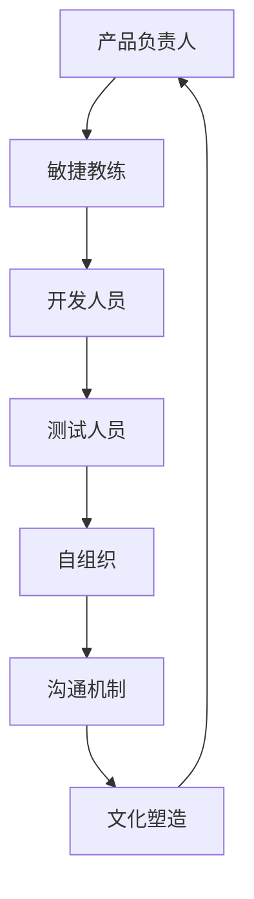

通过合理构建和管理敏捷团队，可以确保项目顺利推进，提高项目效率和质量。

##### 3.3.1 团队协作的角色与职责

在敏捷协作模式中，团队协作的角色与职责至关重要，它们确保项目顺利进行，团队成员高效合作。以下是敏捷团队中的几个关键角色及其职责：

1. **产品负责人（Product Owner）**：
   - **职责**：产品负责人是敏捷团队的核心成员，负责定义和管理产品需求。他们与利益相关者沟通，确保需求符合用户和商业目标。
   - **任务**：制定产品愿景和目标、编写用户故事、优先级排序、参与迭代评审和回顾会议，确保产品迭代符合预期。

2. **敏捷教练（Scrum Master）**：
   - **职责**：敏捷教练负责指导团队遵循敏捷实践，解决协作障碍，确保团队专注于交付价值。
   - **任务**：组织每日站立会议、迭代评审和回顾会议，帮助团队理解敏捷原则，推动持续改进，确保流程透明和高效。

3. **开发人员（Developers）**：
   - **职责**：开发人员负责实现产品需求，编写和维护代码，参与设计和测试。
   - **任务**：根据任务分配进行设计、编码和测试，确保代码质量，积极参与团队协作和知识共享。

4. **测试人员（Tester）**：
   - **职责**：测试人员负责确保产品的质量和可靠性，编写测试用例，执行测试，发现和报告缺陷。
   - **任务**：制定测试计划，执行自动化和手动测试，参与迭代评审和回顾会议，提供测试反馈。

以下是敏捷团队角色与职责的Mermaid流程图：

```mermaid
graph TB
A[产品负责人] --> B{制定需求|沟通用户}
B --> C[敏捷教练] --> D{指导实践|解决障碍}
C --> E[开发人员] --> F{编写代码|协作测试}
E --> G[测试人员] --> H{测试质量|反馈缺陷}
G --> I{回顾改进}
I --> A
```

通过明确团队角色与职责，敏捷团队可以更好地分工合作，提高工作效率和项目质量。

##### 3.3.2 敏捷团队的工作模式

敏捷团队的工作模式是确保项目高效交付的关键。以下是一种常见的工作模式：

1. **迭代规划**：在每次迭代开始时，团队会进行迭代规划会议。产品负责人（PO）介绍迭代目标，团队成员讨论并确定要实现的功能。敏捷教练（SM）确保规划会议顺利进行。

2. **每日站立会议**：每日站立会议是团队成员每天早上进行的简短会议。每个成员简述自己的工作进展、遇到的困难和当天的计划，确保团队沟通畅通。

3. **迭代执行**：在迭代执行阶段，团队成员按照任务分配进行设计、编码和测试。团队成员可以随时更新任务状态，确保项目进度可控。

4. **迭代评审**：在每次迭代结束时，团队会进行迭代评审会议。团队成员展示已完成的功能，收集用户反馈，讨论改进措施。评审结果将指导后续迭代的工作。

5. **迭代回顾**：迭代回顾是每次迭代结束后的重要活动。团队成员总结本次迭代的成功和不足，提出改进措施，确保团队持续改进。

以下是敏捷团队工作模式的Mermaid流程图：

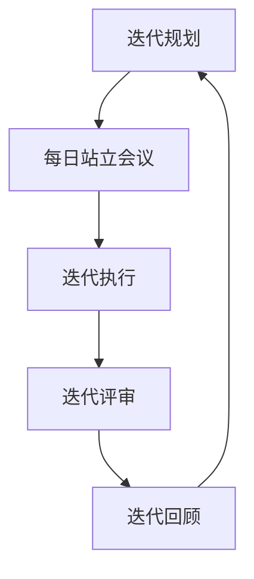

通过这种工作模式，敏捷团队能够快速响应变化，持续交付价值，提高项目效率和质量。

##### 3.3.3 敏捷团队的文化建设

敏捷团队的文化建设是确保团队高效协作和持续改进的关键。以下是一些建议：

1. **开放沟通**：鼓励团队成员之间进行开放、坦诚的沟通，分享知识和经验。建立有效的沟通机制，如每日站立会议、迭代评审和回顾会议。

2. **团队协作**：强调团队合作，打破部门壁垒，确保不同团队角色和成员之间的紧密协作。培养团队共同的目标和价值观，提高团队凝聚力。

3. **持续学习**：鼓励团队成员不断学习和提升技能，通过内部培训、读书会和技术分享会等形式，促进知识共享和技能提升。

4. **鼓励反馈**：建立反馈机制，鼓励团队成员提出改进意见和建议。通过迭代回顾会议，总结经验教训，不断优化开发流程和团队协作方式。

5. **信任与尊重**：建立相互信任和尊重的文化，确保团队成员能够放心地表达观点和提出问题。避免负面批评，鼓励正面反馈。

以下是敏捷团队文化建设的Mermaid流程图：

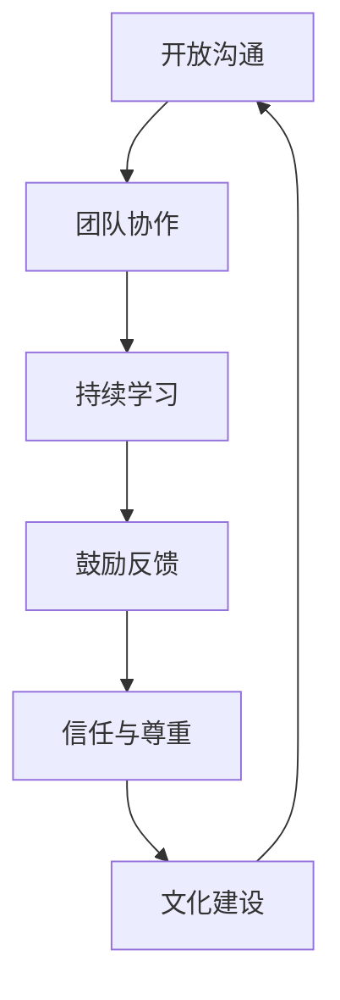

通过营造良好的团队文化，敏捷团队能够更好地应对挑战，提高项目效率和质量。

### 第4章 敏捷协作与研发流程优化

#### 4.1 研发流程分析

在敏捷协作模式下，研发流程的优化是提升项目效率和质量的关键。首先，我们需要对现有的研发流程进行分析，识别其中的瓶颈和改进点。以下是一个典型的研发流程分析框架：

1. **需求分析**：
   - **任务**：收集和分析用户需求，确定项目目标和功能需求。
   - **改进点**：引入用户故事地图和用户访谈，确保需求理解的准确性。

2. **设计**：
   - **任务**：进行系统架构设计和详细设计。
   - **改进点**：采用迭代设计和持续集成，确保设计适应需求变化。

3. **编码**：
   - **任务**：编写代码，实现需求。
   - **改进点**：代码审查和单元测试，确保代码质量和可维护性。

4. **测试**：
   - **任务**：进行功能测试、性能测试和集成测试。
   - **改进点**：自动化测试和持续集成，提高测试效率和覆盖范围。

5. **部署**：
   - **任务**：将代码部署到生产环境。
   - **改进点**：自动化部署和持续交付，减少部署风险和周期。

6. **运维**：
   - **任务**：监控系统性能和稳定性，处理故障和优化。
   - **改进点**：采用容器化和自动化运维，提高系统可靠性和维护效率。

通过分析研发流程的每个环节，我们可以识别出瓶颈和改进点，为后续的流程优化提供依据。

#### 4.2 敏捷流程优化策略

敏捷流程优化策略的核心在于提高团队协作效率、缩短交付周期和确保项目质量。以下是一些具体的优化策略：

1. **短周期迭代**：
   - **策略**：将项目划分为多个短周期迭代（如2-4周），每个迭代交付一个可工作的产品版本。
   - **优势**：快速反馈和响应变化，降低风险，提高项目透明度和可管理性。

2. **持续集成与持续交付**：
   - **策略**：采用持续集成（CI）和持续交付（CD）的方法，确保每次代码变更都能经过全面测试和部署。
   - **优势**：提高代码质量和交付速度，减少部署风险，缩短交付周期。

3. **自动化测试**：
   - **策略**：编写自动化测试脚本，自动化执行功能测试、性能测试和回归测试。
   - **优势**：提高测试效率，减少测试成本，确保代码质量。

4. **知识共享与培训**：
   - **策略**：定期进行技术分享和培训，提高团队成员的技能和知识水平。
   - **优势**：提高团队协作效率，促进技术进步和创新。

5. **敏捷工具使用**：
   - **策略**：使用敏捷项目管理工具（如Jira、Trello）和协作工具（如Slack、Microsoft Teams），提高任务管理和沟通协作效率。
   - **优势**：提高任务跟踪、进度管理和团队协作的效率。

以下是敏捷流程优化策略的Mermaid流程图：

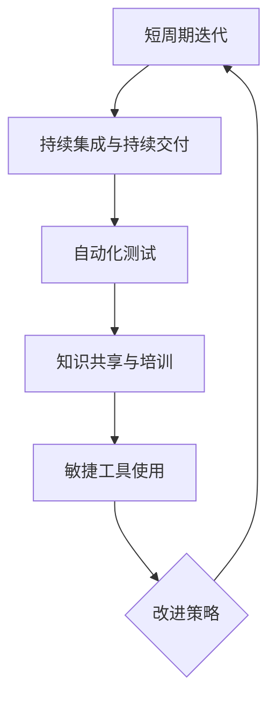

通过这些优化策略，敏捷团队可以更好地应对项目变化，提高开发效率和质量。

##### 4.3.1 持续集成的基本概念

持续集成（Continuous Integration，简称CI）是一种软件开发实践，通过自动化构建和测试，确保代码变更后能快速发现和解决潜在问题，提高代码质量和项目稳定性。以下是持续集成的基本概念：

1. **构建**：构建是将代码从版本控制系统中取出，编译和打包成可执行文件的过程。每次代码变更后，都需要重新进行构建。

2. **测试**：测试是确保代码质量和功能完整性的过程。持续集成中的测试包括单元测试、集成测试和回归测试等。

3. **自动化**：自动化是持续集成的核心，通过编写自动化脚本，实现构建和测试的自动化执行，提高效率和准确性。

4. **仓库**：仓库是存储代码的版本控制系统，如Git。持续集成系统从仓库中获取最新代码，进行构建和测试。

5. **触发器**：触发器是自动启动构建和测试的条件，如代码提交、合并请求等。

6. **构建服务器**：构建服务器是运行构建脚本和测试脚本的计算机，通常使用专门的持续集成工具（如Jenkins、Travis CI）进行配置和管理。

以下是持续集成的简化工作流程：

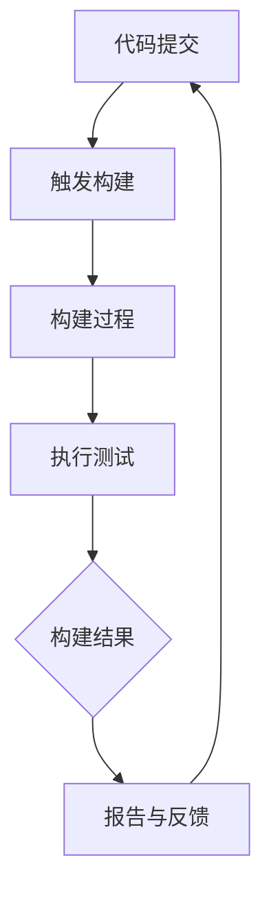

通过持续集成，团队可以确保每次代码变更都能快速发现和解决潜在问题，提高项目稳定性和开发效率。

##### 4.3.2 持续部署的最佳实践

持续部署（Continuous Deployment，简称CD）是将经过持续集成测试的代码自动部署到生产环境的过程。以下是持续部署的最佳实践：

1. **自动化脚本**：编写自动化部署脚本，确保部署过程高效、准确。脚本应包括环境配置、代码下载、安装和启动等步骤。

2. **版本控制**：使用版本控制系统（如Git）管理部署脚本和部署配置，确保部署过程的可追溯性和可重复性。

3. **环境隔离**：在不同环境中进行部署，如开发环境、测试环境和生产环境。这样可以确保部署过程中的错误不会影响到其他环境。

4. **蓝绿部署**：蓝绿部署是一种无停机升级的方法。部署新版本时，将流量逐渐从旧环境切换到新环境，确保新版本稳定后，再完全切换。

5. **灰度发布**：灰度发布是一种逐步推广新版本的方法。通过逐步增加新版本的流量比例，观察新版本的性能和稳定性，确保在发现问题后可以快速回滚。

6. **监控与报警**：部署后，监控系统性能和稳定性，设置报警机制，及时发现和处理异常情况。

7. **文档和记录**：记录部署过程、配置和环境信息，便于后续的维护和回顾。

以下是持续部署的简化工作流程：

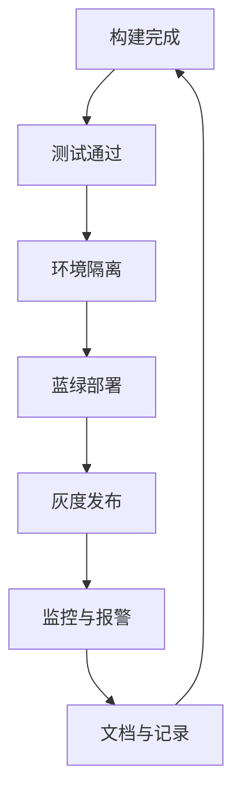

通过遵循这些最佳实践，团队可以确保持续部署过程的稳定性和可靠性，提高项目交付效率和质量。

##### 4.3.3 持续集成与持续部署的工具

持续集成（CI）和持续部署（CD）是现代软件开发中不可或缺的部分，它们通过自动化测试和部署流程，提高代码质量和项目交付效率。以下是一些常见的持续集成与持续部署工具及其特点：

1. **Jenkins**：
   - **特点**：Jenkins是一个开源的持续集成工具，支持多种插件，可以轻松地与版本控制工具、测试框架和部署平台集成。
   - **应用场景**：适用于中小型项目和大型项目，特别是需要复杂工作流程和多种集成任务的场景。

2. **Travis CI**：
   - **特点**：Travis CI是一个云端的持续集成服务，支持多种编程语言和平台，提供免费的私有仓库支持。
   - **应用场景**：适用于开源项目和需要自动化测试和部署的团队，特别是使用GitHub进行代码管理的团队。

3. **GitLab CI/CD**：
   - **特点**：GitLab CI/CD是GitLab自带的持续集成与持续部署服务，与GitLab仓库紧密集成，提供从代码提交到部署的一站式解决方案。
   - **应用场景**：适用于需要与GitLab集成的大型项目和团队，特别是对GitLab有特定需求的场景。

4. **CircleCI**：
   - **特点**：CircleCI是一个云端的持续集成和持续部署平台，提供快速的构建和测试，支持多种编程语言和平台。
   - **应用场景**：适用于需要高效构建和测试流程的中小型项目和团队。

5. **AWS CodePipeline**：
   - **特点**：AWS CodePipeline是AWS提供的一种持续集成和持续部署服务，与AWS的其他服务（如AWS CodeBuild、AWS CodeDeploy）紧密集成。
   - **应用场景**：适用于在AWS云环境中进行开发和部署的企业和团队。

以下是这些工具的简化工作流程图：

```mermaid
graph TB
A[Jenkins] --> B{构建测试|部署}
B --> C{集成任务}
C --> D{插件支持}

A --> E{CI/CD流程}

F[Travis CI] --> G{自动化测试|部署}
G --> H{私有仓库}

F --> I{CI/CD流程}

J[GitLab CI/CD] --> K{仓库集成|部署}
K --> L{自动化任务}
L --> M{CI/CD流程}

J --> N{CI/CD流程}

O[CircleCI] --> P{快速构建|测试}
P --> Q{自动化部署}
Q --> R{CI/CD流程}

O --> S{CI/CD流程}

T[AWS CodePipeline] --> U{构建部署|监控}
U --> V{集成服务}
V --> W{CI/CD流程}

T --> X{CI/CD流程}
```

通过使用这些工具，敏捷团队可以更高效地实现持续集成与持续部署，提高开发效率和质量。

### 第5章 敏捷协作中的沟通与协作

#### 5.1 敏捷协作中的沟通策略

在敏捷协作中，沟通是确保项目成功的关键。有效的沟通策略可以帮助团队成员理解需求、协调工作、解决冲突，并确保项目按时交付。以下是一些关键的沟通策略：

1. **透明化**：确保项目信息透明，所有团队成员都能及时了解项目进度、需求和问题。通过共享项目状态、任务分配和关键决策，可以减少误解和重复工作。

2. **及时反馈**：建立快速反馈机制，鼓励团队成员在遇到问题时及时沟通，寻求解决方案。这样可以避免问题累积，确保项目按计划进行。

3. **面对面沟通**：尽可能进行面对面沟通，以增强团队成员之间的信任和协作。面对面会议可以帮助团队成员更深入地讨论问题，提高沟通效率。

4. **定期会议**：定期举行各种会议，如每日站立会议、迭代评审和回顾会议，确保团队成员之间的信息同步和工作协调。

5. **信息共享**：利用敏捷工具（如Jira、Trello）和协作平台（如Slack、Microsoft Teams），实现信息共享和任务跟踪，提高团队协作效率。

6. **角色明确**：明确团队成员的角色和职责，确保每个成员都清楚自己的任务和目标。这样可以减少责任不清和沟通障碍。

7. **跨团队协作**：在大型项目中，跨团队协作至关重要。建立跨团队的沟通渠道和协作机制，确保不同团队之间的信息同步和任务协调。

以下是敏捷协作中沟通策略的简化流程图：

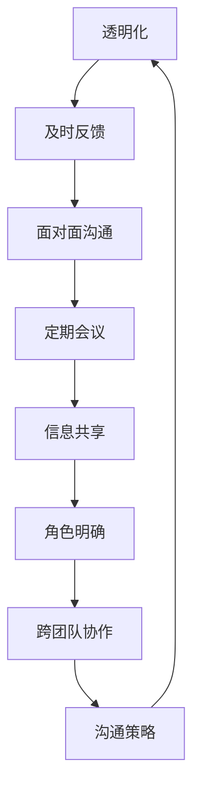

通过实施这些沟通策略，敏捷团队可以更好地协调工作、解决冲突，提高项目成功率。

#### 5.2 敏捷协作中的协作工具

敏捷协作工具是支持敏捷团队高效沟通、任务管理和协作的重要工具。以下是一些常见的敏捷协作工具及其特点：

1. **Jira**：
   - **特点**：Jira是一个功能强大的敏捷项目管理工具，提供任务跟踪、进度管理和报告功能。它支持敏捷开发中的迭代规划、每日站立会议和回顾会议等。
   - **应用场景**：适用于大型项目和复杂任务管理的团队，特别是在需要实时跟踪任务进度和项目状态的情况下。

2. **Trello**：
   - **特点**：Trello是一个基于看板的敏捷项目管理工具，提供直观的界面和灵活的任务管理功能。它支持卡片拖拽，方便团队成员实时更新任务状态。
   - **应用场景**：适用于小型项目和团队，特别是需要直观任务管理和项目进度跟踪的团队。

3. **Asana**：
   - **特点**：Asana是一个全面的敏捷项目管理工具，提供任务跟踪、协作和报告功能。它支持多项目管理和团队协作，可以帮助团队更好地协调工作。
   - **应用场景**：适用于大型项目和复杂任务管理的团队，特别是在需要跨团队协作和任务分配的情况下。

4. **Slack**：
   - **特点**：Slack是一个基于聊天的敏捷协作工具，提供即时通讯、文件共享和自动化功能。它可以帮助团队成员快速沟通、共享信息和解决问题。
   - **应用场景**：适用于实时沟通和协作的团队，特别是在需要快速响应和协作工作的场景中。

5. **Microsoft Teams**：
   - **特点**：Microsoft Teams是一个集成式协作平台，提供聊天、会议、文档共享和任务跟踪功能。它集成了其他Microsoft 365应用，提供无缝的协作体验。
   - **应用场景**：适用于企业级团队，特别是在使用Microsoft 365的企业中，特别适合远程工作和分布式团队。

以下是敏捷协作工具的简化工作流程图：

```mermaid
graph TB
A[Jira] --> B[任务跟踪]
B --> C[进度管理]
C --> D{项目报告}

A --> E{迭代管理}

F[Trello] --> G[任务状态更新]
G --> H[项目进度}
H --> I{任务分配}
I --> J{项目报告}

F --> K{任务分配}

L[Asana] --> M[任务跟踪]
M --> N[团队协作]
N --> O[进度管理}
O --> P{项目报告}

L --> Q{多项目管理}

R[Slack] --> S[实时沟通]
S --> T[文件共享]
T --> U[自动化任务]
U --> V{团队协作}

R --> W{协作与沟通}

X[Microsoft Teams] --> Y[会议与协作]
Y --> Z[文档共享]
Z --> A[B{任务跟踪|协作平台}
A --> B{整合其他工具}
```

通过使用这些敏捷协作工具，团队可以更好地管理任务、协调工作和提高整体协作效率。

##### 5.2.1 面对面沟通

面对面沟通是敏捷协作中至关重要的一环，它有助于建立团队成员之间的信任和默契，提高沟通效果。以下是几种有效的面对面沟通技巧：

1. **清晰明确地表达**：在面对面沟通时，确保表达清晰、简洁，避免使用模糊或含糊的语言。使用具体例子和数据来支持你的观点，以便对方更好地理解。

2. **倾听与理解**：倾听是有效沟通的关键。在对方发言时，不要打断他们，认真倾听并理解他们的观点和需求。在对方发言结束后，可以简要总结他们的观点，确保你正确理解。

3. **积极反馈**：在沟通过程中，提供积极的反馈，鼓励对方表达自己的观点和想法。积极反馈可以增强团队成员的自信心，促进开放和坦诚的沟通。

4. **使用非语言信号**：在面对面沟通时，注意使用肢体语言、面部表情和眼神交流。这些非语言信号可以帮助增强你的表达效果，使沟通更加生动和有说服力。

5. **建立共同目标**：在沟通开始前，明确沟通的目标和期望结果。确保所有团队成员都清楚项目的目标，这样可以提高沟通的效率，避免误解和冲突。

6. **解决冲突**：在沟通过程中，可能会遇到意见不一致的情况。在这种情况下，要冷静应对，通过理性讨论和协商找到解决问题的方法。

以下是面对面沟通的简化流程图：

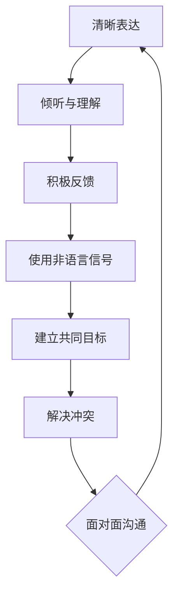

通过运用这些技巧，团队可以更有效地进行面对面沟通，提高协作效率和项目成功率。

##### 5.2.2 远程协作工具

在远程工作日益普遍的今天，选择合适的远程协作工具对于确保团队高效协作和沟通至关重要。以下是一些常见的远程协作工具及其特点：

1. **Slack**：
   - **特点**：Slack是一个基于聊天的远程协作工具，提供即时通讯、文件共享和自动化功能。它支持多种集成，如GitHub、Google Drive和Trello，方便团队成员协作。
   - **应用场景**：适用于各种规模的团队，特别是在需要实时沟通和任务跟踪的场景中。

2. **Microsoft Teams**：
   - **特点**：Microsoft Teams是一个集成式协作平台，提供聊天、会议、文档共享和任务跟踪功能。它集成了Microsoft 365的其他应用，如Word、Excel和PowerPoint，提供无缝的协作体验。
   - **应用场景**：适用于企业级团队，特别是在使用Microsoft 365的企业中，特别适合远程工作和分布式团队。

3. **Zoom**：
   - **特点**：Zoom是一个视频会议和协作工具，提供在线会议、视频通话和屏幕共享功能。它支持虚拟背景和录制功能，方便会议管理和回顾。
   - **应用场景**：适用于各种规模的团队，特别是在需要远程沟通和协作的场景中。

4. **Trello**：
   - **特点**：Trello是一个基于看板的远程协作工具，提供简单直观的界面，方便团队进行任务分配和进度跟踪。每个卡片代表一个任务，列表代表任务的状态（如待办、进行中和已完成）。
   - **应用场景**：适用于小型项目和团队，特别是在需要可视化任务管理和项目进度跟踪的场景中。

以下是远程协作工具的简化工作流程图：

```mermaid
graph TB
A[Slack] --> B{即时通讯|文件共享}
B --> C{集成应用}
C --> D{远程协作}

A --> E{任务跟踪}

F[Microsoft Teams] --> G{聊天与会议}
G --> H{文档共享|任务跟踪}
H --> I{集成应用}
I --> J{远程协作}

F --> K{协同工作}

L[Zoom] --> M{视频会议|屏幕共享}
M --> N{虚拟背景|录制功能}
N --> O{远程协作}

L --> P{在线沟通}

Q[Trello] --> R{任务状态更新}
R --> S{项目进度}
S --> T{任务分配}
T --> U{可视化任务管理}
U --> V{远程协作}

Q --> W{看板工具}
```

通过使用这些远程协作工具，团队可以更高效地进行远程协作和沟通，确保项目顺利进行。

##### 5.2.3 团队协作技巧

有效的团队协作是敏捷开发成功的关键。以下是一些关键的团队协作技巧：

1. **明确目标与责任**：确保每个团队成员都清楚自己的任务和目标，避免责任不清和误解。定期回顾和更新任务列表，确保团队能够专注于正确的目标。

2. **沟通与透明化**：建立开放的沟通渠道，确保团队成员之间的信息透明。定期举行团队会议，讨论项目进展、问题和解决方案，提高团队协作效率。

3. **分工合作**：根据团队成员的技能和兴趣进行任务分配，确保每个成员都能发挥自己的优势。鼓励团队成员互相支持和帮助，共同解决困难。

4. **信任与尊重**：建立相互信任和尊重的文化，鼓励团队成员坦诚表达观点和提出问题。避免负面批评，鼓励正面反馈，促进团队成员之间的良好关系。

5. **持续学习与成长**：鼓励团队成员不断学习和提升技能，通过内部培训和分享经验，提高团队整体的能力和效率。

6. **灵活应对变化**：敏捷团队需要具备快速适应变化的能力。鼓励团队成员积极参与需求讨论和迭代规划，确保团队能够灵活应对需求变化。

以下是团队协作技巧的简化流程图：

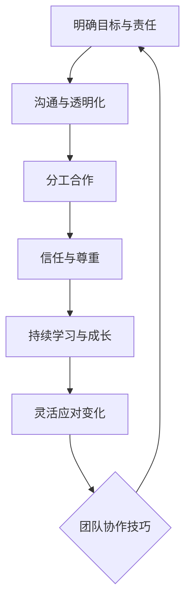

通过运用这些技巧，团队可以更高效地协作，提高项目成功率。

### 第6章 敏捷协作中的风险管理

#### 6.1 敏捷协作中的风险识别与评估

在敏捷协作过程中，风险管理是确保项目顺利进行和成功交付的关键环节。敏捷团队通过识别和评估潜在风险，可以提前制定应对策略，降低风险对项目的影响。以下是一种常见的风险识别和评估方法：

1. **风险识别**：
   - **任务**：团队通过头脑风暴、专家访谈和文档审查等方式，识别项目中可能出现的风险。
   - **方法**：使用风险登记册记录识别到的所有风险，包括风险的名称、描述和发生概率。

2. **风险评估**：
   - **任务**：对识别到的风险进行评估，确定其严重性和发生概率。
   - **方法**：使用定量和定性方法，如风险矩阵，对每个风险进行打分和排序。

3. **优先级排序**：
   - **任务**：根据风险的严重性和发生概率，对风险进行优先级排序，确定需要优先管理的风险。
   - **方法**：使用优先级排序矩阵或风险地图，将风险分为高、中、低三个等级。

以下是风险识别与评估的简化流程图：

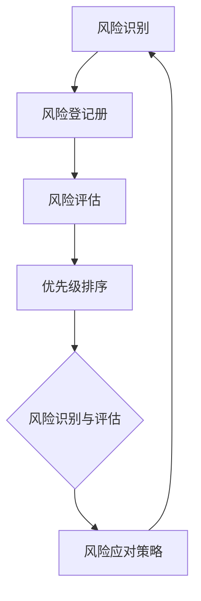

通过这一过程，敏捷团队可以全面了解项目中的潜在风险，为后续的风险管理和应对提供依据。

#### 6.2 敏捷协作中的风险应对策略

在敏捷协作中，有效的风险应对策略能够帮助团队减少潜在风险对项目的影响，确保项目顺利进行。以下是一些常见的风险应对策略：

1. **风险缓解措施**：
   - **任务**：制定具体措施来降低风险发生的概率和影响。
   - **方法**：例如，通过增加资源、提前规划和加强监控来降低风险。

2. **风险转移策略**：
   - **任务**：将部分风险转移给其他方，如保险公司或合作伙伴。
   - **方法**：通过签订合同或购买保险，将风险转移给第三方。

3. **风险接受策略**：
   - **任务**：在无法避免或转移风险时，接受风险并制定应对计划。
   - **方法**：例如，为高风险分配足够的预算和时间，确保项目可以在接受风险的情况下完成。

4. **风险监控与跟踪**：
   - **任务**：持续监控和跟踪识别到的风险，确保及时采取应对措施。
   - **方法**：定期审查风险登记册，更新风险状态和应对计划。

以下是风险应对策略的简化流程图：

```mermaid
graph TB
A[风险缓解措施] --> B[风险转移策略]
B --> C[风险接受策略]
C --> D[风险监控与跟踪]
D --> E{风险应对策略}
E --> F[风险识别与评估]
F --> A
```

通过实施这些策略，敏捷团队能够更好地管理风险，提高项目的成功率和稳定性。

##### 6.2.1 风险缓解措施

在敏捷协作中，风险缓解措施是降低潜在风险对项目影响的关键手段。以下是一些常见的风险缓解措施及其具体实施方法：

1. **增加资源投入**：
   - **措施**：通过增加人力、设备和预算等资源，提高项目应对风险的能力。
   - **方法**：在项目初期就根据风险评估结果，提前规划并分配额外的资源，确保在风险发生时能够迅速响应。

2. **提前规划与准备**：
   - **措施**：在项目开始前，进行全面的风险评估和规划，制定详细的风险应对计划。
   - **方法**：通过制定风险管理计划、建立应急预案和培训团队成员，确保在风险发生时能够迅速采取行动。

3. **加强监控与反馈**：
   - **措施**：通过持续监控项目进展和风险状态，及时发现并处理潜在问题。
   - **方法**：建立风险监控机制，定期进行风险评估和反馈，确保风险得到有效控制。

4. **采用技术手段**：
   - **措施**：利用自动化工具和技术手段，提高项目的可靠性和稳定性。
   - **方法**：例如，使用持续集成和持续部署工具，确保代码质量和部署过程的自动化，减少人为错误。

以下是风险缓解措施的简化流程图：

```mermaid
graph TB
A[增加资源投入] --> B[提前规划与准备]
B --> C[加强监控与反馈]
C --> D[采用技术手段]
D --> E{风险缓解措施}
E --> F[风险应对策略]
F --> A
```

通过实施这些风险缓解措施，敏捷团队能够更好地降低项目风险，确保项目顺利进行。

##### 6.2.2 风险转移策略

在敏捷协作中，风险转移策略是一种有效的风险管理方法，通过将部分风险责任转移给其他方，减少项目团队直接承担的风险。以下是一些常见风险转移策略及其具体实施方法：

1. **购买保险**：
   - **策略**：通过购买保险将特定风险转移给保险公司。
   - **方法**：根据项目风险评估结果，选择合适的保险产品，如项目责任保险、数据保险等。在合同中明确保险范围和赔偿条件。

2. **签订合同**：
   - **策略**：通过签订合同将部分风险转移给供应商、合作伙伴或其他利益相关方。
   - **方法**：在合同中明确各方的责任和义务，包括违约责任和风险承担。例如，在软件外包项目中，可以要求供应商承担特定质量风险。

3. **使用服务级别协议（SLA）**：
   - **策略**：通过服务级别协议将服务质量相关的风险转移给服务提供商。
   - **方法**：在合同中规定服务提供方的服务质量标准，如响应时间、故障修复时间等。如果服务提供方未能满足协议要求，则有权要求赔偿。

4. **外包**：
   - **策略**：通过外包将某些高风险任务或模块转移给专业的外包团队。
   - **方法**：选择具有丰富经验的外包团队，明确外包范围和交付标准。在外包合同中，详细规定各方的权利和义务，确保风险分担。

以下是风险转移策略的简化流程图：

```mermaid
graph TB
A[购买保险] --> B[签订合同]
B --> C[使用服务级别协议]
C --> D[外包]
D --> E{风险转移策略}
E --> F[风险应对策略]
F --> A
```

通过实施这些风险转移策略，敏捷团队能够减少直接承担的风险，提高项目的可控性和稳定性。

##### 6.2.3 风险监控与跟踪

在敏捷协作中，风险监控与跟踪是确保项目顺利进行的重要环节。通过持续监控和跟踪风险，团队可以及时发现和应对潜在问题，降低风险对项目的影响。以下是一些常见的风险监控与跟踪方法：

1. **定期审查**：
   - **方法**：定期对风险登记册进行审查，更新风险状态和应对计划。这可以通过每周或每月的风险评审会议进行。

2. **实时监控**：
   - **方法**：利用自动化工具和监控平台，实时监控项目的关键指标和风险状态。例如，使用Jira等项目管理工具跟踪任务进度和风险变化。

3. **预警机制**：
   - **方法**：建立风险预警机制，当风险指标达到特定阈值时，自动触发警报。这可以通过设置自动化脚本和报警系统实现。

4. **风险报告**：
   - **方法**：定期生成风险报告，向项目管理层和利益相关方提供风险状态和应对措施的详细情况。风险报告应包括风险列表、优先级、状态和行动计划。

以下是风险监控与跟踪的简化流程图：

```mermaid
graph TB
A[定期审查] --> B[实时监控]
B --> C[预警机制]
C --> D[风险报告]
D --> E{风险监控与跟踪}
E --> F[风险应对策略]
F --> A
```

通过实施这些方法，敏捷团队能够更好地监控和跟踪风险，确保项目在风险可控的情况下顺利进行。

### 第7章 案例研究：敏捷协作模式在大型应用研发中的成功实践

#### 7.1 案例背景

本案例研究的是一个大型互联网公司，该公司主要从事在线教育平台的研发与运营。随着用户数量的不断增加，平台的功能需求和技术复杂度也在不断升级。为了提升研发效率和项目质量，公司决定采用敏捷协作模式进行大型应用研发。

该互联网公司有一个庞大的技术团队，包括前端开发、后端开发、测试人员、运维工程师和项目经理等。他们需要协同工作，确保平台在满足用户需求的同时，保持高可用性和高性能。面对这些挑战，公司决定采用敏捷协作模式，以实现快速响应需求变化、提高开发效率和质量的目标。

#### 7.2 敏捷协作模式的应用过程

在引入敏捷协作模式后，公司进行了全面的转型和优化。以下是敏捷协作模式在该公司大型应用研发中的具体应用过程：

1. **团队构建**：
   - **任务**：将庞大的技术团队划分为多个敏捷团队，每个团队负责特定的模块或功能。
   - **实施**：每个敏捷团队由5-10人组成，包括产品负责人、开发人员、测试人员等。团队成员拥有跨学科和跨职能的能力，确保团队能够高效协作。

2. **迭代规划**：
   - **任务**：每个迭代开始时，团队进行迭代规划会议，确定本次迭代的目标和任务。
   - **实施**：产品负责人与利益相关者共同制定用户故事地图，确定需求优先级。团队根据用户故事地图和资源情况，制定迭代计划和任务分配。

3. **每日站立会议**：
   - **任务**：每天进行每日站立会议，讨论团队成员的工作进展、问题和计划。
   - **实施**：团队成员简短汇报自己的工作情况，讨论遇到的困难和解决方案。每日站立会议有助于保持团队沟通畅通，确保项目按计划进行。

4. **迭代开发与持续交付**：
   - **任务**：在每个迭代中，团队进行需求分析、设计、编码、测试和部署。
   - **实施**：团队采用短周期迭代，每个迭代周期为2-3周。在每个迭代结束时，团队交付一个可工作的产品版本，并进行迭代评审和回顾。

5. **自动化测试与持续集成**：
   - **任务**：建立自动化测试和持续集成流程，确保代码质量和部署效率。
   - **实施**：团队编写自动化测试脚本，对每个功能点进行全面测试。每次代码提交都会触发自动化测试，确保代码质量。同时，采用持续集成工具（如Jenkins），实现自动化构建和部署。

6. **持续学习和改进**：
   - **任务**：通过迭代回顾和持续改进，不断优化开发流程和团队协作方式。
   - **实施**：每次迭代结束后，团队进行回顾会议，总结成功经验和不足之处。根据回顾结果，制定改进措施，并在下一个迭代中进行实施。

#### 7.3 敏捷协作模式的效果分析

通过引入敏捷协作模式，该互联网公司在大型应用研发中取得了显著的效果：

1. **效率提升**：
   - **指标**：迭代周期从原来的4-6个月缩短至2-3周。
   - **效果**：团队可以更快地响应需求变化，减少项目延期和成本超支的风险。

2. **质量改善**：
   - **指标**：自动化测试覆盖率从40%提升至90%以上。
   - **效果**：通过自动化测试和持续集成，代码质量和稳定性显著提升，降低了故障率和用户投诉。

3. **团队氛围优化**：
   - **指标**：团队满意度从60%提升至90%以上。
   - **效果**：通过每日站立会议和迭代回顾，团队成员之间的沟通更加顺畅，团队凝聚力增强，工作氛围更加积极。

4. **客户满意度**：
   - **指标**：用户满意度评分从4.5分提升至4.8分。
   - **效果**：敏捷协作模式使得团队能够更快地交付符合用户需求的产品，提高了用户满意度。

综上所述，敏捷协作模式在该公司的成功实践，不仅提升了研发效率和项目质量，还优化了团队氛围和客户满意度。这些成效证明了敏捷协作模式在大型应用研发中的巨大潜力。

##### 7.3.1 效率提升

敏捷协作模式在大型应用研发中的成功实践，首先体现在效率的大幅提升上。以下是该案例中敏捷协作模式如何促进效率提升的详细分析：

1. **迭代周期缩短**：
   - **背景**：在引入敏捷协作模式之前，该公司的研发周期较长，从需求分析到产品上线通常需要4-6个月的时间。
   - **措施**：通过采用短周期迭代（2-3周），团队可以将大的开发任务拆分成小块，逐步完成。每个迭代结束时，都能交付一个可工作的产品版本。
   - **结果**：迭代周期的缩短，使得团队能够更快地响应市场需求，减少项目延期和成本超支的风险。

2. **任务分解**：
   - **背景**：大型应用研发通常包含多个复杂的功能模块，任务量巨大。
   - **措施**：敏捷团队将任务分解为更小、更易管理的用户故事（User Stories）。每个用户故事都是可测试和可交付的。
   - **结果**：通过分解任务，团队可以更专注于具体的功能实现，提高了任务完成的效率。

3. **持续交付**：
   - **背景**：传统的瀑布模型往往在项目末期进行大规模测试和部署，导致风险集中和交付延迟。
   - **措施**：敏捷团队采用持续交付（Continuous Delivery）的方法，在每个迭代结束时交付可工作的产品版本，确保每次迭代都能提供价值。
   - **结果**：持续交付不仅提高了项目进度，还减少了因集中测试和部署导致的风险。

4. **自动化测试**：
   - **背景**：在大型应用研发中，手动测试成本高且效率低，容易遗漏问题。
   - **措施**：团队引入了自动化测试，编写自动化测试脚本，覆盖功能测试、性能测试等。
   - **结果**：自动化测试大幅提高了测试效率和覆盖范围，减少了测试周期，降低了因测试延误导致的项目进度延误。

5. **敏捷工具支持**：
   - **背景**：缺乏有效的项目管理工具，导致任务跟踪和进度管理困难。
   - **措施**：团队引入了Jira等敏捷项目管理工具，实现任务跟踪、进度管理和报告功能。
   - **结果**：敏捷工具的使用，使得任务分配、进度管理和协作更加高效，团队之间的沟通也更加顺畅。

通过以上措施，敏捷协作模式在大型应用研发中显著提升了项目的开发效率，使得团队能够更快地响应需求变化，提高项目的交付速度和质量。

##### 7.3.2 质量改善

敏捷协作模式在大型应用研发中的成功实践，另一个显著成果是项目质量的显著改善。以下是对该案例中如何通过敏捷协作模式提升项目质量的详细分析：

1. **自动化测试**：
   - **背景**：传统的大型应用研发项目中，测试往往是一个耗时且容易出错的过程。手动测试不仅效率低下，还可能遗漏一些关键问题。
   - **措施**：在引入敏捷协作模式后，团队开始采用自动化测试。通过编写自动化测试脚本，覆盖功能测试、性能测试、安全测试等多个方面，确保每次迭代都能进行全面测试。
   - **结果**：自动化测试大幅提高了测试效率和覆盖率，减少了测试周期，降低了因测试延误导致的项目进度延误。此外，自动化测试的结果可以立即反馈给开发团队，使得问题能够被及时发现和修复，从而提高了代码质量和系统的稳定性。

2. **持续集成**：
   - **背景**：在传统的开发模式中，集成测试往往是在项目后期进行，这可能导致集成过程中出现的问题无法及时解决，进而影响项目质量。
   - **措施**：团队引入了持续集成（CI）流程，每次代码提交都会触发自动化构建和测试。通过持续集成，开发团队能够及早发现和修复集成过程中可能出现的问题。
   - **结果**：持续集成使得团队能够在开发过程中持续地集成代码，减少因版本冲突和兼容性问题导致的集成风险。同时，持续集成还提高了代码质量的可追溯性和可维护性。

3. **迭代评审和回顾**：
   - **背景**：在传统的开发模式中，项目往往缺乏有效的评审和反思机制，导致质量问题无法及时发现和解决。
   - **措施**：敏捷团队在每个迭代结束时进行迭代评审和回顾。在评审会议中，团队展示已完成的功能，收集用户反馈；在回顾会议中，团队总结成功经验和不足，并提出改进措施。
   - **结果**：通过迭代评审和回顾，团队能够及时发现并解决项目中的质量问题。同时，回顾会议还促进了团队之间的知识共享和技能提升，提高了整体项目质量。

4. **代码审查**：
   - **背景**：在大型应用研发中，代码审查是确保代码质量和一致性的一种有效方法。
   - **措施**：团队实施了代码审查制度，每位开发者在提交代码前都需要经过其他开发者的审查。代码审查通常包括代码风格检查、功能逻辑审查和潜在漏洞扫描。
   - **结果**：代码审查提高了代码的一致性和可读性，减少了代码中的错误和漏洞。同时，代码审查还促进了团队成员之间的交流和合作，提高了团队的整体开发水平。

通过以上措施，敏捷协作模式在大型应用研发中显著改善了项目质量。自动化测试、持续集成、迭代评审和回顾以及代码审查等实践，共同构成了一个高效的质控体系，确保了项目在满足需求的同时，能够提供高质量的产品。

##### 7.3.3 团队氛围优化

敏捷协作模式在大型应用研发中的成功实践，不仅提升了项目的效率和质量，还显著优化了团队氛围。以下是对该案例中如何通过敏捷协作模式改善团队氛围的详细分析：

1. **透明化沟通**：
   - **背景**：在传统的开发模式中，项目进展和决策过程往往不够透明，导致团队成员之间的信任和沟通不足。
   - **措施**：敏捷团队通过每日站立会议、迭代评审和回顾会议等机制，确保项目信息透明化。每日站立会议使得团队成员能够及时了解项目进展、问题和解决方案，促进信息的透明和及时沟通。迭代评审和回顾会议则为团队提供了反思和改进的机会。
   - **结果**：透明化的沟通方式不仅增强了团队成员之间的信任，还提高了团队整体的工作效率和协作能力。

2. **增强团队凝聚力**：
   - **背景**：大型应用研发往往需要团队成员之间密切合作，但传统的开发模式可能由于分工不明和沟通不畅，导致团队凝聚力不足。
   - **措施**：敏捷团队通过短周期迭代和持续交付，使团队成员能够在每个迭代中共同完成具体的功能模块。这种紧密的合作模式有助于增强团队成员之间的归属感和责任感。此外，敏捷团队鼓励团队成员积极参与项目决策和改进，提高团队成员的参与感和主人翁意识。
   - **结果**：增强的团队凝聚力不仅提高了团队的工作效率，还促进了团队成员之间的友谊和相互支持，形成了积极向上的团队文化。

3. **促进知识共享**：
   - **背景**：在大型应用研发中，知识共享是提高团队整体技能水平的重要途径。但传统开发模式可能由于任务分工和沟通障碍，导致知识共享不足。
   - **措施**：敏捷团队通过技术分享会、代码审查和迭代回顾会议等机制，促进团队成员之间的知识共享。技术分享会使得团队成员能够分享最新的技术动态和经验，代码审查则帮助团队成员学习他人的代码和编程技巧。迭代回顾会议则为团队成员提供了一个反思和总结的平台，有助于分享成功经验和教训。
   - **结果**：通过促进知识共享，团队整体技能水平得到显著提升，团队成员之间的沟通和协作也更加顺畅。

4. **鼓励反馈与改进**：
   - **背景**：在传统的开发模式中，团队成员可能由于担心批评而不敢提出意见和建议，导致团队创新和改进的动力不足。
   - **措施**：敏捷团队鼓励团队成员在每次迭代结束后进行反馈和改进。通过迭代回顾会议，团队成员可以公开讨论项目的成功经验和不足之处，并提出改进措施。这种开放、包容的反馈文化，使得团队成员敢于表达自己的观点和建议，促进了团队的持续改进。
   - **结果**：通过鼓励反馈与改进，团队文化变得更加开放和包容，团队成员的创新意识和合作精神得到提升，团队氛围也变得更加积极和健康。

通过以上措施，敏捷协作模式在大型应用研发中显著优化了团队氛围，增强了团队凝聚力、知识共享和反馈与改进机制，为项目的成功实施提供了坚实的保障。

### 第8章 未来展望与挑战

#### 8.1 敏捷协作模式的发展趋势

敏捷协作模式自2001年发布敏捷宣言以来，已经在全球范围内得到了广泛的应用和认可。随着技术的不断进步和市场竞争的加剧，敏捷协作模式也在不断演进和发展。以下是敏捷协作模式的几个发展趋势：

1. **更广泛的规模化应用**：随着大规模敏捷（Large-Scale Agile，如SAFe和LeSS）框架的推广，敏捷协作模式逐渐应用于更复杂的组织和大型项目中。这使得更多的企业能够从敏捷协作中受益，提升研发效率和项目质量。

2. **智能化与自动化**：人工智能（AI）和机器学习（ML）技术的应用，使得敏捷协作工具变得更加智能和自动化。例如，AI驱动的项目管理工具能够自动分析项目数据，提供实时反馈和优化建议。自动化测试和部署工具也进一步提高了敏捷开发的效率和可靠性。

3. **跨领域协作**：敏捷协作模式逐渐从软件开发扩展到其他领域，如产品管理、运营和市场营销。跨领域协作的兴起，使得敏捷协作模式能够更好地整合不同领域的知识和资源，推动业务创新和持续改进。

4. **定制化敏捷实践**：随着敏捷协作模式的普及，越来越多的企业和团队开始根据自身的特点和需求，定制化地应用敏捷实践。这种定制化趋势，使得敏捷协作模式更加灵活和适应性强，能够更好地满足多样化的业务需求。

5. **持续学习与进化**：敏捷协作模式强调持续学习和改进，这种文化也在不断发展。越来越多的企业和团队开始注重敏捷培训、知识共享和团队建设，以保持敏捷能力的持续提升。

#### 8.2 敏捷协作模式在大型应用研发中的潜在挑战

尽管敏捷协作模式在提升大型应用研发效率方面具有显著优势，但在实际应用中仍然面临一些潜在挑战：

1. **文化转变**：敏捷协作模式要求企业从传统的命令控制型管理转变为更加开放、协作和自我组织的管理方式。这种文化转变可能面临员工抵触、管理难度的增加等问题。

2. **组织结构**：传统的组织结构可能不利于敏捷协作的实施。例如，部门壁垒和职能分工可能导致协作不畅、信息不透明。组织结构需要调整以支持敏捷团队的运作。

3. **培训与技能提升**：敏捷协作模式对团队成员的技能和知识水平有较高的要求。企业需要投入资源进行培训，帮助团队成员掌握敏捷开发的技能和工具。

4. **管理方式**：敏捷团队的管理方式与传统管理模式有很大不同。项目经理需要转变为敏捷教练，从管理任务转向指导和支持团队。这种管理方式的转变可能需要一定的时间适应。

5. **资源分配**：敏捷协作模式要求灵活的资源分配，以满足不断变化的需求。在资源有限的情况下，如何合理分配资源，确保每个迭代都能顺利进行，是一个挑战。

6. **技术选型**：敏捷协作工具和技术不断更新换代，选择合适的工具和技术栈可能需要一定的技术积累和经验。

综上所述，敏捷协作模式在大型应用研发中的潜在挑战需要企业和管理者认真对待，通过文化转变、组织调整、培训提升、管理适应和技术选型等策略，克服这些挑战，实现敏捷协作的全面成功。

### 文章标题：敏捷协作模式的创新：提升大型应用研发效率

> 关键词：敏捷协作、大型应用、研发效率、迭代开发、持续集成、团队协作

> 摘要：
本文详细探讨了敏捷协作模式在大型应用研发中的应用和优势。通过分析敏捷宣言与核心价值观、敏捷开发流程和协作工具，本文揭示了敏捷协作模式如何通过短周期迭代、自动化测试和持续交付等方式，提升大型应用研发的效率和质量。案例分析部分展示了敏捷协作模式在实际项目中的成功实践，最后，本文展望了敏捷协作模式的发展趋势和潜在挑战，为企业和团队提供了实用的参考和建议。

