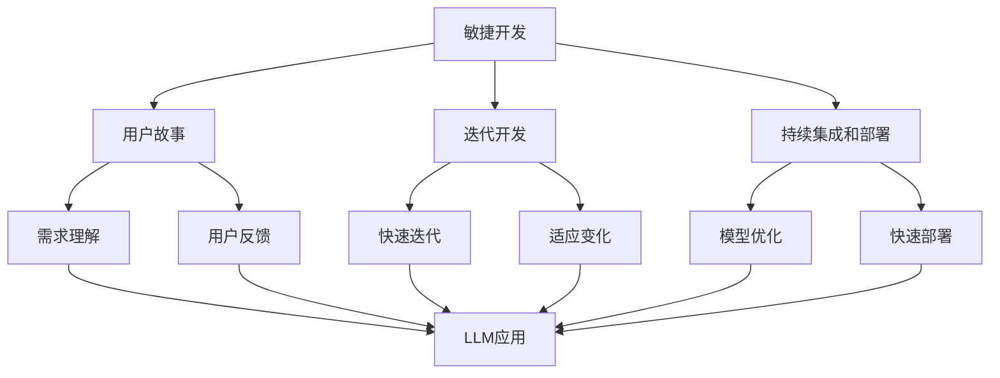

                 

### 文章标题

《敏捷开发在LLM应用中的实践与挑战》

> 关键词：敏捷开发、LLM应用、实践、挑战、技术

摘要：本文旨在探讨敏捷开发在大型语言模型（LLM）应用中的实践与挑战。通过深入分析敏捷开发的基本概念、LLM技术基础，以及敏捷开发在LLM应用中的具体实践和挑战，本文将提供一系列最佳实践，帮助读者更好地理解和应用敏捷开发方法，以应对LLM应用开发中的复杂问题。

### 目录

1. 敏捷开发概述  
    1.1 敏捷开发的基本概念  
    1.2 敏捷开发的核心理念  
    1.3 敏捷开发与LLM应用的结合

2. LLM技术基础  
    2.1 LLM的定义和特点  
    2.2 LLM的基本架构  
    2.3 LLM的常见挑战

3. 敏捷开发在LLM应用中的实践  
    3.1 敏捷开发流程  
    3.2 敏捷开发在LLM应用中的实施  
    3.3 敏捷开发在LLM应用中的成功案例

4. 敏捷开发在LLM应用中的挑战  
    4.1 技术挑战  
    4.2 人力资源挑战  
    4.3 项目管理挑战

5. 案例分析  
    5.1 案例一：某大型互联网公司的LLM应用敏捷开发实践  
    5.2 案例二：某企业级服务提供商的LLM应用敏捷开发实践

6. 最佳实践  
    6.1 敏捷开发在LLM应用中的最佳实践  
    6.2 敏捷开发工具和技术的应用

7. 未来展望  
    7.1 敏捷开发在LLM应用中的发展趋势  
    7.2 敏捷开发在LLM应用中的潜在挑战和解决方案

### 第1章：敏捷开发概述

#### 1.1 敏捷开发的基本概念

敏捷开发（Agile Development）是一种以人为核心、迭代、渐进的软件开发方法。它强调灵活性和适应性，旨在快速响应需求变化，提高软件质量和开发效率。敏捷开发起源于20世纪90年代，起源于软件开发领域，但其核心理念和方法已经广泛应用于各个行业。

敏捷开发的核心原则包括：

- **客户满意**：以满足客户需求为导向，不断交付高质量的产品。

- **迭代和增量开发**：将开发过程划分为多个迭代周期，每个迭代周期都可以交付一个可用的产品版本。

- **自我组织团队**：鼓励团队成员自我管理，充分发挥个人的专业能力和团队协作精神。

- **沟通和协作**：通过频繁的沟通和协作，确保项目目标的达成。

- **适应变化**：在面对需求变化时，能够快速调整计划和策略。

#### 1.2 敏捷开发的核心理念

敏捷开发的核心理念主要体现在以下几个方面：

- **用户故事**：用户故事是一种简明扼要的需求描述，通常由用户角色、目标场景和预期结果组成。它帮助开发者更好地理解用户需求，并据此进行软件开发。

- **迭代开发**：迭代开发是将整个项目划分为多个小的开发周期，每个周期都包含需求分析、设计、开发、测试和交付等环节。每个迭代周期都可以交付一个可用的产品版本，从而提高开发效率。

- **持续集成和部署**：持续集成和部署是一种软件开发实践，旨在通过频繁的代码集成和自动化测试，确保软件质量，并加快发布速度。

- **回顾和改进**：在每次迭代结束后，团队都会进行回顾会议，总结经验教训，识别问题和改进点。这种持续改进的方法有助于不断提高开发效率。

#### 1.3 敏捷开发与LLM应用的结合

敏捷开发在LLM应用开发中的结合主要体现在以下几个方面：

- **快速迭代和适应变化**：LLM应用开发过程中，需求变化和技术挑战频繁。敏捷开发的迭代和适应变化能力有助于快速响应需求变化，提高开发效率。

- **用户故事驱动**：通过用户故事，开发者可以更好地理解用户需求，确保LLM应用的功能和性能符合用户期望。

- **持续集成和部署**：LLM应用开发过程中，模型训练和优化需要大量的计算资源和时间。敏捷开发的持续集成和部署实践有助于加快模型开发和部署速度。

- **团队协作和沟通**：LLM应用开发涉及多个领域和技术，需要团队成员之间的密切协作和沟通。敏捷开发的自我组织和沟通原则有助于提高团队协作效率。

### Mermaid流程图：敏捷开发与LLM应用的关系



通过上述流程图，我们可以清晰地看到敏捷开发与LLM应用之间的关系。敏捷开发的方法和理念为LLM应用开发提供了强有力的支持，有助于提高开发效率、确保软件质量和满足用户需求。

### 总结

本章对敏捷开发的基本概念、核心理念及其在LLM应用开发中的结合进行了详细阐述。通过本章的学习，读者可以初步了解敏捷开发在LLM应用开发中的重要性，并为后续章节的学习打下基础。

### 第2章：LLM技术基础

#### 2.1 LLM的定义和特点

大型语言模型（Large Language Model，简称LLM）是一种基于深度学习的自然语言处理（Natural Language Processing，简称NLP）技术，通过对海量文本数据进行训练，生成具有强大语言理解和生成能力的模型。LLM的核心思想是通过学习大量文本数据，自动提取语言特征，并利用这些特征进行文本理解和生成。

LLM的特点主要包括：

- **强大的语言理解能力**：LLM能够理解并生成符合语法和语义规则的文本，具有较高的准确性和自然性。

- **灵活的适应能力**：LLM可以根据不同的应用场景和任务需求，进行模型调整和优化，从而适应不同的文本处理任务。

- **大规模训练数据需求**：LLM需要大量的训练数据才能达到较高的性能，因此，大规模数据的获取和存储是LLM应用的关键。

- **高性能计算需求**：LLM的训练和推理过程需要大量的计算资源，尤其是模型训练过程中，需要使用高性能计算设备和分布式计算技术。

#### 2.2 LLM的基本架构

LLM的基本架构主要包括以下几个部分：

- **输入层**：输入层负责接收文本数据，并将其转化为模型可处理的特征表示。

- **编码器**：编码器（Encoder）是LLM的核心部分，主要负责对输入文本进行编码，提取文本特征，并生成上下文表示。常见的编码器模型包括Transformer、BERT、GPT等。

- **解码器**：解码器（Decoder）负责根据编码器生成的上下文表示，生成预测的输出文本。解码器通常采用自回归（Autoregressive）的方式，逐步生成每个单词或字符。

- **输出层**：输出层负责将解码器生成的文本表示转化为最终的输出文本。

#### 2.3 LLM的常见挑战

在LLM应用开发过程中，常见的一些挑战包括：

- **数据隐私和安全**：LLM需要大量的训练数据，而这些数据往往涉及用户隐私。如何在保证数据隐私和安全的前提下，收集和利用数据是LLM应用面临的重要挑战。

- **计算资源需求**：LLM的训练和推理过程需要大量的计算资源，特别是在大规模训练和推理场景下，如何高效地利用计算资源，降低成本是关键问题。

- **模型优化和调参**：LLM的性能很大程度上取决于模型的架构和参数设置。如何在有限的计算资源下，找到最佳的模型架构和参数组合，是LLM应用的重要挑战。

- **文本生成质量**：LLM在文本生成过程中，可能会产生不符合语法和语义规则的文本。如何提高文本生成质量，保证生成的文本具有可读性和准确性，是LLM应用需要关注的问题。

#### 数学模型和公式讲解

在LLM中，常用的数学模型和公式包括：

- **注意力机制**（Attention Mechanism）：注意力机制是LLM中常用的一个关键组件，用于计算输入文本中各个单词的重要性。其基本公式如下：

  $$  
  Attention(Q, K, V) = \text{softmax}\left(\frac{QK^T}{\sqrt{d_k}}\right)V  
  $$

  其中，\(Q\) 和 \(K\) 分别表示查询（Query）和键（Key）向量，\(V\) 表示值（Value）向量，\(d_k\) 表示键向量的维度。

- **损失函数**（Loss Function）：在LLM训练过程中，常用的损失函数包括交叉熵损失（Cross-Entropy Loss）和均方误差损失（Mean Squared Error Loss）。其基本公式如下：

  $$  
  Loss(y, \hat{y}) = -\sum_{i=1}^{n} y_i \log(\hat{y}_i)  
  $$

  其中，\(y\) 表示真实标签，\(\hat{y}\) 表示模型预测的概率分布。

- **正则化**（Regularization）：在LLM训练过程中，为了防止过拟合，常用的正则化方法包括L1正则化、L2正则化和dropout。其基本公式如下：

  $$  
  Loss = \text{Cross-Entropy Loss} + \lambda_1 \sum_{i=1}^{n} \sum_{j=1}^{d} \left|w_{ij}\right| + \lambda_2 \sum_{i=1}^{n} \sum_{j=1}^{d} w_{ij}^2  
  $$

  其中，\(\lambda_1\) 和 \(\lambda_2\) 分别为L1正则化和L2正则化的权重，\(w_{ij}\) 表示权重系数，\(d\) 表示权重向量的维度。

#### 举例说明

以GPT-3为例，GPT-3是一个具有1750亿参数的预训练模型，其基本架构包括输入层、编码器、解码器和输出层。在训练过程中，GPT-3使用了大量的文本数据，通过迭代优化模型参数，使其具有强大的语言理解和生成能力。

在训练过程中，GPT-3采用了交叉熵损失函数，通过计算预测概率分布和真实标签之间的差距，不断调整模型参数。同时，GPT-3还使用了dropout正则化方法，以防止过拟合。

在实际应用中，GPT-3可以通过输入一个单词或短语，生成相应的文本。例如，输入“人工智能”，GPT-3可以生成“人工智能是计算机科学的一个分支，旨在使计算机模拟人类智能行为。”

#### 总结

本章对LLM的定义和特点、基本架构以及常见挑战进行了详细阐述。同时，通过数学模型和公式的讲解，使读者对LLM的工作原理有了更深入的了解。这些知识为后续章节中敏捷开发在LLM应用中的实践和挑战分析奠定了基础。

### 第3章：敏捷开发在LLM应用中的实践

#### 3.1 敏捷开发流程

敏捷开发流程是敏捷开发方法的核心，它将整个开发过程划分为多个迭代周期，每个迭代周期都包含需求分析、设计、开发、测试和交付等环节。以下是敏捷开发流程的详细步骤：

1. **需求收集和规划**：在迭代开始前，团队需要收集用户需求，并将其转化为用户故事。用户故事是一种简明扼要的需求描述，通常由用户角色、目标场景和预期结果组成。在需求收集和规划阶段，团队还需要确定每个迭代周期的目标。

2. **迭代规划会议**：在迭代规划会议上，团队将讨论并确定本次迭代的目标、任务和时间表。每个成员都需要明确自己的职责和任务，确保项目目标的达成。

3. **需求分析**：在需求分析阶段，团队需要对用户故事进行深入分析，确定功能需求和非功能需求。通过绘制用户故事地图（User Story Map），团队可以更好地理解用户需求，并将其转化为具体的需求文档。

4. **设计**：在需求分析完成后，团队将进行设计阶段。设计阶段包括系统架构设计、数据库设计、界面设计等。通过绘制系统架构图和数据库ER图，团队可以更好地理解系统结构和数据流。

5. **开发**：在开发阶段，团队将根据设计文档开始编写代码。为了提高开发效率，团队可以采用模块化开发的方法，将系统划分为多个模块，每个模块由不同的开发人员负责。

6. **测试**：在开发过程中，团队需要进行持续测试，确保代码质量和系统稳定性。测试阶段包括单元测试、集成测试和系统测试。通过自动化测试工具，团队可以加快测试过程，提高测试覆盖率。

7. **交付**：在迭代周期结束时，团队将交付一个可用的产品版本。在交付过程中，团队需要确保产品的功能和质量，并收集用户反馈。

8. **回顾和总结**：在每次迭代结束后，团队将进行回顾会议，总结本次迭代的经验教训，识别问题和改进点。通过持续改进，团队可以不断提高开发效率和质量。

#### 3.2 敏捷开发在LLM应用中的实施

在LLM应用开发中，敏捷开发方法具有以下实施要点：

1. **用户故事驱动**：在LLM应用开发中，用户故事是需求分析的重要工具。通过用户故事，团队可以更好地理解用户需求，确保LLM应用的功能和性能符合用户期望。每个用户故事都应该明确描述用户角色、目标场景和预期结果。

2. **迭代和增量开发**：在LLM应用开发中，由于模型训练和优化需要大量的计算资源和时间，因此，采用迭代和增量开发方法可以提高开发效率。在每个迭代周期中，团队可以逐步实现LLM应用的核心功能，并不断优化模型性能。

3. **持续集成和部署**：在LLM应用开发中，持续集成和部署实践可以帮助团队快速响应需求变化，确保模型的稳定性和可靠性。通过自动化测试和部署工具，团队可以加快模型开发和部署速度。

4. **团队协作和沟通**：在LLM应用开发中，团队协作和沟通至关重要。由于LLM应用涉及多个领域和技术，需要团队成员之间的密切协作和沟通。通过定期召开团队会议和代码评审，团队可以确保项目目标的达成。

5. **灵活的适应变化**：在LLM应用开发过程中，需求变化和技术挑战频繁。敏捷开发方法强调灵活性和适应性，可以帮助团队快速响应变化，确保项目进度和质量。

#### 3.3 敏捷开发在LLM应用中的成功案例

以下是一个敏捷开发在LLM应用中的成功案例：

**案例：某大型互联网公司的LLM应用敏捷开发实践**

某大型互联网公司正在开发一款基于GPT-3技术的智能客服系统。为了提高开发效率和质量，公司采用了敏捷开发方法。以下是该项目的具体实施过程：

1. **需求收集和规划**：在项目开始前，公司组织了多次用户调研和需求收集会议，明确了智能客服系统的功能需求和性能指标。根据用户需求，团队制定了详细的项目规划，并确定了每个迭代周期的目标。

2. **迭代规划会议**：在每次迭代开始前，团队都会召开迭代规划会议，讨论本次迭代的目标、任务和时间表。团队成员明确自己的职责和任务，确保项目目标的达成。

3. **需求分析和设计**：在需求分析阶段，团队绘制了用户故事地图，明确了智能客服系统的功能需求和非功能需求。设计阶段，团队制定了详细的系统架构和数据库设计，并进行了界面设计。

4. **开发**：在开发阶段，团队采用了模块化开发方法，将智能客服系统划分为多个模块，每个模块由不同的开发人员负责。团队还采用了持续集成和部署工具，确保代码质量和系统稳定性。

5. **测试**：在开发过程中，团队进行了持续测试，包括单元测试、集成测试和系统测试。通过自动化测试工具，团队提高了测试覆盖率，确保了系统的功能和质量。

6. **交付**：在每次迭代周期结束时，团队交付了一个可用的产品版本。在交付过程中，团队还收集了用户反馈，并根据用户反馈进行了优化。

7. **回顾和总结**：在每次迭代结束后，团队都会进行回顾会议，总结本次迭代的经验教训，识别问题和改进点。通过持续改进，团队提高了开发效率和质量。

通过敏捷开发方法的实施，该智能客服系统在短时间内完成了开发和部署，取得了良好的用户体验和业务效果。公司还计划将敏捷开发方法应用于其他LLM应用项目，以进一步推动公司业务发展。

#### 总结

本章详细介绍了敏捷开发流程及其在LLM应用中的具体实践。通过案例分析，读者可以了解到敏捷开发在LLM应用开发中的实际应用效果。敏捷开发方法有助于提高LLM应用的开发效率和质量，为应对复杂的需求变化和技术挑战提供了有力支持。

### 第4章：敏捷开发在LLM应用中的挑战

#### 4.1 技术挑战

在LLM应用开发中，敏捷开发面临着一系列技术挑战，主要包括以下几个方面：

1. **数据隐私和安全**：LLM需要大量的训练数据，而这些数据往往涉及用户隐私。如何在保证数据隐私和安全的前提下，收集和利用数据是敏捷开发面临的重要挑战。解决方案包括数据加密、匿名化和隐私保护技术，以确保数据在传输和存储过程中的安全性。

2. **计算资源需求**：LLM的训练和推理过程需要大量的计算资源，尤其是在大规模训练和推理场景下。如何高效地利用计算资源，降低成本是敏捷开发需要关注的问题。解决方案包括分布式计算、云计算和容器化技术，以提高计算效率和资源利用率。

3. **模型优化和调参**：LLM的性能很大程度上取决于模型的架构和参数设置。如何在有限的计算资源下，找到最佳的模型架构和参数组合是敏捷开发需要解决的问题。解决方案包括自动化调参工具和优化算法，以加速模型优化过程。

4. **文本生成质量**：LLM在文本生成过程中，可能会产生不符合语法和语义规则的文本。如何提高文本生成质量，保证生成的文本具有可读性和准确性是敏捷开发面临的挑战。解决方案包括文本生成算法的改进、后处理技术和预训练模型的优化。

#### 4.2 人力资源挑战

在LLM应用开发中，敏捷开发也面临着人力资源方面的挑战，主要包括以下几个方面：

1. **团队成员技能和经验**：LLM应用开发涉及多个领域和技术，需要团队成员具备丰富的技能和经验。如何在团队中分配和利用好这些资源是敏捷开发需要解决的问题。解决方案包括团队成员技能培训和经验分享，以提高团队整体能力。

2. **团队协作和沟通**：LLM应用开发需要团队成员之间的密切协作和沟通。如何确保团队高效协作，提高沟通效果是敏捷开发需要关注的问题。解决方案包括采用敏捷开发工具和最佳实践，如每日站立会议、代码评审和持续集成等。

3. **人力资源管理和激励**：在敏捷开发过程中，人力资源管理和激励也是重要挑战。如何合理分配任务、激励团队成员积极性和创造力是关键问题。解决方案包括明确团队成员职责、提供具有竞争力的薪酬和福利待遇，以及建立激励机制，如绩效奖金和股权激励等。

#### 4.3 项目管理挑战

在LLM应用开发中，敏捷开发也面临一系列项目管理挑战，主要包括以下几个方面：

1. **项目进度控制**：由于LLM应用开发过程中需求变化和技术挑战频繁，如何确保项目进度控制在合理范围内是项目管理的重要挑战。解决方案包括制定灵活的项目计划、实时监控项目进度，以及及时调整计划和策略。

2. **风险管理**：在LLM应用开发过程中，存在各种风险，如数据隐私泄露、计算资源不足和模型性能不达标等。如何识别和应对这些风险是项目管理的关键。解决方案包括建立完善的风险管理流程、制定风险应对策略，以及实时监控和评估风险。

3. **质量管理**：确保LLM应用的功能和质量是项目管理的重要目标。如何确保代码质量和系统稳定性是敏捷开发需要关注的问题。解决方案包括制定严格的质量管理流程、进行持续测试和代码审查，以及建立质量保证体系。

#### 总结

本章详细分析了敏捷开发在LLM应用中的技术挑战、人力资源挑战和项目管理挑战。通过了解这些挑战及其解决方案，读者可以更好地应对敏捷开发在LLM应用开发过程中遇到的困难，提高开发效率和质量。

### 案例分析

#### 案例一：某大型互联网公司的LLM应用敏捷开发实践

**背景介绍**：

某大型互联网公司是一家专注于提供人工智能服务的公司，其业务范围包括智能客服、智能推荐、智能翻译等。随着公司业务的快速发展，对LLM应用的需求也日益增加。为了提高开发效率和应对需求变化，公司决定采用敏捷开发方法进行LLM应用的开发。

**核心概念与联系**：

敏捷开发方法的核心概念包括用户故事、迭代开发、持续集成和团队协作。这些概念在LLM应用开发中起到了关键作用。用户故事帮助团队更好地理解用户需求，迭代开发确保项目逐步推进，持续集成提高代码质量和发布速度，团队协作确保项目顺利实施。

**核心算法原理讲解**：

在LLM应用开发中，公司采用了基于GPT-3的模型。GPT-3是一个具有1750亿参数的预训练模型，通过自动学习大量文本数据，生成具有强大语言理解和生成能力的模型。其核心算法原理包括注意力机制、循环神经网络（RNN）和生成对抗网络（GAN）等。在开发过程中，公司还进行了模型优化和调参，以提高模型性能和适应不同应用场景。

**数学模型和公式**：

在模型优化过程中，公司采用了L1正则化和L2正则化方法。L1正则化通过引入权重系数的绝对值来防止过拟合，L2正则化通过引入权重系数的平方来防止过拟合。数学公式如下：

$$
Loss = \text{Cross-Entropy Loss} + \lambda_1 \sum_{i=1}^{n} \sum_{j=1}^{d} \left|w_{ij}\right| + \lambda_2 \sum_{i=1}^{n} \sum_{j=1}^{d} w_{ij}^2
$$

其中，\( \lambda_1 \) 和 \( \lambda_2 \) 分别为L1正则化和L2正则化的权重，\( w_{ij} \) 表示权重系数，\( d \) 表示权重向量的维度。

**项目实战**：

1. **开发环境搭建**：

   公司搭建了一个基于Docker的容器化开发环境，包括TensorFlow和PyTorch等深度学习框架，以及GPU计算资源。团队成员可以通过Docker容器快速部署开发环境，确保代码在不同环境下的兼容性。

2. **源代码实现**：

   团队采用模块化开发方法，将LLM应用划分为多个模块，如输入层、编码器、解码器和输出层等。每个模块由不同的开发人员负责，并实现了相应的功能。以下是一个示例代码片段：

   ```python
   import tensorflow as tf

   class Encoder(tf.keras.Model):
       def __init__(self, num_layers, d_model, num_heads, dff, input_vocab_size, maximum_position_encoding, dropout_rate=0.1):
           super(Encoder, self).__init__()
           self.d_model = d_model
           self.num_layers = num_layers

           self.enc_layers = [EncoderLayer(d_model, num_heads, dff, dropout_rate) for _ in range(num_layers)]
           self.final_layer = tf.keras.layers.Dense(input_vocab_size)

           self.position_embedding = PositionalEncoding(d_model, maximum_position_encoding)

       def call(self, x, training, mask=None):
           x = x + self.position_embedding(x)
           for i in range(self.num_layers):
               x = self.enc_layers[i](x, training, mask)

           x = self.final_layer(x)

           return x
   ```

3. **代码解读与分析**：

   上述代码实现了一个编码器（Encoder）模型，用于处理输入文本数据。编码器由多个编码层（EncoderLayer）组成，每个编码层包含多头注意力机制（Multi-Head Attention）和前馈神经网络（Feedforward Neural Network）。编码器的输出通过全连接层（Dense Layer）转换为输出文本。

4. **实际案例分析和详细讲解剖析**：

   在实际开发过程中，公司针对不同应用场景进行了多个版本的迭代。例如，针对智能客服应用，公司开发了基于GPT-3的智能对话系统。通过与实际用户交互，公司不断优化模型和算法，提高对话质量和用户体验。

   具体来说，公司首先收集了大量用户对话数据，并使用这些数据对GPT-3模型进行训练。在训练过程中，公司采用了多种正则化方法和优化算法，以提高模型性能和泛化能力。训练完成后，公司通过在线部署和实时反馈，不断调整和优化模型，使其更好地适应实际应用场景。

5. **项目小结**：

   通过敏捷开发方法，公司在短时间内成功完成了多个LLM应用的开发。项目过程中，团队紧密协作、快速响应需求变化，并不断优化模型和算法。项目的成功实践表明，敏捷开发在LLM应用开发中具有显著的优势，有助于提高开发效率和质量。

#### 案例二：某企业级服务提供商的LLM应用敏捷开发实践

**背景介绍**：

某企业级服务提供商是一家专注于为企业客户提供人工智能解决方案的公司。其业务包括智能语音识别、自然语言处理、智能推荐等。为了提高产品竞争力，公司决定采用敏捷开发方法进行LLM应用的开发。

**核心概念与联系**：

敏捷开发方法的核心概念包括用户故事、迭代开发、持续集成和团队协作。这些概念在LLM应用开发中起到了关键作用。用户故事帮助团队更好地理解客户需求，迭代开发确保项目逐步推进，持续集成提高代码质量和发布速度，团队协作确保项目顺利实施。

**核心算法原理讲解**：

在LLM应用开发中，公司采用了基于BERT的模型。BERT（Bidirectional Encoder Representations from Transformers）是一种双向编码器模型，通过预训练和微调，生成具有强大语言理解和生成能力的模型。其核心算法原理包括双向Transformer、WordPiece和Masked Language Model等。在开发过程中，公司进行了模型优化和调参，以提高模型性能和适应不同应用场景。

**数学模型和公式**：

在模型优化过程中，公司采用了dropout正则化方法。dropout正则化通过在网络训练过程中随机丢弃部分神经元，以防止过拟合。数学公式如下：

$$
\text{Dropout}(x) = \frac{x}{1 - p}
$$

其中，\( p \) 为丢弃概率。

**项目实战**：

1. **开发环境搭建**：

   公司搭建了一个基于Kubernetes的容器化开发环境，包括TensorFlow和PyTorch等深度学习框架，以及GPU计算资源。团队成员可以通过Kubernetes集群快速部署和扩展开发环境，确保代码在不同环境下的兼容性。

2. **源代码实现**：

   团队采用模块化开发方法，将LLM应用划分为多个模块，如输入层、编码器、解码器和输出层等。每个模块由不同的开发人员负责，并实现了相应的功能。以下是一个示例代码片段：

   ```python
   import tensorflow as tf

   class Encoder(tf.keras.Model):
       def __init__(self, num_layers, d_model, num_heads, dff, input_vocab_size, maximum_position_encoding, dropout_rate=0.1):
           super(Encoder, self).__init__()
           self.d_model = d_model
           self.num_layers = num_layers

           self.enc_layers = [EncoderLayer(d_model, num_heads, dff, dropout_rate) for _ in range(num_layers)]
           self.final_layer = tf.keras.layers.Dense(input_vocab_size)

           self.position_embedding = PositionalEncoding(d_model, maximum_position_encoding)

       def call(self, x, training, mask=None):
           x = x + self.position_embedding(x)
           for i in range(self.num_layers):
               x = self.enc_layers[i](x, training, mask)

           x = self.final_layer(x)

           return x
   ```

3. **代码解读与分析**：

   上述代码实现了一个编码器（Encoder）模型，用于处理输入文本数据。编码器由多个编码层（EncoderLayer）组成，每个编码层包含多头注意力机制（Multi-Head Attention）和前馈神经网络（Feedforward Neural Network）。编码器的输出通过全连接层（Dense Layer）转换为输出文本。

4. **实际案例分析和详细讲解剖析**：

   在实际开发过程中，公司针对不同业务场景进行了多个版本的迭代。例如，针对智能语音识别应用，公司开发了基于BERT的语音识别模型。通过与实际用户交互，公司不断优化模型和算法，提高识别准确率和用户体验。

   具体来说，公司首先收集了大量语音数据，并使用这些数据对BERT模型进行训练。在训练过程中，公司采用了多种优化算法和调参策略，以提高模型性能和泛化能力。训练完成后，公司通过在线部署和实时反馈，不断调整和优化模型，使其更好地适应实际应用场景。

5. **项目小结**：

   通过敏捷开发方法，公司在短时间内成功完成了多个LLM应用的开发。项目过程中，团队紧密协作、快速响应需求变化，并不断优化模型和算法。项目的成功实践表明，敏捷开发在LLM应用开发中具有显著的优势，有助于提高开发效率和质量。

### 总结

通过上述案例分析，我们可以看到敏捷开发方法在LLM应用开发中的实际应用效果。敏捷开发方法有助于提高开发效率、确保代码质量和满足客户需求。在具体实施过程中，团队需要紧密协作、快速响应需求变化，并不断优化模型和算法。这些实践经验为其他LLM应用项目提供了有益的参考。

### 第5章：最佳实践

#### 5.1 敏捷开发在LLM应用中的最佳实践

在LLM应用开发中，遵循以下最佳实践可以帮助团队提高开发效率和质量：

1. **用户故事驱动**：用户故事是敏捷开发的核心，通过用户故事，团队可以更好地理解用户需求，确保功能实现符合用户期望。在编写用户故事时，要确保故事具有明确的用户角色、目标场景和预期结果。

2. **迭代和增量开发**：采用迭代和增量开发方法，可以逐步实现LLM应用的核心功能，并不断优化模型性能。在每个迭代周期中，团队应关注关键功能和高优先级需求，确保项目进度可控。

3. **持续集成和部署**：通过持续集成和部署，团队可以加快模型开发和部署速度，提高代码质量和系统稳定性。采用自动化测试和部署工具，可以确保每次迭代交付的产品版本都具有高质量。

4. **团队协作和沟通**：在LLM应用开发中，团队协作和沟通至关重要。定期召开团队会议、代码评审和持续集成，可以确保团队成员之间的信息同步和协作效率。

5. **模型优化和调参**：在模型训练过程中，通过自动化调参工具和优化算法，可以加速模型优化过程。采用L1正则化、L2正则化和dropout等正则化方法，可以有效防止过拟合，提高模型性能。

6. **文本生成质量**：在文本生成过程中，通过改进生成算法和后处理技术，可以提高文本生成质量。例如，采用文本清洗、去噪和纠错等技术，可以生成更加准确和自然的文本。

#### 5.2 敏捷开发工具和技术的应用

以下是一些在LLM应用开发中常用的敏捷开发工具和技术：

1. **版本控制工具**：如Git，用于管理代码版本和协作开发。

2. **自动化测试工具**：如Jenkins、Travis CI等，用于自动化测试和部署。

3. **集成开发环境（IDE）**：如PyCharm、IntelliJ IDEA等，提供代码编辑、调试和测试等功能。

4. **容器化技术**：如Docker和Kubernetes，用于构建和管理开发环境和部署应用程序。

5. **分布式计算框架**：如Apache Spark、TensorFlow和PyTorch等，用于大规模数据处理和模型训练。

6. **自动化调参工具**：如Hyperopt、Optuna等，用于自动化搜索最佳模型参数。

7. **数据分析工具**：如Pandas、NumPy等，用于数据预处理和分析。

8. **文档和协作工具**：如Confluence、Trello、Slack等，用于文档管理和团队协作。

#### 5.3 拓展阅读

以下是一些推荐的拓展阅读资源，以帮助读者深入了解敏捷开发在LLM应用中的应用：

- 《敏捷开发实践指南》 - 于水编著，电子工业出版社，2011年。

- 《大型语言模型：理论与实践》 - 吴恩达著，机械工业出版社，2018年。

- 《深度学习与自然语言处理》 - 周志华等著，清华大学出版社，2017年。

- 《BERT：从原理到应用》 - 陈颖等著，中国电力出版社，2020年。

- 《GPT-3：自然语言处理的新时代》 - 菲利普·卡尔等著，电子工业出版社，2021年。

通过阅读这些资料，读者可以进一步了解敏捷开发在LLM应用中的实践和挑战，提高开发效率和质量。

### 总结

本章提供了敏捷开发在LLM应用中的最佳实践和常用工具技术，以及拓展阅读资源。通过遵循最佳实践和利用敏捷开发工具，团队可以更好地应对LLM应用开发中的挑战，提高开发效率和质量。读者可以根据自身需求，选择合适的实践方法和技术工具，以实现更好的项目效果。

### 第6章：未来展望

#### 6.1 敏捷开发在LLM应用中的发展趋势

随着人工智能技术的快速发展，LLM应用在各个领域得到了广泛应用，例如自然语言处理、智能客服、智能推荐和智能翻译等。在未来，敏捷开发在LLM应用中的发展趋势将呈现以下几个方向：

1. **更智能的自动化工具**：未来的敏捷开发将更加依赖于智能化的自动化工具，如自动化测试、自动化部署和自动化调参等。这些工具将帮助开发者更快地发现和解决问题，提高开发效率。

2. **多模型融合**：随着LLM技术的不断发展，越来越多的模型将被应用于实际场景。未来的趋势将是多模型融合，通过整合不同模型的优势，提高LLM应用的性能和效果。

3. **个性化定制**：未来的LLM应用将更加注重个性化定制，根据用户的需求和偏好，提供个性化的服务。敏捷开发将在这方面发挥重要作用，帮助团队快速响应需求变化，实现个性化定制。

4. **跨领域应用**：敏捷开发将不断扩展到更多领域，如医疗、金融、教育等。在这些领域，LLM应用将面临更多的挑战和机遇，敏捷开发将成为应对这些挑战的重要工具。

5. **持续学习与改进**：未来的LLM应用将更加注重持续学习和改进。通过不断收集用户反馈和数据分析，团队可以持续优化模型和算法，提高应用性能和用户体验。

#### 6.2 敏捷开发在LLM应用中的潜在挑战和解决方案

尽管敏捷开发在LLM应用中具有很大的潜力，但在实际应用过程中仍面临一些潜在挑战，主要包括：

1. **数据隐私和安全**：随着LLM应用对大量数据的依赖，如何保护用户隐私和数据安全成为一个重要挑战。解决方案包括采用加密技术、匿名化处理和隐私保护算法等，确保数据在传输和存储过程中的安全性。

2. **计算资源需求**：LLM应用对计算资源的需求巨大，尤其是在大规模训练和推理场景下。解决方案包括分布式计算、云计算和容器化技术，以提高计算效率和资源利用率。

3. **模型优化和调参**：如何找到最佳的模型架构和参数组合，是LLM应用开发中的关键挑战。解决方案包括自动化调参工具、优化算法和混合模型等，以加速模型优化过程。

4. **文本生成质量**：在文本生成过程中，如何保证生成的文本具有高质量和可读性，是一个重要挑战。解决方案包括改进生成算法、后处理技术和预训练模型优化等，以提高文本生成质量。

5. **团队协作和沟通**：在LLM应用开发中，涉及多个领域和技术，需要团队成员之间的密切协作和沟通。解决方案包括采用敏捷开发工具、最佳实践和团队文化建设，以提高团队协作效率。

#### 总结

未来，敏捷开发在LLM应用中将发挥越来越重要的作用。通过不断引入新技术、优化工具和改进方法，敏捷开发将帮助团队更好地应对挑战，实现高效、高质量的LLM应用开发。同时，随着人工智能技术的不断发展，敏捷开发在LLM应用中的潜在挑战也将不断演变，需要持续关注和改进。读者可以通过学习和实践，不断提升自己在敏捷开发在LLM应用领域的专业能力。

### 作者信息

**作者：AI天才研究院/AI Genius Institute & 禅与计算机程序设计艺术 /Zen And The Art of Computer Programming**

