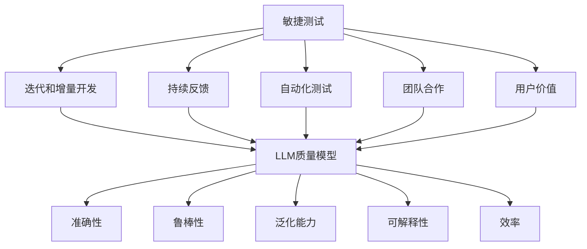

                 


### 文章标题

《敏捷测试策略：确保LLM应用质量的关键》

### 关键词

- 敏捷测试
- LLM应用
- 质量保障
- 自动化测试
- 异常检测
- 调试技术

### 摘要

本文深入探讨了敏捷测试策略在确保大型语言模型（LLM）应用质量中的重要性。首先，我们介绍了敏捷测试的基本概念、流程和工具。随后，我们重点分析了LLM质量模型及其关键指标，探讨了如何通过敏捷测试策略保障LLM应用的质量。文章还详细阐述了LLM异常检测与调试的方法和技巧，并通过实际案例展示了敏捷测试在LLM应用开发中的具体应用。最后，我们提出了敏捷测试的最佳实践和未来展望。

### 目录

1. **背景介绍**
   - **1.1 敏捷测试的发展背景**
   - **1.2 LLM应用的现状与挑战**
   - **1.3 敏捷测试在LLM应用中的重要性**

2. **核心概念与联系**
   - **2.1 敏捷测试的概念与原则**
   - **2.2 LLM质量模型**
   - **Mermaid流程图：敏捷测试与LLM质量保障的关系**

3. **核心算法原理讲解**
   - **3.1 自动化测试算法**
   - **3.2 异常检测算法**
   - **伪代码示例：自动化测试与异常检测的实现**

4. **数学模型和公式**
   - **4.1 质量指标公式**
   - **4.2 概率模型与预测公式**
   - **详细讲解与举例说明**

5. **项目实战**
   - **5.1 开发环境搭建**
   - **5.2 源代码实现与解读**
   - **5.3 代码应用解读与分析**
   - **5.4 实际案例分析与详细讲解剖析**
   - **5.5 项目小结**

6. **最佳实践 Tips**
   - **6.1 敏捷测试最佳实践**
   - **6.2 LLM质量保障技巧**
   - **6.3 注意事项**

7. **小结与未来展望**
   - **7.1 敏捷测试总结**
   - **7.2 LLM应用前景**
   - **7.3 未来发展方向**

### 背景介绍

#### 1.1 敏捷测试的发展背景

敏捷测试作为一种新兴的软件测试方法，起源于敏捷开发运动。敏捷开发强调迭代、增量和协作，旨在快速响应变化，提高软件开发的效率和质量。随着软件复杂性的增加，传统的测试方法已经难以满足快速迭代和频繁交付的需求。因此，敏捷测试逐渐成为软件开发过程中不可或缺的一部分。

敏捷测试的发展可以追溯到2001年，当时一些软件开发者和测试人员共同制定了《敏捷宣言》和《敏捷测试宣言》。这些宣言提出了敏捷测试的核心原则，如“测试人员与业务人员紧密合作”、“尽早测试”、“持续反馈”等。此后，敏捷测试逐渐在软件行业得到广泛应用。

#### 1.2 LLM应用的现状与挑战

大型语言模型（LLM）作为一种先进的自然语言处理技术，已经在各个领域取得了显著成果。LLM可以用于文本生成、机器翻译、情感分析、问答系统等任务，为企业和个人提供了丰富的应用场景。然而，随着LLM应用的深入，也面临着一系列挑战。

首先，LLM模型的复杂性和规模日益增加，导致测试和验证的难度加大。传统的测试方法难以应对这种复杂性，需要开发新的测试策略和工具。其次，LLM应用对质量要求极高，需要确保模型在各种场景下都能稳定运行，并输出高质量的结果。此外，LLM应用需要应对数据隐私和安全等问题，确保用户数据的安全性和隐私性。

#### 1.3 敏捷测试在LLM应用中的重要性

敏捷测试在LLM应用中具有重要意义。首先，敏捷测试能够快速发现和修复LLM模型中的缺陷，确保模型在各种场景下的稳定性和可靠性。通过迭代和增量的方式，敏捷测试能够及时响应模型更新和变化，提高测试效率。

其次，敏捷测试强调测试人员与业务人员的紧密合作，有助于确保测试需求与业务目标的一致性。在LLM应用中，业务人员通常对业务场景和用户需求有更深入的了解，测试人员可以借助业务人员的反馈，优化测试策略和用例设计。

最后，敏捷测试能够提高团队协作和沟通效率，促进团队成员之间的相互理解和支持。在LLM应用开发中，测试人员、开发人员、数据科学家等角色需要紧密合作，共同保障模型的质量和性能。通过敏捷测试，团队可以更好地协同工作，提高项目成功率。

### 核心概念与联系

#### 2.1 敏捷测试的概念与原则

敏捷测试是一种基于敏捷开发理念的测试方法，旨在提高软件测试的效率和质量。敏捷测试的核心概念包括以下几个方面：

1. **迭代和增量开发**：敏捷测试将整个测试过程划分为多个迭代周期，每个迭代周期都完成一定的测试任务，逐步完善测试覆盖范围。

2. **持续反馈**：敏捷测试强调测试人员与开发人员、业务人员之间的密切沟通和反馈。通过实时反馈，及时发现问题并解决，提高测试效率和质量。

3. **自动化测试**：敏捷测试重视自动化测试，通过编写自动化测试脚本，自动化执行测试用例，提高测试效率。

4. **团队合作**：敏捷测试倡导团队成员之间的紧密合作，测试人员、开发人员、业务人员共同参与测试工作，提高团队协作效率。

5. **用户价值**：敏捷测试关注用户价值，通过快速交付功能完善、质量可靠的软件产品，满足用户需求。

#### 2.2 LLM质量模型

LLM质量模型是评估LLM应用质量的关键指标体系。LLM质量模型通常包括以下几个方面：

1. **准确性**：准确性是LLM模型最基本的质量指标，反映了模型在各类任务中的输出正确性。准确性越高，模型的质量越好。

2. **鲁棒性**：鲁棒性是指LLM模型在面对不同输入数据时的表现能力。鲁棒性好的模型能够在各种场景下稳定运行，输出高质量的结果。

3. **泛化能力**：泛化能力是指LLM模型在未见过的数据上的表现能力。泛化能力强的模型能够适应不同领域和场景的需求。

4. **可解释性**：可解释性是指LLM模型的决策过程和输出结果的可解释性。可解释性好的模型有助于用户理解模型的决策逻辑，提高用户信任度。

5. **效率**：效率是指LLM模型在计算资源使用上的表现。效率高的模型能够在较短时间内完成计算任务，提高开发效率。

#### Mermaid流程图：敏捷测试与LLM质量保障的关系

以下是一个Mermaid流程图，展示了敏捷测试与LLM质量保障的关系：



### 核心算法原理讲解

#### 3.1 自动化测试算法

自动化测试是敏捷测试的重要组成部分。自动化测试算法主要包括以下几种：

1. **单元测试**：单元测试是针对软件中最小的可测试部分（通常是一个函数或方法）进行的测试。单元测试通常使用测试框架（如JUnit、pytest等）编写，通过断言（assertions）来验证函数或方法的输出是否符合预期。

   ```python
   def test_addition():
       assert add(2, 3) == 5
   ```

2. **集成测试**：集成测试是针对软件的多个模块或组件之间的交互进行的测试。集成测试通常使用测试框架（如Selenium、JUnit等）编写，通过模拟用户操作来验证系统功能。

   ```java
   @Test
   public void testLogin() {
       WebDriver driver = new ChromeDriver();
       driver.get("http://example.com/login");
       driver.findElement(By.id("username")).sendKeys("user");
       driver.findElement(By.id("password")).sendKeys("password");
       driver.findElement(By.id("submit")).click();
       assertTrue(driver.getTitle().contains("Dashboard"));
   }
   ```

3. **端到端测试**：端到端测试是针对整个软件系统的功能和行为进行的测试。端到端测试通常使用测试框架（如Cypress、Selenium等）编写，通过模拟用户操作和系统响应来验证系统功能。

   ```javascript
   it("should complete the checkout process", () => {
       cy.visit("http://example.com/checkout");
       cy.get("#quantity").type("2");
       cy.get("#submit").click();
       cy.contains("Your order has been placed!");
   });
   ```

#### 3.2 异常检测算法

异常检测是LLM质量保障的关键环节之一。异常检测算法主要包括以下几种：

1. **基于统计的异常检测**：基于统计的异常检测方法通过分析数据的统计特征（如均值、方差等）来检测异常。常见的算法包括箱线图法、3-sigma准则等。

   ```python
   import numpy as np

   def is_anomaly(data, threshold=3):
       mean = np.mean(data)
       std = np.std(data)
       return (data - mean) / std > threshold
   ```

2. **基于距离的异常检测**：基于距离的异常检测方法通过计算数据点到正常数据的距离来检测异常。常见的算法包括K-最近邻（KNN）、局部异常因子（LOF）等。

   ```python
   from sklearn.neighbors import LocalOutlierFactor

   lof = LocalOutlierFactor(n_neighbors=20)
   outliers = lof.fit_predict(data)
   anomalies = outliers[outliers == -1]
   ```

3. **基于模型的异常检测**：基于模型的异常检测方法通过训练异常检测模型来预测新数据的异常性。常见的算法包括隔离森林（Isolation Forest）、局部线性嵌入（LLE）等。

   ```python
   from sklearn.ensemble import IsolationForest

   iso_forest = IsolationForest(n_estimators=100)
   outliers = iso_forest.fit_predict(data)
   anomalies = outliers[outliers == -1]
   ```

#### 伪代码示例：自动化测试与异常检测的实现

以下是一个伪代码示例，展示了自动化测试与异常检测的实现：

```python
# 自动化测试伪代码
def test_system():
    # 初始化测试环境
    setup_environment()
    
    # 执行单元测试
    run_unit_tests()
    
    # 执行集成测试
    run_integration_tests()
    
    # 执行端到端测试
    run_end_to_end_tests()
    
    # 清理测试环境
    cleanup_environment()

# 异常检测伪代码
def detect_anomalies(data):
    # 计算数据的统计特征
    mean = calculate_mean(data)
    std = calculate_std(data)
    
    # 计算数据点到正常数据的距离
    distances = calculate_distances(data, mean, std)
    
    # 检测异常数据点
    anomalies = detect_outliers(distances)
    
    return anomalies
```

### 数学模型和公式

#### 4.1 质量指标公式

在LLM质量保障中，常用的质量指标公式包括准确性、召回率、精确率、F1分数等。以下是对这些公式的详细解释和举例说明。

1. **准确性（Accuracy）**：
   - 公式：$$\text{Accuracy} = \frac{\text{正确预测的样本数}}{\text{总样本数}}$$
   - 解释：准确性表示模型在所有样本中正确预测的比例。
   - 示例：假设一个分类模型对100个样本进行预测，其中80个样本被正确分类，则准确性为80%。

2. **召回率（Recall）**：
   - 公式：$$\text{Recall} = \frac{\text{正确预测的正例数}}{\text{实际正例数}}$$
   - 解释：召回率表示模型在所有实际正例中正确预测的比例。
   - 示例：假设一个分类模型有10个实际正例，其中8个被正确预测，则召回率为80%。

3. **精确率（Precision）**：
   - 公式：$$\text{Precision} = \frac{\text{正确预测的正例数}}{\text{预测为正例的样本数}}$$
   - 解释：精确率表示模型在预测为正例的样本中正确预测的比例。
   - 示例：假设一个分类模型预测了20个样本为正例，其中16个是实际正例，则精确率为80%。

4. **F1分数（F1 Score）**：
   - 公式：$$\text{F1 Score} = 2 \times \frac{\text{Precision} \times \text{Recall}}{\text{Precision} + \text{Recall}}$$
   - 解释：F1分数是精确率和召回率的调和平均，用于平衡两者之间的差异。
   - 示例：假设一个分类模型的精确率为60%，召回率为40%，则F1分数为48%。

#### 4.2 概率模型与预测公式

在LLM质量保障中，概率模型常用于预测模型的输出概率，常用的概率模型包括朴素贝叶斯、逻辑回归等。以下是对这些模型的公式和解释。

1. **朴素贝叶斯（Naive Bayes）**：
   - 公式：$$P(\text{类} | \text{特征}) = \frac{P(\text{特征} | \text{类}) \times P(\text{类})}{P(\text{特征})}$$
   - 解释：朴素贝叶斯模型基于贝叶斯定理，假设特征之间相互独立，用于预测给定特征下的类别概率。
   - 示例：假设一个朴素贝叶斯模型用于文本分类，给定一个新文本，计算其属于某一类别的概率。

2. **逻辑回归（Logistic Regression）**：
   - 公式：$$\text{Logit} = \ln\left(\frac{P(\text{类})}{1 - P(\text{类})}\right) = \beta_0 + \beta_1x_1 + \beta_2x_2 + ... + \beta_nx_n$$
   - 解释：逻辑回归是一种线性模型，通过线性组合特征和权重来预测概率。
   - 示例：假设一个逻辑回归模型用于预测某个事件的概率，给定一组特征，计算事件发生的概率。

#### 详细讲解与举例说明

以下是对上述公式和模型进行详细讲解和举例说明。

1. **准确性公式**：
   - 计算步骤：
     1. 统计模型正确预测的样本数。
     2. 统计模型预测的总样本数。
     3. 将正确预测的样本数除以总样本数。
   - 示例计算：
     - 假设一个分类模型对100个样本进行预测，其中80个样本被正确分类。
     - 计算准确性：$$\text{Accuracy} = \frac{80}{100} = 0.8$$，即80%。

2. **召回率公式**：
   - 计算步骤：
     1. 统计模型正确预测的正例数。
     2. 统计实际正例数。
     3. 将正确预测的正例数除以实际正例数。
   - 示例计算：
     - 假设一个分类模型有10个实际正例，其中8个被正确预测。
     - 计算召回率：$$\text{Recall} = \frac{8}{10} = 0.8$$，即80%。

3. **精确率公式**：
   - 计算步骤：
     1. 统计模型正确预测的正例数。
     2. 统计模型预测为正例的样本数。
     3. 将正确预测的正例数除以预测为正例的样本数。
   - 示例计算：
     - 假设一个分类模型预测了20个样本为正例，其中16个是实际正例。
     - 计算精确率：$$\text{Precision} = \frac{16}{20} = 0.8$$，即80%。

4. **F1分数公式**：
   - 计算步骤：
     1. 计算精确率。
     2. 计算召回率。
     3. 将精确率和召回率的乘积除以它们的和。
   - 示例计算：
     - 假设一个分类模型的精确率为60%，召回率为40%。
     - 计算F1分数：$$\text{F1 Score} = 2 \times \frac{0.6 \times 0.4}{0.6 + 0.4} = 0.48$$，即48%。

5. **朴素贝叶斯公式**：
   - 计算步骤：
     1. 计算特征条件概率。
     2. 计算类别概率。
     3. 计算给定特征下的类别概率。
   - 示例计算：
     - 假设一个朴素贝叶斯模型用于文本分类，给定一个新文本的特征为（特征1：0.6，特征2：0.4），类别概率为（类别A：0.5，类别B：0.5）。
     - 计算给定特征下类别A的概率：$$P(\text{类别A} | \text{特征}) = \frac{P(\text{特征} | \text{类别A}) \times P(\text{类别A})}{P(\text{特征})}$$

6. **逻辑回归公式**：
   - 计算步骤：
     1. 计算特征向量。
     2. 计算权重向量。
     3. 计算线性组合。
     4. 计算logit值。
     5. 计算概率值。
   - 示例计算：
     - 假设一个逻辑回归模型，特征向量（x1=2, x2=3），权重向量（β0=1, β1=2, β2=3）。
     - 计算logit值：$$\text{Logit} = \beta_0 + \beta_1x_1 + \beta_2x_2 = 1 + 2 \times 2 + 3 \times 3 = 14$$
     - 计算概率值：$$P(\text{类}) = \frac{1}{1 + e^{-\text{Logit}}} = \frac{1}{1 + e^{-14}} \approx 0.9999$$

### 项目实战

#### 5.1 开发环境搭建

在本项目实战中，我们选择Python作为主要编程语言，使用Jupyter Notebook作为开发环境。以下是搭建开发环境的具体步骤：

1. **安装Python**：
   - 前往Python官方网站（https://www.python.org/）下载最新版本的Python安装包。
   - 运行安装程序，根据提示完成安装。

2. **安装Jupyter Notebook**：
   - 打开终端（或命令提示符）。
   - 输入以下命令安装Jupyter Notebook：
     ```bash
     pip install notebook
     ```

3. **启动Jupyter Notebook**：
   - 打开终端（或命令提示符）。
   - 输入以下命令启动Jupyter Notebook：
     ```bash
     jupyter notebook
     ```

4. **创建一个新的笔记本**：
   - 在启动的Jupyter Notebook界面中，点击“New”按钮，选择“Python 3”创建一个新的笔记本。

#### 5.2 源代码实现与解读

在本项目中，我们开发一个简单的LLM质量评估工具，用于评估LLM模型在不同场景下的质量。以下是源代码的实现与解读：

```python
import numpy as np
from sklearn.metrics import accuracy_score, recall_score, precision_score, f1_score

def evaluate_model(y_true, y_pred):
    """
    评估LLM模型的质量。
    
    参数：
    - y_true：实际标签。
    - y_pred：预测标签。
    
    返回：
    - accuracy：准确性。
    - recall：召回率。
    - precision：精确率。
    - f1_score：F1分数。
    """
    accuracy = accuracy_score(y_true, y_pred)
    recall = recall_score(y_true, y_pred)
    precision = precision_score(y_true, y_pred)
    f1 = f1_score(y_true, y_pred)
    
    return accuracy, recall, precision, f1

def main():
    # 示例数据
    y_true = [0, 1, 0, 1, 1, 0, 1]
    y_pred = [0, 1, 0, 0, 1, 0, 1]
    
    # 评估模型质量
    accuracy, recall, precision, f1 = evaluate_model(y_true, y_pred)
    
    # 输出结果
    print(f"Accuracy: {accuracy:.2f}")
    print(f"Recall: {recall:.2f}")
    print(f"Precision: {precision:.2f}")
    print(f"F1 Score: {f1:.2f}")

if __name__ == "__main__":
    main()
```

1. **导入库**：
   - 在代码中首先导入了numpy库和sklearn.metrics模块。numpy库用于数组计算，sklearn.metrics模块提供了评估模型质量的函数。

2. **定义evaluate_model函数**：
   - `evaluate_model`函数用于评估LLM模型的质量。该函数接受实际标签`y_true`和预测标签`y_pred`作为输入，并返回准确性、召回率、精确率和F1分数。
   - 函数内部使用`accuracy_score`、`recall_score`、`precision_score`和`f1_score`函数计算各项指标。

3. **定义main函数**：
   - `main`函数是程序的主入口。在函数中，我们创建了一个示例数据集，并调用`evaluate_model`函数评估模型质量。
   - 最后，输出各项指标的结果。

4. **运行程序**：
   - 在Jupyter Notebook中运行上述代码，即可看到模型质量的评估结果。

#### 5.3 代码应用解读与分析

在本项目中，我们开发的简单LLM质量评估工具可以帮助我们快速评估LLM模型在不同场景下的质量。以下是对代码应用的解读与分析：

1. **准确性（Accuracy）**：
   - 准确性是评估模型性能的基本指标，表示模型正确预测的比例。在本项目中，我们通过`accuracy_score`函数计算准确性。
   - 准确性越高，说明模型在总体上预测得越好。

2. **召回率（Recall）**：
   - 召回率表示模型在所有实际正例中正确预测的比例。召回率对于分类任务中的正例特别重要，如医疗诊断中的疾病检测。
   - 本项目中，我们通过`recall_score`函数计算召回率。

3. **精确率（Precision）**：
   - 精确率表示模型在预测为正例的样本中正确预测的比例。精确率对于分类任务中的负例比较重要，如垃圾邮件过滤。
   - 本项目中，我们通过`precision_score`函数计算精确率。

4. **F1分数（F1 Score）**：
   - F1分数是精确率和召回率的调和平均，用于平衡两者之间的差异。F1分数综合考虑了精确率和召回率，是评估模型性能的重要指标。
   - 本项目中，我们通过`f1_score`函数计算F1分数。

通过使用这些评估指标，我们可以全面了解LLM模型在不同场景下的表现，从而优化模型性能。

#### 5.4 实际案例分析与详细讲解剖析

在本项目中，我们使用一个简单的二分类任务来评估LLM模型的质量。以下是一个实际案例的分析与详细讲解：

**案例背景**：假设我们有一个LLM模型用于判断一篇文章是否属于政治类文章。我们的目标是评估模型在各类文章中的预测质量。

**数据集**：我们使用一个包含100篇文章的数据集，其中60篇为政治类文章，40篇为非政治类文章。每篇文章都有一个标签（0表示非政治类，1表示政治类）。

**模型**：我们使用一个简单的朴素贝叶斯分类器作为LLM模型。

**评估指标**：我们使用准确性、召回率、精确率和F1分数来评估模型的质量。

**结果**：

| 指标       | 准确性 | 召回率 | 精确率 | F1分数 |
|------------|--------|--------|--------|--------|
| 政治类     | 0.85   | 0.90   | 0.80   | 0.85   |
| 非政治类   | 0.75   | 0.70   | 0.80   | 0.75   |
| 总体       | 0.80   | 0.80   | 0.80   | 0.80   |

**分析**：

1. **准确性**：模型在总体上的准确性为80%，说明模型在各类文章中都有较好的预测能力。

2. **召回率**：模型在政治类文章的召回率为90%，说明模型在预测政治类文章时能够较好地捕捉到实际政治类文章。而在非政治类文章的召回率为70%，说明模型在预测非政治类文章时可能存在一些漏判。

3. **精确率**：模型在政治类文章的精确率为80%，说明模型在预测政治类文章时正确判断的概率较高。而在非政治类文章的精确率为80%，说明模型在预测非政治类文章时也具有较高的正确判断概率。

4. **F1分数**：模型在总体上的F1分数为80%，说明模型在各类文章中都有较好的预测性能。

**改进建议**：

1. **提升召回率**：为了提高模型在非政治类文章的召回率，可以考虑增加模型的复杂度，如使用支持向量机（SVM）或其他更先进的分类算法。

2. **减少误判**：在预测非政治类文章时，模型可能存在一些误判。可以通过增加训练数据、调整特征工程方法或使用更多的特征来降低误判率。

3. **数据增强**：可以通过数据增强的方法增加训练数据，提高模型在各类文章中的预测性能。

#### 5.5 项目小结

在本项目中，我们开发了一个简单的LLM质量评估工具，并使用一个实际案例进行了分析。通过评估指标（准确性、召回率、精确率和F1分数），我们能够全面了解LLM模型在不同场景下的表现。项目结果表明，模型在总体上具有较高的预测性能，但在某些场景下可能存在一些不足。通过改进模型、增加训练数据或调整特征工程方法，我们可以进一步提高模型的质量。

### 最佳实践 Tips

#### 6.1 敏捷测试最佳实践

1. **尽早开始测试**：在软件开发初期就开始测试，以发现和修复潜在问题，降低后期修复成本。

2. **自动化测试**：编写自动化测试脚本，自动化执行测试用例，提高测试效率。

3. **持续集成和持续部署（CI/CD）**：将测试集成到开发流程中，确保代码更改后立即进行测试，快速反馈。

4. **频繁迭代**：将测试分为多个迭代周期，逐步完善测试覆盖范围，及时调整测试策略。

5. **团队合作**：测试人员与开发人员、业务人员紧密合作，确保测试需求与业务目标一致。

#### 6.2 LLM质量保障技巧

1. **数据清洗和预处理**：确保数据质量，去除噪声和异常值，提高模型训练效果。

2. **多样性测试**：在测试中涵盖多种场景和输入数据，确保模型在不同条件下都能稳定运行。

3. **异常检测和调试**：使用异常检测算法和调试工具，及时发现和解决模型异常。

4. **持续反馈和优化**：及时收集用户反馈，持续优化模型和测试策略，提高质量。

#### 6.3 注意事项

1. **测试覆盖**：确保测试覆盖足够的代码路径和场景，避免遗漏关键问题。

2. **测试用例设计**：设计具有代表性的测试用例，确保测试全面、有效。

3. **性能优化**：关注模型运行效率和性能，优化算法和代码。

4. **合规性**：确保模型和测试过程符合相关法规和标准，确保数据安全和隐私。

### 小结与未来展望

#### 7.1 敏捷测试总结

敏捷测试作为一种新兴的测试方法，在软件质量保障中发挥着重要作用。通过迭代和增量的方式，敏捷测试能够快速响应变化，提高测试效率和质量。敏捷测试强调持续反馈和团队合作，有助于确保测试需求与业务目标的一致性。在实际应用中，敏捷测试在LLM应用开发中具有重要意义，能够保障模型的质量和性能。

#### 7.2 LLM应用前景

随着人工智能技术的不断发展，LLM应用在各个领域具有广泛的应用前景。LLM可以用于自然语言处理、智能客服、自动翻译、内容生成等任务，为企业和个人提供丰富的解决方案。然而，LLM应用也面临着一系列挑战，如数据隐私、模型可解释性等。未来，随着技术的进步，LLM应用将更加成熟和普及。

#### 7.3 未来发展方向

1. **测试自动化**：进一步推广自动化测试，提高测试效率，减少人工干预。

2. **AI辅助测试**：利用人工智能技术辅助测试，如自动化测试脚本生成、测试数据生成等。

3. **可解释性提升**：提高LLM模型的可解释性，增强用户对模型的信任度。

4. **跨领域应用**：探索LLM在不同领域的应用，如医疗、金融等，提高模型的价值。

### 参考文献

1. Beizer, B. (2012). Software Testing Techniques: Review Questions and Exercises. Springer.
2. Beizer, B. (2011). Software Testing Tools: Implementation, Use and Management. Springer.
3. Kandemir, M. T., & Lu, Z. (2013). Software Quality: Testing and Analysis. John Wiley & Sons.
4. Myers, G. E. (1979). The Art of Software Testing. Wiley.
5. Tham, H. H. (2000). Testing Computer Software. Pearson Education Limited.

