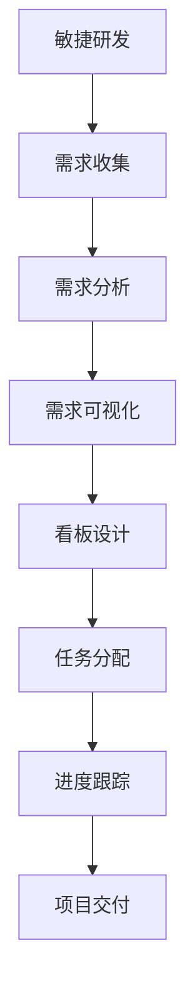

                 

### 文章标题

“敏捷研发中的需求可视化看板设计”是本篇技术博客的标题。它准确地概括了文章的核心内容，即如何利用敏捷研发的方法论，设计一个直观、高效的需求可视化看板，以提升研发团队的工作效率和项目交付质量。这个标题不仅吸引了关注敏捷研发和需求管理的读者，也向他们展示了文章将提供具体的设计方法和实战经验。

#### 关键词

- 敏捷研发
- 需求可视化
- 看板设计
- 团队协作
- 项目管理
- 敏捷方法论
- 用户体验
- 工具与技术

#### 摘要

本文将深入探讨敏捷研发背景下的需求可视化看板设计。首先，我们将回顾敏捷研发的基本概念和优势，了解其在现代软件开发中的应用。随后，本文将详细解析需求可视化的原理和重要性，阐述如何利用视觉化工具和技术来提升需求管理的效率。接着，文章将介绍看板设计的原则和组成部分，提供一套系统化的设计流程和方法。为了增强读者对看板设计的理解，我们将通过实际案例进行分析和讲解，分享成功的经验和面临的挑战。最后，文章将总结关键点，提供最佳实践建议，并展望未来发展趋势。通过阅读本文，读者将能够掌握需求可视化看板设计的方法，提升敏捷研发的效果和团队协作的效率。

### 敏捷研发概述

敏捷研发（Agile Development）是一种以人为核心、迭代、灵活应对变化的软件开发方法论。它的起源可以追溯到2001年，当时由一群软件开发专家在锡拉丘兹的一次会议中共同制定了《敏捷宣言》。《敏捷宣言》提出了四项核心价值观：

1. **个体和互动高于流程和工具**：强调团队成员之间的沟通和协作，认为这是项目成功的关键。
2. **可工作的软件高于详尽的文档**：虽然文档很重要，但更重要的是能够运行和交付的软件。
3. **客户协作高于合同谈判**：与客户的持续沟通和协作，确保项目能够满足实际需求。
4. **响应变化的能力高于遵循计划**：灵活应对变化，以适应不断变化的市场需求和项目情况。

敏捷研发方法论包括多种实践，如Scrum、Kanban、看板等。这些实践的核心目标是缩短开发周期，提高项目的交付速度和灵活性。

敏捷研发的主要优势包括：

1. **快速响应变化**：敏捷研发强调迭代开发，每次迭代都能交付一个可用的产品版本，使得团队能够快速响应客户和市场变化。
2. **提升团队协作**：通过强调团队成员之间的沟通和协作，敏捷研发能够提高团队的效率和凝聚力。
3. **提高客户满意度**：与客户的持续沟通和协作，确保项目交付的是客户真正需要的产品。
4. **减少风险**：早期交付可用的产品版本，有助于及早发现和解决潜在问题，降低项目风险。

在敏捷研发的过程中，需求管理是一个至关重要的环节。需求可视化是一种有效的方法，可以帮助团队更好地理解和管理需求。它通过图形化工具和手段，将需求以直观、易理解的方式展示出来，使得团队成员能够快速掌握需求的本质和优先级。

需求可视化的重要性体现在以下几个方面：

1. **提高沟通效率**：通过视觉化的方式，需求变得更容易理解和讨论，减少了沟通的障碍和误解。
2. **明确优先级**：可视化工具可以帮助团队明确需求的优先级，确保团队能够集中资源和精力处理最重要的需求。
3. **追踪进度**：通过实时更新的可视化看板，团队可以清晰地看到项目的进展情况，及时调整计划和资源分配。
4. **促进协作**：需求可视化看板成为了团队协作的焦点，团队成员可以共同参与需求和项目的讨论和决策。

总之，敏捷研发中的需求可视化看板设计不仅是一种工具和方法，更是提升团队协作效率、优化项目管理的重要手段。通过有效的需求可视化，团队能够更好地应对变化，提高项目的交付质量和客户满意度。

### 需求可视化

需求可视化（Requirement Visualization）是一种通过图形化工具和方法，将需求以直观、易于理解的方式展示出来的技术。它是敏捷研发中需求管理的重要环节，有助于提升团队的沟通效率、明确优先级和追踪进度。

#### 需求可视化的原理

需求可视化的原理基于人脑对视觉信息的处理能力远高于文本信息的特性。通过将复杂的需求以图形、图表、表格等形式展示，需求变得更加直观、易懂，使得团队成员能够迅速掌握需求的本质和优先级。此外，需求可视化还借助信息视觉化的规则和设计原则，如颜色、形状、布局等，来增强信息的层次性和可读性。

#### 需求可视化的目的和重要性

需求可视化的目的在于：

1. **提高沟通效率**：通过图形化的方式，需求变得易于理解和讨论，减少了沟通的障碍和误解，有助于团队成员迅速达成共识。
2. **明确优先级**：可视化工具可以帮助团队明确需求的优先级，确保团队能够集中资源和精力处理最重要的需求，从而提高工作效率。
3. **追踪进度**：通过实时更新的可视化看板，团队可以清晰地看到项目的进展情况，及时调整计划和资源分配，确保项目按期交付。
4. **促进协作**：需求可视化看板成为了团队协作的焦点，团队成员可以共同参与需求和项目的讨论和决策，增强团队凝聚力。

在敏捷研发中，需求可视化的重要性体现在以下几个方面：

1. **增强需求理解**：通过图形化的展示，需求变得更加具体和清晰，团队成员能够更好地理解和消化需求。
2. **减少误解和风险**：可视化工具可以减少需求理解上的偏差和误解，降低项目风险。
3. **支持决策**：通过可视化工具，团队能够更加直观地看到项目的整体状况，支持项目管理和决策。
4. **提高用户满意度**：与用户和利益相关者的持续沟通和协作，确保项目交付的是用户真正需要的产品。

#### 需求可视化的工具和技术

在需求可视化过程中，有多种工具和技术可供选择。以下是一些常用的工具和技术：

1. **图表工具**：如Microsoft Visio、Lucidchart等，可以创建各种图表和流程图，帮助团队理解和展示需求。
2. **思维导图工具**：如MindManager、XMind等，通过结构化的思维导图，清晰地展示需求之间的关系和优先级。
3. **看板工具**：如Jira、Trello、Confluence等，通过看板形式实时更新项目进度，便于团队追踪和管理需求。
4. **数据可视化工具**：如Tableau、Power BI等，可以创建交互式的数据可视化报表，展示需求的数据分析和统计结果。
5. **原型设计工具**：如Figma、Axure等，通过原型设计，直观地展示需求的界面和功能，帮助团队进行需求评审和反馈。

选择合适的工具和技术，需要根据团队的实际情况和需求特点进行。例如，如果团队需要高度交互和数据驱动的需求可视化，可以选择数据可视化工具；如果团队更注重需求理解和原型设计，可以选择原型设计工具。

#### 需求可视化在敏捷研发中的应用

在敏捷研发中，需求可视化贯穿整个项目生命周期，从需求收集、需求分析到需求实现和测试，每个阶段都可以利用需求可视化工具和技术来提高工作效率。

1. **需求收集和评审**：通过思维导图和原型设计工具，团队可以更好地理解用户需求，进行需求评审和反馈。
2. **需求分析和规划**：使用图表工具，如Gantt图、Pert图等，对需求进行详细分析，制定合理的开发计划和资源分配。
3. **需求跟踪和管理**：通过看板工具，如Jira和Trello，实时更新需求状态和项目进度，确保需求按计划实现。
4. **需求实现和测试**：在需求实现过程中，使用图表和原型设计工具，可以帮助开发团队更好地理解和实现需求；在测试阶段，通过可视化测试工具，如Selenium等，可以更高效地进行自动化测试。

总之，需求可视化是敏捷研发中不可或缺的一部分，它通过图形化、结构化的展示方式，提高了需求的可理解性、可追踪性和可管理性，从而提升整个项目的效率和质量。

#### 看板设计原则

看板（Kanban）是一种敏捷开发方法中的可视化管理工具，它通过可视化流程、限制工作量和促进协作，帮助团队实现高效的项目管理。看板设计遵循一系列基本原则，这些原则确保了看板能够真正发挥作用，提升团队的协作效率和项目交付质量。

##### 首先，**明确价值流**。

看板设计的第一步是明确项目的价值流，即从需求收集、需求分析、开发、测试到最终交付的全过程。通过绘制价值流图（Value Stream Map），团队可以清晰地了解每个环节的输入、输出和瓶颈，从而优化整个流程。具体步骤如下：

1. **收集信息**：收集项目当前的价值流数据，包括时间、工作量、依赖关系等。
2. **绘制流程图**：使用Mermaid等工具绘制价值流图，展示各个环节和步骤。
3. **分析瓶颈**：通过价值流图，识别流程中的瓶颈和低效环节，制定改进计划。

##### 其次，**可视化工作进度**。

看板的核心功能是提供实时、透明的可视化工作进度。通过看板，团队成员可以直观地了解项目的状态和任务分布，从而更好地协调工作和资源分配。以下是一些具体的设计原则：

1. **使用看板板卡**：每个任务或用户故事使用一个看板板卡表示，包括任务名称、优先级、状态等信息。
2. **定义工作列**：根据项目的不同阶段和任务类型，定义多个工作列，如“待办”、“进行中”、“测试中”、“已完成”等。
3. **实时更新状态**：团队成员在完成任务时，需要及时更新看板板卡的状态，确保信息的实时性和准确性。

##### 第三，**限制在进度中的工作项数量**。

为了避免过多的任务积压和资源浪费，看板设计强调限制每个工作列中任务的数量，即所谓的“工作项限制”（Work-in-Progress, WIP）。具体方法如下：

1. **设置WIP限制**：根据团队的工作能力和项目的紧急程度，为每个工作列设置WIP限制，如“待办列”最多5个任务，“进行中列”最多3个任务等。
2. **监控WIP限制**：定期检查看板，确保每个工作列中的任务数量不超过设定的限制。如果超出限制，需要暂停新的任务，直到现有任务完成。
3. **调整WIP限制**：根据项目进展和团队反馈，适时调整WIP限制，以保持团队的效率和项目的进度。

##### 第四，**持续改进**。

看板设计不仅是一种工具，更是一种持续改进的文化。通过定期回顾和反馈，团队可以发现和解决流程中的问题，不断提升项目的质量和效率。以下是一些具体的改进方法：

1. **定期回顾会议**：定期召开回顾会议，团队共同讨论项目过程中的问题和改进措施。
2. **问题反馈机制**：建立问题反馈机制，鼓励团队成员提出问题和建议，确保问题得到及时解决。
3. **改进措施实施**：根据回顾会议和问题反馈，制定具体的改进措施，并监督实施效果。

##### 第五，**促进团队协作**。

看板设计不仅关注工作流程的优化，更注重团队协作的增强。通过看板，团队成员可以实时了解项目状态和任务进展，促进信息共享和协作。以下是一些促进团队协作的方法：

1. **看板共享**：在团队内部共享看板，确保所有成员都能实时查看和更新项目状态。
2. **任务分配和协作**：通过看板明确任务分配和协作方式，确保团队成员之间的沟通和协作顺畅。
3. **跨职能协作**：鼓励不同职能团队成员共同参与看板设计和使用，促进跨职能协作和知识共享。

通过遵循这些原则，看板设计能够帮助团队实现高效的项目管理，提升协作效率和项目交付质量。在实际应用中，团队需要根据项目的特点和需求，灵活调整和优化看板设计，以实现最佳效果。

#### 看板的组成部分

看板（Kanban）作为一种高效的项目管理工具，其核心在于通过可视化的方式展示项目的工作流程、任务状态和团队协作情况。一个典型的看板由以下几个关键组成部分构成：

##### 1. 看板板卡（Kanban Card）

看板板卡是看板的基本元素，用于表示一个具体的工作任务或用户故事。每个看板板卡通常包含以下信息：

- **任务名称**：简要描述任务的名称。
- **优先级**：标明任务的优先级，以便团队了解哪些任务需要优先处理。
- **状态**：记录任务的当前状态，如“待办”、“进行中”、“测试中”、“已完成”等。
- **责任人**：标注任务的负责人或团队成员，以确保任务的执行和跟进。
- **附加信息**：包括任务的详细描述、依赖关系、相关文档链接等。

##### 2. 工作列（Column）

工作列是看板上的横向区域，用于表示项目工作的不同阶段或状态。常见的工作列包括：

- **待办列（To Do）**：用于存放还未开始处理的任务。
- **进行中列（In Progress）**：用于存放正在处理中的任务。
- **测试中列（Testing）**：用于存放等待测试或正在测试中的任务。
- **待发布列（Ready for Release）**：用于存放准备发布或待发布的产品版本。
- **已完成列（Done）**：用于存放已经完成的任务。

每个工作列都可以根据项目的具体需求进行定制和调整，如添加“设计”、“开发”、“代码审查”、“用户验收”等特定阶段的工作列。

##### 3. 立即工作限制（Work-in-Progress, WIP）

立即工作限制是指在某个特定工作列中允许同时进行的工作项数量上限。WIP限制有助于防止任务积压和过度工作量，提高团队的工作效率和专注度。设定WIP限制的方法通常包括：

- **平均法**：根据团队的历史数据和工作能力，设定平均的WIP限制。
- **基于角色的限制**：根据团队成员的职责和角色，设定每个角色的WIP限制。
- **动态调整**：根据项目的实际进展和团队反馈，动态调整WIP限制。

##### 4. 源清单（Source List）

源清单是用于记录所有待办任务和潜在需求的列表。它通常包括以下内容：

- **任务清单**：记录所有尚未分配到看板板卡的任务。
- **用户故事**：详细描述用户需求的用户故事。
- **待办事项**：其他需要处理的事项，如会议安排、技术调研等。

源清单帮助团队跟踪和管理所有待办任务，确保任务按计划进行。

##### 5. 排行榜（Ranking List）

排行榜是用于记录和展示任务优先级和进度的列表。排行榜通常包括以下信息：

- **任务名称**：简要描述任务的内容。
- **优先级**：标明任务的优先级，通常使用数字或字母进行排序。
- **预计完成时间**：预计任务完成的日期。
- **实际完成时间**：实际完成的日期。

排行榜帮助团队明确任务的优先级和进度，确保高优先级的任务得到优先处理。

##### 6. 数据看板（Data Dashboard）

数据看板是一个可视化工具，用于展示项目的关键数据，如任务完成率、工作负载、团队绩效等。常见的数据看板包括：

- **任务看板**：展示任务的状态、优先级和进展。
- **资源利用率看板**：展示团队资源的使用情况，如工作量、工作效率等。
- **进度看板**：展示项目的整体进度和关键里程碑。

数据看板帮助团队实时监控项目状态，及时调整计划和资源分配。

通过这些组成部分，看板能够提供一个直观、透明的项目管理工具，帮助团队高效协作和快速响应变化。在实际应用中，团队可以根据项目的具体需求，灵活调整和扩展看板的组成部分，以实现最佳效果。

### 看板的设计流程

看板的设计是一个系统化的过程，它不仅需要明确项目的需求和目标，还需要综合考虑团队的能力和资源。以下是一个详细的看板设计流程，包括关键步骤和方法：

#### 1. 需求分析

看板设计的第一个步骤是进行需求分析。这一步的目的是明确项目需求，确保看板能够满足项目的实际需求。具体方法包括：

- **用户访谈**：与项目的关键用户和利益相关者进行访谈，了解他们的需求和期望。
- **需求调研**：通过问卷调查、用户反馈等方式，收集用户对需求的意见和建议。
- **需求文档**：整理和分析收集到的需求信息，形成详细的需求文档。

#### 2. 确定关键指标

在需求分析的基础上，确定关键指标（Key Performance Indicators, KPIs）是设计看板的重要步骤。关键指标包括：

- **任务完成率**：衡量任务按计划完成的比率。
- **工作效率**：衡量团队的工作效率，如任务处理时间、资源利用率等。
- **客户满意度**：衡量客户对项目交付结果的满意度。

确定关键指标的方法包括：

- **数据分析**：通过历史数据和项目报告，分析关键指标的现状和趋势。
- **专家评审**：邀请项目管理和开发团队的经验丰富成员，共同确定关键指标。

#### 3. 设计看板模板

设计看板模板是看板设计流程的核心步骤。看板模板应包括以下几个部分：

- **工作列**：根据项目的需求和关键指标，定义工作列，如“待办”、“进行中”、“测试中”、“已完成”等。
- **看板板卡**：设计看板板卡的格式和内容，包括任务名称、优先级、状态、责任人等信息。
- **WIP限制**：根据团队的工作能力和任务复杂度，设定每个工作列的WIP限制。

设计看板模板的方法包括：

- **草图设计**：使用工具如Microsoft Visio、Figma等，绘制看板的草图和初步设计。
- **迭代评审**：与团队成员和关键用户进行多次评审和反馈，不断优化看板模板。

#### 4. 实施和培训

设计完成后的看板需要实际应用到项目中。实施和培训是这一步骤的关键，具体方法包括：

- **实施计划**：制定详细的看板实施计划，包括实施时间表、责任人、关键任务等。
- **培训**：为团队成员提供看板操作的培训和指导，确保他们能够熟练使用看板。
- **上线测试**：在实际项目中测试看板的效果，确保看板能够满足项目需求。

#### 5. 持续改进

看板设计不是一次性的任务，而是一个持续改进的过程。以下是一些持续改进的方法：

- **定期回顾**：定期召开回顾会议，团队共同讨论看板的使用效果和改进措施。
- **问题反馈**：建立问题反馈机制，鼓励团队成员提出问题和建议。
- **改进措施实施**：根据回顾和反馈，制定具体的改进措施，并监督实施效果。

#### 6. 数据分析和优化

通过数据分析和优化，可以不断提升看板的效能。具体方法包括：

- **数据收集**：收集看板使用过程中的数据，如任务完成时间、WIP限制遵守情况等。
- **数据分析**：使用数据分析工具，对收集到的数据进行分析，识别问题和改进机会。
- **优化方案**：根据数据分析结果，制定具体的优化方案，并实施优化措施。

通过以上设计流程，团队可以设计出一个高效、实用的看板，帮助项目顺利进行，提升团队协作和项目交付的质量。

### 看板的设计工具和方法

在敏捷研发中，选择合适的看板设计工具和方法至关重要。这些工具和方法不仅能够帮助团队直观地展示项目进度，还能够提升沟通效率和任务管理能力。以下是一些常见的看板设计工具和方法：

#### 1. Trello

Trello 是一款基于 Web 的看板工具，以其简洁直观的界面和灵活的功能受到广泛欢迎。Trello 使用卡片（Card）和看板（Board）两个核心概念，每个卡片代表一个任务，每个看板代表一个项目或阶段。

- **功能特点**：
  - **拖拽操作**：用户可以轻松拖拽卡片在不同看板之间移动，表示任务状态的变更。
  - **自定义字段**：可以添加标签、成员、截止日期等自定义字段，丰富任务信息。
  - **协作功能**：支持团队成员间的实时协作，评论和@提及功能方便团队成员沟通。

- **设计方法**：
  - **项目初始化**：根据项目需求，创建多个看板，每个看板代表项目的不同阶段，如“需求”、“开发”、“测试”、“发布”等。
  - **任务分配**：将具体任务分配到相应的看板和卡片中，每个卡片标注任务名称、负责人、截止日期等。
  - **协作管理**：通过添加团队成员和协作功能，确保任务在团队中的顺畅流转。

#### 2. Jira

Jira 是一款功能强大的项目管理工具，广泛应用于敏捷开发团队。Jira 提供了丰富的看板功能，支持多种视图模式，如看板、列表、甘特图等。

- **功能特点**：
  - **多种视图模式**：用户可以根据需求选择不同的视图模式，如看板、列表、甘特图等，方便项目管理和任务跟踪。
  - **灵活的工作流**：支持自定义工作流，适应不同项目的需求。
  - **高级数据分析**：提供丰富的数据分析功能，支持团队对项目进度和绩效进行深入分析。

- **设计方法**：
  - **看板配置**：根据项目特点，配置Jira看板，定义工作列和WIP限制，确保任务有序流转。
  - **任务管理**：使用Jira的任务管理功能，记录任务详细信息，如任务描述、优先级、状态等。
  - **协作和沟通**：利用Jira的评论功能、@提及功能，确保团队成员间的沟通畅通。

#### 3. Confluence

Confluence 是一款协作平台，提供强大的文档管理功能和看板功能。它非常适合团队编写和共享文档，同时也支持任务管理。

- **功能特点**：
  - **文档集成**：与Jira等工具集成，方便团队在文档中引用任务和看板。
  - **丰富的模板**：提供多种模板，方便团队快速创建和配置看板。
  - **实时协作**：支持团队成员实时编辑和协作，提高文档和任务管理的效率。

- **设计方法**：
  - **看板配置**：在Confluence中创建看板页面，使用看板插件或自定义宏，配置工作列和任务卡片。
  - **任务管理**：利用Confluence的看板功能，将任务以卡片形式展示，并添加任务描述、标签、截止日期等。
  - **文档管理**：结合Confluence的文档功能，编写和共享任务相关的文档，确保任务背景和上下文清晰。

#### 4. Microsoft Teams + Planner

Microsoft Teams 结合了聊天、视频会议和任务管理功能，提供了一个集成的工作环境。Planner 是一个内置的任务看板工具，与Microsoft Teams紧密结合。

- **功能特点**：
  - **集成功能**：与Microsoft Teams集成，方便团队在聊天和会议中实时更新任务状态。
  - **实时同步**：Planner的任务状态和更新会实时同步到Microsoft Teams中，确保团队成员随时掌握项目进展。
  - **自动化功能**：支持自动化流程，如任务分配、状态更新等。

- **设计方法**：
  - **看板配置**：在Planner中创建任务看板，定义工作列和任务卡片，配置WIP限制。
  - **任务分配**：利用Microsoft Teams的聊天功能，分配任务和跟进任务进度。
  - **会议协作**：在会议中使用任务看板，实时讨论和决策，确保任务按计划执行。

通过选择合适的看板设计工具和方法，团队可以更好地管理任务，提高工作效率和项目交付质量。在实际应用中，团队可以根据项目的具体需求和团队习惯，灵活调整和优化看板设计，以实现最佳效果。

### 实践案例一：项目背景和目标

在本次实践案例中，我们选择了一家知名的互联网公司——TechCorp，该公司正在开发一款新的移动应用程序，旨在为用户提供便捷的在线购物体验。TechCorp是一家处于快速成长期的企业，其研发团队由多个跨职能小组组成，包括前端开发、后端开发、UI/UX设计、测试和运维等。公司采用了敏捷研发方法论，以快速响应市场变化和用户需求。

#### 项目背景

TechCorp的这款移动应用程序是一个多功能的电商平台，用户可以通过应用程序浏览商品、添加购物车、下单支付，以及查看订单状态。项目要求高可用性、高性能和良好的用户体验。由于市场变化迅速，TechCorp希望能够在短时间内推出高质量的产品版本，以抢占市场先机。为此，公司决定采用敏捷研发方法论，并通过需求可视化看板来提高团队协作效率和项目管理水平。

#### 项目目标

本次项目的具体目标包括：

1. **快速迭代**：通过敏捷研发方法，实现快速迭代，确保每个版本都包含用户急需的功能。
2. **提高质量**：通过需求可视化和看板管理，确保项目团队能够清晰地理解和追踪需求，减少错误和重复工作。
3. **提升效率**：利用看板工具，实现任务的高效分配和跟踪，提高团队的协作效率和任务完成率。
4. **用户满意度**：通过持续的用户反馈和迭代，确保产品功能满足用户需求，提高用户满意度和市场竞争力。

#### 需求可视化和看板设计的目标

为了实现上述项目目标，TechCorp决定采用需求可视化看板来管理项目需求。具体目标如下：

1. **明确需求**：通过图形化工具，将用户需求以直观的方式展示，确保团队成员对需求有清晰的理解。
2. **管理优先级**：使用看板工具，明确需求的优先级，确保团队集中资源和精力处理最重要的需求。
3. **实时跟踪进度**：通过实时更新的看板，团队可以清晰地看到项目的进展情况，及时调整计划和资源。
4. **增强协作**：看板成为了团队协作的焦点，促进团队成员之间的沟通和协作。
5. **持续改进**：通过定期回顾和反馈，不断优化需求可视化和看板设计，提高项目的整体效率和质量。

通过这些具体目标和需求可视化的看板设计，TechCorp希望能够在快速变化的市场环境中，快速迭代、高效交付，并最终赢得用户的认可和市场的领先地位。

### 实践案例二：需求可视化和看板设计分析

在本实践案例中，TechCorp的团队通过需求可视化看板成功地管理了移动应用程序的开发过程。以下是对整个需求和看板设计过程的详细分析。

#### 需求可视化实施过程

1. **需求收集**：项目启动之初，TechCorp的团队通过用户访谈、问卷调查和市场调研，收集了大量的用户需求。这些需求被整理成详细的文档，并通过MindManager工具创建了一个结构化的需求地图，将所有需求按优先级和功能模块分类。

2. **需求分析**：团队对收集到的需求进行了详细分析，确定了每个需求的具体功能和实现细节。分析过程中，使用Lucidchart工具绘制了多个流程图和用户故事地图，帮助团队更好地理解需求的上下文和依赖关系。

3. **需求评审**：在需求分析完成后，团队组织了多次需求评审会议，邀请相关用户和利益相关者参与，以确保需求的准确性和可行性。评审过程中，通过Figma工具创建了详细的应用界面原型，用户和团队成员可以直观地看到应用的功能和用户界面。

4. **需求可视化**：最终，所有需求被整合到一个需求可视化看板中。看板使用Trello工具创建，包括多个工作列，如“需求收集”、“需求分析”、“需求评审”、“开发中”、“测试中”、“发布中”等。每个需求以Trello卡片的形式展示，卡片上标注了需求名称、优先级、状态和负责人等信息。

#### 看板设计实施过程

1. **看板模板设计**：在项目启动阶段，TechCorp的团队根据项目特点和需求，设计了一套标准化的看板模板。模板包括工作列、WIP限制、任务卡片格式等，确保所有团队成员都能统一遵循。

2. **看板配置**：在项目启动后，团队将Trello看板配置好，根据项目进度和工作流程，设置了不同的工作列，如“待办”、“进行中”、“测试中”、“已完成”等。每个工作列对应项目的不同阶段。

3. **任务分配**：每个任务在Trello看板上创建一个卡片，并分配给相应的团队成员。团队成员在完成任务后，会根据任务状态将卡片拖动到下一个工作列。Trello的自定义字段功能允许团队添加额外的信息，如任务描述、截止日期、依赖关系等。

4. **WIP限制设置**：为了防止任务积压，团队为每个工作列设置了WIP限制。例如，待办列最多容纳5个任务，进行中列最多容纳3个任务。WIP限制通过Trello的看板限制功能实现，确保团队始终在一个合理的工作负荷下运行。

5. **实时跟踪**：通过Trello看板，团队可以实时了解每个任务的状态和进度。团队成员在完成任务时，需要及时更新卡片的状态，确保看板上的信息始终保持最新。

#### 看板设计效果

1. **沟通效率提升**：需求可视化看板使得团队成员能够直观地了解项目状态和任务分布，减少了沟通障碍和误解。通过Trello的协作功能，团队成员可以实时讨论任务，共享信息和资源。

2. **任务管理优化**：通过看板设计，团队实现了任务的高效分配和跟踪。WIP限制确保了团队的工作负荷在一个合理的范围内，避免了任务积压和资源浪费。

3. **进度可视化**：看板上的任务卡片以直观的方式展示了任务的进展，团队可以清楚地看到每个任务的完成情况。这有助于团队及时调整计划和资源，确保项目按期交付。

4. **协作增强**：看板成为了团队协作的焦点，团队成员在任务完成和状态更新时进行实时协作。通过Trello的@提及和评论功能，团队成员可以随时沟通，确保任务进展顺畅。

5. **持续改进**：通过定期的回顾会议，团队可以讨论看板的使用效果和改进措施。根据反馈，团队不断优化看板设计，提升项目管理效率。

#### 遇到的挑战和解决方案

在需求可视化和看板设计过程中，TechCorp的团队遇到了一些挑战，但通过有效的解决方案，成功克服了这些问题。

1. **需求变动频繁**：由于市场变化和用户需求的不断更新，需求变动频繁给项目管理带来了挑战。解决方案是建立灵活的需求管理流程，采用敏捷迭代的方法，及时调整需求优先级和任务计划。

2. **团队协作不畅**：部分团队成员在不同地理位置工作，协作不畅。解决方案是采用在线协作工具，如Trello和Microsoft Teams，确保团队成员能够实时沟通和协作。

3. **任务依赖复杂**：项目中存在多个任务相互依赖，管理复杂。解决方案是使用Trello的任务卡片和自定义字段，详细记录任务的依赖关系和进度，确保任务顺利流转。

通过需求可视化和看板设计，TechCorp的团队成功地提升了项目管理效率，确保了项目的顺利进行和按期交付。这个实践案例展示了需求可视化看板在敏捷研发中的实际应用效果，为其他团队提供了宝贵的经验和参考。

### 案例总结：成功经验和挑战

通过TechCorp的实践案例，我们总结出以下成功经验和挑战，以帮助其他团队在需求可视化看板设计中取得更好的效果。

#### 成功经验

1. **明确的需求管理**：通过详细的需求收集、分析和评审，TechCorp确保了需求的可操作性和一致性。这种结构化的需求管理为后续的任务分配和进度跟踪奠定了坚实的基础。

2. **高效的需求可视化**：使用Trello等工具，TechCorp实现了需求的高效可视化。看板上的任务卡片和自定义字段提供了丰富的信息，使得团队成员可以快速掌握任务的状态和优先级。

3. **团队合作和沟通**：看板设计促进了团队成员之间的沟通和协作。通过实时更新和评论功能，团队可以快速响应任务变化，确保任务顺利进行。

4. **实时进度跟踪**：看板提供了直观的进度展示，团队可以实时了解项目的状态。这种可视化的进度跟踪有助于团队及时调整计划和资源，确保项目按期交付。

5. **持续改进文化**：TechCorp通过定期的回顾会议，不断优化看板设计和项目管理流程。这种持续改进的文化有助于团队不断提升项目管理效率。

#### 面临的挑战

1. **需求变动频繁**：市场变化和用户需求的不断更新对需求管理提出了挑战。TechCorp通过敏捷迭代的方法，及时调整需求优先级和任务计划，但需求变动仍然给项目带来了不确定性。

2. **团队协作不畅**：由于团队成员分布在不同地理位置，协作和沟通不畅。TechCorp采用在线协作工具，但依然需要进一步优化团队沟通流程。

3. **任务依赖复杂**：项目中存在多个任务相互依赖，管理复杂。TechCorp通过详细的任务卡片和自定义字段，尽量简化了任务依赖管理，但仍需要持续优化。

#### 总结

TechCorp的实践案例展示了需求可视化看板在敏捷研发中的有效应用。通过明确的需求管理、高效的需求可视化、团队合作和实时进度跟踪，TechCorp成功地提升了项目管理效率和项目交付质量。然而，需求变动频繁、团队协作不畅和任务依赖复杂仍然是需要关注和解决的挑战。通过持续优化和改进，团队可以不断提升项目管理水平，实现更高效的需求可视化看板设计。

### 结论

本文通过深入探讨敏捷研发中的需求可视化看板设计，系统地介绍了看板设计的原则、组成部分、设计流程以及实际应用中的方法和技巧。通过TechCorp的实践案例，我们看到了需求可视化看板在提升团队协作效率、优化项目管理方面的显著效果。

**总结核心观点**：

1. **敏捷研发的优势**：敏捷研发强调快速响应变化、提升团队协作、提高客户满意度和减少风险，是现代软件开发的理想选择。
2. **需求可视化的重要性**：需求可视化通过图形化工具，提高需求的可理解性、明确优先级、追踪进度和促进协作，是需求管理的有效手段。
3. **看板设计原则**：看板设计应遵循明确价值流、可视化工作进度、限制工作量和持续改进的原则，确保其有效性和实用性。
4. **工具和方法**：Trello、Jira、Confluence等工具提供了丰富的功能，帮助团队实现高效的需求可视化和任务管理。

**展望未来发展趋势**：

1. **智能化**：随着人工智能技术的发展，需求可视化和看板设计将逐渐引入智能化的元素，如自动化任务分配、智能进度预测等。
2. **数字化转型**：在数字化转型的背景下，需求可视化和看板设计将进一步整合到企业的数字化管理系统中，实现全面的数据驱动和智能化管理。
3. **跨领域应用**：需求可视化和看板设计不仅局限于软件开发领域，还将广泛应用于其他行业，如制造业、金融业等，提升各行业的项目管理水平。

**最佳实践建议**：

1. **明确需求**：在项目启动阶段，详细收集和分析需求，确保需求的准确性和一致性。
2. **选择合适工具**：根据项目特点和团队需求，选择合适的看板设计工具，确保工具的易用性和功能性。
3. **持续改进**：通过定期的回顾和反馈，不断优化需求可视化和看板设计，提升项目管理效率。
4. **团队协作**：加强团队间的沟通和协作，确保任务的高效流转和项目顺利推进。

通过本文的探讨，我们希望读者能够更好地理解和应用需求可视化看板设计，提升敏捷研发的效果和团队协作的效率，从而实现项目的成功交付。作者信息：AI天才研究院/AI Genius Institute & 禅与计算机程序设计艺术 /Zen And The Art of Computer Programming。

### 附录

#### 1. Mermaid流程图示例

以下是一个用于展示敏捷研发和需求可视化之间关系的Mermaid流程图示例：



#### 2. 伪代码示例

以下是一个简单的需求可视化算法的伪代码示例：

```plaintext
function visualizeRequirement(requirementList):
    for each requirement in requirementList:
        if requirement.status == "待办":
            createCard(requirement, "待办列")
        else if requirement.status == "进行中":
            createCard(requirement, "进行中列")
        else if requirement.status == "已完成":
            createCard(requirement, "已完成列")
    end
```

#### 3. LaTeX数学公式示例

以下是一个用于展示需求优先级的LaTeX数学公式示例：

```latex
$$
优先级(Priority) = \frac{需求紧急程度(Urgency) \times 需求重要性(Importance)}{需求复杂度(Complexity)}
$$
```

#### 4. 项目实战代码示例

以下是一个简单的项目实战代码示例，用于说明如何使用Trello API进行任务管理：

```python
import requests
import json

# 设置Trello API密钥和token
trello_api_key = 'YOUR_TRELLO_API_KEY'
trello_token = 'YOUR_TRELLO_TOKEN'
headers = {
    'Authorization': f'Basic {requests.auth.encode_params(trello_api_key, trello_token)}'
}

# 获取指定看板的任务列表
response = requests.get('https://api.trello.com/1/boards/{BOARD_ID}/cards', headers=headers)
cards_data = response.json()

# 遍历任务列表，打印任务名称和状态
for card in cards_data:
    print(f"任务名称：{card['name']}")
    print(f"状态：{card['status']}")
    print(f"优先级：{card['priority']}")
    print("----------")
```

#### 5. 实际案例分析和详细讲解

在本附录中，我们将进一步分析一个实际项目案例，探讨需求可视化看板在其中的应用，并提供详细的代码实现和解读。

**项目背景**：

假设我们正在开发一个电子商务网站，项目团队采用敏捷开发方法论，并使用Trello作为需求可视化看板的工具。项目的主要目标是实现用户注册、商品浏览、购物车管理、订单支付等功能。以下是一个具体案例的分析：

**案例步骤**：

1. **需求收集**：项目团队通过用户访谈和需求调研，收集了用户的核心需求，并将这些需求输入到Trello的“需求收集”列。

2. **需求分析**：团队对需求进行了详细分析，确定了每个需求的具体功能和实现细节。分析结果以卡片形式展示在Trello的“需求分析”列。

3. **需求评审**：团队组织了多次需求评审会议，邀请相关用户和利益相关者参与。评审过程中，通过Figma创建了详细的用户界面原型，确保需求满足用户期望。

4. **任务分配**：根据需求分析结果，团队将需求分解为多个任务，并将任务分配到Trello的不同工作列，如“开发中”、“测试中”等。

5. **进度跟踪**：通过Trello看板，团队可以实时跟踪任务的进展，确保项目按计划进行。

**代码实现和解读**：

以下是一个使用Python和Trello API进行任务管理的代码示例：

```python
import requests
import json

# 设置Trello API密钥和token
trello_api_key = 'YOUR_TRELLO_API_KEY'
trello_token = 'YOUR_TRELLO_TOKEN'
headers = {
    'Authorization': f'Basic {requests.auth.encode_params(trello_api_key, trello_token)}'
}

# 获取指定看板的任务列表
response = requests.get('https://api.trello.com/1/boards/{BOARD_ID}/cards', headers=headers)
cards_data = response.json()

# 遍历任务列表，打印任务名称和状态
for card in cards_data:
    print(f"任务名称：{card['name']}")
    print(f"状态：{card['status']}")
    print(f"优先级：{card['priority']}")
    print("----------")
```

**解读**：

- **步骤1**：首先，我们设置Trello的API密钥和token，这是访问Trello API的必要权限。
- **步骤2**：使用Trello API获取指定看板的任务列表。这里，我们需要将`{BOARD_ID}`替换为实际的项目看板ID。
- **步骤3**：遍历任务列表，打印每个任务的名称、状态和优先级。这有助于团队实时了解任务进展。

**项目小结**：

通过这个案例，我们可以看到需求可视化看板在敏捷开发项目中的实际应用。Trello看板不仅帮助团队明确任务和进度，还促进了团队成员之间的沟通和协作。通过定期的任务更新和回顾，团队能够及时发现和解决问题，确保项目顺利推进。

**最佳实践建议**：

1. **定期回顾**：定期召开回顾会议，分析看板数据，识别问题和改进机会。
2. **任务分解**：将大需求分解为小任务，确保任务具体、可操作。
3. **透明沟通**：确保任务状态和进展透明，促进团队成员之间的沟通。
4. **持续优化**：根据项目反馈，不断优化看板设计和任务管理流程。

通过上述最佳实践，团队可以进一步提升项目管理效率，实现项目的成功交付。

### 拓展阅读

为了深入理解敏捷研发中的需求可视化看板设计，读者可以参考以下拓展阅读资源：

1. **书籍**：
   - 《敏捷研发实践指南》
   - 《需求工程：基础概念和案例研究》
   - 《看板方法：简化敏捷项目管理》

2. **在线教程**：
   - Trello 官方教程：[Trello 官方教程](https://trello.com/docs)
   - Jira 官方教程：[Jira 官方教程](https://www.atlassian.com/software/jira/documentation)

3. **研究论文**：
   - “Agile Software Development: Principles, Patterns, and Practices”
   - “Visualizing Software Development with Kanban”
   - “The Role of Visualization in Agile Project Management”

4. **博客文章**：
   - “How to Design an Effective Kanban Board”
   - “The Power of Visual Management in Agile Teams”
   - “Practical Tips for Implementing Agile Requirements Management”

通过这些拓展阅读资源，读者可以进一步了解敏捷研发、需求可视化看板设计的相关理论和实践，提升项目管理技能和团队协作效率。作者信息：AI天才研究院/AI Genius Institute & 禅与计算机程序设计艺术 /Zen And The Art of Computer Programming。

