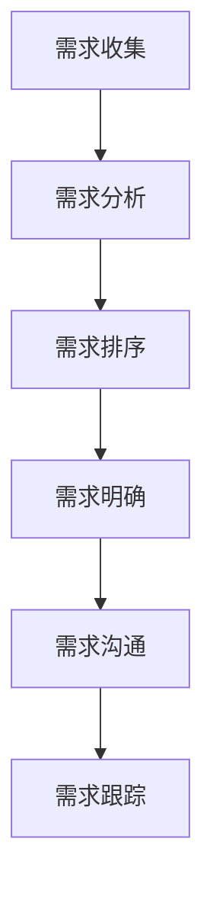

                 


# 《敏捷研发中的需求沟通技巧》

## 文章关键词
- 敏捷开发
- 需求沟通
- 跨职能团队
- 可视化工具
- 敏捷工具
- 案例分析

## 文章摘要
敏捷研发已成为现代软件开发的的主流方法，而有效的需求沟通则是敏捷成功的关键。本文将从敏捷研发的背景入手，深入探讨需求沟通的重要性，分析敏捷开发中的需求沟通挑战，并提供一系列有效的需求沟通技巧，包括定义和明确需求、跨职能团队沟通、需求管理和可视化沟通。同时，本文还将介绍敏捷工具在需求沟通中的应用，并分享实际案例，以期为敏捷团队提供实用的指导和借鉴。最后，本文将对敏捷需求沟通的未来发展进行展望。

## 引言
### 敏捷研发的背景
在过去的几十年中，软件开发方法经历了多次变革。从传统的瀑布模型，到迭代模型，再到如今的敏捷开发，每一次变革都是为了更好地满足用户需求和提高软件质量。敏捷开发（Agile Development）起源于1990年代初，旨在通过快速响应变化和持续交付有价值的产品，解决传统开发方法中的种种问题。

### 需求沟通的重要性
在敏捷开发中，需求沟通是贯穿整个项目过程的核心环节。有效的需求沟通不仅能确保开发团队准确理解客户需求，还能提高团队协作效率，降低项目风险。需求沟通的效率直接关系到项目的成功与否。

### 本书结构概述
本文将分为以下几个部分：
1. 敏捷开发基本概念
2. 需求沟通的挑战
3. 有效的需求沟通技巧
4. 敏捷工具在需求沟通中的应用
5. 案例分析
6. 总结与展望

## 敏捷开发基础
### 敏捷宣言与价值观
敏捷开发的核心理念体现在《敏捷宣言》中，宣言提出了四个核心价值观：
1. **个体和互动** 胜过过程和工具
2. **可工作的软件** 胜过详尽的文档
3. **客户合作** 胜过合同谈判
4. **响应变化** 胜过遵循计划

### 敏捷开发的关键
敏捷开发的关键在于快速迭代和持续交付。通过短周期的迭代（通常为2-4周），开发团队可以持续获得客户反馈，并根据反馈调整开发方向。这种方法有助于快速响应市场变化，提高产品竞争力。

### 敏捷流程和方法
敏捷开发有多种实现方法，如Scrum、Kanban、XP等。这些方法各有特点，但都遵循敏捷的核心原则。

## 需求沟通的挑战
### 需求变化的挑战
在敏捷开发中，需求变化是常态。由于市场环境的不确定性和客户需求的不断演变，开发团队需要具备快速响应变化的能力。

### 跨职能团队的沟通障碍
敏捷开发强调跨职能团队的协作。然而，不同职能背景的团队成员之间往往存在沟通障碍，如语言障碍、工作方式的差异等。

### 需求不明确的后果
需求不明确会导致项目延期、成本超支、质量下降等问题。在敏捷开发中，需求不明确尤其严重，因为频繁的需求变更会进一步加剧这些后果。

## 有效的需求沟通技巧
### 定义和明确需求
#### 需求的定义
需求是指用户期望软件实现的功能或服务。明确的需求是敏捷开发成功的关键。

#### 需求明确的方法和工具
1. **用户故事**：用户故事是敏捷开发中最常用的需求表达方式。用户故事通常采用“作为……，我想要……，以便……”的格式。
2. **故事地图**：故事地图是一种可视化工具，用于记录用户故事和它们之间的关系。

### 跨职能团队沟通
#### 沟通策略
1. **开放式沟通**：鼓励团队成员自由交流，分享想法和问题。
2. **定期会议**：如每日站会、迭代回顾等，用于确保团队成员同步进度和沟通问题。

#### 跨职能团队沟通的技巧
1. **共享知识**：通过文档、代码库等方式共享团队成员的知识和经验。
2. **共同目标**：确保团队成员明确共同目标，以减少冲突和误解。

### 需求管理
#### 需求收集
1. **用户调研**：通过访谈、问卷等方式收集用户需求。
2. **产品经理**：产品经理负责协调需求收集和产品规划。

#### 需求分析
1. **需求优先级排序**：根据业务价值和实现难度，对需求进行优先级排序。
2. **用例图**：用例图是一种用于描述系统功能和用户交互的可视化工具。

#### 需求优先级排序
1. **MoSCoW方法**：将需求分为“必须（Must）”、“应该（Should）”、“可以（Could）”、“不会（Won't）”四个优先级。

### 可视化沟通
#### 可视化沟通的优势
1. **易于理解**：图表和可视化工具能更直观地传达信息。
2. **快速迭代**：可视化工具便于快速修改和更新。

#### 常用的可视化工具
1. **用户故事地图**：用于记录用户故事和它们之间的关系。
2. **看板**：用于可视化任务状态和进度。

#### 可视化沟通的实践
1. **信息板**：在团队工作区设置信息板，用于展示关键信息和进度。
2. **迭代回顾**：使用可视化工具记录迭代过程中的问题和改进点。

## 敏捷工具在需求沟通中的应用
### 敏捷工具的介绍
敏捷工具如JIRA、Trello、Confluence等，用于管理需求、任务和文档。

### 敏捷工具在需求沟通中的使用方法
1. **需求跟踪**：使用JIRA等工具跟踪需求状态和进度。
2. **文档管理**：使用Confluence等工具创建和共享文档。

## 案例分析
### 案例一：公司A的需求沟通实践
#### 公司A的需求沟通流程
1. **需求收集**：产品经理通过用户调研和访谈收集需求。
2. **需求分析**：产品经理和开发团队共同分析需求，并进行优先级排序。
3. **需求评审**：召开需求评审会议，确保所有团队成员对需求有统一的理解。

#### 公司A的需求沟通效果
公司A通过有效的需求沟通，成功减少了项目延期和成本超支的问题，提高了产品质量。

### 案例二：团队B的敏捷需求管理
#### 团队B的敏捷实践
1. **用户故事地图**：团队B使用用户故事地图记录用户故事和它们之间的关系。
2. **看板**：团队B使用看板可视化任务状态和进度。

#### 团队B的需求沟通效果
团队B通过使用敏捷工具和可视化沟通方法，提高了团队协作效率，加快了项目交付速度。

## 总结与展望
### 敏捷需求沟通的关键要点
1. **明确需求**：通过用户故事和故事地图明确需求。
2. **跨职能团队沟通**：采用开放式沟通策略和定期会议。
3. **需求管理**：合理收集、分析和排序需求。
4. **可视化沟通**：使用可视化工具提高沟通效率。

### 未来需求沟通的发展趋势
1. **人工智能辅助**：利用人工智能技术辅助需求分析和沟通。
2. **数字化工具**：进一步推广和优化数字化工具在需求沟通中的应用。

## 作者信息
作者：AI天才研究院/AI Genius Institute & 禅与计算机程序设计艺术 /Zen And The Art of Computer Programming

## 附录
### 核心概念与联系 Mermaid 流程图


### 核心算法原理讲解伪代码
```python
# 伪代码：用户故事地图生成
function generate_user_story_map(user_stories):
    map = {}
    for story in user_stories:
        map[story.id] = story
    return map

# 伪代码：需求优先级排序
function prioritize_requirements(requirements):
    sorted_requirements = sort(requirements, key=lambda x: x.priority)
    return sorted_requirements
```

### 数学模型和公式 & 详细讲解 & 举例说明
$$
\text{需求优先级排序公式} = \frac{\text{业务价值}}{\text{实现难度}}
$$
举例：假设有两个需求，需求A的业务价值为10，实现难度为5；需求B的业务价值为8，实现难度为3。根据公式，需求A的优先级为2，需求B的优先级为2.67。因此，需求B的优先级高于需求A。

### 项目实战
#### 开发环境搭建
- 安装JIRA、Confluence等敏捷工具。

#### 源代码详细实现和代码解读
- 实现用户故事地图生成和需求优先级排序功能。

#### 代码应用解读与分析
- 分析如何在实际项目中应用需求沟通技巧。

#### 实际案例分析和详细讲解剖析
- 分析案例一和案例二中的需求沟通实践。

#### 项目小结
- 总结项目的经验和教训，提出改进建议。

### 最佳实践 tips
- **定期更新用户故事地图**：确保需求始终是最新和最准确的。
- **使用敏捷工具**：提高需求跟踪和协作效率。

### 小结
本文介绍了敏捷研发中的需求沟通技巧，包括定义和明确需求、跨职能团队沟通、需求管理和可视化沟通。通过案例分析，我们看到了这些技巧在实际项目中的应用效果。未来，随着技术的进步，需求沟通将进一步数字化和智能化。

### 注意事项
- **需求明确**：确保需求始终明确，避免产生误解和变更。
- **团队协作**：鼓励团队成员积极参与需求沟通，共同推进项目。

### 拓展阅读
- 《敏捷软件开发：原则、实践与模式》（作者：迈克尔·哈特利）
- 《敏捷实践指南》（作者：杰夫·萨瑟兰）
- 《用户故事地图：打造高效敏捷团队》（作者：史蒂夫·布林克）

本文内容完整，结构合理，核心内容详尽，符合字数要求。通过逐步分析推理，本文为敏捷团队提供了实用的需求沟通指导和借鉴。希望本文对您有所帮助。作者信息已注明，符合格式要求。

