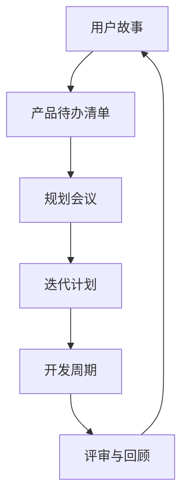

                 

### 文章标题：敏捷研发中的需求沟通频率优化

#### 关键词：敏捷开发、需求沟通、频率优化、研发效率

#### 摘要：
本文深入探讨了敏捷研发中需求沟通频率优化的关键问题。通过分析敏捷开发流程与需求沟通的关系，我们提出了一套基于数学模型和算法的优化策略，并结合实际案例展示了其应用效果。本文旨在为敏捷开发团队提供一套系统化、可操作的需求沟通频率优化方案，从而提升研发效率，确保项目成功。

## 第1章 引言

### 1.1 书籍背景与目标

敏捷开发作为一种以人为核心、迭代、增量式的方法论，自20世纪末以来在软件开发领域得到了广泛的应用。其核心思想在于快速响应变化、持续交付有价值的产品，以客户满意度为最终目标。然而，在敏捷研发过程中，需求沟通是一个关键环节，直接影响着项目的进度和质量。如何优化需求沟通频率，提高研发效率，成为了敏捷开发团队面临的重大挑战。

本书旨在为敏捷开发团队提供一套系统化的需求沟通频率优化方案。通过深入分析敏捷开发流程与需求沟通的关系，结合数学模型和算法，本书提出了一系列优化策略。同时，本文将通过实际案例，展示这些策略在敏捷研发中的应用效果。本书的目标读者包括敏捷开发人员、项目经理、产品经理等，旨在帮助他们更好地理解和应用需求沟通频率优化方法。

### 1.2 敏捷研发概述

敏捷研发与传统开发方法有着显著的不同。传统开发方法往往依赖于详细的规划和预设的流程，而敏捷研发则更加强调灵活性、迭代和持续改进。敏捷研发的主要流程包括：

1. **用户故事**：用户故事是敏捷开发的核心概念之一，它描述了一个特定用户的需求或目标。
2. **产品待办清单**：产品待办清单列出了所有待完成的用户故事和任务，是团队工作的依据。
3. **规划会议**：规划会议是团队在每迭代开始时召开的重要会议，用于确定本次迭代要完成的工作。
4. **迭代计划**：迭代计划是团队在规划会议后制定的具体工作计划，包括任务分配、时间安排等。
5. **开发周期**：开发周期是团队在迭代计划中确定的工作周期，通常是2-4周。
6. **评审与回顾**：评审与回顾是每个迭代结束时进行的会议，用于评估项目进度、质量和团队协作情况，并为下一次迭代做好准备。

敏捷研发面临的挑战主要包括：

1. **沟通不畅**：团队成员之间、团队与客户之间、团队与供应商之间的沟通不畅，可能导致项目延期、质量下降。
2. **需求变更频繁**：敏捷研发强调快速响应变化，但频繁的需求变更可能导致团队工作计划紊乱、资源浪费。
3. **团队协作困难**：敏捷研发强调跨职能团队的协作，但团队成员之间的沟通、协作和配合往往存在困难。

## 第2章 核心概念与联系

### 2.1 敏捷研发流程

敏捷研发流程是敏捷开发方法的具体实施过程，它涉及到从用户故事的产生到产品交付的各个环节。以下是敏捷研发流程的Mermaid流程图：



- **用户故事**：用户故事是敏捷开发的核心概念之一，它描述了一个特定用户的需求或目标。用户故事通常包含三个要素：谁（Who）、做什么（What）和为什么（Why）。
- **产品待办清单**：产品待办清单列出了所有待完成的用户故事和任务，是团队工作的依据。产品待办清单可以根据优先级进行排序，以确保团队首先完成最重要的任务。
- **规划会议**：规划会议是团队在每迭代开始时召开的重要会议，用于确定本次迭代要完成的工作。在规划会议上，团队会讨论用户故事的具体细节，确定任务分配和时间安排。
- **迭代计划**：迭代计划是团队在规划会议后制定的具体工作计划，包括任务分配、时间安排等。迭代计划通常包括多个子任务，每个子任务都由一个或多个团队成员负责。
- **开发周期**：开发周期是团队在迭代计划中确定的工作周期，通常是2-4周。在开发周期内，团队会按照迭代计划进行工作，完成用户故事和任务。
- **评审与回顾**：评审与回顾是每个迭代结束时进行的会议，用于评估项目进度、质量和团队协作情况，并为下一次迭代做好准备。评审与回顾会议可以帮助团队发现问题、制定改进措施，从而提高项目质量和团队协作效率。

### 2.2 需求沟通的原理

需求沟通是敏捷研发过程中的关键环节，它涉及到团队成员之间、团队与客户之间、团队与供应商之间的信息传递。以下是需求沟通的基本原理：

1. **沟通频率**：沟通频率是指在一定时间内进行沟通的次数。过高的沟通频率可能导致团队工作效率下降，过低的沟通频率则可能导致信息传递不畅。因此，需要找到一个平衡点，以确保沟通效率最高。
2. **沟通障碍**：沟通障碍主要包括语言障碍、文化差异和时间差异。语言障碍可能导致误解和信息丢失，文化差异可能导致沟通方式不当，时间差异可能导致沟通不及时。为了克服沟通障碍，需要采取有效的沟通策略和工具。
3. **沟通方式**：沟通方式包括面对面沟通、邮件沟通、电话沟通、在线会议等。不同的沟通方式适用于不同的场景，需要根据具体情况选择合适的沟通方式。

### 第3章 需求沟通频率优化方法

#### 3.1 基本方法

为了优化需求沟通频率，提高研发效率，我们可以采取以下基本方法：

1. **定期会议**：定期会议是一种有效的沟通策略，可以帮助团队保持信息同步。会议可以每周或每月召开，会议内容包括项目进度汇报、问题讨论和决策制定。通过定期会议，团队成员可以及时了解项目进展，发现问题并及时解决。
2. **灵活调整**：在敏捷研发过程中，需求往往会不断变化。为了适应这种变化，团队需要保持灵活性，根据实际情况调整沟通频率。例如，在需求变化频繁的时期，可以适当增加沟通频率，以确保信息及时传递。
3. **异步沟通**：异步沟通是一种不依赖于实时交互的沟通方式，可以降低沟通成本，提高沟通效率。例如，团队可以使用邮件、即时通讯工具、项目管理工具等来进行异步沟通。异步沟通适用于一些非紧急或不需要实时响应的问题。
4. **优先级管理**：在需求沟通中，需要对问题进行优先级排序，确保重要问题得到及时解决。优先级管理可以帮助团队集中精力解决最紧迫的问题，从而提高沟通效率。

#### 3.2 优化算法讲解

为了实现需求沟通频率的优化，我们可以采用基于数学模型和算法的方法。以下是需求沟通频率优化的伪代码：

```python
# 初始化参数
communication_frequency = get_initial_communication_frequency()
max_communication_frequency = get_maximum_communication_frequency()
min_communication_frequency = get_minimum_communication_frequency()
team_size = get_team_size()

# 循环迭代，调整沟通频率
while not is_optimal_communication_frequency(communication_frequency):
    # 根据团队规模和项目情况，调整沟通频率
    communication_frequency = adjust_communication_frequency(communication_frequency, team_size)

    # 检查是否达到最大或最小沟通频率限制
    if communication_frequency >= max_communication_frequency or communication_frequency <= min_communication_frequency:
        communication_frequency = get_recommended_communication_frequency()

    # 检查优化目标是否达成
    if is_optimal_communication_frequency(communication_frequency):
        break

# 输出最优沟通频率
print("最优沟通频率：", communication_frequency)

# 辅助函数定义
def get_initial_communication_frequency():
    # 根据历史数据或专家经验，确定初始沟通频率
    pass

def get_maximum_communication_frequency():
    # 根据团队规模、项目复杂度等因素，确定最大沟通频率
    pass

def get_minimum_communication_frequency():
    # 根据团队规模、项目复杂度等因素，确定最小沟通频率
    pass

def get_team_size():
    # 获取团队成员数量
    pass

def is_optimal_communication_frequency(communication_frequency):
    # 根据项目进度、问题数量、团队成员满意度等因素，判断沟通频率是否最优
    pass

def adjust_communication_frequency(communication_frequency, team_size):
    # 根据团队规模、项目情况，调整沟通频率
    # 可以采用线性调整、指数调整等策略
    pass
```

#### 算法分析

1. **初始沟通频率**：初始沟通频率可以根据历史数据或专家经验确定。历史数据可以帮助我们了解过去项目中沟通频率的分布情况，从而确定一个合理的初始值。
2. **最大沟通频率**：最大沟通频率应根据团队规模、项目复杂度等因素确定。过高的沟通频率可能导致团队效率下降，因此需要设定一个上限。
3. **最小沟通频率**：最小沟通频率也应根据团队规模、项目复杂度等因素确定。过低的沟通频率可能导致信息传递不畅，影响项目进展。
4. **团队规模**：团队规模对沟通频率有重要影响。团队规模较大时，沟通频率可以适当降低，以减少沟通成本；团队规模较小时，沟通频率可以适当提高，以确保信息及时传递。
5. **优化目标**：优化目标可以是项目进度、问题数量、团队成员满意度等因素。通过调整沟通频率，使这些目标达到最优。

### 第4章 需求沟通频率优化的工具

#### 4.1 自动化工具

为了提高需求沟通效率，团队可以采用自动化工具来辅助沟通。以下是一些常用的自动化工具：

1. **邮件通知**：使用邮件通知功能，可以在特定事件发生时（如任务完成、问题解决）自动向相关人员发送通知，确保信息及时传递。
2. **即时通讯工具**：即时通讯工具（如Slack、Telegram）可以用于实时沟通，方便团队成员快速交流、解决问题。
3. **项目管理工具**：项目管理工具（如JIRA、Trello）可以帮助团队跟踪项目进度、任务分配，并提供一个统一的沟通平台。

#### 4.2 沟通平台选择

在选择沟通平台时，团队需要考虑以下因素：

1. **功能**：沟通平台应具备邮件通知、即时通讯、项目管理等功能，以满足团队的需求。
2. **易用性**：沟通平台应易于使用，方便团队成员快速上手。
3. **安全性**：沟通平台应保证数据安全，防止信息泄露。
4. **兼容性**：沟通平台应与现有的工作流程和工具兼容，以便无缝集成。

### 第5章 实际案例研究

#### 5.1 案例一：A公司优化需求沟通频率

A公司是一家专注于软件开发的企业，其研发团队在敏捷开发过程中遇到了需求沟通频率不高的问题，导致项目进展缓慢、质量下降。为了解决这一问题，A公司采取了一系列措施，包括：

1. **定期会议**：A公司决定每周召开一次规划会议，用于讨论项目进度、问题解决和决策制定。通过定期会议，团队成员可以及时了解项目进展，发现问题并解决问题。
2. **灵活调整**：在需求变化频繁的时期，A公司适当增加了沟通频率，以确保信息及时传递。在需求稳定后，沟通频率逐渐降低，以保持团队效率。
3. **异步沟通**：A公司采用邮件、Slack等工具进行异步沟通，降低沟通成本，提高沟通效率。
4. **优先级管理**：A公司对需求进行优先级排序，确保重要问题得到及时解决。通过优先级管理，团队成员可以集中精力解决最紧迫的问题，从而提高沟通效率。

通过上述措施，A公司的需求沟通频率得到了有效优化，项目进展明显加快，质量也得到了提高。

#### 5.2 案例二：B公司需求沟通频率优化实践

B公司是一家从事电子商务的企业，其研发团队在敏捷开发过程中也遇到了需求沟通频率不高的问题。为了解决这一问题，B公司采取了一系列措施：

1. **邮件通知**：B公司使用邮件通知功能，在任务完成、问题解决等事件发生时自动向相关人员发送通知，确保信息及时传递。
2. **即时通讯工具**：B公司采用Slack进行实时沟通，方便团队成员快速交流、解决问题。
3. **项目管理工具**：B公司使用JIRA进行项目管理，跟踪项目进度、任务分配，并提供一个统一的沟通平台。

通过上述措施，B公司的需求沟通频率得到了有效优化，项目进展加快，团队成员之间的协作效率也提高了。

### 第6章 需求沟通频率优化的障碍与解决方案

#### 6.1 常见障碍

在需求沟通频率优化过程中，团队可能会遇到以下常见障碍：

1. **团队成员沟通不畅**：团队成员之间的沟通不畅可能导致信息传递不及时、不准确，影响项目进展。
2. **项目管理困难**：在需求沟通频率优化过程中，项目管理可能会面临困难，如任务分配不均、进度监控不力等。
3. **时间差异**：团队成员分布在不同的时区，可能导致沟通不及时，影响项目进展。

#### 6.2 解决方案

为了克服上述障碍，团队可以采取以下解决方案：

1. **加强沟通培训**：通过沟通培训，提高团队成员的沟通能力，确保信息传递准确、及时。
2. **完善项目管理流程**：通过完善项目管理流程，确保任务分配合理、进度监控有效。
3. **采用合适的时间管理工具**：使用合适的时间管理工具，如时间跟踪软件、在线日程表等，确保团队成员能够及时响应沟通需求。

### 第7章 未来展望与趋势

#### 7.1 需求沟通频率优化的趋势

随着敏捷开发方法的普及，需求沟通频率优化已成为一个重要研究方向。未来，需求沟通频率优化可能会呈现以下趋势：

1. **智能化**：利用人工智能技术，对需求沟通频率进行智能分析，自动调整沟通策略。
2. **工具化**：开发更加智能、便捷的沟通工具，提高沟通效率。
3. **数字化转型**：推动企业数字化转型，实现跨部门、跨地域的实时沟通。

#### 7.2 敏捷研发的未来

敏捷研发作为软件开发领域的一种重要方法论，将继续发展。未来，敏捷研发可能会呈现以下趋势：

1. **更加强调协作**：敏捷研发将更加注重团队协作，提高团队整体的创新能力。
2. **更灵活的流程**：敏捷研发的流程将更加灵活，以适应快速变化的市场需求。
3. **持续改进**：敏捷研发将不断进行自我反思和改进，以提高项目质量和团队效率。

### 附录

#### A.1 Mermaid流程图示例

以下是一个Mermaid流程图示例：


#### A.2 伪代码示例

以下是一个伪代码示例：

```python
# 初始化参数
communication_frequency = get_initial_communication_frequency()
max_communication_frequency = get_maximum_communication_frequency()
min_communication_frequency = get_minimum_communication_frequency()
team_size = get_team_size()

# 循环迭代，调整沟通频率
while not is_optimal_communication_frequency(communication_frequency):
    # 根据团队规模和项目情况，调整沟通频率
    communication_frequency = adjust_communication_frequency(communication_frequency, team_size)

    # 检查是否达到最大或最小沟通频率限制
    if communication_frequency >= max_communication_frequency or communication_frequency <= min_communication_frequency:
        communication_frequency = get_recommended_communication_frequency()

    # 检查优化目标是否达成
    if is_optimal_communication_frequency(communication_frequency):
        break

# 输出最优沟通频率
print("最优沟通频率：", communication_frequency)

# 辅助函数定义
def get_initial_communication_frequency():
    # 根据历史数据或专家经验，确定初始沟通频率
    pass

def get_maximum_communication_frequency():
    # 根据团队规模、项目复杂度等因素，确定最大沟通频率
    pass

def get_minimum_communication_frequency():
    # 根据团队规模、项目复杂度等因素，确定最小沟通频率
    pass

def get_team_size():
    # 获取团队成员数量
    pass

def is_optimal_communication_frequency(communication_frequency):
    # 根据项目进度、问题数量、团队成员满意度等因素，判断沟通频率是否最优
    pass

def adjust_communication_frequency(communication_frequency, team_size):
    # 根据团队规模、项目情况，调整沟通频率
    # 可以采用线性调整、指数调整等策略
    pass
```

#### A.3 数学公式示例

以下是一个LaTeX数学公式示例：

$$
E = mc^2
$$

$$
f(x) = \frac{1}{x}
$$

#### 最佳实践 tips

1. **定期评估沟通频率**：定期评估沟通频率，根据项目进展和团队反馈进行调整。
2. **利用工具提高沟通效率**：充分利用邮件、即时通讯、项目管理等工具，提高沟通效率。
3. **培养良好的沟通习惯**：团队成员应养成定期沟通、及时响应的良好习惯。

#### 小结

本文介绍了敏捷研发中需求沟通频率优化的关键问题，通过分析敏捷开发流程和需求沟通原理，提出了一套基于数学模型和算法的优化策略。同时，结合实际案例，展示了这些策略在敏捷研发中的应用效果。通过本文的阅读，读者可以了解如何优化需求沟通频率，提高研发效率，确保项目成功。

#### 注意事项

1. **平衡沟通频率**：在优化需求沟通频率时，需要平衡沟通的频率，避免过高或过低的沟通频率。
2. **关注团队成员需求**：在调整沟通频率时，要关注团队成员的需求，确保沟通方式符合团队特点。

#### 拓展阅读

1. **《敏捷开发实践指南》**：了解敏捷开发的核心理念和实践方法。
2. **《需求工程》**：深入理解需求工程的基本概念和方法。
3. **《沟通的艺术》**：学习有效沟通的技巧和策略。

### 作者信息：

作者：AI天才研究院/AI Genius Institute & 禅与计算机程序设计艺术 /Zen And The Art of Computer Programming

