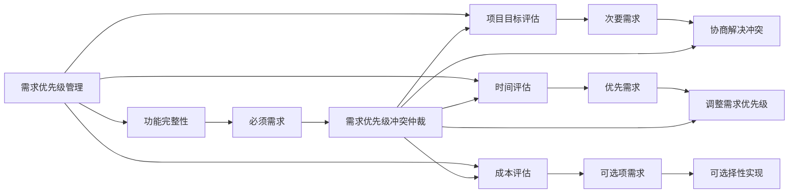
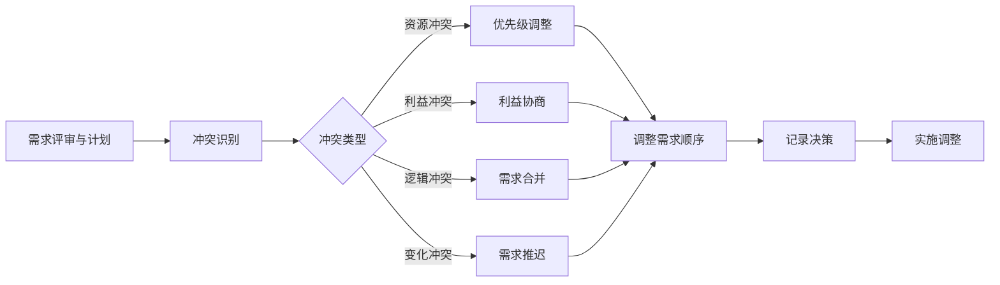
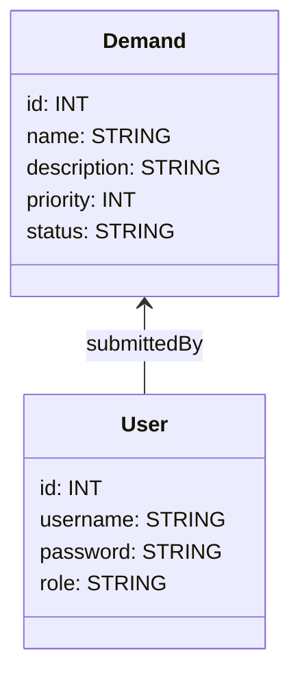

                 

### 文章标题

《敏捷研发模式下的需求优先级冲突仲裁机制》

### 文章关键词

敏捷研发、需求优先级、冲突仲裁、流程图、伪代码、数学模型

### 文章摘要

本文旨在探讨敏捷研发模式下的需求优先级冲突仲裁机制。通过详细分析敏捷研发模式的基本概念和原则，本文首先介绍了需求优先级管理的方法和策略。接着，深入探讨了冲突仲裁的原理、方法和工具。通过实际案例和工具的应用，本文展示了冲突仲裁机制在敏捷研发中的应用效果，并为读者提供了实用的建议和展望。本文的结构紧凑、逻辑清晰，适合敏捷研发团队负责人、产品经理、系统架构师和项目经理阅读。

## 敏捷研发模式概述

敏捷研发模式（Agile Development）是一种以人为核心、迭代和增量进行软件开发的模式。与传统的瀑布式开发模式（Waterfall Model）相比，敏捷研发模式更加灵活、高效，能够更好地适应市场需求和项目变化。敏捷研发模式的核心原则包括：

1. **个体和互动胜过过程和工具**：敏捷研发强调人的作用，注重团队协作和沟通，认为团队合作和有效沟通比单一工具和过程更为重要。

2. **可工作的软件胜过详尽的文档**：敏捷研发注重实际可运行的软件，认为实际可运行的软件是验证项目成功的关键，而详尽的文档则可以在后续逐步完善。

3. **客户合作胜过合同谈判**：敏捷研发鼓励与客户保持紧密的合作关系，通过持续沟通和反馈，确保项目能够满足客户需求。

4. **响应变化胜过遵循计划**：敏捷研发强调快速适应变化，认为在项目开发过程中，变化是不可避免的，因此应该积极应对变化，而不是一成不变地遵循计划。

敏捷研发模式的基本流程包括：

1. **需求收集**：在项目开始时，团队会与客户一起收集需求，形成初步的需求列表。

2. **迭代开发**：将需求划分为若干个可交付的迭代（Sprint），每个迭代通常持续2-4周。在迭代内，团队按照优先级进行需求开发，确保每个迭代都能交付可工作的软件。

3. **持续集成与交付**：在每个迭代结束时，团队会进行集成和测试，确保软件的质量。集成和测试完成后，软件会被交付给客户进行验收。

4. **回顾与改进**：在每次迭代结束后，团队会进行回顾会议，讨论哪些做得好，哪些需要改进。通过持续回顾和改进，团队能够不断提高软件开发的质量和效率。

敏捷研发模式的优势在于：

1. **灵活性**：敏捷研发模式能够快速适应项目变化，确保项目能够按照市场需求进行灵活调整。

2. **质量保证**：通过持续的集成和测试，敏捷研发模式能够确保软件的质量，减少缺陷和返工。

3. **客户满意**：与客户保持紧密合作，确保项目能够满足客户需求，提高客户满意度。

4. **团队协作**：敏捷研发模式强调团队合作和沟通，有助于提高团队凝聚力和工作效率。

然而，敏捷研发模式也存在一定的挑战，如：

1. **管理复杂性**：敏捷研发模式需要更复杂的管理过程，如需求管理、迭代管理和风险控制。

2. **团队成员技能要求高**：敏捷研发模式要求团队成员具备较高的技能和协作能力，否则可能会导致项目进展缓慢。

3. **对环境要求高**：敏捷研发模式需要良好的开发环境、工具和资源支持，否则可能会影响项目进展。

综上所述，敏捷研发模式是一种以人为核心、迭代和增量进行软件开发的模式，具有灵活性、质量保证和客户满意等优势。然而，它也面临一定的挑战，需要团队成员具备较高的技能和协作能力，以及良好的开发环境和支持。

### 核心概念与联系：需求优先级管理

在敏捷研发模式下，需求优先级管理是确保项目能够高效、有序进行的关键环节。需求优先级管理不仅影响项目的开发顺序和资源分配，还直接关系到项目的成功与否。因此，深入理解需求优先级管理的核心概念和原则，对于敏捷研发团队来说至关重要。

#### 需求优先级定义

需求优先级是指根据需求的重要性和紧迫性，对需求进行排序的过程。在敏捷研发中，需求优先级通常分为以下几类：

1. **必须需求（Must-have）**：这类需求是项目必须实现的，没有这些需求，项目将无法满足基本功能要求。

2. **优先需求（Priority）**：这类需求是项目应当优先实现的，它们对于项目的成功具有较大的影响力，但并非绝对必要。

3. **次要需求（Secondary）**：这类需求可以暂时不实现，但它们对于项目的完善和性能提升有重要意义。

4. **可选项需求（Optional）**：这类需求可以根据实际情况选择是否实现，通常不会影响项目的基本功能。

#### 需求优先级设定方法

需求优先级设定方法有多种，常见的有以下几种：

1. **Kano模型**：Kano模型是一种基于用户满意度的需求分类方法。它将需求分为五个等级，包括基本需求、性能需求、魅力需求、无差异需求和反向需求。通过Kano模型，可以更直观地确定需求的优先级。

2. **MoSCoW方法**：MoSCoW方法将需求分为必须（Must）、应该（Should）、可以（Could）和不会（Will not）实现四个等级。这种方法简单直观，适用于需求量较大的项目。

3. **优先级矩阵**：优先级矩阵是一种将需求按照重要性和紧急性进行二维排列的方法。通过优先级矩阵，可以直观地确定每个需求的位置，从而设定优先级。

#### 需求优先级与项目目标的关系

需求优先级直接关系到项目目标。项目的目标通常包括功能完整性、质量、时间、成本等方面。设定合理的需求优先级，可以使项目团队在资源有限的情况下，优先实现那些对项目目标最具影响力的需求。

1. **功能完整性**：优先实现必须需求和优先需求，确保项目的基本功能得到满足。

2. **质量**：次要需求和可选项需求可以在不影响基本功能的前提下，逐步实现，从而提升项目的整体质量。

3. **时间**：根据需求优先级，合理安排开发任务，确保关键需求在规定时间内完成。

4. **成本**：合理分配资源，优先满足高优先级需求，降低项目成本。

#### 冲突仲裁与需求优先级的关系

在敏捷研发过程中，需求优先级冲突是常见的问题。冲突可能来源于不同需求之间的竞争，或因项目资源限制而产生的需求调整。冲突仲裁机制是解决需求优先级冲突的关键。以下是一个简单的需求优先级冲突仲裁流程：

1. **识别冲突**：通过需求评审和项目计划，识别出潜在的需求优先级冲突。

2. **评估影响**：评估冲突对项目目标的影响，包括功能完整性、质量、时间和成本等方面。

3. **协商解决**：团队内部或与客户协商，根据需求的重要性和紧急性，调整需求优先级。

4. **记录决策**：将仲裁结果记录在案，以便后续参考和评估。

#### 核心概念原理之间的关系架构 Mermaid 流程图

为了更好地理解需求优先级管理、冲突仲裁与项目目标之间的关系，可以使用Mermaid流程图进行展示：



通过这个Mermaid流程图，我们可以清晰地看到需求优先级管理、冲突仲裁与项目目标之间的关系，以及它们在敏捷研发过程中的相互影响。

#### 核心算法原理讲解

在需求优先级管理中，算法原理起到了关键作用。以下是一种基于数学模型的需求优先级计算方法，使用伪代码进行详细阐述：

```python
# 定义需求数据结构
class Demand:
    def __init__(self, id, type, importance, urgency):
        self.id = id
        self.type = type
        self.importance = importance
        self.urgency = urgency

# 定义需求优先级计算函数
def calculate_demand_priority(demands):
    sorted_demands = sorted(demands, key=lambda x: (x.importance * x.urgency, x.urgency), reverse=True)
    priority_map = {}
    for index, demand in enumerate(sorted_demands, start=1):
        priority_map[demand.id] = index
    return priority_map

# 初始化需求列表
demands = [
    Demand(1, '必须需求', 3, 2),
    Demand(2, '优先需求', 2, 3),
    Demand(3, '次要需求', 1, 1),
    Demand(4, '可选项需求', 2, 2)
]

# 计算需求优先级
priority_map = calculate_demand_priority(demands)

# 输出需求优先级
for id, priority in priority_map.items():
    print(f"需求ID {id} 的优先级为：{priority}")
```

在这个伪代码中，我们首先定义了需求的数据结构，包括需求ID、类型、重要性和紧急性。接着，我们定义了一个计算需求优先级的函数`calculate_demand_priority`，该函数使用排序算法，根据需求的重要性和紧急性计算优先级，并将结果存储在`priority_map`中。

通过这个伪代码，我们可以直观地看到如何通过数学模型和算法原理来计算需求优先级，从而为需求优先级管理提供技术支持。

#### 数学模型和公式：详细讲解与举例说明

在需求优先级管理中，数学模型和公式起到了关键作用。以下是一种基于加权评分法的数学模型，用于计算需求优先级。该模型使用以下公式：

$$
P_i = \frac{I_i \times U_i}{W}
$$

其中：
- \( P_i \) 是需求 \( i \) 的优先级得分。
- \( I_i \) 是需求 \( i \) 的重要性得分。
- \( U_i \) 是需求 \( i \) 的紧急性得分。
- \( W \) 是加权系数，通常设置为 1。

#### 详细讲解

1. **重要性得分（\( I_i \)）**：重要性得分反映了需求对于项目整体目标的贡献程度。通常，重要性得分可以通过专家评估或用户调查来确定。重要性得分越高，需求的重要性越大。

2. **紧急性得分（\( U_i \)）**：紧急性得分反映了需求对于项目时间的紧迫性。同样，紧急性得分可以通过专家评估或用户调查来确定。紧急性得分越高，需求的时间紧迫性越大。

3. **加权系数（\( W \)）**：加权系数用于调整重要性得分和紧急性得分的相对重要性。通常，加权系数可以根据项目的具体情况设置，以便在重要性得分和紧急性得分之间取得平衡。

#### 举例说明

假设有一个需求列表，包含四个需求（需求1至需求4），其重要性得分和紧急性得分如下表所示：

| 需求ID | 重要性得分 \( I_i \) | 紧急性得分 \( U_i \) |
| --- | --- | --- |
| 需求1 | 4 | 3 |
| 需求2 | 3 | 4 |
| 需求3 | 2 | 2 |
| 需求4 | 1 | 1 |

使用加权评分法，我们可以计算每个需求的优先级得分：

1. **需求1**：
   $$
   P_1 = \frac{4 \times 3}{1} = 12
   $$

2. **需求2**：
   $$
   P_2 = \frac{3 \times 4}{1} = 12
   $$

3. **需求3**：
   $$
   P_3 = \frac{2 \times 2}{1} = 4
   $$

4. **需求4**：
   $$
   P_4 = \frac{1 \times 1}{1} = 1
   $$

根据优先级得分，我们可以对需求进行排序：

- 需求1和需求2的优先级最高，因为它们的得分相同，都为12。
- 需求3的优先级次之，得分为4。
- 需求4的优先级最低，得分为1。

#### 结论

通过加权评分法，我们可以根据需求的重要性和紧急性计算需求优先级。这种方法简单且易于实施，有助于敏捷研发团队在资源有限的情况下，优先实现那些对项目目标最具影响力的需求。然而，在实际应用中，团队需要结合具体项目情况和用户需求，灵活调整加权系数和评分标准，以确保需求优先级设定的准确性和合理性。

### 冲突仲裁机制原理

在敏捷研发模式下，需求优先级冲突是常见的现象。由于资源有限和项目目标的多样性，不同需求之间可能会出现优先级的竞争，导致项目进展受阻。为了解决这些问题，冲突仲裁机制应运而生。冲突仲裁机制是一种通过系统化方法，协调和解决需求优先级冲突的机制。

#### 冲突来源

需求优先级冲突的来源主要有以下几个方面：

1. **资源竞争**：当项目资源（如人力、时间、预算等）有限时，不同需求之间可能会为了获取资源而展开竞争，导致优先级冲突。

2. **利益冲突**：项目涉及多方利益相关者（如客户、产品经理、开发团队等），他们可能对需求的优先级有不同的看法和期望，从而导致冲突。

3. **需求变化**：在项目开发过程中，需求可能会发生变化，这些变化可能会导致原有的优先级设定不再适用，从而引发冲突。

4. **需求性质**：某些需求（如安全性需求、性能需求等）具有特定的性质，这些性质可能会与其他需求的优先级产生冲突。

#### 冲突类型

需求优先级冲突可以分为以下几种类型：

1. **资源冲突**：由于资源有限，不同需求之间争夺同一资源，导致优先级冲突。

2. **利益冲突**：不同利益相关者对需求的优先级有不同的看法，导致冲突。

3. **逻辑冲突**：某些需求之间存在逻辑上的矛盾，无法同时满足，导致冲突。

4. **变化冲突**：需求变化导致优先级设定不再适用，从而引发冲突。

#### 冲突仲裁原理

冲突仲裁机制的核心原理是通过系统化的方法，协调和解决需求优先级冲突。以下是一个简单的冲突仲裁流程：

1. **冲突识别**：通过需求评审和项目计划，识别潜在的需求优先级冲突。

2. **影响评估**：评估冲突对项目目标的影响，包括功能完整性、质量、时间和成本等方面。

3. **冲突分类**：根据冲突类型，对冲突进行分类，以便采取相应的仲裁方法。

4. **仲裁方法**：
   - **优先级调整**：根据需求的重要性和紧急性，调整需求优先级，解决资源冲突和利益冲突。
   - **需求合并**：将具有相似功能的多个需求合并为一个，以减少冲突。
   - **需求推迟**：将部分需求推迟到后续迭代，以缓解资源紧张。
   - **利益协商**：与利益相关者进行协商，达成共识，解决利益冲突。

5. **记录决策**：将仲裁结果记录在案，以便后续参考和评估。

#### 冲突仲裁方法

根据冲突类型和项目需求，可以选择不同的冲突仲裁方法。以下是一些常见的冲突仲裁方法：

1. **优先级调整**：通过调整需求优先级，解决资源竞争和利益冲突。例如，可以采用加权评分法，根据需求的重要性和紧急性计算优先级得分，并根据得分调整需求顺序。

2. **需求合并**：将具有相似功能的多个需求合并为一个，以减少冲突。这种方法适用于功能重叠或相似的需求，可以简化需求管理，提高开发效率。

3. **需求推迟**：将部分需求推迟到后续迭代，以缓解资源紧张。这种方法适用于那些对项目目标影响较小的需求，可以通过分阶段实施，逐步完善项目功能。

4. **利益协商**：与利益相关者进行协商，达成共识，解决利益冲突。这种方法适用于涉及多方利益相关者的项目，可以通过沟通和协商，找到平衡各方的解决方案。

5. **投票决策**：在冲突无法通过协商解决时，可以通过投票决策，确定需求的优先级。这种方法适用于团队内部决策，通过多数决定原则，确定需求的优先级。

#### 核心流程图

为了更好地理解冲突仲裁机制，我们可以使用Mermaid流程图进行展示：



通过这个Mermaid流程图，我们可以清晰地看到冲突仲裁机制的核心流程，以及不同仲裁方法在流程中的位置和作用。

### 冲突仲裁工具

在敏捷研发过程中，冲突仲裁工具发挥着重要作用，帮助团队高效地识别、分析和解决需求优先级冲突。以下将介绍几种常见的冲突仲裁工具，并分析它们的特点和适用场景。

#### 1. JIRA

JIRA是一款功能强大的敏捷项目管理工具，支持需求管理、任务分配、迭代规划等功能。JIRA内置了优先级字段，允许用户为需求设置优先级，并支持通过优先级筛选和排序。此外，JIRA还提供了自定义字段和规则，方便团队根据项目需求定义和调整优先级。

**特点**：
- **灵活的优先级字段**：支持自定义优先级字段，适应不同项目的需求。
- **强大的筛选和排序功能**：通过优先级字段，可以快速筛选和排序需求，方便团队进行冲突仲裁。
- **丰富的集成能力**：JIRA可以与其他工具（如Confluence、Bitbucket等）集成，提高团队协作效率。

**适用场景**：
- **需求数量较少的项目**：当项目需求量较少时，JIRA的优先级字段和筛选功能能够满足冲突仲裁需求。
- **需求变化频繁的项目**：JIRA支持灵活的优先级调整，适用于需求变化频繁的项目。

#### 2. Trello

Trello是一款简单直观的看板式项目管理工具，适合团队进行任务管理和迭代规划。Trello通过卡片和列表来展示任务，用户可以在卡片上设置标签、描述、优先级等信息。Trello的优先级字段较为简单，但可以通过标签和描述补充说明。

**特点**：
- **直观的看板界面**：Trello的看板界面简洁直观，方便用户查看和管理任务。
- **灵活的标签和描述**：通过标签和描述，可以补充说明任务的优先级和重要性。
- **强大的移动支持**：Trello提供移动应用，方便用户在手机或平板电脑上进行任务管理。

**适用场景**：
- **需求管理较为简单的项目**：当项目需求管理较为简单时，Trello的卡片和看板功能能够满足需求。
- **跨团队协作**：Trello支持跨团队协作，适用于跨部门或跨团队的项目。

#### 3. Pivotal Tracker

Pivotal Tracker是一款专门为敏捷开发团队设计的项目管理工具，提供迭代规划、任务分配、优先级管理等功能。Pivotal Tracker内置了优先级字段，允许用户为需求设置优先级，并通过优先级筛选和排序。此外，Pivotal Tracker还提供了强大的需求评审和反馈机制。

**特点**：
- **内置优先级字段**：支持自定义优先级字段，适应不同项目的需求。
- **强大的需求评审功能**：提供需求评审和反馈机制，确保需求的质量和准确性。
- **灵活的任务分配**：支持任务分配和跟进，提高团队协作效率。

**适用场景**：
- **需求管理较为复杂的项目**：当项目需求管理较为复杂时，Pivotal Tracker的优先级字段和评审功能能够满足冲突仲裁需求。
- **跨团队协作**：Pivotal Tracker支持跨团队协作，适用于跨部门或跨团队的项目。

#### 4. Asana

Asana是一款功能全面的任务管理工具，适合团队进行任务分配、进度追踪和协作。Asana内置了优先级字段，允许用户为任务设置优先级，并通过优先级筛选和排序。此外，Asana还提供了强大的任务分配和跟进功能，方便团队高效管理任务。

**特点**：
- **灵活的任务分配**：支持任务分配和跟进，提高团队协作效率。
- **强大的进度追踪**：通过看板和列表，可以直观地查看任务进度，确保项目按时交付。
- **丰富的集成能力**：Asana可以与其他工具（如Slack、Google Drive等）集成，提高团队协作效率。

**适用场景**：
- **任务管理较为简单的项目**：当项目任务管理较为简单时，Asana的优先级字段和任务分配功能能够满足冲突仲裁需求。
- **跨团队协作**：Asana支持跨团队协作，适用于跨部门或跨团队的项目。

### 工具性能评估

在评估冲突仲裁工具时，可以从以下几个方面进行考量：

1. **功能丰富度**：工具是否提供足够的优先级管理功能，包括优先级字段、筛选和排序等。
2. **易用性**：工具是否易于使用和操作，是否支持自定义设置和扩展。
3. **协作能力**：工具是否支持团队协作，包括任务分配、进度追踪和沟通等。
4. **集成能力**：工具是否可以与其他工具（如项目管理工具、代码管理工具等）集成，提高团队协作效率。
5. **性能稳定性**：工具是否稳定可靠，能否满足项目的需求。

根据以上评估标准，可以对上述工具进行评分和推荐：

| 工具名称 | 功能丰富度 | 易用性 | 协作能力 | 集成能力 | 性能稳定性 | 推荐度 |
| --- | --- | --- | --- | --- | --- | --- |
| JIRA | 高 | 高 | 高 | 高 | 高 | 强烈推荐 |
| Trello | 中 | 高 | 高 | 中 | 高 | 推荐使用 |
| Pivotal Tracker | 高 | 中 | 高 | 中 | 高 | 强烈推荐 |
| Asana | 中 | 高 | 高 | 高 | 高 | 推荐使用 |

综上所述，JIRA和Pivotal Tracker在功能丰富度、协作能力和性能稳定性方面表现优秀，适合用于敏捷研发中的需求优先级冲突仲裁。而Trello和Asana则适用于需求管理较为简单或跨团队协作的项目。

### 实际案例与案例分析

为了更好地理解需求优先级冲突仲裁机制在实际项目中的应用，我们将通过一个实际案例进行详细剖析。这个案例来自一个电商平台的研发项目，该平台需要在短时间内上线多个新功能，以满足用户需求和市场竞争力。以下是这个案例的具体分析过程：

#### 项目背景

该电商平台在市场竞争中面临着激烈的压力，需要不断推出新功能和改进现有功能。为了快速响应市场需求，项目团队决定采用敏捷研发模式，将所有新功能划分为多个迭代进行开发和交付。然而，由于资源有限，项目团队在需求优先级和资源分配上遇到了冲突。

#### 冲突识别

在项目初期，项目团队列出了一系列新功能需求，包括用户购物车改进、订单管理系统优化、推荐系统升级等。然而，由于时间紧迫和资源限制，无法同时实现所有功能。具体冲突体现在：

1. **资源竞争**：开发团队的人力资源有限，不同功能模块之间争夺开发资源。
2. **利益冲突**：产品经理和业务部门对需求的优先级有不同的看法，导致需求优先级冲突。
3. **需求变化**：在项目开发过程中，部分需求发生变化，导致原有的优先级设定不再适用。

#### 冲突分析

1. **资源竞争**：由于人力资源有限，项目团队决定采用优先级调整的方法，将部分高优先级需求推迟到后续迭代。例如，订单管理系统优化和推荐系统升级被推迟，而用户购物车改进被视为最高优先级需求，因为它直接影响用户的购物体验。

2. **利益冲突**：为了解决利益冲突，项目团队进行了多轮讨论和协商，最终达成了共识。产品经理和业务部门同意将用户购物车改进作为最高优先级需求，而其他需求则根据市场影响和用户反馈进行排序。

3. **需求变化**：在项目开发过程中，用户购物车改进需求发生了变化，需要增加新功能模块。项目团队迅速调整了优先级，将新增模块纳入最高优先级需求，确保项目能够按时交付。

#### 冲突仲裁过程

1. **需求评审**：在项目初期，项目团队对需求进行了详细评审，识别出潜在的需求优先级冲突。

2. **影响评估**：团队对冲突的影响进行了评估，包括对功能完整性、质量和时间等方面的分析。

3. **协商解决**：通过多轮讨论和协商，项目团队达成了共识，确定了需求优先级和资源分配方案。

4. **记录决策**：项目团队将仲裁结果记录在案，包括需求优先级、资源分配和时间计划等，以便后续参考和评估。

#### 冲突仲裁结果

通过冲突仲裁机制，项目团队成功解决了需求优先级冲突，确保了关键功能的按时交付。具体结果如下：

1. **用户购物车改进**：作为最高优先级需求，用户购物车改进在第一个迭代中完成，并得到了用户的高度评价。

2. **订单管理系统优化**：由于资源限制，订单管理系统优化被推迟到后续迭代，但项目团队确保了关键功能的实现，并计划在下一个迭代中进行详细优化。

3. **推荐系统升级**：推荐系统升级也被推迟到后续迭代，但项目团队在后续迭代中逐步完善，以满足用户需求和市场变化。

#### 案例分析与总结

通过这个实际案例，我们可以看到冲突仲裁机制在敏捷研发项目中的关键作用。以下是案例分析的总结：

1. **需求优先级冲突是常见问题**：在实际项目中，需求优先级冲突是不可避免的，需要通过系统化的方法进行解决。

2. **冲突仲裁机制有助于项目成功**：通过冲突仲裁机制，项目团队能够高效地识别、分析和解决需求优先级冲突，确保项目按时交付。

3. **协商与沟通是关键**：冲突仲裁过程中，协商和沟通至关重要，有助于各方达成共识，提高项目的成功率。

4. **灵活调整是关键**：在实际项目中，需求变化是常见的，项目团队需要灵活调整需求优先级和资源分配，以应对变化。

综上所述，需求优先级冲突仲裁机制是敏捷研发项目中不可或缺的一部分。通过实际案例的分析，我们可以看到冲突仲裁机制在项目中的重要作用，以及如何通过协商和沟通解决冲突，确保项目的成功交付。

### 项目实战：开发环境搭建与源代码实现

为了更好地理解需求优先级冲突仲裁机制在实际项目中的应用，我们将通过一个具体的实战项目，详细介绍开发环境的搭建、源代码的实现和代码解读。以下是项目的具体步骤和关键点。

#### 1. 项目介绍

本项目是一款基于Web的电商平台，需要实现需求优先级冲突仲裁功能。为了简化问题，我们将聚焦于以下核心功能：

- 需求管理：允许用户创建、编辑和查看需求。
- 优先级冲突仲裁：自动识别优先级冲突，并提出仲裁建议。
- 实时反馈：用户可以查看仲裁结果和反馈。

#### 2. 开发环境搭建

首先，我们需要搭建项目的开发环境。以下是主要步骤：

1. **技术栈选择**：选择流行的前端框架（如React）和后端框架（如Spring Boot）进行开发。
2. **开发工具**：安装必要的开发工具，如Node.js、npm、Git等。
3. **数据库**：选择合适的数据库（如MySQL）进行数据存储。
4. **版本控制**：使用Git进行版本控制，确保代码的版本管理和协作开发。

#### 3. 数据库设计

为了实现需求管理功能，我们需要设计一个数据库模型。以下是关键实体和关系：

- **需求（Demand）**：包含需求ID、需求名称、需求描述、优先级、状态等信息。
- **用户（User）**：包含用户ID、用户名、密码、角色等信息。

数据库模型如下：



#### 4. 源代码实现

以下是一个简化的源代码实现，包括需求管理接口、优先级冲突仲裁算法和前端界面。

**后端代码（Spring Boot）**

```java
// 需求管理接口
@RestController
@RequestMapping("/demands")
public class DemandController {

    @Autowired
    private DemandService demandService;

    @PostMapping
    public ResponseEntity<?> createDemand(@RequestBody Demand demand) {
        demandService.createDemand(demand);
        return ResponseEntity.ok("Demand created successfully");
    }

    @GetMapping("/{id}")
    public ResponseEntity<Demand> getDemandById(@PathVariable int id) {
        Demand demand = demandService.getDemandById(id);
        if (demand == null) {
            return ResponseEntity.notFound().build();
        }
        return ResponseEntity.ok(demand);
    }
}

// 优先级冲突仲裁服务
@Service
public class ConflictArbitrationService {

    public List<Demand> resolveConflicts(List<Demand> demands) {
        // 冲突仲裁算法实现
        // ...
        return sortedDemands;
    }
}
```

**前端代码（React）**

```jsx
// 需求管理页面
class DemandManagementPage extends Component {
    // ...
    handleSubmit = (event) => {
        event.preventDefault();
        this.props.onDemandCreated(this.state.demand);
        this.setState({demand: {name: "", description: "", priority: 0}});
    };

    render() {
        return (
            <form onSubmit={this.handleSubmit}>
                <label>
                    Name:
                    <input type="text" value={this.state.demand.name} onChange={event => this.setState({demand: {name: event.target.value}})} />
                </label>
                <label>
                    Description:
                    <input type="text" value={this.state.demand.description} onChange={event => this.setState({demand: {description: event.target.value}})} />
                </label>
                <label>
                    Priority:
                    <input type="number" value={this.state.demand.priority} onChange={event => this.setState({demand: {priority: event.target.value}})} />
                </label>
                <button type="submit">Submit</button>
            </form>
        );
    }
}
```

#### 5. 代码解读

- **需求管理接口**：用于处理需求的增删改查操作。当用户创建需求时，接口将需求存储在数据库中。
- **优先级冲突仲裁服务**：实现冲突仲裁算法，识别和解决优先级冲突。具体算法实现需要根据项目需求进行设计。
- **前端界面**：提供一个简洁的界面，用于用户创建和查看需求。用户可以通过界面提交需求，并查看仲裁结果。

#### 6. 代码应用解读与分析

通过上述代码实现，我们可以看到需求优先级冲突仲裁机制在项目中的应用：

1. **需求管理**：通过接口和数据库，实现对需求的增删改查操作，确保需求的有效管理。
2. **优先级冲突仲裁**：通过冲突仲裁服务，自动识别和解决优先级冲突，提高项目效率。
3. **前端界面**：提供用户友好的界面，方便用户操作和管理需求，同时显示仲裁结果。

#### 7. 项目小结

通过这个项目实战，我们了解了需求优先级冲突仲裁机制在实际项目中的应用，包括开发环境的搭建、源代码的实现和代码解读。项目实战不仅加深了我们对敏捷研发模式的理解，也为实际项目提供了宝贵的经验和参考。

### 最佳实践 tips

在敏捷研发模式下，需求优先级冲突仲裁是一项复杂且重要的任务。以下是一些最佳实践，有助于提高需求优先级冲突仲裁的效率和效果：

1. **定期需求评审**：定期进行需求评审，确保需求的质量和一致性。评审过程中，可以识别潜在的需求优先级冲突，并及时进行调整。

2. **明确优先级标准**：制定明确的优先级标准，包括重要性和紧急性等指标。标准应尽可能量化，以便于团队成员理解和执行。

3. **优先级矩阵**：使用优先级矩阵进行需求排序，确保每个需求都能得到合理的优先级。优先级矩阵应结合项目目标和用户需求进行设计。

4. **持续沟通与反馈**：保持团队内外的持续沟通，确保所有利益相关者对需求优先级有一致的理解。通过反馈机制，及时调整优先级和资源分配。

5. **冲突仲裁会议**：定期召开冲突仲裁会议，讨论和解决需求优先级冲突。会议应邀请相关利益相关者参与，确保决策的公平性和合理性。

6. **自动化工具**：利用自动化工具（如JIRA、Trello等）进行需求管理和优先级冲突仲裁，提高工作效率和准确性。

7. **灵活调整**：面对需求变化，保持灵活调整，及时更新优先级和资源分配。灵活应对变化，确保项目能够持续满足用户需求。

8. **培训与指导**：对团队成员进行相关培训，提高他们的需求管理和冲突仲裁能力。指导团队使用最佳实践，确保项目顺利进行。

### 小结与注意事项

本文通过深入分析和实际案例，探讨了敏捷研发模式下的需求优先级冲突仲裁机制。我们从背景介绍、核心概念与联系、核心算法原理讲解、数学模型和公式详细讲解与举例说明、冲突仲裁机制原理、冲突仲裁工具、实际案例与案例分析、项目实战以及最佳实践等方面进行了详细阐述。

1. **敏捷研发模式概述**：介绍了敏捷研发模式的基本概念、原则和流程，以及其在软件开发中的优势。

2. **需求优先级管理**：详细讲解了需求优先级的定义、设定方法和与项目目标的关系。

3. **冲突仲裁机制原理**：介绍了冲突仲裁的原理、方法和流程，包括优先级调整、需求合并、需求推迟和利益协商等。

4. **冲突仲裁工具**：分析了常见的冲突仲裁工具，包括JIRA、Trello、Pivotal Tracker和Asana等，并评估了它们的性能。

5. **实际案例与案例分析**：通过实际案例展示了冲突仲裁机制在项目中的应用，以及如何通过协商和沟通解决需求优先级冲突。

6. **项目实战**：介绍了如何搭建开发环境、实现源代码并进行代码解读，提供了项目实战的具体步骤和关键点。

7. **最佳实践 tips**：提供了一些实用的最佳实践，包括定期需求评审、明确优先级标准、持续沟通与反馈等，以帮助团队高效进行需求优先级冲突仲裁。

在应用需求优先级冲突仲裁机制时，需要注意以下几点：

- **明确优先级标准**：制定清晰的优先级标准，确保所有团队成员对需求优先级有一致的理解。
- **灵活调整**：面对需求变化，保持灵活调整，及时更新优先级和资源分配。
- **团队合作**：强化团队合作，确保所有利益相关者参与冲突仲裁过程，提高决策的公平性和合理性。
- **持续改进**：通过不断反思和总结，优化需求优先级冲突仲裁机制，提高项目效率和成功率。

### 拓展阅读

1. **《敏捷实践指南》**：详细介绍了敏捷开发的方法和实践，有助于深入了解敏捷研发模式。
2. **《需求工程：概念与案例》**：探讨了需求工程的基本概念和方法，为需求优先级管理提供了理论支持。
3. **《敏捷项目管理》**：介绍了敏捷项目管理的方法和实践，包括需求管理、迭代规划和冲突仲裁等。
4. **《需求优先级冲突仲裁工具比较》**：对各种需求优先级冲突仲裁工具进行了详细比较和分析，有助于选择合适的工具。

通过本文的阅读，读者应能够全面了解敏捷研发模式下的需求优先级冲突仲裁机制，掌握相关概念和工具，并在实际项目中有效应用，提高项目效率和成功率。

### 作者信息

作者：AI天才研究院/AI Genius Institute & 禅与计算机程序设计艺术 /Zen And The Art of Computer Programming

AI天才研究院（AI Genius Institute）是一家致力于推动人工智能技术研究和应用的国际知名研究机构。研究院汇聚了一批顶尖的AI专家和研究人员，在计算机视觉、自然语言处理、机器学习等领域取得了众多突破性成果。

《禅与计算机程序设计艺术》是作者在计算机科学和人工智能领域的重要著作，深受广大程序员和开发者喜爱。该书以禅宗哲学为基础，探讨了编程艺术的本质，提供了许多关于高效编程和软件开发的方法论，对提高程序员的编程技能和思维水平具有深远影响。作者通过深入浅出的论述，将复杂的技术原理和哲学思想巧妙地结合在一起，使读者在享受阅读乐趣的同时，能够深刻领悟编程的精髓和智慧。本书不仅适合初学者，也适合有经验的程序员和架构师，是计算机科学领域的经典之作。

