                 

### 文章标题：敏捷研发模式下的需求优先级冲突解决

#### 关键词：敏捷研发、需求优先级、冲突解决、迭代、迭代管理、敏捷工具

#### 摘要：
在敏捷研发模式下，需求优先级的管理是项目成功的关键因素之一。本文旨在探讨敏捷研发模式下的需求优先级冲突及其解决策略。文章首先介绍了敏捷研发模式的基本概念和流程，然后详细阐述了需求优先级的定义、评估方法和重要性。接着，文章提出了冲突解决的原则和策略，并通过实际案例分析了这些策略的应用效果。最后，文章推荐了相关工具和资源，以帮助读者在实践中更好地管理需求优先级和解决冲突。

----------------------------------------------------------------

### 第一部分：敏捷研发模式概述

#### 1.1 敏捷研发模式的基本概念

敏捷研发模式（Agile Development Model）是一种以迭代、增量开发为核心的开发方法。它强调快速响应客户需求，灵活应对变化，以提高软件开发质量和团队效率。与传统瀑布模型（Waterfall Model）相比，敏捷研发模式更注重项目的迭代性和灵活性。

#### 1.1.1 敏捷研发的定义

敏捷研发模式起源于软件开发领域，是一种以人为核心、迭代、互动的开发方法。其核心理念包括：

- **个体和互动重于过程与工具**：敏捷研发强调团队成员之间的沟通和合作，重视个体能力。
- **可工作的软件重于详尽的文档**：敏捷研发注重实际交付可运行的软件，而非冗长的文档。
- **客户合作重于合同谈判**：敏捷研发鼓励与客户的紧密合作，以更好地满足客户需求。
- **响应变化重于遵循计划**：敏捷研发强调对变化的适应性，灵活调整项目计划和目标。

#### 1.1.2 敏捷研发与传统研发模式的对比

| 特点 | 敏捷研发模式 | 传统研发模式 |
| --- | --- | --- |
| 开发流程 | 迭代、增量开发 | 瀑布模型 |
| 团队组织形式 | 小型、跨职能团队 | 大型、职能分工团队 |
| 客户参与 | 紧密合作、持续反馈 | 初步沟通、后期交付 |
| 项目管理 | 透明、动态调整 | 固定计划、严格执行 |
| 变化应对 | 高度适应、快速响应 | 难以适应、计划变更 |

#### 1.1.3 敏捷研发的核心原则

敏捷研发模式的核心原则包括：

- **用户至上**：始终以满足用户需求为核心。
- **快速迭代**：以迭代的方式逐步完善软件功能。
- **持续交付**：持续交付可工作的软件。
- **团队协作**：强调团队成员之间的协作和沟通。
- **灵活应对变化**：灵活应对项目过程中的变化。

### 第一部分：敏捷研发模式概述

#### 1.2 敏捷研发流程

敏捷研发流程主要包括以下阶段：

1. **需求收集**：与客户沟通，了解需求。
2. **规划**：确定项目目标和计划。
3. **开发**：按照迭代周期进行开发。
4. **测试**：进行单元测试、集成测试等。
5. **交付**：交付可工作的软件。
6. **回顾**：总结经验教训，改进流程。

#### 1.2.1 迭代与增量开发

迭代开发（Iterative Development）是一种通过多次迭代逐步完善软件的开发方法。每次迭代都包括需求收集、设计、开发、测试和交付等环节。增量开发（Incremental Development）则是将软件功能分解为多个增量，逐个开发并交付。

#### 1.2.2 敏捷团队的组织形式

敏捷团队通常采用跨职能团队的形式，团队成员包括产品经理、设计师、开发人员、测试人员等。这样的组织形式有助于团队成员之间的紧密合作和快速响应需求变化。

#### 1.2.3 敏捷研发的工具与方法

敏捷研发常用的工具包括：

- **看板（Kanban）**：用于可视化工作流程，优化团队协作。
- **Scrum**：一种敏捷开发框架，包括 sprint 计划、每日站立会议、回顾等环节。
- **用户故事（User Story）**：用于描述用户需求，通常包括 As a user, I want to... 的格式。

敏捷研发的方法主要包括：

- **持续集成（Continuous Integration）**：确保代码库中的代码始终是可集成的。
- **持续交付（Continuous Delivery）**：确保软件可以快速、安全地交付给用户。
- **测试驱动开发（Test-Driven Development）**：先编写测试，再编写代码。

---

通过本文的介绍，读者可以初步了解敏捷研发模式的基本概念、流程和核心原则。接下来，我们将进一步探讨需求优先级及其在敏捷研发中的重要性。

## 第二部分：需求优先级定义与评估

### 2.1 需求优先级的定义

在敏捷研发模式下，需求优先级（Priority of Requirements）是指对需求进行排序，确定哪些需求应该首先被实现。需求优先级的定义是需求管理的重要组成部分，它有助于确保项目资源被高效利用，以实现最大化的商业价值。

#### 2.1.1 需求优先级的概念

需求优先级通常分为以下几种类型：

- **必须（Must Have）**：必须实现的核心需求，没有这些功能，软件将无法正常运行。
- **应该（Should Have）**：重要但非核心的需求，实现这些功能将显著提升软件价值。
- **可以（Could Have）**：可选需求，实现这些功能可以提供额外的功能，但不是必需的。
- **不需要（Won't Have）**：当前版本中不实现的需求，可能在未来版本中考虑。

#### 2.1.2 需求优先级的分类

根据需求的重要性和紧迫性，需求优先级可以分为以下几种分类方法：

- **时间优先级**：根据需求实现的时间紧迫性进行排序。
- **价值优先级**：根据需求对商业价值的影响进行排序。
- **风险优先级**：根据需求实现的风险程度进行排序。

#### 2.1.3 需求优先级的重要性

需求优先级在敏捷研发中的重要性体现在以下几个方面：

- **资源分配**：帮助团队了解哪些需求应该优先处理，确保关键需求得到满足。
- **风险管理**：识别潜在风险，并优先解决可能影响项目成功的风险。
- **客户满意度**：确保客户最关注的需求首先得到实现，提高客户满意度。
- **灵活性**：允许团队在面临变更时，快速调整需求优先级，以应对市场变化。

### 2.2 需求优先级评估方法

为了有效地管理需求优先级，团队需要采用合适的评估方法。以下是一些常用的需求优先级评估方法：

#### 2.2.1 客户价值评估

客户价值评估是一种基于客户需求重要性的评估方法。团队可以通过以下步骤进行客户价值评估：

1. **识别客户需求**：与客户沟通，了解他们的需求和期望。
2. **评估需求价值**：根据需求对客户业务的影响程度进行评估。
3. **排序需求**：将需求按照价值从高到低进行排序。

#### 2.2.2 时间紧迫性评估

时间紧迫性评估是一种基于需求实现时间紧迫性的评估方法。团队可以通过以下步骤进行时间紧迫性评估：

1. **识别关键日期**：确定项目的重要时间节点，如发布日期、客户需求响应日期等。
2. **评估需求紧迫性**：根据需求实现的时间紧迫性进行评估。
3. **排序需求**：将需求按照时间紧迫性从高到低进行排序。

#### 2.2.3 风险评估

风险评估是一种基于需求实现风险的评估方法。团队可以通过以下步骤进行风险评估：

1. **识别潜在风险**：分析需求实现过程中可能出现的风险。
2. **评估风险程度**：根据风险发生的可能性及其影响程度进行评估。
3. **排序需求**：将需求按照风险程度从高到低进行排序。

#### 2.2.4 成本效益评估

成本效益评估是一种基于需求实现成本和效益的评估方法。团队可以通过以下步骤进行成本效益评估：

1. **计算需求成本**：估算需求实现所需的资源、时间和成本。
2. **评估需求效益**：根据需求实现后的商业价值进行评估。
3. **排序需求**：将需求按照成本效益从高到低进行排序。

通过以上评估方法，团队可以全面了解每个需求的重要性和优先级，从而制定合理的开发计划，提高项目成功率。

### 第二部分：需求优先级定义与评估

#### 2.3 需求优先级管理工具与技巧

在敏捷研发过程中，有效地管理需求优先级是确保项目顺利进行和满足客户需求的关键。以下是一些常用的需求优先级管理工具和技巧：

#### 2.3.1 用户故事地图（User Story Map）

用户故事地图是一种可视化的需求管理工具，用于展示用户故事的层次结构和优先级。通过用户故事地图，团队可以清晰地了解用户的需求路径和关键功能点。

**Mermaid 流程图示例**：

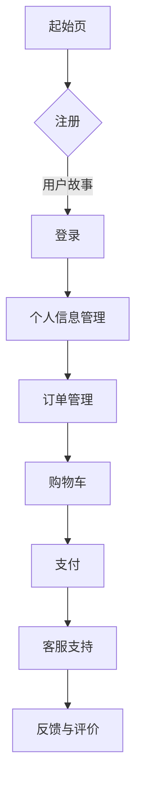

#### 2.3.2 看板（Kanban）

看板是一种可视化工作管理工具，用于展示团队的工作流程和进度。通过看板，团队可以实时监控需求的状态和优先级，及时发现和解决问题。

**Mermaid 流程图示例**：

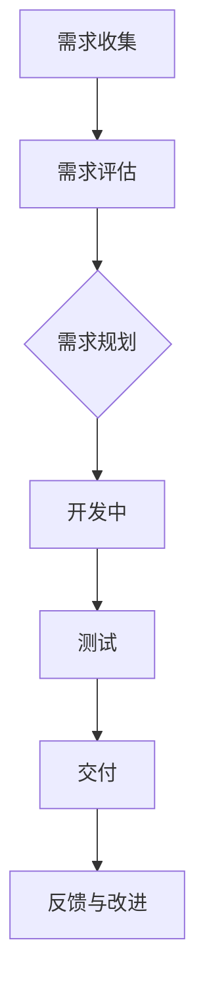

#### 2.3.3 瀑布图（Waterfall）

瀑布图是一种传统的需求管理工具，用于展示需求从收集到实现的全过程。虽然瀑布图在敏捷研发中不常用，但在某些情况下，它可以帮助团队更好地理解需求优先级和开发进度。

**Mermaid 流程图示例**：

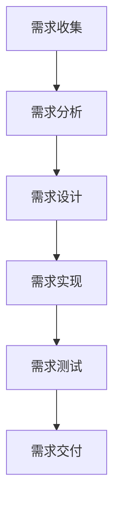

#### 2.3.4 故障树分析（Fault Tree Analysis）

故障树分析是一种用于识别和评估需求优先级的方法。通过构建故障树，团队可以了解需求的潜在问题和风险，并优先解决关键问题。

**Mermaid 流程图示例**：

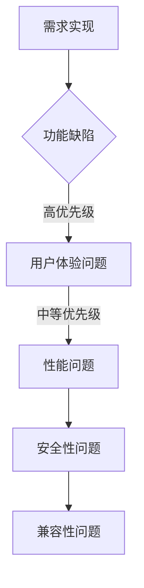

通过以上工具和技巧，团队可以更有效地管理需求优先级，确保敏捷研发过程中的需求得到合理排序和高效实现。

### 第二部分：需求优先级定义与评估

#### 2.4 需求优先级管理中的常见问题与挑战

在敏捷研发过程中，需求优先级的管理虽然重要，但也面临许多挑战和问题。以下是一些常见的问题和相应的解决方法：

#### 2.4.1 需求变更频繁

**问题**：在敏捷研发中，客户需求经常发生变化，导致需求优先级频繁调整。

**解决方法**：采用迭代和增量开发的方法，确保需求变更可以及时纳入项目计划。同时，使用用户故事地图等可视化工具，帮助团队更好地理解和管理需求变更。

**伪代码示例**：

```python
def manage_change_request(change_request):
    if change_request.is_high_priority():
        update_requirement_priority(change_request)
        schedule_new_iterative_cycle()
    else:
        document_change_request_for_future_reference()
```

#### 2.4.2 需求模糊不清

**问题**：部分需求描述不明确，导致团队在实现时产生分歧。

**解决方法**：加强需求分析阶段的工作，确保需求描述清晰明确。采用用户故事编写规范，如As a user, I want to...，以提高需求的可理解性。

**伪代码示例**：

```python
def clarify_requirement(requirement):
    if is_requirement_fuzzy(requirement):
        gather更多用户需求细节
        update_requirement_description(requirement)
    else:
        validate_requirement_comprehension()
```

#### 2.4.3 资源分配不当

**问题**：在资源有限的情况下，需求优先级管理不当可能导致关键需求无法及时实现。

**解决方法**：采用资源分配优化算法，如最优化分配算法，确保资源被高效利用。同时，定期审查需求优先级，根据实际情况进行调整。

**伪代码示例**：

```python
def allocate_resources(available_resources, requirements):
    optimal_allocation = optimize_resource_allocation(available_resources, requirements)
    assign_resources_to_requirements(optimal_allocation)
```

#### 2.4.4 缺乏客户参与

**问题**：在需求实现过程中，客户参与不足可能导致需求无法满足实际需求。

**解决方法**：建立有效的沟通机制，确保客户在需求分析和实现过程中持续参与。定期组织客户反馈会议，收集客户意见，及时调整需求。

**伪代码示例**：

```python
def ensure_client_involvement(client):
    if client.is_unresponsive():
        schedule_client_meeting()
        gather_client_feedback()
    else:
        validate_client_satisfaction()
```

通过识别和解决这些常见问题，团队可以更有效地管理需求优先级，确保敏捷研发过程的顺利进行。

### 第三部分：需求优先级冲突解决策略

在敏捷研发过程中，需求优先级冲突是一种常见且复杂的问题。冲突可能源于不同的利益相关者对需求的重要性有不同的看法，或者是因为资源有限而无法同时满足所有需求。为了有效地解决这些冲突，我们需要采取一系列的策略和原则。

#### 3.1 冲突解决原则

解决需求优先级冲突时，应遵循以下原则：

1. **以客户价值为导向**：确保所有冲突解决决策都基于客户价值最大化的原则。
2. **透明和公正**：冲突解决过程应保持透明，确保所有利益相关者都能理解和接受决策。
3. **灵活性和适应性**：根据项目进展和外部环境的变化，灵活调整需求优先级。
4. **沟通和协作**：加强团队成员和利益相关者之间的沟通和协作，共同寻找解决方案。
5. **优先解决高风险需求**：在资源有限的情况下，优先解决可能导致项目失败的高风险需求。

#### 3.2 冲突解决策略

以下是一些常用的需求优先级冲突解决策略：

##### 3.2.1 协商与谈判

协商与谈判是一种通过对话和妥协来解决冲突的方法。团队可以组织利益相关者进行面对面的讨论，共同寻找一个双方都能接受的解决方案。

**Mermaid 流程图示例**：

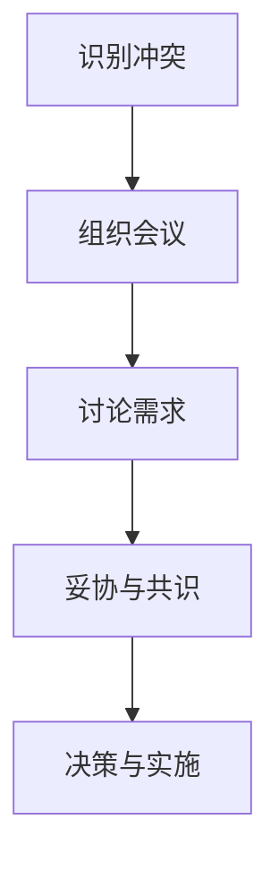

##### 3.2.2 资源分配优化

当资源有限时，通过优化资源分配来缓解需求优先级冲突是一种有效的方法。这可以通过资源分配算法来实现，如最优化分配算法。

**伪代码示例**：

```python
def optimize_resource_allocation(available_resources, requirements):
    # 使用优化算法分配资源
    optimal_allocation = optimize_allocation(available_resources, requirements)
    return optimal_allocation
```

##### 3.2.3 动态优先级调整

在敏捷研发过程中，需求优先级不是一成不变的。随着项目的进展和外部环境的变化，需求优先级需要动态调整。通过定期的优先级审查和调整，可以确保项目始终朝着正确的方向前进。

**Mermaid 流�程图示例**：

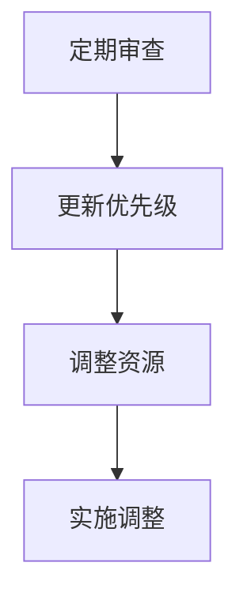

##### 3.2.4 风险管理

在解决需求优先级冲突时，应考虑需求实现过程中的风险。通过识别和管理风险，可以确保项目在面临挑战时能够保持稳定。

**伪代码示例**：

```python
def manage_risk(requirement):
    if requirement.has_high_risk():
        implement_risk_mitigation_strategy()
    else:
        monitor_requirement_progress()
```

##### 3.2.5 敏捷工具支持

使用敏捷工具，如看板（Kanban）和Scrum，可以帮助团队更好地管理和解决需求优先级冲突。这些工具提供了可视化的工作流程和进度跟踪，有助于团队成员及时发现和解决问题。

**Mermaid 流程图示例**：

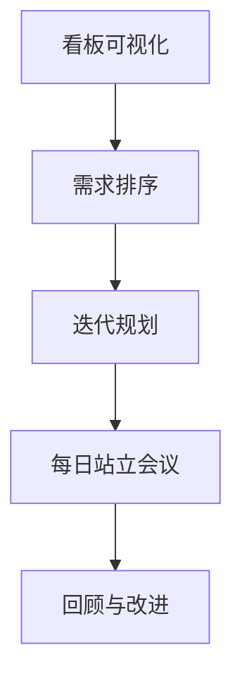

通过以上策略和原则，团队可以更有效地解决需求优先级冲突，确保敏捷研发过程的顺利进行。

### 第三部分：需求优先级冲突解决策略

#### 3.3 冲突解决工具与技术

在敏捷研发中，需求优先级冲突的解决不仅需要策略和原则的指导，还需要借助一系列的工具和技术。以下是一些常用的冲突解决工具和技术：

##### 3.3.1 敏捷看板（Kanban）

敏捷看板是一种基于可视化工作的管理工具，它通过看板（Kanban Board）将工作流程可视化，帮助团队更好地理解和优化工作流程。看板通常包括三个主要区域：待办（To Do）、进行中（In Progress）和已完成（Done）。

**看板示例**：

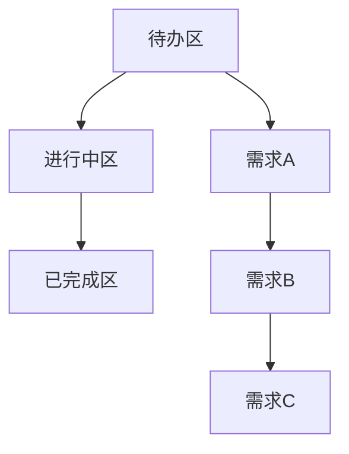

##### 3.3.2 Scrum框架

Scrum是一种流行的敏捷开发框架，它包括了一系列的实践和仪式，如每日站立会议（Daily Stand-up）、冲刺回顾（Sprint Review）和迭代规划（Sprint Planning）。这些仪式有助于团队在项目开发过程中保持透明度和高效的沟通。

**Scrum流程图示例**：

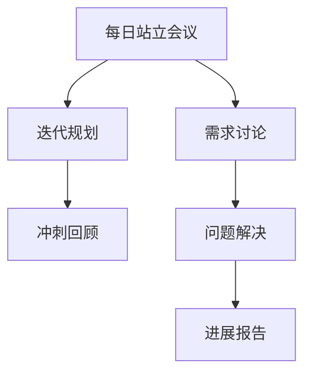

##### 3.3.3 用户故事地图（User Story Map）

用户故事地图是一种帮助团队理解用户需求和使用场景的视觉工具。它将用户故事按照优先级和层次结构排列，有助于团队更好地规划和实施需求。

**用户故事地图示例**：

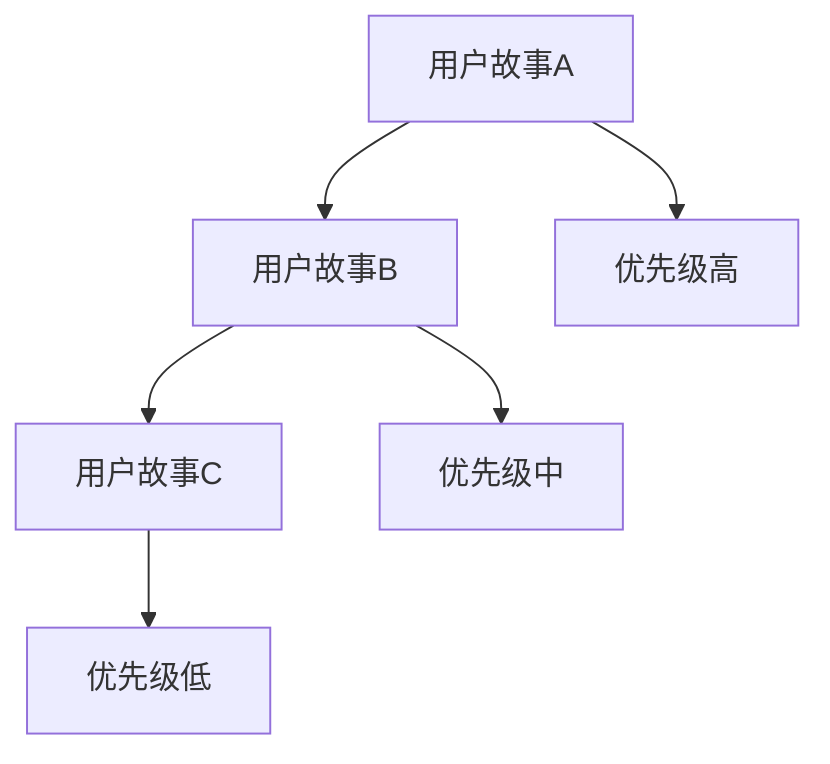

##### 3.3.4 敏捷工具集成

为了提高效率，团队可以将不同的敏捷工具集成在一起，如JIRA、Trello和Asana等。这些工具提供了任务管理、工作流程可视化、协作等功能，有助于团队更好地协调和解决问题。

**集成工具示例**：

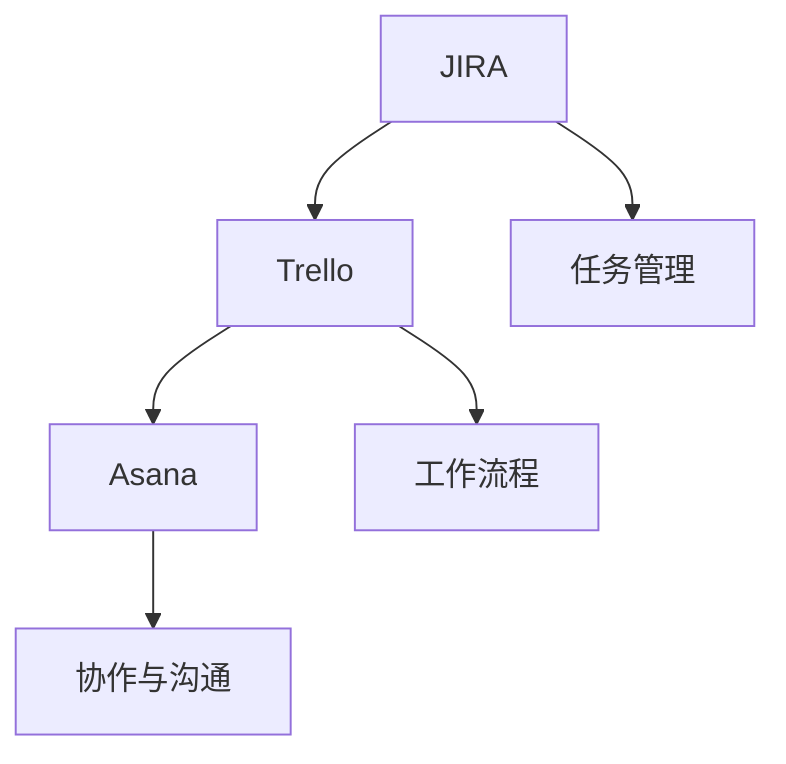

通过使用这些工具和技术，团队可以更有效地解决需求优先级冲突，提高敏捷研发的效率和质量。

### 第四部分：实战案例分析

为了更好地理解需求优先级冲突的解决策略，我们通过两个实际案例来探讨这些策略在现实中的应用效果。

#### 4.1 案例一：XX公司的需求优先级管理实践

**背景**：XX公司是一家从事移动应用开发的公司，客户需求多样且变化频繁。在敏捷研发过程中，需求优先级管理成为一个关键挑战。

**需求优先级管理方法**：

1. **用户故事地图**：团队使用用户故事地图来梳理和排序客户需求，确保每个需求都能被清晰识别和优先级排序。

2. **客户参与**：团队定期与客户进行沟通，了解最新的需求变化和优先级调整，确保需求管理过程的透明性和灵活性。

3. **风险评估**：对每个需求进行风险评估，识别潜在风险，并根据风险程度调整需求优先级。

4. **迭代规划**：团队采用Scrum框架进行迭代规划，确保每次迭代都能交付有价值的软件功能。

**实践效果分析**：

- **客户满意度提高**：通过用户故事地图和客户参与，需求管理更加透明和灵活，客户的需求得到更好满足，客户满意度显著提高。
- **项目进度可控**：通过风险评估和迭代规划，团队能够更好地控制项目进度，减少需求变更对项目的影响。
- **团队协作增强**：Scrum框架和敏捷工具的集成，提高了团队协作效率和沟通效果，减少了冲突和误解。

#### 4.2 案例二：YY公司的冲突解决策略

**背景**：YY公司是一家软件开发企业，项目需求复杂，利益相关者众多，需求优先级冲突频繁。

**冲突解决过程**：

1. **协商与谈判**：团队组织利益相关者进行面对面的协商和谈判，共同讨论并确定需求优先级。

2. **资源优化分配**：通过最优化分配算法，合理分配项目资源，确保关键需求得到优先处理。

3. **动态优先级调整**：团队定期审查需求优先级，根据项目进展和外部环境变化，灵活调整需求优先级。

4. **风险管理**：对每个需求进行风险评估，确保高风险需求得到及时解决，减少项目风险。

**解决效果与启示**：

- **资源利用效率提高**：通过资源优化分配和动态优先级调整，团队能够更高效地利用资源，提高项目成功率。
- **冲突减少**：通过协商与谈判和风险管理，需求优先级冲突得到有效缓解，团队协作更加顺畅。
- **项目质量提升**：通过合理的需求优先级管理和冲突解决策略，项目质量得到显著提高，客户满意度增加。

通过以上两个案例，我们可以看到，需求优先级冲突在敏捷研发中的重要性以及有效的解决策略对项目成功的关键作用。这些实践为其他企业提供了宝贵的经验和启示。

### 第五部分：敏捷研发模式下的需求优先级冲突解决工具与资源

在敏捷研发模式下，有效地解决需求优先级冲突是确保项目成功的关键。以下是一些实用的工具和资源，可以帮助团队更好地管理需求优先级和解决冲突。

#### 5.1 工具介绍

1. **JIRA**
   - **功能**：任务管理、敏捷看板、报告生成等。
   - **链接**：[JIRA官网](https://www.atlassian.com/software/jira)

2. **Trello**
   - **功能**：任务管理、看板可视化、协作等。
   - **链接**：[Trello官网](https://trello.com/)

3. **Asana**
   - **功能**：任务管理、项目进度跟踪、协作等。
   - **链接**：[Asana官网](https://asana.com/)

4. **Microsoft Teams**
   - **功能**：团队协作、沟通、文件共享等。
   - **链接**：[Microsoft Teams官网](https://www.microsoft.com/en-us/microsoft-365/microsoft-teams)

5. **Slack**
   - **功能**：即时通讯、协作、集成其他工具等。
   - **链接**：[Slack官网](https://slack.com/)

#### 5.2 资源推荐

1. **书籍推荐**
   - 《敏捷开发实践指南》（Agile Project Management with Scrum） - Michael J. Cohn
   - 《敏捷实践指南》（The Agile Project Guide） - Ryan Martens
   - 《用户故事映射》（User Story Mapping） - Jeff Patton

2. **在线课程与培训**
   - Scrum联盟（Scrum Alliance）提供的Scrum认证课程
   - LinkedIn Learning上的敏捷开发相关课程
   - Udemy上的敏捷项目管理课程

3. **社区与论坛**
   - 敏捷联盟（Agile Alliance）官网
   - 敏捷实践社区（Agile Community）
   - Scrum.org

4. **博客与文章**
   - 《敏捷研发下的需求管理》（Agile Requirements Management） - Michael Nir
   - 《需求优先级冲突解决技巧》（Handling Requirements Priority Conflicts） - Steve Berczuk
   - 《敏捷研发中的需求排序与优先级管理》（Requirements Sorting and Prioritizing in Agile Development） - Jim Highsmith

通过使用这些工具和资源，团队可以更好地管理需求优先级，解决冲突，提高敏捷研发的效率和项目成功率。

### 总结与展望

在本文中，我们详细探讨了敏捷研发模式下需求优先级冲突的问题及其解决策略。首先，我们介绍了敏捷研发模式的基本概念和流程，强调了需求优先级在敏捷研发中的重要性。接着，我们讨论了需求优先级的定义、评估方法以及管理工具。在解决冲突的策略部分，我们提出了协商与谈判、资源优化分配、动态优先级调整和风险管理等方法。最后，通过实际案例展示了这些策略在现实中的应用效果，并提供了一系列实用的工具和资源。

总结来说，需求优先级冲突在敏捷研发中是一个复杂但重要的问题。通过有效的需求管理策略和工具，团队可以更好地应对需求变更和冲突，提高项目成功率和客户满意度。未来的研究可以进一步探讨如何将人工智能技术应用于需求管理和优先级冲突解决，以实现更加智能和高效的敏捷研发。

### 拓展阅读与最佳实践

#### 1. 拓展阅读

- 《敏捷实践指南》（The Agile Practice Guide）- PMI出版，详细介绍了敏捷实践的核心原则和具体应用。
- 《需求工程：需求分析和实施》（Requirements Engineering: A Case-Based Guide）- argitekt出版，提供了全面的案例分析和技术方法。
- 《敏捷项目管理：实践指南》（Agile Project Management: Creating Innovative Systems in Crisis）- Ken Schwaber和Jeff Sutherland合著，深入讲解了敏捷项目管理的方法和技巧。

#### 2. 最佳实践

- **定期需求回顾**：团队应定期进行需求回顾，及时调整优先级，确保项目始终聚焦于最重要和最紧急的需求。
- **优先级可视化**：使用看板、用户故事地图等工具将需求优先级可视化，有助于团队成员更好地理解和执行。
- **风险管理**：对需求进行风险评估，将高风险需求置于更高优先级，确保项目安全。
- **客户参与**：保持与客户的紧密沟通，确保需求优先级调整符合客户期望，提高客户满意度。

#### 3. 注意事项

- **避免频繁变更**：尽量减少需求变更的频率，以避免对项目进度和质量产生负面影响。
- **平衡需求与资源**：合理分配资源，确保高优先级需求得到足够关注。
- **持续改进**：不断总结经验教训，优化需求管理流程和策略。

通过遵循这些最佳实践和注意事项，团队可以更加高效地管理需求优先级和解决冲突，实现敏捷研发的目标。希望本文对您在实践敏捷研发过程中有所帮助。如果您有任何问题或建议，欢迎在评论区留言，让我们共同交流学习。再次感谢您的阅读！

---

**作者：AI天才研究院/AI Genius Institute & 禅与计算机程序设计艺术 /Zen And The Art of Computer Programming**。本文为作者原创，未经授权，不得转载和使用。如需引用或转载，请务必注明出处。谢谢合作！

