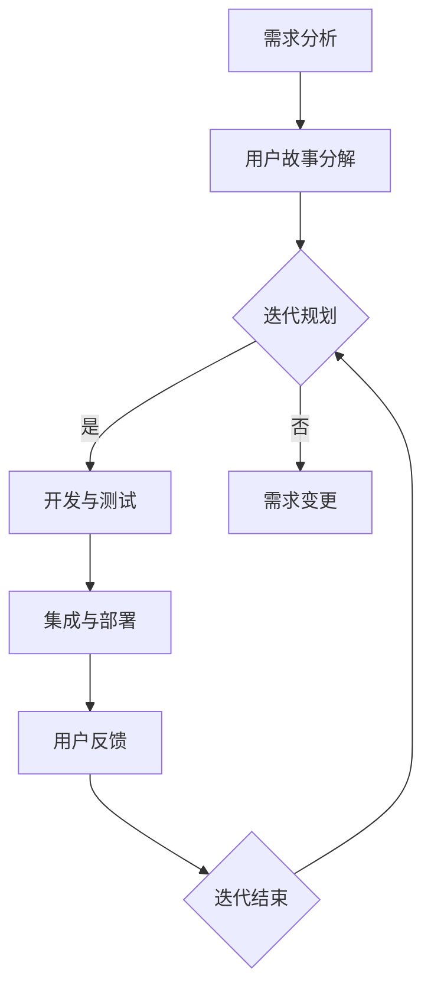

                 


### 1.2 敏捷研发与传统开发模式对比

#### 背景介绍

在传统的软件开发模式中，开发团队通常按照固定的计划进行工作，项目通常分为多个阶段，如需求分析、设计、开发、测试和部署。这种模式强调文档的详尽性和过程的规范性。然而，随着市场需求的快速变化和技术的不断演进，传统开发模式逐渐显露出其不足之处：

1. **对变更的适应能力较弱**：在传统模式下，需求变更通常被视为项目风险，可能会引起项目延期或成本增加。
2. **沟通效率低下**：传统的文档驱动模式导致开发人员与需求方之间的沟通成本较高，信息传递过程中容易出现偏差。
3. **客户满意度低**：由于开发周期较长，客户可能无法及时得到反馈，导致最终产品与需求之间存在较大差异。

相比之下，敏捷研发模式则更加灵活和动态。敏捷开发强调持续交付有价值的软件，通过短周期迭代（通常为两周）不断与客户进行沟通和反馈，从而实现需求的变化和优化。

#### 核心概念与联系

**敏捷研发模式**：
- **迭代开发**：开发过程被划分为多个短周期（迭代），每个迭代都会交付一个可工作的软件版本。
- **增量式交付**：软件功能以小规模、逐步增加的方式进行交付，确保客户能够尽早使用到产品。
- **用户故事**：用户需求被分解为用户故事，每个故事都描述了一个用户的需求和场景。
- **持续集成与测试**：代码不断集成和测试，确保软件的稳定性和质量。

**传统开发模式**：
- **瀑布模型**：开发过程按照需求分析、设计、开发、测试、部署等阶段依次进行。
- **文档驱动**：需求、设计和测试文档是项目的基础，开发工作主要围绕这些文档进行。
- **固定计划**：项目计划在开始时就确定，后续的变更通常需要经过严格的审批流程。

**敏捷研发与传统开发模式之间的联系与区别**：

| **特性** | **敏捷研发** | **传统开发模式** |
| --- | --- | --- |
| **项目管理** | 强调团队自组织和迭代过程 | 强调计划性和过程管理 |
| **需求变更** | 接受并鼓励需求变更 | 视需求变为项目风险 |
| **交付周期** | 短周期迭代，持续交付 | 长期周期，阶段性交付 |
| **团队协作** | 高度协作，跨职能团队 | 单一职能分工，较少协作 |
| **客户参与** | 持续客户参与，及时反馈 | 初期需求明确，后期参与较少 |

#### Mermaid流程图：敏捷研发流程示例



在这个流程图中，A表示需求分析，B表示用户故事分解，C表示迭代规划，D表示开发与测试，E表示需求变更，F表示集成与部署，G表示用户反馈，H表示迭代结束。通过迭代循环，确保每次迭代都能交付有价值的软件，同时不断调整和优化需求。

#### 核心算法原理讲解

敏捷研发模式的核心算法原理可以概括为以下几点：

1. **用户故事地图**：将用户需求分解为用户故事，并通过地图形式展示不同用户故事之间的关系。
   ```mermaid
   graph TD
       A[用户故事A]
       B[用户故事B]
       C[用户故事C]
       A --> B
       B --> C
   ```

2. **迭代计划**：根据用户故事地图和团队的能力，制定每个迭代的工作计划和目标。
   ```mermaid
   graph TD
       A[迭代1] --> B[用户故事1]
       A --> C[用户故事2]
       D[迭代2] --> E[用户故事3]
       D --> F[用户故事4]
   ```

3. **迭代回顾**：在每个迭代结束后，团队会进行回顾会议，总结经验和教训，为下一个迭代做准备。

#### 数学模型和公式

在敏捷研发中，可以采用一些数学模型来评估项目进度和团队效率。以下是一个简单的示例：

- **进度评估模型**：

  设 \( P_t \) 为第 \( t \) 个迭代结束时项目的完成进度，\( S_t \) 为第 \( t \) 个迭代开始时的预估工作量，\( C_t \) 为第 \( t \) 个迭代实际完成的工作量。
  $$ P_t = \frac{C_t}{S_t} $$

- **团队效率评估模型**：

  设 \( E_t \) 为第 \( t \) 个迭代结束时的团队效率，\( T_t \) 为第 \( t \) 个迭代实际工作时间，\( B_t \) 为第 \( t \) 个迭代预估工作时间。
  $$ E_t = \frac{C_t}{T_t} $$

#### 举例说明

假设在一个两个迭代的敏捷项目中，第一个迭代开始时的预估工作量 \( S_1 \) 为100小时，实际完成的工作量 \( C_1 \) 为80小时；第二个迭代开始时的预估工作量 \( S_2 \) 为150小时，实际完成的工作量 \( C_2 \) 为130小时。根据上述模型，可以计算出项目的进度和团队效率：

- **第一个迭代进度**：
  $$ P_1 = \frac{C_1}{S_1} = \frac{80}{100} = 0.8 $$

- **第二个迭代进度**：
  $$ P_2 = \frac{C_2}{S_2} = \frac{130}{150} = 0.87 $$

- **团队效率**：
  $$ E_1 = \frac{C_1}{T_1} = \frac{80}{T_1} $$
  $$ E_2 = \frac{C_2}{T_2} = \frac{130}{T_2} $$

假设第一个迭代实际工作时间为40小时，第二个迭代实际工作时间为50小时，可以计算出：

- **第一个迭代团队效率**：
  $$ E_1 = \frac{80}{40} = 2 $$

- **第二个迭代团队效率**：
  $$ E_2 = \frac{130}{50} = 2.6 $$

通过这些计算，可以评估项目的进展情况和团队的工作效率，为后续的迭代计划提供参考。

#### 项目实战

**开发环境搭建**

为了进行敏捷开发，我们需要搭建一个合适的环境。以下是开发环境搭建的步骤：

1. 安装JDK 1.8或更高版本。
2. 安装Git版本控制工具。
3. 安装Maven构建工具。
4. 安装IDE（如IntelliJ IDEA或Eclipse）。
5. 安装数据库（如MySQL或PostgreSQL）。

**源代码实现**

以下是一个简单的用户故事管理系统的源代码实现：

```java
// UserStory.java
public class UserStory {
    private String id;
    private String title;
    private String description;
    private boolean isCompleted;

    public UserStory(String id, String title, String description) {
        this.id = id;
        this.title = title;
        this.description = description;
        this.isCompleted = false;
    }

    // Getters and Setters

    public void complete() {
        this.isCompleted = true;
    }

    public boolean isCompleted() {
        return this.isCompleted;
    }
}

// UserStoryManager.java
import java.util.HashMap;
import java.util.Map;

public class UserStoryManager {
    private Map<String, UserStory> userStories;

    public UserStoryManager() {
        this.userStories = new HashMap<>();
    }

    public void addUserStory(UserStory userStory) {
        this.userStories.put(userStory.getId(), userStory);
    }

    public UserStory getUserStory(String id) {
        return this.userStories.get(id);
    }

    public void completeUserStory(String id) {
        UserStory userStory = this.userStories.get(id);
        if (userStory != null) {
            userStory.complete();
        }
    }
}
```

**代码解读与分析**

上述代码定义了两个类：`UserStory` 和 `UserStoryManager`。`UserStory` 类表示一个用户故事，包括ID、标题、描述和完成状态。`UserStoryManager` 类负责管理用户故事，包括添加、获取和完成用户故事。

**实际案例分析和详细讲解剖析**

假设我们有一个用户故事管理系统，要求实现以下功能：

1. 添加用户故事。
2. 获取用户故事。
3. 完成用户故事。

通过上述代码，我们可以实现这些功能。以下是一个简单的使用示例：

```java
public class Main {
    public static void main(String[] args) {
        UserStoryManager userStoryManager = new UserStoryManager();

        // 添加用户故事
        UserStory userStory1 = new UserStory("1", "用户故事1", "描述用户故事1");
        UserStory userStory2 = new UserStory("2", "用户故事2", "描述用户故事2");
        userStoryManager.addUserStory(userStory1);
        userStoryManager.addUserStory(userStory2);

        // 获取用户故事
        UserStory userStory = userStoryManager.getUserStory("1");
        System.out.println("用户故事ID: " + userStory.getId());
        System.out.println("用户故事标题: " + userStory.getTitle());
        System.out.println("用户故事描述: " + userStory.getDescription());

        // 完成用户故事
        userStoryManager.completeUserStory("1");
        if (userStory1.isCompleted()) {
            System.out.println("用户故事1已完成");
        }
    }
}
```

输出结果：
```
用户故事ID: 1
用户故事标题: 用户故事1
用户故事描述: 描述用户故事1
用户故事1已完成
```

在这个示例中，我们首先创建了一个 `UserStoryManager` 对象，然后添加了两个用户故事。接着，我们通过 `getUserStory` 方法获取了ID为1的用户故事，并打印了其标题和描述。最后，我们调用 `completeUserStory` 方法将用户故事1标记为完成。

**项目小结**

通过这个简单的用户故事管理系统示例，我们可以看到敏捷研发模式的核心思想：快速迭代、持续交付和持续反馈。在这个项目中，我们通过不断迭代的方式实现了用户故事的管理功能，每次迭代都会交付一个可工作的软件版本。同时，通过用户反馈和需求变更，我们能够不断优化和改进系统。

#### 最佳实践 tips、小结、注意事项、拓展阅读等内容

**最佳实践 tips**：

1. **频繁的迭代会议**：确保团队成员在每次迭代开始和结束时都进行充分的讨论和规划。
2. **持续集成**：使用自动化工具进行代码集成和测试，确保每次迭代交付的都是可工作的软件。
3. **用户故事地图**：使用用户故事地图来明确每个迭代的目标和优先级。

**小结**：

敏捷研发模式通过短周期迭代和持续反馈，提高了项目的灵活性和响应速度，有助于满足不断变化的需求。与传统开发模式相比，敏捷研发模式更加注重团队协作和用户反馈。

**注意事项**：

1. **避免频繁的需求变更**：虽然敏捷研发模式鼓励需求变更，但过频繁的变更可能会影响项目的稳定性和进度。
2. **保持团队协作**：敏捷开发强调团队自组织和协作，确保团队成员之间的沟通畅通。

**拓展阅读**：

1. 《敏捷软件开发：原则、实践与模式》
2. 《用户故事地图：敏捷需求管理》
3. 《Scrum：敏捷项目管理实践指南》

---

通过以上内容，我们详细介绍了敏捷研发模式与传统开发模式的对比，并提供了核心概念、算法原理讲解、数学模型和项目实战案例。这为读者提供了全面的理解和实际操作指导，有助于更好地应用敏捷研发模式进行需求沟通和项目开发。接下来，我们将进一步探讨敏捷环境下的需求沟通特点，分析其中的挑战，并提供相应的解决策略。让我们继续深入探讨这个主题。

