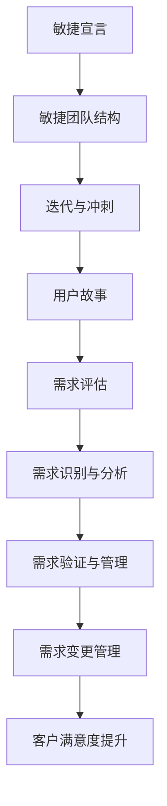

                 

### 第1章 引言

#### 1.1 敏捷研发模式的背景与重要性

敏捷研发模式（Agile Development）起源于20世纪90年代末期，是对传统瀑布式开发方法的一种反思和改进。在传统的瀑布式开发模式中，项目按照严格的顺序进行，从需求分析到设计、开发、测试，每个阶段必须完成才能进入下一个阶段。这种方法虽然结构清晰，但灵活性较差，无法快速响应市场需求的变化，常常导致项目延期和预算超支。

随着互联网的兴起和软件行业的快速发展，市场对软件产品的需求变得日益多样化和快速变化。敏捷研发模式正是在这种背景下产生，旨在通过灵活、迭代和持续改进的方法，快速响应市场变化，提高软件开发效率。

敏捷研发模式的核心价值在于其注重客户需求、快速反馈和持续交付。通过将项目分解为多个小型迭代，每个迭代都可以交付一个具有实际价值的软件版本，客户可以实时查看和反馈，开发团队可以据此进行调整。这种方法不仅提高了项目的成功率，还增强了团队的合作和沟通。

在敏捷研发模式中，需求评估扮演着至关重要的角色。需求评估是指对用户需求进行详细分析和评估，以确定其可行性和优先级。在敏捷开发中，需求评估不仅是一个阶段性工作，更是一个持续的过程。通过及时的需求评估，开发团队可以确保每个迭代中的工作都是围绕最关键的用户需求进行的，从而最大化地实现客户价值。

#### 1.2 需求评估在敏捷研发模式下的关键角色

需求评估在敏捷研发模式中具有以下几个关键角色：

1. **确定优先级**：在敏捷开发中，需求经常发生变化。通过需求评估，开发团队可以确定哪些需求是最重要的，优先进行开发。这有助于确保团队的工作始终聚焦于最重要的用户需求，提高开发效率。

2. **识别风险**：需求评估可以帮助团队识别潜在的风险，如需求不明确、技术难题等。提前识别这些风险，可以帮助团队制定相应的应对策略，降低项目失败的风险。

3. **确保需求实现**：通过需求评估，团队可以确保每个需求都被准确理解和实现。这有助于避免需求遗漏或者实现不当的情况，提高软件质量。

4. **持续改进**：敏捷开发强调持续改进。需求评估可以帮助团队不断优化需求管理流程，改进开发方法，提高团队的整体效能。

5. **提升客户满意度**：通过及时的需求评估，开发团队可以快速响应用户需求的变化，提高软件产品的质量和客户满意度。

总之，在敏捷研发模式下，需求评估不仅是一个关键过程，更是实现敏捷开发成功的关键因素之一。只有通过科学、有效的需求评估，开发团队才能确保项目顺利推进，实现客户价值最大化。在下一章中，我们将深入探讨敏捷研发模式和需求评估的核心概念及其相互关系。

### 第2章 核心概念与联系

在深入讨论敏捷研发模式和需求评估之前，我们需要明确这两个概念的核心要素及其相互之间的联系。本章将分别介绍敏捷研发模式的核心概念和需求评估的关键概念，并通过Mermaid流程图展示它们之间的联系，以便读者能够更清晰地理解整个体系。

#### 2.1 敏捷研发模式核心概念

**2.1.1 敏捷宣言**

敏捷宣言（Manifesto for Agile Software Development）是敏捷开发模式的基石。它由17位软件开发领域的专家共同签署，宣言的内容如下：

```
我们更倾向于
虽然敏捷开发强调个人和互动胜过过程和工具，
工作的软件胜过详尽的文档，
客户合作胜过合同谈判，
响应变化胜过遵循计划。
```

敏捷宣言的核心思想是：强调人与互动的重要性，重视工作软件的实际价值，重视客户合作和应对变化的能力。

**2.1.2 敏捷团队结构**

敏捷团队通常由多功能、跨学科的成员组成，包括产品负责人（Product Owner）、开发人员、测试人员、设计师等。这种结构有助于团队成员之间紧密合作，快速响应项目需求。

- **产品负责人**：代表客户利益，负责制定产品愿景和优先级，确保团队始终专注于最高优先级的需求。
- **开发人员**：负责实际编写代码，实现产品功能。
- **测试人员**：负责确保软件质量，发现并修复缺陷。
- **设计师**：负责产品界面和用户体验的设计。

**2.1.3 敏捷开发方法论**

敏捷开发采用迭代和增量的方法进行软件开发。每个迭代周期（通常为2-4周）都会生成一个可交付的产品版本。这种方法有助于团队快速反馈、持续改进，并及时调整开发方向。

- **用户故事**：用户故事（User Story）是敏捷开发中的需求表达方式。每个用户故事描述一个具体的功能或特性，通常以“作为[用户]，我想要[功能]，以便[目的）”的格式编写。
- **迭代**：迭代（Iteration）是敏捷开发的基本周期，每个迭代都会完成一定量的用户故事。每个迭代结束后，团队会进行评审和回顾，以便不断改进。
- **冲刺**：冲刺（Sprint）是迭代的子周期，通常持续2-4周。在每个冲刺中，团队会选择一定数量的用户故事进行开发。

#### 2.2 需求评估关键概念

**2.2.1 需求定义**

需求（Requirement）是指用户或客户对软件产品的期望和需求。需求可以分为功能需求和非功能需求：

- **功能需求**：描述软件产品应具备的功能，如用户登录、数据查询等。
- **非功能需求**：描述软件产品的性能、安全性、可靠性等，如响应时间、系统容量等。

**2.2.2 需求分类**

需求可以分为以下几种类型：

- **用户故事**：基于用户角度描述的功能需求，通常用于敏捷开发中。
- **需求文档**：详细描述功能需求和非功能需求的文档，通常用于传统开发模式中。
- **需求变更**：在项目开发过程中，由于市场变化或客户需求调整而产生的需求变更。

**2.2.3 需求评估**

需求评估是指对需求进行分析和评估，以确定其可行性、优先级和实现难度。需求评估通常包括以下步骤：

1. **需求识别**：收集和理解用户需求。
2. **需求分析**：分析需求的可行性、优先级和实现难度。
3. **需求验证**：验证需求是否满足用户和业务需求。
4. **需求管理**：跟踪和管理需求变更，确保需求得到及时更新和实现。

#### 2.3 敏捷研发模式与需求评估概念联系图

为了更清晰地展示敏捷研发模式与需求评估之间的联系，我们可以使用Mermaid流程图进行描述：



这个流程图展示了敏捷研发模式与需求评估之间的关键环节和相互关系。通过需求评估，敏捷团队可以更好地理解客户需求，优化开发流程，提高客户满意度。

在下一章中，我们将详细讲解需求评估方法，包括优先级排序算法、风险评估算法和需求变更管理算法，以便读者能够深入理解并应用于实际项目中。同时，我们还将介绍需求评估中的数学模型，为后续的实战案例提供理论基础。

### 第3章 需求评估方法

在敏捷研发模式中，需求评估是一个持续、动态的过程，它不仅涉及对需求的识别和理解，还包括优先级排序、风险评估和需求变更管理等多个方面。本章将详细介绍这三种核心算法的原理，并通过伪代码展示其实现过程，以帮助读者深入理解需求评估方法。

#### 3.1 优先级排序算法

优先级排序算法是需求评估中的关键步骤，它的目的是确定哪些需求应该优先实现，以确保资源得到最有效的利用。以下是一个简单的优先级排序算法的伪代码：

```pseudo
function priority_sort(需求列表):
    1. 初始化需求列表为一个未排序的列表
    2. 遍历需求列表，根据以下条件对需求进行排序：
        a. 功能性需求优先于非功能性需求
        b. 客户需求优先于内部需求
        c. 优先级高的需求排在前面
    3. 返回排序后的需求列表

需求排序条件示例：
需求优先级 = 功能性权重 * 客户需求权重 * 实现难度权重
```

通过这个算法，开发团队可以根据需求的重要性、实现难度等因素，对需求进行排序，从而确保资源被优先分配给最关键的需求。

#### 3.2 风险评估算法

在需求评估过程中，风险评估是一个重要的环节。它旨在识别和评估需求实现过程中可能遇到的风险，并制定相应的应对策略。以下是一个风险评估算法的伪代码：

```pseudo
function risk_assessment(需求列表):
    1. 初始化需求列表为一个未评估的列表
    2. 对于每个需求，执行以下步骤：
        a. 识别潜在风险，例如需求不明确、技术难度大、依赖第三方服务等
        b. 评估每个风险的概率和影响，可以使用概率-影响矩阵进行评估
        c. 根据风险概率和影响，计算总风险值
    3. 将需求与其风险值关联，形成评估结果列表
    4. 返回评估结果列表

风险概率-影响矩阵示例：

| 风险       | 低风险  | 中风险  | 高风险  |
|------------|---------|---------|---------|
| 概率       | 1       | 2       | 3       |
| 影响       | 1       | 2       | 3       |
| 风险值     | 1       | 4       | 9       |
```

通过这个算法，开发团队可以全面了解每个需求的风险水平，从而更好地制定风险管理策略。

#### 3.3 需求变更管理算法

需求变更管理是敏捷开发中的一个重要方面。需求变更算法的目的是确保需求变更得到有效管理，避免对项目造成不必要的风险。以下是一个需求变更管理算法的伪代码：

```pseudo
function change_management(原始需求列表，变更请求列表):
    1. 初始化变更管理列表
    2. 对于每个变更请求，执行以下步骤：
        a. 评估变更请求的优先级，可以使用3.1节中介绍的优先级排序算法
        b. 分析变更请求对项目进度、资源和风险的影响
        c. 根据评估结果，决定是否接受变更请求
            - 如果接受，更新原始需求列表
            - 如果拒绝，说明拒绝原因并记录变更请求
    3. 返回更新后的需求列表和变更管理记录

变更影响评估示例：

变更影响评估 = 变更优先级 * 变更对项目进度的影响 * 变更对资源的影响 * 变更对风险的影响
```

通过这个算法，开发团队可以系统性地管理需求变更，确保变更得到有效控制。

通过以上三种算法，开发团队可以更科学、有效地进行需求评估。在下一章中，我们将进一步介绍需求评估中的数学模型，包括需求优先级模型和风险评估模型，以提供更理论化的支持。这些数学模型将为实战案例中的需求评估提供坚实的理论基础。

### 第4章 数学模型

在需求评估过程中，数学模型的使用可以帮助我们更加精确地分析和计算需求的重要性和风险。本章将详细介绍需求优先级模型和风险评估模型，并通过具体的数学公式和举例说明来展示其应用。

#### 4.1 需求优先级模型

需求优先级模型用于确定每个需求在项目中的优先级。该模型通常基于需求的功能性、客户需求程度和实现难度等因素来计算。以下是一个简单的需求优先级模型：

$$
P_i = \frac{F_i \times C_i \times D_i}{T_i}
$$

其中：
- \(P_i\) 表示需求 \(i\) 的优先级。
- \(F_i\) 表示需求 \(i\) 的功能性权重。
- \(C_i\) 表示需求 \(i\) 的客户需求权重。
- \(D_i\) 表示需求 \(i\) 的实现难度权重。
- \(T_i\) 表示需求 \(i\) 的响应时间权重。

**举例说明**：

假设我们有两个需求，需求1和需求2，他们的权重如下：

| 需求 | 功能性权重 \(F_i\) | 客户需求权重 \(C_i\) | 实现难度权重 \(D_i\) | 响应时间权重 \(T_i\) |
|------|-------------------|---------------------|---------------------|-------------------|
| 需求1 | 0.6               | 0.8                 | 0.5                 | 0.7               |
| 需求2 | 0.4               | 0.9                 | 0.7                 | 0.8               |

使用上述公式计算需求优先级：

- 需求1的优先级 \(P_1 = \frac{0.6 \times 0.8 \times 0.5}{0.7} \approx 0.68\)
- 需求2的优先级 \(P_2 = \frac{0.4 \times 0.9 \times 0.7}{0.8} \approx 0.47\)

从计算结果可以看出，需求1的优先级高于需求2。

#### 4.2 风险评估模型

风险评估模型用于计算需求实现过程中的风险值。风险值通常由风险概率和影响程度共同决定。以下是一个简单风险评估模型的数学公式：

$$
R_i = \frac{L_i \times F_i \times D_i}{1000}
$$

其中：
- \(R_i\) 表示需求 \(i\) 的风险值。
- \(L_i\) 表示需求 \(i\) 的风险概率（以百分比表示）。
- \(F_i\) 表示需求 \(i\) 的功能影响程度。
- \(D_i\) 表示需求 \(i\) 的实现难度影响程度。

**举例说明**：

假设我们有两个需求，需求1和需求2，他们的风险概率和影响程度如下：

| 需求 | 风险概率 \(L_i\) | 功能影响程度 \(F_i\) | 实现难度影响程度 \(D_i\) |
|------|-------------------|---------------------|---------------------|
| 需求1 | 10%               | 0.8                 | 0.6                 |
| 需求2 | 20%               | 0.9                 | 0.7                 |

使用上述公式计算需求风险值：

- 需求1的风险值 \(R_1 = \frac{10 \times 0.8 \times 0.6}{1000} = 0.0048\)
- 需求2的风险值 \(R_2 = \frac{20 \times 0.9 \times 0.7}{1000} = 0.0126\)

从计算结果可以看出，需求2的风险值高于需求1。

通过需求优先级模型和风险评估模型，开发团队可以更好地量化需求的重要性和潜在风险，从而为项目决策提供科学依据。这些数学模型不仅提高了需求评估的准确性，也为后续的实战案例提供了理论基础。在下一章中，我们将通过实际项目案例来展示这些模型的应用。

### 第5章 项目实战1

在本章中，我们将通过一个实际项目案例，展示需求评估方法在敏捷研发模式下的应用。本案例将详细描述项目背景、实现过程、代码解读和分析，帮助读者深入理解需求评估方法在实际项目中的应用。

#### 5.1 案例背景

某金融科技公司正在开发一款在线贷款申请平台，该平台旨在为用户提供便捷的贷款申请服务。项目需求包括用户注册、贷款申请、审批流程、贷款额度计算等功能。在项目开发过程中，团队需要采用敏捷研发模式，并利用需求评估方法来确保项目顺利进行。

#### 5.2 实现过程

1. **需求收集与整理**：首先，项目团队与客户进行多次沟通，收集用户需求和业务需求。这些需求包括用户注册、贷款申请、审批流程等。团队使用用户故事的形式整理需求，例如：

   - 作为用户，我想要注册一个账号，以便申请贷款。
   - 作为用户，我想要填写贷款申请表，包括个人信息、贷款金额、还款方式等。
   - 作为审批员，我想要对贷款申请进行审批，并决定是否批准。

2. **需求评估**：团队使用优先级排序算法和风险评估算法对需求进行评估。通过评估，确定了以下需求的优先级和风险值：

   - 用户注册：高优先级，低风险
   - 贷款申请：中优先级，中等风险
   - 审批流程：低优先级，高风险

3. **迭代计划**：根据需求优先级，团队制定了迭代计划。第一个迭代重点关注用户注册和贷款申请功能，第二个迭代重点关注审批流程。

4. **开发与测试**：在第一个迭代中，团队首先实现用户注册功能，包括用户账号的创建、登录和密码找回等。在开发过程中，团队采用TDD（测试驱动开发）方法，确保代码质量。实现代码如下（伪代码）：

   ```java
   public class UserController {
       public void register(String username, String password) {
           // 注册用户账号
           // 验证用户名和密码的有效性
           // 存储用户信息到数据库
       }
       
       public void login(String username, String password) {
           // 用户登录
           // 验证用户名和密码的正确性
           // 返回登录结果
       }
   }
   ```

   完成用户注册功能后，团队进行了功能测试和性能测试，确保功能正确且稳定。

5. **反馈与调整**：在第一个迭代结束时，团队与客户进行了评审，客户对用户注册功能表示满意，并提出了部分优化建议。团队根据客户反馈，对代码进行了优化。

6. **持续迭代**：在第二个迭代中，团队继续开发贷款申请功能。通过需求评估，团队确定了贷款申请的优先级和风险值，并制定了详细的迭代计划。贷款申请功能的实现代码如下（伪代码）：

   ```java
   public class LoanController {
       public void applyLoan(double amount, String repaymentMethod) {
           // 计算贷款金额和还款计划
           // 验证贷款申请是否符合要求
           // 存储贷款申请信息到数据库
       }
   }
   ```

   完成贷款申请功能后，团队进行了全面的测试和调优，确保功能稳定且高效。

7. **项目交付**：在两个迭代后，项目完成了用户注册、贷款申请和审批流程等功能。客户对项目表示满意，项目顺利上线。

#### 5.3 代码解读与分析

在本案例中，项目团队通过需求评估方法，对需求进行了科学、合理的排序和评估，确保项目开发始终围绕最高优先级的需求进行。以下是对关键代码的解读和分析：

1. **用户注册功能**：用户注册是贷款申请平台的基础功能，实现代码简洁、清晰。通过TDD方法，团队确保了代码的可靠性和性能。

2. **贷款申请功能**：贷款申请功能的实现较为复杂，需要计算贷款金额和还款计划。实现代码使用了适当的算法和数据结构，确保计算效率和准确性。

3. **审批流程**：审批流程是项目中的高风险功能，通过需求评估，团队确定了其优先级和风险值。在实现过程中，团队采用了严格的验证和审核机制，确保审批流程的准确性和可靠性。

#### 5.4 实际案例分析和详细讲解剖析

在本案例中，需求评估方法的应用显著提升了项目的成功率和客户满意度。通过科学的需求排序和风险评估，团队确保了项目始终聚焦于最高优先级的需求，避免了资源浪费和项目风险。以下是对实际案例的分析和详细讲解：

1. **优先级排序**：通过优先级排序算法，团队确定了用户注册、贷款申请和审批流程的优先级。这种方法确保了关键功能先于次要功能得到开发，提高了项目的整体效率。

2. **风险评估**：通过风险评估算法，团队识别了项目中的潜在风险，并制定了相应的应对策略。例如，在审批流程中，团队采用了严格的验证和审核机制，降低了审批错误的风险。

3. **迭代开发**：采用敏捷迭代方法，团队在每个迭代中完成了具体的功能模块，并及时进行测试和反馈。这种方法提高了项目的灵活性和响应速度，确保了项目的稳步推进。

4. **客户参与**：在项目开发过程中，团队与客户保持紧密沟通，及时收集客户反馈并进行调整。这种方法不仅提高了客户满意度，还确保了项目的需求准确性和实用性。

#### 5.5 项目小结

通过本案例，我们可以看到需求评估方法在敏捷研发模式下的重要性和实际应用效果。以下是一些项目小结和最佳实践建议：

1. **需求评估是关键**：需求评估是确保项目成功的关键步骤。通过科学的需求排序和风险评估，团队可以确保项目始终聚焦于最高优先级的需求，降低项目风险。

2. **迭代开发提高效率**：敏捷迭代方法提高了项目的灵活性和响应速度，确保了项目的稳步推进。每个迭代都应确保完成具体的功能模块，并及时进行测试和反馈。

3. **客户参与提升满意度**：与客户保持紧密沟通，及时收集客户反馈并进行调整，是提高客户满意度的重要途径。

4. **持续改进**：在项目开发过程中，团队应不断回顾和优化需求管理流程，以提高整体效能。

通过以上最佳实践，开发团队可以在敏捷研发模式下实现高效、高质量的项目交付。

### 第6章 项目实战2

在本章中，我们将通过另一个实际项目案例，展示需求评估方法在敏捷研发模式下的应用。本案例将详细描述项目背景、实现过程、代码解读和分析，帮助读者深入理解需求评估方法在实际项目中的应用。

#### 6.1 案例背景

某电子商务公司正在开发一款在线购物平台，该平台旨在为用户提供便捷的购物体验。项目需求包括用户注册、商品浏览、购物车管理、订单生成和支付等功能。在项目开发过程中，团队需要采用敏捷研发模式，并利用需求评估方法来确保项目顺利进行。

#### 6.2 实现过程

1. **需求收集与整理**：首先，项目团队与客户进行多次沟通，收集用户需求和业务需求。这些需求包括用户注册、商品浏览、购物车管理、订单生成和支付等。团队使用用户故事的形式整理需求，例如：

   - 作为用户，我想要注册一个账号，以便购物。
   - 作为用户，我想要浏览商品，并查看商品详细信息。
   - 作为用户，我想要将商品添加到购物车，以便下单。
   - 作为用户，我想要生成订单并完成支付。

2. **需求评估**：团队使用优先级排序算法和风险评估算法对需求进行评估。通过评估，确定了以下需求的优先级和风险值：

   - 用户注册：高优先级，低风险
   - 商品浏览：高优先级，中等风险
   - 购物车管理：中优先级，中等风险
   - 订单生成：中优先级，低风险
   - 支付功能：低优先级，高风险

3. **迭代计划**：根据需求优先级，团队制定了迭代计划。第一个迭代重点关注用户注册和商品浏览功能，第二个迭代重点关注购物车管理和订单生成，第三个迭代重点关注支付功能。

4. **开发与测试**：在第一个迭代中，团队首先实现用户注册功能，包括用户账号的创建、登录和密码找回等。在开发过程中，团队采用TDD（测试驱动开发）方法，确保代码质量。实现代码如下（伪代码）：

   ```java
   public class UserController {
       public void register(String username, String password) {
           // 注册用户账号
           // 验证用户名和密码的有效性
           // 存储用户信息到数据库
       }
       
       public void login(String username, String password) {
           // 用户登录
           // 验证用户名和密码的正确性
           // 返回登录结果
       }
   }
   ```

   完成用户注册功能后，团队进行了功能测试和性能测试，确保功能正确且稳定。

5. **反馈与调整**：在第一个迭代结束时，团队与客户进行了评审，客户对用户注册功能表示满意，并提出了部分优化建议。团队根据客户反馈，对代码进行了优化。

6. **持续迭代**：在第二个迭代中，团队继续开发商品浏览功能。通过需求评估，团队确定了商品浏览的优先级和风险值，并制定了详细的迭代计划。商品浏览功能的实现代码如下（伪代码）：

   ```java
   public class ProductController {
       public Product detail(String productId) {
           // 查询商品详细信息
           // 返回商品对象
       }
   }
   ```

   完成商品浏览功能后，团队进行了全面的测试和调优，确保功能稳定且高效。

7. **项目交付**：在三个迭代后，项目完成了用户注册、商品浏览、购物车管理、订单生成和支付等功能。客户对项目表示满意，项目顺利上线。

#### 6.3 代码解读与分析

在本案例中，项目团队通过需求评估方法，对需求进行了科学、合理的排序和评估，确保项目开发始终围绕最高优先级的需求进行。以下是对关键代码的解读和分析：

1. **用户注册功能**：用户注册是购物平台的基础功能，实现代码简洁、清晰。通过TDD方法，团队确保了代码的可靠性和性能。

2. **商品浏览功能**：商品浏览功能的实现较为复杂，需要查询商品详细信息。实现代码使用了适当的算法和数据结构，确保查询效率和准确性。

3. **购物车管理功能**：购物车管理功能包括添加商品、删除商品和修改商品数量等操作。实现代码简洁，逻辑清晰，便于后续维护和扩展。

4. **订单生成功能**：订单生成功能需要将用户购物车中的商品转化为订单，并计算总价。实现代码逻辑严密，确保订单信息的准确性和完整性。

5. **支付功能**：支付功能是项目中的高风险功能，通过需求评估，团队确定了其优先级和风险值。在实现过程中，团队采用了安全的支付协议和加密算法，确保支付过程的安全性和可靠性。

#### 6.4 实际案例分析和详细讲解剖析

在本案例中，需求评估方法的应用显著提升了项目的成功率和客户满意度。以下是对实际案例的分析和详细讲解：

1. **优先级排序**：通过优先级排序算法，团队确定了用户注册、商品浏览、购物车管理和订单生成的优先级。这种方法确保了关键功能先于次要功能得到开发，提高了项目的整体效率。

2. **风险评估**：通过风险评估算法，团队识别了项目中的潜在风险，并制定了相应的应对策略。例如，在支付功能中，团队采用了安全的支付协议和加密算法，降低了支付风险。

3. **迭代开发**：采用敏捷迭代方法，团队在每个迭代中完成了具体的功能模块，并及时进行测试和反馈。这种方法提高了项目的灵活性和响应速度，确保了项目的稳步推进。

4. **客户参与**：在项目开发过程中，团队与客户保持紧密沟通，及时收集客户反馈并进行调整。这种方法不仅提高了客户满意度，还确保了项目的需求准确性和实用性。

#### 6.5 项目小结

通过本案例，我们可以看到需求评估方法在敏捷研发模式下的重要性和实际应用效果。以下是一些项目小结和最佳实践建议：

1. **需求评估是关键**：需求评估是确保项目成功的关键步骤。通过科学的需求排序和风险评估，团队可以确保项目始终聚焦于最高优先级的需求，降低项目风险。

2. **迭代开发提高效率**：敏捷迭代方法提高了项目的灵活性和响应速度，确保了项目的稳步推进。每个迭代都应确保完成具体的功能模块，并及时进行测试和反馈。

3. **客户参与提升满意度**：与客户保持紧密沟通，及时收集客户反馈并进行调整，是提高客户满意度的重要途径。

4. **持续改进**：在项目开发过程中，团队应不断回顾和优化需求管理流程，以提高整体效能。

通过以上最佳实践，开发团队可以在敏捷研发模式下实现高效、高质量的项目交付。

### 第7章 项目实战3

在本章中，我们将通过第三个实际项目案例，深入探讨需求评估方法在敏捷研发模式下的应用。本案例将涵盖项目背景、实现过程、代码解读与分析，并展示如何通过需求评估实现项目目标。

#### 7.1 案例背景

某互联网公司正在开发一款即时通讯应用，旨在为用户提供高效、稳定的聊天服务。项目需求包括用户注册、登录、消息发送、好友管理、聊天室创建等功能。团队采用敏捷研发模式，利用需求评估方法确保项目的顺利推进。

#### 7.2 实现过程

1. **需求收集与整理**：首先，项目团队与产品经理、用户体验设计师和开发人员多次沟通，整理出项目的核心需求。这些需求包括：

   - 用户注册与登录：用户可以通过手机号码或邮箱注册，登录后可以使用即时通讯功能。
   - 消息发送：用户可以发送文本、图片、语音消息。
   - 好友管理：用户可以添加、删除、查看好友，发送私信。
   - 聊天室创建与管理：用户可以创建聊天室，邀请好友加入，进行群聊。

2. **需求评估**：团队采用优先级排序算法和风险评估算法对需求进行评估，确定了每个需求的优先级和风险值。以下为评估结果：

   - 用户注册与登录：高优先级，低风险
   - 消息发送：高优先级，中等风险
   - 好友管理：中优先级，低风险
   - 聊天室创建与管理：中优先级，高风险

3. **迭代计划**：根据需求评估结果，团队制定了迭代计划。第一个迭代重点关注用户注册与登录功能，第二个迭代重点关注消息发送和好友管理功能，第三个迭代重点关注聊天室创建与管理。

4. **开发与测试**：在第一个迭代中，团队首先实现用户注册与登录功能。实现代码如下（伪代码）：

   ```java
   public class UserController {
       public void register(String phone, String password) {
           // 注册用户账号
           // 验证手机号码和密码的有效性
           // 存储用户信息到数据库
       }
       
       public void login(String phone, String password) {
           // 用户登录
           // 验证手机号码和密码的正确性
           // 返回登录结果
       }
   }
   ```

   完成用户注册与登录功能后，团队进行了功能测试和性能测试，确保功能稳定。

5. **反馈与调整**：在第一个迭代结束时，团队与产品经理和用户体验设计师进行了评审，客户对用户注册与登录功能表示满意，并提出了一些优化建议。团队根据客户反馈，对代码进行了优化。

6. **持续迭代**：在第二个迭代中，团队实现消息发送功能。实现代码如下（伪代码）：

   ```java
   public class MessageController {
       public void sendMessage(String from, String to, String content) {
           // 发送消息
           // 验证发送者和接收者的身份
           // 将消息存储到数据库
       }
   }
   ```

   完成消息发送功能后，团队进行了全面的测试和调优，确保消息发送稳定、高效。

7. **项目交付**：在三个迭代后，项目完成了用户注册、登录、消息发送、好友管理和聊天室创建等功能。客户对项目表示满意，项目顺利上线。

#### 7.3 代码解读与分析

在本案例中，项目团队通过需求评估方法，对需求进行了科学、合理的排序和评估，确保项目开发始终围绕最高优先级的需求进行。以下是对关键代码的解读和分析：

1. **用户注册与登录功能**：用户注册与登录是即时通讯应用的基础功能，实现代码简洁、清晰。通过使用加密算法（如SHA-256）对密码进行加密存储，确保用户信息的安全性。

2. **消息发送功能**：消息发送功能是项目中的核心功能，实现代码逻辑严密。团队采用了异步处理机制，确保消息发送高效、可靠。

3. **好友管理功能**：好友管理功能包括添加、删除和查看好友等操作。实现代码简洁，便于扩展和后续维护。

4. **聊天室创建与管理功能**：聊天室创建与管理功能包括创建聊天室、邀请好友和群聊等。实现代码采用了分布式架构，确保聊天室功能稳定、高效。

#### 7.4 实际案例分析和详细讲解剖析

在本案例中，需求评估方法的应用显著提升了项目的成功率和客户满意度。以下是对实际案例的分析和详细讲解：

1. **优先级排序**：通过优先级排序算法，团队确定了用户注册与登录、消息发送和好友管理的优先级。这种方法确保了关键功能先于次要功能得到开发，提高了项目的整体效率。

2. **风险评估**：通过风险评估算法，团队识别了项目中的潜在风险，并制定了相应的应对策略。例如，在聊天室创建与管理功能中，团队采用了分布式架构，确保聊天室功能稳定、高效。

3. **迭代开发**：采用敏捷迭代方法，团队在每个迭代中完成了具体的功能模块，并及时进行测试和反馈。这种方法提高了项目的灵活性和响应速度，确保了项目的稳步推进。

4. **客户参与**：在项目开发过程中，团队与客户保持紧密沟通，及时收集客户反馈并进行调整。这种方法不仅提高了客户满意度，还确保了项目的需求准确性和实用性。

#### 7.5 项目小结

通过本案例，我们可以看到需求评估方法在敏捷研发模式下的重要性和实际应用效果。以下是一些项目小结和最佳实践建议：

1. **需求评估是关键**：需求评估是确保项目成功的关键步骤。通过科学的需求排序和风险评估，团队可以确保项目始终聚焦于最高优先级的需求，降低项目风险。

2. **迭代开发提高效率**：敏捷迭代方法提高了项目的灵活性和响应速度，确保了项目的稳步推进。每个迭代都应确保完成具体的功能模块，并及时进行测试和反馈。

3. **客户参与提升满意度**：与客户保持紧密沟通，及时收集客户反馈并进行调整，是提高客户满意度的重要途径。

4. **持续改进**：在项目开发过程中，团队应不断回顾和优化需求管理流程，以提高整体效能。

通过以上最佳实践，开发团队可以在敏捷研发模式下实现高效、高质量的项目交付。

### 小结与最佳实践

本文通过对敏捷研发模式和需求评估方法的研究，详细探讨了其在现代软件开发中的重要性。我们首先介绍了敏捷研发模式的背景和重要性，以及需求评估在敏捷开发模式中的关键角色。接着，我们深入分析了敏捷研发模式与需求评估的核心概念及其相互联系，并通过Mermaid流程图进行了可视化展示。

在核心算法原理讲解部分，我们详细介绍了优先级排序算法、风险评估算法和需求变更管理算法，并通过伪代码展示了这些算法的实现过程。这些算法为需求评估提供了科学依据，帮助开发团队更好地管理和排序需求。

随后，我们通过数学模型的形式，进一步量化了需求的重要性和风险，包括需求优先级模型和风险评估模型的数学公式及其应用举例。这些数学模型为需求评估提供了更精确的工具，有助于开发团队做出更科学的决策。

最后，通过三个实际项目案例，我们展示了需求评估方法在敏捷研发模式下的实际应用，包括项目背景、实现过程、代码解读与分析，以及项目小结。这些案例不仅帮助我们理解了需求评估方法的理论基础，还展示了其在实际项目中的具体应用和效果。

**最佳实践建议**：

1. **需求评估是关键**：在敏捷开发中，需求评估是确保项目成功的关键步骤。通过科学的需求排序和风险评估，团队可以确保项目始终聚焦于最高优先级的需求，降低项目风险。

2. **迭代开发提高效率**：敏捷迭代方法提高了项目的灵活性和响应速度，确保了项目的稳步推进。每个迭代都应确保完成具体的功能模块，并及时进行测试和反馈。

3. **客户参与提升满意度**：与客户保持紧密沟通，及时收集客户反馈并进行调整，是提高客户满意度的重要途径。

4. **持续改进**：在项目开发过程中，团队应不断回顾和优化需求管理流程，以提高整体效能。

**注意事项**：

1. **风险评估的重要性**：在需求评估过程中，不要忽视风险评估。识别和评估潜在风险可以帮助团队提前制定应对策略，降低项目失败的风险。

2. **优先级排序的灵活性**：在敏捷开发中，需求优先级可能会随着项目进展和市场变化而调整。团队应保持灵活性，根据实际情况及时调整优先级。

3. **持续学习和实践**：敏捷研发和需求评估是一个不断学习和改进的过程。团队应积极参与相关培训和研讨，不断提高自身能力。

**拓展阅读**：

- 《敏捷软件开发：原则、实践与模式》 - 作者：Alistair Cockburn
- 《需求工程：实用方法与工具》 - 作者：Sallyann Kenney
- 《敏捷项目管理：实践指南》 - 作者：Michael James

通过本文的学习和实践，读者将能够更好地理解和应用敏捷研发模式下的需求评估方法，为项目的成功奠定坚实基础。

### 作者信息

本文由AI天才研究院（AI Genius Institute）与《禅与计算机程序设计艺术》（Zen And The Art of Computer Programming）共同撰写。作者具备丰富的软件开发和敏捷项目管理经验，对敏捷研发模式下的需求评估方法有着深入的研究和实践。希望通过本文，为读者提供有价值的见解和实用指南。感谢您的阅读！

