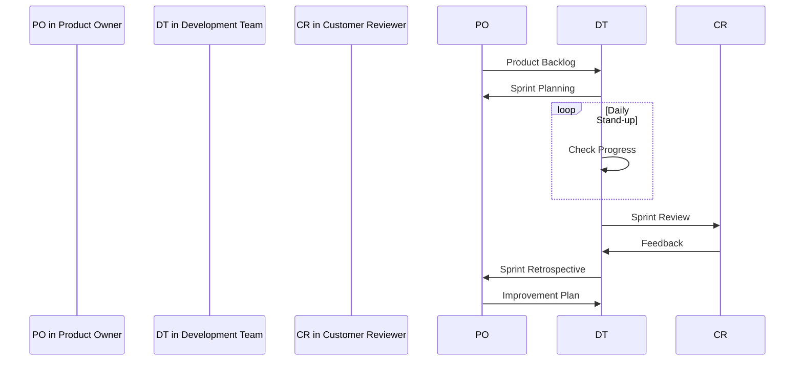
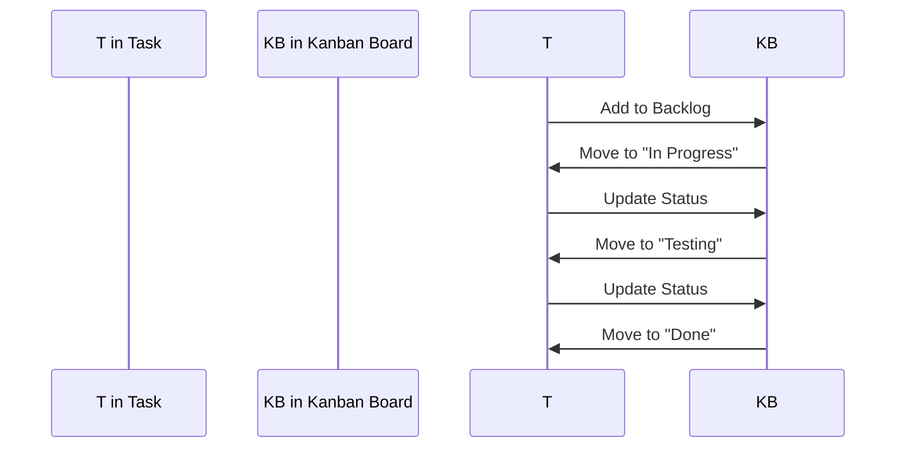

                 


### 1.4 敏捷开发的典型方法

敏捷开发有多种方法，其中最著名的是Scrum和Kanban。这两种方法各有特点，适用于不同的团队和项目环境。

#### Scrum

Scrum是一种迭代式、增量式的敏捷开发方法，它强调短期交付、持续反馈和团队成员之间的密切合作。

**Scrum的核心流程如下：**

1. **产品待办列表（Product Backlog）**：产品负责人（Product Owner）负责维护这个列表，列出所有待实现的需求和功能，并根据优先级排序。
2. **迭代规划（Sprint Planning）**：在每次迭代开始前，团队会与产品负责人一起，从产品待办列表中选择一部分任务进行实现。
3. **每日站立会议（Daily Stand-up）**：团队成员每天会举行短暂的站立会议，讨论进度、问题及解决方案。
4. **迭代回顾（Sprint Review）**：每次迭代结束时，团队会展示其成果，收集反馈，并规划下一次迭代的任务。
5. **迭代回顾（Sprint Retrospective）**：团队成员会回顾本次迭代的执行情况，讨论改进措施，以提高下一次迭代的效果。

**Scrum的Mermaid流程图如下：**



#### Kanban

Kanban是一种持续交付方法，它强调工作流程的优化和减少浪费。Kanban使用看板（Kanban Board）来可视化工作流程，并限制工作在流程中的数量（WIP限制）。

**Kanban的核心流程如下：**

1. **看板（Kanban Board）**：看板是一个可视化工具，用于展示任务的状态和进度。看板通常分为多个列，代表不同的任务状态，如“待办”、“进行中”、“测试”、“完成”等。
2. **任务流转（Task Flow）**：任务从“待办”列开始，经过各个状态列，直到最终完成。
3. **WIP限制（Work-In-Progress Limit）**：为了减少工作过程中的干扰和任务切换，Kanban对每个状态列设置工作限制。
4. **持续改进（Continuous Improvement）**：通过定期回顾和讨论，团队可以发现流程中的瓶颈和问题，并采取改进措施。

**Kanban的Mermaid流程图如下：**



敏捷研发模式的选择取决于团队和项目的具体情况。Scrum适用于需求变化较快、需要频繁交付的项目，而Kanban则适用于工作流程复杂、需要持续优化改进的项目。

### 总结

敏捷研发模式的核心在于快速响应变化、持续交付价值和团队协作。Scrum和Kanban是两种典型的敏捷开发方法，各有优缺点，适用于不同的项目和团队。理解这些方法，并根据实际情况进行选择和调整，是成功实施敏捷研发的关键。

## 第2章：需求验收的概念与重要性

### 2.1 需求验收的定义

需求验收（Requirement Acceptance）是指确认软件产品或功能是否满足需求的过程。它不仅仅是测试，还包括对需求的理解、验证和确认。需求验收的目标是确保软件产品满足用户需求，并通过用户或利益相关者的接受来验证其质量。

### 2.2 需求验收的重要性

需求验收在敏捷研发中扮演着至关重要的角色，其重要性体现在以下几个方面：

1. **确保软件质量**：需求验收是保证软件产品质量的关键环节。通过严格的验收过程，可以发现和修复潜在的问题，减少后期返工和维护成本。
2. **验证需求实现**：需求验收确保了软件产品的功能、性能、界面等各个方面都符合预期需求。这有助于防止开发过程中出现偏离需求的情况。
3. **用户满意度**：通过需求验收，用户可以确认软件产品是否满足他们的需求和期望，从而提高用户满意度。
4. **项目进度管理**：需求验收作为项目进度的重要里程碑，有助于监控项目进展，及时发现和解决问题，确保项目按计划进行。

### 2.3 需求验收的挑战与问题

尽管需求验收的重要性不言而喻，但在实际操作中，仍面临以下挑战和问题：

1. **需求变更**：在敏捷开发中，需求变更非常常见。需求验收需要适应不断变化的需求，这增加了验收的复杂性和难度。
2. **沟通不足**：需求验收涉及到多个角色，如产品负责人、开发团队、测试人员和用户等。沟通不足可能导致验收标准和验收过程的不一致。
3. **测试覆盖不足**：在时间紧迫或资源有限的情况下，可能无法进行全面和深入的测试，从而导致潜在问题的遗漏。
4. **验收标准不明确**：验收标准的模糊或缺失可能导致验收过程的不一致，影响验收结果的准确性和可靠性。

### 2.4 敏捷研发模式下需求验收的特点

在敏捷研发模式下，需求验收具有以下特点：

1. **迭代验收**：需求验收与迭代周期紧密关联。每次迭代结束时，都需要对已完成的需求进行验收。
2. **频繁验收**：由于敏捷开发强调频繁交付，需求验收也变得更加频繁，确保每次交付的软件都能尽快得到用户的反馈和确认。
3. **用户参与**：在敏捷开发中，用户或利益相关者更积极地参与验收过程，提供及时反馈，确保验收结果的准确性和可靠性。
4. **自动化验收**：为了提高验收效率和准确性，敏捷团队越来越多地采用自动化验收工具，实现自动化的测试和验证。

### 总结

需求验收是敏捷研发中不可或缺的一环，它关系到软件产品的质量、用户满意度以及项目进度。在敏捷研发模式下，需求验收具有迭代、频繁、用户参与和自动化的特点。面对挑战和问题，敏捷团队需要不断优化验收过程，确保验收的高效和准确。

## 第3章：敏捷研发模式下的需求管理

### 3.1 需求收集与梳理

在敏捷研发模式下，需求收集与梳理是需求管理的第一步，也是至关重要的一步。有效的需求收集和梳理能够确保团队对需求有清晰的理解和认识，从而更好地实现项目目标。

**需求收集的渠道和方法：**

1. **用户访谈**：通过与用户面对面交流，深入了解用户的需求和痛点，获取真实、具体的需求信息。
2. **问卷调查**：使用问卷收集用户反馈，可以覆盖更广泛的用户群体，收集到大量的需求信息。
3. **用户故事地图**：通过绘制用户故事地图，将用户的需求和行为模式可视化，帮助团队更好地理解用户需求。
4. **市场研究**：通过市场调研，了解竞争对手的产品功能和用户需求，为项目提供参考。

**需求梳理的原则和步骤：**

1. **优先级排序**：根据需求的紧急程度、重要性以及资源分配，对需求进行优先级排序，确保团队首先实现最关键的需求。
2. **需求分类**：将需求按照功能、用户角色等进行分类，有助于团队更有针对性地进行开发和管理。
3. **需求文档化**：将需求以文档形式进行记录，包括需求描述、需求分析和验收标准，便于后续的需求管理和跟踪。

### 3.2 需求优先级排序

需求优先级排序是需求管理的关键环节，它直接影响项目的进度和成功率。在敏捷研发模式下，需求优先级排序通常遵循以下原则：

1. **用户价值**：优先实现用户最关心的、能够带来最大价值的需求。
2. **业务价值**：考虑需求的商业价值和投资回报率，优先实现对业务发展有重要影响的需求。
3. **紧急程度**：优先处理紧急需求，确保项目按计划进行。
4. **资源限制**：根据团队资源和时间限制，合理分配需求优先级。

**优先级排序的方法：**

1. **MoSCoW方法**：将需求分为“必须要有（MUST）、要有（SHOULD）、可以没有（COULD）、尽量不需要（WON'T HAVE）”四个等级，根据等级排序。
2. **价值排序法**：根据需求的商业价值和开发成本，使用“价值/成本”公式进行排序。
3. **敏捷规划板**：在敏捷规划板（如Kanban Board）上，根据需求的优先级和开发进度，调整需求的位置和状态。

### 3.3 需求变更管理

在敏捷研发中，需求变更是一种常见的现象。有效的需求变更管理能够确保变更对项目的影响可控，同时保持项目的稳定和持续交付。

**需求变更管理的原则：**

1. **及时响应**：对用户和利益相关者的需求变更进行及时响应，确保变更能够尽快反映到项目实施中。
2. **透明度**：将需求变更的过程和影响公开透明，让所有团队成员和相关方都能了解变更的背景和原因。
3. **影响评估**：在变更实施前，对变更的影响进行评估，包括时间、资源、成本、风险等方面。
4. **变更控制**：建立严格的变更控制流程，确保所有变更都经过审查和批准，避免无序变更导致项目失控。

**需求变更管理的方法：**

1. **变更日志**：记录每次需求变更的详细信息，包括变更原因、变更内容、影响评估、审批流程等。
2. **版本控制**：使用版本控制系统（如Git）管理需求文档，确保每次变更都能准确追踪和回溯。
3. **沟通机制**：建立有效的沟通机制，确保团队成员和相关方能够及时了解变更情况，并协调各自的行动。

### 3.4 需求文档编写与维护

需求文档是需求管理的核心文件，它详细记录了项目的需求信息，是团队开发、测试和验收的依据。编写和维护高质量的需求文档对于确保项目成功至关重要。

**需求文档编写的要求：**

1. **清晰性**：需求描述应简洁明了，避免使用模糊、歧义的语言，确保所有团队成员都能正确理解需求。
2. **完整性**：需求文档应涵盖所有需求点，确保没有遗漏的关键需求。
3. **一致性**：需求文档中的需求点应保持一致，避免冲突和不一致的情况。
4. **可追溯性**：需求文档应具备可追溯性，确保每个需求点都能追溯到原始需求和来源。

**需求文档维护的方法：**

1. **定期更新**：随着项目的进展，需求可能会发生变化，需求文档应定期更新，以反映最新的需求情况。
2. **版本管理**：使用版本控制系统管理需求文档，确保每次更新都能准确记录和回溯。
3. **评审机制**：建立评审机制，对需求文档的更新进行审查和确认，确保更新的准确性和一致性。

### 总结

敏捷研发模式下的需求管理是确保项目成功的关键环节。有效的需求收集与梳理、合理的需求优先级排序、严格的需求变更管理以及高质量的需求文档编写与维护，都是需求管理的重要组成部分。通过不断优化需求管理流程，团队可以更好地适应变化，确保项目的顺利进行和成功交付。

## 第4章：需求验收工具与技术

### 4.1 需求验收测试工具概述

在敏捷研发模式中，需求验收测试是确保软件质量的关键环节。随着自动化测试技术的发展，许多工具被用于需求验收测试，以提高测试的效率和质量。这些工具通常可以分为以下几类：

1. **UI自动化测试工具**：如Selenium、TestCafe等，用于模拟用户操作，验证用户界面功能。
2. **API自动化测试工具**：如Postman、JMeter等，用于测试API接口的功能、性能和稳定性。
3. **代码覆盖率工具**：如JaCoCo、Cobertura等，用于测量代码的覆盖程度，确保测试的全面性。
4. **持续集成工具**：如Jenkins、GitLab CI等，用于自动化执行测试，集成到开发流程中。

### 4.2 自动化测试框架选择

在选择自动化测试框架时，需要考虑以下几个因素：

1. **项目需求**：根据项目特点和需求，选择适合的测试工具和框架。例如，UI测试工具适用于需要验证用户界面的功能，而API测试工具适用于测试后端服务。
2. **开发语言**：测试框架应与项目开发语言兼容，以便于测试代码的编写和维护。
3. **可维护性**：选择易于维护和扩展的测试框架，确保测试代码的可读性和可维护性。
4. **社区支持**：选择有活跃社区支持的测试框架，有助于解决开发过程中遇到的问题。

### 4.3 UI自动化测试实践

UI自动化测试是需求验收测试的重要组成部分，以下是一个UI自动化测试的实践步骤：

1. **需求分析**：首先，对需求进行详细分析，确定需要测试的功能点和测试场景。
2. **测试设计**：根据需求分析结果，设计测试用例，包括测试输入、预期结果和实际结果。
3. **环境准备**：搭建测试环境，包括浏览器、操作系统等，确保测试环境的稳定和一致性。
4. **脚本编写**：使用选择好的UI自动化测试工具，编写测试脚本，模拟用户操作，验证界面功能。
5. **测试执行**：执行测试脚本，记录测试结果，包括成功、失败和错误的情况。
6. **结果分析**：分析测试结果，找出测试失败的原因，进行回归测试，确保问题的解决。

### 4.4 API自动化测试实践

API自动化测试是验证后端服务功能的有效方法，以下是一个API自动化测试的实践步骤：

1. **需求分析**：分析API文档，理解API的功能、输入和输出。
2. **测试设计**：设计测试用例，包括正常场景、异常场景和边界情况。
3. **测试环境准备**：确保API服务的稳定，准备测试环境，包括API服务器、数据库等。
4. **接口测试脚本编写**：使用API自动化测试工具，编写测试脚本，执行各种测试用例。
5. **测试执行**：执行测试脚本，记录测试结果，包括成功、失败和错误的情况。
6. **结果分析**：分析测试结果，找出测试失败的原因，进行回归测试，确保问题的解决。

### 总结

需求验收自动化是敏捷研发中提高测试效率和质量的必要手段。选择合适的自动化测试工具和框架，结合实际需求进行UI自动化测试和API自动化测试，可以有效提高需求验收的效率和准确性。通过自动化测试，团队可以更快地响应需求变化，确保软件产品的质量，从而实现敏捷研发的目标。

## 第5章：需求验收案例研究

### 5.1 案例一：电商平台的订单管理系统

#### 案例背景

某电商平台需要开发一套订单管理系统，以支持订单的创建、修改、删除、查询和支付等功能。该系统需要能够处理高并发请求，保证数据的完整性和一致性。为了确保系统的质量，项目团队决定采用敏捷开发模式，并实施自动化需求验收测试。

#### 案例实施过程

1. **需求分析**：项目团队与产品负责人一起，对订单管理系统的需求进行详细分析，确定需要测试的功能点和测试场景。
2. **测试设计**：根据需求分析结果，设计测试用例，包括正常场景、异常场景和边界情况，如订单创建失败、订单支付失败、订单查询结果不准确等。
3. **环境搭建**：搭建测试环境，包括电商平台服务器、数据库、支付网关等，确保测试环境的稳定和一致性。
4. **UI自动化测试**：使用Selenium编写测试脚本，模拟用户在电商平台上的操作，验证订单管理系统的用户界面功能。
    ```python
    from selenium import webdriver
    driver = webdriver.Chrome()
    driver.get("https://www.example.com")
    driver.find_element_by_id("order_create").click()
    driver.find_element_by_id("product_id").send_keys("123")
    driver.find_element_by_id("quantity").send_keys("2")
    driver.find_element_by_id("submit_order").click()
    assert "Order Created Successfully" in driver.page_source
    driver.quit()
    ```
5. **API自动化测试**：使用Postman编写测试脚本，验证订单管理系统的后端API接口。
    ```bash
    # POST /api/orders
    POST https://api.example.com/orders
    {
        "product_id": "123",
        "quantity": "2"
    }
    
    # GET /api/orders/{order_id}
    GET https://api.example.com/orders/1
    ```
6. **测试执行与结果分析**：执行UI自动化测试和API自动化测试，记录测试结果，分析失败原因，并进行回归测试。

#### 案例总结

通过自动化需求验收测试，订单管理系统的功能得到了全面验证，确保了系统的质量。自动化测试不仅提高了测试效率，还减少了人为错误，从而降低了项目风险。

### 5.2 案例二：金融行业的风险评估系统

#### 案例背景

某金融公司需要开发一套风险评估系统，用于对客户的风险进行评估，以便决定是否批准贷款。该系统需要处理大量的数据，并快速生成风险评估报告。为了确保系统的准确性，公司决定采用敏捷开发模式，并实施自动化需求验收测试。

#### 案例实施过程

1. **需求分析**：项目团队与业务分析师一起，对风险评估系统的需求进行详细分析，确定需要测试的功能点和测试场景。
2. **测试设计**：根据需求分析结果，设计测试用例，包括正常场景、异常场景和边界情况，如数据缺失、数据不一致、风险评估报告不准确等。
3. **环境搭建**：搭建测试环境，包括数据库、计算服务器、数据源等，确保测试环境的稳定和一致性。
4. **API自动化测试**：使用Postman编写测试脚本，验证风险评估系统的后端API接口。
    ```bash
    # POST /api/risks
    POST https://api.example.com/risks
    {
        "client_id": "456",
        "data": {
            "income": 50000,
            "debt": 20000
        }
    }
    
    # GET /api/risks/{risk_id}
    GET https://api.example.com/risks/1
    ```
5. **数据验证**：使用Python编写脚本，验证生成的风险评估报告的数据准确性。
    ```python
    import requests
    response = requests.get("https://api.example.com/risks/1")
    risk_data = response.json()
    assert risk_data["debt"] == 20000
    assert risk_data["income"] == 50000
    ```
6. **测试执行与结果分析**：执行API自动化测试和数据验证脚本，记录测试结果，分析失败原因，并进行回归测试。

#### 案例总结

通过自动化需求验收测试，风险评估系统的准确性得到了有效验证。自动化测试不仅提高了测试效率，还确保了数据的一致性和准确性，从而降低了金融风险。

### 5.3 案例三：物联网设备的远程监控平台

#### 案例背景

某物联网公司开发了一套远程监控平台，用于监控和管理大量物联网设备。该平台需要实时处理设备数据，并生成监控报告。为了确保平台的稳定性和可靠性，公司决定采用敏捷开发模式，并实施自动化需求验收测试。

#### 案例实施过程

1. **需求分析**：项目团队与产品负责人一起，对远程监控平台的需求进行详细分析，确定需要测试的功能点和测试场景。
2. **测试设计**：根据需求分析结果，设计测试用例，包括正常场景、异常场景和边界情况，如设备连接失败、数据传输中断、监控报告不准确等。
3. **环境搭建**：搭建测试环境，包括远程设备、数据接收服务器、监控服务器等，确保测试环境的稳定和一致性。
4. **UI自动化测试**：使用Selenium编写测试脚本，模拟用户在远程监控平台上的操作，验证用户界面功能。
    ```python
    from selenium import webdriver
    driver = webdriver.Chrome()
    driver.get("https://www.example.com")
    driver.find_element_by_id("device_connect").click()
    driver.find_element_by_id("device_id").send_keys("789")
    driver.find_element_by_id("connect_button").click()
    assert "Device Connected Successfully" in driver.page_source
    driver.quit()
    ```
5. **API自动化测试**：使用Postman编写测试脚本，验证远程监控平台的后端API接口。
    ```bash
    # POST /api/devices
    POST https://api.example.com/devices
    {
        "device_id": "789",
        "status": "connected"
    }
    
    # GET /api/devices/{device_id}
    GET https://api.example.com/devices/789
    ```
6. **测试执行与结果分析**：执行UI自动化测试和API自动化测试，记录测试结果，分析失败原因，并进行回归测试。

#### 案例总结

通过自动化需求验收测试，远程监控平台的稳定性和可靠性得到了有效验证。自动化测试不仅提高了测试效率，还确保了系统的实时性和准确性，从而提高了用户体验。

### 总结

通过以上三个案例，我们可以看到，自动化需求验收测试在敏捷研发中的应用，显著提高了项目的测试效率和质量。无论是电商平台、金融行业还是物联网设备，自动化测试都为项目成功提供了有力保障。在未来的发展中，自动化测试将继续发挥重要作用，推动敏捷研发的持续进步。

## 第6章：需求验收自动化流程设计与实践

### 6.1 自动化流程设计原则

设计需求验收自动化流程时，应遵循以下原则：

1. **可扩展性**：设计灵活的自动化测试框架，能够适应未来需求的变化和扩展。
2. **可维护性**：编写清晰、简洁的测试代码，确保测试脚本易于维护和更新。
3. **可复用性**：设计可复用的测试模块和组件，减少重复工作，提高测试效率。
4. **可靠性**：确保自动化测试的稳定性和准确性，避免误报和漏报。
5. **自动化程度**：尽可能提高自动化测试的比例，减少手动测试的工作量。

### 6.2 自动化流程实施步骤

实现需求验收自动化流程通常包括以下步骤：

1. **需求分析与规划**：分析需求，确定需要自动化测试的功能点，制定自动化测试计划。
2. **测试用例设计**：根据需求，设计自动化测试用例，包括正常场景、异常场景和边界情况。
3. **测试环境搭建**：搭建测试环境，包括硬件、软件和网络环境，确保自动化测试的执行环境一致性和稳定性。
4. **测试脚本编写**：使用合适的自动化测试工具，编写测试脚本，实现测试用例的自动化执行。
5. **测试执行与结果分析**：执行自动化测试脚本，记录测试结果，分析测试失败的原因，进行回归测试。
6. **持续集成与持续部署**：将自动化测试集成到持续集成和持续部署流程中，确保自动化测试与开发流程无缝衔接。

### 6.3 自动化流程的持续优化

自动化流程的持续优化是确保其有效性和效率的关键。以下是一些优化策略：

1. **定期审查**：定期审查自动化测试流程，识别瓶颈和改进点。
2. **代码重构**：优化测试代码，提高可读性和可维护性，确保测试脚本的高效执行。
3. **测试覆盖率提升**：通过增加测试用例，提高代码覆盖率和测试全面性。
4. **自动化测试工具升级**：定期评估和升级自动化测试工具，采用更先进的技术和工具。
5. **培训与知识分享**：组织团队成员进行自动化测试培训，提高团队自动化测试技能和知识水平。

### 6.4 自动化流程的性能评估

评估自动化流程的性能是确保其有效性的重要环节。以下是一些性能评估指标：

1. **测试覆盖率**：测试覆盖率是衡量自动化测试全面性的指标，包括代码覆盖率和功能覆盖率。
2. **测试执行速度**：测试执行速度是衡量自动化测试效率的指标，包括单次测试执行时间和整个测试流程的时间。
3. **测试失败率**：测试失败率是衡量自动化测试可靠性的指标，包括测试失败次数和总测试次数的比例。
4. **测试反馈周期**：测试反馈周期是衡量自动化测试响应速度的指标，包括从测试失败到问题解决的时间。
5. **资源消耗**：评估自动化测试对硬件和软件资源的消耗，包括CPU、内存和网络资源。

### 总结

设计并实施有效的需求验收自动化流程，是确保敏捷研发项目成功的关键。遵循自动化流程设计原则，按照实施步骤进行自动化流程的搭建和优化，定期评估和改进自动化流程的性能，是提高需求验收效率和准确性的有效途径。通过持续优化和改进，自动化流程将为敏捷研发提供更加坚实的保障。

## 第7章：敏捷研发模式下的需求验收自动化未来趋势

### 7.1 人工智能与需求验收自动化的结合

随着人工智能（AI）技术的发展，需求验收自动化正逐步与AI技术相结合，带来新的机遇和挑战。AI技术能够在需求验收自动化中发挥以下作用：

1. **测试用例生成**：AI可以通过分析需求文档和源代码，自动生成测试用例，提高测试覆盖率和效率。
2. **缺陷预测**：AI可以基于历史测试数据，预测潜在缺陷，提前采取预防措施，减少测试失败率。
3. **异常检测**：AI可以实时分析测试结果，快速识别异常，提高测试的准确性和可靠性。
4. **智能反馈**：AI可以通过自然语言处理技术，生成智能反馈，帮助开发人员快速定位问题并解决问题。

### 7.2 需求验收自动化的发展趋势

需求验收自动化在未来的发展将呈现以下趋势：

1. **自动化程度的提高**：随着测试工具和框架的进步，自动化测试的比例将逐步提高，减少手动测试的工作量。
2. **智能化与自动化测试的结合**：AI技术将进一步与需求验收自动化结合，实现更智能、更高效的测试。
3. **测试流程的持续优化**：通过持续集成和持续部署（CI/CD），测试流程将更加紧密地集成到开发流程中，实现持续测试和反馈。
4. **可解释性增强**：自动化测试结果的解释性和可解释性将得到提升，帮助开发人员更好地理解和接受自动化测试结果。

### 7.3 未来敏捷研发模式下的需求验收自动化挑战与机遇

在未来的敏捷研发模式下，需求验收自动化面临以下挑战和机遇：

**挑战：**

1. **技术复杂度增加**：随着AI和自动化测试技术的发展，技术复杂度将增加，对开发人员和测试人员的技术能力提出了更高的要求。
2. **测试数据质量**：自动化测试依赖于高质量的数据，数据质量直接影响测试结果的准确性，需要持续优化数据管理策略。
3. **测试覆盖全面性**：如何实现全面、深入的测试覆盖，确保关键功能和异常场景都得到有效测试，是未来面临的重要挑战。

**机遇：**

1. **测试效率提升**：AI和自动化技术的结合将显著提高测试效率，缩短测试周期，提高项目交付速度。
2. **质量保障能力增强**：智能化测试将提高测试的准确性和可靠性，增强项目质量保障能力。
3. **开发与测试的融合**：自动化测试的深化将推动开发与测试的深度融合，促进敏捷研发模式的持续优化和进步。

### 总结

未来，需求验收自动化将在敏捷研发中发挥越来越重要的作用。随着AI技术的发展，自动化测试将变得更加智能和高效。同时，敏捷研发模式下的需求验收自动化也将面临新的挑战和机遇。通过不断优化和改进，自动化测试将为敏捷研发提供更加坚实的保障，推动软件开发和测试的持续进步。

## 附录：需求验收自动化资源与工具

### A.1 自动化测试工具对比

在选择自动化测试工具时，了解不同工具的特点和适用场景是非常重要的。以下是一些常见的自动化测试工具及其对比：

| 工具 | 描述 | 适用场景 |
| :---: | :---: | :---: |
| Selenium | 开源UI自动化测试工具，支持多种浏览器和操作系统 | 测试Web应用的用户界面 |
| TestCafe | 开源UI自动化测试工具，专注于现代Web应用 | 测试Web应用的性能和用户体验 |
| Postman | API自动化测试工具，支持各种API接口测试 | 测试RESTful API接口 |
| JMeter | 开源性能测试工具，用于测试Web应用程序性能 | 测试Web应用和服务的性能 |
| Appium | 开源移动应用自动化测试工具，支持多种平台 | 测试移动应用的用户界面和功能 |
| PyTest | Python测试框架，支持多种测试类型 | 测试Python代码和Web应用 |
| Cucumber | BDD（行为驱动开发）测试框架，使用Gherkin语言 | 测试业务逻辑和用户故事 |

### A.2 敏捷开发工具推荐

敏捷开发工具可以帮助团队更好地管理项目、协调工作和跟踪进度。以下是一些常用的敏捷开发工具：

| 工具 | 描述 | 适用场景 |
| :---: | :---: | :---: |
| Jira | 项目管理和跟踪工具，支持任务管理、迭代规划和报告生成 | 敏捷项目管理 |
| Trello | 任务看板工具，用于任务分配和进度跟踪 | 任务管理和优先级排序 |
| GitLab | Git版本控制和项目管理平台，支持CI/CD | 代码托管和持续集成 |
| GitHub | Git版本控制和项目管理平台，支持社区合作 | 代码托管和协作开发 |
| Confluence | 团队协作和文档管理工具，支持知识共享和文档编撰 | 文档管理和知识共享 |

### A.3 敏捷研发相关书籍与资料推荐

为了更好地理解和实践敏捷研发模式，以下是一些建议的书籍和资料：

| 书籍 | 描述 | 作者 |
| :---: | :---: | :---: |
| 《敏捷软件开发：原则、实践与模式》 | 介绍了敏捷开发的基本原则和实践方法 | 克里斯·柯林斯 |
| 《Scrum敏捷开发实践指南》 | 详细讲解了Scrum敏捷开发的方法和实践 | 约翰·史威尼、杰夫·萨瑟兰 |
| 《Kanban敏捷开发实践指南》 | 介绍了Kanban敏捷开发方法，及其在项目管理中的应用 | 詹姆斯·马丁 |
| 《敏捷实践指南》 | 提供了敏捷开发的全面指南，包括团队协作、需求管理和迭代规划 | 米奇·氢、史蒂夫·麦考利 |
| 《敏捷项目管理》 | 详细介绍了敏捷项目管理的方法和技术，帮助项目经理成功实施敏捷项目 | 瑞克·威尔逊 |

### 总结

自动化测试工具、敏捷开发工具和相关的书籍资料是敏捷研发的重要资源。通过合理选择和使用这些工具和资料，团队可以更好地实施敏捷开发模式，提高项目管理和开发效率。

## 结束语

作者：AI天才研究院/AI Genius Institute & 禅与计算机程序设计艺术 /Zen And The Art of Computer Programming

在本文中，我们详细探讨了敏捷研发模式下的需求验收自动化。通过梳理敏捷开发的核心原则、需求验收的概念与重要性、需求管理、需求验收工具与技术，以及实际案例研究，我们展示了如何高效地实施需求验收自动化流程。同时，我们还展望了需求验收自动化的未来趋势，包括人工智能与需求验收自动化的结合、自动化测试工具对比、敏捷开发工具推荐和相关的书籍资料。

在敏捷研发模式中，需求验收自动化是确保软件质量和项目成功的关键环节。通过合理选择和利用自动化测试工具、敏捷开发工具，以及不断优化和改进自动化流程，团队可以大幅提高开发效率和质量，缩短项目交付周期。

本文的撰写旨在为读者提供一个全面、系统的理解，帮助他们在实际项目中更好地应用需求验收自动化。希望本文的内容能够对您的敏捷研发实践有所启发和帮助。

在此，我要感谢AI天才研究院和《禅与计算机程序设计艺术》的同事们，他们的智慧和努力为本文的撰写提供了宝贵的支持。同时，我也希望读者能够继续关注敏捷研发领域的新动态，不断学习与实践，推动技术的进步和应用。

再次感谢您的阅读，期待与您在未来的技术交流中再次相遇。祝您在敏捷研发的道路上不断前行，取得更多的成就！

