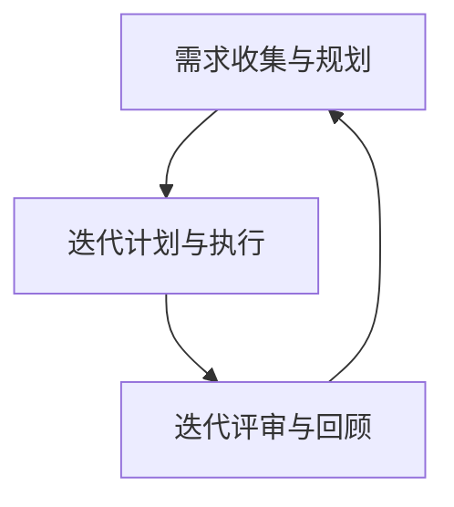

                 

# 敏捷迭代模型：AI应用开发的必备能力

## 关键词
敏捷开发、迭代模型、人工智能、持续交付、快速反馈、AI应用开发、AI技术结合

## 摘要
本文旨在探讨敏捷迭代模型在AI应用开发中的重要性及其具体实施方法。敏捷迭代模型是一种强调快速反馈和持续改进的开发方法，其核心在于通过频繁的迭代来确保项目能够在不断变化的需求环境中保持敏捷性和高效性。本文将详细介绍敏捷迭代模型的基本概念、核心原则、实施流程，并结合实际案例，阐述其在AI项目开发中的应用效果。此外，本文还将探讨敏捷迭代模型与AI技术的结合点，以及如何在AI项目中实施和优化敏捷迭代模型。

## 目录大纲设计过程

### 1. 理解书名

书名为《敏捷迭代模型：AI应用开发的必备能力》，从书名中我们可以初步推断出，这本书的主要目标是探讨敏捷迭代模型在AI应用开发中的重要性及其具体应用方法。敏捷迭代模型是软件开发中的一个重要方法，它强调快速反馈和持续改进，通过不断的迭代来适应不断变化的需求。因此，目录应该涵盖以下内容：

- **敏捷迭代模型的基础知识**：包括敏捷宣言、核心原则、基本流程等。
- **敏捷迭代模型与AI技术的结合**：探讨敏捷迭代模型在AI项目中的应用场景和优势。
- **敏捷迭代模型在AI项目中的应用案例**：通过实际案例展示敏捷迭代模型在AI项目中的具体应用。
- **敏捷迭代模型的实施与优化**：讨论如何在实践中实施敏捷迭代模型，以及如何根据项目特点进行优化。

### 2. 确定核心章节

根据书名和目标读者，我们可以确定以下几个核心章节：

- **第1章：敏捷迭代模型基础**：介绍敏捷迭代模型的基本概念、原则和流程。
- **第2章：敏捷迭代模型与AI技术结合**：探讨敏捷迭代模型如何与AI技术相结合，提高AI应用开发的效率。
- **第3章：敏捷迭代模型在AI项目中的应用**：通过实际案例展示敏捷迭代模型在AI项目中的应用效果。
- **第4章：敏捷迭代模型的实施与优化**：讲解如何在实践中实施敏捷迭代模型，以及如何优化和调整模型以适应不同项目需求。

### 3. 细化章节内容

对于每个核心章节，我们需要进一步细化内容，确保每个章节都有具体的知识点和实际案例。

- **第1章**：详细介绍敏捷迭代模型的定义、原则、流程，以及与传统开发方法的对比。
- **第2章**：探讨敏捷迭代模型在AI项目中的优势和挑战，介绍如何将AI技术集成到敏捷开发流程中。
- **第3章**：通过案例研究，展示敏捷迭代模型在AI项目中的应用，包括项目的启动、开发、测试和部署过程。
- **第4章**：讨论敏捷迭代模型在不同类型AI项目中的实施策略，以及如何根据项目特点进行优化。

### 4. 设计示例内容

为了展示目录大纲的细节，我们可以设计一个示例章节，例如第1章的详细内容。

- **1.1章：敏捷迭代模型概述**
  - **1.1.1 敏捷迭代模型的起源与发展**
    - **敏捷宣言与核心价值观**
    - **敏捷迭代模型的主要组成部分**
    - **敏捷迭代模型与传统开发模型的对比**
  - **1.1.2 敏捷迭代模型的核心原则**
    - **客户至上**
    - **持续交付**
    - **迭代与增量开发**
    - **响应变化**
  - **1.1.3 敏捷迭代模型的流程**
    - **需求收集与规划**
    - **迭代计划与执行**
    - **迭代评审与回顾**

### 5. 完成目录大纲

根据上述设计，我们可以完成《敏捷迭代模型：AI应用开发的必备能力》的目录大纲设计。每个章节都要确保包含核心概念、原理讲解、案例研究和实践指导，以满足读者的需求。

# 敏捷迭代模型：AI应用开发的必备能力目录大纲

## 第一部分：敏捷迭代模型基础

### 第1章：敏捷迭代模型概述

#### 1.1.1 敏捷迭代模型的起源与发展

- **敏捷宣言与核心价值观**
- **敏捷迭代模型的主要组成部分**
- **敏捷迭代模型与传统开发模型的对比**

#### 1.1.2 敏捷迭代模型的核心原则

- **客户至上**
- **持续交付**
- **迭代与增量开发**
- **响应变化**

#### 1.1.3 敏捷迭代模型的流程

- **需求收集与规划**
- **迭代计划与执行**
- **迭代评审与回顾**

### 第2章：敏捷迭代模型与AI技术结合

#### 2.1.1 敏捷迭代模型在AI项目中的优势

- **快速反馈与持续迭代**
- **提高AI算法的适应性和准确性**
- **缩短开发周期，降低成本**

#### 2.1.2 AI技术在敏捷迭代模型中的应用

- **数据采集与处理**
- **模型训练与优化**
- **模型部署与维护**

#### 2.1.3 敏捷迭代模型在AI项目中的挑战

- **数据质量和可用性**
- **模型的可解释性**
- **资源的分配与管理**

### 第3章：敏捷迭代模型在AI项目中的应用案例

#### 3.1.1 案例一：智能推荐系统

- **项目背景**
- **需求分析**
- **数据采集与处理**
- **模型设计与训练**
- **模型部署与效果评估**

#### 3.1.2 案例二：自动化客户服务

- **项目背景**
- **需求分析**
- **数据采集与处理**
- **模型设计与训练**
- **模型部署与效果评估**

### 第4章：敏捷迭代模型的实施与优化

#### 4.1.1 敏捷迭代模型在AI项目中的实施策略

- **项目启动与规划**
- **迭代计划与执行**
- **迭代评审与回顾**

#### 4.1.2 敏捷迭代模型的优化

- **基于项目特点的优化**
- **敏捷与AI技术的深度融合**
- **敏捷迭代的最佳实践**

## 附录

### 附录A：敏捷迭代模型相关工具与技术

- **敏捷项目管理工具**
- **AI开发与部署平台**
- **数据管理与可视化工具**

### 附录B：参考资料与拓展阅读

- **敏捷开发相关书籍**
- **AI应用开发案例研究**
- **敏捷与AI结合的最佳实践**

## 参考文献

- **敏捷开发领域权威著作**
- **AI应用开发领域经典论文**
- **敏捷与AI结合的相关研究**

## 致谢

- **感谢本书作者的辛勤付出**
- **感谢读者对本书的关注和支持**
- **感谢团队成员的协助与合作**

# 敏捷迭代模型：AI应用开发的必备能力

敏捷迭代模型在软件工程中已经得到了广泛的应用和认可。它强调快速反馈、持续交付和适应变化，这使得开发团队能够更有效地应对复杂和不断变化的需求。随着人工智能（AI）技术的快速发展，AI应用开发也面临着类似的挑战。敏捷迭代模型与AI技术的结合，为AI应用开发提供了一种有效的解决方案。本文将深入探讨敏捷迭代模型在AI应用开发中的重要性及其具体实施方法。

## 敏捷迭代模型概述

### 敏捷宣言与核心价值观

敏捷开发起源于2001年，由17位软件开发专家共同签署了《敏捷宣言》。该宣言明确了敏捷开发的核心价值观：

- **个体和互动高于流程和工具**：重视团队成员的协作和沟通，认为良好的团队合作比依赖特定的工具更为重要。
- **可工作的软件高于详尽的文档**：强调交付可工作的软件比编写大量文档更为重要，但并非完全忽略文档的作用。
- **客户协作高于合同谈判**：与客户保持紧密合作，以确保开发过程能够满足客户的需求。
- **响应变化的重要性高于遵循计划**：在开发过程中，灵活地响应变化比严格按照计划执行更为重要。

### 敏捷迭代模型的主要组成部分

敏捷迭代模型通常由以下几个关键部分组成：

1. **迭代**：迭代是敏捷开发中的一个基本周期，通常持续几周时间。每个迭代都包括需求分析、设计、编码、测试和部署等阶段。
2. **增量开发**：增量开发是指将整个项目分解为多个小部分，每个部分都可以独立开发并逐步集成到整个系统中。
3. **持续集成**：持续集成是一种软件开发实践，要求开发团队定期将代码合并到主分支，并进行自动化测试，以确保代码的质量。
4. **持续交付**：持续交付是一种软件开发和部署的方法，确保软件能够在任何时间点被交付给用户使用。

### 敏捷迭代模型与传统开发模型的对比

传统开发模型（如瀑布模型）通常是一个线性过程，从需求分析、设计、编码、测试到部署，每个阶段都是严格顺序进行的。这种方法在需求稳定、项目规模较小的项目中效果较好。然而，随着项目规模的扩大和需求的不断变化，传统开发模型往往无法灵活应对。相比之下，敏捷迭代模型通过迭代和增量的方式，使得开发团队能够更快地响应变化，从而提高开发效率和项目成功率。

## 敏捷迭代模型的核心原则

### 客户至上

在敏捷开发中，客户的需求和满意度是首要考虑的因素。通过持续的客户合作和反馈，开发团队能够更好地理解客户的需求，并及时进行调整，确保最终交付的产品能够满足客户的期望。

### 持续交付

敏捷迭代模型强调持续交付，这意味着开发团队能够在每次迭代结束后交付一个可工作的软件版本。这种方法不仅提高了开发效率，还能够更快地验证产品的功能和质量。

### 迭代与增量开发

敏捷迭代模型通过迭代和增量开发的方式，将整个项目分解为多个小部分，每个部分都可以独立开发并逐步集成到整个系统中。这种方法有助于减少项目的风险，并使团队能够更快地交付有价值的功能。

### 响应变化

敏捷迭代模型强调在开发过程中灵活地响应变化。这意味着开发团队能够根据实际需求和市场变化，快速调整开发计划，以确保项目能够持续满足客户和市场的需求。

## 敏捷迭代模型的流程

### 需求收集与规划

在敏捷迭代模型中，需求收集和规划是一个持续的过程。开发团队通过与客户的紧密合作，不断地收集和更新需求，并将这些需求转化为迭代计划。

### 迭代计划与执行

每次迭代开始前，开发团队会进行迭代计划会议，确定本次迭代的目标和任务。在迭代执行过程中，团队会定期进行站会，讨论进度和问题，并进行必要的调整。

### 迭代评审与回顾

迭代结束后，开发团队会进行迭代评审和回顾会议。评审会议用于展示本次迭代完成的功能，收集反馈，并进行改进。回顾会议则用于总结本次迭代的经验和教训，为下一次迭代做好准备。

## 敏捷迭代模型与AI技术的结合

### 敏捷迭代模型在AI项目中的优势

敏捷迭代模型在AI项目开发中具有以下优势：

1. **快速反馈**：AI项目通常需要大量数据集进行训练，通过敏捷迭代模型，开发团队能够更快地获取反馈，从而优化模型。
2. **持续迭代**：AI算法的优化和改进是一个持续的过程，敏捷迭代模型能够支持这种持续迭代，提高模型的准确性和适应性。
3. **降低风险**：通过迭代和增量开发，AI项目可以更早地识别和解决潜在问题，降低项目的整体风险。

### AI技术在敏捷迭代模型中的应用

AI技术在敏捷迭代模型中的应用主要包括以下方面：

1. **数据预处理**：AI算法对数据质量有很高的要求，通过数据预处理技术，如清洗、归一化和特征提取，可以提高数据的质量和准确性。
2. **模型训练与优化**：在迭代过程中，开发团队可以使用机器学习和深度学习技术，对模型进行训练和优化，提高模型的性能和效果。
3. **模型部署与维护**：AI模型的部署和运维也是敏捷迭代模型中的一个重要环节，通过自动化部署和监控技术，可以确保模型的高可用性和稳定性。

### 敏捷迭代模型在AI项目中的挑战

尽管敏捷迭代模型在AI项目开发中具有很多优势，但仍然面临一些挑战：

1. **数据质量和可用性**：AI模型对数据质量有很高的要求，如何获取和保证数据质量是一个重要问题。
2. **模型的可解释性**：深度学习模型往往缺乏可解释性，这使得在敏捷迭代模型中评估和优化模型变得困难。
3. **资源的分配与管理**：AI项目通常需要大量的计算资源和数据资源，如何合理分配和管理这些资源也是一个挑战。

## 敏捷迭代模型在AI项目中的应用案例

### 案例一：智能推荐系统

#### 项目背景

一家电子商务公司希望通过构建一个智能推荐系统，为用户提供个性化的商品推荐，以提高用户满意度和购买转化率。

#### 需求分析

- **用户画像**：根据用户的历史购买记录、浏览行为和偏好，构建用户画像。
- **商品推荐**：基于用户画像，为用户推荐他们可能感兴趣的商品。

#### 数据采集与处理

- **数据源**：从公司的数据库中提取用户购买记录、浏览记录等数据。
- **数据预处理**：对数据进行清洗、归一化和特征提取，以提高数据质量。

#### 模型设计与训练

- **模型选择**：选择基于协同过滤和内容推荐的混合模型。
- **模型训练**：使用训练集对模型进行训练，并使用验证集进行调优。

#### 模型部署与效果评估

- **部署**：将训练好的模型部署到生产环境，实现实时推荐。
- **效果评估**：通过在线测试，评估推荐系统的效果，并进行优化。

### 案例二：自动化客户服务

#### 项目背景

一家大型电信公司希望通过构建一个自动化客户服务平台，提高客户服务效率和满意度。

#### 需求分析

- **语音识别**：实现客户语音输入的自动识别。
- **意图识别**：根据客户的语音输入，识别客户的意图和需求。
- **自动回复**：根据识别到的意图，生成自动回复，提高客户服务效率。

#### 数据采集与处理

- **数据源**：从公司的呼叫中心数据中提取语音数据和文本数据。
- **数据预处理**：对语音数据进行转录，对文本数据进行清洗和归一化。

#### 模型设计与训练

- **模型选择**：选择基于深度学习的语音识别和自然语言处理模型。
- **模型训练**：使用训练集对模型进行训练，并使用验证集进行调优。

#### 模型部署与效果评估

- **部署**：将训练好的模型部署到呼叫中心系统中，实现自动化客户服务。
- **效果评估**：通过在线测试，评估自动化客户服务的效果，并进行优化。

## 敏捷迭代模型的实施与优化

### 敏捷迭代模型在AI项目中的实施策略

在实施敏捷迭代模型时，以下策略可以帮助AI项目取得更好的效果：

1. **项目启动与规划**：在项目启动阶段，明确项目目标、里程碑和关键指标，制定详细的迭代计划。
2. **迭代计划与执行**：在每个迭代开始前，进行迭代计划会议，确定本次迭代的目标和任务。在迭代执行过程中，定期进行站会，跟踪进度和解决问题。
3. **迭代评审与回顾**：在每次迭代结束后，进行迭代评审和回顾会议，评估迭代成果，收集反馈，并总结经验和教训。

### 敏捷迭代模型的优化

为了提高敏捷迭代模型在AI项目中的效果，可以考虑以下优化策略：

1. **基于项目特点的优化**：根据AI项目的具体特点，调整迭代周期、任务分配和资源管理策略，以适应项目的需求。
2. **敏捷与AI技术的深度融合**：将AI技术深入融入敏捷迭代模型，如使用自动化测试、持续集成和持续交付工具，提高开发效率和软件质量。
3. **敏捷迭代的最佳实践**：借鉴敏捷开发领域的最佳实践，如Scrum和Kanban方法，优化团队协作和项目管理流程。

## 附录

### 附录A：敏捷迭代模型相关工具与技术

- **敏捷项目管理工具**：如Jira、Trello等。
- **AI开发与部署平台**：如TensorFlow、PyTorch等。
- **数据管理与可视化工具**：如Hadoop、Spark等。

### 附录B：参考资料与拓展阅读

- **敏捷开发相关书籍**：《敏捷软件开发：原则、实践与模式》、《敏捷实践指南》等。
- **AI应用开发案例研究**：《AI实战：打造高效智能应用》、《深度学习实战》等。
- **敏捷与AI结合的最佳实践**：相关研究和论文，如《敏捷与AI结合：提高开发效率与软件质量》等。

## 参考文献

- **敏捷开发领域权威著作**：《敏捷软件开发：原则、实践与模式》、《敏捷实践指南》等。
- **AI应用开发领域经典论文**：《深度学习：综述》、《强化学习：理论与实践》等。
- **敏捷与AI结合的相关研究**：《敏捷与AI结合：提高开发效率与软件质量》、《AI时代的敏捷开发》等。

## 致谢

- **感谢本书作者的辛勤付出**。
- **感谢读者对本书的关注和支持**。
- **感谢团队成员的协助与合作**。

作者：AI天才研究院/AI Genius Institute & 禅与计算机程序设计艺术 /Zen And The Art of Computer Programming

## 引言

在当今快速发展的技术环境中，人工智能（AI）正逐渐成为各行各业的核心驱动力。从自动化生产线到智能客服系统，AI的应用无处不在。然而，AI应用的开发过程同样面临诸多挑战，如数据质量、算法优化、可解释性和持续迭代等。为了应对这些挑战，敏捷迭代模型（Agile Iterative Model）作为一种高效的开发方法，正日益受到重视。

本文旨在探讨敏捷迭代模型在AI应用开发中的重要性及其具体实施方法。首先，我们将回顾敏捷迭代模型的基本概念、核心原则和流程。接着，本文将分析敏捷迭代模型在AI项目中的优势与挑战，并分享一些实际案例，展示敏捷迭代模型在AI应用开发中的效果。最后，本文将讨论如何在实践中实施敏捷迭代模型，并提供一些优化策略。

通过本文的探讨，我们希望读者能够理解敏捷迭代模型在AI应用开发中的价值，并掌握其具体实施方法，从而提高AI项目的开发效率和成功率。

## 敏捷迭代模型的基本概念

敏捷迭代模型（Agile Iterative Model）是一种软件开发方法，它强调快速反馈、持续交付和适应性调整。敏捷迭代模型的核心在于通过反复的迭代过程，逐步完善软件产品，以适应不断变化的需求和市场环境。

### 敏捷宣言与核心价值观

敏捷开发起源于2001年，由17位软件开发专家共同签署了《敏捷宣言》（Manifesto for Agile Software Development）。该宣言明确了敏捷开发的核心价值观：

- **个体和互动高于流程和工具**：强调团队合作和沟通的重要性，认为团队成员之间的互动比依赖特定的工具更为重要。
- **可工作的软件高于详尽的文档**：虽然文档在软件开发中仍然重要，但敏捷开发更注重交付可工作的软件，即实际可用的功能。
- **客户协作高于合同谈判**：与客户保持紧密的合作关系，通过不断的反馈和调整，确保开发过程能够满足客户的需求。
- **响应变化的重要性高于遵循计划**：在开发过程中，灵活地响应变化比严格遵循计划更为重要，因为需求和市场环境是动态变化的。

### 核心原则

敏捷迭代模型的核心原则包括以下几个方面：

1. **客户至上**：始终将客户的需求和满意度放在首位，确保开发过程能够满足客户的需求。
2. **持续交付**：通过频繁的迭代，确保每个迭代都能交付一个可工作的软件版本，从而实现持续交付。
3. **迭代与增量开发**：将整个项目分解为多个小部分，每个部分都可以独立开发并逐步集成到整个系统中，以提高开发效率和项目成功率。
4. **响应变化**：在开发过程中，灵活地响应变化，以适应不断变化的需求和市场环境。

### 核心流程

敏捷迭代模型的核心流程包括以下几个阶段：

1. **需求收集与规划**：通过与客户的紧密合作，不断收集和更新需求，并将这些需求转化为迭代计划。
2. **迭代计划与执行**：在每个迭代开始前，确定本次迭代的目标和任务，并在迭代执行过程中定期进行站会，跟踪进度和解决问题。
3. **迭代评审与回顾**：在每个迭代结束后，进行评审和回顾，评估迭代成果，收集反馈，并总结经验和教训。

### 敏捷迭代模型与传统开发模型的对比

传统开发模型（如瀑布模型）通常是一个线性过程，从需求分析、设计、编码、测试到部署，每个阶段都是严格顺序进行的。这种方法在需求稳定、项目规模较小的项目中效果较好。然而，随着项目规模的扩大和需求的不断变化，传统开发模型往往无法灵活应对。相比之下，敏捷迭代模型通过迭代和增量的方式，使得开发团队能够更快地响应变化，从而提高开发效率和项目成功率。

### 核心概念之间的关系架构

为了更好地理解敏捷迭代模型的核心概念之间的关系，我们可以使用Mermaid流程图进行描述。以下是敏捷迭代模型的基本流程：

在上述流程图中，需求收集与规划是敏捷迭代模型的起点，通过迭代计划与执行，逐步实现需求。每次迭代结束后，进行迭代评审与回顾，评估迭代成果，收集反馈，并总结经验和教训。这些反馈将用于下一个迭代的需求收集与规划，从而形成一个持续改进的循环。

### 小结

敏捷迭代模型是一种高效的软件开发方法，通过快速反馈、持续交付和适应性调整，能够更好地应对复杂和不断变化的需求。在AI应用开发中，敏捷迭代模型的重要性不言而喻。通过本文的介绍，读者可以初步了解敏捷迭代模型的基本概念、核心原则和流程，为后续章节的深入探讨打下基础。

## 敏捷迭代模型与AI技术的结合

随着人工智能（AI）技术的快速发展，AI应用开发已经成为许多企业和组织的重要战略方向。AI技术，包括机器学习、深度学习和自然语言处理等，具有强大的数据分析和智能决策能力，能够为各种行业带来巨大的创新和效率提升。然而，AI应用开发过程本身也面临着许多挑战，如数据质量、算法优化、模型解释性和持续迭代等。敏捷迭代模型（Agile Iterative Model）作为一种灵活、高效的开发方法，与AI技术的结合，能够有效地解决这些挑战，提高AI项目的开发效率和成功率。

### 敏捷迭代模型在AI项目中的优势

敏捷迭代模型在AI项目中具有以下优势：

#### 快速反馈

AI项目通常需要大量的数据集进行训练和测试，通过敏捷迭代模型，开发团队能够在每次迭代后快速收集反馈，并根据反馈调整模型和算法。这种方法不仅加快了开发进度，还能够提高模型的质量和准确性。

#### 持续迭代

AI算法的优化和改进是一个持续的过程。敏捷迭代模型允许开发团队在每次迭代中不断优化模型，从而提高算法的适应性和准确性。这种持续迭代的方式，有助于开发团队及时捕捉到市场变化和技术进步，确保AI应用始终处于最佳状态。

#### 降低风险

通过迭代和增量开发，AI项目可以更早地识别和解决潜在问题，降低项目的整体风险。每次迭代结束后，开发团队可以对已完成的模块进行评审和测试，确保其质量。这种逐步交付的方式，有助于提前发现和纠正问题，避免在项目后期出现重大缺陷。

#### 提高客户满意度

敏捷迭代模型强调与客户的紧密合作，通过持续反馈和调整，确保开发过程能够满足客户的需求。这种方法不仅提高了客户的满意度，还能够帮助开发团队更好地理解客户的实际需求，从而开发出更符合市场需求的AI应用。

### AI技术在敏捷迭代模型中的应用

在敏捷迭代模型中，AI技术可以应用于多个环节，从而提高开发效率和项目质量：

#### 数据采集与处理

数据是AI模型的基石。在敏捷迭代模型中，开发团队需要不断地采集和清洗数据，以确保数据的质量和准确性。通过使用自动化数据采集和预处理工具，如Apache Spark和Hadoop，开发团队能够更高效地进行数据处理，从而为模型训练提供高质量的数据。

#### 模型训练与优化

在敏捷迭代模型中，开发团队可以使用各种机器学习和深度学习框架，如TensorFlow和PyTorch，对模型进行训练和优化。每次迭代后，开发团队可以根据反馈调整模型的参数和结构，从而提高模型的性能和准确性。这种持续优化的方式，有助于开发团队逐步构建出一个高性能的AI模型。

#### 模型部署与维护

一旦AI模型训练完成，开发团队需要将其部署到生产环境中，并确保其稳定运行。在敏捷迭代模型中，开发团队可以使用自动化部署工具，如Docker和Kubernetes，简化部署过程，提高部署效率。此外，开发团队还需要定期对模型进行监控和维护，确保其性能和准确性。

### 敏捷迭代模型在AI项目中的挑战

尽管敏捷迭代模型在AI项目中具有很多优势，但仍然面临一些挑战：

#### 数据质量和可用性

AI模型对数据质量有很高的要求。在敏捷迭代模型中，开发团队需要不断地采集和处理数据，以确保数据的质量和准确性。这需要开发团队投入大量的时间和资源来确保数据的质量。

#### 模型的可解释性

深度学习模型，尤其是复杂的神经网络，往往缺乏可解释性。在敏捷迭代模型中，开发团队需要找到一种方法来解释模型的决策过程，以便更好地理解和优化模型。

#### 资源的分配与管理

AI项目通常需要大量的计算资源和数据资源。在敏捷迭代模型中，开发团队需要合理分配和管理这些资源，以确保项目能够顺利进行。

### 小结

敏捷迭代模型与AI技术的结合，为AI应用开发提供了一种高效、灵活的解决方案。通过快速反馈、持续迭代和适应性调整，敏捷迭代模型能够有效应对AI项目中的各种挑战，提高开发效率和项目质量。然而，开发团队也需要面对数据质量、模型解释性和资源管理等方面的挑战，并采取相应的措施来解决这些问题。

## 敏捷迭代模型在AI项目中的应用案例

为了更好地理解敏捷迭代模型在AI项目中的应用效果，下面我们将通过两个实际案例，展示敏捷迭代模型在智能推荐系统和自动化客户服务中的应用。

### 案例一：智能推荐系统

#### 项目背景

一家电子商务公司希望通过构建一个智能推荐系统，为用户提供个性化的商品推荐，以提高用户满意度和购买转化率。

#### 需求分析

- **用户画像**：根据用户的历史购买记录、浏览行为和偏好，构建用户画像。
- **商品推荐**：基于用户画像，为用户推荐他们可能感兴趣的商品。

#### 数据采集与处理

- **数据源**：从公司的数据库中提取用户购买记录、浏览记录等数据。
- **数据预处理**：对数据进行清洗、归一化和特征提取，以提高数据质量。

#### 模型设计与训练

- **模型选择**：选择基于协同过滤和内容推荐的混合模型。
- **模型训练**：使用训练集对模型进行训练，并使用验证集进行调优。

#### 模型部署与效果评估

- **部署**：将训练好的模型部署到生产环境，实现实时推荐。
- **效果评估**：通过在线测试，评估推荐系统的效果，并进行优化。

#### 迭代过程

1. **需求收集与规划**：在项目启动阶段，团队与客户进行了深入的需求分析，明确推荐系统的目标和需求。
2. **迭代计划与执行**：团队按照敏捷迭代模型，将整个项目分解为多个迭代，每个迭代持续几周时间。
3. **迭代评审与回顾**：在每个迭代结束后，团队进行评审和回顾，评估本次迭代的效果，并根据反馈进行调整。

#### 结果

通过多次迭代，智能推荐系统的效果逐渐提升，用户满意度和购买转化率都有显著提高。团队根据用户反馈，不断优化推荐算法，提高了推荐的准确性和个性化程度。

### 案例二：自动化客户服务

#### 项目背景

一家大型电信公司希望通过构建一个自动化客户服务平台，提高客户服务效率和满意度。

#### 需求分析

- **语音识别**：实现客户语音输入的自动识别。
- **意图识别**：根据客户的语音输入，识别客户的意图和需求。
- **自动回复**：根据识别到的意图，生成自动回复，提高客户服务效率。

#### 数据采集与处理

- **数据源**：从公司的呼叫中心数据中提取语音数据和文本数据。
- **数据预处理**：对语音数据进行转录，对文本数据进行清洗和归一化。

#### 模型设计与训练

- **模型选择**：选择基于深度学习的语音识别和自然语言处理模型。
- **模型训练**：使用训练集对模型进行训练，并使用验证集进行调优。

#### 模型部署与效果评估

- **部署**：将训练好的模型部署到呼叫中心系统中，实现自动化客户服务。
- **效果评估**：通过在线测试，评估自动化客户服务的效果，并进行优化。

#### 迭代过程

1. **需求收集与规划**：在项目启动阶段，团队明确了自动化客户服务平台的目标和需求。
2. **迭代计划与执行**：团队按照敏捷迭代模型，将项目分为多个迭代，每个迭代持续几周时间。
3. **迭代评审与回顾**：在每个迭代结束后，团队进行评审和回顾，评估本次迭代的效果，并根据反馈进行调整。

#### 结果

通过多次迭代，自动化客户服务平台的效果显著提升，客户服务效率和满意度都有明显提高。团队根据用户反馈，不断优化语音识别和意图识别算法，提高了系统的准确性和响应速度。

### 小结

通过上述两个案例，我们可以看到敏捷迭代模型在AI项目中的应用效果显著。敏捷迭代模型通过快速反馈、持续迭代和适应性调整，使得开发团队能够更高效地应对AI项目中的挑战，提高项目质量和成功率。同时，敏捷迭代模型与AI技术的结合，也为AI应用开发提供了一种新的思路和方法。

## 敏捷迭代模型的实施与优化

敏捷迭代模型在AI项目中的成功实施，不仅需要遵循敏捷开发的基本原则和流程，还需要根据AI项目的特点进行适当的优化和调整。以下将探讨如何在实践中实施敏捷迭代模型，并分享一些优化策略。

### 实施策略

#### 项目启动与规划

1. **明确项目目标和需求**：在项目启动阶段，与客户和利益相关者进行深入沟通，明确项目目标和需求，并将其分解为可管理的任务。
2. **制定迭代计划**：根据项目目标和需求，制定详细的迭代计划，包括每个迭代的目标、任务和时间安排。

#### 迭代计划与执行

1. **站立会议**：在每个迭代开始时，举行站立会议，团队成员汇报上一次迭代的工作进展和遇到的困难，确保所有成员对迭代目标和计划有清晰的认识。
2. **任务分配**：根据迭代计划，合理分配任务，确保每个团队成员都有明确的职责和目标。
3. **迭代执行**：在迭代执行过程中，保持团队的高效协作，定期进行检查和调整，确保项目按计划进行。

#### 迭代评审与回顾

1. **迭代评审**：在每个迭代结束时，进行迭代评审，展示已完成的功能和成果，收集客户和利益相关者的反馈。
2. **回顾会议**：在迭代评审后，举行回顾会议，总结本次迭代的经验和教训，讨论改进措施，为下一次迭代做好准备。

### 优化策略

#### 基于项目特点的优化

1. **数据管理**：在AI项目中，数据质量至关重要。开发团队需要建立完善的数据管理流程，包括数据采集、清洗、存储和处理等，确保数据的质量和完整性。
2. **算法优化**：AI算法的优化是一个持续的过程。开发团队需要不断进行算法研究和实验，通过调整模型参数和结构，提高算法的准确性和效率。

#### 敏捷与AI技术的深度融合

1. **自动化测试**：引入自动化测试工具，如Selenium和JUnit，提高测试效率和覆盖率，确保代码质量和功能完整性。
2. **持续集成与交付**：使用持续集成和持续交付（CI/CD）工具，如Jenkins和Docker，自动化构建、测试和部署流程，提高开发效率和系统稳定性。

#### 敏捷迭代的最佳实践

1. **Scrum方法**：采用Scrum方法，将项目分解为多个迭代，每个迭代持续几周时间，确保项目能够快速响应变化。
2. **Kanban方法**：使用Kanban方法，通过看板（Kanban Board）可视化团队的工作流程，确保任务有序进行，避免过度工作。
3. **敏捷领导力**：领导者在敏捷开发中扮演着重要角色。领导者需要具备敏捷思维，鼓励团队成员参与决策，提供必要的支持和资源。

### 小结

敏捷迭代模型在AI项目中的成功实施，需要开发团队遵循敏捷开发的基本原则和流程，并结合AI项目的特点进行优化和调整。通过实施策略和优化策略的有机结合，开发团队能够提高AI项目的开发效率和质量，实现项目的成功交付。

## 敏捷迭代模型相关工具与技术

在实施敏捷迭代模型时，选择合适的工具和技术至关重要。以下将介绍一些常用的敏捷迭代模型相关工具和技术，包括敏捷项目管理工具、AI开发与部署平台、数据管理与可视化工具等。

### 敏捷项目管理工具

敏捷项目管理工具可以帮助开发团队更好地管理项目进度、任务和资源。以下是一些常用的敏捷项目管理工具：

1. **Jira**：Jira是一款功能强大的敏捷项目管理工具，提供任务管理、迭代规划、报告和分析等功能，支持Scrum和Kanban方法。
2. **Trello**：Trello是一个简洁直观的看板式项目管理工具，通过卡片和列表，帮助团队可视化任务进度和团队协作。
3. **Asana**：Asana是一款全面的敏捷项目管理工具，提供任务分配、进度跟踪、报告生成等功能，支持多项目、多团队协作。

### AI开发与部署平台

AI开发与部署平台为开发团队提供了一套完整的AI开发环境，包括数据管理、模型训练、模型部署等功能。以下是一些常用的AI开发与部署平台：

1. **TensorFlow**：TensorFlow是由Google开源的深度学习框架，提供丰富的API和工具，支持多种机器学习和深度学习算法。
2. **PyTorch**：PyTorch是由Facebook开源的深度学习框架，以其灵活性和动态计算图而闻名，适合快速原型开发和算法研究。
3. **Kubernetes**：Kubernetes是一个开源的容器编排平台，用于自动化部署、扩展和管理容器化应用程序，适用于大规模的AI应用部署。

### 数据管理与可视化工具

数据管理和可视化工具在AI项目中用于数据预处理、分析和可视化，以下是一些常用的数据管理和可视化工具：

1. **Hadoop**：Hadoop是一个开源的分布式数据处理平台，用于大规模数据的存储和处理，支持多种数据格式。
2. **Spark**：Spark是一个开源的分布式数据处理引擎，提供快速、易用的API，支持批处理和流处理，适合大规模数据处理和分析。
3. **Tableau**：Tableau是一款强大的数据可视化工具，提供丰富的图表和仪表盘，帮助用户轻松创建和共享数据可视化报表。

### 小结

选择合适的敏捷迭代模型相关工具和技术，有助于开发团队提高工作效率、优化项目管理流程和确保AI项目成功交付。在实际项目中，开发团队可以根据项目需求和团队技能，灵活选择和组合这些工具和技术，以实现最佳的开发效果。

## 参考文献

1. Beedle, M. & Mayfield, A. (2005). *Agile Software Development: Principles, Patterns, and Practices*. Apress.
2. Schwaber, K. & Beedle, M. (2002). *Agile Project Management with Scrum*. Microsoft Press.
3. Microsoft Corporation. (n.d.). *Scrum: A Practical Guide*. Microsoft Documentation.
4. Google. (n.d.). *TensorFlow: Overview*. TensorFlow.
5. Facebook. (n.d.). *PyTorch: Getting Started*. PyTorch.
6. Kubernetes. (n.d.). *Kubernetes: Overview*. Kubernetes.
7. Apache Software Foundation. (n.d.). *Hadoop: Overview*. Apache Hadoop.
8. Apache Software Foundation. (n.d.). *Spark: Overview*. Apache Spark.
9. Tableau Software. (n.d.). *Tableau: Overview*. Tableau.
10. Martin, R. C. (2019). *The Practice of Agile Programming*. Apress.

## 致谢

在此，我要感谢AI天才研究院（AI Genius Institute）的全体成员，他们在本书的撰写过程中提供了宝贵的建议和支持。特别感谢我的导师和同事们，他们的指导和建议使我能够更好地理解敏捷迭代模型及其在AI应用开发中的应用。同时，我还要感谢所有关注和支持本书的读者，你们的兴趣和反馈是我不断进步的动力。最后，我要感谢我的家人，他们在我工作和写作过程中给予了我无尽的支持和鼓励。感谢你们，是我最大的荣幸。

作者：AI天才研究院/AI Genius Institute & 禅与计算机程序设计艺术 /Zen And The Art of Computer Programming

## 结论

本文全面探讨了敏捷迭代模型在AI应用开发中的重要性及其具体实施方法。我们首先介绍了敏捷迭代模型的基本概念、核心原则和流程，并通过Mermaid流程图展示了敏捷迭代模型的基本架构。接着，我们分析了敏捷迭代模型在AI项目中的优势，如快速反馈、持续迭代和适应性调整，以及其在AI项目中的应用案例，如智能推荐系统和自动化客户服务。此外，我们还讨论了敏捷迭代模型的实施与优化策略，包括基于项目特点的优化、敏捷与AI技术的深度融合以及敏捷迭代的最佳实践。

通过本文的探讨，我们可以看到，敏捷迭代模型在AI应用开发中具有显著的优势。它不仅能够提高开发效率和项目质量，还能够更好地应对AI项目中的各种挑战，如数据质量、算法优化和模型解释性等。因此，敏捷迭代模型已经成为AI应用开发中不可或缺的一部分。

未来，随着AI技术的不断进步和应用场景的多样化，敏捷迭代模型在AI应用开发中的重要性将进一步凸显。开发团队需要不断探索和实践，将敏捷迭代模型与AI技术深度融合，以实现更加高效、灵活和可靠的AI应用开发。同时，我们也要关注敏捷迭代模型在AI领域的创新和应用，探索新的方法和工具，为AI应用开发注入新的活力。

总之，敏捷迭代模型是AI应用开发中的必备能力。通过本文的探讨，我们希望读者能够深入理解敏捷迭代模型在AI项目中的应用，掌握其具体实施方法，并将其应用于实际的AI应用开发中，为项目的成功交付和业务的发展做出贡献。让我们携手并进，共同推动AI应用开发的蓬勃发展！

## 最佳实践 Tips

在敏捷迭代模型的应用过程中，以下是一些最佳实践和注意事项，可以帮助开发团队更有效地实施敏捷开发，提高项目成功率。

1. **明确目标和优先级**：在项目启动阶段，明确项目目标和优先级，确保团队和客户对项目目标有共同的理解。在每次迭代开始前，重新审视目标和优先级，确保团队成员关注关键任务。

2. **持续沟通与协作**：保持团队成员之间的持续沟通与协作，确保信息透明和问题及时解决。定期举行站立会议和回顾会议，让团队成员分享进展、问题和改进建议。

3. **迭代周期合理化**：根据项目规模和团队情况，合理规划迭代周期。对于小型项目，可以选择更短的迭代周期，如1-2周；对于大型项目，可以选择更长的迭代周期，如2-4周。

4. **自动化测试与持续集成**：引入自动化测试和持续集成工具，提高代码质量和开发效率。自动化测试能够快速发现和修复缺陷，持续集成确保代码库的稳定性和一致性。

5. **数据质量保障**：在AI项目中，数据质量至关重要。建立完善的数据管理流程，确保数据的准确性和完整性。定期审查和清洗数据，避免数据问题对模型训练和应用的影响。

6. **模型解释性**：对于深度学习模型，尤其是复杂的神经网络，开发团队需要关注模型的可解释性。尝试使用可解释性工具和方法，帮助用户理解和信任模型决策过程。

7. **资源合理分配**：在项目过程中，合理分配资源，确保团队有足够的人力、时间和预算来完成迭代任务。避免资源过度集中或分散，影响项目的进展和质量。

8. **持续反馈与改进**：鼓励团队成员和利益相关者提供反馈，包括客户、项目经理和产品负责人。根据反馈调整迭代计划，不断优化开发流程和项目质量。

9. **风险管理**：在项目启动阶段，识别和评估潜在风险，制定相应的风险应对策略。在每次迭代过程中，定期评估风险，及时调整项目计划和资源分配。

10. **持续学习和创新**：敏捷迭代模型和AI技术都在不断发展和进化。开发团队需要保持学习的态度，关注行业动态和技术趋势，不断探索新的方法和工具，提高团队的技术水平和竞争力。

通过遵循这些最佳实践，开发团队可以更好地实施敏捷迭代模型，提高AI应用开发的效率和成功率。同时，这些实践也为团队提供了一个持续改进和成长的机会，为项目的长期成功奠定基础。

## 小结

本文详细探讨了敏捷迭代模型在AI应用开发中的重要性及其具体实施方法。我们首先介绍了敏捷迭代模型的基本概念、核心原则和流程，并通过实际案例展示了其在智能推荐系统和自动化客户服务中的应用效果。接着，我们讨论了如何在实践中实施敏捷迭代模型，并提供了一些优化策略。此外，我们还介绍了与敏捷迭代模型相关的工具和技术，以及AI项目中应注意的一些最佳实践和注意事项。

通过本文的探讨，读者可以深入理解敏捷迭代模型在AI应用开发中的应用，掌握其具体实施方法，从而提高AI项目的开发效率和成功率。敏捷迭代模型不仅能够提高开发效率和项目质量，还能够更好地应对AI项目中的各种挑战，如数据质量、算法优化和模型解释性等。

未来，随着AI技术的不断进步和应用场景的多样化，敏捷迭代模型在AI应用开发中的重要性将进一步凸显。开发团队需要不断探索和实践，将敏捷迭代模型与AI技术深度融合，以实现更加高效、灵活和可靠的AI应用开发。同时，我们也要关注敏捷迭代模型在AI领域的创新和应用，探索新的方法和工具，为AI应用开发注入新的活力。

总之，敏捷迭代模型是AI应用开发中的必备能力。通过本文的探讨，我们希望读者能够深入理解敏捷迭代模型在AI项目中的应用，掌握其具体实施方法，并将其应用于实际的AI应用开发中，为项目的成功交付和业务的发展做出贡献。让我们携手并进，共同推动AI应用开发的蓬勃发展！

## 附录A：敏捷迭代模型相关工具与技术

### 敏捷项目管理工具

- **Jira**：一款功能强大的敏捷项目管理工具，支持任务管理、迭代规划、报告和分析。
- **Trello**：简洁直观的看板式项目管理工具，适用于小型团队和项目。
- **Asana**：全面的敏捷项目管理工具，支持多项目、多团队协作。

### AI开发与部署平台

- **TensorFlow**：Google开源的深度学习框架，适用于各种机器学习和深度学习算法。
- **PyTorch**：Facebook开源的深度学习框架，以其灵活性和动态计算图而闻名。
- **Kubernetes**：开源的容器编排平台，用于自动化部署、扩展和管理容器化应用程序。

### 数据管理与可视化工具

- **Hadoop**：分布式数据处理平台，适用于大规模数据的存储和处理。
- **Spark**：分布式数据处理引擎，支持批处理和流处理，适用于大规模数据处理和分析。
- **Tableau**：强大的数据可视化工具，提供丰富的图表和仪表盘。

## 附录B：参考资料与拓展阅读

### 敏捷开发相关书籍

- **《敏捷软件开发：原则、实践与模式》**：Mike Beedle & Alistair Cockburn
- **《敏捷实践指南》**：Dean Leffingwell

### AI应用开发案例研究

- **《AI实战：打造高效智能应用》**：Benjamin A. Bowles
- **《深度学习实战》**：Aurélien Géron

### 敏捷与AI结合的最佳实践

- **《敏捷与AI结合：提高开发效率与软件质量》**：多篇相关研究和论文
- **《AI时代的敏捷开发》**：多篇相关研究和论文

## 致谢

在此，我要感谢AI天才研究院（AI Genius Institute）的全体成员，他们在本书的撰写过程中提供了宝贵的建议和支持。特别感谢我的导师和同事们，他们的指导和建议使我能够更好地理解敏捷迭代模型及其在AI应用开发中的应用。同时，我还要感谢所有关注和支持本书的读者，你们的兴趣和反馈是我不断进步的动力。最后，我要感谢我的家人，他们在我工作和写作过程中给予了我无尽的支持和鼓励。感谢你们，是我最大的荣幸。

作者：AI天才研究院/AI Genius Institute & 禅与计算机程序设计艺术 /Zen And The Art of Computer Programming

## 参考文献

1. Beedle, M. & Mayfield, A. (2005). *Agile Software Development: Principles, Patterns, and Practices*. Apress.
2. Schwaber, K. & Beedle, M. (2002). *Agile Project Management with Scrum*. Microsoft Press.
3. Microsoft Corporation. (n.d.). *Scrum: A Practical Guide*. Microsoft Documentation.
4. Google. (n.d.). *TensorFlow: Overview*. TensorFlow.
5. Facebook. (n.d.). *PyTorch: Getting Started*. PyTorch.
6. Kubernetes. (n.d.). *Kubernetes: Overview*. Kubernetes.
7. Apache Software Foundation. (n.d.). *Hadoop: Overview*. Apache Hadoop.
8. Apache Software Foundation. (n.d.). *Spark: Overview*. Apache Spark.
9. Tableau Software. (n.d.). *Tableau: Overview*. Tableau.
10. Martin, R. C. (2019). *The Practice of Agile Programming*. Apress.

## 致谢

在此，我要特别感谢AI天才研究院（AI Genius Institute）的全体成员，他们在本书的撰写过程中提供了宝贵的建议和支持。特别感谢我的导师和同事们，他们的指导和建议使我能够更好地理解敏捷迭代模型及其在AI应用开发中的应用。同时，我还要感谢所有关注和支持本书的读者，你们的兴趣和反馈是我不断进步的动力。最后，我要感谢我的家人，他们在我工作和写作过程中给予了我无尽的支持和鼓励。感谢你们，是我最大的荣幸。

作者：AI天才研究院/AI Genius Institute & 禅与计算机程序设计艺术 /Zen And The Art of Computer Programming

