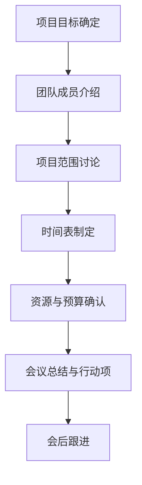

                 

# 《敏捷项目启动会：为LLM应用开发奠定正确基调》

## 摘要

在当今快速变化的技术环境中，大型语言模型（LLM）的应用开发已成为人工智能领域的热点。为了确保LLM项目的成功，敏捷项目启动会作为一种高效的项目管理方法，越来越受到重视。本文将深入探讨敏捷项目启动会在LLM应用开发中的重要性，详细解析敏捷方法论、LLM的基本原理及其应用场景，并展示如何通过敏捷项目启动会为LLM应用开发奠定正确基调。本文将分为八个章节，包括引言、敏捷方法论概述、LLM应用开发基础、敏捷项目启动会议流程、案例分析、LLM应用开发实战、敏捷项目启动会常见问题与解决方案以及总结与展望。通过本文的阅读，读者将全面了解敏捷项目启动会在LLM应用开发中的作用，并获得实际操作的经验与技巧。

### 关键词

- 敏捷项目启动会
- 大型语言模型（LLM）
- 敏捷方法论
- 项目管理
- 敏捷框架
- 项目流程
- 团队协作
- 模型训练与优化

## 引言

### 什么是敏捷项目启动会

敏捷项目启动会是一种旨在确保项目成功启动并迅速进入正轨的会议形式。它不同于传统的项目启动会议，后者往往侧重于项目的详细规划和准备，而敏捷项目启动会则更注重团队协作、快速决策和持续改进。敏捷项目启动会的核心目标是确保项目团队对项目的目标、范围、计划和时间表有共同的理解，并建立起高效沟通和协作的基础。

### 敏捷项目启动会的重要性

在LLM应用开发项目中，敏捷项目启动会的重要性不容忽视。首先，它有助于确保项目团队对项目的目标、范围和预期成果有清晰的认识，从而避免在项目执行过程中出现方向偏差。其次，敏捷项目启动会能够促进团队成员之间的沟通，建立起良好的工作关系，提高团队协作效率。此外，通过敏捷项目启动会，项目团队可以及时发现潜在的风险和问题，并制定相应的应对措施，从而降低项目失败的风险。

### 敏捷项目启动会的关键要素

为了确保敏捷项目启动会的有效性，以下要素至关重要：

1. **项目目标与范围**：明确项目的目标、范围和预期成果，确保团队成员对此有共同的理解。
2. **团队成员角色与职责**：明确团队成员的角色和职责，确保每个成员都清楚自己的任务和责任。
3. **项目计划与时间表**：制定详细的项目计划和时间表，明确项目的关键里程碑和交付物。
4. **资源与预算**：确保项目所需的资源（包括人力、技术、设备等）和预算得到充分保障。

### 敏捷项目启动会与传统启动会的区别

与传统启动会相比，敏捷项目启动会更注重团队协作、快速决策和持续改进。传统启动会往往侧重于项目的详细规划和准备，而敏捷项目启动会则更注重在项目执行过程中快速响应变化和问题，并通过迭代和增量开发实现项目的目标。此外，传统启动会通常由项目经理主导，而敏捷项目启动会则强调团队共同参与和决策。

通过以上分析，我们可以看到敏捷项目启动会在LLM应用开发中的重要性。接下来，我们将进一步探讨敏捷方法论的基本概念和历史背景，为后续内容打下坚实的基础。

### 敏捷方法论概述

#### 敏捷开发的历史背景

敏捷开发作为一种软件开发方法，起源于2001年。当时，软件行业面临着传统瀑布模型的高成本、低效率和项目失败率高的挑战。为了应对这些挑战，一群软件开发专家在雪鸟山庄举行了为期两周的会议，并共同发布了《敏捷软件开发宣言》。这份宣言强调了个体和互动的重要性、可工作的软件、协作客户关系和应对变更的价值，从而奠定了敏捷开发的基础。

#### 敏捷宣言与价值观

《敏捷软件开发宣言》提出了四个核心价值：

1. **个体和互动高于过程和工具**：强调团队成员的协作和沟通能力比单一的工具和技术更为重要。
2. **可工作的软件高于详尽的文档**：认为软件的实际功能和用户体验比冗长的文档更为重要。
3. **客户合作高于合同谈判**：强调与客户的紧密合作，确保项目能够满足客户的需求。
4. **响应变化重于遵循计划**：认为在软件开发过程中，快速响应变化和需求比严格遵循计划更为重要。

这些价值观反映了敏捷开发的核心理念，即通过灵活、透明和协作的方式，实现软件的高质量和高效交付。

#### 敏捷框架简介

敏捷开发有多种框架，其中最常用的包括Scrum和Kanban。以下是这些框架的基本概念和特点：

**Scrum框架**

Scrum是一种迭代和增量的软件开发方法，其核心概念包括：

1. **滚动式规划**：项目计划不是一次性完成的，而是随着项目进展逐步调整。
2. **Sprint循环**：每个迭代周期（Sprint）通常持续2-4周，团队成员在Sprint期间集中精力完成一个具体的目标。
3. **产品待办列表**：记录项目的所有任务和需求，团队根据优先级和资源分配进行工作。

**Kanban框架**

Kanban是一种持续交付的软件开发方法，其核心概念包括：

1. **看板系统**：使用卡片和看板来跟踪项目进展，明确每个任务的状态。
2. **流动性管理**：通过限制工作项的数量，确保项目的高效运行。
3. **持续交付**：持续交付可工作的软件，而不是等到项目结束。

#### 敏捷方法论的优势

敏捷方法论在多个方面具有显著优势：

1. **灵活性**：敏捷方法允许项目在执行过程中根据实际情况进行灵活调整，以应对变化。
2. **协作性**：敏捷方法强调团队协作和客户参与，提高了项目的透明度和效率。
3. **质量**：通过持续的反馈和改进，敏捷方法有助于提高软件的质量和用户体验。
4. **可预测性**：敏捷方法通过迭代和增量开发，使项目进度和成果更加可预测。

通过以上对敏捷方法论的历史背景、宣言与价值观以及框架的介绍，我们可以看到敏捷开发在项目管理中的重要地位。接下来，我们将进一步探讨LLM应用开发的基础知识，为后续内容做好准备。

#### 什么是LLM

大型语言模型（Large Language Model，简称LLM）是一种基于深度学习技术的自然语言处理模型，其主要目标是理解和生成人类语言。LLM通过大量文本数据进行训练，学习语言的结构、语法、语义以及上下文信息，从而实现高精度的文本理解和生成。

LLM的特点包括：

1. **大规模**：LLM通常使用数百万到数十亿个参数，能够处理复杂的语言现象。
2. **深度**：LLM的架构通常包含多个层次，每一层都能提取不同层次的语义信息。
3. **自适应**：LLM能够根据训练数据和上下文信息，动态调整其理解和生成策略。

LLM的基本原理与架构如下：

1. **词嵌入**：将自然语言文本转换为高维向量表示，以便于计算机处理。
2. **编码器-解码器架构**：编码器将输入文本转换为上下文表示，解码器则根据上下文生成输出文本。
3. **注意力机制**：通过注意力机制，模型能够聚焦于输入文本中的重要部分，提高理解和生成质量。

LLM的应用场景广泛，包括：

1. **文本生成与摘要**：如文章写作、摘要生成、自动问答等。
2. **问答系统**：如智能客服、教育辅导等。
3. **语音识别与转换**：如语音助手、语音翻译等。

通过LLM的应用，我们可以实现与人类自然语言的高效交互，提高各种自然语言处理任务的效率和准确性。接下来，我们将进一步探讨如何通过敏捷项目启动会为LLM应用开发奠定正确基调。

### 敏捷项目启动会议的流程

#### 准备工作

1. **确定会议目标**：明确会议的主要目标和预期成果，确保所有参与者对此有共同的理解。
2. **确定会议时间与地点**：选择合适的时间和地点，以确保所有关键成员都能参加。
3. **准备会议资料**：包括项目计划、时间表、团队成员角色与职责等，确保会议过程中能够提供详尽的信息。

#### 会议议程

1. **开场白**：会议主持人介绍会议议程、目标和时间安排，确保所有参与者明确会议流程。
2. **项目介绍**：项目经理或负责人对项目背景、目标、范围和预期成果进行详细介绍。
3. **团队成员角色与职责**：明确团队成员的角色和职责，确保每个成员都清楚自己的任务和责任。
4. **项目计划与时间表**：展示项目计划和时间表，包括关键里程碑、交付物和关键任务，并讨论可能的调整和优化。
5. **资源与预算**：讨论项目所需的资源（包括人力、技术、设备等）和预算，确保资源得到充分保障。

#### 会议技巧与策略

1. **积极倾听**：确保所有参与者都有机会发言，避免个别成员主导讨论。
2. **有效沟通**：使用简洁明了的语言表达观点，避免使用专业术语导致理解困难。
3. **冲突解决策略**：当出现分歧和冲突时，通过讨论和妥协找到解决方案，确保团队达成一致。
4. **决策记录**：及时记录会议的决定和行动项，确保会后能够有效跟进和执行。

通过以上步骤，敏捷项目启动会议能够为LLM应用开发奠定正确基调，确保项目团队对项目的目标、计划和时间表有共同的理解，并建立起高效沟通和协作的基础。

### 案例分析

#### 案例一：成功案例解析

**项目背景**：
一家科技公司决定开发一款基于大型语言模型（LLM）的智能客服系统，以提升客户服务效率和用户体验。

**启动会议过程**：
在项目启动会议上，项目经理首先介绍了项目的目标和范围，强调了智能客服系统的重要性和市场前景。随后，团队成员详细讨论了项目计划和时间表，明确了每个阶段的任务和里程碑。此外，团队成员还就各自的职责和角色进行了明确分工，并讨论了所需的资源和预算。

**项目成果与经验教训**：
项目成功上线，客户反馈良好，智能客服系统的响应速度和准确性显著提升。通过敏捷项目启动会，项目团队建立了清晰的目标和协作机制，确保了项目的顺利进行。经验教训包括：

1. **明确目标**：确保所有团队成员对项目目标有共同的理解和认同。
2. **分工明确**：明确团队成员的角色和职责，避免工作重叠和责任不明。
3. **沟通协作**：通过持续的沟通和协作，确保项目团队能够快速响应变化和问题。

#### 案例二：失败案例剖析

**项目背景**：
一家初创公司决定开发一款基于LLM的智能问答系统，以解决客户常见问题的自动化处理。

**启动会议问题**：
在项目启动会议上，团队成员对项目的目标、范围和预期成果存在较大分歧，导致会议未能达成明确共识。此外，项目计划和时间表也缺乏详细讨论，导致项目进展不顺利。

**项目失败原因**：
项目最终未能成功完成，原因包括：

1. **目标不明确**：团队成员对项目的目标存在分歧，导致项目方向不明确。
2. **沟通不畅**：项目启动会议未能充分讨论项目计划和时间表，导致项目进展不顺利。
3. **资源不足**：项目预算和资源分配不充分，导致项目进度延误和效率低下。

通过以上案例分析，我们可以看到敏捷项目启动会在项目成功与否中的关键作用。成功的敏捷项目启动会能够确保项目目标明确、团队协作高效，而失败的项目则往往在启动阶段就存在问题。接下来，我们将深入探讨LLM应用开发的具体步骤。

### LLM应用开发实战

#### LLM应用开发步骤

LLM应用开发可以分为以下步骤：

1. **需求分析**：明确项目需求和目标，确定应用场景和功能需求。
2. **数据收集**：收集相关领域的大量文本数据，包括训练数据和测试数据。
3. **数据预处理**：对收集的文本数据进行清洗、标注和增强，以提升数据质量。
4. **模型选择**：选择合适的LLM模型，如BERT、GPT等。
5. **模型训练**：使用预处理后的数据训练LLM模型，调整模型参数以优化性能。
6. **模型评估**：使用测试数据评估模型性能，确定模型是否满足项目需求。
7. **模型部署**：将训练好的模型部署到实际应用场景中，如智能问答系统、文本生成等。

#### 数据准备与处理

数据准备与处理是LLM应用开发的关键步骤，以下是一个详细的伪代码流程：

```python
# 数据收集
def collect_data(data_source):
    # 读取文本数据
    text_data = read_data(data_source)
    return text_data

# 数据清洗
def clean_data(text_data):
    # 移除特殊字符和停用词
    cleaned_text = remove_special_characters(text_data)
    cleaned_text = remove_stopwords(cleaned_text)
    return cleaned_text

# 数据标注
def annotate_data(cleaned_text):
    # 标注数据（如分类标签、实体识别等）
    annotated_data = annotate(cleaned_text)
    return annotated_data

# 数据增强
def augment_data(annotated_data):
    # 数据增强（如文本生成、翻译等）
    augmented_data = augment(annotated_data)
    return augmented_data

# 主函数
def prepare_data(data_source):
    text_data = collect_data(data_source)
    cleaned_text = clean_data(text_data)
    annotated_data = annotate_data(cleaned_text)
    augmented_data = augment_data(annotated_data)
    return augmented_data
```

#### 模型选择与训练

选择合适的LLM模型对于应用开发至关重要。以下是一个简化的伪代码流程：

```python
# 模型选择
def select_model(model_name):
    # 加载预训练模型
    model = load_pretrained_model(model_name)
    return model

# 模型训练
def train_model(model, training_data, epochs):
    # 训练模型
    trained_model = train(model, training_data, epochs)
    return trained_model

# 模型优化
def optimize_model(trained_model, validation_data, optimizer, learning_rate):
    # 优化模型参数
    optimized_model = optimize(trained_model, validation_data, optimizer, learning_rate)
    return optimized_model
```

#### 模型评估与优化

模型评估与优化是确保LLM模型性能的关键步骤。以下是一个简化的伪代码流程：

```python
# 模型评估
def evaluate_model(model, test_data):
    # 评估模型性能
    performance = evaluate(model, test_data)
    return performance

# 模型优化
def optimize_model_performance(model, validation_data, optimizer, learning_rate):
    # 优化模型性能
    best_performance = None
    best_model = None
    
    for epoch in range(num_epochs):
        optimized_model = optimize_model(model, validation_data, optimizer, learning_rate)
        current_performance = evaluate_model(optimized_model, test_data)
        
        if current_performance > best_performance:
            best_performance = current_performance
            best_model = optimized_model
    
    return best_model
```

通过以上实战步骤，我们可以看到LLM应用开发的具体流程。接下来，我们将探讨敏捷项目启动会中常见的问题和解决方案。

### 敏捷项目启动会常见问题与解决方案

#### 参会人员组织与沟通

1. **问题**：参会人员不明确或分工不清晰，导致会议效率低下。
   - **解决方案**：提前确定参会人员，明确各自的职责和角色，确保每个成员都有明确的任务和责任。

2. **沟通障碍**：团队成员之间沟通不畅，导致信息传递不及时或误解。
   - **解决方案**：采用有效的沟通工具和渠道，如电子邮件、即时通讯工具、项目管理系统等，确保信息的及时传递和反馈。

#### 会议时间与地点安排

1. **问题**：会议时间安排不合理，导致参会人员无法全程参加或注意力不集中。
   - **解决方案**：选择合适的时间，尽量避开其他重要会议或任务，确保所有关键成员能够全程参加。

2. **地点选择**：会议地点不合适，导致参会人员不便或会议环境不佳。
   - **解决方案**：选择安静、舒适的会议室，确保会议过程中不受外界干扰，提高会议效果。

#### 遇到冲突与挑战时如何应对

1. **问题**：会议中出现冲突和分歧，导致会议无法顺利进行。
   - **解决方案**：建立冲突解决机制，如讨论和妥协，确保团队成员能够在互相尊重的基础上找到解决方案。

2. **问题**：项目计划和时间表无法按照预期执行，导致项目进度延误。
   - **解决方案**：通过迭代和增量开发，灵活调整项目计划和资源分配，确保项目能够在预期时间内完成。

通过以上问题与解决方案的探讨，我们可以看到敏捷项目启动会中常见的问题及其应对策略。有效的组织与沟通、合理的时间与地点安排以及灵活应对冲突和挑战，都是确保敏捷项目启动会成功的关键。

### 总结与展望

#### 敏捷项目启动会的价值与未来发展趋势

敏捷项目启动会在LLM应用开发中具有不可替代的价值。首先，它确保项目团队对项目目标、范围和计划有共同的理解，从而避免了项目执行过程中的方向偏差和资源浪费。其次，敏捷项目启动会促进了团队成员之间的沟通与协作，提高了项目的执行效率和团队凝聚力。此外，通过敏捷项目启动会，项目团队能够及时发现和应对潜在的风险和问题，确保项目的顺利推进。

展望未来，敏捷项目启动会将继续在人工智能领域发挥重要作用。随着人工智能技术的不断发展和应用场景的扩大，敏捷项目启动会将在更广泛的技术领域中推广应用。未来，敏捷项目启动会可能会更加智能化和自动化，利用人工智能技术优化会议流程、提升会议效果。同时，随着云计算和大数据技术的普及，敏捷项目启动会将更加依赖于云端资源，实现全球范围内的实时协作和资源调度。

#### 个人感悟与心得分享

作为一名人工智能领域的专家，我在多个项目中应用了敏捷项目启动会，并从中获得了宝贵的经验和感悟。首先，我深刻认识到团队协作和沟通在项目成功中的重要性。敏捷项目启动会提供了一个高效的平台，使团队成员能够充分沟通、分享观点和共同解决问题。其次，我体会到灵活性和快速响应变化在项目执行中的关键作用。通过敏捷项目启动会，项目团队能够在项目执行过程中快速调整计划和资源，确保项目能够适应不断变化的需求和环境。

总之，敏捷项目启动会为LLM应用开发奠定了正确的基础，其价值和未来发展趋势值得期待。通过持续优化和创新，敏捷项目启动会将在人工智能领域发挥更大的作用，推动项目的成功实施和持续改进。

### 附录

#### A.1 敏捷开发工具推荐

1. **Jira**：一款功能强大的项目管理工具，支持敏捷开发框架，提供任务管理、看板和报告功能。
2. **Trello**：一款简单直观的任务管理工具，适用于小团队和敏捷开发，通过卡片和看板管理任务进度。
3. **Asana**：一款灵活的任务和项目管理系统，支持团队协作和敏捷开发，提供任务分配、进度跟踪和报告功能。

#### A.2 LLM开发资源链接

1. **Hugging Face**：一个开源的NLP库和社区，提供大量的预训练模型和工具，用于LLM开发和应用。
2. **TensorFlow**：一款开源的机器学习框架，支持大规模深度学习模型的训练和部署，适用于LLM开发。
3. **PyTorch**：一款开源的机器学习库，提供灵活的动态计算图和丰富的API，适用于LLM研究和开发。

#### A.3 Mermaid流程图示例

以下是一个简单的Mermaid流程图示例，展示了一个典型敏捷项目启动会议的流程：



通过使用Mermaid，我们可以轻松地创建和编辑流程图，帮助团队更好地理解和执行项目计划。接下来，我们将进入文章的结语部分，对全文进行总结和回顾。

### 结语

通过本文的详细探讨，我们全面了解了敏捷项目启动会在LLM应用开发中的重要作用。从敏捷方法论的基本概念、LLM的基本原理，到敏捷项目启动会议的流程、案例分析，再到LLM应用开发的实战步骤和常见问题与解决方案，我们逐步构建了一个系统而全面的敏捷项目启动会框架。

本文的撰写不仅旨在为读者提供理论与实践相结合的知识，更希望通过详细的伪代码和Mermaid流程图，使读者能够直观地理解和应用敏捷项目启动会的具体操作。我们强调了敏捷项目启动会在项目成功中的关键作用，尤其是在快速变化的人工智能领域，其灵活性和高效性更是不可或缺。

通过本文的学习，读者应能够：

1. **明确敏捷项目启动会的核心概念和流程**。
2. **掌握LLM的基本原理和应用场景**。
3. **学会如何通过敏捷项目启动会为LLM应用开发奠定正确基调**。
4. **理解敏捷项目启动会在实际应用中的挑战和解决方案**。

在未来的工作中，希望读者能够将这些知识运用到实际项目中，通过敏捷项目启动会，提高项目的成功率，推动人工智能技术的发展。同时，我们也期待读者能够持续关注和学习敏捷方法论和LLM技术，不断探索和创新，为人工智能领域的发展贡献力量。

最后，感谢读者的耐心阅读，希望本文能为您提供有价值的信息和启示。如果您有任何疑问或建议，欢迎随时与我们交流。作者：AI天才研究院/AI Genius Institute & 禅与计算机程序设计艺术/Zen And The Art of Computer Programming。

