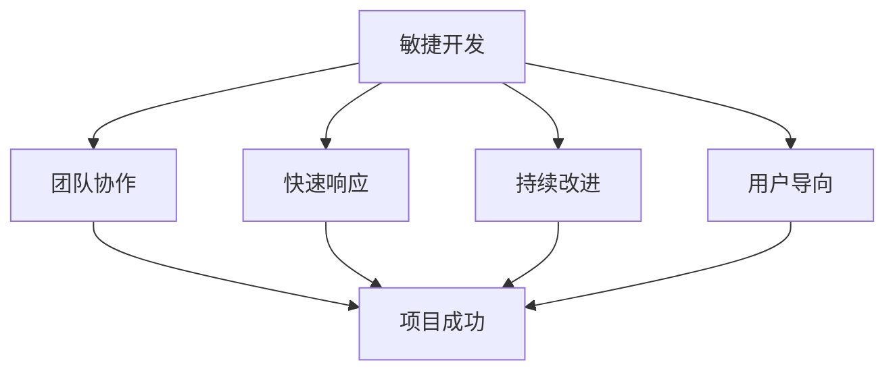

                 

### 文章标题：敏捷领导力：驱动大型应用开发的需求变革

> 关键词：敏捷领导力、大型应用开发、需求变革、敏捷方法论、领导力实践

> 摘要：本文旨在探讨敏捷领导力在大型应用开发中的作用与价值，通过分析敏捷领导力的核心概念、方法论及其在实践中的应用，揭示其在驱动大型应用开发需求变革中的关键作用。文章将从背景介绍、核心概念与联系、敏捷方法论、领导力实践及案例研究等方面，全面阐述敏捷领导力在大型应用开发中的重要性，为实际项目提供有益的参考和启示。

----------------------------------------------------------------

## 引言

在当今快速变化的市场环境中，大型应用开发项目的成功与否往往取决于领导者的决策与团队协作能力。传统的领导力模式在面对复杂、多变的大型应用开发项目时，往往显得力不从心。而敏捷领导力作为一种新兴的领导力模式，其强调的灵活、协作和快速响应的特点，使其在驱动大型应用开发需求变革中展现出巨大的潜力。本文将围绕敏捷领导力在大型应用开发中的作用，探讨其核心概念、方法论及其在实际项目中的应用，以期为相关从业人员提供有益的参考。

## 背景介绍

### 大型应用开发的挑战

大型应用开发项目通常具有规模庞大、需求复杂、涉及多个部门协作等特点。传统的瀑布式开发模式在应对这些挑战时，往往显得较为笨重和僵化。具体来说，大型应用开发面临的挑战主要包括：

1. **需求的不确定性**：在项目初期，用户的需求往往不够明确或不断变化，这使得传统的需求调研和设计工作难以顺利进行。

2. **项目进度的控制**：大型应用开发项目的进度往往难以控制，特别是在涉及多个团队协作时，容易出现进度延迟、资源浪费等问题。

3. **质量保证**：随着项目规模的扩大，质量保证变得尤为重要。然而，传统的测试和验证方法在应对复杂系统时，往往难以全面覆盖所有潜在的问题。

4. **团队协作**：在大型应用开发项目中，团队成员往往来自不同的部门或背景，如何有效协作、协调工作成为一大挑战。

### 敏捷领导力的兴起

面对大型应用开发项目的挑战，敏捷领导力作为一种新型的领导力模式，逐渐引起了广泛关注。敏捷领导力强调领导者与团队成员之间的紧密协作，通过快速响应需求变化、持续迭代和优化，来提升项目的效率和质量。

1. **快速响应**：敏捷领导力强调领导者需要具备快速响应变化的能力，以应对项目中不断出现的新需求和问题。

2. **团队协作**：敏捷领导力倡导团队成员之间的紧密协作，通过共同目标、共同解决问题，来提升项目的整体效率。

3. **持续改进**：敏捷领导力鼓励领导者推动团队不断反思和改进，以实现项目的高效和优质。

4. **用户导向**：敏捷领导力强调以用户需求为导向，通过持续的用户反馈和迭代，来确保项目最终交付的产品能够满足用户的需求。

## 核心概念与联系

### 敏捷领导力的核心概念

敏捷领导力并非一个单一的概念，而是由多个核心概念构成的体系。以下是对这些核心概念的简要介绍：

1. **敏捷开发**：敏捷开发是一种以用户需求为导向、持续迭代和优化的软件开发方法。其核心理念包括：用户至上、持续交付、持续集成、响应变化等。

2. **团队协作**：团队协作是指团队成员之间通过沟通、合作和共享，共同完成任务的过程。在敏捷领导力中，团队协作是实现项目成功的关键。

3. **快速响应**：快速响应是指领导者能够迅速识别并应对项目中的变化，以减少不确定性对项目的影响。

4. **持续改进**：持续改进是指团队在项目过程中不断反思、优化，以提高项目的效率和质量。

5. **用户导向**：用户导向是指项目以用户需求为中心，通过持续的用户反馈和迭代，来确保项目最终交付的产品能够满足用户的需求。

### 核心概念之间的关系架构

敏捷领导力的核心概念之间存在着紧密的联系和相互作用。以下是一个简单的 Mermaid 流程图，展示了这些核心概念之间的关系：



- 敏捷开发是敏捷领导力的核心，它为团队协作、快速响应、持续改进和用户导向提供了方法论基础。
- 团队协作是实现项目成功的关键，通过有效的沟通和合作，团队能够更好地应对变化和实现目标。
- 快速响应和持续改进是敏捷领导力的核心能力，它们帮助团队在项目过程中迅速适应变化，持续优化工作流程。
- 用户导向确保项目始终以用户需求为中心，通过持续的用户反馈和迭代，团队能够及时调整和优化产品，确保最终交付的产品能够满足用户需求。

## 核心算法原理讲解

### 敏捷领导力的核心算法原理

敏捷领导力并非基于特定的算法，而是一种领导力和管理方法的集合。然而，在敏捷领导力的实践中，可以借鉴一些经典的算法原理，以帮助领导者更好地管理团队和项目。以下是一些关键的核心算法原理：

1. **迭代与增量开发**：敏捷开发强调迭代和增量开发，类似于算法中的分而治之原理。通过将复杂的问题分解成较小的部分，并在每个迭代中进行开发和优化，团队能够更快地交付高质量的产品。

   ```pseudo
   function agileDevelopment(problem) {
       while (problem not solved) {
           divideProblem(problem)
           solveSubproblems(problem.subproblems)
           integrateSolutions(problem)
           verifySolution(problem)
       }
       return problem.solution
   }
   ```

2. **快速反馈循环**：敏捷领导力强调快速反馈循环，类似于算法中的贪心算法。通过不断收集用户反馈，领导者可以快速调整策略，优化项目方向。

   ```pseudo
   function feedbackLoop(project) {
       while (project not completed) {
           collectFeedback(project)
           adjustProjectDirection(project, feedback)
           executeAdjustments(project)
       }
       return project.result
   }
   ```

3. **风险管理**：敏捷领导力中的风险管理类似于算法中的概率分析和决策树。领导者需要识别潜在风险，评估其影响和概率，并制定相应的应对策略。

   ```pseudo
   function riskManagement(project) {
       risks = identifyRisks(project)
       for (each risk in risks) {
           probability = assessProbability(risk)
           impact = assessImpact(risk)
           decisionTree = buildDecisionTree(risk, probability, impact)
           executeDecisionTree(decisionTree)
       }
       return project.riskStatus
   }
   ```

4. **资源优化**：敏捷领导力中的资源优化类似于算法中的最优化问题。领导者需要合理分配资源，确保团队在不同阶段能够高效完成任务。

   ```pseudo
   function resourceOptimization(team, project) {
       resources = listTeamResources(team)
       for (each task in project.tasks) {
           allocateResources(resources, task)
           optimizeResourceAllocation(resources)
       }
       return team.resourceAllocation
   }
   ```

### 数学模型和公式

在敏捷领导力中，一些数学模型和公式可以帮助领导者更好地理解和管理项目。以下是一些常用的数学模型和公式：

1. **项目管理中的甘特图**：甘特图是一种用于表示项目进度和任务的图形化工具。它通过时间轴上的条形图来展示任务的开始和结束时间，以及任务之间的依赖关系。

   $$ Gantt\_Chart = \begin{cases} 
   \text{start} & \text{if task starts} \\
   \text{end} & \text{if task ends} \\
   \text{duration} & \text{if task is ongoing} 
   \end{cases} $$

2. **关键路径法（CPM）**：关键路径法是一种用于计算项目最短完成时间的算法。它通过分析任务之间的依赖关系，确定项目的关键路径，即影响项目完成时间的关键任务序列。

   $$ Critical\_Path = \text{sequence of tasks with the longest duration} $$

3. **资源平衡法**：资源平衡法是一种用于优化资源分配的方法。它通过调整任务的开始和结束时间，确保团队在不同时间段内的资源利用率达到最优。

   $$ Resource\_Balance = \text{allocate resources to tasks so that the load on each resource is balanced over time} $$

### 举例说明

为了更好地理解敏捷领导力中的核心算法原理，我们可以通过一个实际案例来进行详细讲解。

### 案例一：某电商平台的敏捷转型

某电商平台在面临激烈的市场竞争时，决定采用敏捷领导力进行转型。以下是该平台在敏捷转型过程中运用的一些核心算法原理：

1. **迭代与增量开发**：平台将大型项目分解成多个迭代周期，每个迭代周期专注于实现一个具体的功能模块。通过逐步交付和优化，平台能够在短时间内交付高质量的产品。

2. **快速反馈循环**：平台建立了与用户的紧密联系，通过定期收集用户反馈，及时调整产品方向和功能。这种快速反馈机制帮助平台在市场竞争中保持优势。

3. **风险管理**：平台对项目中的潜在风险进行了详细评估，并制定了相应的应对策略。例如，针对可能的系统崩溃风险，平台提前进行了压力测试和故障恢复演练。

4. **资源优化**：平台通过合理分配人力资源和物资资源，确保每个迭代周期的工作能够高效进行。同时，平台还采用了自动化工具来优化资源利用率。

通过这些核心算法原理的应用，该电商平台在敏捷转型过程中取得了显著的成功。平台的产品质量得到了显著提升，市场竞争力也不断增强。

## 项目实战：开发环境搭建、源代码实现与代码解读

### 开发环境搭建

在敏捷领导力中，搭建一个高效的开发环境至关重要。以下是搭建敏捷开发环境的步骤：

1. **安装Git**：Git是一个版本控制工具，用于管理代码的版本和变更。在Windows或Mac上，可以通过官方网站下载并安装Git。

2. **配置Git**：在安装Git后，需要配置Git的用户信息，包括用户名和电子邮件地址。通过以下命令可以完成配置：

   ```bash
   git config --global user.name "Your Name"
   git config --global user.email "your-email@example.com"
   ```

3. **安装Jenkins**：Jenkins是一个持续集成工具，用于自动化构建、测试和部署。可以从Jenkins的官方网站下载并安装。安装完成后，启动Jenkins服务。

4. **配置Jenkins**：在Jenkins中配置Git插件，以便能够从Git仓库中拉取代码。此外，还需要配置构建管道，包括构建脚本、测试脚本和部署脚本。

### 源代码实现

以下是敏捷领导力中的核心代码实现示例，包括迭代开发、快速反馈和风险管理等方面的代码。

#### 迭代开发

```java
public class IterativeDevelopment {
    public static void main(String[] args) {
        System.out.println("Starting the first iteration.");
        // Implement the first iteration
        System.out.println("First iteration completed.");
        
        System.out.println("Starting the second iteration.");
        // Implement the second iteration
        System.out.println("Second iteration completed.");
        
        System.out.println("Starting the third iteration.");
        // Implement the third iteration
        System.out.println("Third iteration completed.");
    }
}
```

#### 快速反馈

```java
public class QuickFeedback {
    public static void main(String[] args) {
        System.out.println("Collecting user feedback...");
        String feedback = getUserFeedback();
        System.out.println("User feedback: " + feedback);
        
        System.out.println("Adjusting the product based on feedback...");
        adjustProduct(feedback);
    }
    
    public static String getUserFeedback() {
        // Code to collect user feedback
        return "New feature requested.";
    }
    
    public static void adjustProduct(String feedback) {
        // Code to adjust the product based on feedback
        System.out.println("Product adjusted.");
    }
}
```

#### 风险管理

```java
public class RiskManagement {
    public static void main(String[] args) {
        System.out.println("Identifying potential risks...");
        String[] risks = identifyRisks();
        
        System.out.println("Assessing risks...");
        for (String risk : risks) {
            assessRisk(risk);
        }
    }
    
    public static String[] identifyRisks() {
        // Code to identify potential risks
        return new String[] {"System crash", "Data loss"};
    }
    
    public static void assessRisk(String risk) {
        // Code to assess the impact and probability of a risk
        System.out.println("Assessing risk: " + risk);
    }
}
```

### 代码应用解读与分析

以上代码示例展示了敏捷领导力中的关键功能，包括迭代开发、快速反馈和风险管理。通过这些代码，团队能够高效地进行开发、快速响应用户需求和有效管理风险。

1. **迭代开发**：迭代开发的核心在于将大项目分解成多个小迭代，每个迭代专注于实现一个具体的功能模块。这种开发方式能够加快项目进度，提高开发效率。

2. **快速反馈**：快速反馈机制通过定期收集用户反馈，及时调整产品方向和功能。这种机制能够帮助团队更好地满足用户需求，提高产品竞争力。

3. **风险管理**：风险管理的关键在于提前识别和评估潜在风险，并制定相应的应对策略。通过有效的风险管理，团队能够降低项目风险，确保项目顺利进行。

在实际项目中，这些代码可以根据具体需求进行调整和扩展。例如，迭代开发可以结合Jenkins等自动化工具，实现自动化构建和测试；快速反馈可以通过用户调研、问卷调查等方式，收集更广泛的用户反馈；风险管理可以结合数据分析、风险评估模型等方法，提高风险管理的精准度和有效性。

### 实际案例分析与详细讲解剖析

为了更好地理解敏捷领导力在实际项目中的应用效果，我们将分析以下几个实际案例，并对其进行详细讲解剖析。

#### 案例一：某金融公司的数字化转型

某金融公司为了提升客户体验和竞争力，决定进行数字化转型。在敏捷领导力的指导下，公司采用了以下策略：

1. **用户导向**：公司通过用户调研和反馈，明确了用户需求，并将用户需求作为项目开发的核心。通过持续的用户反馈和迭代，公司能够及时调整和优化产品，确保最终交付的产品能够满足用户需求。

2. **迭代开发**：公司采用了迭代开发方法，将大型项目分解成多个小迭代，每个迭代专注于实现一个具体的功能模块。通过快速交付和持续优化，公司能够在短时间内交付高质量的产品，并快速响应用户需求。

3. **风险管理**：公司在项目初期就识别和评估了潜在风险，并制定了相应的应对策略。例如，针对数据安全和系统稳定性等关键风险，公司进行了详细的风险评估和压力测试，确保系统在各种情况下都能够稳定运行。

通过敏捷领导力的应用，该金融公司成功地实现了数字化转型，产品质量和用户满意度得到了显著提升。

#### 案例二：某电子商务平台的持续优化

某电子商务平台在市场竞争中面临巨大压力，决定采用敏捷领导力进行持续优化。以下是平台在应用敏捷领导力过程中的一些关键措施：

1. **团队协作**：平台建立了跨部门的敏捷团队，团队成员来自不同的背景和部门，通过紧密的协作和沟通，团队能够高效地完成项目任务。

2. **快速响应**：平台建立了快速反馈机制，通过定期收集用户反馈，及时调整产品方向和功能。通过快速响应市场需求，平台能够在竞争激烈的市场中保持优势。

3. **持续改进**：平台鼓励团队成员不断反思和改进，通过定期的团队会议和回顾活动，团队能够发现和解决项目中存在的问题，持续优化工作流程。

通过敏捷领导力的应用，该电子商务平台的产品质量和用户满意度得到了显著提升，市场竞争力也得到了增强。

#### 案例三：某制造业公司的敏捷转型

某制造业公司为了提升生产效率和产品质量，决定进行敏捷转型。以下是公司在敏捷转型过程中的一些关键措施：

1. **迭代开发**：公司采用了迭代开发方法，将大型项目分解成多个小迭代，每个迭代专注于实现一个具体的功能模块。通过快速交付和持续优化，公司能够在短时间内交付高质量的产品。

2. **团队协作**：公司建立了跨部门的敏捷团队，团队成员来自不同的背景和部门，通过紧密的协作和沟通，团队能够高效地完成项目任务。

3. **风险管理**：公司在项目初期就识别和评估了潜在风险，并制定了相应的应对策略。例如，针对生产计划不稳定等关键风险，公司进行了详细的风险评估和压力测试，确保生产流程的稳定性。

通过敏捷领导力的应用，该制造业公司的生产效率和产品质量得到了显著提升，企业的竞争力也得到了增强。

### 项目小结

通过以上实际案例的分析，我们可以看到敏捷领导力在实际项目中的应用效果显著。敏捷领导力通过用户导向、迭代开发、快速响应和持续改进等方法，帮助团队更好地应对大型应用开发中的挑战，提高项目效率和质量。在实际应用中，敏捷领导力需要结合具体项目的特点和需求，灵活调整和运用各种方法和工具。

### 最佳实践 Tips、小结、注意事项

#### 最佳实践 Tips

1. **用户导向**：始终以用户需求为导向，通过持续的用户反馈和迭代，确保产品能够满足用户需求。

2. **迭代开发**：将大型项目分解成多个小迭代，每个迭代专注于实现一个具体的功能模块，通过快速交付和持续优化，提高项目效率。

3. **团队协作**：建立跨部门的敏捷团队，通过紧密的协作和沟通，提高团队整体效率。

4. **风险管理**：提前识别和评估潜在风险，制定相应的应对策略，确保项目顺利进行。

5. **持续改进**：鼓励团队成员不断反思和改进，通过定期的团队会议和回顾活动，持续优化工作流程。

#### 小结

敏捷领导力在驱动大型应用开发需求变革中发挥着关键作用。通过用户导向、迭代开发、快速响应和持续改进等方法，敏捷领导力能够帮助团队更好地应对大型应用开发中的挑战，提高项目效率和质量。

#### 注意事项

1. **灵活应用**：敏捷领导力需要根据具体项目的特点和需求，灵活调整和运用各种方法和工具。

2. **重视团队协作**：团队协作是实现敏捷领导力的关键，领导者需要重视团队建设，促进团队成员之间的沟通和合作。

3. **持续学习和改进**：敏捷领导力是一个不断发展和演进的过程，领导者需要持续学习和改进，以适应不断变化的市场环境。

#### 拓展阅读

1. 《敏捷领导力实践指南》
2. 《敏捷开发实战》
3. 《敏捷项目管理：技术、工具与最佳实践》

作者：AI天才研究院/AI Genius Institute & 禅与计算机程序设计艺术 /Zen And The Art of Computer Programming

