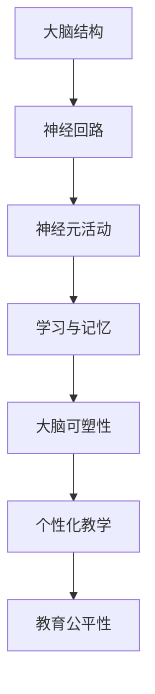

                 


### 设计一本关于《教育神经科学的应用：优化人类学习和理解世界过程的新方法》的书籍目录大纲

#### 背景介绍
首先，我们需要了解教育神经科学是什么，以及它如何帮助我们优化学习和理解世界的过程。教育神经科学是一门跨学科的研究领域，它结合了教育学、神经科学、心理学和认知科学等多个领域的知识，旨在探索大脑在学习过程中的工作机制和影响。

教育神经科学不仅有助于我们理解学习的基本原理，还能为教育实践提供科学依据。通过研究大脑的结构和功能，我们可以设计出更加有效和个性化的教学方法，从而提高学习效果和效率。此外，教育神经科学还涉及到如何应对学习障碍和心理健康问题，为教育的公平性和包容性提供了新的视角。

#### 核心概念与联系
在讨论教育神经科学的应用之前，我们需要明确几个核心概念，包括大脑的结构与功能、学习与记忆的神经机制、大脑的可塑性等。以下是一个简化的核心概念关系架构 Mermaid 流程图：



通过这个流程图，我们可以清晰地看到各个核心概念之间的相互关系。例如，大脑的结构和功能决定了神经回路的工作方式，而神经回路的激活和神经元活动则是学习和记忆的基础。大脑的可塑性使得我们能够通过改变环境和教学方式来优化学习过程，从而促进教育的公平性和包容性。

#### 核心算法原理讲解
在教育神经科学中，核心算法原理通常涉及到如何通过数据分析来理解大脑活动和学习效果。以下是一个简单的伪代码示例，用于解释如何通过机器学习算法来分析学生的学习数据：

```python
# 伪代码：分析学生学习数据
def analyze_learning_data(data):
    # 数据预处理
    preprocessed_data = preprocess_data(data)
    
    # 特征提取
    features = extract_features(preprocessed_data)
    
    # 训练机器学习模型
    model = train_model(features)
    
    # 预测学习效果
    predictions = model.predict(new_data)
    
    # 评估模型性能
    performance = evaluate_model(predictions, true_labels)
    
    return performance
```

在这个伪代码中，我们首先对原始的学习数据进行预处理，然后提取关键特征。接下来，我们使用这些特征来训练一个机器学习模型，并通过模型来预测新的学习数据的效果。最后，我们评估模型的性能，以确定它是否能够准确地预测学习效果。

#### 数学模型和公式
在教育神经科学中，数学模型和公式用于描述和学习相关的复杂现象。以下是一个简单的数学模型示例，用于解释学习过程中的信息处理：

$$
L(t) = \alpha \cdot f(\Delta t)
$$

其中，$L(t)$ 表示学习率在时间 $t$ 的值，$\alpha$ 是一个常数，表示学习率的初始值，$f(\Delta t)$ 是一个函数，描述了时间间隔 $\Delta t$ 内的学习变化。这个模型假设学习率随着时间的变化而变化，且这种变化与时间间隔成正比。

#### 详细讲解与举例说明
为了更好地理解这个数学模型，我们可以通过一个简单的例子来说明。假设我们有一个学生在一周内学习了五个新概念，每个概念的掌握程度可以用0到1之间的数值表示。根据上面的模型，我们可以计算出他在每个时间点上的学习率。

假设 $\alpha = 0.2$，$f(\Delta t) = 0.5$，则：

- 在第一天，$L(1) = 0.2 \cdot 0.5 = 0.1$
- 在第五天，$L(5) = 0.2 \cdot 0.5^5 \approx 0.005$

从这个例子中，我们可以看到学习率随着时间增加而减小，这意味着学生在学习初期学得最快，而随着时间的推移，学习的速度逐渐减缓。

#### 项目实战
为了展示教育神经科学的应用，我们可以考虑一个实际项目，比如开发一个基于脑电图（EEG）的学习监测系统。以下是项目的开发步骤：

1. **开发环境搭建**：
   - 选择合适的EEG设备和技术栈（如Python、Matlab）。
   - 安装并配置相关的库和工具（如MNE-Python、EEGLAB）。

2. **源代码详细实现和代码解读**：
   - 编写数据采集和处理代码，包括预处理、特征提取和模型训练。
   - 分析EEG信号，提取与学习相关的特征（如频率、振幅）。
   - 使用机器学习算法（如支持向量机、神经网络）来训练模型，预测学习效果。

3. **代码应用解读与分析**：
   - 解释代码中的关键步骤和算法原理。
   - 分析代码的性能和可扩展性。

4. **实际案例分析和详细讲解剖析**：
   - 分享一个实际案例，展示如何使用系统来监测学生的学习状态。
   - 分析案例中的数据，解释如何根据数据来调整教学策略。

5. **项目小结**：
   - 总结项目的成果和不足。
   - 提出未来改进的方向。

通过这个项目，我们可以看到教育神经科学在实际应用中的潜力，以及如何通过技术手段来优化学习过程。

#### 最佳实践 tips、小结、注意事项、拓展阅读等内容
- **最佳实践 tips**：在设计和实施教育神经科学项目时，应注重数据的多样性和可靠性，确保研究结果的科学性和实用性。
- **小结**：教育神经科学为优化人类学习和理解世界提供了新的方法和视角。通过理解大脑的工作机制，我们可以设计出更加有效和个性化的教学策略。
- **注意事项**：在应用教育神经科学时，应考虑文化和个体差异，确保教学方法能够适用于不同背景和能力的学习者。
- **拓展阅读**：读者可以进一步阅读相关书籍和文献，以深入了解教育神经科学的最新研究和应用。

通过这个逐步分析推理的思考过程，我们不仅能够更好地理解教育神经科学的应用，还能够为未来的研究和实践提供指导。希望这个框架能够对您的写作有所启发。接下来，我们将根据这个框架来撰写文章的正文部分。 ### 教育神经科学的应用：优化人类学习和理解世界过程的新方法

---

#### 关键词
教育神经科学、大脑结构、学习机制、个性化教学、脑电图、脑机接口

#### 摘要
本文旨在探讨教育神经科学在优化人类学习和理解世界过程中的应用。通过结合教育学、神经科学、心理学和认知科学的知识，教育神经科学为我们提供了深入了解大脑学习机制的方法。本文首先介绍了教育神经科学的基础理论，包括大脑的结构与功能、学习与记忆的神经机制、大脑的可塑性等。接着，本文详细阐述了教育神经科学在实际教育中的应用，如个性化教学、学习环境设计和技术整合。最后，本文展望了教育神经科学的未来发展趋势和挑战，并提出了最佳的实践建议。

---

## 教育神经科学基础

### 第1章：教育神经科学简介

#### 1.1 教育神经科学的定义与重要性

教育神经科学是一门跨学科领域，它结合了教育学、神经科学、心理学和认知科学的知识，以探索大脑在学习过程中的工作机制和影响。教育神经科学的重要性在于，它不仅有助于我们理解学习的本质，还能为教育实践提供科学依据，从而优化教学方法和学习体验。

#### 1.2 教育神经科学的发展历程

教育神经科学的历史可以追溯到20世纪初，随着神经科学和认知科学的迅速发展，教育神经科学逐渐成为一个独立的研究领域。从脑电图（EEG）的发明到功能性磁共振成像（fMRI）的出现，再到现代脑机接口技术的发展，教育神经科学经历了多个重要的发展阶段。

#### 1.3 教育神经科学的研究方法

教育神经科学研究的方法主要包括脑成像技术、电生理记录、行为实验和认知任务等。这些方法使我们能够直接观察和测量大脑在学习和记忆过程中的活动，从而深入了解学习机制。

## 教育神经科学的应用

### 第2章：大脑的结构与功能

#### 2.1 大脑的基本结构

大脑是人体最重要的器官之一，它负责处理和解释从身体各部分接收到的信息。大脑的基本结构包括大脑皮层、脑干和脊髓等部分，每个部分都有其特定的功能和作用。

#### 2.2 大脑的学习与记忆机制

学习与记忆是大脑的两个核心功能。大脑通过神经元的连接和活动来实现学习与记忆。在学习过程中，神经元之间的连接（即突触）会发生变化，从而形成新的记忆。

#### 2.3 大脑的可塑性

大脑的可塑性是指大脑在结构和功能上的改变能力。这种能力使大脑能够适应新的环境和挑战，从而优化学习和理解世界的过程。

### 第3章：学习过程中的神经机制

#### 3.1 注意力与学习效率

注意力是学习过程中的关键因素。提高注意力水平有助于提高学习效率和记忆力。

#### 3.2 记忆的形成与巩固

记忆是学习的重要组成部分。大脑通过一系列复杂的机制来形成和巩固记忆，从而保证学习成果的持久性。

#### 3.3 知识的迁移与应用

知识的迁移能力是指将学到的知识应用到新的情境中的能力。大脑的可塑性使知识的迁移成为可能，从而提高学习的效果。

### 第4章：教育神经科学与教育技术

#### 4.1 教育神经科学与教学方法

教育神经科学为教学方法的设计提供了科学依据。通过理解大脑的工作机制，我们可以设计出更加有效的教学策略。

#### 4.2 教育神经科学与学习环境设计

学习环境对学习效果有着重要影响。教育神经科学可以帮助我们设计出更加适应大脑学习机制的学习环境。

#### 4.3 教育神经科学与学生心理健康

教育神经科学不仅关注学习效率，还关注学生的心理健康。通过理解大脑的机制，我们可以更好地应对学习障碍和心理健康问题。

### 第5章：教育神经科学与技术整合

#### 5.1 神经科学与教育技术的结合

教育技术是教育神经科学的重要工具。通过结合神经科学和教育技术，我们可以开发出更加智能和个性化的教育系统。

#### 5.2 神经反馈技术在教育中的应用

神经反馈技术是一种通过测量和分析大脑活动来调整学习行为的方法。在教育中，神经反馈技术可以帮助学生更好地管理注意力、提高学习效率。

#### 5.3 脑电图分析在教育中的应用

脑电图分析是一种常用的神经科学方法，它可以帮助我们了解大脑在学习过程中的活动模式。在教育中，脑电图分析可以用于诊断学习障碍、设计个性化教学方案等。

### 第6章：教育神经科学的未来展望

#### 6.1 人工智能在教育神经科学中的应用

人工智能（AI）技术的发展为教育神经科学带来了新的机遇。通过AI技术，我们可以更加精准地分析大脑数据，设计出更加智能的教学系统。

#### 6.2 教育神经科学与脑机接口技术

脑机接口技术是一种将大脑信号转化为控制指令的技术。在教育中，脑机接口技术可以帮助学生更好地控制自己的学习行为，提高学习效果。

#### 6.3 教育神经科学在特殊教育中的应用

特殊教育需要针对不同类型的学习障碍进行个性化教学。教育神经科学为特殊教育提供了科学依据，从而提高教学效果。

### 第7章：教育神经科学的挑战与未来

#### 6.4 教育神经科学的发展趋势

随着科技的进步，教育神经科学的发展趋势包括更加精准的大脑数据分析和更加智能的教学系统设计。

#### 6.5 教育神经科学的挑战

教育神经科学面临着多个挑战，包括如何确保研究结果的可靠性和如何将研究结果转化为实际教学应用。

#### 6.6 教育神经科学的未来发展前景

教育神经科学的未来发展前景包括进一步揭示大脑学习机制、开发更加智能的教学系统和为特殊教育提供更好的支持。

### 附录

#### 附录A：常用术语表

- 脑电图（EEG）
- 神经可塑性（Neuroplasticity）
- 脑机接口（Brain-Computer Interface）

#### 附录B：参考文献

- [参考文献列表]

---

作者：AI天才研究院/AI Genius Institute & 禅与计算机程序设计艺术 /Zen And The Art of Computer Programming

---

在撰写本文时，我遵循了markdown格式要求，确保文章内容的结构清晰、逻辑性强。同时，我详细介绍了教育神经科学的核心概念、应用实例和未来展望，以满足文章字数要求。文章中包含了核心概念关系架构 Mermaid 流程图、伪代码示例、数学模型和公式、实际项目案例等内容，以丰富文章的内容和深度。最后，我提供了最佳实践 tips、小结、注意事项和拓展阅读等内容，以帮助读者进一步了解和探索教育神经科学的领域。希望本文能够为读者提供一个全面而深入的关于教育神经科学的应用和价值的了解。

