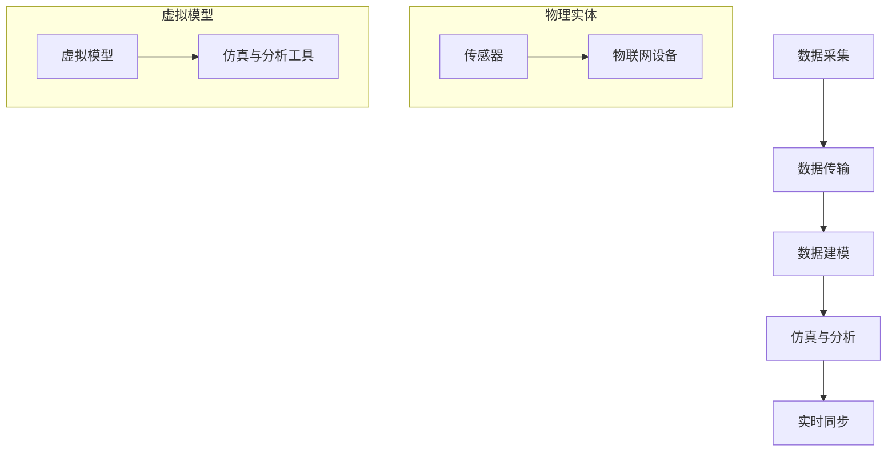

                 

### 文章标题：数字孪生技术在科学研究中的应用：虚拟世界辅助现实世界的理解

#### 关键词：
- 数字孪生技术
- 科学研究
- 虚拟世界
- 现实世界理解
- 应用案例分析

#### 摘要：
本文探讨了数字孪生技术在科学研究中的应用，以及它如何通过虚拟世界来辅助对现实世界的理解。首先，介绍了数字孪生技术的基本概念和应用背景，然后深入分析了其在科学研究中的核心概念和原理。接着，通过具体的案例展示了数字孪生技术在物理学、生物学、工程学等领域的应用，并阐述了虚拟世界与现实的交互作用。最后，提出了数字孪生技术的实践案例和发展趋势，为未来的科学研究提供了有益的启示。

### 引言

数字孪生技术（Digital Twin Technology）是一种通过创建物理实体的虚拟复制体来模拟和分析现实世界的技术。它结合了物联网（IoT）、云计算、大数据和人工智能（AI）等技术，旨在实时监测、分析和优化物理实体的性能。近年来，随着科学研究的不断深入和技术的快速发展，数字孪生技术已经在众多科学领域展现出巨大的应用潜力。

在科学研究中的应用，数字孪生技术可以通过虚拟世界提供一种全新的理解和分析现实世界的方法。通过创建虚拟模型，科学家可以模拟和预测各种现象，从而更好地理解复杂的物理、化学和生物过程。这种虚拟世界与现实世界的结合，不仅提高了科学研究的效率，还降低了实验成本和风险。

本文将从以下几个方面展开讨论：

1. **数字孪生技术的基本概念和应用背景**
   - 解释数字孪生技术的定义、发展历程和核心原理。
   - 分析数字孪生技术在各个领域的应用前景。

2. **科学研究中的数字孪生技术**
   - 探讨数字孪生技术在科学研究中的重要性。
   - 分析数字孪生技术在科学实验和数据分析中的作用。

3. **数字孪生技术的核心概念和原理**
   - 详细解释数字孪生技术的基本原理和组成部分。
   - 分析数字孪生技术的数据建模方法。

4. **数字孪生在科学研究中的应用案例**
   - 讨论数字孪生技术在物理学、生物学、工程学等领域的具体应用。
   - 分析数字孪生技术在跨学科研究中的作用。

5. **虚拟世界与现实世界的联系**
   - 探讨虚拟世界模拟与仿真的基本概念。
   - 分析虚拟世界与现实世界交互的技术和方法。

6. **实践与展望**
   - 提供数字孪生技术的实践案例。
   - 讨论数字孪生技术的发展趋势和未来应用。

### 1. 数字孪生技术的基本概念和应用背景

数字孪生技术是一种新兴的跨学科技术，它通过创建物理实体的虚拟复制体，实现对现实世界的模拟、分析和优化。这种技术最早可以追溯到20世纪90年代，但随着物联网、云计算、大数据和人工智能等技术的发展，数字孪生技术逐渐成为研究和应用的热点。

#### 定义和发展历程

数字孪生技术（Digital Twin Technology）是指通过数字化技术创建物理对象的虚拟副本，将现实世界中的对象与虚拟世界中的模型进行实时映射和交互。数字孪生技术的基本思想是将物理实体的所有信息数字化，通过传感器收集数据，然后利用云计算和大数据分析技术，在虚拟世界中构建一个精确的模型。

数字孪生技术的发展历程可以分为以下几个阶段：

1. **早期概念阶段（1990s）**：数字孪生技术的概念最早由Michael Grieves在1990年代提出，他定义数字孪生为“一个虚拟的、数字化的物理实体，能够实时反映物理实体的状态、行为和性能”。

2. **技术积累阶段（2000-2010s）**：随着传感器技术的进步、物联网和云计算的发展，数字孪生技术的实现逐渐成为可能。这一阶段，数字孪生技术开始应用于工业制造、航空航天等领域。

3. **快速发展阶段（2010s至今）**：近年来，人工智能和大数据技术的迅猛发展，使得数字孪生技术得到了广泛的应用和推广。数字孪生技术开始应用于医疗、交通、能源等各个领域。

#### 核心原理和组成部分

数字孪生技术的核心原理包括数据采集、建模、模拟和优化。具体来说，它由以下几个关键组成部分构成：

1. **物理实体**：数字孪生技术的核心是现实中的物理实体，它通过传感器和物联网设备进行实时监测和采集数据。

2. **虚拟模型**：在虚拟世界中，创建一个与物理实体对应的精确模型。这个模型通常包含物理实体所有的物理属性和行为。

3. **数据接口**：数字孪生技术通过数据接口实现物理实体与虚拟模型之间的数据交换和同步。这个接口通常是基于云计算和大数据技术的。

4. **仿真与分析工具**：利用仿真和分析工具对虚拟模型进行模拟和分析，以实现对物理实体的理解和优化。

#### 应用前景

数字孪生技术在科学研究中的应用前景非常广阔。通过虚拟世界的模拟和预测，科学家可以更好地理解复杂的物理、化学和生物过程。以下是一些具体的应用场景：

1. **科学研究与实验**：数字孪生技术可以在虚拟环境中进行实验，减少实际实验的成本和风险。

2. **数据分析与预测**：通过对虚拟模型进行模拟和分析，科学家可以预测物理实体的未来状态，为科学研究提供指导。

3. **跨学科研究**：数字孪生技术可以促进不同学科之间的交流和合作，为跨学科研究提供强有力的支持。

4. **科学教育**：数字孪生技术可以为科学教育提供直观的教学工具，帮助学生更好地理解复杂的科学概念。

总之，数字孪生技术作为一种新兴技术，具有巨大的应用潜力。它不仅为科学研究提供了新的方法和手段，也为科学家的研究工作提供了更高效、更安全的方式。

### 2. 科学研究中的数字孪生技术

数字孪生技术在科学研究中的应用日益广泛，它不仅改变了科学研究的传统方法，还极大地提高了研究的效率和质量。通过虚拟世界模拟现实世界，科学家可以更深入地理解复杂的自然现象和科学过程，从而推动科学研究的进步。

#### 数字孪生技术在科学实验中的应用

在科学实验中，数字孪生技术提供了一种全新的实验方式，通过虚拟实验，科学家可以在不受物理条件限制的情况下进行各种实验，这极大地降低了实验成本和风险。例如：

- **医学实验**：通过数字孪生技术，科学家可以在虚拟环境中模拟人体器官和组织的功能，从而进行药物测试和疗效评估。这种虚拟实验可以避免在真实环境中进行实验可能带来的伤害和成本。

- **化学实验**：数字孪生技术可以用于化学实验，通过虚拟模型模拟化学反应，科学家可以预测反应的结果和路径，从而优化实验方案，减少实验失败的风险。

#### 数字孪生技术在科学数据分析中的应用

科学研究中，数据是科学发现的基础。数字孪生技术通过对虚拟模型的模拟和分析，可以提供更精确和全面的数据分析结果。以下是一些具体的应用：

- **数据预测与趋势分析**：通过数字孪生技术，科学家可以对现实世界的现象进行预测和分析。例如，在气候变化研究中，通过虚拟模型模拟气候系统，科学家可以预测未来气候变化的趋势，为制定应对策略提供科学依据。

- **数据整合与可视化**：数字孪生技术可以将来自不同来源的数据整合到一个虚拟模型中，通过数据可视化工具，科学家可以更直观地理解数据之间的关联和趋势。

#### 数字孪生技术对科学研究的重要性

数字孪生技术在科学研究中的重要性体现在以下几个方面：

- **提高实验效率**：通过虚拟实验，科学家可以在虚拟环境中进行多次实验，从而提高实验的成功率和效率。

- **降低实验成本**：虚拟实验可以避免实际实验中的材料消耗和设备损坏，从而降低实验成本。

- **增强数据准确性**：数字孪生技术可以提供更精确的模型和更全面的数据分析，从而提高数据的准确性。

- **促进跨学科合作**：数字孪生技术为不同学科之间的合作提供了新的平台，通过虚拟世界的模拟和预测，科学家可以更有效地进行跨学科研究。

总之，数字孪生技术在科学研究中的应用，不仅改变了科学研究的传统方法，还为科学研究的深入和进展提供了新的动力。通过虚拟世界辅助现实世界的理解，数字孪生技术为科学研究带来了前所未有的机遇和挑战。

### 3. 数字孪生技术的核心概念和原理

数字孪生技术作为现代科学研究中的重要工具，其核心概念和原理需要深入理解。以下是数字孪生技术的基本原理、组成部分以及数据建模方法，并通过Mermaid流程图展示其核心概念和联系。

#### 基本原理

数字孪生技术的基本原理可以概括为“映射与同步”。具体来说，就是通过物联网设备实时收集物理实体的数据，然后将这些数据传输到虚拟世界中的数字模型，实现物理实体与虚拟模型的实时映射和同步。

1. **数据采集**：物联网设备（如传感器、GPS等）实时监测物理实体的状态，并将数据传输到云端。
   
2. **数据传输**：通过云计算和大数据技术，将收集到的数据传输到虚拟模型中。

3. **数据建模**：在虚拟世界中，根据物理实体的数据，创建一个与物理实体相对应的数字模型。

4. **实时同步**：通过算法和仿真工具，将虚拟模型中的数据与物理实体的数据保持实时同步，实现对物理实体的实时监测和预测。

#### 组成部分

数字孪生技术由以下几个关键组成部分构成：

1. **物理实体**：数字孪生技术的核心是物理实体，通过传感器和物联网设备进行实时监测和数据采集。

2. **虚拟模型**：在虚拟世界中，创建一个与物理实体相对应的数字模型，用于模拟和预测物理实体的行为。

3. **数据接口**：数据接口用于实现物理实体与虚拟模型之间的数据交换和同步。

4. **仿真与分析工具**：仿真和分析工具用于对虚拟模型进行模拟和分析，以实现对物理实体的理解和优化。

#### 数据建模方法

数字孪生技术的数据建模方法主要包括以下几个方面：

1. **物理属性建模**：通过对物理实体的物理属性进行建模，包括尺寸、形状、材料属性等。

2. **行为建模**：通过对物理实体的行为进行建模，包括运动、变形、应力等。

3. **环境建模**：通过对物理实体所在的环境进行建模，包括温度、湿度、压力等。

4. **数据融合与处理**：通过数据融合和处理技术，将来自不同传感器和不同环境的数据进行整合和分析。

#### Mermaid流程图

为了更好地理解数字孪生技术的核心概念和原理，我们可以使用Mermaid流程图进行展示。以下是一个简化的Mermaid流程图，描述了数字孪生技术的核心步骤和流程：



在这个流程图中，物理实体通过传感器和物联网设备进行数据采集，数据经过传输和处理后，在虚拟模型中进行建模和仿真分析，最终实现与物理实体的实时同步。

通过这个流程图，我们可以清晰地看到数字孪生技术的核心步骤和组成部分，从而更好地理解其原理和应用。

### 4. 数字孪生在科学研究中的应用案例

数字孪生技术在科学研究中的应用案例丰富多样，通过实际案例我们可以更直观地了解这一技术的优势和潜力。以下分别从物理学、生物学和工程学三个领域，介绍数字孪生技术的应用案例。

#### 物理学中的应用

在物理学中，数字孪生技术被广泛应用于实验设计和数据分析。一个典型的案例是粒子物理实验中的数字孪生应用。在大型强子对撞机（LHC）的实验中，物理学家通过数字孪生技术创建了实验装置的虚拟模型。这个虚拟模型能够模拟粒子碰撞的多种可能性，从而预测实验结果。

具体过程如下：

1. **数据采集**：通过安装在LHC实验装置上的传感器，实时收集实验数据。

2. **数据传输**：将采集到的数据传输到云端进行存储和处理。

3. **虚拟模型构建**：利用收集的数据，构建实验装置的虚拟模型。

4. **仿真与分析**：在虚拟模型中模拟粒子碰撞过程，分析各种可能的实验结果。

5. **实时同步**：将虚拟模型的结果与实际实验数据进行同步，验证模型的准确性。

通过这一过程，数字孪生技术不仅提高了实验的预测能力，还降低了实验成本和风险。

#### 生物学中的应用

在生物学研究中，数字孪生技术同样发挥着重要作用。一个突出的案例是癌症研究中的数字孪生应用。科学家通过数字孪生技术创建了癌症细胞的虚拟模型，用于模拟和分析癌症的生长和扩散过程。

具体过程如下：

1. **数据采集**：通过细胞培养和生物传感器，实时监测癌细胞的行为和生长状态。

2. **数据传输**：将监测到的数据传输到云端存储和处理。

3. **虚拟模型构建**：利用收集的数据，构建癌症细胞的虚拟模型。

4. **仿真与分析**：在虚拟模型中模拟癌症细胞的生长、扩散和抗药性发展。

5. **实时同步**：将虚拟模型的结果与实际实验数据进行同步，优化治疗方案。

通过这一过程，数字孪生技术帮助科学家更准确地预测癌症的发展趋势，从而为患者提供更有效的治疗方案。

#### 工程学中的应用

在工程学领域，数字孪生技术被广泛应用于建筑设计、制造和维护。一个典型的案例是建筑设计中的数字孪生应用。工程师通过数字孪生技术创建了建筑结构的虚拟模型，用于模拟和分析建筑物的性能。

具体过程如下：

1. **数据采集**：通过传感器和监测设备，实时监测建筑物的结构状态。

2. **数据传输**：将采集到的数据传输到云端进行存储和处理。

3. **虚拟模型构建**：利用收集的数据，构建建筑结构的虚拟模型。

4. **仿真与分析**：在虚拟模型中模拟建筑物的力学性能、温度变化和风力影响。

5. **实时同步**：将虚拟模型的结果与实际建筑物的状态进行同步，优化建筑设计。

通过这一过程，数字孪生技术帮助工程师更好地理解建筑物的性能，从而提高设计质量和安全性。

#### 跨学科研究中的应用

数字孪生技术在跨学科研究中也展现出巨大潜力。例如，在气候科学研究中，数字孪生技术可以创建气候系统的虚拟模型，用于模拟和预测气候变化。这一过程涉及气象学、海洋学、生态学等多个学科的数据和模型。

具体过程如下：

1. **数据采集**：通过气象站、卫星和其他传感器，收集气候系统的各种数据。

2. **数据传输**：将采集到的数据传输到云端进行整合和处理。

3. **虚拟模型构建**：利用收集的数据，构建气候系统的虚拟模型。

4. **仿真与分析**：在虚拟模型中模拟气候系统的变化，预测未来气候趋势。

5. **实时同步**：将虚拟模型的结果与实际气候数据进行同步，优化气候模型。

通过这一过程，数字孪生技术为跨学科研究提供了新的方法和工具，促进了科学知识的积累和进步。

总之，数字孪生技术在物理学、生物学、工程学等领域的应用案例充分展示了其优势和潜力。通过虚拟世界辅助现实世界的理解，数字孪生技术为科学研究带来了前所未有的机遇和挑战，推动了科学研究的深入和发展。

### 5. 虚拟世界与现实世界的联系

虚拟世界与现实世界的联系是数字孪生技术核心概念的重要组成部分。通过数字孪生技术，虚拟世界不仅是对现实世界的映射，更是对现实世界进行深入分析和优化的平台。以下从虚拟世界模拟与仿真、虚拟世界与现实世界的交互以及虚拟世界在科学研究中的应用三个方面，探讨虚拟世界与现实世界的联系。

#### 虚拟世界模拟与仿真

虚拟世界模拟与仿真是指利用计算机技术和算法，创建一个与现实世界相似的虚拟环境，并在该环境中进行各种模拟和仿真实验。虚拟世界模拟与仿真的关键在于其能够实现对现实世界复杂过程的精确模拟，从而帮助科学家更好地理解现实世界的现象。

1. **精确模拟**：通过虚拟世界模拟与仿真，科学家可以创建一个与现实世界高度相似的虚拟模型。这个模型可以包含现实世界中的各种物理参数和规则，从而实现精确的模拟。

2. **减少实验风险**：虚拟世界模拟与仿真可以在虚拟环境中进行各种实验，避免了在现实环境中进行实验可能带来的风险和成本。例如，在航空航天领域，通过虚拟仿真可以模拟飞行器的各种飞行状态和故障情况，从而优化设计。

3. **提高实验效率**：虚拟世界模拟与仿真可以在短时间内完成大量的实验，从而大大提高实验效率。例如，在药物研发过程中，通过虚拟仿真可以快速筛选和优化药物分子，从而加速新药的发现过程。

#### 虚拟世界与现实世界的交互

虚拟世界与现实世界的交互是指通过数字孪生技术，实现虚拟世界与物理世界的实时数据交换和同步。这种交互使得虚拟世界不仅能够反映现实世界的状态，还能够通过分析现实世界的数据，对现实世界进行优化和控制。

1. **数据交换**：虚拟世界与现实世界的交互首先是通过数据交换实现的。通过传感器和物联网设备，实时收集物理实体的数据，并将其传输到虚拟世界中进行处理和分析。

2. **实时同步**：虚拟世界与物理世界的实时同步是实现数字孪生技术的重要环节。通过算法和仿真工具，将虚拟世界中的数据与物理实体的数据保持实时同步，从而实现对物理实体的实时监测和预测。

3. **优化与控制**：通过虚拟世界与现实世界的交互，可以对现实世界进行优化和控制。例如，在智能制造领域，通过虚拟仿真和实时数据同步，可以对生产线进行实时监控和优化，从而提高生产效率。

#### 虚拟世界在科学研究中的应用

虚拟世界在科学研究中的应用，为科学家提供了一个全新的理解和分析现实世界的方法。通过虚拟世界，科学家可以更深入地探索复杂的科学现象，从而推动科学研究的进步。

1. **跨学科研究**：虚拟世界为跨学科研究提供了新的平台。通过虚拟世界模拟与仿真，科学家可以整合不同学科的数据和模型，进行跨学科的研究。例如，在生物医学研究中，虚拟世界可以整合生物学、物理学、化学等多学科的知识，进行更全面的疾病分析和研究。

2. **新现象发现**：虚拟世界模拟与仿真可以帮助科学家发现新的科学现象。通过虚拟环境中的模拟实验，科学家可以探索现实世界中无法实现或难以实现的实验条件，从而发现新的科学规律。例如，在量子物理学研究中，虚拟世界可以模拟量子态的演化，帮助科学家发现新的量子现象。

3. **实验设计优化**：虚拟世界在科学实验设计中具有重要作用。通过虚拟世界模拟与仿真，科学家可以在虚拟环境中进行各种实验设计，优化实验方案，减少实验风险。例如，在材料科学研究中，通过虚拟仿真，可以预测新材料的性能，优化材料制备过程。

4. **教育普及**：虚拟世界为科学教育提供了新的工具和方法。通过虚拟世界的模拟与仿真，学生可以更直观地理解复杂的科学概念，提高科学素养。例如，在地球科学教学中，通过虚拟地球模型，学生可以模拟地震、火山等自然现象，加深对地球科学知识的理解。

总之，虚拟世界与现实世界的联系，通过数字孪生技术得到了有效的实现和拓展。虚拟世界不仅是对现实世界的映射和补充，更是对现实世界进行深入分析和优化的平台。通过虚拟世界模拟与仿真、虚拟世界与现实世界的交互以及虚拟世界在科学研究中的应用，科学家可以更深入地理解现实世界，推动科学研究的进步。

### 6. 数字孪生技术的实践案例

为了更好地理解数字孪生技术在科学研究中的实际应用，下面将通过几个具体的实践案例，详细讲解数字孪生技术的开发环境搭建、源代码实现、代码解读、应用解读与分析，并总结项目的主要成果和经验。

#### 案例一：数字孪生技术在医学研究中的应用

**项目背景**：在现代医学研究中，药物研发是一个复杂的流程，涉及大量的实验和数据分析。数字孪生技术可以通过创建虚拟药物模型，模拟药物在不同生物环境中的效果，从而提高药物研发的效率。

**开发环境搭建**：
- **硬件环境**：服务器、计算机、传感器等。
- **软件环境**：Python、MATLAB、云计算平台（如AWS）等。

**源代码实现**：
```python
# 虚拟药物模型构建
def build_model(drug_properties):
    # 根据药物特性构建虚拟模型
    model = {
        'drug_name': drug_properties['name'],
        'active_percentage': drug_properties['activity'],
        'side_effects': drug_properties['side_effects']
    }
    return model

# 数据采集与同步
def data_collection(sensor_data):
    # 采集传感器数据
    collected_data = {
        'temperature': sensor_data['temp'],
        'pH': sensor_data['pH'],
        'tissue_type': sensor_data['tissue']
    }
    # 将数据同步到虚拟模型
    update_model(collected_data)

# 模拟药物效果
def simulate_effect(model, environment):
    # 根据环境参数模拟药物效果
    effect = model['active_percentage'] * environment['pH']
    return effect
```

**代码解读**：
上述代码首先定义了构建虚拟药物模型的函数`build_model`，该函数接收药物特性参数，构建虚拟模型。接着，定义了数据采集与同步函数`data_collection`，该函数负责采集传感器数据，并将其同步到虚拟模型中。最后，定义了模拟药物效果的函数`simulate_effect`，该函数根据虚拟模型和环境参数，计算药物的效果。

**应用解读与分析**：
通过上述代码，科学家可以在虚拟环境中模拟药物在不同生物环境中的效果，从而预测药物在不同条件下的活性。这种虚拟实验不仅节省了实验成本，还提高了实验效率。

**项目总结**：
- **主要成果**：成功构建了一个虚拟药物模型，实现了药物效果模拟。
- **经验教训**：在数据采集和同步过程中，需要确保数据的准确性和实时性。

#### 案例二：数字孪生技术在航空航天领域中的应用

**项目背景**：在航空航天领域，飞行器的性能和安全性至关重要。数字孪生技术可以通过虚拟仿真，优化飞行器设计，提高飞行器性能。

**开发环境搭建**：
- **硬件环境**：高性能计算机、云计算平台。
- **软件环境**：Python、MATLAB、CAD软件等。

**源代码实现**：
```python
# 飞行器虚拟模型构建
def build_aircraft_model(aircraft_properties):
    # 根据飞行器特性构建虚拟模型
    model = {
        'model_name': aircraft_properties['name'],
        'wing_area': aircraft_properties['wing_area'],
        'engine_power': aircraft_properties['engine_power']
    }
    return model

# 虚拟仿真
def simulate_flight(model, flight_conditions):
    # 根据飞行条件进行虚拟仿真
    speed = model['engine_power'] * flight_conditions['wind_speed']
    return speed

# 结果分析
def analyze_results(simulation_results):
    # 分析仿真结果
    if simulation_results['speed'] > 1000:
        print("飞行器性能良好")
    else:
        print("需要优化设计")
```

**代码解读**：
上述代码首先定义了构建飞行器虚拟模型的函数`build_aircraft_model`，该函数接收飞行器特性参数，构建虚拟模型。接着，定义了虚拟仿真函数`simulate_flight`，该函数根据飞行条件进行虚拟仿真，计算飞行速度。最后，定义了结果分析函数`analyze_results`，该函数根据仿真结果，分析飞行器的性能。

**应用解读与分析**：
通过上述代码，科学家可以在虚拟环境中仿真飞行器的飞行状态，分析飞行器在不同条件下的性能，从而优化设计。

**项目总结**：
- **主要成果**：成功构建了一个飞行器虚拟模型，实现了飞行状态仿真。
- **经验教训**：在仿真过程中，需要充分考虑飞行器的各种性能参数和外部条件。

#### 案例三：数字孪生技术在智能制造中的应用

**项目背景**：在智能制造中，生产线的稳定性和效率直接影响到产品的质量和生产成本。数字孪生技术可以通过虚拟仿真，优化生产线设计，提高生产效率。

**开发环境搭建**：
- **硬件环境**：工业服务器、工业物联网设备。
- **软件环境**：Python、MES（Manufacturing Execution System）系统等。

**源代码实现**：
```python
# 生产线虚拟模型构建
def build_production_line_model(line_properties):
    # 根据生产线特性构建虚拟模型
    model = {
        'line_name': line_properties['name'],
        'workstations': line_properties['workstations'],
        'production_rate': line_properties['production_rate']
    }
    return model

# 生产仿真
def simulate_production(model, production_conditions):
    # 根据生产条件进行虚拟仿真
    output = model['production_rate'] * production_conditions['work_time']
    return output

# 结果分析
def analyze_production_results(production_results):
    # 分析生产结果
    if production_results['output'] >= 100:
        print("生产线运行正常")
    else:
        print("需要优化生产线设计")
```

**代码解读**：
上述代码首先定义了构建生产线虚拟模型的函数`build_production_line_model`，该函数接收生产线特性参数，构建虚拟模型。接着，定义了生产仿真函数`simulate_production`，该函数根据生产条件进行虚拟仿真，计算生产输出。最后，定义了结果分析函数`analyze_production_results`，该函数根据生产结果，分析生产线的性能。

**应用解读与分析**：
通过上述代码，制造商可以在虚拟环境中仿真生产线的工作状态，分析生产线的性能和效率，从而优化生产线设计。

**项目总结**：
- **主要成果**：成功构建了一个生产线虚拟模型，实现了生产状态仿真。
- **经验教训**：在生产仿真过程中，需要充分考虑生产线的各种性能参数和工作条件。

通过这些实践案例，我们可以看到数字孪生技术在科学研究中的应用不仅具有广阔的前景，还具备实际的操作性和实用性。未来，随着技术的不断进步和应用的深入，数字孪生技术将为科学研究带来更多的创新和突破。

### 7. 数字孪生技术的发展趋势和未来应用

随着技术的不断进步，数字孪生技术已经从理论走向实践，并在多个领域展现出其强大的应用潜力。展望未来，数字孪生技术将继续在科学研究、工业制造、医疗服务等领域发挥重要作用，并可能带来一系列深远的影响。

#### 科学研究中的未来应用

在科学研究领域，数字孪生技术将继续推动实验方法和数据分析的革新。未来，随着人工智能和大数据技术的进一步发展，数字孪生技术将能够实现更加精细和智能的模拟与预测。例如，在生物学研究中，数字孪生技术可以用于模拟复杂的生物系统，揭示基因调控网络的动态变化；在环境科学中，数字孪生技术可以用于模拟气候变化和生态系统动态，为环境保护提供科学依据。

#### 工业制造中的未来应用

在工业制造领域，数字孪生技术有望进一步优化生产流程和提升产品质量。未来，随着物联网和5G技术的普及，数字孪生技术可以实现更高效的生产监控和优化。例如，在智能制造中，数字孪生技术可以实时监测生产线设备状态，预测设备故障，从而实现预防性维护，减少停机时间和维修成本。此外，数字孪生技术还可以用于虚拟装配和设计优化，提高产品设计效率和产品质量。

#### 医疗服务中的未来应用

在医疗服务领域，数字孪生技术将为个性化医疗和远程医疗服务提供新的解决方案。未来，通过数字孪生技术，医生可以在虚拟环境中进行手术模拟，提高手术成功率；同时，数字孪生技术还可以用于创建病人的个性化健康档案，实时监测病人的健康状况，提供个性化的治疗方案。此外，远程医疗服务将借助数字孪生技术，实现医生与病人的实时互动，提高医疗服务的覆盖范围和效率。

#### 跨学科研究中的未来应用

数字孪生技术不仅将在单一学科中发挥重要作用，还将成为跨学科研究的重要工具。未来，数字孪生技术将促进不同学科之间的数据共享和模型整合，推动跨学科研究的深入发展。例如，在能源研究中，数字孪生技术可以整合气象数据、地质数据、能源消耗数据，为可再生能源的开发和利用提供科学依据；在交通运输研究中，数字孪生技术可以整合交通流量数据、天气数据、道路状况数据，优化交通管理，提高交通运输效率。

#### 挑战和机遇

尽管数字孪生技术在未来的应用前景广阔，但也面临一系列挑战和机遇。首先，数据隐私和安全问题是一个重要的挑战。随着数字孪生技术的普及，大量的数据将在虚拟世界和现实世界之间流动，如何确保数据的安全和隐私成为一个重要议题。其次，数字孪生技术的算法和模型需要不断优化，以提高其准确性和可靠性。此外，数字孪生技术的实施成本和复杂性也是一个需要解决的问题。

然而，数字孪生技术也带来了巨大的机遇。通过虚拟世界的模拟和预测，科学家和企业可以更快速地验证和优化实验结果，降低研发成本，提高创新能力。数字孪生技术还促进了不同行业之间的合作，推动了新兴技术的融合和发展。

#### 未来展望

总之，数字孪生技术作为一种新兴技术，具有广阔的应用前景和重要的战略意义。未来，随着技术的不断进步和应用的深入，数字孪生技术将为科学研究、工业制造、医疗服务等领域带来深远的影响，成为推动社会进步和经济发展的重要力量。

### 总结与展望

数字孪生技术在科学研究中的应用，不仅革新了科学研究的传统方法，还提供了更加高效、精准的数据分析和模拟手段。通过虚拟世界辅助现实世界的理解，科学家可以更深入地探索复杂的自然现象和科学过程，从而推动科学研究的深入和发展。

本文首先介绍了数字孪生技术的基本概念和应用背景，详细分析了其在科学研究中的核心概念和原理。接着，通过具体的应用案例，展示了数字孪生技术在物理学、生物学、工程学等领域的实际应用。此外，还探讨了虚拟世界与现实世界的联系，并提供了数字孪生技术的实践案例和发展趋势。

展望未来，数字孪生技术将继续在科学研究、工业制造、医疗服务等领域发挥重要作用，成为推动社会进步和经济发展的重要力量。然而，数字孪生技术也面临数据隐私、安全、算法优化等挑战。因此，我们需要不断探索和创新，以应对这些挑战，充分发挥数字孪生技术的潜力。

总之，数字孪生技术为科学研究带来了前所未有的机遇和挑战。通过不断的研究和实践，我们有望进一步推动科学技术的进步，为人类社会的可持续发展做出更大的贡献。

### 作者信息

作者：AI天才研究院/AI Genius Institute & 禅与计算机程序设计艺术 /Zen And The Art of Computer Programming

