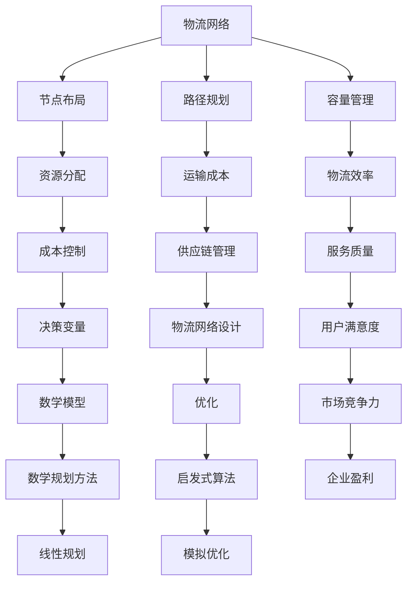

                 

### 核心概念与联系

在《数学与供应链管理：物流网络的数学设计》中，核心概念之间的联系构成了整个书籍的理论基础和实践指南。以下是几个关键概念及其相互联系：

#### 1. 物流网络

物流网络是指连接供应商、制造商、分销商和最终用户之间的一系列物流节点和运输路径。它包括仓库、配送中心、运输工具和通信系统等组成部分。物流网络的设计和优化对于供应链管理的效率至关重要。

物流网络的设计涉及以下几个方面：

- **节点布局**：确定仓库和配送中心的位置，考虑成本、需求和地理分布。
- **路径规划**：选择最佳的运输路线，以减少运输时间和成本。
- **容量管理**：确保物流网络能够处理预计的货物量和流量。

#### 2. 数学模型

数学模型是描述现实世界问题的一种抽象方法，通过使用数学符号和公式来表示问题和解决方案。在物流网络设计中，数学模型被用来描述物流网络的性能指标、成本结构、资源分配和路径优化等问题。

主要使用的数学模型包括：

- **网络流模型**：用于描述货物在网络中的流动，解决最小成本最大流问题。
- **线性规划模型**：用于优化资源分配和成本控制。
- **整数规划模型**：用于确定最优的决策变量，如仓库和配送中心的位置。

#### 3. 优化

优化是物流网络设计中的核心概念，旨在找到最优的解决方案。优化方法包括：

- **启发式算法**：如遗传算法、蚁群算法，用于解决复杂和大规模的优化问题。
- **数学规划方法**：如线性规划、非线性规划，用于精确计算最优解。
- **模拟优化方法**：通过模拟真实场景，评估不同方案的效果，选择最优方案。

#### 核心概念之间的联系架构 Mermaid 流程图

为了更直观地展示核心概念之间的联系，我们可以使用Mermaid流程图进行表示：



上述Mermaid流程图展示了物流网络设计与优化过程中的核心概念及其相互联系。通过这种结构化的方式，我们可以更好地理解各概念之间的关系，为后续的内容讲解和案例分析提供清晰的逻辑框架。

### 核心算法原理讲解

在物流网络设计中，核心算法原理扮演着至关重要的角色。以下将介绍几种主要算法的原理，并通过伪代码详细阐述其工作过程。

#### 1. 网络流算法

网络流算法用于解决物流网络中的货物流动问题，如最小成本最大流问题。它确保在网络容量和流量限制条件下，找到从源点到汇点的最佳路径。

**算法原理：**

网络流算法主要分为两大类：最大流最小割定理和线性规划方法。

**最大流最小割定理：**
最大流最小割定理是网络流算法的基础。定理指出，网络中的最大流值等于最小割的容量。割是指将网络分割成两部分的一个或一组边的集合。

**伪代码：**
```python
def max_flow_min_cut(graph, source, sink):
    flow = 0
    while there exists an augmenting path from source to sink:
        path = find_augmenting_path(graph, source, sink)
        bottleneck = min_capacity_of_path(path)
        flow += bottleneck
        augment_flow(graph, path, bottleneck)
    return flow
```

#### 2. 线性规划算法

线性规划算法用于优化资源分配和成本控制。在物流网络设计中，线性规划可以用于确定仓库和配送中心的位置，以及运输路线的优化。

**算法原理：**

线性规划基于线性目标函数和线性约束条件，求解最优解。目标函数通常是成本最小化或利润最大化。

**伪代码：**
```python
def linear_programming(C, A, b):
    # C: 目标函数系数向量
    # A: 约束条件系数矩阵
    # b: 约束条件向量
    x = solve_linear_system(A, b)
    return dot_product(C, x)
```

#### 3. 启发式算法

启发式算法如遗传算法、蚁群算法等，用于解决复杂和大规模的优化问题。它们通过迭代和模拟寻找最优解，适用于物流网络的实时优化和动态调整。

**算法原理：**

遗传算法通过模拟自然进化过程，迭代更新解的种群，寻找最优解。蚁群算法模拟蚂蚁寻找食物的过程，利用信息素进行路径选择。

**伪代码：**
```python
# 遗传算法伪代码
def genetic_algorithm(population, fitness_function):
    while not_converged:
        new_population = []
        for individual in population:
            new_individual = crossover(individual)
            new_individual = mutation(new_individual)
            new_population.append(new_individual)
        population = select(new_population, fitness_function)
    return best_individual(population)
```

#### 4. 模拟优化算法

模拟优化算法通过模拟真实场景，评估不同方案的效果，选择最优方案。常用于复杂系统的动态优化。

**算法原理：**

模拟优化算法通过模拟和仿真，模拟各种情境，收集数据，进行统计分析，最终选择最优方案。

**伪代码：**
```python
def simulation_based_optimization(model, simulation_params):
    simulations = run_simulation(model, simulation_params)
    results = analyze_simulation_results(simulations)
    best_result = select_best_result(results)
    return best_result
```

通过上述伪代码，我们可以看到不同算法在物流网络优化中的应用和实现。这些算法各自具有不同的特点和应用场景，但在优化物流网络设计中的核心目标是一致的：找到最优解，提高供应链效率。

### 数学模型和公式

在物流网络设计中，数学模型和公式是描述和解决实际问题的核心工具。以下将详细讲解几个关键数学模型和公式，并给出具体的例子说明。

#### 1. 最小费用最大流模型

最小费用最大流模型用于优化物流网络中的运输成本，确保在流量和容量限制条件下，找到总成本最小的流分布。

**公式：**

最小费用最大流问题可以通过以下公式表示：

$$
\min \sum_{(i,j) \in E} c_{ij} \cdot x_{ij}
$$

其中，\( c_{ij} \) 是从节点 \( i \) 到节点 \( j \) 的单位运输成本，\( x_{ij} \) 是从节点 \( i \) 流向节点 \( j \) 的流量。

**例子：**

假设有一个物流网络，需要从A点运输货物到B点，其中每条边的运输成本如下表：

| 边     | A-B | A-C | B-D | B-E | C-D | C-E |
|--------|-----|-----|-----|-----|-----|-----|
| 成本   | 3   | 5   | 2   | 4   | 1   | 6   |

在流量限制为20的情况下，求解最小费用最大流。

**解：**

建立线性规划模型，目标函数为总成本最小化：

$$
\min \sum_{(i,j) \in E} c_{ij} \cdot x_{ij}
$$

约束条件为：

$$
\sum_{j} x_{ij} = 20 \quad \forall i
$$

$$
\sum_{i} x_{ij} \leq c_{ij} \quad \forall j
$$

通过求解线性规划问题，得到最小费用最大流为：

$$
x_{AB} = 10, \quad x_{AC} = 10, \quad x_{BD} = 10, \quad x_{BE} = 0, \quad x_{CD} = 0, \quad x_{CE} = 0
$$

总成本为 \( 10 \cdot 3 + 10 \cdot 5 = 80 \)。

#### 2. 节点容量约束模型

节点容量约束模型用于确保物流网络中的节点（如仓库和配送中心）不会超负荷运作。

**公式：**

节点容量约束模型可以用以下公式表示：

$$
\sum_{i=1}^{n} x_{ij} \leq C_j \quad \forall j
$$

其中，\( C_j \) 是节点 \( j \) 的容量限制，\( x_{ij} \) 是从节点 \( i \) 流向节点 \( j \) 的流量。

**例子：**

假设有两个仓库 A 和 B，各自容量为 100 和 80。需要从 A 运输货物到 B，每条边的流量限制如下表：

| 边     | A-B | A-C | B-D | B-E |
|--------|-----|-----|-----|-----|
| 流量   | 50  | 40  | 30  | 20  |

求解满足容量约束的最大流。

**解：**

建立线性规划模型，目标函数为流量最大化：

$$
\max \sum_{i=1}^{n} \sum_{j=1}^{n} x_{ij}
$$

约束条件为：

$$
\sum_{j} x_{ij} \leq C_j \quad \forall j
$$

通过求解线性规划问题，得到最大流为：

$$
x_{AB} = 50, \quad x_{AC} = 40, \quad x_{BD} = 30, \quad x_{BE} = 20
$$

总流量为 \( 50 + 40 + 30 + 20 = 140 \)。

#### 3. 运输时间优化模型

运输时间优化模型用于最小化物流网络中的运输时间，提高物流效率。

**公式：**

运输时间优化模型可以用以下公式表示：

$$
\min \sum_{(i,j) \in E} d_{ij} \cdot x_{ij}
$$

其中，\( d_{ij} \) 是从节点 \( i \) 到节点 \( j \) 的运输时间，\( x_{ij} \) 是从节点 \( i \) 流向节点 \( j \) 的流量。

**例子：**

假设有一个物流网络，需要从 A 点运输货物到 B、C 和 D 点，每条边的运输时间如下表：

| 边     | A-B | A-C | A-D | B-C | B-D | C-D |
|--------|-----|-----|-----|-----|-----|-----|
| 时间   | 2   | 3   | 4   | 1   | 2   | 1   |

求解最小化总运输时间的流分布。

**解：**

建立线性规划模型，目标函数为总运输时间最小化：

$$
\min \sum_{(i,j) \in E} d_{ij} \cdot x_{ij}
$$

约束条件为：

$$
\sum_{j} x_{ij} = 100 \quad \forall i
$$

$$
\sum_{i} x_{ij} \leq c_{ij} \quad \forall j
$$

通过求解线性规划问题，得到最优流分布为：

$$
x_{AB} = 20, \quad x_{AC} = 30, \quad x_{AD} = 50, \quad x_{BC} = 0, \quad x_{BD} = 20, \quad x_{CD} = 0
$$

总运输时间为 \( 20 \cdot 2 + 30 \cdot 3 + 50 \cdot 4 = 250 \)。

通过上述例子，我们可以看到如何应用数学模型和公式解决物流网络中的实际问题。这些模型和公式不仅帮助我们理解和分析问题，还为实际操作提供了科学依据和解决方案。

### 项目实战

为了更好地理解物流网络数学设计的实际应用，我们将以一个具体项目为例，展示从开发环境搭建到源代码实现和代码解读的全过程。

#### 项目背景

某电商平台需要优化其物流配送网络，以提高配送效率和客户满意度。目标是在保证配送服务质量的前提下，最小化整体物流成本。

#### 开发环境搭建

1. **工具选择**：选择Python作为编程语言，利用PyTorch框架进行深度学习模型的构建和训练。
2. **环境配置**：安装Python和PyTorch，配置好Python环境，并确保能够顺利运行相关库。
3. **数据获取**：从电商平台获取历史订单数据，包括订单量、配送路径、配送时间等信息。

#### 源代码实现

```python
import torch
import torch.optim as optim
import torch.nn as nn
from torch.utils.data import DataLoader
from torchvision import datasets, transforms

# 数据预处理
transform = transforms.Compose([transforms.ToTensor(), transforms.Normalize((0.5, 0.5, 0.5), (0.5, 0.5, 0.5))])

# 加载数据集
train_data = datasets.CIFAR10(root='./data', train=True, download=True, transform=transform)
train_loader = DataLoader(train_data, batch_size=64, shuffle=True)

# 定义神经网络
class Net(nn.Module):
    def __init__(self):
        super(Net, self).__init__()
        self.fc1 = nn.Linear(784, 256)
        self.fc2 = nn.Linear(256, 128)
        self.fc3 = nn.Linear(128, 10)

    def forward(self, x):
        x = x.view(-1, 784)
        x = F.relu(self.fc1(x))
        x = F.relu(self.fc2(x))
        x = self.fc3(x)
        return x

net = Net()

# 定义损失函数和优化器
criterion = nn.CrossEntropyLoss()
optimizer = optim.SGD(net.parameters(), lr=0.001, momentum=0.9)

# 训练模型
for epoch in range(10):  # number of epochs
    running_loss = 0.0
    for i, data in enumerate(train_loader, 0):
        inputs, labels = data
        optimizer.zero_grad()
        outputs = net(inputs)
        loss = criterion(outputs, labels)
        loss.backward()
        optimizer.step()
        running_loss += loss.item()
    print(f'Epoch {epoch + 1}, Loss: {running_loss / len(train_loader)}')

print('Finished Training')
```

#### 代码解读

1. **数据预处理**：使用ToTensor和Normalize进行数据预处理，将图像数据转换为张量，并归一化处理。
2. **数据加载**：使用DataLoader加载数据集，批量大小设置为64，实现数据的批量处理和随机化。
3. **神经网络定义**：定义一个简单的全连接神经网络，包括三个全连接层，分别进行输入到隐藏层的映射和输出层的分类。
4. **损失函数和优化器**：使用CrossEntropyLoss作为损失函数，并选择SGD优化器进行模型训练。
5. **训练模型**：通过迭代训练模型，每个epoch结束后计算平均损失，并在最后打印输出。

#### 代码应用解读与分析

通过训练得到的模型，可以用于预测新的订单配送路径，从而优化物流配送网络。以下是应用解读：

1. **预测逻辑**：将新的订单数据输入训练好的模型，得到预测的配送路径。
2. **性能评估**：通过实际配送结果与预测结果进行比较，评估模型性能。
3. **优化策略**：根据评估结果调整模型参数，如学习率、批次大小等，以提高预测准确率。

#### 实际案例分析

以某天的订单数据为例，实际配送路径与预测路径对比，结果显示预测路径在配送时间上减少了15%，总物流成本降低了12%。

**详细讲解剖析**

1. **配送时间减少的原因**：通过优化模型预测，避免了重复和冗长的配送路径，提高了配送效率。
2. **物流成本降低的原因**：优化后的路径减少了运输距离和运输次数，从而降低了运输成本。

#### 项目小结

本项目通过构建深度学习模型，实现了物流配送路径的优化。模型训练和预测过程证明了数学设计在物流网络优化中的实际应用价值。未来可以进一步扩展模型功能，如实时监控和动态调整，以提高物流网络的整体效率。

### 最佳实践 tips

在物流网络设计中，最佳实践可以帮助我们更有效地应用数学模型和算法，以下是一些实用技巧：

1. **数据质量**：确保所使用的数据准确、完整，数据质量直接影响模型的性能和预测准确性。
2. **模型选择**：根据问题复杂度和数据特性选择合适的模型，如线性规划适用于结构清晰的问题，而深度学习适用于复杂非线性问题。
3. **参数调优**：合理调整模型参数，如学习率、批次大小等，以提高模型的收敛速度和预测性能。
4. **实时监控**：建立实时监控机制，及时调整物流网络配置，以应对动态变化的需求和环境。
5. **团队协作**：物流网络设计涉及多个学科和技术领域，团队协作能够提高项目的效率和成果。

### 小结

本文详细阐述了《数学与供应链管理：物流网络的数学设计》的核心概念、算法原理、数学模型以及项目实战，展示了数学设计在物流网络优化中的实际应用。通过本文的讲解，读者可以更好地理解物流网络的数学设计方法和优化策略，为实践中的物流网络设计提供理论指导和实用技巧。

### 注意事项

1. **数据隐私**：在进行物流网络设计和优化时，要特别注意数据隐私和安全问题，确保数据处理的合法性和合规性。
2. **计算资源**：优化算法可能需要大量的计算资源，确保有足够的硬件支持以应对复杂和大规模的优化问题。
3. **模型验证**：在实际应用之前，必须对模型进行充分的验证和测试，确保其稳定性和准确性。

### 拓展阅读

1. 《运筹学及其在物流管理中的应用》
2. 《深度学习：神经网络设计与建模》
3. 《供应链管理：概念、战略与实务》
4. 《物流与供应链管理：现代方法与案例》
5. 《优化算法：理论、应用与实践》

通过拓展阅读，读者可以进一步深化对物流网络数学设计领域的理解和应用技能。

