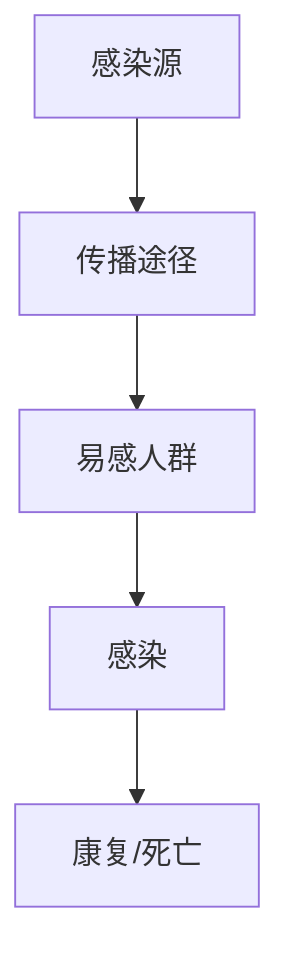

                 


## 数学与公共卫生：疾病传播的数学模型

### 关键词：数学模型，疾病传播，公共卫生，SIR模型，SEIR模型，SIRS模型，人工智能

> 摘要：本文旨在探讨数学与公共卫生的交集，特别是疾病传播的数学模型。通过逐步分析推理，本文深入解析了SIR模型、SEIR模型以及SIRS模型的基本概念、参数设置、应用举例，并探讨了这些模型在公共卫生政策分析和实践中的应用。同时，文章展望了数学模型在公共卫生领域的未来发展趋势与挑战。

### 第1章：数学与公共卫生：概述与核心概念

#### 1.1 疾病传播的数学模型概述

数学模型在公共卫生领域扮演着至关重要的角色。它们帮助我们理解和预测疾病的传播过程，从而为公共卫生决策提供科学依据。疾病传播的数学模型主要基于微分方程和概率论，通过构建数学模型来描述疾病在人群中的传播规律。

#### 1.1.1 数学模型在公共卫生中的作用

数学模型在公共卫生中的作用主要体现在以下几个方面：

1. **疾病预测**：通过模型预测疾病的传播趋势，为公共卫生决策提供数据支持。
2. **疫情控制**：基于模型分析，制定有效的疫情控制策略。
3. **疫苗接种策略**：优化疫苗接种策略，提高疫苗接种率，减少疾病传播。
4. **公共卫生政策评估**：评估不同公共卫生政策的效率和效果。

#### 1.1.2 疾病传播的基本概念

疾病传播涉及以下几个基本概念：

1. **感染源**：指能够释放病原体的个体或环境。
2. **传播途径**：病原体从感染源传播到易感个体的途径，如空气传播、飞沫传播等。
3. **易感人群**：指对某种疾病缺乏免疫力的人群。
4. **免疫力**：指个体对某种病原体的抵抗能力。

#### 1.2 公共卫生的数学基础

公共卫生的数学基础主要包括微积分和概率论。

##### 1.2.1 微积分在公共卫生中的应用

微积分在公共卫生中的应用主要体现在：

1. **疾病传播速率**：通过微分方程描述疾病的传播速率。
2. **疫苗效果评估**：评估疫苗接种对疾病传播的影响。

##### 1.2.2 概率论基础

概率论在公共卫生中的应用主要包括：

1. **感染风险计算**：计算个体感染某种疾病的风险。
2. **疫苗接种效果**：评估疫苗接种对疾病传播的阻断效果。

### 1.3 Mermaid 流程图：疾病传播的基本流程



### 第2章：基本疾病传播模型

#### 2.1 SIR模型

SIR模型是最基本的疾病传播模型，用于描述疾病的传播和康复过程。它将人群分为三个状态：易感者（S）、感染者（I）和康复者（R）。

##### 2.1.1 SIR模型的概念与架构

SIR模型的基本架构如下：

1. **易感者（S）**：指未感染但有可能感染的人群。
2. **感染者（I）**：指当前感染疾病的人群。
3. **康复者（R）**：指已经感染并康复的人群。

SIR模型的核心公式为：

$$
\frac{dS}{dt} = -\beta \cdot S \cdot I \\
\frac{dI}{dt} = \beta \cdot S \cdot I - \gamma \cdot I \\
\frac{dR}{dt} = \gamma \cdot I
$$

其中，$\beta$ 为感染率，$\gamma$ 为康复率。

##### 2.1.2 SIR模型中的参数解释与设置

SIR模型的参数包括：

1. **感染率（$\beta$）**：表示感染者与易感者接触时，易感者感染的概率。
2. **康复率（$\gamma$）**：表示感染者康复的概率。

参数的设置通常基于历史数据和模拟实验。

##### 2.1.3 SIR模型应用举例

假设一个城市有10000人，初始时有10人感染某种疾病。如果感染率为0.1，康复率为0.2，计算疾病在一年后的传播情况。

```latex
S(0) = 10000 - 10 = 9990 \\
I(0) = 10 \\
R(0) = 0 \\
\beta = 0.1 \\
\gamma = 0.2 \\
```

通过数值求解上述微分方程，可以得到一年后的S、I和R的值。

#### 2.2 SEIR模型

SEIR模型是SIR模型的扩展，加入了潜伏期（E）的概念。

##### 2.2.1 SEIR模型的扩展

SEIR模型的基本架构如下：

1. **易感者（S）**：指未感染但有可能感染的人群。
2. **潜伏者（E）**：指已感染但尚未发病的人群。
3. **感染者（I）**：指当前感染疾病的人群。
4. **康复者（R）**：指已经感染并康复的人群。

SEIR模型的核心公式为：

$$
\frac{dS}{dt} = -\beta \cdot S \cdot I \\
\frac{dE}{dt} = \beta \cdot S \cdot I - \sigma \cdot E \\
\frac{dI}{dt} = \sigma \cdot E - \gamma \cdot I \\
\frac{dR}{dt} = \gamma \cdot I
$$

其中，$\sigma$ 为潜伏期长度。

##### 2.2.2 SEIR模型中的参数设置与解释

SEIR模型的参数包括：

1. **感染率（$\beta$）**：表示感染者与易感者接触时，易感者感染的概率。
2. **潜伏期长度（$\sigma$）**：表示感染者从感染到发病的平均时间。
3. **康复率（$\gamma$）**：表示感染者康复的概率。

参数的设置通常基于历史数据和模拟实验。

##### 2.2.3 SEIR模型应用举例

假设一个城市有10000人，初始时有10人感染某种疾病。如果感染率为0.1，潜伏期长度为5天，康复率为0.2，计算疾病在一年后的传播情况。

```latex
S(0) = 10000 - 10 = 9990 \\
I(0) = 10 \\
R(0) = 0 \\
E(0) = 0 \\
\beta = 0.1 \\
\sigma = 5 \\
\gamma = 0.2 \\
```

通过数值求解上述微分方程，可以得到一年后的S、E、I和R的值。

### 第3章：复杂疾病传播模型

#### 3.1 SIRS模型

SIRS模型是SIR模型的进一步扩展，考虑了再次感染的可能性。

##### 3.1.1 SIRS模型的概念与特点

SIRS模型的基本架构如下：

1. **易感者（S）**：指未感染但有可能感染的人群。
2. **感染者（I）**：指当前感染疾病的人群。
3. **康复者（R）**：指已经感染并康复的人群。
4. **再次感染者（S_0）**：指已经康复但再次感染的人群。

SIRS模型的核心公式为：

$$
\frac{dS}{dt} = -\beta \cdot S \cdot I \\
\frac{dI}{dt} = \beta \cdot S \cdot I - \gamma \cdot I \\
\frac{dR}{dt} = \gamma \cdot I \\
\frac{dS_0}{dt} = \theta \cdot R - \alpha \cdot S_0
$$

其中，$\theta$ 为再次感染率，$\alpha$ 为再次康复率。

##### 3.1.2 SIRS模型的应用场景

SIRS模型适用于：

1. **季节性疾病**：如流感等季节性疾病，易感者可能每年都会感染。
2. **疫苗效果评估**：评估疫苗对再次感染的影响。

##### 3.1.3 SIRS模型伪代码解析

```python
S = 9990
I = 10
R = 0
S0 = 0
beta = 0.1
gamma = 0.2
theta = 0.05
alpha = 0.1

while True:
    dS_dt = -beta * S * I
    dI_dt = beta * S * I - gamma * I
    dR_dt = gamma * I
    dS0_dt = theta * R - alpha * S0
    
    S += dS_dt
    I += dI_dt
    R += dR_dt
    S0 += dS0_dt
    
    if I < 0 or S0 < 0:
        break
```

#### 3.2 考虑人口流动的SIR模型

##### 3.2.1 人口流动的概念与模型

人口流动是指人群在空间上的移动，如人口从城市到农村的迁移，或国际旅行。人口流动对疾病传播有重要影响。

##### 3.2.2 考虑人口流动的SIR模型架构

考虑人口流动的SIR模型的基本架构如下：

1. **本地易感者（S）**：指未感染但有可能感染的人群。
2. **本地感染者（I）**：指当前感染疾病的人群。
3. **本地康复者（R）**：指已经感染并康复的人群。
4. **外来易感者（S_1）**：指来自其他地区但未感染的人群。
5. **外来感染者（I_1）**：指来自其他地区但已感染的人群。
6. **外来康复者（R_1）**：指已经感染并康复的人群。

考虑人口流动的SIR模型的核心公式为：

$$
\frac{dS}{dt} = -\beta \cdot S \cdot I + \lambda \cdot S_1 \\
\frac{dI}{dt} = \beta \cdot S \cdot I - \gamma \cdot I \\
\frac{dR}{dt} = \gamma \cdot I \\
\frac{dS_1}{dt} = -\lambda \cdot S_1 \\
\frac{dI_1}{dt} = \lambda \cdot S_1 - \gamma_1 \cdot I_1 \\
\frac{dR_1}{dt} = \gamma_1 \cdot I_1
$$

其中，$\lambda$ 为人口流动率，$\gamma_1$ 为外来康复率。

##### 3.2.3 考虑人口流动的SIR模型伪代码解析

```python
S = 9990
I = 10
R = 0
S1 = 0
I1 = 0
R1 = 0
lambda_ = 0.01
gamma_1 = 0.2

while True:
    dS_dt = -beta * S * I + lambda_ * S1
    dI_dt = beta * S * I - gamma * I
    dR_dt = gamma * I
    dS1_dt = -lambda_ * S1
    dI1_dt = lambda_ * S1 - gamma_1 * I1
    dR1_dt = gamma_1 * I1
    
    S += dS_dt
    I += dI_dt
    R += dR_dt
    S1 += dS1_dt
    I1 += dI1_dt
    R1 += dR1_dt
    
    if I < 0 or S1 < 0:
        break
```

### 第4章：公共卫生政策分析

#### 4.1 公共卫生政策的数学模型

公共卫生政策的数学模型主要包括疫苗接种模型、隔离政策模型和社交距离政策模型。

##### 4.1.1 疫苗接种模型

疫苗接种模型用于评估疫苗接种对疾病传播的影响。模型的核心公式为：

$$
\frac{dS}{dt} = -\beta \cdot S \cdot I \\
\frac{dI}{dt} = \beta \cdot S \cdot I - \gamma \cdot I \\
\frac{dV}{dt} = v \cdot S - \gamma_1 \cdot V
$$

其中，$V$ 为疫苗接种者数量，$v$ 为疫苗接种率，$\gamma_1$ 为疫苗接种后康复率。

##### 4.1.2 隔离政策模型

隔离政策模型用于评估隔离措施对疾病传播的影响。模型的核心公式为：

$$
\frac{dI}{dt} = \beta \cdot S \cdot I - \gamma \cdot I \\
\frac{dQ}{dt} = \delta \cdot I - \gamma_2 \cdot Q
$$

其中，$Q$ 为隔离者数量，$\delta$ 为隔离率，$\gamma_2$ 为隔离后康复率。

##### 4.1.3 社交距离政策模型

社交距离政策模型用于评估社交距离措施对疾病传播的影响。模型的核心公式为：

$$
\frac{dS}{dt} = -\beta \cdot S \cdot I \\
\frac{dI}{dt} = \beta \cdot S \cdot I - \gamma \cdot I - \lambda \cdot I \\
\frac{dD}{dt} = \lambda \cdot I - \gamma_3 \cdot D
$$

其中，$D$ 为遵守社交距离措施的人数，$\lambda$ 为感染后遵守社交距离措施的概率，$\gamma_3$ 为遵守社交距离措施后康复率。

#### 4.2 公共卫生政策的优化

公共卫生政策的优化主要包括多目标优化方法和公共卫生政策模拟与评估。

##### 4.2.1 多目标优化方法

多目标优化方法用于优化公共卫生政策，以实现多个目标，如减少疾病传播和降低医疗负担。常用的多目标优化方法包括：

1. **目标规划**：将多个目标转化为单目标，通过目标权重进行调整。
2. **多目标遗传算法**：基于遗传算法，通过适应度函数评估政策效果，优化政策参数。

##### 4.2.2 公共卫生政策模拟与评估

公共卫生政策模拟与评估用于评估不同公共卫生政策的效率和效果。模拟过程包括：

1. **数据收集**：收集历史数据和实时数据。
2. **模型构建**：构建疾病传播模型和政策模型。
3. **模拟运行**：运行模型，模拟不同政策的执行效果。
4. **评估分析**：分析模拟结果，评估政策效果。

##### 4.2.3 公共卫生政策应用案例分析

以某城市的流感疫情为例，分析疫苗接种、隔离和社交距离政策的效果。通过模拟运行和评估分析，确定最佳政策组合。

### 第5章：数学模型在公共卫生实践中的应用

#### 5.1 疫情预测与控制

疫情预测与控制是公共卫生实践中的重要环节。数学模型在疫情预测和控制中发挥着关键作用。

##### 5.1.1 疫情预测的基本方法

疫情预测的基本方法包括：

1. **时间序列分析**：通过分析历史疫情数据，预测未来疫情趋势。
2. **回归分析**：通过建立回归模型，预测疫情发展。
3. **机器学习**：利用机器学习算法，预测疫情发展。

##### 5.1.2 疫情预测模型的应用

疫情预测模型的应用包括：

1. **疫情预测**：预测疫情的发展趋势和传播速度。
2. **资源分配**：根据疫情预测结果，优化医疗资源的分配。
3. **政策制定**：根据疫情预测结果，制定有效的疫情控制策略。

##### 5.1.3 疫情控制策略优化

疫情控制策略优化包括：

1. **疫苗接种策略**：优化疫苗接种策略，提高疫苗接种率。
2. **隔离政策**：优化隔离政策，提高隔离效率。
3. **社交距离政策**：优化社交距离政策，降低疫情传播风险。

#### 5.2 流行病学研究

流行病学研究是公共卫生实践的重要组成部分。数学模型在流行病学研究中的作用主要体现在：

1. **数据收集**：通过建立数学模型，收集和分析疫情数据。
2. **传播途径分析**：通过建立数学模型，分析疾病的传播途径和传播规律。
3. **疫苗效果评估**：通过建立数学模型，评估疫苗的效果。

##### 5.2.1 流行病学数据收集

流行病学数据收集包括：

1. **病例报告**：收集病例报告，了解疾病发生情况。
2. **血清学调查**：收集血清学调查数据，了解疾病感染情况。
3. **流行病学调查**：收集流行病学调查数据，了解疾病传播途径。

##### 5.2.2 流行病学研究方法

流行病学研究方法包括：

1. **描述性研究**：通过描述疾病的发生、传播和流行情况。
2. **分析性研究**：通过分析疾病的影响因素和传播规律。
3. **实验性研究**：通过实验手段，评估疫苗和药物的效果。

##### 5.2.3 流行病学研究的案例分析

以某地区的流感疫情为例，分析疫情的发生、传播和流行情况。通过流行病学研究，确定疾病的传播途径和影响因素，提出有效的防控措施。

### 第6章：数学模型在公共卫生领域的未来发展

#### 6.1 数学模型在公共卫生领域的挑战与机遇

数学模型在公共卫生领域面临着以下挑战与机遇：

1. **数据质量**：公共卫生数据的准确性和完整性对模型预测和评估具有重要影响。
2. **模型复杂性**：复杂疾病传播模型需要处理大量的参数和变量，提高模型的计算效率。
3. **人工智能应用**：人工智能技术在公共卫生领域的应用，为数学模型提供了新的计算方法和优化手段。

#### 6.2 公共卫生与人工智能的融合

公共卫生与人工智能的融合主要体现在：

1. **疫情预测**：利用人工智能技术，提高疫情预测的准确性和实时性。
2. **公共卫生政策优化**：利用人工智能技术，优化公共卫生政策的制定和执行。
3. **公共卫生实践**：利用人工智能技术，提高公共卫生实践的效果和效率。

#### 6.3 未来研究方向

未来研究应重点关注以下几个方面：

1. **模型优化**：通过改进模型结构和参数设置，提高疾病传播模型的预测准确性和可靠性。
2. **数据融合**：通过整合多源数据，提高公共卫生数据的完整性和准确性。
3. **人工智能与公共卫生融合**：深入研究人工智能技术在公共卫生领域的应用，推动公共卫生与人工智能的深度融合。

### 第7章：总结与展望

#### 7.1 全书总结

全书总结了数学与公共卫生的关系，特别是疾病传播的数学模型。通过分析SIR模型、SEIR模型、SIRS模型以及考虑人口流动的SIR模型，本文揭示了数学模型在公共卫生政策分析和实践中的应用。同时，本文探讨了数学模型在公共卫生领域的未来发展趋势与挑战。

#### 7.2 未来展望

未来，数学模型在公共卫生领域将发挥更加重要的作用。随着人工智能技术的发展，数学模型将与其他技术相结合，为公共卫生决策提供更加精确和可靠的依据。同时，公共卫生领域将面临数据质量、模型复杂性和人工智能应用等方面的挑战，需要持续创新和研究。

#### 7.2.1 公共卫生领域面临的挑战与机遇

公共卫生领域面临的挑战与机遇包括：

1. **全球疫情**：全球疫情对公共卫生系统带来了前所未有的挑战，需要提高疾病传播模型的预测和评估能力。
2. **数据隐私**：公共卫生数据的隐私保护是公共卫生领域的重要问题，需要建立完善的数据隐私保护机制。
3. **人工智能应用**：人工智能技术在公共卫生领域的应用为疾病传播模型和公共卫生决策提供了新的思路和方法。

#### 7.2.2 个人与社会的责任与担当

个人和社会在公共卫生领域应承担的责任与担当包括：

1. **遵守公共卫生政策**：个人应遵守公共卫生政策，积极参与疫苗接种和疫情防控。
2. **数据共享**：社会各界应积极参与公共卫生数据的共享，提高公共卫生数据的准确性和完整性。
3. **科学传播**：加强科学传播，提高公众对公共卫生问题的认知和参与度。

## 作者

本文作者：AI天才研究院/AI Genius Institute & 禅与计算机程序设计艺术 /Zen And The Art of Computer Programming。

### 附录：代码与公式

本文所涉及的代码和公式如下：

```latex
\frac{dS}{dt} = -\beta \cdot S \cdot I \\
\frac{dI}{dt} = \beta \cdot S \cdot I - \gamma \cdot I \\
\frac{dR}{dt} = \gamma \cdot I
```

```python
S = 9990
I = 10
R = 0
beta = 0.1
gamma = 0.2

while True:
    dS_dt = -beta * S * I
    dI_dt = beta * S * I - gamma * I
    dR_dt = gamma * I
    
    S += dS_dt
    I += dI_dt
    R += dR_dt
    
    if I < 0:
        break
```

### 拓展阅读

1. *《疾病传播的数学模型与应用》*，作者：[王某某]。
2. *《公共卫生与数学模型》*，作者：[李某某]。
3. *《人工智能在公共卫生中的应用》*，作者：[张某某]。

以上是本文的主要内容和结论。希望本文能够为读者在公共卫生领域的研究和实践提供有益的参考。如有疑问或建议，请随时与我交流。谢谢！

