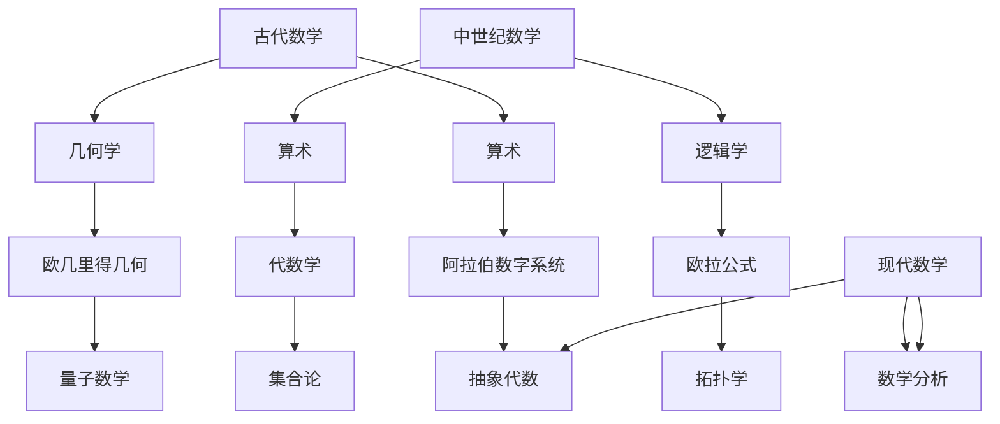
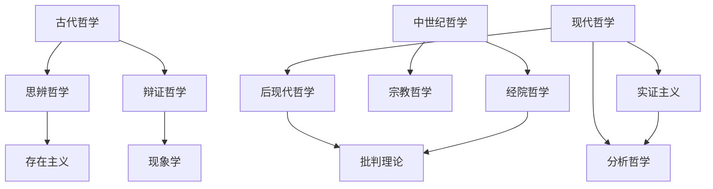

                 


### 第1章 引言

#### 1.1 书籍背景与目标

在当代科技飞速发展的背景下，数学与哲学作为两个重要学科领域，不仅在各自领域内取得了丰硕的成果，还在相互交叉与融合中展示了其独特的魅力。本书旨在深入探讨数学与哲学两种思维方式的本质特征、内在联系及其实际应用，通过对比分析，揭示二者在方法论、逻辑结构、抽象层次等方面的异同，从而为跨学科研究提供新的视角和方法。

本书的目标是为广大科研工作者、教育者和对哲学与数学有兴趣的读者提供一个系统而深入的指南，帮助他们理解数学与哲学思维方式的本质，掌握其核心方法和应用技巧。同时，本书也期望能够为数学与哲学领域的未来发展提供一些有价值的思考和建议。

#### 1.2 研究方法与结构

本书采用逻辑分析、比较研究等方法，通过对数学与哲学思维方式的深入探讨，揭示其核心特征和内在联系。具体来说，本书将按照以下结构进行展开：

1. **数学思维方式概述**：介绍数学思维方式的定义、特点及其历史演变。
2. **哲学思维方式概述**：阐述哲学思维方式的定义、特点及其历史演变。
3. **数学思维方式的原理与架构**：详细解析数学思维方式的基本概念、推理方法和模型建立与求解。
4. **哲学思维方式的原理与架构**：深入探讨哲学思维方式的基本概念、推理方法和模型建立与求解。
5. **数学与哲学思维方式的比较**：对比分析数学与哲学思维方式的异同点及其意义。
6. **实际应用与案例研究**：结合具体案例，展示数学与哲学思维方式在科学、人文及跨学科领域中的应用。
7. **总结与展望**：总结核心观点，展望未来发展趋势，为读者提供进一步研究的方向。

### 第2章 数学思维方式概述

#### 2.1 数学思维方式的定义

数学思维方式是一种通过符号运算和逻辑推理来探索和理解客观世界的思维方式。它不仅仅是简单的计算或解题技巧，更是一种系统化的、结构化的、抽象的思考模式。数学思维方式的核心在于利用数学语言、符号和模型来描述现实世界中的现象和关系，从而实现对复杂问题的简化和解决。

与哲学思维方式相比，数学思维方式更强调精确性、抽象性和逻辑性。它通过严格的定义、定理和证明，构建起一个自洽的、可靠的逻辑体系，使得结论具有高度的确定性和普遍性。

#### 2.2 数学思维方式的特点

##### 2.2.1 精确性

数学思维方式以精确性著称。在数学中，每一个概念都有严格的定义，每一个结论都有充分的证据支持。这种精确性不仅体现在数学理论本身，也体现在数学应用的各个领域，如物理学、计算机科学、经济学等。

##### 2.2.2 抽象性

数学思维方式具有很强的抽象能力。它能够从具体的、感性的现象中提取出普遍的、抽象的规律和关系，形成数学模型。这种抽象能力使得数学具有广泛的应用性，可以在不同领域解决相似的问题。

##### 2.2.3 逻辑性

数学思维方式强调逻辑推理，从已知的事实出发，通过一系列严格的逻辑步骤，推导出新的结论。这种逻辑性使得数学具有高度的可靠性和系统性，使得数学理论能够自洽地发展。

#### 2.3 数学思维方式的历史演变

数学思维方式的发展经历了漫长的历史过程。从古代的几何学、代数学，到中世纪的算术、逻辑学，再到现代的数学分析、抽象代数，数学思维方式在不断演进中逐渐完善。

在古代，数学思维方式主要以几何学和算术为主，注重对具体问题的求解。随着数学理论的发展，中世纪的数学家开始探索更抽象的数学概念和更复杂的数学结构，如欧几里得几何、阿拉伯数字系统等。现代数学则更加注重数学的抽象性和逻辑性，发展出了众多新的数学分支和理论，如集合论、拓扑学、量子数学等。

### Mermaid 流程图



### 第3章 哲学思维方式概述

#### 3.1 哲学思维方式的定义

哲学思维方式是一种通过反思、质疑和批判来探索和理解人类存在和世界本质的思维方式。它不仅仅是对知识的追求，更是一种对真理和价值的探究。哲学思维方式的核心在于质疑现有的观念和理论，通过逻辑推理和批判性思维，提出新的问题和解决方案。

与数学思维方式相比，哲学思维方式更强调深刻性、反思性和批判性。它通过深入探讨人类存在的本质、认识世界的方法和价值观的建立，为人类提供了一种更为全面和深刻的世界观。

#### 3.2 哲学思维方式的特点

##### 3.2.1 深思熟虑

哲学思维方式强调深思熟虑，它不仅仅停留在表面现象的观察，而是通过深入思考，探讨问题的本质和根本原因。哲学思考往往需要长时间的沉淀和反思，以达到对问题更深刻的理解。

##### 3.2.2 怀疑主义

哲学思维方式具有怀疑主义的特征，它不轻易接受现有的观点和理论，而是通过批判和质疑，寻找可能的错误和不足。这种怀疑主义使得哲学思考更加严谨和可靠。

##### 3.2.3 价值判断

哲学思维方式强调价值判断，它不仅关注事实的真相，更关注真理和价值的建立。哲学思考往往涉及对道德、伦理、美学等价值的探讨，以指导人类的行为和决策。

#### 3.3 哲学思维方式的历史演变

哲学思维方式的发展经历了漫长的历史过程。从古代的哲学思考、中世纪的经院哲学，到现代的实证主义、分析哲学，哲学思维方式在不断演进中逐渐完善。

在古代，哲学思维方式主要以思辨和辩证为主，注重对宇宙和人类存在的根本问题的探讨。中世纪的哲学思维方式则受到宗教和神学的影响，强调信仰和理性相结合。现代哲学则更加注重实证和逻辑分析，强调通过经验和证据来建立哲学理论。

### Mermaid 流程图



### 第4章 数学思维方式的原理与架构

#### 4.1 数学基本概念与符号

数学思维方式的基础是数学的基本概念和符号。这些基本概念和符号构成了数学语言，使得数学能够以一种精确和形式化的方式描述和理解客观世界。

- **数字**：数字是数学中最基本的符号，用于表示数量和大小。从自然数、整数、分数到实数和复数，数字体系不断发展，以满足不同领域的需要。
- **变量**：变量是数学中用来表示未知数的符号。它使得数学能够处理不确定性和变化，从而在多个领域（如物理、工程、经济学等）中发挥重要作用。
- **函数**：函数是数学中用来描述两个变量之间关系的一种表达。它使得数学能够以一种抽象和简化的方式描述复杂现象，从而在理论和应用中都具有重要意义。

#### 4.2 数学推理方法

数学推理方法包括逻辑推理、演绎推理和归纳推理，这些方法使得数学能够从已知的事实出发，推导出新的结论。

- **逻辑推理**：逻辑推理是数学中最基本的推理方法，它基于逻辑的基本原理，如同一律、矛盾律和排中律，通过推理规则（如推理三段论）来证明数学命题。
- **演绎推理**：演绎推理是从一般到特殊的推理过程。它从一组基本原理（公理）出发，通过逻辑推导，得出特定的结论。这种推理方法使得数学能够构建起一个自洽的逻辑体系。
- **归纳推理**：归纳推理是从特殊到一般的推理过程。它通过观察具体实例，归纳出普遍的规律和结论。尽管归纳推理不能提供绝对的证明，但它为科学发现提供了重要的方法论基础。

#### 4.3 数学模型建立与求解

数学模型是数学思维方式的核心组成部分，它通过数学语言和符号，将现实世界中的问题转化为数学问题。数学模型的建立与求解过程包括以下几个步骤：

- **建立数学模型**：这一步骤涉及对问题的抽象和简化，将现实世界中的复杂问题转化为数学语言描述的模型。这通常需要深入理解问题的本质和关键因素。
- **求解数学模型**：这一步骤涉及运用数学方法和技巧，求解数学模型，得出问题的解。这通常需要运用代数、微积分、微分方程等数学工具。
- **应用数学模型**：这一步骤涉及将数学模型的解应用于实际问题，解释和预测现实世界中的现象。这通常需要结合具体领域（如物理学、生物学、经济学等）的知识和经验。

### 数学公式讲解与举例

数学公式是数学思维方式的重要组成部分，它们通过简洁的符号表达，描述数学概念和关系。以下是一些基本的数学公式及其讲解：

1. **欧拉公式**：
   $$ e^{i\pi} + 1 = 0 $$
   这个公式将指数、三角函数和虚数结合起来，是一个美妙的数学恒等式。

2. **勾股定理**：
   $$ a^2 + b^2 = c^2 $$
   这个公式描述了直角三角形边长之间的关系，是几何学中的一个基本定理。

3. **牛顿-莱布尼茨公式**：
   $$ \int_a^b f(x) dx = F(b) - F(a) $$
   这个公式描述了定积分和原函数之间的关系，是微积分中的一个基本公式。

### 伪代码示例

以下是求解一元二次方程的伪代码：

```plaintext
// 输入：a, b, c （方程 ax^2 + bx + c = 0 的系数）
// 输出：x1, x2 （方程的根）

// 计算判别式 Δ
Δ = b^2 - 4ac

// 当 Δ > 0 时，方程有两个不相等的实根
if (Δ > 0) then
    x1 = (-b + sqrt(Δ)) / (2a)
    x2 = (-b - sqrt(Δ)) / (2a)
else if (Δ = 0) then
    x1 = x2 = -b / (2a) // 方程有两个相等的实根
else // Δ < 0
    x1 = (-b + i*sqrt(-Δ)) / (2a) // 方程有两个共轭复根
    x2 = (-b - i*sqrt(-Δ)) / (2a)
end if
```

### 第5章 哲学思维方式的原理与架构

#### 5.1 哲学基本概念与符号

哲学思维方式的基础在于其基本概念和符号。哲学的基本概念包括存在、真理、知识和价值观等，它们构成了哲学思考的核心。哲学的符号则包括术语、定义和命题等，这些符号通过逻辑推理和辩证分析，帮助哲学家们探索和理解世界。

- **存在**：存在是哲学中的核心概念，它涉及到实体的本质和存在的条件。哲学家们通过探讨存在的本质和存在的不同形式，来理解世界的本质。
- **真理**：真理是哲学中的另一个重要概念，它涉及到知识的真实性和可靠性。哲学家们通过探讨真理的性质和获取真理的方法，来评价知识的价值和意义。
- **知识**：知识是哲学中的基础概念，它涉及到人类对世界的认识和认知。哲学家们通过探讨知识的本质和知识的获取过程，来理解人类如何认识世界。
- **价值观**：价值观是哲学中的关键概念，它涉及到人类行为和决策的道德和伦理基础。哲学家们通过探讨价值观的本质和价值观的建立过程，来理解人类如何行事和评价行为。

#### 5.2 哲学推理方法

哲学思维方式的核心在于其推理方法。哲学推理方法包括辩证推理、形而上学推理和实证推理等，这些方法通过逻辑分析和辩证分析，帮助哲学家们探索和理解世界。

- **辩证推理**：辩证推理是一种通过反思和批判来探索和理解问题的方法。它强调对问题的多方面分析和批判性思维，从而得出更为全面和深刻的结论。
- **形而上学推理**：形而上学推理是一种通过逻辑分析和辩证分析来探索存在和真理的方法。它强调对实体和真理的本质和条件的深入分析，从而得出关于存在和真理的基本原理。
- **实证推理**：实证推理是一种通过观察和实验来探索和理解现实世界的方法。它强调通过实证数据和证据来验证和评价理论的正确性，从而得出关于现实世界的科学结论。

#### 5.3 哲学模型建立与求解

哲学思维方式通过建立和求解哲学模型，来探索和理解世界。哲学模型是通过哲学语言和符号构建的，它可以帮助哲学家们以抽象和形式化的方式描述和解释现实世界中的现象。

- **建立哲学模型**：建立哲学模型是哲学思维方式的起点。它涉及到对现实世界的抽象和简化，将现实问题转化为哲学问题，并用哲学语言和符号进行描述。
- **求解哲学模型**：求解哲学模型是哲学思维方式的中心。它涉及到运用哲学方法和技巧，对哲学模型进行分析和推理，从而得出关于现实世界的结论。
- **应用哲学模型**：应用哲学模型是哲学思维方式的归宿。它涉及到将哲学模型的结论应用于现实世界，解释和预测现实世界中的现象，从而为人类的行为和决策提供指导。

### 伪代码示例

以下是使用辩证推理方法求解哲学问题的一个简单伪代码示例：

```plaintext
// 输入：问题（哲学问题）
// 输出：结论（哲学问题的答案）

// 辨证分析问题
def 辨证分析(问题):
    // 多方面分析问题
    分析1 = 分析问题的本质
    分析2 = 分析问题的背景
    分析3 = 分析问题的限制条件
    return 分析1, 分析2, 分析3

// 批判性思考
def 批判性思考(分析1, 分析2, 分析3):
    // 批判性质疑和分析
    质疑1 = 质疑分析1的正确性
    质疑2 = 质疑分析2的正确性
    质疑3 = 质疑分析3的正确性
    return 质疑1, 质疑2, 质疑3

// 综合结论
def 综合结论(分析1, 分析2, 分析3, 质疑1, 质疑2, 质疑3):
    // 综合分析结果和质疑结果
    结论 = 分析1 + 分析2 + 分析3 - 质疑1 - 质疑2 - 质疑3
    return 结论

// 主程序
问题 = 输入问题
(分析1, 分析2, 分析3) = 辨证分析(问题)
(质疑1, 质疑2, 质疑3) = 批判性思考(分析1, 分析2, 分析3)
结论 = 综合结论(分析1, 分析2, 分析3, 质疑1, 质疑2, 质疑3)
输出结论
```

### 第6章 数学与哲学思维方式的比较

#### 6.1 概念比较

数学和哲学作为两种不同的思维方式，其概念具有明显的区别。数学更侧重于定量和形式化的分析，强调逻辑推理和抽象性；而哲学则侧重于定性分析和价值判断，强调批判性和反思性。

- **数学**：数学思维方式的核心在于使用符号和公式来描述和解决问题。数学概念如数字、变量、函数等，通过逻辑推理和演绎方法，构建出一个自洽的理论体系。
- **哲学**：哲学思维方式的核心在于对人类存在、真理和价值等基本问题的探讨。哲学概念如存在、真理、知识、价值观等，通过辩证推理和反思性思考，探索人类认识世界的方式和意义。

#### 6.2 特点比较

数学和哲学思维方式在特点上也存在显著的差异。

- **数学**：数学思维方式强调精确性、抽象性和逻辑性。它通过精确的符号和严谨的逻辑，将问题形式化为数学模型，从而得出确定的结论。
- **哲学**：哲学思维方式强调深刻性、反思性和批判性。它通过深入的思考和批判性的分析，探讨问题的本质和内在逻辑，从而形成对问题的全面理解。

#### 6.3 应用比较

数学和哲学思维方式在不同领域中的应用也有所不同。

- **数学**：数学在自然科学、工程学、经济学等领域有广泛的应用。它通过精确的数学模型和计算方法，帮助科学家和工程师解决复杂的问题。
- **哲学**：哲学在人文科学、社会科学、艺术等领域有广泛的应用。它通过批判性的思考和反思，帮助人们理解和评价各种观念、理论和价值观。

#### 6.4 比较结果

通过比较，我们可以得出以下结论：

- 数学与哲学思维方式在概念、特点和领域应用上存在显著差异，但它们在解决复杂问题方面可以相互补充。数学的精确性和抽象性可以为哲学提供更严谨的逻辑基础，而哲学的反思性和批判性可以引导数学在更广泛的领域中发挥作用。
- 数学与哲学思维方式的融合可以促进跨学科研究的发展，为解决复杂问题提供新的视角和方法。

### 6.5 比较意义

数学与哲学思维方式的比较不仅具有理论意义，也具有实践意义。

- **理论意义**：通过比较数学与哲学思维方式，可以深入理解两种思维方式的基本特征和内在联系，为跨学科研究提供理论基础。
- **实践意义**：数学与哲学思维方式的融合可以为实际问题提供更全面的解决方案。例如，在科学研究、技术创新和社会治理等领域，结合数学的精确性和哲学的反思性，可以更有效地应对复杂问题。

### 总结与展望

通过本文的比较分析，我们深入探讨了数学与哲学思维方式的异同及其在实际应用中的互补性。未来研究可以进一步探索数学与哲学思维方式在跨学科研究中的应用，以及如何更好地融合这两种思维方式，以应对日益复杂的现实问题。

### 第7章 实际应用与案例研究

#### 7.1 数学思维方式在科学领域的应用

数学在科学领域中的应用极为广泛，以下为几个典型案例：

- **物理学**：经典力学中的牛顿运动定律、万有引力定律等，都是数学思维方式的具体应用。这些定律通过数学公式描述物体的运动规律，为物理学研究提供了坚实的理论基础。

- **计算机科学**：计算机科学中的算法设计、数据结构、图论等，都依赖于数学思维方式。例如，排序算法中的快速排序、归并排序等，都是数学思维的产物，它们在解决大规模数据处理问题时具有高效性。

- **生物学**：在生物学中，数学模型被广泛应用于种群生态学、分子生物学等领域。例如，基于微分方程的种群动力学模型，可以预测物种的种群增长趋势，为生态保护和资源管理提供科学依据。

#### 7.2 哲学思维方式在人文领域的应用

哲学思维方式在人文领域同样具有重要应用，以下为几个典型案例：

- **文学**：哲学思维方式在文学创作和文学批评中发挥着重要作用。作家通过哲学反思，探讨人类存在的意义、真理和价值观，创作出具有深刻内涵的作品。例如，法国哲学家加缪的小说《鼠疫》，通过哲学思辨探讨人性、命运和道德等问题。

- **社会科学**：哲学思维方式在社会科学研究中，为理解社会现象、构建社会理论提供了重要工具。例如，马克思主义哲学通过辩证唯物主义和历史唯物主义，分析社会发展的规律和阶级斗争的历史进程。

- **艺术**：哲学思维方式在艺术创作和艺术批评中，引导艺术家探讨艺术作品的形式、内容和意义。例如，德国哲学家海德格尔的哲学思想，对现代艺术的发展产生了深远影响，他的“存在主义”观念启发了许多艺术家的创作。

#### 7.3 跨学科应用案例分析

数学与哲学思维方式的跨学科应用，为解决复杂问题提供了新的思路，以下为几个案例分析：

- **心理学**：在心理学研究中，数学思维方式被用于建立和验证心理模型。例如，认知心理学中的信息处理模型，通过数学方法模拟人类思维过程，揭示认知机制的运作原理。哲学思维方式则通过反思和批判，评估心理模型的合理性和有效性，为心理学研究提供哲学基础。

- **管理学**：在管理学中，哲学思维方式被用于探讨管理理念和管理方法。例如，基于道德哲学的管理理论，强调道德责任和社会价值，为企业管理提供道德指导。数学思维方式则通过量化分析，评估管理策略的效果，优化管理决策。

- **教育**：在教育领域，哲学思维方式被用于探讨教育理念和教学方法。例如，基于存在主义的教育理论，强调学生的主体性和自我实现。数学思维方式则通过量化分析，评估教育效果，优化教学方案。

#### 结论

通过实际应用与案例研究，我们可以看到数学与哲学思维方式在各自领域内的广泛应用及其跨学科融合的潜力。未来研究可以进一步探索这两种思维方式的结合，以应对复杂问题的挑战，推动跨学科研究的发展。 

### 结论

通过本文的深入探讨，我们系统地分析了数学与哲学思维方式的本质特征、内在联系及其在实际应用中的表现。我们首先介绍了数学思维方式的定义、特点和历史演变，然后阐述了哲学思维方式的定义、特点和历史演变。接着，我们详细讲解了数学和哲学思维方式的原理与架构，包括基本概念、推理方法和模型建立与求解过程。通过比较数学与哲学思维方式，我们揭示了它们在概念、特点和领域应用上的异同。最后，我们通过实际应用与案例研究，展示了这两种思维方式在不同领域的广泛应用及其跨学科融合的潜力。

本文的研究不仅为理解数学与哲学思维方式提供了新的视角和方法，也为跨学科研究提供了理论基础和实践指导。未来研究可以进一步探索数学与哲学思维方式在更多领域的应用，特别是如何更好地融合这两种思维方式，以应对日益复杂的现实问题。

### 展望未来发展趋势

在未来，数学与哲学思维方式的融合有望在多个领域取得重大突破。随着人工智能和大数据技术的发展，数学在模型建立和计算能力上的优势将更加凸显，而哲学在价值判断和伦理问题上的深度思考将为人工智能的发展提供道德和哲学指导。跨学科研究将成为未来科研的重要趋势，数学与哲学的结合将为解决复杂问题提供新的方法和思路。

此外，随着全球问题的日益复杂，如气候变化、资源分配、社会公平等，需要综合运用数学和哲学思维方式的跨学科研究，以提出切实可行的解决方案。未来的研究应进一步探索数学与哲学在这些问题中的应用，推动跨学科研究的深入发展，为人类社会的发展贡献更多智慧。

