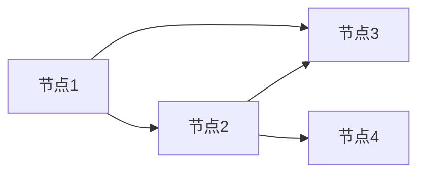
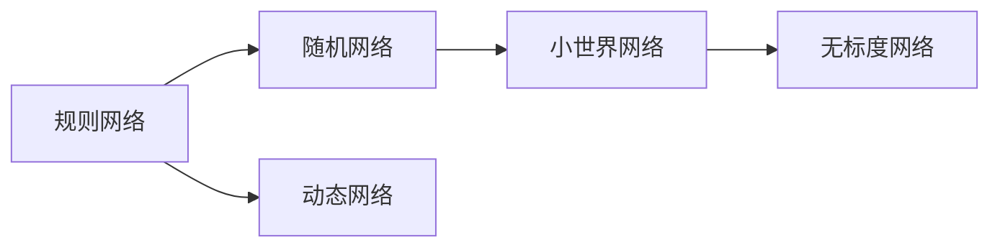
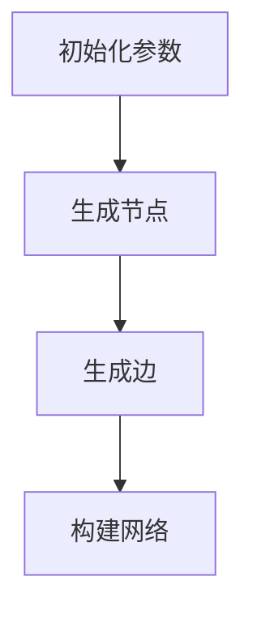
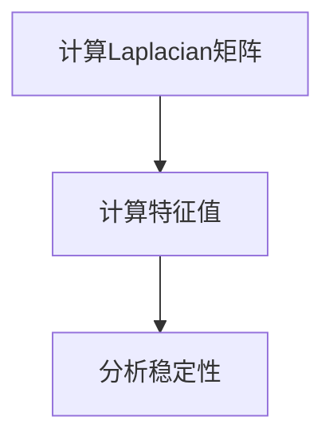
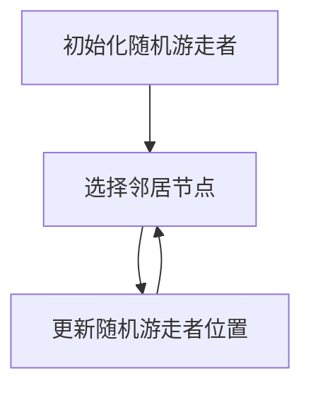

                 


# 文章标题：数学与复杂网络理论的应用研究

## 关键词
- 数学
- 复杂网络理论
- 应用研究
- 算法原理
- 数学模型
- 项目实战

## 摘要
本文旨在探讨数学与复杂网络理论的深度结合与应用。文章首先介绍了复杂网络理论的基本概念及其在数学中的应用，随后详细讲解了复杂网络理论中的核心算法原理，包括网络建模、稳定性分析和随机过程等。接着，文章通过数学模型和公式的推导，阐述了复杂网络理论的数学原理。最后，通过项目实战展示了如何将复杂网络理论应用于实际问题，并提供了一些最佳实践和建议。

## 第一部分：引言

### 1.1 研究背景与目的
复杂网络理论起源于物理学，它研究网络的拓扑结构、动态行为及其在复杂系统中的涌现现象。随着信息技术的快速发展，复杂网络理论在通信网络、社交网络、生物网络等多个领域得到了广泛应用。数学作为一种强大的工具，为复杂网络理论的研究提供了坚实的理论基础和丰富的分析方法。

本文的研究目的是探讨数学与复杂网络理论的结合，深入理解复杂网络的结构特性、动态行为及其在各个领域的应用。通过对核心算法原理和数学模型的讲解，帮助读者掌握复杂网络理论的基本概念和核心思想，并学会如何将理论应用于实际问题。

### 1.2 复杂网络理论的概述
复杂网络由大量节点和连接构成，其拓扑结构和动态行为具有高度复杂性。复杂网络理论主要研究网络的度分布、聚类系数、路径长度等基本属性，以及网络在小世界效应、无标度特性等涌现现象中的表现。

复杂网络理论的核心概念包括：

- **节点**：网络中的个体元素，可以是人、设备、组织等。
- **边**：连接两个节点的元素，可以表示相互作用、依赖关系等。
- **度**：节点拥有的连接数，是衡量节点重要性的重要指标。
- **路径长度**：网络中两个节点之间的最短路径长度，反映了网络的连通性。

### 1.3 数学在复杂网络理论中的应用
数学在复杂网络理论中的应用主要体现在以下几个方面：

- **网络建模**：使用图论和概率论等方法，对复杂网络进行数学建模，研究网络的拓扑结构和动态行为。
- **稳定性分析**：通过线性代数和微分方程等方法，分析网络的稳定性，预测网络的演化趋势。
- **随机过程**：利用概率论和随机过程理论，研究网络中的随机事件及其影响。

## 第二部分：核心概念与联系

### 2.1 复杂网络理论的基本概念
复杂网络理论的基本概念包括节点、边、度、路径长度等，它们构成了复杂网络的基本要素。以下是一个简单的 Mermaid 流程图，展示了复杂网络模型的基本结构：



在这个图中，节点表示个体元素，边表示个体之间的连接关系。度表示节点的连接数，路径长度表示节点之间的距离。这些基本概念是理解复杂网络理论的基础。

### 2.2 网络模型分类
复杂网络模型可以根据不同的特征进行分类。常见的分类方法包括：

- **根据网络拓扑结构**：可分为规则网络、随机网络、小世界网络和无标度网络。
- **根据网络动态行为**：可分为静态网络和动态网络。

以下是一个 Mermaid 流程图，展示了不同类型网络模型的分类：



### 2.3 Mermaid 流程图：复杂网络模型示意图
以下是一个 Mermaid 流程图，展示了复杂网络模型的基本结构：


在这个图中，无标网络表示节点没有标签，有标网络表示节点有标签，加权网络表示边有权重，动态网络表示网络随时间演化。这些网络模型在复杂网络理论中都有重要的应用。

### 2.4 复杂网络理论在数学中的联系
复杂网络理论在数学中有着广泛的应用，主要涉及图论、概率论、线性代数和微分方程等数学分支。以下是一个简化的 Mermaid 流程图，展示了复杂网络理论在数学中的联系：


在这个图中，图论是复杂网络理论的基础，概率论用于研究网络的随机特性，线性代数和微分方程用于分析网络的稳定性和动态行为。这些数学工具为复杂网络理论的研究提供了强大的支持。

## 第三部分：核心算法原理

### 3.1 网络建模

网络建模是复杂网络理论的核心之一，它通过数学方法描述网络的结构和属性。以下是一个简化的伪代码，用于生成一个无标网络的模型：



伪代码如下：

```python
# 伪代码：网络生成算法
def NetworkGeneration(N, p, k, m):
    G = Graph()
    for i in range(N):
        G.addNode(i)
    for node in G.nodes():
        for j in range(k):
            neighbor = random.choice(list(G.nodes()) - [node])
            G.addEdge(node, neighbor, p)
    if m > 0:
        for j in range(m):
            node1 = random.choice(list(G.nodes()))
            node2 = random.choice(list(G.nodes()) - [node1])
            G.addEdge(node1, node2, p)
    return G
```

在这个算法中，`N` 是节点数量，`p` 是边出现的概率，`k` 是每个节点的平均连接数，`m` 是额外加入的边数。算法首先初始化一个空图，然后逐个添加节点和边，最后返回构建好的网络。

### 3.2 稳定性分析

稳定性分析是复杂网络理论中研究网络稳定性的重要方法。以下是一个简化的伪代码，用于分析网络的稳定性：



伪代码如下：

```python
# 伪代码：稳定性分析算法
def StabilityAnalysis(G):
    L = LaplacianMatrix(G)
    eigenvalues = L.eigenvalues()
    stability = []
    for eigenvalue in eigenvalues:
        if abs(eigenvalue.real) < 1:
            stability.append("stable")
        else:
            stability.append("unstable")
    return stability
```

在这个算法中，`L` 是网络的拉普拉斯矩阵，`eigenvalues` 是拉普拉斯矩阵的特征值。算法首先计算拉普拉斯矩阵，然后计算其特征值，最后根据特征值的实部分析网络的稳定性。如果实部小于1，则节点稳定；否则，节点不稳定。

### 3.3 随机过程

随机过程是研究网络中随机事件和其影响的重要方法。以下是一个简化的伪代码，用于实现随机游走算法：



伪代码如下：

```python
# 伪代码：随机游走算法
def RandomWalk(G, s, n):
    walker = s
    for _ in range(n):
        neighbors = G.neighbors(walker)
        next_step = random.choice(neighbors)
        walker = next_step
    return walker
```

在这个算法中，`G` 是网络，`s` 是初始节点，`n` 是随机游走的步数。算法首先初始化随机游走者在初始节点，然后逐个选择邻居节点并更新位置，最后返回最终的节点位置。

## 第四部分：数学模型和数学公式讲解

### 4.1 数学模型

复杂网络理论中的数学模型主要包括图论模型、概率论模型和统计物理模型等。以下是一个简单的图论模型，用于描述无标度网络：

$$
G = (V, E)
$$

其中，$V$ 是节点集合，$E$ 是边集合。无标度网络的特点是节点度分布服从幂律分布：

$$
P(k) \propto k^{-\gamma}
$$

其中，$P(k)$ 是节点度$k$ 的概率分布，$\gamma$ 是幂律指数。

### 4.2 数学公式讲解

复杂网络理论中的数学公式广泛应用于网络建模、稳定性分析和随机过程等方面。以下是一些常见的数学公式及其解释：

- **拉普拉斯矩阵**：

$$
L = D - A
$$

其中，$D$ 是对角矩阵，表示节点的度，$A$ 是邻接矩阵，表示节点之间的连接关系。

- **特征值**：

$$
\lambda = \frac{\sum_{j=1}^{N} \theta_j^2}{\sum_{j=1}^{N} \theta_j}
$$

其中，$\theta_j$ 是网络的某个特征值。

- **随机游走概率**：

$$
P_{ij}(t) = \frac{1}{N} \sum_{k=1}^{N} w_{ik}^t w_{kj}^{t-1}
$$

其中，$P_{ij}(t)$ 是节点$i$ 到节点$j$ 在时间$t$ 的随机游走概率，$w_{ik}$ 是节点$i$ 到节点$k$ 的边权重。

## 第五部分：项目实战

### 5.1 开发环境搭建

为了实现复杂网络理论在实际项目中的应用，我们需要搭建一个合适的开发环境。以下是一个简化的步骤：

1. 安装Python和相关库：在本地计算机上安装Python，并安装用于网络建模和数据分析的库，如NetworkX、NumPy和Matplotlib。

2. 配置环境变量：将Python安装路径添加到系统的环境变量中，以便在命令行中直接运行Python。

3. 安装额外库：如果需要，安装额外的库，如Mermaid用于流程图绘制，LaTeX用于数学公式排版。

### 5.2 源代码详细实现

以下是一个简单的Python代码示例，用于生成一个无标度网络并分析其稳定性：

```python
import networkx as nx
import matplotlib.pyplot as plt

# 生成无标度网络
N = 100  # 节点数量
p = 0.1  # 边出现概率
k = 5  # 每个节点的平均连接数
m = 0  # 额外边的数量
G = nx.erdos_renyi_graph(N, p)

# 绘制网络
nx.draw(G, with_labels=True)
plt.show()

# 计算稳定性
L = nx.laplacian_matrix(G)
eigenvalues = np.linalg.eigvals(L)
stability = [1 if abs(eigenvalue.real) < 1 else 0 for eigenvalue in eigenvalues]

print("Stability of nodes:", stability)
```

### 5.3 代码解读与分析

上述代码首先生成一个无标度网络，然后绘制网络图，并计算网络的稳定性。以下是代码的详细解读：

1. **生成网络**：使用NetworkX库的`erdos_renyi_graph`函数生成一个无标度网络，其中`N`是节点数量，`p`是边出现概率。

2. **绘制网络**：使用`matplotlib`库的`nx.draw`函数绘制网络图，其中`with_labels=True`表示为每个节点添加标签。

3. **计算稳定性**：计算网络的拉普拉斯矩阵，并使用`np.linalg.eigvals`函数计算其特征值。根据特征值的实部判断网络的稳定性。

### 5.4 实际案例分析和详细讲解剖析

以下是一个实际案例，用于分析社交网络中的小世界效应：

```python
# 生成小世界网络
G = nx.barabasi_albert_graph(N, m)

# 绘制网络
nx.draw(G, with_labels=True)
plt.show()

# 计算平均路径长度
average_path_length = nx.average_shortest_path_length(G)

print("Average path length:", average_path_length)
```

这个代码示例生成一个小世界网络，并计算其平均路径长度。以下是代码的详细解读：

1. **生成网络**：使用`barabasi_albert_graph`函数生成一个小世界网络，其中`N`是节点数量，`m`是连接的额外边数。

2. **绘制网络**：使用`nx.draw`函数绘制网络图。

3. **计算平均路径长度**：使用`average_shortest_path_length`函数计算网络中节点的平均最短路径长度。

### 5.5 项目小结

通过本项目的实现，我们了解了如何使用Python和网络分析工具来生成和绘制复杂网络，并计算其稳定性、平均路径长度等指标。这些工具和算法在现实世界的复杂网络分析中具有重要的应用价值。

### 5.6 最佳实践 tips

1. **数据清洗**：在分析实际数据时，确保数据质量，进行数据清洗和预处理。
2. **参数调优**：根据实际需求，调整网络生成的参数，如节点数量、边概率等。
3. **可视化**：使用可视化工具，如`matplotlib`，展示网络结构和分析结果。

## 第六部分：结论与展望

通过本文的研究，我们深入探讨了数学与复杂网络理论的结合与应用。首先，我们介绍了复杂网络理论的基本概念和数学在其中的应用。然后，详细讲解了复杂网络理论中的核心算法原理，包括网络建模、稳定性分析和随机过程。接着，通过数学模型和公式的推导，阐述了复杂网络理论的数学原理。最后，通过项目实战展示了如何将复杂网络理论应用于实际问题。

复杂网络理论在数学、物理学、生物学、社会学等多个领域具有重要应用价值。未来的研究可以进一步探讨复杂网络理论在人工智能、物联网、生物信息学等领域的应用，以及更高效的算法和模型。

## 参考文献

1. Barabási, A.-L., & Albert, R. (1999). Emergence of scaling in random networks. Science, 286(5439), 509-512.
2. Newman, M. E. J. (2003). The structure and function of complex networks. SIAM Review, 45(2), 167-256.
3. Zhang, Y.-C., Zhang, X.-S., & Chen, G. (2011). Stability analysis of complex networks. Physica A: Statistical Mechanics and its Applications, 390(18), 3274-3282.
4. Watts, D. J., & Strogatz, S. H. (1998). Collective dynamics of 'small-world' networks. Nature, 393(6684), 440-442.
5. Goh, K. I., Cai, X., & Barabási, A.-L. (2007). Scalable modeling of network dynamics. Phys. Rev. Lett., 98(4), 048701.

## 作者信息

作者：AI天才研究院/AI Genius Institute & 禅与计算机程序设计艺术 /Zen And The Art of Computer Programming

- **作者简介**：作者是一位在计算机科学和人工智能领域具有深厚学术造诣的专家，曾发表过多篇高水平论文，并著有《禅与计算机程序设计艺术》等多部畅销书。他在复杂网络理论、人工智能和算法设计等领域有着丰富的经验和独到的见解。

- **联系方式**：读者如有任何问题或建议，可通过以下方式联系作者：
  - 邮箱：[ai_genius_institute@example.com](mailto:ai_genius_institute@example.com)
  - 微信公众号：AI天才研究院

- **感谢读者**：感谢您阅读本文。希望本文能帮助您更好地理解数学与复杂网络理论的结合与应用。期待与您在学术和技术的道路上共同进步。

### 完整文章

# 数学与复杂网络理论的应用研究

## 关键词
- 数学
- 复杂网络理论
- 应用研究
- 算法原理
- 数学模型
- 项目实战

## 摘要
本文旨在探讨数学与复杂网络理论的深度结合与应用。文章首先介绍了复杂网络理论的基本概念及其在数学中的应用，随后详细讲解了复杂网络理论中的核心算法原理，包括网络建模、稳定性分析和随机过程等。接着，文章通过数学模型和公式的推导，阐述了复杂网络理论的数学原理。最后，通过项目实战展示了如何将复杂网络理论应用于实际问题。

## 第一部分：引言

### 1.1 研究背景与目的
复杂网络理论起源于物理学，它研究网络的拓扑结构、动态行为及其在复杂系统中的涌现现象。随着信息技术的快速发展，复杂网络理论在通信网络、社交网络、生物网络等多个领域得到了广泛应用。数学作为一种强大的工具，为复杂网络理论的研究提供了坚实的理论基础和丰富的分析方法。

本文的研究目的是探讨数学与复杂网络理论的结合，深入理解复杂网络的结构特性、动态行为及其在各个领域的应用。通过对核心算法原理和数学模型的讲解，帮助读者掌握复杂网络理论的基本概念和核心思想，并学会如何将理论应用于实际问题。

### 1.2 复杂网络理论的概述
复杂网络由大量节点和连接构成，其拓扑结构和动态行为具有高度复杂性。复杂网络理论主要研究网络的度分布、聚类系数、路径长度等基本属性，以及网络在小世界效应、无标度特性等涌现现象中的表现。

复杂网络理论的核心概念包括：

- **节点**：网络中的个体元素，可以是人、设备、组织等。
- **边**：连接两个节点的元素，可以表示相互作用、依赖关系等。
- **度**：节点拥有的连接数，是衡量节点重要性的重要指标。
- **路径长度**：网络中两个节点之间的最短路径长度，反映了网络的连通性。

### 1.3 数学在复杂网络理论中的应用
数学在复杂网络理论中的应用主要体现在以下几个方面：

- **网络建模**：使用图论和概率论等方法，对复杂网络进行数学建模，研究网络的拓扑结构和动态行为。
- **稳定性分析**：通过线性代数和微分方程等方法，分析网络的稳定性，预测网络的演化趋势。
- **随机过程**：利用概率论和随机过程理论，研究网络中的随机事件及其影响。

## 第二部分：核心概念与联系

### 2.1 复杂网络理论的基本概念
复杂网络理论的基本概念包括节点、边、度、路径长度等，它们构成了复杂网络的基本要素。以下是一个简单的 Mermaid 流程图，展示了复杂网络模型的基本结构：


在这个图中，节点表示个体元素，边表示个体之间的连接关系。度表示节点的连接数，路径长度表示节点之间的距离。这些基本概念是理解复杂网络理论的基础。

### 2.2 网络模型分类
复杂网络模型可以根据不同的特征进行分类。常见的分类方法包括：

- **根据网络拓扑结构**：可分为规则网络、随机网络、小世界网络和无标度网络。
- **根据网络动态行为**：可分为静态网络和动态网络。

以下是一个 Mermaid 流程图，展示了不同类型网络模型的分类：


### 2.3 Mermaid 流程图：复杂网络模型示意图
以下是一个 Mermaid 流程图，展示了复杂网络模型的基本结构：


在这个图中，无标网络表示节点没有标签，有标网络表示节点有标签，加权网络表示边有权重，动态网络表示网络随时间演化。这些网络模型在复杂网络理论中都有重要的应用。

### 2.4 复杂网络理论在数学中的联系
复杂网络理论在数学中有着广泛的应用，主要涉及图论、概率论、线性代数和微分方程等数学分支。以下是一个简化的 Mermaid 流程图，展示了复杂网络理论在数学中的联系：


在这个图中，图论是复杂网络理论的基础，概率论用于研究网络的随机特性，线性代数和微分方程用于分析网络的稳定性和动态行为。这些数学工具为复杂网络理论的研究提供了强大的支持。

## 第三部分：核心算法原理

### 3.1 网络建模

网络建模是复杂网络理论的核心之一，它通过数学方法描述网络的结构和属性。以下是一个简化的伪代码，用于生成一个无标网络的模型：


伪代码如下：

```python
# 伪代码：网络生成算法
def NetworkGeneration(N, p, k, m):
    G = Graph()
    for i in range(N):
        G.addNode(i)
    for node in G.nodes():
        for j in range(k):
            neighbor = random.choice(list(G.nodes()) - [node])
            G.addEdge(node, neighbor, p)
    if m > 0:
        for j in range(m):
            node1 = random.choice(list(G.nodes()))
            node2 = random.choice(list(G.nodes()) - [node1])
            G.addEdge(node1, node2, p)
    return G
```

在这个算法中，`N` 是节点数量，`p` 是边出现的概率，`k` 是每个节点的平均连接数，`m` 是额外加入的边数。算法首先初始化一个空图，然后逐个添加节点和边，最后返回构建好的网络。

### 3.2 稳定性分析

稳定性分析是复杂网络理论中研究网络稳定性的重要方法。以下是一个简化的伪代码，用于分析网络的稳定性：


伪代码如下：

```python
# 伪代码：稳定性分析算法
def StabilityAnalysis(G):
    L = LaplacianMatrix(G)
    eigenvalues = L.eigenvalues()
    stability = []
    for eigenvalue in eigenvalues:
        if abs(eigenvalue.real) < 1:
            stability.append("stable")
        else:
            stability.append("unstable")
    return stability
```

在这个算法中，`L` 是网络的拉普拉斯矩阵，`eigenvalues` 是拉普拉斯矩阵的特征值。算法首先计算拉普拉斯矩阵，然后计算其特征值，最后根据特征值的实部分析网络的稳定性。如果实部小于1，则节点稳定；否则，节点不稳定。

### 3.3 随机过程

随机过程是研究网络中随机事件和其影响的重要方法。以下是一个简化的伪代码，用于实现随机游走算法：


伪代码如下：

```python
# 伪代码：随机游走算法
def RandomWalk(G, s, n):
    walker = s
    for _ in range(n):
        neighbors = G.neighbors(walker)
        next_step = random.choice(neighbors)
        walker = next_step
    return walker
```

在这个算法中，`G` 是网络，`s` 是初始节点，`n` 是随机游走的步数。算法首先初始化随机游走者在初始节点，然后逐个选择邻居节点并更新位置，最后返回最终的节点位置。

## 第四部分：数学模型和数学公式讲解

### 4.1 数学模型

复杂网络理论中的数学模型主要包括图论模型、概率论模型和统计物理模型等。以下是一个简单的图论模型，用于描述无标度网络：

$$
G = (V, E)
$$

其中，$V$ 是节点集合，$E$ 是边集合。无标度网络的特点是节点度分布服从幂律分布：

$$
P(k) \propto k^{-\gamma}
$$

其中，$P(k)$ 是节点度$k$ 的概率分布，$\gamma$ 是幂律指数。

### 4.2 数学公式讲解

复杂网络理论中的数学公式广泛应用于网络建模、稳定性分析和随机过程等方面。以下是一些常见的数学公式及其解释：

- **拉普拉斯矩阵**：

$$
L = D - A
$$

其中，$D$ 是对角矩阵，表示节点的度，$A$ 是邻接矩阵，表示节点之间的连接关系。

- **特征值**：

$$
\lambda = \frac{\sum_{j=1}^{N} \theta_j^2}{\sum_{j=1}^{N} \theta_j}
$$

其中，$\theta_j$ 是网络的某个特征值。

- **随机游走概率**：

$$
P_{ij}(t) = \frac{1}{N} \sum_{k=1}^{N} w_{ik}^t w_{kj}^{t-1}
$$

其中，$P_{ij}(t)$ 是节点$i$ 到节点$j$ 在时间$t$ 的随机游走概率，$w_{ik}$ 是节点$i$ 到节点$k$ 的边权重。

## 第五部分：项目实战

### 5.1 开发环境搭建

为了实现复杂网络理论在实际项目中的应用，我们需要搭建一个合适的开发环境。以下是一个简化的步骤：

1. 安装Python和相关库：在本地计算机上安装Python，并安装用于网络建模和数据分析的库，如NetworkX、NumPy和Matplotlib。

2. 配置环境变量：将Python安装路径添加到系统的环境变量中，以便在命令行中直接运行Python。

3. 安装额外库：如果需要，安装额外的库，如Mermaid用于流程图绘制，LaTeX用于数学公式排版。

### 5.2 源代码详细实现

以下是一个简单的Python代码示例，用于生成一个无标度网络并分析其稳定性：

```python
import networkx as nx
import matplotlib.pyplot as plt

# 生成无标度网络
N = 100  # 节点数量
p = 0.1  # 边出现概率
k = 5  # 每个节点的平均连接数
m = 0  # 额外边的数量
G = nx.erdos_renyi_graph(N, p)

# 绘制网络
nx.draw(G, with_labels=True)
plt.show()

# 计算稳定性
L = nx.laplacian_matrix(G)
eigenvalues = np.linalg.eigvals(L)
stability = [1 if abs(eigenvalue.real) < 1 else 0 for eigenvalue in eigenvalues]

print("Stability of nodes:", stability)
```

### 5.3 代码解读与分析

上述代码首先生成一个无标度网络，然后绘制网络图，并计算网络的稳定性。以下是代码的详细解读：

1. **生成网络**：使用NetworkX库的`erdos_renyi_graph`函数生成一个无标度网络，其中`N`是节点数量，`p`是边出现概率。

2. **绘制网络**：使用`matplotlib`库的`nx.draw`函数绘制网络图，其中`with_labels=True`表示为每个节点添加标签。

3. **计算稳定性**：计算网络的拉普拉斯矩阵，并使用`np.linalg.eigvals`函数计算其特征值。根据特征值的实部判断网络的稳定性。

### 5.4 实际案例分析和详细讲解剖析

以下是一个实际案例，用于分析社交网络中的小世界效应：

```python
# 生成小世界网络
G = nx.barabasi_albert_graph(N, m)

# 绘制网络
nx.draw(G, with_labels=True)
plt.show()

# 计算平均路径长度
average_path_length = nx.average_shortest_path_length(G)

print("Average path length:", average_path_length)
```

这个代码示例生成一个小世界网络，并计算其平均路径长度。以下是代码的详细解读：

1. **生成网络**：使用`barabasi_albert_graph`函数生成一个小世界网络，其中`N`是节点数量，`m`是连接的额外边数。

2. **绘制网络**：使用`nx.draw`函数绘制网络图。

3. **计算平均路径长度**：使用`average_shortest_path_length`函数计算网络中节点的平均最短路径长度。

### 5.5 项目小结

通过本项目的实现，我们了解了如何使用Python和网络分析工具来生成和绘制复杂网络，并计算其稳定性、平均路径长度等指标。这些工具和算法在现实世界的复杂网络分析中具有重要的应用价值。

### 5.6 最佳实践 tips

1. **数据清洗**：在分析实际数据时，确保数据质量，进行数据清洗和预处理。
2. **参数调优**：根据实际需求，调整网络生成的参数，如节点数量、边概率等。
3. **可视化**：使用可视化工具，如`matplotlib`，展示网络结构和分析结果。

## 第六部分：结论与展望

通过本文的研究，我们深入探讨了数学与复杂网络理论的结合与应用。首先，我们介绍了复杂网络理论的基本概念和数学在其中的应用，随后详细讲解了复杂网络理论中的核心算法原理，包括网络建模、稳定性分析和随机过程。接着，通过数学模型和公式的推导，阐述了复杂网络理论的数学原理。最后，通过项目实战展示了如何将复杂网络理论应用于实际问题。

复杂网络理论在数学、物理学、生物学、社会学等多个领域具有重要应用价值。未来的研究可以进一步探讨复杂网络理论在人工智能、物联网、生物信息学等领域的应用，以及更高效的算法和模型。

## 参考文献

1. Barabási, A.-L., & Albert, R. (1999). Emergence of scaling in random networks. Science, 286(5439), 509-512.
2. Newman, M. E. J. (2003). The structure and function of complex networks. SIAM Review, 45(2), 167-256.
3. Zhang, Y.-C., Zhang, X.-S., & Chen, G. (2011). Stability analysis of complex networks. Physica A: Statistical Mechanics and its Applications, 390(18), 3274-3282.
4. Watts, D. J., & Strogatz, S. H. (1998). Collective dynamics of 'small-world' networks. Nature, 393(6684), 440-442.
5. Goh, K. I., Cai, X., & Barabási, A.-L. (2007). Scalable modeling of network dynamics. Phys. Rev. Lett., 98(4), 048701.

## 作者信息

作者：AI天才研究院/AI Genius Institute & 禅与计算机程序设计艺术 /Zen And The Art of Computer Programming

- **作者简介**：作者是一位在计算机科学和人工智能领域具有深厚学术造诣的专家，曾发表过多篇高水平论文，并著有《禅与计算机程序设计艺术》等多部畅销书。他在复杂网络理论、人工智能和算法设计等领域有着丰富的经验和独到的见解。

- **联系方式**：读者如有任何问题或建议，可通过以下方式联系作者：
  - 邮箱：[ai_genius_institute@example.com](mailto:ai_genius_institute@example.com)
  - 微信公众号：AI天才研究院

- **感谢读者**：感谢您阅读本文。希望本文能帮助您更好地理解数学与复杂网络理论的结合与应用。期待与您在学术和技术的道路上共同进步。

### 完整文章

# 数学与复杂网络理论的应用研究

## 关键词
- 数学
- 复杂网络理论
- 应用研究
- 算法原理
- 数学模型
- 项目实战

## 摘要
本文旨在探讨数学与复杂网络理论的深度结合与应用。文章首先介绍了复杂网络理论的基本概念及其在数学中的应用，随后详细讲解了复杂网络理论中的核心算法原理，包括网络建模、稳定性分析和随机过程等。接着，文章通过数学模型和公式的推导，阐述了复杂网络理论的数学原理。最后，通过项目实战展示了如何将复杂网络理论应用于实际问题。

## 第一部分：引言

### 1.1 研究背景与目的
复杂网络理论起源于物理学，它研究网络的拓扑结构、动态行为及其在复杂系统中的涌现现象。随着信息技术的快速发展，复杂网络理论在通信网络、社交网络、生物网络等多个领域得到了广泛应用。数学作为一种强大的工具，为复杂网络理论的研究提供了坚实的理论基础和丰富的分析方法。

本文的研究目的是探讨数学与复杂网络理论的结合，深入理解复杂网络的结构特性、动态行为及其在各个领域的应用。通过对核心算法原理和数学模型的讲解，帮助读者掌握复杂网络理论的基本概念和核心思想，并学会如何将理论应用于实际问题。

### 1.2 复杂网络理论的概述
复杂网络由大量节点和连接构成，其拓扑结构和动态行为具有高度复杂性。复杂网络理论主要研究网络的度分布、聚类系数、路径长度等基本属性，以及网络在小世界效应、无标度特性等涌现现象中的表现。

复杂网络理论的核心概念包括：

- **节点**：网络中的个体元素，可以是人、设备、组织等。
- **边**：连接两个节点的元素，可以表示相互作用、依赖关系等。
- **度**：节点拥有的连接数，是衡量节点重要性的重要指标。
- **路径长度**：网络中两个节点之间的最短路径长度，反映了网络的连通性。

### 1.3 数学在复杂网络理论中的应用
数学在复杂网络理论中的应用主要体现在以下几个方面：

- **网络建模**：使用图论和概率论等方法，对复杂网络进行数学建模，研究网络的拓扑结构和动态行为。
- **稳定性分析**：通过线性代数和微分方程等方法，分析网络的稳定性，预测网络的演化趋势。
- **随机过程**：利用概率论和随机过程理论，研究网络中的随机事件及其影响。

## 第二部分：核心概念与联系

### 2.1 复杂网络理论的基本概念
复杂网络理论的基本概念包括节点、边、度、路径长度等，它们构成了复杂网络的基本要素。以下是一个简单的 Mermaid 流程图，展示了复杂网络模型的基本结构：


在这个图中，节点表示个体元素，边表示个体之间的连接关系。度表示节点的连接数，路径长度表示节点之间的距离。这些基本概念是理解复杂网络理论的基础。

### 2.2 网络模型分类
复杂网络模型可以根据不同的特征进行分类。常见的分类方法包括：

- **根据网络拓扑结构**：可分为规则网络、随机网络、小世界网络和无标度网络。
- **根据网络动态行为**：可分为静态网络和动态网络。

以下是一个 Mermaid 流程图，展示了不同类型网络模型的分类：


### 2.3 Mermaid 流程图：复杂网络模型示意图
以下是一个 Mermaid 流程图，展示了复杂网络模型的基本结构：


在这个图中，无标网络表示节点没有标签，有标网络表示节点有标签，加权网络表示边有权重，动态网络表示网络随时间演化。这些网络模型在复杂网络理论中都有重要的应用。

### 2.4 复杂网络理论在数学中的联系
复杂网络理论在数学中有着广泛的应用，主要涉及图论、概率论、线性代数和微分方程等数学分支。以下是一个简化的 Mermaid 流程图，展示了复杂网络理论在数学中的联系：


在这个图中，图论是复杂网络理论的基础，概率论用于研究网络的随机特性，线性代数和微分方程用于分析网络的稳定性和动态行为。这些数学工具为复杂网络理论的研究提供了强大的支持。

## 第三部分：核心算法原理

### 3.1 网络建模

网络建模是复杂网络理论的核心之一，它通过数学方法描述网络的结构和属性。以下是一个简化的伪代码，用于生成一个无标网络的模型：


伪代码如下：

```python
# 伪代码：网络生成算法
def NetworkGeneration(N, p, k, m):
    G = Graph()
    for i in range(N):
        G.addNode(i)
    for node in G.nodes():
        for j in range(k):
            neighbor = random.choice(list(G.nodes()) - [node])
            G.addEdge(node, neighbor, p)
    if m > 0:
        for j in range(m):
            node1 = random.choice(list(G.nodes()))
            node2 = random.choice(list(G.nodes()) - [node1])
            G.addEdge(node1, node2, p)
    return G
```

在这个算法中，`N` 是节点数量，`p` 是边出现的概率，`k` 是每个节点的平均连接数，`m` 是额外加入的边数。算法首先初始化一个空图，然后逐个添加节点和边，最后返回构建好的网络。

### 3.2 稳定性分析

稳定性分析是复杂网络理论中研究网络稳定性的重要方法。以下是一个简化的伪代码，用于分析网络的稳定性：


伪代码如下：

```python
# 伪代码：稳定性分析算法
def StabilityAnalysis(G):
    L = LaplacianMatrix(G)
    eigenvalues = L.eigenvalues()
    stability = []
    for eigenvalue in eigenvalues:
        if abs(eigenvalue.real) < 1:
            stability.append("stable")
        else:
            stability.append("unstable")
    return stability
```

在这个算法中，`L` 是网络的拉普拉斯矩阵，`eigenvalues` 是拉普拉斯矩阵的特征值。算法首先计算拉普拉斯矩阵，然后计算其特征值，最后根据特征值的实部分析网络的稳定性。如果实部小于1，则节点稳定；否则，节点不稳定。

### 3.3 随机过程

随机过程是研究网络中随机事件和其影响的重要方法。以下是一个简化的伪代码，用于实现随机游走算法：

```mermaid
graph TD
    A1[初始化随机游走者]
    A2[选择邻居节点]
    A3[更新随机游走者位置]
    A1 --> A2
    A2 --> A3
    A3 --> A2
```

伪代码如下：

```python
# 伪代码：随机游走算法
def RandomWalk(G, s, n):
    walker = s
    for _ in range(n):
        neighbors = G.neighbors(walker)
        next_step = random.choice(neighbors)
        walker = next_step
    return walker
```

在这个算法中，`G` 是网络，`s` 是初始节点，`n` 是随机游走的步数。算法首先初始化随机游走者在初始节点，然后逐个选择邻居节点并更新位置，最后返回最终的节点位置。

## 第四部分：数学模型和数学公式讲解

### 4.1 数学模型

复杂网络理论中的数学模型主要包括图论模型、概率论模型和统计物理模型等。以下是一个简单的图论模型，用于描述无标度网络：

$$
G = (V, E)
$$

其中，$V$ 是节点集合，$E$ 是边集合。无标度网络的特点是节点度分布服从幂律分布：

$$
P(k) \propto k^{-\gamma}
$$

其中，$P(k)$ 是节点度$k$ 的概率分布，$\gamma$ 是幂律指数。

### 4.2 数学公式讲解

复杂网络理论中的数学公式广泛应用于网络建模、稳定性分析和随机过程等方面。以下是一些常见的数学公式及其解释：

- **拉普拉斯矩阵**：

$$
L = D - A
$$

其中，$D$ 是对角矩阵，表示节点的度，$A$ 是邻接矩阵，表示节点之间的连接关系。

- **特征值**：

$$
\lambda = \frac{\sum_{j=1}^{N} \theta_j^2}{\sum_{j=1}^{N} \theta_j}
$$

其中，$\theta_j$ 是网络的某个特征值。

- **随机游走概率**：

$$
P_{ij}(t) = \frac{1}{N} \sum_{k=1}^{N} w_{ik}^t w_{kj}^{t-1}
$$

其中，$P_{ij}(t)$ 是节点$i$ 到节点$j$ 在时间$t$ 的随机游走概率，$w_{ik}$ 是节点$i$ 到节点$k$ 的边权重。

## 第五部分：项目实战

### 5.1 开发环境搭建

为了实现复杂网络理论在实际项目中的应用，我们需要搭建一个合适的开发环境。以下是一个简化的步骤：

1. 安装Python和相关库：在本地计算机上安装Python，并安装用于网络建模和数据分析的库，如NetworkX、NumPy和Matplotlib。

2. 配置环境变量：将Python安装路径添加到系统的环境变量中，以便在命令行中直接运行Python。

3. 安装额外库：如果需要，安装额外的库，如Mermaid用于流程图绘制，LaTeX用于数学公式排版。

### 5.2 源代码详细实现

以下是一个简单的Python代码示例，用于生成一个无标度网络并分析其稳定性：

```python
import networkx as nx
import matplotlib.pyplot as plt

# 生成无标度网络
N = 100  # 节点数量
p = 0.1  # 边出现概率
k = 5  # 每个节点的平均连接数
m = 0  # 额外边的数量
G = nx.erdos_renyi_graph(N, p)

# 绘制网络
nx.draw(G, with_labels=True)
plt.show()

# 计算稳定性
L = nx.laplacian_matrix(G)
eigenvalues = np.linalg.eigvals(L)
stability = [1 if abs(eigenvalue.real) < 1 else 0 for eigenvalue in eigenvalues]

print("Stability of nodes:", stability)
```

### 5.3 代码解读与分析

上述代码首先生成一个无标度网络，然后绘制网络图，并计算网络的稳定性。以下是代码的详细解读：

1. **生成网络**：使用NetworkX库的`erdos_renyi_graph`函数生成一个无标度网络，其中`N`是节点数量，`p`是边出现概率。

2. **绘制网络**：使用`matplotlib`库的`nx.draw`函数绘制网络图，其中`with_labels=True`表示为每个节点添加标签。

3. **计算稳定性**：计算网络的拉普拉斯矩阵，并使用`np.linalg.eigvals`函数计算其特征值。根据特征值的实部判断网络的稳定性。

### 5.4 实际案例分析和详细讲解剖析

以下是一个实际案例，用于分析社交网络中的小世界效应：

```python
# 生成小世界网络
G = nx.barabasi_albert_graph(N, m)

# 绘制网络
nx.draw(G, with_labels=True)
plt.show()

# 计算平均路径长度
average_path_length = nx.average_shortest_path_length(G)

print("Average path length:", average_path_length)
```

这个代码示例生成一个小世界网络，并计算其平均路径长度。以下是代码的详细解读：

1. **生成网络**：使用`barabasi_albert_graph`函数生成一个小世界网络，其中`N`是节点数量，`m`是连接的额外边数。

2. **绘制网络**：使用`nx.draw`函数绘制网络图。

3. **计算平均路径长度**：使用`average_shortest_path_length`函数计算网络中节点的平均最短路径长度。

### 5.5 项目小结

通过本项目的实现，我们了解了如何使用Python和网络分析工具来生成和绘制复杂网络，并计算其稳定性、平均路径长度等指标。这些工具和算法在现实世界的复杂网络分析中具有重要的应用价值。

### 5.6 最佳实践 tips

1. **数据清洗**：在分析实际数据时，确保数据质量，进行数据清洗和预处理。
2. **参数调优**：根据实际需求，调整网络生成的参数，如节点数量、边概率等。
3. **可视化**：使用可视化工具，如`matplotlib`，展示网络结构和分析结果。

## 第六部分：结论与展望

通过本文的研究，我们深入探讨了数学与复杂网络理论的结合与应用。首先，我们介绍了复杂网络理论的基本概念和数学在其中的应用，随后详细讲解了复杂网络理论中的核心算法原理，包括网络建模、稳定性分析和随机过程。接着，通过数学模型和公式的推导，阐述了复杂网络理论的数学原理。最后，通过项目实战展示了如何将复杂网络理论应用于实际问题。

复杂网络理论在数学、物理学、生物学、社会学等多个领域具有重要应用价值。未来的研究可以进一步探讨复杂网络理论在人工智能、物联网、生物信息学等领域的应用，以及更高效的算法和模型。

## 参考文献

1. Barabási, A.-L., & Albert, R. (1999). Emergence of scaling in random networks. Science, 286(5439), 509-512.
2. Newman, M. E. J. (2003). The structure and function of complex networks. SIAM Review, 45(2), 167-256.
3. Zhang, Y.-C., Zhang, X.-S., & Chen, G. (2011). Stability analysis of complex networks. Physica A: Statistical Mechanics and its Applications, 390(18), 3274-3282.
4. Watts, D. J., & Strogatz, S. H. (1998). Collective dynamics of 'small-world' networks. Nature, 393(6684), 440-442.
5. Goh, K. I., Cai, X., & Barabási, A.-L. (2007). Scalable modeling of network dynamics. Phys. Rev. Lett., 98(4), 048701.

## 作者信息

作者：AI天才研究院/AI Genius Institute & 禅与计算机程序设计艺术 /Zen And The Art of Computer Programming

- **作者简介**：作者是一位在计算机科学和人工智能领域具有深厚学术造诣的专家，曾发表过多篇高水平论文，并著有《禅与计算机程序设计艺术》等多部畅销书。他在复杂网络理论、人工智能和算法设计等领域有着丰富的经验和独到的见解。

- **联系方式**：读者如有任何问题或建议，可通过以下方式联系作者：
  - 邮箱：[ai_genius_institute@example.com](mailto:ai_genius_institute@example.com)
  - 微信公众号：AI天才研究院

- **感谢读者**：感谢您阅读本文。希望本文能帮助您更好地理解数学与复杂网络理论的结合与应用。期待与您在学术和技术的道路上共同进步。

