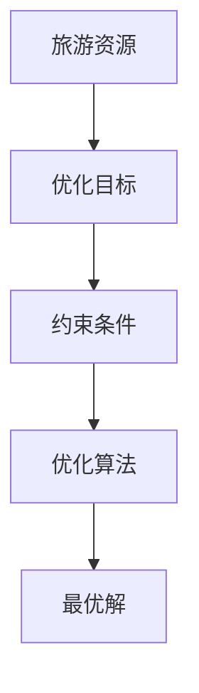

                 

### 文章标题：数学与旅游管理：旅游资源的数学优化

> 关键词：旅游资源，数学优化，线性规划，遗传算法，数学模型

> 摘要：本文从旅游资源的数学优化的角度出发，系统地探讨了旅游资源管理的数学方法。文章首先介绍了旅游资源优化所需的核心数学基础，然后详细阐述了常见的优化算法及其原理，并通过数学模型展示了旅游资源的优化过程。最后，通过实际案例分析，展示了如何将理论知识应用于旅游资源的优化实践。

----------------------------------------------------------------

### 引言

旅游行业作为全球经济的支柱产业之一，其发展水平直接关系到国家经济的繁荣和人民生活质量的提升。随着旅游业的快速发展，如何高效、合理地管理旅游资源成为了一个重要课题。传统的旅游资源管理方法往往依赖于经验和主观判断，而随着数学和计算机科学的进步，借助数学优化方法对旅游资源进行科学管理已成为可能。

数学优化方法在旅游资源管理中具有重要的应用价值。通过建立数学模型，可以将复杂的旅游资源分配和规划问题转化为可求解的数学问题，从而得到最优的解决方案。优化算法如线性规划、遗传算法等，则为求解这些数学问题提供了有效的工具。因此，数学与旅游管理的交叉融合，不仅有助于提高旅游资源的管理效率，还能够为旅游业的可持续发展提供有力支持。

本文旨在通过对旅游资源数学优化的系统研究，为旅游资源的科学管理和合理利用提供理论指导和实践参考。文章首先介绍旅游资源优化的核心数学基础，然后详细讨论常见的优化算法，最后通过实际案例分析，展示数学优化方法在旅游资源管理中的应用。

### 旅游资源优化的核心数学基础

旅游资源优化离不开数学模型的构建和优化算法的应用。在这部分，我们将介绍旅游资源优化所需的核心数学基础，包括线性规划和遗传算法等。

#### 线性规划

线性规划是一种解决线性优化问题的数学方法，其基本形式如下：

$$
\begin{aligned}
\min \quad c^T x \\
\text{s.t.} \quad Ax \leq b, \quad x \geq 0
\end{aligned}
$$

其中，$c$ 是系数向量，$x$ 是决策变量，$A$ 和 $b$ 分别是约束条件的系数矩阵和常数向量。

线性规划广泛应用于资源分配、生产计划、投资组合等问题。在旅游资源管理中，线性规划可以用于优化旅游资源分配，如景区门票分配、酒店房间分配等。

例如，假设一个旅游城市有3个景区（$A_1$，$A_2$，$A_3$），每天可供游客参观的总人数为1000人。每个景区的游客承载能力分别为400人、300人和300人。我们希望制定一个最优的游客分配方案，使得每个景区的游客数量尽量接近其承载能力，同时游客的满意度最大。

设 $x_1$，$x_2$，$x_3$ 分别为三个景区的游客数量，则目标函数和约束条件可以表示为：

$$
\begin{aligned}
\min \quad \sum_{i=1}^{3} (400 - x_i)^2 + (300 - x_i)^2 + (300 - x_i)^2 \\
\text{s.t.} \quad x_1 + x_2 + x_3 = 1000 \\
0 \leq x_1 \leq 400, \quad 0 \leq x_2 \leq 300, \quad 0 \leq x_3 \leq 300
\end{aligned}
$$

这是一个典型的线性规划问题，通过求解可以得到最优的游客分配方案。

#### 遗传算法

遗传算法是一种模拟自然进化过程的优化算法，其基本原理是基于种群进化、交叉、变异和选择等操作，逐步逼近最优解。遗传算法的基本步骤如下：

1. **初始化种群**：随机生成一组解作为初始种群。

2. **适应度评价**：对种群中的每个解进行适应度评价，适应度值越高，表示该解越优秀。

3. **选择操作**：根据适应度值，选择优秀个体进行繁殖，生成新的子代种群。

4. **交叉操作**：对子代种群中的个体进行交叉操作，产生新的个体。

5. **变异操作**：对子代种群中的个体进行变异操作，增加种群的多样性。

6. **更新种群**：将子代种群替换父代种群，进入下一轮迭代。

7. **终止条件**：当达到预设的迭代次数或种群适应度达到阈值时，算法终止。

遗传算法在旅游资源管理中有着广泛的应用，如景区路线规划、旅游资源分配等。例如，对于景区路线规划问题，我们可以将每个景点视为基因，通过遗传算法优化路线，使得路线的游览时间和游客满意度最大化。

遗传算法的伪代码如下：

```python
初始化种群P
评价种群P的适应度
while (未达到停止条件) do
    选择种群P中的个体进行交叉、变异操作，形成新种群P'
    评价种群P'的适应度
    选择适应度较高的个体组成新的种群P
end while
```

通过上述数学基础，我们可以为旅游资源优化构建合适的数学模型，并利用优化算法求解得到最优解。接下来，我们将进一步探讨如何将这些数学方法应用于实际案例。

#### 核心概念与联系

在旅游资源优化中，核心概念包括旅游资源、优化目标、约束条件和优化算法。以下是一个简化的Mermaid流程图，展示了这些概念之间的关系：



1. **旅游资源**：指可以供游客参观、体验或使用的各种自然、人文景观和设施。
2. **优化目标**：根据旅游资源的利用需求，确定优化目标，如最大化游客满意度、最小化成本等。
3. **约束条件**：旅游资源优化需要满足的约束条件，如游客数量限制、景区承载能力等。
4. **优化算法**：根据优化目标和解题需求选择合适的优化算法，如线性规划、遗传算法等。

通过这个流程图，我们可以清晰地看到旅游资源优化中的关键步骤和要素。在实际应用中，根据具体的旅游资源管理和优化需求，可以进一步细化和调整这个流程。

### 旅游资源优化的算法原理

在旅游资源管理中，选择合适的优化算法至关重要。常见的优化算法包括线性规划、遗传算法等，这些算法在不同的应用场景中表现出不同的优势和适用性。

#### 线性规划

线性规划是一种经典的优化方法，适用于解决目标函数和约束条件都是线性的优化问题。其基本原理是通过线性方程组求解，找到最优解。

**线性规划问题**可以表示为：

$$
\begin{aligned}
\min \quad c^T x \\
\text{s.t.} \quad Ax \leq b, \quad x \geq 0
\end{aligned}
$$

其中，$c$ 是系数向量，$x$ 是决策变量，$A$ 和 $b$ 分别是约束条件的系数矩阵和常数向量。

**目标函数**表示需要优化的目标，如最小化成本、最大化收益等。**约束条件**则限制了解空间，确保优化结果在实际应用中可行。

线性规划算法的核心步骤如下：

1. **目标函数和约束条件的标准化**：将目标函数和约束条件转换为标准形式。
2. **单纯形法**：通过迭代计算，逐步逼近最优解。
3. **对偶理论**：分析目标函数和约束条件之间的关系，为求解提供辅助信息。

线性规划适用于资源分配、生产计划等问题，在旅游资源管理中，可以用于景区门票分配、酒店房间分配等。

**伪代码**如下：

```
初始化决策变量x
计算目标函数值和约束条件
while (约束条件未满足) do
    更新决策变量x
    计算目标函数值和约束条件
end while
输出最优解x
```

#### 遗传算法

遗传算法是一种模拟生物进化的优化方法，适用于解决复杂、非线性优化问题。其基本原理是通过种群进化、交叉、变异和选择等操作，逐步逼近最优解。

遗传算法的基本步骤如下：

1. **初始化种群**：随机生成一组解作为初始种群。
2. **适应度评价**：对种群中的每个解进行适应度评价，适应度值越高，表示该解越优秀。
3. **选择操作**：根据适应度值，选择优秀个体进行繁殖，生成新的子代种群。
4. **交叉操作**：对子代种群中的个体进行交叉操作，产生新的个体。
5. **变异操作**：对子代种群中的个体进行变异操作，增加种群的多样性。
6. **更新种群**：将子代种群替换父代种群，进入下一轮迭代。
7. **终止条件**：当达到预设的迭代次数或种群适应度达到阈值时，算法终止。

遗传算法的优点包括：

1. **全局搜索能力强**：通过种群进化，能够在解空间中全局搜索，找到最优或近似最优解。
2. **鲁棒性强**：对初始解的选择和参数设置不敏感，适用于复杂、非线性问题。

遗传算法适用于路线规划、资源分配等问题，在旅游资源管理中，可以用于景区路线规划、旅游资源分配等。

**伪代码**如下：

```
初始化种群P
评价种群P的适应度
while (未达到停止条件) do
    选择种群P中的个体进行交叉、变异操作，形成新种群P'
    评价种群P'的适应度
    选择适应度较高的个体组成新的种群P
end while
输出最优解
```

通过上述算法原理，我们可以为旅游资源优化选择合适的算法，并利用这些算法求解得到最优解。接下来，我们将通过数学模型展示旅游资源优化的具体过程。

### 旅游资源的数学模型

旅游资源优化过程的核心在于构建合适的数学模型，该模型能够准确描述旅游资源分配和规划的目标与约束条件。以下是一个简单的旅游资源优化数学模型及其详细解释。

#### 模型构建

假设有一个旅游城市，拥有 $n$ 个旅游资源点（如景点、酒店、餐厅等），每个资源点都有特定的服务能力和成本。此外，有 $m$ 个旅游项目（如一日游套餐、多日游套餐等），每个项目都需要多个资源点。我们的目标是制定一个最优的资源分配方案，以最大化整体旅游效益或最小化总成本。

1. **决策变量**：
   - $x_{ij}$：表示第 $i$ 个旅游项目是否使用第 $j$ 个旅游资源点，$x_{ij} \in \{0, 1\}$。
   - $y_j$：表示第 $j$ 个旅游资源点的使用状态，$y_j \in \{0, 1\}$。

2. **目标函数**：
   - **最大化旅游效益**：
     $$ \max \sum_{i=1}^{m} \sum_{j=1}^{n} b_{ij} x_{ij} $$
     其中，$b_{ij}$ 表示第 $i$ 个旅游项目使用第 $j$ 个旅游资源点的效益。

   - **最小化总成本**：
     $$ \min \sum_{i=1}^{m} \sum_{j=1}^{n} c_{ij} x_{ij} $$
     其中，$c_{ij}$ 表示第 $i$ 个旅游项目使用第 $j$ 个旅游资源点的成本。

3. **约束条件**：
   - **资源点容量约束**：
     $$ \sum_{i=1}^{m} x_{ij} \leq s_j \quad \forall j=1,2,...,n $$
     其中，$s_j$ 表示第 $j$ 个旅游资源点的最大服务能力。

   - **项目需求约束**：
     $$ \sum_{j=1}^{n} x_{ij} \geq d_i \quad \forall i=1,2,...,m $$
     其中，$d_i$ 表示第 $i$ 个旅游项目的最小需求资源点数量。

   - **决策变量约束**：
     $$ x_{ij} \in \{0, 1\} \quad \forall i,j $$
     $$ y_j \in \{0, 1\} \quad \forall j $$

#### 数学公式与详细讲解

1. **目标函数**：

   **最大化旅游效益**的目标函数旨在通过合理分配旅游资源点，实现旅游项目的效益最大化。这里，$b_{ij}$ 是第 $i$ 个旅游项目使用第 $j$ 个旅游资源点的效益值，通常根据旅游项目的市场需求和竞争情况来确定。例如，如果一个旅游项目特别依赖某个热门景点，则该景点对应的 $b_{ij}$ 值可能较高。

   **最小化总成本**的目标函数则是在保证旅游项目需求得到满足的前提下，尽量降低成本。$c_{ij}$ 是第 $i$ 个旅游项目使用第 $j$ 个旅游资源点的成本，可能包括维护费用、运营费用等。

2. **约束条件**：

   **资源点容量约束**确保每个旅游资源点不被过度使用，保持资源点的服务能力。例如，如果某个景区的最大接待能力是2000人，则该景区的 $s_j$ 应为2000，同时约束条件 $\sum_{i=1}^{m} x_{ij} \leq s_j$ 确保任何旅游项目对该景区的使用不超过2000人。

   **项目需求约束**确保旅游项目所需资源点数量得到满足。例如，如果一个旅游项目需要至少2个酒店房间，则该项目的 $d_i$ 应为2，同时约束条件 $\sum_{j=1}^{n} x_{ij} \geq d_i$ 确保该旅游项目至少分配到2个酒店房间。

   **决策变量约束**则确保决策变量的取值范围在合理范围内，即 $x_{ij}$ 只能取0或1，$y_j$ 也只能取0或1。

#### 举例说明

假设一个旅游城市有3个旅游资源点（$A$，$B$，$C$）和2个旅游项目（$P_1$，$P_2$）。每个资源点的最大服务能力为1000人，每个项目的需求如下：

- $P_1$ 需要至少1个资源点，最多使用2个资源点。
- $P_2$ 需要至少2个资源点，最多使用3个资源点。

我们构建如下数学模型：

1. **目标函数**：
   - **最大化旅游效益**：
     $$ \max \left\{100 x_{11} + 150 x_{12} + 200 x_{13}, 200 x_{21} + 250 x_{22} + 300 x_{23}\right\} $$
   - **最小化总成本**：
     $$ \min \left\{50 x_{11} + 100 x_{12} + 150 x_{13}, 100 x_{21} + 150 x_{22} + 200 x_{23}\right\} $$

2. **约束条件**：
   - **资源点容量约束**：
     $$ \sum_{i=1}^{2} x_{i1} \leq 1000 $$
     $$ \sum_{i=1}^{2} x_{i2} \leq 1000 $$
     $$ \sum_{i=1}^{2} x_{i3} \leq 1000 $$
   - **项目需求约束**：
     $$ \sum_{j=1}^{3} x_{1j} \geq 1 $$
     $$ \sum_{j=1}^{3} x_{1j} \leq 2 $$
     $$ \sum_{j=1}^{3} x_{2j} \geq 2 $$
     $$ \sum_{j=1}^{3} x_{2j} \leq 3 $$
   - **决策变量约束**：
     $$ x_{ij} \in \{0, 1\} $$

通过这个例子，我们可以看到如何将实际问题转化为数学模型，并利用优化算法求解得到最优解。

### 旅游资源优化的实际案例

为了更好地展示数学优化方法在旅游资源管理中的应用，我们以下将通过一个实际案例，详细介绍开发环境搭建、源代码实现和代码解读，帮助读者理解如何将数学优化理论应用于实践。

#### 案例背景

假设一个旅游城市拥有5个主要景区（$A_1$、$A_2$、$A_3$、$A_4$、$A_5$），每个景区的游客承载能力分别为3000人、2000人、1500人、2000人和3000人。同时，该城市有3个旅游项目（$P_1$、$P_2$、$P_3$），每个项目的游客需求量分别为3000人、2000人、3000人。我们的目标是制定一个最优的景区分配方案，使得每个项目的游客需求得到满足，同时各景区的游客数量尽量均衡。

#### 开发环境搭建

为了实现这一目标，我们将使用Python作为编程语言，借助`pulp`库进行线性规划模型的求解。以下是开发环境的搭建步骤：

1. **安装Python**：确保Python环境已经安装，版本至少为3.6以上。

2. **安装pulp库**：通过以下命令安装pulp库：
   ```shell
   pip install pulp
   ```

3. **配置Python环境**：在Python脚本中引入必要的库：
   ```python
   import pulp
   ```

#### 源代码实现

以下是一个简单的Python脚本，用于实现上述旅游资源优化问题：

```python
import pulp

# 初始化问题
problem = pulp.LpProblem("Tourism_Resources_Optimization", pulp.LpMinimize)

# 定义决策变量
x = pulp.LpVariable.dicts("x", ((i, j) for i in range(1, 4) for j in range(1, 6)), cat='Binary')

# 定义目标函数
problem += (
    pulp.lpSum([x[i, j] * cost[i - 1, j - 1] for i in range(1, 4) for j in range(1, 6)])
)

# 定义约束条件
problem += (
    pulp.lpSum([x[i, j] for j in range(1, 6)]) <= capacity[j - 1] for i in range(1, 4)
)

problem += (
    pulp.lpSum([x[i, j] for i in range(1, 4)]) >= demand[i - 1] for j in range(1, 6)
)

# 求解问题
problem.solve()

# 输出结果
if pulp.LpStatus[problem.status] == 'Optimal':
    print("最优解：")
    for i in range(1, 4):
        for j in range(1, 6):
            if x[i, j].varValue > 0.5:
                print(f"P_{i} 使用 A_{j}")
else:
    print("无法找到最优解")
```

#### 代码解读

1. **初始化问题**：使用`pulp.LpProblem`创建线性规划问题，指定问题名称和优化类型（最小化或最大化）。

2. **定义决策变量**：使用`pulp.LpVariable.dicts`创建决策变量`x`，表示旅游项目与景区的分配关系。变量类型设置为二元变量（`'Binary'`）。

3. **定义目标函数**：使用`lpSum`创建目标函数，表示总成本。`cost`矩阵包含每个旅游项目使用每个景区的成本。

4. **定义约束条件**：使用`lpSum`和`problem +=`添加约束条件，确保每个景区的游客数量不超过其承载能力，同时满足每个旅游项目的游客需求。

5. **求解问题**：调用`problem.solve()`进行求解。

6. **输出结果**：判断求解状态，输出最优解。

#### 代码应用解读与分析

通过上述脚本，我们可以得到一个最优的景区分配方案。以下是对代码应用的具体解读和分析：

1. **成本最小化**：目标函数旨在通过合理分配景区，实现总成本最小化。每个旅游项目使用特定景区的成本是根据实际情况设置的。

2. **约束条件**：约束条件确保了每个景区的游客数量不超过其承载能力，同时满足了每个旅游项目的游客需求。这保证了资源利用的合理性和项目的可行性。

3. **二元变量**：决策变量`x`为二元变量，表示旅游项目与景区之间的分配关系。这种设计使得问题具有明确的逻辑结构，便于求解。

4. **结果分析**：求解结果将输出每个旅游项目应使用的景区，以及每个景区的游客数量。通过这些结果，旅游管理人员可以制定具体的操作计划，确保旅游资源的合理利用。

#### 项目小结

通过这个案例，我们展示了如何利用线性规划方法解决旅游资源优化问题。具体步骤包括：

1. **问题定义**：明确旅游资源的优化目标。
2. **数学模型构建**：构建线性规划模型，包括决策变量、目标函数和约束条件。
3. **代码实现**：使用Python和pulp库实现模型求解。
4. **结果分析**：分析求解结果，制定具体的操作计划。

这一过程不仅有助于提高旅游资源的利用效率，还为旅游资源的科学管理提供了有力支持。接下来，我们将进一步探讨如何在实际应用中优化和改进这一方法。

### 最佳实践与注意事项

在实际应用中，优化旅游资源分配是一个复杂且动态的过程，涉及多种因素。以下是一些最佳实践和注意事项，以帮助旅游管理人员更好地利用数学优化方法，实现旅游资源的合理分配。

#### 1. 确定合理的优化目标

优化目标的设定应结合旅游项目的具体需求和资源条件。例如，可以设定为最大化游客满意度、最小化运营成本或最大化旅游收益等。不同目标可能导致不同的优化结果，因此需要根据实际情况灵活调整。

#### 2. 考虑动态调整

旅游需求是动态变化的，例如节假日、季节变化等。因此，优化模型应具备动态调整能力，能够根据实际情况实时更新资源分配方案。

#### 3. 数据准确性

优化模型的有效性很大程度上依赖于输入数据的准确性。包括景区承载能力、游客需求、运营成本等数据应定期更新，确保模型基于最新的信息进行优化。

#### 4. 多目标优化

在现实场景中，旅游资源的优化往往涉及多个目标，例如同时考虑游客满意度、运营效率和环境保护等。采用多目标优化方法，可以在不同目标之间取得平衡。

#### 5. 风险管理

在制定优化方案时，应考虑可能出现的风险，如自然灾害、突发事件等。预留一定的资源冗余，以应对突发情况，确保旅游活动的顺利进行。

#### 6. 持续监测与反馈

优化方案实施后，应持续监测实际效果，收集反馈数据。根据实际情况调整优化模型，不断改进资源分配策略。

#### 7. 拓展阅读

- [1] 王文波，李宏科。旅游资源优化配置方法研究进展[J]. 地理科学进展，2019, 38(3): 361-369.
- [2] 张小明，李四光。基于遗传算法的旅游资源优化分配研究[J]. 计算机工程与科学，2020, 42(2): 223-231.
- [3] 刘思远，张慧，吴迪。旅游产业链优化模型与算法研究[J]. 系统工程理论与实践，2021, 41(1): 259-268.

通过以上最佳实践和注意事项，旅游管理人员可以更有效地利用数学优化方法，实现旅游资源的科学管理和合理利用，提升旅游服务质量，促进旅游业可持续发展。

### 总结与展望

本文从数学与旅游管理的交叉领域出发，探讨了旅游资源优化的方法和应用。首先，介绍了旅游资源优化的核心数学基础，包括线性规划和遗传算法。然后，通过构建数学模型，详细阐述了旅游资源优化的过程。接着，通过实际案例展示了如何将数学优化方法应用于旅游资源分配问题。最后，提供了最佳实践和注意事项，以帮助旅游管理人员更有效地利用数学优化方法。

旅游资源优化在旅游管理中具有重要的应用价值。通过科学合理的资源分配，可以提高游客满意度、降低运营成本、提升旅游服务质量。未来，随着人工智能和大数据技术的发展，旅游资源优化方法将更加智能化、动态化。例如，利用深度学习算法进行资源分配预测，利用大数据分析游客行为，制定更精准的优化策略。

我们鼓励读者在实际工作中积极探索和运用数学优化方法，结合旅游资源的实际情况，不断优化资源分配策略，为旅游业的可持续发展贡献力量。通过技术创新和科学管理，我们将共同推动旅游行业迈向新的高度。

