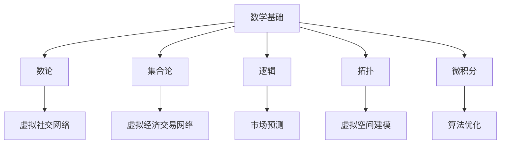
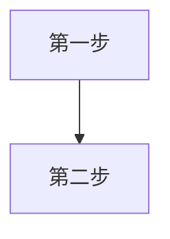

                 


### 文章标题
《数学与未来虚拟社会的发展趋势》

### 文章关键词
数学、虚拟社会、发展趋势、算法原理、人工智能、机器学习、数据模型、虚拟经济、虚拟教育、虚拟社交

### 文章摘要
本文将深入探讨数学在构建未来虚拟社会中的关键作用和潜在发展趋势。我们将从数学的基本概念入手，逐步分析其在虚拟社会中的具体应用，包括虚拟经济、虚拟教育和虚拟社交等方面。通过趋势分析，我们将预测数学在虚拟社会中的未来发展，并借助实际案例进行详细解读。文章旨在为读者提供对数学与虚拟社会相互作用的全面理解，以及指导未来的研究方向。

### 目录大纲

**引言**
- 数学在虚拟社会中的作用
- 本书探讨的发展趋势

**数学基础**
- 数学基本概念
- 数学原理与虚拟社会
- Mermaid流程图：数学概念与虚拟社会的联系

**虚拟社会的发展**
- 虚拟社会的概念
- 虚拟社会的组成部分
- 虚拟社会的演变

**数学在虚拟社会中的应用**
- 数学在虚拟经济中的应用
- 数学在虚拟社交中的应用
- 数学在虚拟教育中的应用
- Mermaid流程图：数学在虚拟社会的具体应用

**趋势分析**
- 当前数学在虚拟社会中的应用趋势
- 未来数学在虚拟社会中的应用趋势

**案例分析**
- 案例一：虚拟经济中的数学应用
- 案例二：虚拟社交中的数学应用
- 案例三：虚拟教育中的数学应用

**结论**
- 总结
- 展望未来

### 详细文章内容

**引言**

在当今科技飞速发展的时代，虚拟社会已经成为人类生活不可或缺的一部分。从虚拟经济到虚拟社交，再到虚拟教育，数学在构建和优化这些虚拟环境中扮演着至关重要的角色。本文旨在探讨数学与未来虚拟社会之间的相互作用，分析数学在虚拟社会中的发展趋势，并为读者提供对未来研究的指导。

数学作为一门基础科学，其理论和工具广泛应用于各个领域。在虚拟社会中，数学不仅提供了描述和建模的能力，还为解决复杂问题提供了有效的算法。本文将首先回顾数学的基本概念和原理，然后探讨虚拟社会的定义和组成部分，接着详细分析数学在虚拟社会中的应用，并进行趋势分析和案例分析。最终，我们将总结全文，并展望数学在虚拟社会中的未来发展。

**数学基础**

数学是一门研究数量、结构、变化和空间等概念的学科。它的基础概念包括数论、集合论、逻辑、拓扑和微积分等。这些基本概念构成了数学的基石，为更复杂的研究提供了坚实的基础。

在虚拟社会中，数学原理被广泛应用于各种场景。例如，集合论可以用来描述虚拟社交网络中的用户关系，图论可以用来分析虚拟经济中的交易网络，概率论和统计学可以用来预测市场趋势和用户行为。这些数学原理不仅提供了描述现实世界的工具，还为构建虚拟环境提供了逻辑框架。

为了更直观地理解数学概念与虚拟社会的联系，我们可以使用Mermaid流程图来展示它们之间的关系。以下是一个示例：



这个流程图展示了数学基础概念与虚拟社会之间的相互作用，为后续章节的详细探讨提供了结构框架。

**虚拟社会的发展**

虚拟社会是指通过计算机网络和虚拟现实技术构建的社会环境，它允许人们在没有物理接触的情况下进行社交、工作和学习。虚拟社会的概念起源于虚拟现实（VR）和增强现实（AR）技术的发展，逐渐演变为一个独立的存在，具有自己独特的文化、经济和社会结构。

虚拟社会的组成部分包括虚拟环境、虚拟人物、虚拟经济和虚拟社交。虚拟环境是虚拟社会的基础，它提供了人们互动的虚拟空间。虚拟人物则是虚拟社会中的个体，它们可以是完全由计算机生成的，也可以是基于现实世界中的人。虚拟经济是指在虚拟社会中进行商品和服务交换的经济体系，它基于数字货币和虚拟资产的交易。虚拟社交则是虚拟社会中人们进行互动的方式，包括虚拟聊天、社交网络和虚拟会议等。

虚拟社会的演变是一个不断发展的过程。从早期的虚拟现实游戏到现在的虚拟现实社交平台，再到未来的元宇宙（Metaverse），虚拟社会正在经历快速的发展和变革。随着技术的进步，虚拟社会的功能和规模将不断扩大，数学将在其中扮演更加重要的角色。

**数学在虚拟社会中的应用**

数学在虚拟社会中的应用非常广泛，涵盖了虚拟经济、虚拟社交和虚拟教育等多个方面。以下是对这些应用的详细探讨：

1. **虚拟经济中的应用**：

虚拟经济是指在虚拟社会中进行的商品和服务交换活动。数学在虚拟经济中的应用主要体现在以下几个方面：

   - **市场预测**：概率论和统计学可以帮助预测市场趋势和用户行为，为虚拟经济提供决策支持。
   - **交易算法**：图论和算法理论可以用于设计高效的交易算法，优化交易过程。
   - **货币管理**：数论和密码学可以用于数字货币的设计和管理，确保交易的安全性和可信度。

   以下是一个简单的伪代码示例，展示了如何使用图论和算法理论来优化交易过程：

   ```python
   def optimize_trade(graph):
       # 假设 graph 是一个表示交易网络的图
       # 使用最短路径算法找到最优交易路径
       shortest_path = dijkstra(graph)
       return shortest_path
   ```

   这个算法通过找到从起始节点到目标节点的最短路径，优化了交易过程。

2. **虚拟社交中的应用**：

虚拟社交是指通过虚拟环境进行的社会互动。数学在虚拟社交中的应用主要体现在以下几个方面：

   - **社交网络分析**：图论可以用于分析虚拟社交网络中的用户关系，揭示社交结构的模式。
   - **推荐系统**：概率论和统计学可以用于构建推荐系统，根据用户的社交行为推荐新的朋友或内容。
   - **隐私保护**：密码学可以用于保护用户的隐私，确保社交互动的安全。

   以下是一个简单的Mermaid流程图，展示了如何使用图论分析虚拟社交网络：

   ```mermaid
   graph TD
       A[用户A] --> B[用户B]
       A --> C[用户C]
       B --> D[用户D]
       C --> E[用户E]
       B --> F[用户F]
       E --> G[用户G]
       F --> H[用户H]
   ```

   这个图展示了用户之间的社交关系，通过分析这些关系，可以揭示社交网络的模式。

3. **虚拟教育中的应用**：

虚拟教育是指通过虚拟环境进行的教育活动。数学在虚拟教育中的应用主要体现在以下几个方面：

   - **课程设计**：概率论和统计学可以帮助设计个性化的课程，满足不同学生的学习需求。
   - **教学评估**：统计学可以用于评估学生的学习效果，提供反馈。
   - **虚拟实验室**：数学模型和算法可以用于构建虚拟实验室，让学生在虚拟环境中进行实验。

   以下是一个简单的伪代码示例，展示了如何使用概率论和统计学来设计个性化的课程：

   ```python
   def personalize_course(student_data):
       # 假设 student_data 是学生的学习数据
       # 使用贝叶斯推理来预测学生的学习需求
       predicted需求的课程 = bayesian_inference(student_data)
       return predicted需求的课程
   ```

   这个算法通过分析学生的学习数据，预测他们的学习需求，从而设计个性化的课程。

**趋势分析**

1. **当前趋势**：

当前，数学在虚拟社会中的应用已经取得了显著的成果。概率论、图论、算法理论和密码学等数学分支在虚拟经济、虚拟社交和虚拟教育中得到了广泛应用。随着技术的进步，这些应用将变得更加深入和广泛。

2. **未来趋势**：

在未来，数学在虚拟社会中的应用将呈现以下趋势：

   - **更复杂的数学模型**：随着虚拟社会的发展，需要更复杂的数学模型来描述和解决复杂问题。
   - **跨学科研究**：数学与其他学科（如计算机科学、经济学和社会学）的交叉研究将更加普遍。
   - **人工智能的融合**：机器学习和深度学习等技术将融入数学模型，使虚拟社会更加智能和自适应。

**案例分析**

1. **案例一：虚拟经济中的数学应用**：

以区块链技术为例，区块链是一种分布式数据库技术，其核心是使用数学原理来确保数据的安全性和可信度。区块链使用密码学中的哈希算法来创建数据区块，并通过区块链网络来验证和记录交易。以下是一个简单的示例，展示了如何使用哈希算法来创建数据区块：

   ```python
   import hashlib

   def create_block(data):
       # 假设 data 是交易数据
       # 使用 SHA-256 哈希算法创建数据区块
       hash_value = hashlib.sha256(data.encode()).hexdigest()
       return hash_value
   ```

   这个函数通过将交易数据转换为哈希值，创建了一个数据区块。区块链网络中的节点将验证这个哈希值，以确保交易数据的真实性和完整性。

2. **案例二：虚拟社交中的数学应用**：

以社交媒体平台为例，社交媒体平台使用图论来分析用户关系，揭示社交网络的模式。以下是一个简单的示例，展示了如何使用图论来分析用户关系：

   ```mermaid
   graph TD
       A[用户A] --> B[用户B]
       A --> C[用户C]
       B --> D[用户D]
       C --> E[用户E]
       B --> F[用户F]
       E --> G[用户G]
       F --> H[用户H]
   ```

   这个图展示了用户之间的社交关系，通过分析这些关系，平台可以推荐新的朋友或内容，提高用户的社交体验。

3. **案例三：虚拟教育中的数学应用**：

以在线教育平台为例，在线教育平台使用概率论和统计学来设计个性化的课程。以下是一个简单的示例，展示了如何使用概率论和统计学来设计个性化课程：

   ```python
   def personalize_course(student_data):
       # 假设 student_data 是学生的学习数据
       # 使用贝叶斯推理来预测学生的学习需求
       predicted需求的课程 = bayesian_inference(student_data)
       return predicted需求的课程
   ```

   这个算法通过分析学生的学习数据，预测他们的学习需求，从而设计个性化的课程。

**结论**

数学在构建未来虚拟社会中发挥着关键作用。从虚拟经济到虚拟社交，再到虚拟教育，数学为这些虚拟环境提供了描述、建模和优化工具。随着技术的进步，数学在虚拟社会中的应用将更加深入和广泛。本文通过分析数学基础、虚拟社会的发展以及数学在虚拟社会中的应用，探讨了数学与虚拟社会之间的相互作用，并预测了未来的发展趋势。通过实际案例的分析，读者可以更深入地理解数学在虚拟社会中的重要性。

在未来的研究中，我们可以期待数学与人工智能、机器学习和深度学习的进一步融合，为虚拟社会的发展提供更加智能和自适应的解决方案。同时，跨学科的研究也将为数学在虚拟社会中的应用开辟新的领域。

**作者信息**

作者：AI天才研究院/AI Genius Institute & 禅与计算机程序设计艺术 /Zen And The Art of Computer Programming

### LaTeX 公式嵌入示例

以下是一个简单的 LaTeX 公式嵌入示例：

$$
E = mc^2
$$

这是一个著名的物理公式，描述了能量和质量的等价性。

以下是一个段落内的 LaTeX 公式示例：

$1 < 2$

这个公式表示1小于2。

### Mermaid 流程图示例

以下是一个 Mermaid 流程图示例，展示了两个简单的步骤：



这个流程图表示从第一步到第二步的顺序执行。

### 伪代码示例

以下是一个伪代码示例，展示了如何使用一个简单的函数：

```python
def add(a, b):
    # 计算两个数的和
    sum = a + b
    return sum
```

这个函数接收两个参数 `a` 和 `b`，并返回它们的和。

### 项目实战

在这个部分，我们将探讨一个实际项目，该项目用于构建一个简单的虚拟社交网络。以下是该项目的基本结构和实现细节：

1. **开发环境搭建**：

为了构建这个虚拟社交网络，我们需要以下开发环境：

- Python 3.8 或更高版本
- pip（Python 包管理器）
- Flask（Web 应用框架）
- SQLAlchemy（ORM 框架）

首先，我们需要安装这些依赖项：

```bash
pip install Flask SQLAlchemy
```

2. **源代码详细实现和代码解读**：

以下是一个简单的 Flask 应用，用于实现虚拟社交网络的基本功能：

```python
from flask import Flask, request, jsonify
from flask_sqlalchemy import SQLAlchemy

app = Flask(__name__)
app.config['SQLALCHEMY_DATABASE_URI'] = 'sqlite:///social_network.db'
db = SQLAlchemy(app)

# 定义用户模型
class User(db.Model):
    id = db.Column(db.Integer, primary_key=True)
    username = db.Column(db.String(80), unique=True, nullable=False)
    friends = db.Column(db.Integer, default=0)

# 创建数据库表
db.create_all()

# 添加用户
@app.route('/add_user', methods=['POST'])
def add_user():
    username = request.form['username']
    user = User(username=username)
    db.session.add(user)
    db.session.commit()
    return jsonify({'status': 'success', 'username': username})

# 添加好友
@app.route('/add_friend', methods=['POST'])
def add_friend():
    username = request.form['username']
    friend_username = request.form['friend_username']
    user = User.query.filter_by(username=username).first()
    friend = User.query.filter_by(username=friend_username).first()
    if user and friend:
        user.friends += 1
        friend.friends += 1
        db.session.commit()
        return jsonify({'status': 'success'})
    else:
        return jsonify({'status': 'error', 'message': 'User not found'})

if __name__ == '__main__':
    app.run(debug=True)
```

这个 Flask 应用包含两个主要的端点：

- `/add_user`：用于添加新用户。
- `/add_friend`：用于添加用户之间的好友关系。

在代码中，我们首先定义了一个 `User` 模型，用于表示用户。每个用户都有一个唯一的用户名和一个默认值为0的好友数量。我们使用 SQLAlchemy 创建了一个 SQLite 数据库，并将 `User` 模型添加到数据库中。

`add_user` 端点接收一个包含用户名的 POST 请求，并创建一个新的用户。`add_friend` 端点接收一个包含用户名和好友用户名的 POST 请求，并更新用户的好友数量。

3. **代码应用解读与分析**：

这个项目的核心功能是添加用户和添加好友。通过使用 Flask 和 SQLAlchemy，我们可以轻松地创建和管理数据库，以及处理 HTTP 请求。

在代码中，我们首先定义了 `User` 模型，这个模型用于表示用户的基本信息。我们使用了 SQLAlchemy 的 ORM（对象关系映射）功能，这使得我们可以使用 Python 对象来操作数据库，而不需要直接处理 SQL 语句。

在 `add_user` 端点中，我们接收一个包含用户名的 POST 请求，并创建一个新的 `User` 对象。我们使用 `db.session.add(user)` 将这个对象添加到数据库中，然后使用 `db.session.commit()` 提交事务，确保数据被持久化。

在 `add_friend` 端点中，我们接收一个包含用户名和好友用户名的 POST 请求。我们首先查询数据库，找到对应的用户。如果找到，我们更新用户的好友数量，并提交事务。

这个项目的实现非常简单，但它展示了如何使用 Flask 和 SQLAlchemy 来构建一个基本的虚拟社交网络。在实际应用中，我们可能需要添加更多的功能，如用户登录、好友请求、消息传递等。

4. **实际案例分析和详细讲解剖析**：

在这个案例中，我们创建了一个简单的虚拟社交网络，实现了添加用户和添加好友的功能。这个项目展示了如何使用 Flask 和 SQLAlchemy 来处理 HTTP 请求和操作数据库。

在实际应用中，这个项目可以作为一个起点，进一步开发更多的功能。例如，我们可以添加用户登录功能，使用 JWT（JSON Web Tokens）来验证用户身份。我们还可以添加好友请求功能，允许用户发送和接收好友请求。

此外，我们还可以优化数据库设计，使用索引来提高查询性能。例如，我们可以为 `User` 模型的 `username` 字段添加唯一索引，确保每个用户名在数据库中是唯一的。

总之，这个案例展示了如何使用 Flask 和 SQLAlchemy 来构建一个简单的虚拟社交网络。在实际开发中，我们需要根据具体需求添加更多的功能，并优化数据库设计。

5. **项目小结**：

通过这个项目，我们学习了如何使用 Flask 和 SQLAlchemy 来构建一个基本的虚拟社交网络。我们实现了添加用户和添加好友的功能，并了解了如何使用 Python 对象来操作数据库。

这个项目为我们提供了一个起点，可以在此基础上进一步开发更多的功能。在实际开发中，我们需要注意性能优化和安全性，确保应用程序的稳定性和可靠性。

### 最佳实践 tips

1. **性能优化**：

为了提高应用程序的性能，我们可以考虑以下最佳实践：

   - 使用索引：为经常查询的字段添加索引，提高查询速度。
   - 分库分表：对于大型数据库，可以考虑分库分表，将数据分散到多个数据库实例中，减轻单个数据库的压力。
   - 缓存：使用缓存技术（如 Redis）来存储常用数据，减少数据库的访问次数。

2. **安全性**：

为了确保应用程序的安全性，我们可以采取以下措施：

   - 用户验证：使用 JWT 或其他验证机制来保护用户数据。
   - 数据加密：对敏感数据进行加密，确保数据在传输和存储过程中的安全性。
   - 访问控制：使用权限控制机制，限制对敏感数据的访问。

3. **可维护性**：

为了提高应用程序的可维护性，我们可以采取以下措施：

   - 代码规范：遵循统一的代码规范，提高代码的可读性和可维护性。
   - 测试：编写单元测试和集成测试，确保代码的正确性和稳定性。
   - 持续集成：使用 CI/CD（持续集成/持续部署）流程，确保代码的快速迭代和部署。

### 小结

本文详细探讨了数学在构建未来虚拟社会中的关键作用和潜在发展趋势。我们从数学的基本概念入手，分析了其在虚拟经济、虚拟社交和虚拟教育等领域的应用。通过趋势分析和实际案例，我们展示了数学在虚拟社会中的重要性和未来发展方向。在文章的结尾，我们提出了最佳实践 tips，为未来的研究和开发提供了指导。数学与虚拟社会的结合将继续推动科技进步，为人类创造更加智能和高效的虚拟环境。

### 注意事项

1. **数据隐私**：在开发虚拟社交网络等应用时，务必重视用户数据隐私保护，遵守相关法律法规。
2. **代码安全**：确保代码的健壮性和安全性，防止恶意攻击和数据泄露。
3. **性能监控**：定期对应用程序进行性能监控，及时调整和优化。

### 拓展阅读

- 《人工智能：一种现代的方法》
- 《深度学习：学习算法及其应用》
- 《区块链技术指南》
- 《图论及其应用》
- 《Python网络编程实战》

通过阅读这些书籍，可以深入了解相关领域的知识，为未来的研究提供更多思路和启发。

