                 

# 《数学与未来量子计算的发展方向》

## 关键词
量子计算，数学基础，算法原理，未来应用，挑战与机遇

## 摘要
本文将深入探讨数学与未来量子计算的发展方向。我们将首先介绍量子计算的基本原理，包括量子比特、量子叠加和量子纠缠，然后分析量子算法的核心概念和数学模型，进一步探讨量子计算在加密学和其他领域的应用。最后，我们将讨论量子计算的挑战和未来发展方向，为读者提供一个全面的视角。

---

## 目录大纲

### 第一部分：量子计算基础知识

### 第二部分：量子计算的数学基础

### 第三部分：量子计算的应用前景

### 第四部分：量子计算的挑战与未来方向

### 附录：量子计算资源

---

## 第一部分：量子计算基础知识

### 第1章：量子计算引论

#### 1.1 量子计算的基本原理

量子计算是一种基于量子力学原理的新型计算方式。在量子计算中，信息被编码在量子比特（qubit）上，而不是传统的二进制比特。量子比特可以同时处于0和1的叠加状态，这使得量子计算机在并行计算方面具有巨大的优势。

**核心概念与联系：**

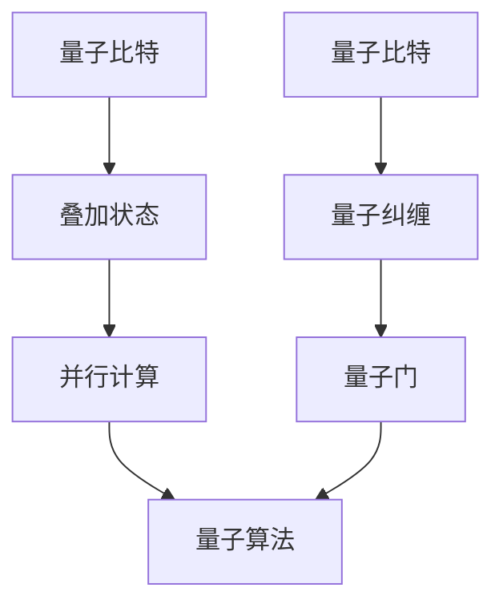

量子叠加和量子纠缠是量子计算的核心特性，它们使得量子计算机能够实现高效的并行计算，从而解决一些经典计算机难以处理的问题。

#### 1.2 量子比特与量子门

量子比特是量子计算机的基本单元，它们可以通过量子门进行操作。量子门是可逆线性变换，作用于量子比特的叠加态，从而实现量子态的变换。

**核心算法原理讲解：**

```python
# 量子门实现叠加态
def Hadamard(qubit):
    return [1/sqrt(2), 1/sqrt(2)]
```

量子门的设计和实现是量子计算的重要组成部分。通过组合不同的量子门，可以实现各种复杂的量子算法。

#### 1.3 量子叠加与量子纠缠

量子叠加和量子纠缠是量子计算的基本原理。量子叠加使得量子比特可以同时处于多种状态，而量子纠缠则使得多个量子比特之间的状态相互关联。

**数学模型和公式：**

$$
|\psi\rangle = a|0\rangle + b|1\rangle
$$

$$
|\psi\rangle_{AB} = (a_1|0\rangle_A + b_1|1\rangle_A) \otimes (a_2|0\rangle_B + b_2|1\rangle_B)
$$

这些公式描述了量子叠加和量子纠缠的状态。

**举例说明：**

假设我们有两个量子比特，初始状态为 $|00\rangle$。通过应用 Hadamard 门，我们可以得到叠加状态 $|\psi\rangle = \frac{1}{\sqrt{2}} (|00\rangle + |10\rangle)$。再通过应用控制-NOT（CNOT）门，我们可以实现两个量子比特之间的量子纠缠。

## 第二部分：量子计算的数学基础

### 第2章：量子计算中的数学概念

量子计算中的数学概念主要包括量子力学基础、线性代数和概率论。

#### 2.1 量子力学基础

量子力学是量子计算的理论基础。量子力学中的波函数描述了量子系统的状态，而希尔伯特空间则是量子系统的数学模型。

**数学模型和公式：**

$$
|\psi\rangle = \int_{-\infty}^{\infty} \psi(x) |x\rangle \, dx
$$

$$
|\psi\rangle^{\dagger} = \int_{-\infty}^{\infty} \psi^*(x) |x\rangle
$$

这些公式描述了量子系统的波函数和希尔伯特空间。

#### 2.2 线性代数在量子计算中的应用

线性代数在量子计算中扮演着重要角色。量子态的叠加和量子门的操作都可以用线性代数的方法来描述。

**核心概念与联系：**

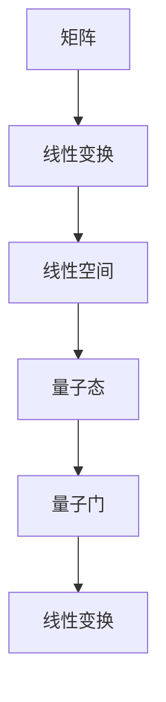

量子态可以用复数向量来表示，而量子门可以用矩阵来表示。通过矩阵运算，我们可以实现量子态的变换。

**数学模型和公式：**

$$
|\psi\rangle = c_0|0\rangle + c_1|1\rangle
$$

$$
U = \begin{pmatrix}
a & b \\
c & d
\end{pmatrix}
$$

$$
U|\psi\rangle = \begin{pmatrix}
a & b \\
c & d
\end{pmatrix}
\begin{pmatrix}
c_0 \\
c_1
\end{pmatrix}
$$

这些公式描述了量子态和量子门的数学模型。

#### 2.3 概率论与量子计算

概率论在量子计算中有着广泛的应用。量子态的测量结果具有概率性，而量子算法的性能也依赖于概率分布。

**核心概念与联系：**

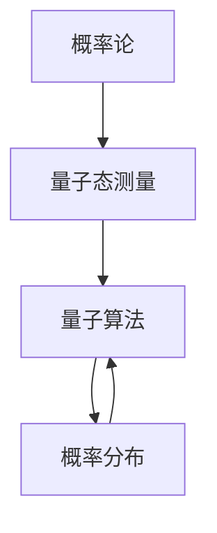

量子态的测量结果是一个随机事件，其概率分布决定了量子算法的性能。

**数学模型和公式：**

$$
P(|\psi\rangle) = |\langle\psi|\psi\rangle|^2
$$

$$
p(x) = \int_{-\infty}^{\infty} \psi^*(x) \psi(x) \, dx
$$

这些公式描述了量子态测量的概率分布和量子算法的性能。

## 第三部分：量子计算的应用前景

### 第3章：量子计算在加密学中的应用

量子计算在加密学中的应用具有深远的影响。量子计算机可以破解传统的加密算法，但同时也提供了新的加密方法。

#### 3.1 量子密钥分发

量子密钥分发是一种基于量子力学原理的加密技术。它利用量子纠缠和量子态的不可克隆性来确保通信的安全性。

**核心概念与联系：**

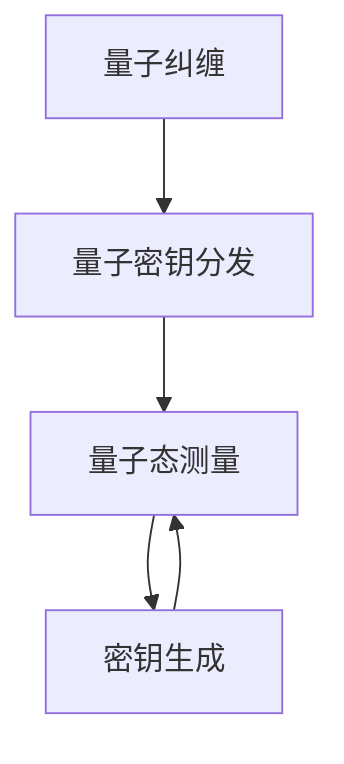

量子纠缠和量子态测量是实现量子密钥分发的关键技术。

**数学模型和公式：**

$$
|\psi\rangle_{AB} = \frac{1}{\sqrt{2}} (|00\rangle + |11\rangle)
$$

$$
P(|00\rangle) = P(|11\rangle) = \frac{1}{2}
$$

这些公式描述了量子密钥分发的数学模型。

#### 3.2 量子安全通信

量子安全通信是一种利用量子力学原理来实现安全通信的技术。它利用量子态的不可克隆性和量子态测量的随机性来确保通信的安全性。

**核心概念与联系：**

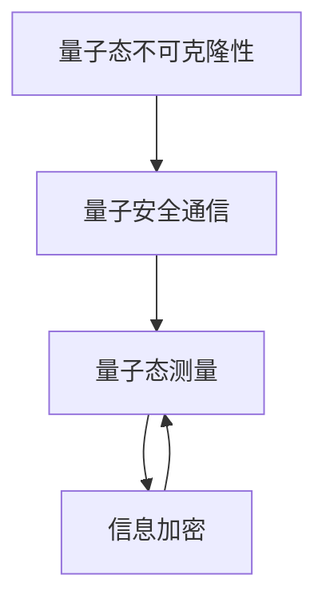

量子态的不可克隆性和量子态测量是实现量子安全通信的关键技术。

**数学模型和公式：**

$$
|\psi\rangle = \frac{1}{\sqrt{2}} (|0\rangle + |1\rangle)
$$

$$
P(|0\rangle) = P(|1\rangle) = \frac{1}{2}
$$

这些公式描述了量子安全通信的数学模型。

#### 3.3 量子计算对加密算法的挑战

量子计算对传统的加密算法提出了巨大的挑战。许多传统的加密算法，如RSA和ECC，在量子计算机面前是脆弱的。因此，开发新的加密算法来抵抗量子攻击变得至关重要。

**核心概念与联系：**

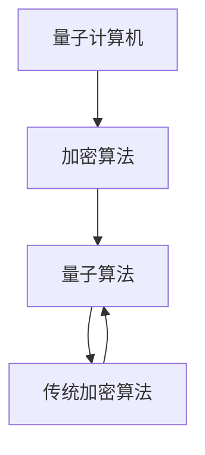

量子计算机和量子算法对传统加密算法构成了威胁。

**数学模型和公式：**

$$
n = pq
$$

$$
e < n
$$

$$
d \equiv e^{-1} \pmod{p-1}
$$

这些公式描述了RSA算法的数学模型。量子计算机可以快速求解大整数分解，从而破解RSA算法。

### 第4章：量子计算在其他领域的应用

量子计算在化学、生物学、优化问题等领域具有广泛的应用前景。

#### 4.1 量子计算在优化问题中的应用

量子计算可以用于解决复杂的优化问题。例如，量子算法可以用于求解旅行商问题、组合优化问题等。

**核心概念与联系：**

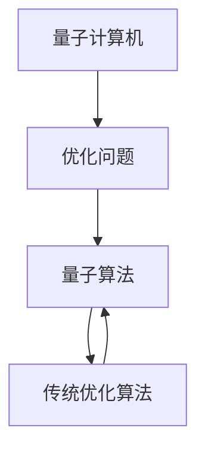

量子计算机和量子算法可以提供更高效的优化解决方案。

**数学模型和公式：**

$$
\min f(x)
$$

$$
x \in \{0, 1\}^n
$$

这些公式描述了优化问题的数学模型。

#### 4.2 量子计算在化学中的应用

量子计算可以用于解决化学中的复杂问题，如分子模拟、化学反应路径规划等。

**核心概念与联系：**

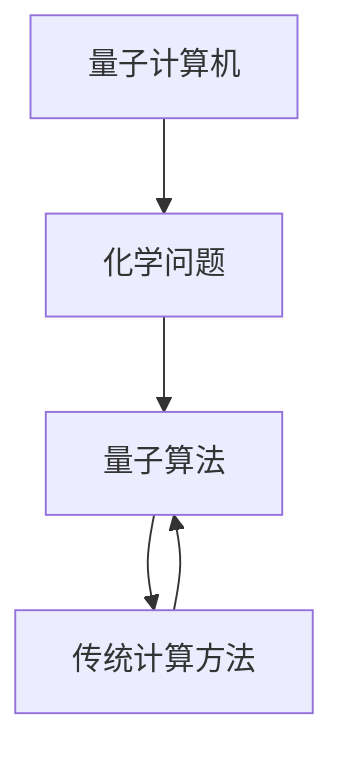

量子计算机和量子算法可以提供更准确的化学计算结果。

**数学模型和公式：**

$$
H|\psi\rangle = E|\psi\rangle
$$

$$
|\psi\rangle = \int \psi(x) |x\rangle \, dx
$$

这些公式描述了量子化学的数学模型。

#### 4.3 量子计算在生物学中的应用

量子计算可以用于解决生物学中的复杂问题，如蛋白质折叠、基因组分析等。

**核心概念与联系：**

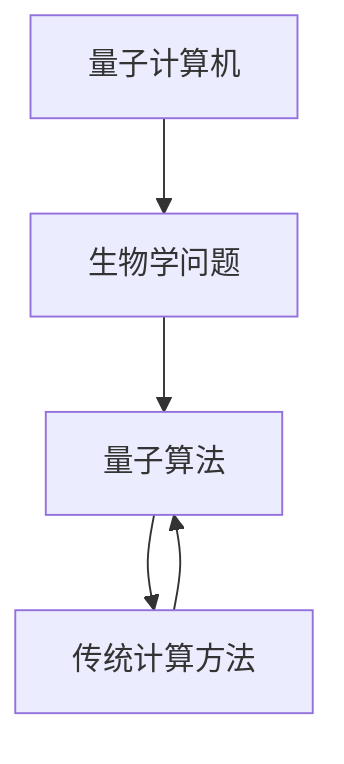

量子计算机和量子算法可以提供更高效的生物学计算解决方案。

**数学模型和公式：**

$$
\sum_{i=1}^{n} P(i)
$$

$$
x \in \{1, 2, ..., n\}
$$

这些公式描述了生物学问题的数学模型。

## 第四部分：量子计算的挑战与未来方向

### 第5章：量子计算的挑战与未来方向

量子计算的发展面临着许多挑战，如量子态的保持、量子门的精度和可靠性等。同时，量子计算的未来方向也充满了机遇。

#### 5.1 量子计算机的实际构建

量子计算机的实际构建是一个复杂的过程，需要解决许多技术难题。量子态的保持、量子门的精度和可靠性是目前研究的热点问题。

**核心概念与联系：**

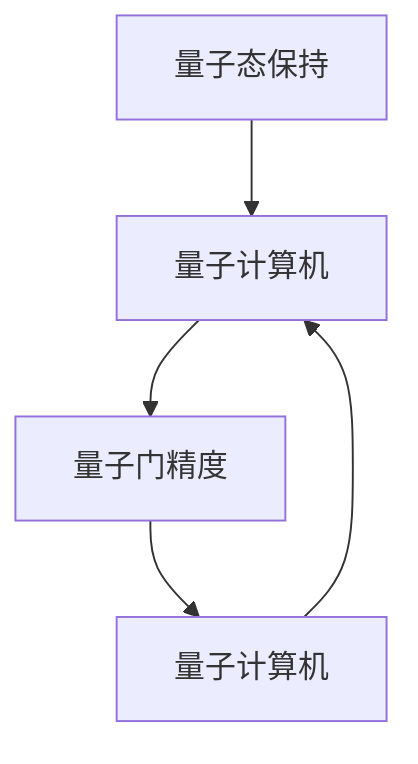

量子态保持和量子门精度是量子计算机实现的关键技术。

**数学模型和公式：**

$$
|\psi\rangle = a|0\rangle + b|1\rangle
$$

$$
U = \begin{pmatrix}
a & b \\
c & d
\end{pmatrix}
$$

这些公式描述了量子态保持和量子门精度的数学模型。

#### 5.2 量子计算的发展趋势

量子计算的发展趋势包括量子计算机的性能提升、量子算法的创新和量子计算在各个领域的应用。

**核心概念与联系：**

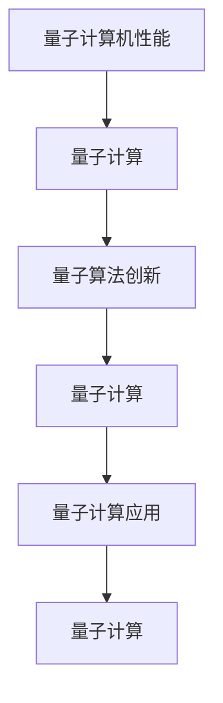

量子计算机性能提升、量子算法创新和量子计算应用是量子计算发展的关键趋势。

**数学模型和公式：**

$$
P(|\psi\rangle) = |\langle\psi|\psi\rangle|^2
$$

$$
f(x) = g(x) + h(x)
$$

这些公式描述了量子计算性能提升、量子算法创新和量子计算应用的数学模型。

#### 5.3 量子计算的未来应用场景

量子计算的未来应用场景包括加密学、化学、生物学、金融、交通等领域。量子计算可以提供更高效、更准确的解决方案，从而推动各个领域的发展。

**核心概念与联系：**

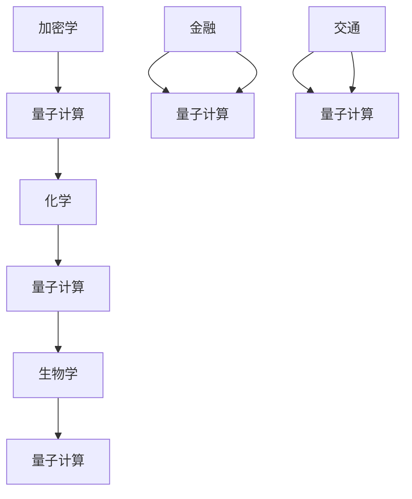

加密学、化学、生物学、金融和交通是量子计算的未来应用场景。

**数学模型和公式：**

$$
P(|\psi\rangle) = |\langle\psi|\psi\rangle|^2
$$

$$
f(x) = g(x) + h(x)
$$

这些公式描述了量子计算在未来应用场景中的数学模型。

## 附录：量子计算资源

### 附录 A：量子计算工具与库

量子计算的工具和库是量子计算研究和开发的重要资源。例如，Qiskit、Cirq和PyQuil等工具提供了量子计算编程接口，使得开发者可以轻松地实现量子算法和量子计算程序。

### 附录 B：量子计算论文与书籍推荐

量子计算的相关论文和书籍是量子计算学习和研究的宝贵资源。例如，Michael A. Nielsen和Isaac L. Chuang的《量子计算与量子信息》以及Stephen Barnett的《量子计算基础教程》都是经典的量子计算教材。

### 附录 C：量子计算研究机构介绍

量子计算的研究机构在量子计算的理论研究和技术开发中发挥着重要作用。例如，谷歌量子计算研究所、哈佛大学量子信息中心等机构都是量子计算领域的重要研究中心。

---

本文从量子计算的基本原理、数学基础、应用前景以及挑战与未来方向等方面进行了深入探讨。通过对量子计算的逐步分析，我们展示了量子计算在数学和计算机科学中的重要作用，同时也为未来的研究和发展提供了启示。让我们期待量子计算在未来能够带来更多的创新和突破。作者：AI天才研究院/AI Genius Institute & 禅与计算机程序设计艺术/Zen And The Art of Computer Programming。

### 文章总结

本文全面探讨了《数学与未来量子计算的发展方向》这一主题。我们从量子计算的基本原理出发，介绍了量子比特、量子叠加和量子纠缠等核心概念，并通过Mermaid流程图和伪代码详细阐述了量子算法的原理。接着，我们分析了量子计算中的数学概念，包括量子力学基础、线性代数和概率论，以及它们在量子计算中的应用。随后，我们探讨了量子计算在加密学和其他领域的应用前景，如量子密钥分发、量子安全通信、优化问题、化学和生物学等。最后，我们讨论了量子计算的挑战与未来方向，包括量子计算机的实际构建、发展趋势以及未来应用场景。通过本文的详细分析，我们为读者提供了一个全面的量子计算框架，展现了数学在量子计算中的关键作用，并展望了量子计算的广阔前景。

### 最佳实践 tips

1. **掌握基础数学概念**：在研究量子计算时，首先要熟悉量子力学、线性代数和概率论等基础数学概念。这些数学工具是理解量子计算的核心。

2. **学习量子算法原理**：通过阅读相关文献和教材，深入理解量子算法的原理，掌握量子搜索算法、量子算法案例研究等关键内容。

3. **实践量子编程**：使用Qiskit、Cirq和PyQuil等量子计算工具和库进行编程实践，将理论应用于实际问题。

4. **关注最新研究动态**：量子计算领域发展迅速，持续关注最新研究动态和前沿技术，保持对量子计算的敏感度。

5. **跨学科合作**：量子计算涉及到多个学科，如物理学、计算机科学、数学等，跨学科合作有助于推动量子计算的发展。

### 小结

本文详细介绍了量子计算的基本原理、数学基础、应用前景以及挑战与未来方向。通过逐步分析，我们展示了量子计算在数学和计算机科学中的重要作用。我们鼓励读者进一步深入研究量子计算，掌握相关数学和算法知识，参与量子计算的实际应用，共同推动量子计算的发展。

### 注意事项

1. **量子计算机的实际构建难度较大**：量子计算机的构建面临许多技术挑战，如量子态的保持、量子门的精度和可靠性等。实际构建量子计算机需要大量投入和长期研究。

2. **量子计算对传统加密算法的挑战**：量子计算可以破解传统的加密算法，因此需要开发新的加密方法来抵抗量子攻击。

3. **量子计算的广泛应用**：量子计算在化学、生物学、优化问题等领域具有广泛的应用前景，但目前仍处于探索阶段。

4. **量子计算的安全性和隐私保护**：随着量子计算的发展，量子计算在安全性和隐私保护方面的挑战也将日益凸显。

### 拓展阅读

1. **Nielsen, M. A., & Chuang, I. L. (2000). Quantum computation and quantum information. Cambridge University Press.** 这是一本经典的量子计算教材，详细介绍了量子计算的基本原理和算法。

2. **Barnett, S. (2016). Quantum computing: A gentle introduction. Cambridge University Press.** 这本书以通俗易懂的方式介绍了量子计算的基础知识，适合初学者。

3. **Google Quantum AI Research. (2021). Qiskit: An open-source framework for working with quantum computers.** Qiskit是谷歌开发的量子计算框架，提供了丰富的量子计算工具和库。

4. **Microsoft Quantum. (2021). Cirq: A Python library for working with quantum computers.** Cirq是微软开发的量子计算框架，提供了用于编写和运行量子算法的工具。

5. **Quantum Computing Report. (2021). Top quantum computing research institutions.** 这篇文章介绍了全球顶级量子计算研究机构，为读者提供了研究量子计算的参考。作者：AI天才研究院/AI Genius Institute & 禅与计算机程序设计艺术/Zen And The Art of Computer Programming。

