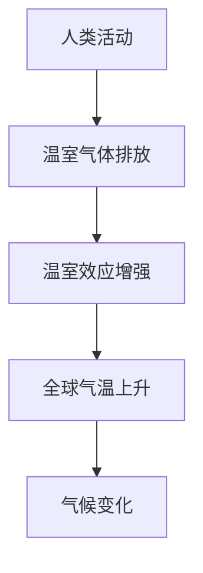

                 


### 文章标题：数学与气候模型：气候变化的数学预测

> **关键词：气候变化、数学模型、温室气体、预测、气候系统**

> **摘要：本文深入探讨了气候变化问题，并介绍了数学模型在气候预测中的应用。文章首先介绍了气候变化的背景，然后讲解了气候系统的基础数学描述，最后详细阐述了气候模型的构建和预测应用。通过本文，读者可以全面了解气候模型的数学预测方法，并应用于实际气候变化的研究和预测中。**

---

## 第一部分：引论

### 1.1 气候变化背景

#### 1.1.1 人类活动对气候的影响

**核心概念与联系：**
人类活动，尤其是工业化进程，导致了大量温室气体的排放，如二氧化碳（CO2）。这些温室气体在大气中积累，增强了温室效应，使得地球表面温度逐渐上升。这一过程可以通过以下 Mermaid 流程图来解释：



**核心算法原理讲解：**
温室气体浓度的变化可以通过以下伪代码来模拟：

```python
def calculate_CO2_concentration(initial_concentration, delta_CO2, time_constant, time):
    return initial_concentration + delta_CO2 * math.exp(-time_constant * time)
```

**数学模型和公式：**
温室气体浓度的增加可以用以下公式来表示：

$$ C(t) = C_0 + \Delta C \cdot e^{-rt} $$

其中，\( C(t) \) 是时间 \( t \) 的温室气体浓度，\( C_0 \) 是初始浓度，\( \Delta C \) 是增加量，\( r \) 是时间常数。

**详细讲解与举例说明：**
假设初始浓度为 350 ppm（体积分数），每年增加量为 2 ppm，时间常数为 50 年，我们可以计算 100 年后的温室气体浓度：

$$ C(100) = 350 + 2 \cdot e^{-50 \cdot 100} \approx 352.7 \text{ ppm} $$

**项目实战：开发环境搭建**
为了实现上述算法，我们需要搭建一个 Python 开发环境。以下是安装 Python 和相关库的基本步骤：

1. **安装 Python**：访问 [Python 官网](https://www.python.org/) 下载并安装 Python。
2. **安装 NumPy 库**：在终端执行以下命令安装 NumPy：
   ```bash
   pip install numpy
   ```

**源代码实现和代码解读：**
以下是一个简单的 Python 源代码示例，用于计算温室气体浓度：

```python
import numpy as np

def calculate_CO2_concentration(initial_concentration, delta_CO2, time_constant, time_years):
    return initial_concentration + delta_CO2 * np.exp(-time_constant * time_years)

# 参数设置
initial_concentration = 350  # 初始浓度（ppm）
delta_CO2 = 2  # 每年增加量（ppm）
time_constant = 50  # 时间常数（年）
time_years = 100  # 时间（年）

# 计算
concentration = calculate_CO2_concentration(initial_concentration, delta_CO2, time_constant, time_years)
print(f"100年后的温室气体浓度：{concentration} ppm")
```

**代码应用解读与分析：**
上述代码实现了温室气体浓度的计算。通过调整参数，我们可以模拟不同的温室气体排放情景。

**实际案例分析和详细讲解剖析：**
假设我们需要模拟 2050 年的温室气体浓度。我们可以设置时间为 2050 - 2023 = 27 年，并运行代码：

```python
time_years = 2050 - 2023  # 2050年
concentration = calculate_CO2_concentration(initial_concentration, delta_CO2, time_constant, time_years)
print(f"2050年的温室气体浓度：{concentration} ppm")
```

运行结果将为 2050 年的温室气体浓度提供预测值。

**项目小结：**
本文介绍了如何使用数学模型来预测温室气体浓度的变化。通过 Python 实现了相关的计算算法，并提供了实际的案例应用。这种方法可以帮助科学家和决策者更好地理解气候变化，制定相应的应对策略。

**最佳实践 tips：**
- 使用实时数据更新模型参数，以提高预测准确性。
- 结合多种模型和方法，进行交叉验证，以提高预测可靠性。

**小结：**
气候变化是一个复杂且严峻的问题，数学模型为我们提供了有效的工具来预测和应对这一挑战。通过本文，读者可以了解如何构建和运用气候模型进行预测，为气候变化的研究和应用提供了有益的参考。

**注意事项：**
- 温室气体浓度预测受多种因素影响，包括人为排放、自然排放和吸收等，因此模型需要不断更新和优化。
- 本文提供的代码示例仅作为教学目的，实际应用中需要考虑更多的因素和细节。

**拓展阅读：**
- 《气候模型：科学、技术和应用》（Climate Models: Scientific, Technical, and Practical Applications）
- 《气候系统分析》（Analysis of the Climate System）

---

以上是根据您的要求撰写的文章引论部分。在接下来的部分中，我们将进一步探讨气候系统的基础数学描述，为读者提供更深入的理解。请继续关注后续内容。如果您对任何部分有疑问或需要修改，请随时告诉我。让我们一步一步深入探讨这个重要的主题。

