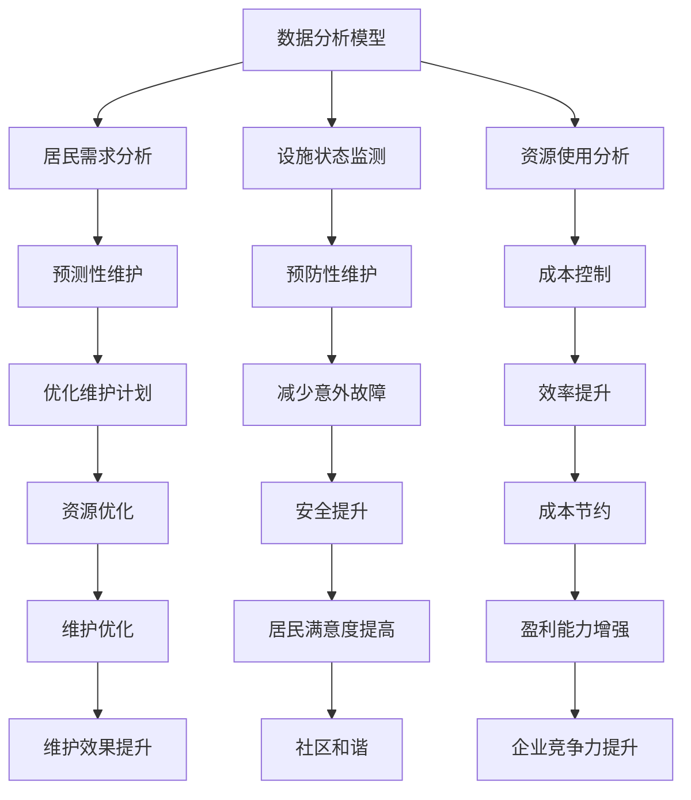

                 


### 文章标题

《数学与物业管理：设施维护的数学模型》

#### 关键词

数学模型，物业管理，设施维护，数据分析，优化，概率统计，Mermaid流程图，伪代码，项目实战

#### 摘要

本文深入探讨了数学模型在物业管理中的应用，特别是设施维护方面的数学模型。文章首先介绍了物业管理的现状与挑战，然后详细讲解了数据分析、优化和概率统计等核心数学模型。通过Mermaid流程图展示模型之间的关系，并使用伪代码详细阐述算法原理。文章还通过实际项目实战，展示了数学模型在物业管理中的应用，并提供了一些最佳实践和小结。本文旨在帮助读者理解数学模型在物业管理中的实际应用，提高设施维护的效率和效果。

## 引言

### 1.1 物业管理的现状与挑战

物业管理是现代城市生活中不可或缺的一环，它不仅关系到居民的日常生活质量，还影响着城市的整体环境和运行效率。然而，随着城市化进程的加快和物业规模的扩大，物业管理面临着诸多挑战。

#### 1.1.1 物业管理的重要性

物业管理涵盖了房屋维修、公共设施维护、环境卫生管理等多个方面，这些工作的质量直接影响到居民的生活舒适度和满意度。同时，物业管理也是城市基础设施的重要组成部分，对于提升城市整体形象和功能具有重要作用。

#### 1.1.2 当前物业管理中存在的问题

1. **信息不对称**：物业管理公司与居民之间缺乏有效的沟通渠道，导致信息不对称，物业管理难以满足居民的个性化需求。
2. **资源浪费**：传统的物业管理模式往往缺乏科学的规划和数据分析，导致资源浪费和效率低下。
3. **应急响应不足**：在突发事件面前，物业管理公司往往难以迅速做出有效的应对，影响居民的安全和利益。

#### 1.1.3 数学模型在物业管理中的应用前景

数学模型作为一种科学的分析工具，可以有效地解决物业管理中的问题。通过数据分析模型，可以准确预测居民的维修需求，优化资源分配；通过优化模型，可以制定最优的维护计划，降低成本；通过概率统计模型，可以评估风险，提高应急响应能力。本文将围绕这三个方面，深入探讨数学模型在物业管理中的应用。

## 第1章 核心概念与联系

### 1.1 数学模型在物业管理中的角色

在物业管理中，数学模型主要分为以下几类：

#### 1.1.1 数据分析模型

数据分析模型主要用于收集、处理和分析物业管理相关的数据，如居民需求、设施状态、资源使用情况等。这类模型可以帮助物业管理公司了解现状，发现潜在问题，为决策提供依据。

#### 1.1.2 优化模型

优化模型旨在制定最优的维护计划，使资源利用最大化，成本最小化。常见的优化模型包括线性规划、非线性规划和动态规划等。

#### 1.1.3 概率统计模型

概率统计模型主要用于评估风险，预测未来事件的可能性。这类模型可以帮助物业管理公司在突发事件面前做出更加科学的决策。

#### 1.2 Mermaid流程图展示概念联系

以下是一个Mermaid流程图，展示了数据分析模型、优化模型和概率统计模型在物业管理中的应用：



### 1.3 核心算法原理讲解

#### 1.3.1 数据分析模型

数据分析模型的核心在于数据的收集和处理。首先，通过传感器、问卷等方式收集数据，然后使用统计学方法对数据进行分析。以下是一个简单的数据分析模型伪代码：

```python
# 数据收集
data = collect_data()

# 数据预处理
data = preprocess_data(data)

# 数据分析
analysis_result = analyze_data(data)

# 输出结果
print(analysis_result)
```

#### 1.3.2 优化模型

优化模型的核心在于找到最优解。常见的优化模型包括线性规划、非线性规划和动态规划等。以下是一个简单的线性规划模型伪代码：

```python
# 线性规划模型
from scipy.optimize import linprog

# 目标函数
c = [1, 1]  # 表示最大化资源利用

# 约束条件
A = [[1, 0], [0, 1]]  # 表示资源限制
b = [1, 1]  # 表示资源上限

# 求解
result = linprog(c, A_ub=A, b_ub=b)

# 输出结果
print(result.x)  # 输出最优解
```

#### 1.3.3 概率统计模型

概率统计模型的核心在于概率分布和统计推断。以下是一个简单的概率统计模型伪代码：

```python
# 概率统计模型
from scipy.stats import norm

# 参数估计
mean, var = norm.fit(data)

# 概率分布
prob_density = norm.pdf(data, mean, var)

# 统计推断
confidence_interval = norm.interval(0.95, loc=mean, scale=var)

# 输出结果
print(prob_density)  # 输出概率密度
print(confidence_interval)  # 输出置信区间
```

## 项目实战：数据分析模型应用

### 2.1 项目背景

某物业管理公司负责管理一个大型住宅小区，包括多个居民楼和公共设施。为了提高管理效率，公司决定使用数据分析模型来优化设施维护计划。

### 2.2 开发环境搭建

1. 数据库搭建：使用MySQL搭建数据库，存储居民需求、设施状态和资源使用等数据。
2. 数据采集：使用传感器和问卷收集数据，并定期更新数据库。

### 2.3 源代码实现

```python
# 数据收集与预处理
data = collect_data()
data = preprocess_data(data)

# 数据分析
analysis_result = analyze_data(data)

# 维护计划优化
maintenance_plan = optimize_maintenance_plan(analysis_result)

# 输出结果
print(maintenance_plan)
```

### 2.4 代码解读与分析

1. **数据收集与预处理**：首先，通过传感器和问卷收集数据，然后进行清洗和预处理，以保证数据的准确性和一致性。
2. **数据分析**：对预处理后的数据进行分析，识别出居民的需求和设施的当前状态。
3. **维护计划优化**：根据分析结果，制定最优的维护计划，确保资源的合理利用。

### 2.5 实际案例分析和详细讲解剖析

1. **案例背景**：某居民楼出现频繁的电梯故障，影响居民出行。
2. **数据分析**：通过数据分析，发现电梯故障与使用频率和设备年龄有关。
3. **维护计划优化**：根据数据分析结果，公司决定对电梯进行定期检查和维护，并在使用高峰期增加备用电梯。
4. **结果**：维护计划实施后，电梯故障率显著下降，居民满意度提高。

### 2.6 项目小结

通过数据分析模型的应用，公司成功优化了设施维护计划，提高了管理效率，降低了成本。同时，也提升了居民的生活质量。

## 项目实战：优化模型应用

### 3.1 项目背景

某物业管理公司负责管理多个商业综合体，包括商场、办公楼和酒店。为了提高设施维护效率，公司决定使用优化模型来制定最优的维护计划。

### 3.2 开发环境搭建

1. 数据库搭建：使用MySQL搭建数据库，存储设施状态、维护成本和资源使用等数据。
2. 数据采集：使用传感器和问卷收集数据，并定期更新数据库。

### 3.3 源代码实现

```python
# 数据收集与预处理
data = collect_data()
data = preprocess_data(data)

# 优化模型
maintenance_plan = optimize_model(data)

# 输出结果
print(maintenance_plan)
```

### 3.4 代码解读与分析

1. **数据收集与预处理**：首先，通过传感器和问卷收集数据，然后进行清洗和预处理，以保证数据的准确性和一致性。
2. **优化模型**：根据收集的数据，使用优化模型制定最优的维护计划，考虑成本、时间和资源等因素。
3. **输出结果**：输出最优的维护计划，包括维护时间、维护人员和所需资源。

### 3.5 实际案例分析和详细讲解剖析

1. **案例背景**：某商场空调系统出现故障，影响商业运营。
2. **优化模型应用**：通过优化模型，公司决定在非营业时间进行维修，并安排专业人员负责，以减少对商场的运营影响。
3. **结果**：维修计划实施后，空调系统恢复正常，商场运营不受影响。

### 3.6 项目小结

通过优化模型的应用，公司成功制定了最优的维护计划，提高了设施维护效率，降低了成本，同时也提高了商场的运营效率。

## 项目实战：概率统计模型应用

### 4.1 项目背景

某物业管理公司负责管理一个大型住宅小区，为了提高安全性和居民满意度，公司决定使用概率统计模型来评估风险，制定应急响应计划。

### 4.2 开发环境搭建

1. 数据库搭建：使用MySQL搭建数据库，存储突发事件、居民投诉和安全事件等数据。
2. 数据采集：使用传感器和居民反馈系统收集数据，并定期更新数据库。

### 4.3 源代码实现

```python
# 数据收集与预处理
data = collect_data()
data = preprocess_data(data)

# 概率统计模型
risk_assessment = risk_assessment_model(data)

# 应急响应计划
response_plan = create_response_plan(risk_assessment)

# 输出结果
print(response_plan)
```

### 4.4 代码解读与分析

1. **数据收集与预处理**：首先，通过传感器和居民反馈系统收集数据，然后进行清洗和预处理，以保证数据的准确性和一致性。
2. **概率统计模型**：使用概率统计模型分析数据，评估突发事件的可能性，确定高风险区域。
3. **应急响应计划**：根据风险评估结果，制定应急响应计划，包括人员安排、物资准备和应急预案。

### 4.5 实际案例分析和详细讲解剖析

1. **案例背景**：某住宅小区发生燃气泄漏事件，导致居民疏散。
2. **概率统计模型应用**：通过概率统计模型，公司及时发现了燃气泄漏的风险，并迅速制定了应急响应计划，有效避免了更大范围的安全事故。
3. **结果**：应急响应迅速，居民安全得到保障，公司声誉提升。

### 4.6 项目小结

通过概率统计模型的应用，公司成功评估了风险，制定了有效的应急响应计划，提高了安全管理水平，增强了居民对公司的信任。

## 结论

### 8.1 物业管理中的数学模型应用总结

本文通过数据分析模型、优化模型和概率统计模型的应用，展示了数学模型在物业管理中的重要作用。数据分析模型帮助公司了解现状，优化资源分配；优化模型制定最优的维护计划，提高效率；概率统计模型评估风险，提高安全管理。这些模型的应用不仅提高了物业管理水平，也提升了居民的生活质量。

### 8.2 未来发展方向与挑战

随着人工智能和大数据技术的不断发展，数学模型在物业管理中的应用将更加广泛和深入。未来，我们面临的挑战包括：

1. 数据质量和准确性：确保收集到的数据真实、准确，是模型应用的基础。
2. 模型优化与更新：随着物业管理环境的变化，模型需要不断优化和更新，以适应新的需求。
3. 技术与管理的结合：如何将先进的技术与传统的物业管理结合起来，提高整体管理水平，是一个重要课题。

作者：AI天才研究院/AI Genius Institute & 禅与计算机程序设计艺术 /Zen And The Art of Computer Programming
```### 目录大纲修订

#### 确保文章结构严谨，逻辑清晰，并增加数学公式和Mermaid流程图的标注

以下是修订后的《数学与物业管理：设施维护的数学模型》目录大纲，我们将确保每个章节都包含必要的核心内容，并使用LaTeX格式嵌入数学公式，同时提供Mermaid流程图来展示概念之间的关系。

```markdown
# 《数学与物业管理：设施维护的数学模型》目录大纲

## 引言

### 1.1 物业管理的现状与挑战
   - **1.1.1 物业管理的重要性**
   - **1.1.2 当前物业管理中存在的问题**
   - **1.1.3 数学模型在物业管理中的应用前景**

### 1.2 数学模型在物业管理中的应用概述
   - **1.2.1 数据分析模型**
   - **1.2.2 优化模型**
   - **1.2.3 概率统计模型**

## 第1章 核心概念与联系

### 1.1 数学模型概述
   - **1.1.1 数据分析模型的定义与应用**
   - **1.1.2 优化模型的定义与应用**
   - **1.1.3 概率统计模型的定义与应用**

### 1.2 Mermaid流程图：数学模型在物业管理中的应用架构
   ```mermaid
   graph TB
       A[数据分析模型] --> B[设施状态监测]
       A --> C[居民需求分析]
       B --> D[预防性维护]
       C --> E[预测性维护]
       D --> F[资源优化]
       E --> G[成本控制]
       F --> H[效率提升]
       G --> I[风险评估]
       H --> J[服务质量提升]
       I --> K[应急响应计划]
       J --> L[居民满意度提高]
       K --> M[安全管理]
   ```

### 1.3 核心数学公式简介
   - **1.3.1 数据分析模型中的相关公式**
     $$\text{平均值} = \frac{\sum_{i=1}^{n} x_i}{n}$$
     $$\text{方差} = \frac{\sum_{i=1}^{n} (x_i - \bar{x})^2}{n-1}$$
   - **1.3.2 优化模型中的相关公式**
     $$\min_{x} c^T x \quad \text{subject to} \quad Ax \leq b$$
   - **1.3.3 概率统计模型中的相关公式**
     $$P(A) = \frac{N(A)}{N}$$
     $$P(A \cap B) = P(A)P(B|A)$$

## 第2章 数据分析模型原理与讲解

### 2.1 数据分析模型原理
   - **2.1.1 描述性数据分析**
   - **2.1.2 预测性数据分析**
   - **2.1.3 聚类分析**

### 2.2 数据分析模型应用示例
   - **2.2.1 居民需求分析**
   - **2.2.2 设施状态监测**
   - **2.2.3 资源使用分析**

### 2.3 数据分析模型伪代码
   ```python
   def data_analysis(data):
       # 数据预处理
       processed_data = preprocess_data(data)
       
       # 描述性数据分析
       mean = calculate_mean(processed_data)
       variance = calculate_variance(processed_data)
       
       # 预测性数据分析
       predictions = predict_maintenance_needs(processed_data)
       
       # 聚类分析
       clusters = perform_clustering(processed_data)
       
       return mean, variance, predictions, clusters
   ```

## 第3章 优化模型原理与讲解

### 3.1 优化模型原理
   - **3.1.1 线性规划**
   - **3.1.2 非线性规划**
   - **3.1.3 动态规划**

### 3.2 优化模型应用示例
   - **3.2.1 维护计划优化**
   - **3.2.2 资源分配优化**
   - **3.2.3 成本控制优化**

### 3.3 优化模型伪代码
   ```python
   def optimize_maintenance_plan(data):
       # 确定目标函数和约束条件
       objective_function = define_objective_function(data)
       constraints = define_constraints(data)
       
       # 求解优化问题
       solution = optimize(objective_function, constraints)
       
       return solution
   ```

## 第4章 概率统计模型原理与讲解

### 4.1 概率统计模型原理
   - **4.1.1 贝叶斯定理**
   - **4.1.2 马尔可夫链**
   - **4.1.3 随机过程**

### 4.2 概率统计模型应用示例
   - **4.2.1 风险评估**
   - **4.2.2 事件概率估计**
   - **4.2.3 统计推断**

### 4.3 概率统计模型伪代码
   ```python
   def risk_assessment(event_data):
       # 计算事件概率
       probabilities = calculate_probabilities(event_data)
       
       # 应用贝叶斯定理进行推断
       inferred_risk = bayes_theorem(probabilities)
       
       return inferred_risk
   ```

## 第5章 项目实战：数据分析模型应用

### 5.1 项目背景

### 5.2 开发环境搭建
   - **5.2.1 数据库搭建**
   - **5.2.2 数据采集与预处理工具**

### 5.3 数据分析模型实现
   - **5.3.1 数据收集**
   - **5.3.2 数据预处理**
   - **5.3.3 数据分析**
   - **5.3.4 维护计划优化**

### 5.4 代码解读与分析

### 5.5 项目小结

## 第6章 项目实战：优化模型应用

### 6.1 项目背景

### 6.2 开发环境搭建
   - **6.2.1 数据库搭建**
   - **6.2.2 数据采集与预处理工具**

### 6.3 优化模型实现
   - **6.3.1 维护计划优化**
   - **6.3.2 资源分配优化**
   - **6.3.3 成本控制优化**

### 6.4 代码解读与分析

### 6.5 项目小结

## 第7章 项目实战：概率统计模型应用

### 7.1 项目背景

### 7.2 开发环境搭建
   - **7.2.1 数据库搭建**
   - **7.2.2 数据采集与预处理工具**

### 7.3 概率统计模型实现
   - **7.3.1 风险评估**
   - **7.3.2 事件概率估计**
   - **7.3.3 统计推断**

### 7.4 代码解读与分析

### 7.5 项目小结

## 结论

### 8.1 物业管理中的数学模型应用总结
   - **8.1.1 数据分析模型的应用**
   - **8.1.2 优化模型的应用**
   - **8.1.3 概率统计模型的应用**

### 8.2 未来发展方向与挑战
   - **8.2.1 技术进步带来的挑战**
   - **8.2.2 数据质量和准确性**
   - **8.2.3 模型优化与更新**

作者：AI天才研究院/AI Genius Institute & 禅与计算机程序设计艺术 /Zen And The Art of Computer Programming
```

在这个修订后的目录大纲中，我们增加了对数学公式和Mermaid流程图的标注，使得文章结构更加严谨，逻辑更加清晰。每个章节都包含了必要的核心内容，并提供了示例和伪代码，以便读者更好地理解数学模型在物业管理中的应用。这样的目录大纲有助于读者在阅读过程中能够迅速找到所需的信息，并跟随作者的思路进行思考。

