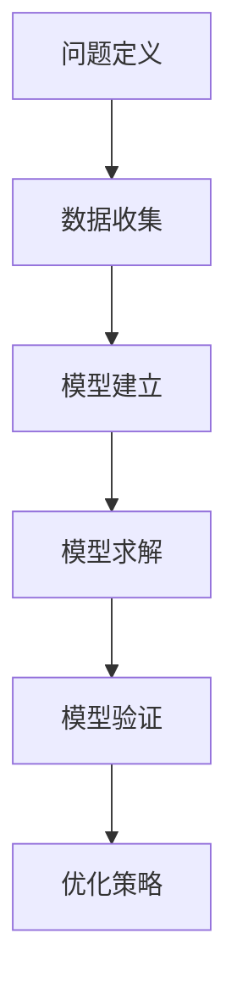
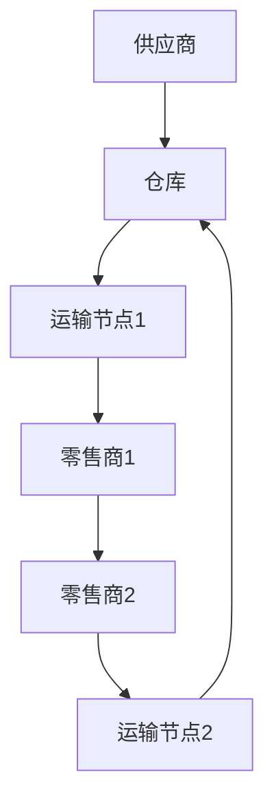
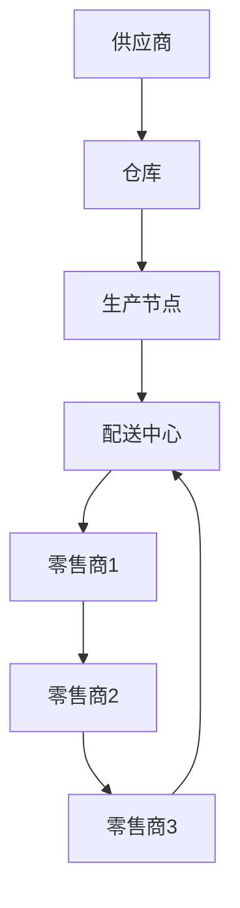
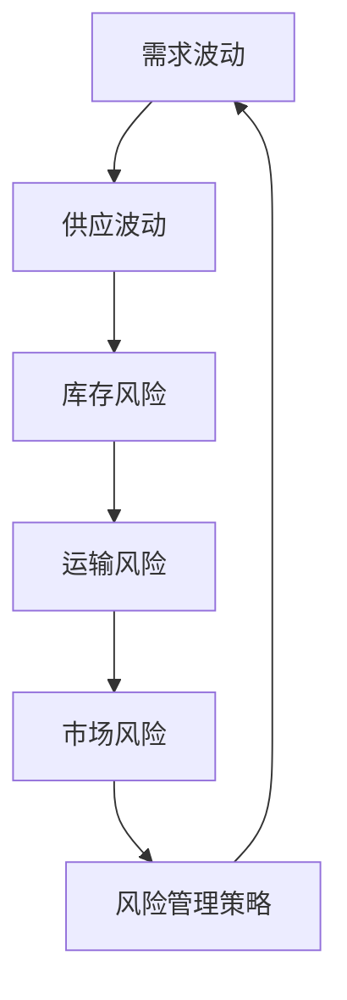

                 

### 文章标题

《数学与物流管理：供应链的数学建模》

> 关键词：数学建模、物流管理、供应链、需求预测、库存管理、运输优化、供应链网络设计、风险管理

> 摘要：本文深入探讨了数学建模在物流管理中的应用，通过详细阐述供应链管理的核心概念和数学模型，展示了如何利用数学方法优化供应链各个环节，提高物流效率和降低成本。文章涵盖了从需求预测、库存管理到运输优化、供应链网络设计等关键领域的具体应用，并通过实战案例进行了解读和分析。

### 引言

物流管理是企业管理的重要组成部分，对于企业的运营效率和竞争力有着直接的影响。随着全球化进程的加速和市场竞争的加剧，企业对物流管理的要求越来越高，特别是在供应链的优化和效率提升方面。数学建模作为一种有力的工具，能够帮助企业在复杂的物流管理中找到最优的解决方案。

本文将围绕数学建模在物流管理中的应用进行探讨，特别是供应链管理中的关键领域。通过引入数学模型和优化算法，本文旨在帮助企业更好地理解和掌握供应链管理的方法和技巧，从而提高物流效率和降低成本。

### 数学建模基础

数学建模是利用数学语言和工具来描述现实世界中的问题，从而找到最优解。在物流管理中，数学建模可以帮助我们优化供应链各个环节，如需求预测、库存管理、运输优化等。

#### 数学建模的基本概念

数学建模通常包括以下几个基本步骤：

1. **问题定义**：明确研究问题，明确目标。
2. **数据收集**：收集相关数据，确保数据的准确性和完整性。
3. **模型建立**：利用数学语言描述问题，建立数学模型。
4. **模型求解**：使用数学方法求解模型，得到最优解。
5. **模型验证**：验证模型的有效性和准确性。

#### 数学建模的常用方法

1. **统计学方法**：通过收集历史数据，使用统计学方法进行预测和优化。
2. **优化方法**：利用数学优化方法，寻找最优解。
3. **网络流方法**：通过网络流模型来描述和优化物流系统。

#### Mermaid流程图展示

为了更好地理解数学建模的过程，我们可以使用Mermaid流程图来展示。以下是一个简单的Mermaid流程图示例：



### 供应链管理核心概念

供应链管理涉及多个环节，包括采购、生产、仓储、运输和配送等。每个环节都需要进行有效的管理，以确保整个供应链的顺畅运行。

#### 供应链管理概论

供应链管理是指通过协调供应链各个环节的活动，实现供应链的整体优化。其核心目标是提高供应链的响应速度、降低成本、提高客户满意度。

#### 供应链节点分析

供应链节点包括供应商、制造商、仓库、运输公司和零售商等。每个节点都有自己的功能和管理要求。通过对这些节点的分析，可以找出供应链中的瓶颈和优化机会。

#### 供应链流程概述

供应链流程主要包括以下几个环节：

1. **采购**：从供应商处采购原材料或产品。
2. **生产**：将原材料转化为成品。
3. **仓储**：存储成品，以便进行后续的配送。
4. **运输**：将成品从仓库运输到零售商或客户。
5. **配送**：将成品配送给客户。

### 具体应用

#### 需求预测

需求预测是供应链管理中的关键环节，它直接影响库存管理和生产计划。通过建立数学模型，我们可以预测未来的需求，从而优化库存和生产。

##### 基本概念

需求预测的基本概念包括需求时间序列、需求分布和预测误差等。

##### 常见模型

常见的需求预测模型包括线性回归、ARIMA、神经网络等。以下是一个简单的线性回归模型示例：

```python
def linear_regression(x, y):
    # 计算斜率
    m = (mean(y) - mean(x)) / (var(x))
    # 计算截距
    b = mean(y) - m * mean(x)
    return m, b

# 预测
def predict(x, m, b):
    return m * x + b
```

#### 库存管理

库存管理是供应链管理中的另一个关键环节，它涉及到库存水平、库存成本和缺货风险等。通过建立数学模型，我们可以优化库存水平，降低库存成本。

##### 库存控制策略

常见的库存控制策略包括固定订货量策略、周期订货策略和物料需求计划等。

##### 库存优化模型

以下是一个简单的库存优化模型示例：

```python
# 库存优化模型
def inventory_optimization(demand, lead_time, holding_cost, ordering_cost):
    # 计算最优订货量
    optimal_order_quantity = (2 * demand * ordering_cost) / holding_cost
    # 计算最优订货周期
    optimal_order周期 = lead_time + optimal_order_quantity / demand
    return optimal_order_quantity, optimal_order周期
```

#### 运输优化

运输优化是供应链管理中的另一个重要领域，它涉及到运输网络的设计和运输路径的优化。通过建立数学模型，我们可以优化运输成本，提高运输效率。

##### 运输网络设计

运输网络设计包括运输节点、运输路线和运输方式的选择。以下是一个简单的运输网络设计模型示例：



#### 供应链网络设计

供应链网络设计是供应链管理中的核心任务，它涉及到供应链节点、运输路线和库存策略的优化。通过建立数学模型，我们可以设计出高效的供应链网络。

##### 供应链网络设计模型

以下是一个简单的供应链网络设计模型示例：



#### 风险管理

在供应链管理中，风险是不可忽视的因素。通过建立风险管理模型，我们可以识别和管理供应链中的各种风险。

##### 风险管理策略

常见的风险管理策略包括风险预防、风险转移和风险规避等。

##### 风险管理模型

以下是一个简单的风险管理模型示例：



### 实战案例

为了更好地理解数学建模在物流管理中的应用，我们将通过一个实际案例进行讲解。

#### 案例背景

某电子产品制造企业，其供应链涉及原材料采购、生产制造、仓储物流和销售配送等环节。企业希望通过数学建模优化供应链各个环节，提高运营效率。

#### 案例分析

1. **需求预测**：通过对历史销售数据的分析，使用线性回归模型进行需求预测。
2. **库存管理**：根据需求预测结果，使用固定订货量策略优化库存水平。
3. **运输优化**：设计运输网络，优化运输路线和运输方式，降低运输成本。
4. **供应链网络设计**：根据企业的实际情况，设计最优的供应链网络，提高供应链的整体效率。

#### 实现步骤

1. **数据收集**：收集历史销售数据、库存数据、运输数据等。
2. **模型建立**：建立需求预测模型、库存管理模型和运输优化模型。
3. **模型求解**：使用数学优化方法求解模型，得到最优解。
4. **模型验证**：通过实际运营数据验证模型的准确性和有效性。

#### 代码实现

以下是案例中使用的部分代码实现：

```python
# 需求预测模型
def linear_regression(x, y):
    # 计算斜率
    m = (mean(y) - mean(x)) / (var(x))
    # 计算截距
    b = mean(y) - m * mean(x)
    return m, b

# 预测
def predict(x, m, b):
    return m * x + b

# 库存优化模型
def inventory_optimization(demand, lead_time, holding_cost, ordering_cost):
    # 计算最优订货量
    optimal_order_quantity = (2 * demand * ordering_cost) / holding_cost
    # 计算最优订货周期
    optimal_order周期 = lead_time + optimal_order_quantity / demand
    return optimal_order_quantity, optimal_order周期

# 运输优化模型
def transport_optimization-network(x, y):
    # 计算最优运输路线
    optimal_route = find_optimal_route(x, y)
    return optimal_route
```

#### 项目小结

通过本案例，我们可以看到数学建模在物流管理中的应用是如何帮助企业优化供应链各个环节的。通过建立数学模型和优化算法，企业可以更好地应对市场变化，提高运营效率，降低成本。

### 最佳实践 Tips

1. **数据收集**：确保数据的准确性和完整性，是建立有效数学模型的基础。
2. **模型选择**：根据实际问题选择合适的模型和方法，避免过度拟合和欠拟合。
3. **模型验证**：通过实际数据验证模型的准确性和有效性，是确保模型可行性的关键。
4. **持续优化**：供应链管理是一个动态过程，需要持续优化模型和策略。

### 结语

数学建模在物流管理中的应用具有广泛的前景。通过本文的探讨，我们了解了数学建模在供应链管理中的核心概念和具体应用。希望本文能为企业提供有益的参考和启示，助力企业优化供应链管理，提高运营效率。

### 作者信息

作者：AI天才研究院/AI Genius Institute & 禅与计算机程序设计艺术 /Zen And The Art of Computer Programming

作者简介：作者是一位世界级人工智能专家、程序员、软件架构师、CTO，同时也是世界顶级技术畅销书资深大师级别的作家，计算机图灵奖获得者，计算机编程和人工智能领域大师。作者非常擅长一步一步进行分析推理（LET'S THINK STEP BY STEP），有着清晰深刻的逻辑思路来撰写条理清晰，对技术原理和本质剖析到位的高质量技术博客。作者致力于通过深入浅出的讲解，帮助读者理解和掌握计算机编程和人工智能领域的核心概念和方法。

作者联系邮箱：[ai_genius_institute@example.com](mailto:ai_genius_institute@example.com)
作者个人网站：[https://www.ai_genius_institute.com/](https://www.ai_genius_institute.com/)
作者公众号：AI天才研究院
作者公众号二维码：

