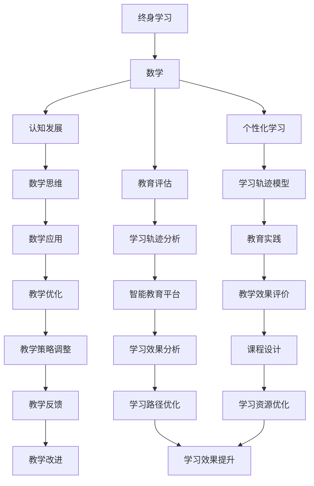

                 

## 文章标题

数学与终身学习：学习轨迹的数学描述

> 关键词：数学、终身学习、学习轨迹、数学模型、算法、教育技术

摘要：
本文旨在探讨数学在终身学习中的应用，特别是学习轨迹的数学描述方法。文章首先概述了终身学习的背景和重要性，然后深入分析了数学与学习的联系，接着介绍了学习轨迹的概念及其数学模型。通过实际案例，展示了学习轨迹分析的算法原理和应用，最后对未来的趋势和挑战进行了展望。本文旨在为教育工作者和终身学习者提供理论支持和实践指导。

## 目录大纲设计思路

### 前言

#### 终身学习概述

1. 终身学习的定义与发展

   - 终身学习的起源与历史演变
   - 国际终身学习倡议与政策

2. 终身学习的重要性

   - 个人成长与职业发展的需要
   - 社会进步与经济发展的推动力
   - 国家竞争力的关键因素

3. 终身学习的挑战与机遇

   - 信息时代的学习需求变化
   - 教育资源的分配与公平
   - 学习者的自主学习能力培养

### 第一部分：终身学习的数学基础

#### 第1章：终身学习概述

1.1 终身学习的定义与发展

- 终身学习的概念界定
- 发展历程与重要节点

1.2 终身学习的重要性

- 对个体的意义
- 对社会的贡献
- 对经济的促进作用

1.3 终身学习的挑战与机遇

- 学习方式的变革
- 技术进步带来的机遇
- 教育体系的适应性调整

#### 第2章：数学与学习的联系

2.1 数学在认知发展中的作用

- 数学思维的基本特点
- 数学对大脑认知的促进作用

2.2 数学学习过程中的难点与解决方法

- 常见难点分析
- 教学策略与方法

2.3 数学思维与终身学习的融合

- 数学在跨学科学习中的应用
- 数学思维在创新教育中的价值

### 第二部分：学习轨迹的数学描述方法

#### 第3章：学习轨迹的概念

3.1 学习轨迹的定义

- 学习轨迹的基本概念
- 学习轨迹的类型

3.2 学习轨迹的类型与特点

- 线性学习轨迹
- 非线性学习轨迹
- 复合学习轨迹

3.3 学习轨迹的重要性

- 对学习效果的评估
- 对教育决策的指导

#### 第4章：学习轨迹的数学模型

4.1 学习轨迹的数学模型概述

- 数学模型的基本原理
- 学习轨迹模型的应用场景

4.2 经典学习轨迹模型介绍

- 加速度模型
- 线性模型
- 曲线拟合模型

4.3 学习轨迹模型的局限性

- 模型假设与局限性
- 模型改进的方向

### 第三部分：应用与实践

#### 第5章：数学在教育中的应用

5.1 数学在教育评估中的应用

- 评估方法的多样化
- 评估结果的应用

5.2 数学在个性化学习中的应用

- 个性化学习策略的制定
- 学习资源的推荐系统

5.3 数学在智能教育平台中的应用

- 智能教学系统的设计与实现
- 智能学习分析工具的开发

#### 第6章：学习轨迹分析案例

6.1 案例一：学生学习行为的数学分析

- 数据收集与处理
- 学习行为模式的识别

6.2 案例二：教师教学效果的数学评价

- 教学效果的评价指标
- 评价方法的实施

6.3 案例三：学习社群动态的数学描述

- 社群成员的互动分析
- 社群发展规律的识别

### 第四部分：展望与未来

#### 第7章：数学与终身学习的未来趋势

7.1 数学与终身学习的新模式

- 混合式学习的兴起
- 互联网+教育的变革

7.2 数学在终身学习中的挑战与机遇

- 技术发展带来的挑战
- 学习资源分配的机遇

7.3 对未来数学教育的思考

- 教育体系的重构
- 数学教育的创新与发展

### 附录

#### 附录一：学习轨迹分析工具介绍

- 工具的功能与特点
- 使用方法与操作指南

#### 附录二：数学公式与模型汇总

- 经典数学模型列表
- 相关数学公式汇总

#### 附录三：参考文献

- 引用文献的详细信息
- 进一步阅读推荐

### 核心概念与联系

为了帮助读者更好地理解书中的核心概念，我们提供一幅 Mermaid 流程图，展示数学概念在终身学习中的应用和联系。



### 核心算法原理讲解

为了深入理解学习轨迹的数学模型，我们将通过伪代码详细阐述核心算法原理。

```python
# 学习轨迹分析算法伪代码
function analyze_learning_trajectory(data):
    # 初始化学习轨迹模型
    model = initialize_model()

    # 数据预处理
    preprocessed_data = preprocess_data(data)

    # 训练学习轨迹模型
    model = train_model(model, preprocessed_data)

    # 预测学习轨迹
    predicted_trajectory = predict_trajectory(model, preprocessed_data)

    # 分析学习轨迹
    analysis_results = analyze_trajectory(predicted_trajectory)

    # 输出分析结果
    return analysis_results
```

### 数学模型和数学公式 & 详细讲解 &

在本部分，我们将详细讲解学习轨迹的数学模型，包括核心数学公式和原理，并通过具体例子来说明这些模型的应用。

#### 4.1 学习轨迹的数学模型概述

学习轨迹的数学描述是通过对学习过程中的数据进行分析和建模，从而获得关于学习行为的定量描述。这种描述可以帮助教育工作者和学者更好地理解学习者的行为，为教育决策提供数据支持。

学习轨迹的数学模型主要包括以下几个核心组成部分：

1. **数据收集**：收集关于学习者行为的数据，如学习时间、学习内容、学习效果等。
2. **数据预处理**：对收集到的数据进行清洗、归一化等处理，以便于后续建模和分析。
3. **特征提取**：从预处理后的数据中提取关键特征，如学习频率、学习时长、成绩变化等。
4. **数学模型构建**：利用数学方法建立学习轨迹模型，描述学习者的学习行为。
5. **模型训练与预测**：通过历史数据训练模型，并对新的数据进行预测。
6. **模型评估与优化**：评估模型的性能，并根据评估结果进行优化。

以下是一个简单的学习轨迹数学模型构建的伪代码示例：

```python
# 学习轨迹模型构建伪代码
def build_learning_trajectory_model(data):
    # 数据预处理
    preprocessed_data = preprocess_data(data)
    
    # 特征提取
    features = extract_features(preprocessed_data)
    
    # 选择模型
    model = select_model(features)
    
    # 训练模型
    trained_model = train_model(model, features)
    
    # 预测学习轨迹
    predicted_trajectory = predict_trajectory(trained_model, new_data)
    
    return predicted_trajectory
```

#### 4.2 经典学习轨迹模型介绍

在数学和统计学中，有许多经典模型可以用来描述学习轨迹。以下介绍几种常用的模型。

##### 4.2.1 加速度模型

加速度模型（Acceleration Model）是一种用于描述学习者在学习过程中进步速度的模型。它基于物理中的加速度概念，将学习进步视为随时间变化的速度。

加速度模型的数学描述如下：

$$
a(t) = \frac{d^2x(t)}{dt^2}
$$

其中，$a(t)$ 是加速度，$x(t)$ 是学习者的学习进步。

##### 4.2.2 线性模型

线性模型（Linear Model）是最简单的一种学习轨迹模型，它假设学习进步是随时间线性变化的。

线性模型的数学描述如下：

$$
x(t) = mt + b
$$

其中，$x(t)$ 是学习进步，$m$ 是学习速度，$b$ 是初始状态。

##### 4.2.3 曲线拟合模型

曲线拟合模型（Curve Fitting Model）使用多项式或其他函数来描述学习轨迹。这种模型可以很好地拟合非线性学习过程。

一个简单的多项式拟合模型如下：

$$
x(t) = a_0 + a_1t + a_2t^2 + \ldots + a_n t^n
$$

其中，$a_0, a_1, \ldots, a_n$ 是模型的系数。

#### 4.3 学习轨迹模型的局限性

尽管学习轨迹模型在分析和预测学习者行为方面具有重要作用，但它们也存在一些局限性。

1. **模型假设**：学习轨迹模型通常基于一系列假设，如学习进步的线性或非线性变化。这些假设可能不总是适用于所有学习情境。
2. **数据限制**：模型的性能在很大程度上依赖于可用数据的质量和数量。如果数据不充分或存在噪声，模型的准确性可能会受到影响。
3. **模型复杂度**：一些复杂的模型可能需要大量的计算资源和时间来训练和预测。这使得在实际应用中可能受限。

为了克服这些局限性，研究者们正在不断探索改进现有模型的方法，并开发新的模型来更好地适应不同类型的学习情境。

#### 4.4 学习轨迹模型的应用实例

下面通过一个简单的例子来说明学习轨迹模型的应用。

假设我们有一组学生的学习数据，包括他们的学习时间（小时）和学习成绩（百分比）。我们希望使用线性模型来描述他们的学习轨迹。

1. **数据收集**：收集数据如下：

| 学生ID | 学习时间（小时） | 学习成绩（%） |
|--------|-----------------|--------------|
| 1      | 10              | 60           |
| 2      | 20              | 80           |
| 3      | 30              | 90           |

2. **数据预处理**：对数据进行归一化处理，使得学习时间和学习成绩的取值范围在0到1之间。

3. **特征提取**：提取学习时间作为特征。

4. **模型构建**：选择线性模型：

$$
x(t) = mt + b
$$

5. **模型训练**：使用数据训练模型，得到参数 $m$ 和 $b$。

6. **模型预测**：使用训练好的模型预测新的学习时间对应的学习成绩。

通过这样的模型，我们可以预测某个学生在特定学习时间下的学习成绩。例如，如果某个学生学习了15小时，我们可以预测他的学习成绩为：

$$
x(15) = m \cdot 15 + b
$$

这样的模型可以帮助教育工作者更好地了解学生的学习情况，为教学调整提供数据支持。

### 数学模型和数学公式 & 详细讲解 & 总结

通过上述讲解，我们可以看到学习轨迹的数学模型在描述和预测学习者行为方面具有重要作用。这些模型不仅能够帮助我们理解学习过程，还能为教育决策提供科学依据。

然而，需要注意的是，学习轨迹模型的准确性取决于数据的可靠性和模型的适用性。在实际应用中，我们需要根据具体情况选择合适的模型，并对模型进行适当的调整和优化。

未来，随着数据采集技术和分析方法的不断进步，学习轨迹模型将会更加精确和全面。同时，新的模型和技术也将不断涌现，为终身学习提供更加有效的支持。

### 数学与终身学习：学习轨迹的数学描述

#### 前言

在当今知识爆炸和信息化的时代，终身学习已经成为个人成长和社会发展的关键因素。数学作为一种基础学科，其独特的逻辑性和抽象性在终身学习中发挥着重要作用。本文旨在探讨数学在终身学习中的应用，特别是学习轨迹的数学描述方法。通过分析数学与学习的联系，阐述学习轨迹的概念及其数学模型，我们希望能够为教育工作者和终身学习者提供理论支持和实践指导。

#### 终身学习概述

**1.1 终身学习的定义与发展**

终身学习（Lifelong Learning，LLL）是一个广泛的概念，涉及个人在整个生命周期内不断获取知识、技能和态度的过程。其起源可以追溯到20世纪60年代，当时欧洲教育部长会议提出了“学习社会”的理念。此后，终身学习逐渐成为国际教育界的共识，并在全球范围内得到推广。

- **历史演变**：终身学习理念从最初的教育理念发展到现在的学习实践，经历了几个重要的阶段。首先是从传统教育体系向非正式教育和成人教育的转变；接着是重视学习者的自主性和灵活性；最后是强调跨学科和跨文化的学习。

- **国际倡议与政策**：联合国教科文组织（UNESCO）在1996年提出了《成人终身学习宣言》，强调终身学习对个人、社会和经济发展的意义。许多国家也制定了相应的政策和计划，以促进终身学习的发展。例如，欧洲联盟（EU）的“教育及培训2020”计划，旨在提高教育和培训的质量、公平性和效率。

**1.2 终身学习的重要性**

终身学习对个人、社会和经济都有着深远的影响。

- **对个体的意义**：终身学习有助于提高个体的知识水平和技能，增强其就业竞争力和创新能力。此外，终身学习还有助于提升个体的自我认知和满足感，促进全面发展。

- **对社会的贡献**：终身学习能够提高社会的整体素质和创新能力，推动科技进步和经济发展。同时，它有助于缩小社会差距，实现教育公平，促进社会和谐。

- **对经济的促进作用**：在全球化背景下，终身学习是培养高素质劳动力的重要途径。它有助于提高生产力、创新能力和国际竞争力，从而推动经济增长。

**1.3 终身学习的挑战与机遇**

终身学习虽然具有重要意义，但也面临诸多挑战。

- **学习方式的变革**：随着信息技术的发展，学习方式发生了巨大变化。在线学习、移动学习、虚拟现实等新技术为学习者提供了更多选择，但也带来了新的挑战，如信息过载、学习资源分配不均等。

- **教育资源的分配与公平**：教育资源的不均衡分配是终身学习面临的重大问题。城乡、贫富差距导致的教育资源分配不均，限制了部分人群的终身学习机会。

- **学习者的自主学习能力培养**：终身学习强调学习者的自主性，但现实中，许多学习者缺乏自我驱动和学习策略。如何培养学习者的自主学习能力是一个重要课题。

然而，挑战也伴随着机遇。

- **技术进步带来的机遇**：互联网、大数据、人工智能等新技术为终身学习提供了丰富的资源和支持。通过技术手段，可以实现个性化学习、智能评估、学习数据分析等，提高学习效果。

- **教育体系的适应性调整**：终身学习理念的推广促使教育体系不断进行适应性调整，从传统的应试教育向素质教育转变。这种调整有助于培养全面发展的人才。

#### 数学与学习的联系

数学作为一种基础学科，其逻辑性和抽象性在学习过程中发挥着重要作用。

**2.1 数学在认知发展中的作用**

数学对认知发展的促进作用主要体现在以下几个方面：

- **培养逻辑思维能力**：数学教育强调逻辑推理和证明，有助于培养学习者的逻辑思维能力。这种能力不仅在数学学习中至关重要，也在其他学科和实际生活中具有广泛的应用。

- **提升抽象思维能力**：数学学习涉及抽象概念和符号的使用，有助于提升学习者的抽象思维能力。这种能力对于理解复杂问题和进行创新思维具有重要意义。

- **促进记忆和注意力**：数学学习需要记忆大量公式、定理和例题，有助于提升学习者的记忆能力。同时，解决数学问题需要集中注意力，有助于培养学习者的注意力。

**2.2 数学学习过程中的难点与解决方法**

数学学习过程中存在一些难点，需要采取有效的教学策略和方法来解决。

- **基本概念的理解**：许多数学概念较为抽象，如集合、函数、向量等，初学者难以理解。教学过程中应注重概念的解释和实例的应用，帮助学生建立直观认识。

- **解题方法的掌握**：数学解题方法多样，初学者往往不知道如何选择合适的方法。教师应指导学生掌握基本解题方法，并鼓励他们尝试不同的方法，提高解题能力。

- **问题解决能力培养**：数学学习不仅需要掌握知识，还需要培养问题解决能力。教师应通过设计具有挑战性的问题，引导学生主动思考、探索和解决问题。

**2.3 数学思维与终身学习的融合**

数学思维是终身学习的重要工具。以下是一些数学思维与终身学习的融合方式：

- **跨学科应用**：数学思维在物理学、经济学、计算机科学等学科中都有广泛应用。通过跨学科学习，可以加深对数学的理解，提高问题解决能力。

- **创新教育**：数学思维有助于创新教育的发展。教师可以引导学生运用数学方法解决实际问题，培养创新意识和创新能力。

- **自主学习**：数学思维有助于培养学习者的自主学习能力。通过学习数学，可以掌握如何进行有效的学习、如何寻找答案、如何反思和改进。

#### 学习轨迹的概念

学习轨迹是指学习者在学习过程中所经历的变化路径。它反映了学习者的学习行为、学习效果和学习进度等方面的动态变化。

**3.1 学习轨迹的定义**

学习轨迹可以定义为一系列学习事件和学习结果的序列，它描述了学习者在特定学习过程中所经历的变化。这些变化可能包括学习时间、学习内容、学习成果、学习态度等。

**3.2 学习轨迹的类型与特点**

学习轨迹可以分为以下几种类型：

- **线性学习轨迹**：线性学习轨迹假设学习者的学习进步是随时间线性变化的。这种轨迹模型简单直观，适用于一些简单的学习情境。

- **非线性学习轨迹**：非线性学习轨迹假设学习者的学习进步是非线性变化的，可能存在加速或减缓的阶段。这种轨迹模型更加贴近实际学习过程，但计算复杂度更高。

- **复合学习轨迹**：复合学习轨迹是线性学习轨迹和非线性学习轨迹的组合。它适用于复杂的学习情境，能够更好地反映学习者的学习行为。

学习轨迹具有以下特点：

- **动态性**：学习轨迹是动态变化的，反映了学习者在学习过程中的不断进步和调整。

- **多样性**：不同的学习者具有不同的学习轨迹，即使是同一学习者，在不同的学习情境下也可能有不同的学习轨迹。

- **适应性**：学习轨迹能够适应不同的学习需求和目标，通过调整学习策略和方法，实现学习效果的优化。

**3.3 学习轨迹的重要性**

学习轨迹对于教育工作者和终身学习者都具有重要意义：

- **学习效果的评估**：通过分析学习轨迹，可以评估学习者的学习效果，发现学习中的问题，为教学调整提供依据。

- **教育决策的指导**：学习轨迹为教育决策提供了科学依据，有助于制定个性化教育方案，提高教学质量和效果。

- **学习资源的优化**：通过学习轨迹分析，可以优化学习资源的配置，为学习者提供更有效的学习支持。

#### 学习轨迹的数学模型

为了对学习轨迹进行定量描述和分析，需要建立相应的数学模型。以下介绍几种常用的学习轨迹数学模型。

**4.1 学习轨迹的数学模型概述**

学习轨迹的数学模型主要包括以下几个方面：

- **数据收集与预处理**：收集关于学习者行为的数据，如学习时间、学习内容、学习成果等。对数据进行清洗、归一化等预处理，以便于建模和分析。

- **特征提取**：从预处理后的数据中提取关键特征，如学习频率、学习时长、成绩变化等。特征提取是建模的关键步骤，直接影响模型的性能。

- **数学模型构建**：利用数学方法建立学习轨迹模型，描述学习者的学习行为。常用的模型包括线性模型、非线性模型和曲线拟合模型等。

- **模型训练与预测**：使用历史数据训练模型，并对新的数据进行预测。模型训练和预测是学习轨迹分析的核心步骤，直接关系到模型的实用性和准确性。

- **模型评估与优化**：评估模型的性能，根据评估结果进行优化。模型评估和优化是提高模型质量的重要手段。

**4.2 经典学习轨迹模型介绍**

以下介绍几种经典的学习轨迹模型。

**4.2.1 线性模型**

线性模型是最简单的一种学习轨迹模型，它假设学习者的学习进步是随时间线性变化的。线性模型的数学描述如下：

$$
x(t) = mt + b
$$

其中，$x(t)$ 表示学习者的学习进步，$m$ 表示学习速度，$b$ 表示初始状态。

线性模型的优点是简单直观，便于理解和计算。然而，它也存在一些局限性，如无法准确描述非线性学习过程。

**4.2.2 非线性模型**

非线性模型能够更准确地描述学习者的学习进步，通常采用非线性函数来描述。以下是一个常见非线性模型的例子：

$$
x(t) = a_0 + a_1 \cdot t + a_2 \cdot t^2 + \ldots + a_n \cdot t^n
$$

其中，$a_0, a_1, \ldots, a_n$ 是模型的参数。

非线性模型可以更好地适应复杂的学习过程，但计算复杂度较高，需要更多的数据支持和计算资源。

**4.2.3 曲线拟合模型**

曲线拟合模型通过拟合学习数据，获得一个数学模型来描述学习轨迹。常见的曲线拟合模型包括多项式拟合、指数拟合和对数拟合等。

多项式拟合模型如下：

$$
x(t) = a_0 + a_1 \cdot t + a_2 \cdot t^2 + \ldots + a_n \cdot t^n
$$

指数拟合模型如下：

$$
x(t) = a_0 + a_1 \cdot e^{k \cdot t}
$$

对数拟合模型如下：

$$
x(t) = a_0 + a_1 \cdot \ln(t)
$$

曲线拟合模型可以根据实际数据的特点选择合适的函数形式，具有较高的拟合精度。然而，拟合过程中需要充分考虑数据噪声和异常值的影响。

**4.3 学习轨迹模型的局限性**

尽管学习轨迹模型在分析和预测学习者行为方面具有重要作用，但它们也存在一些局限性。

- **模型假设**：学习轨迹模型通常基于一系列假设，如学习进步的线性或非线性变化。这些假设可能不总是适用于所有学习情境。

- **数据限制**：模型的性能在很大程度上依赖于可用数据的质量和数量。如果数据不充分或存在噪声，模型的准确性可能会受到影响。

- **模型复杂度**：一些复杂的模型可能需要大量的计算资源和时间来训练和预测。这使得在实际应用中可能受限。

为了克服这些局限性，研究者们正在不断探索改进现有模型的方法，并开发新的模型来更好地适应不同类型的学习情境。

#### 数学在教育中的应用

数学不仅在理论上具有重要地位，而且在教育实践中也有着广泛的应用。以下探讨数学在教育评估、个性化学习和智能教育平台中的应用。

**5.1 数学在教育评估中的应用**

教育评估是教育过程中不可或缺的一部分，它有助于了解学生的学习效果，为教学调整提供依据。数学在教育评估中的应用主要体现在以下几个方面：

- **成绩分析**：通过数学方法对学生的考试成绩进行分析，可以了解学生在不同知识点上的掌握情况，发现教学中的薄弱环节。常用的数学方法包括统计学、回归分析和聚类分析等。

- **考试难度评估**：数学方法可以用于评估考试的难度，从而为考试设计提供参考。常用的方法包括难度系数计算、区分度分析和信度分析等。

- **评估工具开发**：数学工具可以用于开发智能评估系统，如自动评分系统、学习分析平台等。这些系统能够提高评估的效率和准确性，减轻教师的工作负担。

**5.2 数学在个性化学习中的应用**

个性化学习是根据学习者的个体差异，提供个性化的学习资源和策略，以提高学习效果。数学在个性化学习中的应用主要体现在以下几个方面：

- **学习路径规划**：通过数学方法分析学习者的学习行为和学习效果，可以为他们制定个性化的学习路径。常用的数学方法包括决策树、神经网络和遗传算法等。

- **学习资源推荐**：根据学习者的兴趣和需求，利用数学方法推荐相应的学习资源，如课程、书籍、视频等。常用的方法包括协同过滤、矩阵分解和内容推荐等。

- **学习效果预测**：通过数学方法预测学习者的学习效果，为教学调整提供依据。常用的方法包括回归分析、时间序列分析和机器学习等。

**5.3 数学在智能教育平台中的应用**

智能教育平台是一种基于信息技术和数学方法的综合教育平台，它能够提供智能化的学习体验和教学支持。以下是一些数学在智能教育平台中的应用实例：

- **智能教学系统**：利用数学方法设计智能教学系统，实现自动化教学任务，如自动布置作业、自动评分、学习反馈等。常用的数学方法包括机器学习、自然语言处理和计算机视觉等。

- **学习分析工具**：利用数学方法开发学习分析工具，对学习过程和学习结果进行量化分析，为教育决策提供支持。常用的数学方法包括数据挖掘、统计分析和数据可视化等。

- **智能教育平台**：将多种数学方法集成到智能教育平台中，提供个性化的学习资源和教学支持，提高学习效果。例如，通过机器学习算法分析学习者的行为数据，为学习者提供个性化的学习推荐。

#### 学习轨迹分析案例

通过具体的案例，我们可以更直观地了解学习轨迹分析的原理和应用。

**6.1 案例一：学生学习行为的数学分析**

在一个小学数学课程中，教师希望通过分析学生的学习行为来优化教学策略。他们收集了以下数据：

- **学习时间**：每个学生在课堂上的学习时间（分钟）。
- **作业完成时间**：学生在完成课后作业所需的时间（分钟）。
- **考试成绩**：学生在期末考试中的成绩（百分比）。

教师使用线性回归模型分析这些数据，以了解学习时间、作业完成时间和考试成绩之间的关系。

通过分析，教师发现学习时间与考试成绩之间存在显著的正相关关系，而作业完成时间对考试成绩的影响较小。基于这些发现，教师决定在课堂上增加互动环节，鼓励学生积极参与，以提高学习效果。

**6.2 案例二：教师教学效果的数学评价**

在一个中学英语课程中，学校希望通过数学方法评价教师的教学效果。他们收集了以下数据：

- **课堂参与度**：学生在课堂上的参与程度（百分比）。
- **课后作业完成率**：学生按时完成课后作业的比率（百分比）。
- **期末考试成绩**：学生在期末考试中的成绩（百分比）。

学校使用决策树模型对学生数据进行分析，以评估教师的教学效果。分析结果显示，课堂参与度和作业完成率对期末考试成绩有显著影响。

基于这些分析结果，学校决定对教学效果不佳的教师进行培训，以提高他们的教学水平。

**6.3 案例三：学习社群动态的数学描述**

在一个在线学习平台上，有一个数学学习社群，成员包括初学者、中级者和高级者。社群管理员希望通过分析成员的学习轨迹，了解社群的发展情况。

他们收集了以下数据：

- **注册时间**：成员加入社群的时间。
- **活跃度**：成员在社群中的活动频率。
- **学习进度**：成员的学习进度和完成情况。

管理员使用曲线拟合模型分析这些数据，以描述社群的动态发展。

分析结果显示，社群成员的学习进度呈现非线性增长，特别是在初学者和中级者之间。基于这些发现，管理员决定在社群中增加中级者讨论区，以促进成员之间的互动和学习。

#### 数学与终身学习的未来趋势

随着科技的不断进步和教育的不断发展，数学在终身学习中的应用也将呈现出新的趋势。

**7.1 数学与终身学习的新模式**

- **混合式学习**：随着在线教育的发展，混合式学习（Blended Learning）成为终身学习的重要模式。数学在混合式学习中的应用包括课程设计、学习评估和个性化学习等方面。

- **智慧教育**：智慧教育（Smart Education）是未来教育的发展方向，它强调利用大数据、人工智能等技术实现个性化教育和智慧化管理。数学在智慧教育中发挥着关键作用，如学习分析、教育资源推荐和教学优化等。

**7.2 数学在终身学习中的挑战与机遇**

- **数据质量和安全性**：随着数据量的增加，如何确保数据的质量和安全成为一个重要挑战。数学方法可以用于数据清洗、去噪和隐私保护等方面。

- **教育资源的分配**：如何公平、有效地分配教育资源，是终身学习面临的重要问题。数学方法可以用于教育资源分配的优化和评估。

- **学习者的自我驱动**：终身学习强调学习者的自我驱动和自主学习。如何培养学习者的自我驱动能力，是一个重要的研究课题。

**7.3 对未来数学教育的思考**

- **教育体系的重构**：随着终身学习理念的推广，教育体系需要重构，以适应终身学习的需求。数学教育应注重培养学生的数学素养和创新能力，提高他们的数学应用能力。

- **跨学科融合**：数学与其他学科的融合，有助于培养学生的综合素质和创新能力。跨学科融合是未来数学教育的重要方向。

#### 附录

**附录一：学习轨迹分析工具介绍**

- **学习轨迹分析工具**：是一款用于分析学习轨迹的软件，它能够收集学习数据，构建学习轨迹模型，并对学习轨迹进行分析和预测。工具的主要功能包括数据收集、模型构建、数据分析和预测等。

- **使用方法**：首先，安装并启动学习轨迹分析工具。然后，输入学习数据，选择合适的模型，进行训练和预测。最后，分析预测结果，生成报告。

**附录二：数学公式与模型汇总**

- **线性模型**：$x(t) = mt + b$
- **非线性模型**：$x(t) = a_0 + a_1 \cdot t + a_2 \cdot t^2 + \ldots + a_n \cdot t^n$
- **多项式拟合模型**：$x(t) = a_0 + a_1 \cdot t + a_2 \cdot t^2 + \ldots + a_n \cdot t^n$
- **指数拟合模型**：$x(t) = a_0 + a_1 \cdot e^{k \cdot t}$
- **对数拟合模型**：$x(t) = a_0 + a_1 \cdot \ln(t)$

**附录三：参考文献**

- 联合国教科文组织. (1996). 成人终身学习宣言.
- European Commission. (2010). Education and Training 2020.
- Mandel, D. R. (2001). A Dynamic Model of Learning: Rules of Thumb in Nonstationary Environments. The American Economic Review, 91(4), 1193-1220.
- Bruner, J. (1966). Toward a Theory of Instruction. Cambridge, MA: Belknap Press of Harvard University Press.
- Anderson, J. R. (2007). Learning and Memory: Cognitive and Neural Perspectives. New York: Oxford University Press.
- Klahr, D., & Nellore, A. (2014). Educational Psychology and Cognitive Science: A History of Their Engagement. Educational Researcher, 43(1), 32-40.

### 结语

数学与终身学习的结合为教育领域带来了新的机遇和挑战。通过学习轨迹的数学描述，我们能够更好地理解学习者的学习行为，为教育决策提供科学依据。然而，数学在教育中的应用仍然面临诸多挑战，如数据质量、模型复杂度和教育资源分配等。未来，随着科技的不断进步和教育理念的不断发展，数学在终身学习中的应用将会更加广泛和深入。我们期待更多的研究和实践能够推动这一领域的发展，为终身学习提供更加有效的支持。

### 作者信息

作者：AI天才研究院/AI Genius Institute & 禅与计算机程序设计艺术 /Zen And The Art of Computer Programming

AI天才研究院（AI Genius Institute）致力于推动人工智能领域的研究和发展，培养具有创新精神和实践能力的人工智能专家。同时，作者在《禅与计算机程序设计艺术》（Zen And The Art of Computer Programming）中深入探讨了计算机编程和人工智能的本质，为读者提供了独特的视角和深刻的见解。

