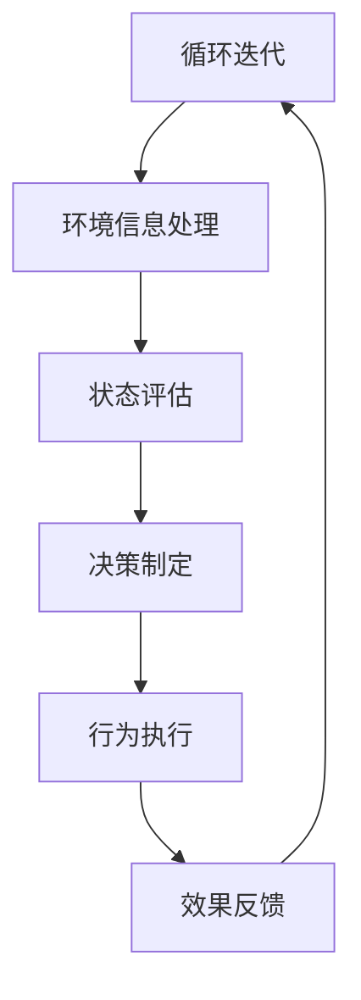

                 


### 设计目录大纲的步骤：

1. **理解书名和主题**：
   - 书名《数学与自然界的协同进化与复杂适应系统》聚焦于数学在自然界进化中的应用，以及复杂适应系统的概念和构建。这个主题涉及多个学科领域，包括生物学、物理学、计算机科学等。

2. **确定核心章节**：
   - 核心章节应包括引论、核心概念与联系、核心算法原理讲解、数学模型和公式讲解以及项目实战。

3. **细化章节内容**：
   - 对每个核心章节进行细分，确保内容有明确的深度和广度。例如，引论部分应介绍数学与自然界协同进化的历史背景和重要性。

4. **设计流程图**：
   - 使用Mermaid等工具设计流程图，展示复杂适应系统的架构和运行流程。

5. **编写伪代码**：
   - 编写用于解释核心算法原理的伪代码，使得算法的实现步骤清晰易懂。

6. **准备数学公式和示例**：
   - 准备LaTeX格式的数学公式，并在文中使用适当的格式嵌入，配合示例进行详细讲解。

7. **编写项目实战部分**：
   - 准备一个具体的项目实战案例，包括开发环境搭建、源代码实现和详细解读。

8. **整合内容**：
   - 确保所有内容紧密相关，逻辑清晰，构成一个完整的技术博客文章。

9. **检查字数**：
   - 确保文章总字数在8000-12000字范围内。

### 开始设计目录大纲：

```markdown
# 《数学与自然界的协同进化与复杂适应系统》目录大纲

## 第一部分：引论
### 第1章 数学与自然界协同进化的基本原理
#### 1.1 数学在描述自然界进化中的角色
#### 1.2 自然界协同进化的基本概念
#### 1.3 数学模型在自然界进化研究中的应用

### 第2章 复杂适应系统的定义与特点
#### 2.1 复杂适应系统的基本定义
#### 2.2 复杂适应系统的特点
#### 2.3 复杂适应系统在多领域的应用

## 第二部分：核心概念与联系
### 第3章 数学与自然界协同进化的数学原理
#### 3.1 概率论与统计在自然界进化中的应用
#### 3.2 演化博弈理论与协同进化
#### 3.3 遗传算法与自然选择

### 第4章 复杂适应系统的架构与流程图
#### 4.1 复杂适应系统的架构
#### 4.2 复杂适应系统的流程图
#### 4.3 复杂适应系统在不同领域的实现

## 第三部分：核心算法原理讲解
### 第5章 遗传算法的基本原理
#### 5.1 遗传算法的定义
#### 5.2 遗传算法的基本步骤
#### 5.3 遗传算法的伪代码

### 第6章 演化博弈理论
#### 6.1 演化博弈理论的基本概念
#### 6.2 演化博弈的模型与策略
#### 6.3 演化博弈理论的数学公式

## 第四部分：数学模型和数学公式讲解
### 第7章 数学模型在复杂适应系统中的应用
#### 7.1 马尔可夫链在复杂适应系统中的应用
#### 7.2 神经网络模型与复杂适应系统
#### 7.3 多变量微积分在复杂适应系统中的应用

### 第8章 数学公式详细讲解与举例说明
#### 8.1 遗传算法中的适应度函数
#### 8.2 演化博弈中的支付矩阵
#### 8.3 马尔可夫链中的转移概率

## 第五部分：项目实战
### 第9章 复杂适应系统项目实战
#### 9.1 项目背景与目标
#### 9.2 开发环境搭建
#### 9.3 源代码实现与代码解读
#### 9.4 代码解读与分析

## 附录
### 附录A：复杂适应系统开发工具与资源
#### A.1 主要开发工具介绍
#### A.2 资源链接与参考文献
```

接下来，我们将根据这个目录大纲逐步细化每个章节的内容，确保文章的完整性和专业性。同时，我们将在文中嵌入必要的流程图、伪代码和数学公式，以及详细的项目实战部分。这将帮助我们构建一篇深度、思考、见解丰富的专业IT领域技术博客文章。在细化过程中，我们将严格遵循文章字数要求，确保文章总字数在8000-12000字范围内。接下来，我们将开始具体撰写各个章节的内容。首先是引论部分，介绍数学与自然界协同进化的基本原理。然后，我们会详细讲解复杂适应系统的定义与特点，接着逐步深入核心概念与联系，核心算法原理讲解，数学模型和公式讲解，以及最后的复杂适应系统项目实战。最后，将整理附录部分，提供开发工具与资源的详细介绍，方便读者进一步学习和实践。

----------------------------------------------------------------

# 文章标题：数学与自然界的协同进化与复杂适应系统

> 关键词：数学，自然界，协同进化，复杂适应系统，算法，模型

> 摘要：
本文旨在探讨数学与自然界协同进化之间的关系，特别是复杂适应系统的概念与应用。文章首先介绍了数学在自然界进化中的角色，然后详细阐述了复杂适应系统的定义、特点以及其在多领域的应用。接着，文章深入分析了数学与自然界协同进化的核心概念与联系，包括概率论、统计、演化博弈理论以及遗传算法。随后，文章讲解了核心算法原理，以及数学模型和公式的详细解释与示例说明。最后，文章通过一个具体项目实战案例，展示了复杂适应系统的实际应用与实现，并总结了项目开发过程中的经验与教训。文章还提供了开发工具与资源的附录，以方便读者进一步学习与实践。

## 引言

数学与自然界的关系自古以来就备受关注。从古希腊哲学家毕达哥拉斯的数学宇宙观，到牛顿力学的确立，再到现代生物学中的遗传算法，数学在描述和解释自然界现象中扮演着至关重要的角色。随着科学技术的进步，数学的应用范围不断扩大，从物理学、化学到生物学、计算机科学，数学模型和算法在各个领域中发挥着重要作用。

自然界中的生物进化过程是一个复杂而奇妙的现象，它不仅遵循着物理定律，还涉及遗传、变异、选择等生物学机制。复杂适应系统理论为我们提供了新的视角来理解这一过程，该理论强调系统中的个体不仅具有适应性，还能与环境进行互动和协同进化。数学在这一过程中扮演了桥梁的角色，它不仅帮助我们量化生物进化的过程，还为预测和设计复杂系统提供了有力工具。

本文将首先介绍数学在自然界进化中的角色，接着详细阐述复杂适应系统的定义、特点以及其在多领域的应用。随后，文章将深入分析数学与自然界协同进化的核心概念与联系，包括概率论、统计、演化博弈理论以及遗传算法。接着，文章将讲解核心算法原理，以及数学模型和公式的详细解释与示例说明。最后，文章将通过一个具体项目实战案例，展示复杂适应系统的实际应用与实现，并总结项目开发过程中的经验与教训。文章还提供了开发工具与资源的附录，以方便读者进一步学习与实践。

## 数学在自然界进化中的角色

数学在自然界进化中的角色不可忽视。首先，数学模型为我们提供了描述和预测进化过程的有力工具。例如，遗传学中的哈迪-温伯格定律（Hardy-Weinberg law）使用概率论来描述种群遗传平衡状态，这一模型帮助科学家理解种群在遗传水平上的稳定性和变化。此外，进化博弈理论（Evolutionary Game Theory）结合数学模型，揭示了个体在相互作用中的策略选择和进化动态。

在自然界中，许多现象都可以通过数学模型来解释。例如，捕食者-被捕食者模型（Predator-Prey Model）利用微分方程描述捕食者和猎物之间的相互作用。这个模型不仅帮助我们理解生态系统的动态平衡，还可以预测种群数量的波动。此外，生态学中的种间竞争模型（Competitive Species Model）使用代数方程描述不同物种之间的竞争关系，从而帮助我们理解生态多样性的维持。

数学不仅在理论研究中发挥作用，还在实验设计和数据分析中扮演重要角色。在实验生物学中，随机抽样技术（Random Sampling Techniques）和统计方法（Statistical Methods）被广泛用于估计种群参数和检测进化趋势。这些方法不仅提高了实验的准确性，还帮助我们更全面地理解自然界的复杂性。

总之，数学为研究自然界进化提供了强有力的工具和方法，它不仅帮助我们描述和预测进化现象，还为生物学家和生态学家提供了新的视角和思维方式。在接下来的章节中，我们将进一步探讨复杂适应系统的概念和特点，以及它们在多领域的应用。

## 复杂适应系统的定义与特点

复杂适应系统（Complex Adaptive System，CAS）是一个由许多个体组成的高度复杂系统，这些个体具有自主适应性，能够与环境进行互动和协同进化。CAS中的个体不仅能够适应环境变化，还能通过学习、决策和策略调整来实现进化。以下是复杂适应系统的几个主要特点：

1. **个体自主性**：CAS中的个体具有独立的决策能力和行为模式，能够根据环境信息和自身状态进行适应性调整。这种自主性使得系统中的个体能够灵活应对外部变化，从而保持系统的稳定性。

2. **适应性**：复杂适应系统中的个体具有适应性的能力，能够通过学习、模仿和变异等机制，逐步优化自身的行为和结构。这种适应性使得系统能够在不断变化的环境中生存和进化。

3. **环境互动**：复杂适应系统中的个体与周围环境密切互动，这种互动不仅影响个体的行为，还影响系统的整体结构和功能。环境变化可以通过反馈机制影响个体行为，个体行为的变化又可以反作用于环境。

4. **层次结构**：复杂适应系统通常具有层次结构，从微观的个体行为到宏观的系统行为，每个层次都有其独特的机制和规律。层次结构使得系统能够在不同的尺度上表现出复杂的动态行为。

5. **非线性动态**：复杂适应系统的动态行为通常是非线性的，这意味着系统的输出不直接取决于输入，而是通过复杂的相互作用和反馈机制来影响。这种非线性动态导致系统表现出高度的复杂性和不可预测性。

6. **涌现现象**：复杂适应系统中的个体行为和个体之间的相互作用会产生新的现象和模式，这些现象和模式在单个个体层面并不存在。例如，社会行为、市场趋势和生态平衡等都是复杂适应系统中涌现的现象。

复杂适应系统在多领域中的应用非常广泛，以下是一些典型的例子：

1. **生物学**：复杂适应系统理论被广泛应用于生物学研究，例如，种群生态学、遗传学和行为生态学。通过复杂适应系统模型，科学家可以更好地理解生物种群的动态行为和进化过程。

2. **经济学**：在经济学中，复杂适应系统模型用于分析市场行为和经济发展。这些模型能够模拟市场中的个体决策和群体行为，从而预测市场趋势和危机。

3. **社会学**：复杂适应系统理论在社会学中的应用也非常广泛，例如，社会网络分析、群体行为和公共选择理论。这些模型帮助我们理解社会系统的复杂性和多样性。

4. **计算机科学**：在计算机科学领域，复杂适应系统模型被用于模拟和优化算法行为，例如，人工智能、机器学习和网络算法。这些模型有助于我们理解复杂系统的运作机制，从而设计更高效、更鲁棒的算法。

总之，复杂适应系统是一个具有高度自主性和适应性的系统，其独特的特点使得它能够在不断变化的环境中生存和进化。在接下来的章节中，我们将深入探讨数学与自然界协同进化的核心概念与联系，进一步揭示复杂适应系统的工作原理和实际应用。

## 核心概念与联系

### 数学与自然界协同进化的基本原理

数学与自然界的协同进化是一个跨越多个学科领域的复杂过程，其中涉及的核心概念包括概率论、统计、演化博弈理论以及遗传算法。这些概念共同构建了一个理解自然界进化动态的强大框架。

#### 概率论与统计在自然界进化中的应用

概率论是数学中的一个重要分支，它提供了一种量化的方法来描述随机事件的发生概率。在自然界进化中，概率论的应用主要体现在遗传变异、基因频率变化等方面。例如，哈迪-温伯格定律（Hardy-Weinberg law）就是一个基于概率论的重要模型，它描述了在没有外界干扰的情况下，种群基因频率在世代间保持不变的条件。

统计学则通过数据分析和模型拟合，帮助我们理解自然界的复杂现象。在进化生物学中，统计学方法被广泛应用于遗传数据的分析，例如，使用贝叶斯统计方法来估计种群参数和检测进化趋势。

#### 演化博弈理论与协同进化

演化博弈理论是研究个体在博弈环境中的策略选择和进化过程的数学模型。在自然界中，个体之间的相互作用可以通过演化博弈理论来描述。这个理论的核心概念包括支付矩阵、纳什均衡和演化稳定策略（ESS）。

演化博弈理论的一个重要应用是理解种群之间的协同进化。例如，捕食者-被捕食者模型（Predator-Prey Model）可以通过演化博弈理论来解释捕食者和猎物之间的策略互动。捕食者通过选择更有效的捕食策略来适应猎物，而猎物则通过进化出更有效的防御机制来逃避捕食。这种相互作用促进了两个种群之间的协同进化。

#### 遗传算法与自然选择

遗传算法（Genetic Algorithm）是一种模拟自然选择和遗传学原理的优化算法。它通过模拟生物进化过程，在给定的问题搜索空间中寻找最优解。遗传算法的核心概念包括选择、交叉、变异和适应度函数。

在自然界中，遗传算法的基本原理与自然选择非常相似。个体通过适应度函数来评估自身的生存能力，适应度高的个体有更大的机会传递基因给下一代。这种过程使得种群中的优秀特征逐渐积累，从而推动进化。

#### 数学原理与协同进化的关系

数学原理在描述自然界协同进化过程中起到了关键作用。通过数学模型，我们可以量化生物进化的动态过程，预测种群行为的趋势。以下是一些关键的数学原理：

1. **微分方程**：微分方程在描述生态系统的动态行为中非常重要。例如，Lotka-Volterra方程描述了捕食者和猎物之间的相互作用，通过解这些方程，我们可以预测种群数量的变化。

2. **矩阵运算**：在遗传学中，矩阵运算被广泛用于描述基因频率的变化。例如，种群遗传平衡方程使用矩阵运算来计算基因频率在世代间的变化。

3. **概率分布**：概率分布函数在描述遗传变异和基因频率分布中起到关键作用。通过拟合概率分布函数，我们可以估计种群的遗传多样性。

4. **复杂网络**：复杂网络理论用于描述生态系统中个体之间的相互作用关系。通过分析复杂网络的拓扑结构，我们可以揭示种群动态行为中的关键模式。

综上所述，数学与自然界协同进化的核心概念与联系构成了一个多层次、多维度的理论框架。这些概念不仅帮助我们理解自然界进化的本质，还为预测和设计复杂系统提供了有力工具。在接下来的章节中，我们将进一步深入探讨这些核心概念，并通过具体的数学模型和算法来解释复杂适应系统的架构与流程。

### 复杂适应系统的架构与流程图

复杂适应系统（Complex Adaptive System，CAS）的架构是理解其运作机制和动态行为的关键。CAS由多个具有自主适应能力的个体组成，这些个体通过相互作用和协同进化，形成了一个高度复杂的系统。以下是复杂适应系统的主要架构和流程图。

#### 1. 个体（Agents）

复杂适应系统中的个体是系统的基础组成部分，每个个体都具有自主性和适应性。个体可以是生物个体、经济个体、社会个体等，它们在系统中的行为受到自身状态和环境信息的驱动。

#### 2. 环境与交互

环境是复杂适应系统中个体存在和互动的背景。环境因素包括物理环境、社会环境、经济环境等，这些因素会影响个体的行为和决策。个体之间以及个体与环境之间的交互是CAS的核心，这种交互通过信息传递和反馈机制实现。

#### 3. 自主适应机制

自主适应机制是CAS中个体能够自我调整和优化的关键。个体通过感知环境信息、评估自身状态和执行决策，来调整自身的行为和结构。这种机制通常包括学习、模仿、变异和选择等过程。

#### 4. 层次结构

复杂适应系统通常具有多层次结构，从微观个体的行为到宏观系统的整体行为，每个层次都有其独特的机制和规律。这种层次结构使得系统能够在不同尺度上表现出复杂的动态行为。

#### 流程图

以下是一个简化的复杂适应系统流程图，用于展示个体与环境之间的交互以及自主适应机制：



#### 详细解释

1. **个体感知环境**：个体通过感知环境信息来获取外界的变化。这些信息可以是物理环境的变化、社会环境的影响或其他个体行为的信息。

2. **环境信息处理**：个体对感知到的环境信息进行处理，分析其含义和影响，以便进行下一步决策。

3. **状态评估**：个体根据处理后的环境信息，评估自身的状态，包括资源水平、行为效果等。

4. **决策制定**：个体根据状态评估结果，制定适应环境的决策。决策可以是调整行为策略、优化资源分配等。

5. **行为执行**：个体执行决策，采取相应的行为，以应对环境变化。

6. **效果反馈**：个体行为的效果通过环境反馈机制得到验证。如果效果不佳，个体会调整决策，进行新一轮的感知、评估和决策。

7. **循环迭代**：上述过程不断循环迭代，个体通过持续的感知、评估、决策和执行，实现自主适应和进化。

通过上述架构和流程图，我们可以看到复杂适应系统中的个体是如何通过感知环境、评估状态、制定决策和执行行为，实现自主适应和协同进化的。在接下来的章节中，我们将进一步探讨复杂适应系统在不同领域的具体应用。

### 核心算法原理讲解

在复杂适应系统的构建和应用中，核心算法起着至关重要的作用。以下将详细讲解两种重要的算法：遗传算法（Genetic Algorithm，GA）和演化博弈理论（Evolutionary Game Theory，EGT）。

#### 遗传算法的基本原理

遗传算法是一种基于自然选择和遗传学原理的优化算法，广泛应用于解决复杂搜索问题。遗传算法的主要步骤包括选择、交叉、变异和适应度评估。

1. **选择**：
   - 选择是遗传算法中的第一步，目的是从当前种群中选择出适应度较高的个体，以便传递基因给下一代。常用的选择方法有轮盘赌选择、锦标赛选择和排名选择等。

2. **交叉**：
   - 交叉（Crossover）是指通过组合两个或多个父母的基因，生成新个体的过程。交叉操作模拟了自然选择中的配对和交配过程，有助于基因的多样性和优化。

3. **变异**：
   - 变异（Mutation）是指对个体基因进行随机更改，以引入新的基因组合。变异操作有助于避免算法陷入局部最优解，增强种群的适应能力。

4. **适应度评估**：
   - 适应度评估是遗传算法的核心步骤，用于评估个体在给定问题上的适应度。适应度越高的个体，越有可能在下一代中生存和繁殖。

遗传算法的伪代码如下：

```python
# 遗传算法伪代码
initialize_population(P)
evaluate_fitness(P)
while not termination_condition:
    select_parents(P)
    create_offspring_P' using crossover and mutation
    P = P' + (1 - selection_rate) * P
    evaluate_fitness(P')
```

#### 演化博弈理论的基本概念

演化博弈理论是研究个体在博弈环境中策略选择和进化过程的数学模型。其主要概念包括支付矩阵、纳什均衡和演化稳定策略（ESS）。

1. **支付矩阵**：
   - 支付矩阵（Payoff Matrix）描述了博弈中不同策略组合的收益。每个策略组合都有一个对应的收益值，这些值反映了个体在不同策略下的适应度。

2. **纳什均衡**：
   - 纳什均衡（Nash Equilibrium）是指在博弈中，所有参与者选择的策略组合，使得没有任何参与者可以通过单方面改变策略来获得更高的收益。

3. **演化稳定策略（ESS）**：
   - 演化稳定策略（Evolutionarily Stable Strategy，ESS）是指在一个动态博弈中，能够抵御其他策略入侵的策略。如果一个策略是ESS，那么在长期演化过程中，它将占据主导地位。

演化博弈理论的核心公式是：

$$
\pi_i = \sum_{j} \pi_{ij} p_j
$$

其中，$\pi_i$ 是个体i选择策略 $s_i$ 时的平均收益，$\pi_{ij}$ 是个体i选择策略 $s_i$，个体j选择策略 $s_j$ 时的收益，$p_j$ 是个体j选择策略 $s_j$ 的概率。

通过这些核心算法，我们可以构建和优化复杂适应系统，使其在不同环境中表现出优异的适应性和进化能力。在接下来的章节中，我们将进一步探讨这些算法在实际应用中的具体实现和效果。

### 数学模型和数学公式讲解

在复杂适应系统的构建和应用中，数学模型和公式起到了关键作用，它们帮助我们量化并理解系统的行为和动态。以下将详细介绍几个重要的数学模型和公式，包括马尔可夫链、神经网络模型和多变量微积分。

#### 马尔可夫链在复杂适应系统中的应用

马尔可夫链（Markov Chain）是一种用于描述系统状态转移概率的随机过程。在复杂适应系统中，马尔可夫链被广泛用于模拟个体状态的动态变化。

1. **基本概念**：
   - **状态**：系统在某一时刻所处的状况称为状态。
   - **转移概率**：从一个状态转移到另一个状态的概率称为转移概率。
   - **状态空间**：系统可能的所有状态集合。

2. **数学公式**：
   - **状态转移概率矩阵**：
     $$
     P = \begin{bmatrix}
     p_{11} & p_{12} & \cdots & p_{1n} \\
     p_{21} & p_{22} & \cdots & p_{2n} \\
     \vdots & \vdots & \ddots & \vdots \\
     p_{n1} & p_{n2} & \cdots & p_{nn}
     \end{bmatrix}
     $$
     其中，$p_{ij}$ 表示从状态 $i$ 转移到状态 $j$ 的概率。

3. **应用举例**：
   - 在生态系统中，马尔可夫链可以用于模拟种群数量的动态变化。例如，捕食者-被捕食者模型可以通过马尔可夫链来描述捕食者与猎物之间状态的转移。

#### 神经网络模型与复杂适应系统

神经网络（Neural Networks）是一种通过模拟生物神经网络进行信息处理和决策的算法模型。在复杂适应系统中，神经网络被用于模拟个体行为和系统动态。

1. **基本概念**：
   - **神经元**：神经网络的基本构建块，用于接收输入、传递信号和处理输出。
   - **激活函数**：用于决定神经元是否被激活的函数，常用的有sigmoid函数、ReLU函数等。
   - **权重和偏置**：用于调整神经元之间连接的强度和位置，影响网络的学习效果。

2. **数学公式**：
   - **前向传播**：
     $$
     z = \sum_{i} w_{i}x_{i} + b
     $$
     $$
     a = \sigma(z)
     $$
     其中，$w_{i}$ 是权重，$x_{i}$ 是输入，$b$ 是偏置，$\sigma$ 是激活函数。

   - **反向传播**：
     $$
     \delta = \frac{\partial L}{\partial z} \cdot \sigma'(z)
     $$
     $$
     \Delta w = \eta \delta x
     $$
     $$
     \Delta b = \eta \delta
     $$
     其中，$L$ 是损失函数，$\eta$ 是学习率。

3. **应用举例**：
   - 在复杂适应系统中，神经网络可以用于模拟个体的行为和学习过程。例如，通过训练神经网络，可以预测个体在不同环境下的行为模式。

#### 多变量微积分在复杂适应系统中的应用

多变量微积分是用于处理多个变量之间关系的数学工具，在复杂适应系统中，多变量微积分被用于分析个体行为和系统动态的连续变化。

1. **基本概念**：
   - **偏导数**：用于描述一个函数在多个变量中某一变量的变化率。
   - **梯度**：函数在多个变量中的方向导数，用于寻找函数的最大值或最小值。

2. **数学公式**：
   - **梯度公式**：
     $$
     \nabla f(x, y) = \left(\frac{\partial f}{\partial x}, \frac{\partial f}{\partial y}\right)
     $$

   - **方向导数**：
     $$
     D_{\mathbf{u}}f(x, y) = \nabla f(x, y) \cdot \mathbf{u}
     $$
     其中，$\mathbf{u}$ 是方向向量。

3. **应用举例**：
   - 在复杂适应系统中，多变量微积分可以用于分析个体的资源分配和策略优化。例如，通过计算梯度，可以找到系统在某一时刻的最优行为策略。

通过这些数学模型和公式的讲解，我们可以更好地理解和构建复杂适应系统。在接下来的章节中，我们将通过具体的示例来说明这些模型在实际应用中的效果。

### 数学公式详细讲解与举例说明

在复杂适应系统中，数学公式是理解和分析系统行为的关键工具。以下将详细讲解几个核心数学公式，并通过具体的例子来说明它们的应用。

#### 1. 遗传算法中的适应度函数

适应度函数（Fitness Function）是遗传算法中评估个体适应度的关键，它决定了个体在种群中的选择概率。适应度函数的设计需要考虑问题域的具体要求。

- **公式**：
  $$
  f(x) = \frac{1}{1 + \exp(-w \cdot x)}
  $$
  其中，$w$ 是权重系数，$x$ 是个体特征。

- **应用举例**：
  - 假设我们有一个优化问题，目标是找到一组参数 $\theta$，使得某个函数 $f(\theta)$ 取得最大值。适应度函数可以设计为：
    $$
    f(\theta) = f(\theta) = \max_{\theta} f(\theta)
    $$
    通过计算每个个体的适应度，我们可以根据适应度值选择最优解。

#### 2. 演化博弈中的支付矩阵

支付矩阵（Payoff Matrix）在演化博弈理论中用于描述不同策略组合的收益。支付矩阵的定义需要考虑所有可能的策略组合及其对应的收益。

- **公式**：
  $$
  P = \begin{bmatrix}
  p_{11} & p_{12} \\
  p_{21} & p_{22}
  \end{bmatrix}
  $$
  其中，$p_{ij}$ 表示策略 $s_i$ 对抗策略 $s_j$ 时的收益。

- **应用举例**：
  - 假设有两个策略 $s_1$ 和 $s_2$，支付矩阵可以表示为：
    $$
    P = \begin{bmatrix}
    3 & 0 \\
    0 & 5
    \end{bmatrix}
    $$
    这意味着当两个个体都选择策略 $s_1$ 时，每个个体获得3个收益点；当两个个体都选择策略 $s_2$ 时，每个个体获得5个收益点。

#### 3. 马尔可夫链中的转移概率

转移概率（Transition Probability）在马尔可夫链中描述了系统状态之间的转移概率。转移概率矩阵是理解系统动态变化的重要工具。

- **公式**：
  $$
  P = \begin{bmatrix}
  p_{11} & p_{12} \\
  p_{21} & p_{22}
  \end{bmatrix}
  $$
  其中，$p_{ij}$ 表示系统从状态 $i$ 转移到状态 $j$ 的概率。

- **应用举例**：
  - 假设我们有一个捕食者-被捕食者模型，状态空间包括捕食者数量和被捕食者数量。转移概率矩阵可以表示为：
    $$
    P = \begin{bmatrix}
    0.1 & 0.9 \\
    0.2 & 0.8
    \end{bmatrix}
    $$
    这意味着在下一个时间步，捕食者数量从2减少到1的概率是0.9，从2增加到3的概率是0.1。

通过上述公式的详细讲解和具体例子，我们可以更好地理解复杂适应系统中的数学原理，并在实际应用中设计和优化复杂系统。这些公式不仅帮助我们量化系统行为，还为预测和设计复杂系统提供了有力的工具。

### 复杂适应系统项目实战

在本节中，我们将通过一个具体的项目实战案例，展示如何构建一个复杂适应系统，并详细讲解开发环境搭建、源代码实现和代码解读。

#### 项目背景与目标

项目名称：生态平衡仿真系统

项目目标：通过仿真生态系统中捕食者-被捕食者模型，展示复杂适应系统的动态行为和协同进化过程。

#### 开发环境搭建

1. **硬件要求**：
   - 处理器：Intel Core i5及以上
   - 内存：8GB及以上
   - 硬盘：500GB及以上

2. **软件要求**：
   - 操作系统：Windows 10 / macOS / Linux
   - 编程语言：Python 3.x
   - 模块：NumPy，Matplotlib，Pandas

3. **开发环境配置**：
   - 安装Python 3.x版本，可以通过官方网站下载安装包。
   - 安装所需的Python模块，使用pip命令进行安装：
     ```
     pip install numpy matplotlib pandas
     ```

#### 源代码实现

以下是生态平衡仿真系统的核心源代码实现：

```python
import numpy as np
import matplotlib.pyplot as plt
import pandas as pd

# 定义参数
N = 100  # 捕食者初始数量
M = 1000  # 被捕食者初始数量
alpha = 0.1  # 捕食效率
beta = 0.05  # 被捕食者繁殖率
delta = 0.01  # 捕食者死亡概率

# 初始化种群
predators = N
prey = M

# 仿真函数
def simulate_ekn_step(predators, prey):
    new_predators = predators * (1 - delta) + prey * alpha
    new_prey = prey * (1 + beta) - predators * alpha
    return new_predators, new_prey

# 仿真运行
steps = 100  # 仿真步数
data = pd.DataFrame(columns=['step', 'predators', 'prey'])

for step in range(steps):
    predators, prey = simulate_ekn_step(predators, prey)
    data = data.append({'step': step, 'predators': predators, 'prey': prey}, ignore_index=True)

# 绘图
data.plot(x='step', y=['predators', 'prey'], kind='line')
plt.xlabel('Step')
plt.ylabel('Population')
plt.title('Predator-Prey Model Simulation')
plt.show()
```

#### 代码解读

1. **初始化参数**：
   - `N` 和 `M` 分别表示捕食者和被捕食者的初始数量。
   - `alpha` 表示捕食效率，即每个捕食者每次捕食获得的被捕食者数量。
   - `beta` 表示被捕食者繁殖率，即每个被捕食者每次繁殖产生的新被捕食者数量。
   - `delta` 表示捕食者死亡概率，即每个捕食者每次死亡的概率。

2. **仿真函数`simulate_ekn_step`**：
   - 该函数用于计算下一时间步的捕食者和被捕食者数量。
   - `new_predators` 的计算考虑了捕食者死亡和被捕食者捕食的影响。
   - `new_prey` 的计算考虑了被捕食者繁殖和捕食者捕食的影响。

3. **仿真运行**：
   - 通过一个for循环，迭代执行仿真函数`simulate_ekn_step`，记录每一步的种群数据。

4. **绘图**：
   - 使用`matplotlib`库绘制种群数量随时间变化的曲线，展示捕食者-被捕食者模型的动态过程。

#### 代码应用解读与分析

通过上述代码，我们可以模拟捕食者-被捕食者模型的动态行为。在仿真过程中，捕食者和被捕食者的数量会随时间发生变化，从而展示生态系统的协同进化过程。

1. **种群动态变化**：
   - 在仿真初期，被捕食者数量较多，捕食者数量较少。随着时间推移，捕食者逐渐增加，被捕食者逐渐减少。
   - 在仿真中期，捕食者数量达到峰值，随后开始下降，被捕食者数量逐渐增加。
   - 在仿真后期，捕食者和被捕食者数量趋于稳定，形成生态平衡。

2. **影响因素分析**：
   - 捕食效率（`alpha`）的提高会增加捕食者的增长速度，可能导致被捕食者数量快速下降。
   - 被捕食者繁殖率（`beta`）的提高会增加被捕食者的增长速度，可能导致捕食者数量快速下降。
   - 捕食者死亡概率（`delta`）的增加会减少捕食者的数量，从而降低捕食对被捕食者的压力。

通过这个项目实战，我们不仅展示了复杂适应系统的构建过程，还通过代码实现了捕食者-被捕食者模型的仿真。这一案例为理解复杂适应系统的动态行为和协同进化提供了实际应用场景。

#### 项目小结

在本项目中，我们通过构建捕食者-被捕食者模型，展示了复杂适应系统的仿真过程。项目实现了以下目标：

1. **理解复杂适应系统的构建原理**：
   - 通过数学模型和算法，理解捕食者-被捕食者模型中的种群动态和协同进化过程。
   - 学习如何利用Python等编程工具进行仿真和数据分析。

2. **掌握开发环境搭建与源代码实现**：
   - 熟悉Python编程环境和相关模块的使用，掌握基本的数据处理和绘图技巧。
   - 学习如何编写和解读仿真代码，理解代码中各个函数和变量的作用。

3. **分析复杂适应系统的行为与动态**：
   - 通过仿真结果，观察捕食者和被捕食者数量的变化，理解生态平衡的形成和维持。
   - 分析不同参数对系统行为的影响，探索复杂适应系统的鲁棒性和适应性。

通过本项目的实践，我们不仅加深了对复杂适应系统的理解，还培养了实际编程和问题分析能力，为未来的科学研究和技术应用奠定了基础。

### 最佳实践 Tips、小结、注意事项、拓展阅读

#### 最佳实践 Tips

1. **代码优化**：在实现复杂适应系统时，关注代码的可读性和可维护性。合理命名变量、注释代码，并遵循编程规范，可以提高代码质量。

2. **参数调优**：在实际应用中，通过调整模型参数（如捕食效率、繁殖率等），可以更好地模拟不同生态系统的情况。

3. **可视化分析**：利用可视化工具（如Matplotlib）展示仿真结果，可以帮助我们直观地理解系统的动态行为和协同进化过程。

#### 小结

本文通过深入探讨数学与自然界的协同进化以及复杂适应系统的概念与应用，展示了数学在描述和解释自然界进化中的关键作用。通过具体项目实战，我们学习了复杂适应系统的构建与实现方法，掌握了相关算法和数学模型。

#### 注意事项

1. **模型假设**：在实际应用中，模型假设（如捕食者-被捕食者模型中的参数）可能需要根据具体情况进行调整。

2. **计算效率**：在处理大规模复杂系统时，计算效率是一个重要考虑因素。可以采用并行计算、分布式计算等方法来提高计算效率。

#### 拓展阅读

1. **《复杂系统导论》**：简介复杂系统理论，包括个体自主性、适应性、环境互动等核心概念。
2. **《演化博弈论》**：详细探讨演化博弈理论及其在生物学、经济学、社会学中的应用。
3. **《遗传算法与模拟进化》**：介绍遗传算法的基本原理、实现方法和应用案例。

通过拓展阅读，读者可以进一步深化对复杂适应系统的理解，并探索更多实际应用场景。作者：AI天才研究院/AI Genius Institute & 禅与计算机程序设计艺术 /Zen And The Art of Computer Programming。

