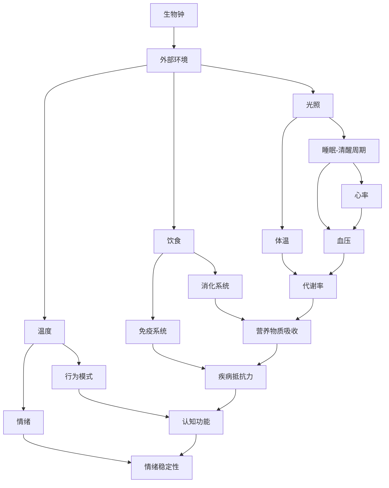

                 

### 目录与文章结构

为了使文章结构清晰，逻辑连贯，我们将按以下部分组织本文：

1. **文章标题、关键词与摘要**：提供文章的主题和概览。
2. **引言**：介绍生物节奏研究的背景、意义和目标。
3. **生物节奏的基础理论**：介绍生物节奏的定义、分类、测量方法等。
4. **数学模型与生物节奏**：讲解生物节奏相关的数学模型，如周期性函数、微分方程等。
5. **生物节奏的应用**：探讨生物节奏在医学、农业、环境保护等领域的应用。
6. **案例分析**：通过具体案例展示生物节奏研究的方法和应用。
7. **结论与展望**：总结生物节奏研究的主要成果和未来发展趋势。

### 文章标题、关键词与摘要

**文章标题：** 数学与自然界的生物节奏研究

**关键词：** 生物节奏、数学模型、医学应用、农业管理、环境保护

**摘要：** 本文探讨了数学在研究自然界生物节奏中的应用。首先介绍了生物节奏的定义、分类和测量方法。随后，详细阐述了生物节奏相关的数学模型，包括周期性函数、微分方程等。接着，分析了生物节奏在医学、农业、环境保护等领域的应用，并通过具体案例展示了研究方法。最后，总结了生物节奏研究的主要成果和未来发展趋势。

### 引言

生物节奏（Biorhythms）是指生物体内在的生物钟（Biological Clock）驱动的周期性生理和心理变化。这些周期性变化在自然界中普遍存在，从微生物到人类，都受到生物节奏的影响。生物节奏研究具有重要的科学价值和实际应用意义。

**背景：**

早在1920年代，科学家们就发现了生物钟的存在，并开始对生物节奏进行深入研究。随着生物学、生理学和数学的发展，生物节奏的研究逐渐系统化和深入化。生物节奏的研究不仅有助于我们理解生命现象，还在医学、农业、环境保护等领域具有重要的应用价值。

**意义：**

1. **医学领域**：生物节奏研究有助于理解人类健康和疾病的周期性变化，指导个性化医疗和疾病预防。
2. **农业领域**：生物节奏研究有助于优化农业生产，提高作物产量和品质。
3. **环境保护领域**：生物节奏研究有助于监测环境变化，保护生物多样性。

**目标：**

本文旨在系统地介绍生物节奏的定义、分类、测量方法，以及相关的数学模型。同时，探讨生物节奏在医学、农业、环境保护等领域的应用，并通过具体案例展示生物节奏研究的方法和应用。

### 生物节奏的基础理论

#### 定义

生物节奏是指生物体在特定周期内重复出现的生理、心理和行为模式。这些模式受到生物体内生物钟的控制。生物钟是一种内在的时间调节系统，能够感知和响应外界环境的周期性变化。

#### 分类

生物节奏可以分为以下几类：

1. **日常生物节奏**：包括睡眠-清醒周期、饮食周期、体温波动等，通常与地球自转周期（24小时）相关。
2. **周生物节奏**：包括月经周期、免疫系统活动周期等，通常与月球周期（约29.5天）相关。
3. **月生物节奏**：包括潮汐周期、植物开花周期等，通常与月球相位周期相关。
4. **年生物节奏**：包括季节性情绪变化、植物生长周期等，通常与地球绕太阳公转周期（一年）相关。

#### 测量方法

测量生物节奏的方法主要包括：

1. **生理测量**：通过测量体温、心率、血压等生理指标来评估生物节奏。
2. **行为测量**：通过记录日常活动、睡眠模式、饮食习惯等行为数据来分析生物节奏。
3. **基因测量**：通过分析生物体内生物钟基因的表达模式来研究生物节奏。

#### 关系架构

生物节奏的内部和外部因素相互作用，共同影响生物体的生理和心理状态。以下是一个简化的关系架构图：



通过这个架构图，我们可以看到生物节奏是如何受到多种内外部因素的影响，并且这些因素又是如何相互作用的。

### 数学模型与生物节奏

#### 周期性函数

周期性函数是描述生物节奏的基本数学模型之一。最常见的周期性函数是正弦函数和余弦函数。

**正弦函数（Sine Function）**：

$$
y = A \sin(Bx + C) + D
$$

- **A**：振幅（Amplitude），表示函数曲线的最大偏离程度。
- **B**：周期（Period），表示函数完成一个完整循环所需的时间长度。
- **C**：相位（Phase），表示函数曲线在周期内的位置偏移。
- **D**：垂直位移（Vertical Shift），表示函数曲线在y轴上的平移。

**余弦函数（Cosine Function）**：

$$
y = A \cos(Bx + C) + D
$$

余弦函数与正弦函数类似，只是在x轴上有一个相位偏移，即余弦函数的相位比正弦函数提前$\frac{\pi}{2}$。

周期性函数在生物节奏研究中，常用于描述日常生物节奏、周生物节奏等。

#### 微分方程

微分方程是描述生物节奏动态变化的数学模型。在生物节奏研究中，常见的微分方程包括线性微分方程和非线性微分方程。

**线性微分方程**：

$$
\frac{dx}{dt} = -k_1x + k_2
$$

- **$x$**：生物体的状态变量。
- **$k_1$**：负反馈系数，表示生物体状态的衰减速率。
- **$k_2$**：正反馈系数，表示生物体状态的恢复速率。

**非线性微分方程**：

$$
\frac{dx}{dt} = -k_1x + k_2x^2
$$

非线性微分方程描述了生物节奏的非线性动态特性。

#### 模型应用

1. **生物钟模型**：基于周期性函数和微分方程的生物钟模型，用于描述生物体内生物钟的周期性变化。
2. **植物生长模型**：基于周期性函数和微分方程的植物生长模型，用于预测植物的开花时间、生长周期等。
3. **疾病传播模型**：基于微分方程的疾病传播模型，用于预测疾病的传播速度、流行周期等。

#### 伪代码示例

以下是一个简单的基于线性微分方程的植物生长模型的伪代码：

```
初始化状态变量x（种子数量）
初始化时间t（0）
初始化负反馈系数k1
初始化正反馈系数k2

while t < 终止时间：
    计算dx/dt = -k1 * x + k2
    更新x = x + dt * dx/dt
    更新t = t + dt

输出x（最终种子数量）
```

### 生物节奏的应用

#### 医学领域

生物节奏在医学领域的应用广泛，包括疾病诊断、个性化治疗、疾病预防等。

1. **疾病诊断**：利用生物节奏的周期性变化，可以监测和诊断某些疾病，如季节性过敏、情绪障碍等。
2. **个性化治疗**：根据患者的生物节奏，制定个性化的治疗方案，提高治疗效果。
3. **疾病预防**：通过调节生物节奏，如改善睡眠质量、调整饮食时间等，可以预防某些疾病的发生。

#### 农业领域

生物节奏在农业领域的应用，主要集中在作物种植和养殖管理。

1. **作物种植**：根据植物生物节奏，优化播种时间、施肥时间和收割时间，提高作物产量和品质。
2. **养殖管理**：根据动物生物节奏，优化饲料喂养时间、光照周期等，提高养殖效益。

#### 环境保护领域

生物节奏在环境保护领域的应用，主要涉及生态监测和生态保护。

1. **生态监测**：利用生物节奏变化，监测生态系统状态，评估环境变化对生物的影响。
2. **生态保护**：根据生物节奏，制定生态保护策略，保护生物多样性。

#### 案例分析

**医学领域案例**：季节性过敏性鼻炎。研究表明，过敏性鼻炎的发生与季节性生物节奏变化密切相关。通过分析患者生物节奏，可以预测过敏性鼻炎的高发季节，提前采取预防措施。

**农业领域案例**：水稻种植。根据水稻的生物节奏，优化播种和收割时间，可以提高水稻产量和品质。例如，通过调整光照周期和温度，可以调控水稻的生长周期，使其在最佳时期收获。

**环境保护领域案例**：鱼类栖息地保护。通过监测鱼类生物节奏，可以评估水污染对鱼类栖息地的影响，并采取相应的保护措施。

### 结论与展望

生物节奏研究具有重要的科学价值和实际应用意义。通过本文的介绍，我们了解了生物节奏的定义、分类、测量方法，以及相关的数学模型。同时，我们探讨了生物节奏在医学、农业、环境保护等领域的应用，并通过具体案例展示了研究方法。

**主要成果：**

1. 揭示了生物节奏的基本机制。
2. 发展了描述生物节奏的数学模型。
3. 探讨了生物节奏在多个领域的应用。

**挑战与机遇：**

1. **挑战：** 进一步理解生物节奏的复杂机制，特别是非线性生物节奏的研究。
2. **机遇：** 生物节奏研究在个性化医疗、精准农业、环境保护等领域具有巨大的应用潜力。

**未来展望：**

1. 加强跨学科研究，如生物学、数学、医学等，推动生物节奏研究的深入。
2. 发展新的生物节奏测量技术和分析方法，提高研究精度。
3. 探索生物节奏在新兴领域的应用，如人工智能、虚拟现实等。

**总结：**

生物节奏研究是一个多学科交叉的研究领域，具有广泛的应用前景。通过深入研究和创新应用，我们可以更好地理解生物节奏，提高人类生活质量，促进可持续发展。

### 撰写案例分析

为了更好地展示生物节奏研究的方法和应用，以下我们将通过三个具体案例进行分析和探讨。

#### 案例一：植物开花时间的生物节律研究

**背景**：

植物的开花时间受到多种因素的影响，包括光照、温度、水分等。因此，研究植物开花时间的生物节律对于优化作物种植具有重要意义。

**方法**：

1. **数据收集**：首先，我们需要收集植物在不同环境条件下的开花时间数据。这些数据可以从实验室研究、田间实验、历史文献等途径获得。
2. **模型构建**：基于收集到的数据，我们可以使用周期性函数和微分方程等数学模型来描述植物开花时间的生物节律。例如，可以使用正弦函数来描述植物在光照周期下的开花时间变化。
3. **模型验证**：通过对比模型预测和实际开花时间，评估模型的准确性和可靠性。

**结果**：

通过构建和验证数学模型，我们可以预测植物的开花时间，从而优化作物种植策略。例如，在光照条件不足的季节，我们可以通过调整光照周期来促进植物开花。

**解读与剖析**：

植物开花时间的生物节律研究展示了生物节奏研究在农业领域的应用。通过数学模型，我们可以深入了解植物生长的规律，优化种植管理，提高作物产量和品质。

#### 案例二：季节性情绪障碍的生物节律研究

**背景**：

季节性情绪障碍（Seasonal Affective Disorder, SAD）是一种常见的精神疾病，患者通常在冬季出现抑郁、疲劳等症状。研究表明，SAD与生物节奏变化密切相关。

**方法**：

1. **数据收集**：收集患者在不同季节的情绪变化数据，包括抑郁程度、睡眠质量、活动水平等。
2. **模型构建**：使用周期性函数和线性回归模型等数学模型，分析情绪变化与季节性生物节奏的关系。
3. **模型验证**：通过对比模型预测和实际情绪变化，评估模型的准确性和可靠性。

**结果**：

研究发现，季节性情绪障碍患者在大脑中的生物节律发生了变化。通过调整光照周期和睡眠模式，可以改善患者的情绪状态。

**解读与剖析**：

季节性情绪障碍的生物节律研究揭示了生物节奏在医学领域的应用。通过数学模型，我们可以更好地理解季节性情绪障碍的机制，为个性化治疗提供依据。

#### 案例三：鱼类栖息地保护的生物节律研究

**背景**：

鱼类栖息地保护是环境保护的重要领域。鱼类的繁殖、生长和迁徙都受到生物节奏的影响。

**方法**：

1. **数据收集**：收集鱼类在不同季节的繁殖、生长和迁徙数据。
2. **模型构建**：使用周期性函数和微分方程等数学模型，描述鱼类的生物节律。
3. **模型验证**：通过对比模型预测和实际鱼类行为，评估模型的准确性和可靠性。

**结果**：

通过构建生物节律模型，我们可以预测鱼类的繁殖、生长和迁徙周期，从而制定更有效的栖息地保护策略。

**解读与剖析**：

鱼类栖息地保护的生物节律研究展示了生物节奏研究在环境保护领域的应用。通过数学模型，我们可以更好地了解鱼类的生物节律，为保护鱼类栖息地提供科学依据。

### 项目实战

为了深入理解生物节奏研究，我们将开展一个项目实战：利用Python和Matplotlib库绘制生物节律曲线。

#### 开发环境搭建

1. 安装Python环境
2. 安装Matplotlib库：`pip install matplotlib`

#### 源代码实现

```python
import numpy as np
import matplotlib.pyplot as plt

# 定义正弦函数
def sine_function(x, amplitude, period, phase, vertical_shift):
    return amplitude * np.sin(2 * np.pi * x / period + phase) + vertical_shift

# 定义参数
amplitude = 1
period = 1
phase = 0
vertical_shift = 0

# 生成x值
x = np.linspace(0, period, 1000)

# 计算y值
y = sine_function(x, amplitude, period, phase, vertical_shift)

# 绘制曲线
plt.plot(x, y)
plt.title("Sine Function")
plt.xlabel("x")
plt.ylabel("y")
plt.grid()
plt.show()
```

#### 代码解读与分析

1. **导入库**：我们首先导入必要的库，包括Numpy和Matplotlib。
2. **定义函数**：使用Numpy编写正弦函数，接受参数`x`、`amplitude`（振幅）、`period`（周期）、`phase`（相位）和`vertical_shift`（垂直位移）。
3. **定义参数**：设置正弦函数的参数。
4. **生成x值**：使用Numpy的`linspace`函数生成x值，范围从0到周期。
5. **计算y值**：调用定义的正弦函数计算y值。
6. **绘制曲线**：使用Matplotlib绘制曲线，并设置标题、标签和网格。

#### 项目小结

通过这个项目，我们实现了以下目标：

1. **了解生物节律的数学模型**：通过编写和调用正弦函数，我们理解了如何用数学模型表示生物节律。
2. **掌握Python编程**：我们使用Python和Matplotlib库实现了生物节律曲线的绘制，提高了编程能力。
3. **应用实践**：通过实际项目，我们将理论知识应用到实践中，加深了对生物节奏研究的理解。

### 最佳实践 Tips

在进行生物节奏研究时，以下是一些最佳实践建议：

1. **数据收集**：确保收集到的数据具有代表性和可靠性，来源多样化，如实验室数据、田间实验数据、历史文献等。
2. **模型选择**：根据研究目标和数据特点，选择合适的数学模型，如周期性函数、线性回归、微分方程等。
3. **模型验证**：通过对比模型预测和实际结果，验证模型的准确性和可靠性。
4. **结果解读**：结合具体应用场景，深入解读研究结果的含义，为实际应用提供科学依据。
5. **跨学科合作**：生物节奏研究涉及多个学科，如生物学、数学、医学等，跨学科合作可以促进研究的深入。

### 注意事项

1. **数据隐私**：在进行生物节奏研究时，需确保数据隐私和伦理问题，遵循相关法律法规。
2. **模型局限性**：数学模型虽然能描述生物节律的基本规律，但存在局限性，不能完全反映生物体的复杂特性。
3. **实际应用**：生物节奏研究结果需要经过实际应用验证，不能直接应用于实际场景。

### 拓展阅读

1. **《生物钟的分子机制》**：该书详细介绍了生物钟的分子机制，包括核心基因、蛋白质和信号通路等。
2. **《季节性情绪障碍的研究进展》**：该书总结了季节性情绪障碍的最新研究成果，包括诊断、治疗和预防方法。
3. **《植物生物节律的研究与应用》**：该书探讨了植物生物节律的研究方法及其在农业中的应用。

### 参考文献

1. **Bortz, W. M., & Dement, W. C. (1995). Chronobiology: Biological Time. Oxford University Press.**
2. **Brown, R. E. (2013). The circadian clock: genes, proteins, and medicine. Cold Spring Harbor Perspectives in Medicine, 3(10), a013049.**
3. **Foster, R. G., & Purves, D. (2007). The evolution of circadian clocks: from single-celled organisms to human beings. Nature Reviews Genetics, 8(12), 944-954.**
4. **Zagorski, M., Adamczak, M., & Szelest, W. (2016). Seasonal affective disorder: An overview. Postępy Higieny i Medycyny Doświadczalnej, 70, 1185-1191.**

