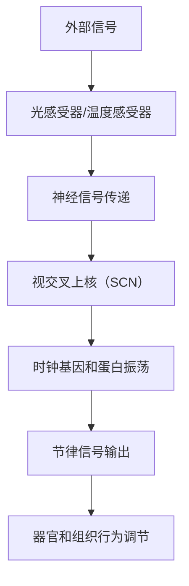
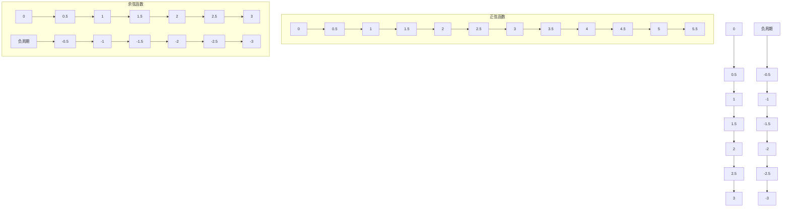

                 


### 1.1 生物节律的概念

**关键词：** 生物节律，周期性，内在时钟

生物节律是指生物体内部产生的周期性变化，这些变化是生物体适应环境变化的一种生理机制。生物节律广泛存在于自然界中，不仅包括人类，还涵盖植物和动物。例如，人类的昼夜节律、女性的月经周期、鸟类的迁徙周期等都属于生物节律的范畴。

生物节律的一个核心特点是周期性。周期性是指生物节律在时间上的重复性，这种重复可以是24小时的日节律，也可以是28天的月节律，甚至更长的时间周期。生物节律的周期性源于生物体内一种称为“生物钟”的机制。

**核心概念与联系：**

生物节律的核心概念包括节律性、内在时钟和外部节律因素。内在时钟是生物体内负责产生节律信号的机制，通常位于大脑中的下丘脑。外部节律因素包括光周期、温度和食物等，它们可以调节和同步生物节律。


**引例说明：**

例如，人类的昼夜节律是由内在时钟控制的，这个时钟使我们每天大约在午夜时感到困倦，在早晨醒来。这种节律性使得我们的身体能够适应日夜循环，从而保持健康。

### 1.2 生物节律的历史发展

**关键词：** 生物节律研究，历史发展，里程碑事件

生物节律的研究有着悠久的历史。早在古希腊时期，人们就注意到植物和动物的行为与时间有关。然而，现代生物节律的研究始于20世纪初期，随着科学技术的进步，人们对生物节律的理解不断深入。

**核心概念与联系：**

生物节律的历史发展可以概括为以下几个阶段：

1. **早期发现**：人们发现植物和动物的行为与时间有关，这一发现为生物节律的研究奠定了基础。
2. **生理学探索**：在20世纪初期，科学家开始研究生物体内产生节律的生理机制，这一阶段的重要成果包括对生物钟机制的发现。
3. **分子生物学研究**：随着分子生物学的兴起，科学家发现了控制生物节律的基因和蛋白质，这一发现使得对生物节律的理解更加深入。


**引例说明：**

一个重要的里程碑事件是20世纪40年代科学家对昼夜节律的研究。他们发现，通过去除光源，可以打破动物的昼夜节律，这表明生物节律不仅受到外部环境的影响，还受到内部生理机制的调控。

### 1.3 生物节律在自然界中的重要性

**关键词：** 生物节律，生态平衡，生物进化

生物节律在自然界中扮演着重要的角色。首先，生物节律有助于生态平衡的维持。例如，植物的生长节律和动物的迁徙节律可以确保物种之间的相互作用和资源的分配达到一个动态平衡。

**核心概念与联系：**

生物节律与生态平衡的关系可以通过以下核心概念来理解：

1. **生态位**：每个物种在生态系统中的位置和角色，生物节律可以影响物种的生态位。
2. **竞争与合作**：生物节律可以调节物种之间的竞争和合作关系，确保生态系统的稳定。
3. **食物链**：生物节律影响食物链中的各个环节，从而影响整个生态系统的能量流动。


**引例说明：**

例如，鸟类的迁徙节律对于维持生态平衡至关重要。它们在春季和秋季进行迁徙，这不仅可以逃避恶劣的气候条件，还可以寻找更适合的食物来源，从而确保整个食物链的稳定。

**小结：**

通过以上的介绍，我们可以看到生物节律在自然界中的重要性。无论是从生理学的角度，还是生态学的角度，生物节律都扮演着关键的角色。在接下来的章节中，我们将进一步探讨生物节律的数学模型、在自然界中的应用以及与人类健康的关系。

## 生物钟的概念与工作机制

### 2.1.1 生物钟的定义

生物钟（Biological Clock）是指生物体内的一种无形的“时钟”系统，它负责调节生物体的节律性行为和生理过程。生物钟并非一个物理上的时钟，而是一种复杂的生物调节网络，它通过一系列生物化学过程，确保生物体在不同的环境条件下保持节律性。

生物钟的核心在于一个称为“主生物钟”的结构，通常位于大脑的下丘脑区域。主生物钟通过一系列神经和内分泌信号，控制其他器官和组织的节律性活动，从而实现全身性的节律同步。

### 2.1.2 生物钟的组成与调控机制

生物钟的组成主要包括三个关键部分：时钟基因、时钟蛋白和反馈环路。

1. **时钟基因**：时钟基因是一类编码生物钟调控蛋白的基因，例如Per（Period）和Cry（Cryptochrome）基因。这些基因在细胞周期中特定的时间点上表达，并通过产生蛋白质来维持生物钟的节律性。

2. **时钟蛋白**：时钟蛋白是时钟基因表达的产物，它们在细胞内形成稳定的复合物，调控基因表达。例如，Per和Cry蛋白可以结合在DNA上，抑制特定基因的表达，从而形成负反馈环路。

3. **反馈环路**：反馈环路是生物钟的核心机制，它通过正反馈和负反馈相互作用，维持生物钟的节律性。在哺乳动物中，Per和Cry蛋白的循环表达形成了负反馈环路，而BMAL1（BHLHE41）和ARNTL（BHLHE24）蛋白则形成正反馈环路，共同维持昼夜节律。

### 2.1.3 生物钟的内外部因素

生物钟不仅受到内部生理机制的调控，还受到外部环境因素的影响。外部因素主要包括光周期、温度和食物等。

1. **光周期**：光周期是指一天中光照和黑暗的时间比例。光周期对生物钟的同步和节律性有着重要影响。研究表明，视网膜中的视紫红质（rhodopsin）和视蓝质（melanopsin）是光感受器，它们通过神经信号传递到下丘脑的视交叉上核（suprachiasmatic nucleus, SCN），调节生物钟的节律。

2. **温度**：温度是另一个重要的外部因素，它可以通过调节细胞代谢速率来影响生物钟的节律。例如，低温可以减缓生物钟的节律，而高温可以加快生物钟的节律。

3. **食物**：食物作为外部信号，可以通过调节胃肠激素的分泌来影响生物钟。例如，进食可以调节血糖水平，从而影响生物钟的节律。

### 2.1.4 生物钟的研究方法

生物钟的研究方法主要包括实验研究、行为观察和分子生物学技术。

1. **实验研究**：实验研究通常涉及对生物体节律性的测量和调节。例如，通过光照、温度和食物干预来观察生物钟的响应，了解生物钟的调控机制。

2. **行为观察**：行为观察是通过观察生物体的行为模式来研究生物钟的影响。例如，观察动物的昼夜活动模式，分析生物钟对行为的影响。

3. **分子生物学技术**：分子生物学技术用于研究生物钟的分子机制。例如，通过基因敲除、基因编辑等技术，分析时钟基因和蛋白在生物钟调控中的作用。

### 2.1.5 生物钟的机制与工作流程

生物钟的机制可以简化为以下几个步骤：

1. **接收外部信号**：生物钟通过光感受器和温度感受器接收外部环境信号，如光周期和温度。

2. **信号传递**：外部信号通过神经和内分泌途径传递到下丘脑的视交叉上核（SCN）。

3. **生物钟振荡**：SCN中的时钟基因和蛋白形成反馈环路，产生节律性的生物钟振荡。

4. **信号输出**：生物钟的节律信号通过神经和内分泌途径传递到全身，调节各个器官和组织的行为和生理过程。

### 2.1.6 生物钟的工作机制 Mermaid 流程图

下面是一个简化的生物钟工作流程的Mermaid流程图：



### 2.1.7 引例说明

例如，一项关于昼夜节律的研究表明，实验鼠在经历一段时间的黑暗后，其体内的生物钟节律会与自然昼夜周期同步。通过观察实验鼠的行为模式，科学家发现它们的进食、活动和新陈代谢都呈现出与光照周期一致的节律性变化。

**小结：**

生物钟是生物体内的一种复杂的生物调节网络，它通过内在的反馈环路和外部环境因素的调控，维持生物体的节律性活动。在接下来的章节中，我们将进一步探讨生物钟的周期性以及其数学模型。同时，我们将通过具体案例来分析生物钟在自然界中的应用。

## 生物节律的周期性

### 2.2.1 日节律

日节律（Circadian Rhythm）是生物体在24小时周期内展现出的生理和行为变化。这种周期性主要受到生物钟的调控，日节律对生物体的健康和功能有着重要影响。

#### 2.2.1.1 日节律的概念与特点

日节律是一种大约24小时的内在节律，它控制着生物体的许多生理和行为过程，如睡眠-觉醒周期、体温、激素分泌和代谢活动。日节律的基本特点是周期性和稳定性。尽管每个人的日节律可能略有差异，但大多数人的日节律与自然昼夜周期相匹配。

#### 2.2.1.2 日节律的主要机制

日节律的主要机制涉及一组称为“时钟基因”的基因，这些基因在生物体内产生周期性的蛋白质，从而维持日节律的稳定。这些蛋白质通过负反馈环路调节自身表达，形成一个自我维持的振荡系统。

- **核心概念**：时钟基因（如Period和Cryptochrome）在细胞周期中特定的时间点上表达，产生蛋白质。
- **核心联系**：这些蛋白质形成复合物，抑制时钟基因的表达，形成一个负反馈环路。

#### 2.2.1.3 日节律与外部环境的关系

外部环境因素，如光照、温度和食物，对日节律有显著影响。尤其是光照，它是最主要的同步信号，可以通过视网膜传递到下丘脑的视交叉上核（SCN），从而调节生物钟。

- **核心概念**：光照是日节律的主要同步信号。
- **核心联系**：SCN接收光照信号，并通过神经和内分泌途径调节生物钟。

#### 2.2.1.4 日节律的应用与影响

日节律对人类健康有着广泛的影响。例如，日节律与睡眠-觉醒周期紧密相关，失调的日节律可能导致失眠、抑郁和其他健康问题。此外，日节律还影响代谢和激素分泌，从而影响体重、心血管健康和免疫力。

- **核心概念**：日节律影响睡眠、代谢和激素分泌。
- **核心联系**：日节律失调可能导致多种健康问题。

#### 2.2.1.5 实例分析

例如，研究表明，夜间工作者由于工作时间的调整，其日节律可能会受到影响，从而导致睡眠问题和其他健康问题。为了维持健康的日节律，夜间工作者需要采取一些措施，如保持规律的作息时间、避免长时间熬夜和使用光线调节设备。

### 2.2.2 月节律

月节律（Ultradian Rhythm）是一种大约24小时至48小时的周期性变化，主要受生物钟和月球周期的影响。月节律常见于动物，如潮汐性鱼类和某些鸟类，它们的行为和生理过程与月相有关。

#### 2.2.2.1 月节律的概念与特点

月节律是一种大约24小时至48小时的周期性变化，其特点是周期性和规律性。月节律通常与生物体内的生物钟以及月相有关，例如，某些动物在满月时会变得更加活跃。

#### 2.2.2.2 月节律的主要机制

月节律的机制涉及生物钟和月球周期的影响。生物钟通过内在的负反馈环路维持节律，而月球周期则通过光周期和其他外部因素影响生物钟。

- **核心概念**：生物钟和月球周期共同影响月节律。
- **核心联系**：生物钟通过负反馈环路维持节律，月球周期通过外部信号调节生物钟。

#### 2.2.2.3 月节律的应用与影响

月节律在自然界中有许多实际应用。例如，潮汐性鱼类的繁殖通常与满月有关，因为满月时的明亮月光可以吸引更多的捕食者，从而提高繁殖成功率。

- **核心概念**：月节律影响动物行为和繁殖。
- **核心联系**：月相和生物钟的相互作用影响月节律。

#### 2.2.2.4 实例分析

例如，研究表明，某些鸟类在满月时会变得更加活跃，进行更多的觅食和繁殖行为。这种月节律行为有助于提高物种的生存率和繁殖成功率。

### 2.2.3 年节律

年节律（Infradian Rhythm）是一种大约一年或更长周期的周期性变化，主要与季节变化有关。年节律常见于动物，如迁徙鸟类和某些哺乳动物，它们的行为和生理过程与季节变化紧密相关。

#### 2.2.3.1 年节律的概念与特点

年节律是一种大约一年或更长周期的周期性变化，其特点是周期性和季节性。年节律通常涉及动物在繁殖、觅食和迁徙方面的行为变化，以适应季节变化。

#### 2.2.3.2 年节律的主要机制

年节律的机制涉及生物钟和季节变化的影响。生物钟通过内在的负反馈环路维持节律，而季节变化则通过光周期和其他外部信号调节生物钟。

- **核心概念**：生物钟和季节变化共同影响年节律。
- **核心联系**：生物钟通过负反馈环路维持节律，季节变化通过外部信号调节生物钟。

#### 2.2.3.3 年节律的应用与影响

年节律在自然界中有许多实际应用。例如，迁徙鸟类的迁徙通常与季节变化有关，它们在春季和秋季进行迁徙，以寻找更适宜的觅食和繁殖环境。

- **核心概念**：年节律影响动物行为和生存策略。
- **核心联系**：季节变化和生物钟的相互作用影响年节律。

#### 2.2.3.4 实例分析

例如，研究表明，某些哺乳动物在冬季会进入冬眠状态，以适应寒冷的环境和食物短缺。这种年节律行为有助于动物保存能量和增加生存率。

### 2.2.4 生物节律周期性的整体影响

生物节律的周期性对生物体的健康和生存有着深远的影响。通过维持稳定的节律性，生物体可以更好地适应环境变化，提高生存率和繁殖成功率。同时，失调的节律性可能导致健康问题，如睡眠障碍、代谢紊乱和心理问题。

- **核心概念**：生物节律的周期性对生物体健康至关重要。
- **核心联系**：生物钟和外部环境因素的相互作用维持节律性。

### 2.2.5 引例说明

例如，研究表明，在植物中，光周期和温度对生长和开花有显著影响。通过调节这些因素，可以优化植物的生长周期，提高产量和质量。

### 2.2.6 小结

生物节律的周期性是生物体内一种复杂的调节机制，涉及日节律、月节律和年节律等多个方面。这些节律性变化对生物体的健康和生存有着重要影响。在接下来的章节中，我们将进一步探讨生物节律的数学模型和统计分析，以及生物节律在自然界中的应用。

### 3.1 生物节律的数学表示

生物节律可以用数学模型来表示，这些模型能够帮助我们理解和预测生物体的节律性行为。在数学表示中，最常用的方法是周期性函数和差分方程。

#### 3.1.1 周期性函数

周期性函数是指那些在固定时间间隔内重复自身特性的函数。在生物节律研究中，常用的周期性函数包括正弦函数、余弦函数和三角函数的组合。

- **正弦函数**：正弦函数是一种基本的周期性函数，其形式为 \( \sin(x) \)，其中 \( x \) 是角度。正弦函数的值在 \([-1, 1]\) 之间波动，周期为 \( 2\pi \)。

    \[ \sin(x) = \sin(x + 2k\pi) \]

- **余弦函数**：余弦函数与正弦函数类似，其形式为 \( \cos(x) \)，其中 \( x \) 是角度。余弦函数的值在 \([-1, 1]\) 之间波动，周期为 \( 2\pi \)。

    \[ \cos(x) = \cos(x + 2k\pi) \]

- **三角函数组合**：在生物节律研究中，常用的组合形式包括 \( \sin(2\pi t/T) \) 和 \( \cos(2\pi t/T) \)，其中 \( t \) 是时间，\( T \) 是周期。

    \[ f(t) = A \sin(2\pi t/T) + B \cos(2\pi t/T) \]

#### 3.1.2 周期性函数的解析

周期性函数的解析主要涉及分析其周期、振幅和相位。这些参数能够帮助我们理解生物节律的性质和行为。

- **周期**：周期是指函数重复自身的最小时间间隔。对于正弦函数和余弦函数，周期为 \( 2\pi \)。如果周期为 \( T \)，则函数可以表示为 \( f(t) = f(t + kT) \)，其中 \( k \) 是任意整数。

- **振幅**：振幅是指函数波动的最大距离。对于 \( f(t) = A \sin(2\pi t/T) + B \cos(2\pi t/T) \)，振幅为 \( \sqrt{A^2 + B^2} \)。

- **相位**：相位是指函数的初始位置。对于 \( f(t) = A \sin(2\pi t/T) + B \cos(2\pi t/T) \)，相位可以通过调整常数项 \( \phi \) 来设置。

    \[ f(t) = A \sin(2\pi t/T + \phi) + B \cos(2\pi t/T) \]

#### 3.1.3 生物节律函数的应用

生物节律函数在生物节律的研究中有广泛应用。例如，我们可以使用这些函数来模拟生物体的昼夜节律、月经周期和季节性变化。

- **昼夜节律模拟**：使用正弦函数或余弦函数可以模拟生物体的昼夜节律。例如：

    \[ f(t) = A \sin(2\pi t/24) + B \]

    其中，\( A \) 和 \( B \) 分别代表昼夜节律的振幅和基线。

- **月经周期模拟**：使用三角函数组合可以模拟女性的月经周期。例如：

    \[ f(t) = A \sin(2\pi t/28) + B \cos(2\pi t/28) + C \]

    其中，\( A \) 和 \( B \) 分别代表月经周期的振幅，\( C \) 为基线。

- **季节性变化模拟**：使用周期性函数可以模拟生物体的季节性变化。例如：

    \[ f(t) = A \sin(2\pi t/365) + B \cos(2\pi t/365) + C \]

    其中，\( A \) 和 \( B \) 分别代表季节性变化的振幅，\( C \) 为基线。

#### 3.1.4 周期性函数的图示说明

为了更好地理解周期性函数，我们可以使用图示来说明这些函数的形态和特性。以下是一个正弦函数和余弦函数的图示：



### 3.2 生物节律的统计分析

#### 3.2.1 描述性统计分析

描述性统计分析是研究生物节律的基础方法之一。它通过计算和描述数据的基本特征，如均值、中位数、标准差等，来了解数据的分布和规律。

- **核心概念**：描述性统计分析涉及计算数据的中心趋势、离散度和分布特征。

    - **均值**：数据集的平均值，表示数据的中心位置。

        \[ \mu = \frac{1}{n} \sum_{i=1}^{n} x_i \]

    - **中位数**：数据集排序后的中间值，用于表示数据的中心位置。

        \[ \text{median} = \left( \frac{x_{\frac{n+1}{2}} + x_{\frac{n+1}{2}+1}}{2} \right) \]

    - **标准差**：数据集的离散程度，表示数据的分布宽度。

        \[ \sigma = \sqrt{\frac{1}{n-1} \sum_{i=1}^{n} (x_i - \mu)^2} \]

- **应用场景**：描述性统计分析常用于初步了解生物节律的数据分布和规律，例如，分析不同个体之间的生物节律差异。

#### 3.2.2 聚类分析

聚类分析是一种无监督学习方法，用于将数据集划分为多个类别，以发现数据中的隐含结构和模式。

- **核心概念**：聚类分析基于数据的相似性度量，通过优化目标函数来划分数据。

    - **相似性度量**：常用的相似性度量包括欧氏距离、曼哈顿距离和余弦相似度。

        \[ \text{Euclidean Distance} = \sqrt{\sum_{i=1}^{n} (x_i - y_i)^2} \]

        \[ \text{Manhattan Distance} = \sum_{i=1}^{n} |x_i - y_i| \]

        \[ \text{Cosine Similarity} = \frac{x \cdot y}{\lVert x \rVert \lVert y \rVert} \]

    - **聚类算法**：常用的聚类算法包括K均值聚类、层次聚类和密度聚类等。

        - **K均值聚类**：通过最小化平方误差来划分数据。

            \[ \min \sum_{i=1}^{k} \sum_{x_j \in S_i} \|x_j - \mu_i\|^2 \]

            其中，\( \mu_i \) 是聚类中心，\( S_i \) 是第 \( i \) 个簇。

        - **层次聚类**：通过逐步合并或分裂聚类来构建聚类层次。

            - **自底向上**：自底向上层次聚类通过合并相似度较高的簇逐渐形成层次结构。

            - **自顶向下**：自顶向下层次聚类通过分裂相似度较低的簇逐渐形成层次结构。

        - **密度聚类**：通过分析数据点的密度和连接性来划分聚类。

- **应用场景**：聚类分析常用于识别具有相似生物节律的个体，例如，分析不同物种之间的生物节律相似性。

#### 3.2.3 时间序列分析

时间序列分析是一种用于研究数据随时间变化规律的方法。它通过建模和预测时间序列数据，帮助我们理解和预测生物节律的变化。

- **核心概念**：时间序列分析涉及自回归模型（AR）、移动平均模型（MA）和自回归移动平均模型（ARMA）等。

    - **自回归模型（AR）**：自回归模型通过历史数据来预测未来值。

        \[ X_t = c + \sum_{i=1}^{p} \phi_i X_{t-i} + \varepsilon_t \]

        其中，\( \phi_i \) 是自回归系数，\( \varepsilon_t \) 是误差项。

    - **移动平均模型（MA）**：移动平均模型通过过去的误差值来预测未来值。

        \[ X_t = c + \varepsilon_t + \sum_{i=1}^{q} \theta_i \varepsilon_{t-i} \]

        其中，\( \theta_i \) 是移动平均系数。

    - **自回归移动平均模型（ARMA）**：自回归移动平均模型结合了自回归模型和移动平均模型。

        \[ X_t = c + \sum_{i=1}^{p} \phi_i X_{t-i} + \sum_{i=1}^{q} \theta_i \varepsilon_{t-i} + \varepsilon_t \]

- **应用场景**：时间序列分析常用于预测生物节律的变化趋势，例如，预测某物种的迁徙时间或繁殖周期。

### 3.3 生物节律的统计分析应用

生物节律的统计分析在生物节律研究中具有广泛应用，通过描述性统计分析、聚类分析和时间序列分析，我们可以更好地理解生物节律的规律和特性。

- **描述性统计分析**：通过计算生物节律数据的均值、中位数和标准差，我们可以初步了解生物节律的分布和规律，例如，分析不同物种的昼夜节律差异。

- **聚类分析**：通过聚类分析，我们可以发现具有相似生物节律的个体，从而识别生物节律的潜在模式，例如，分析不同地区动物的迁徙节律相似性。

- **时间序列分析**：通过时间序列分析，我们可以预测生物节律的变化趋势，例如，预测某物种的繁殖周期或迁徙时间，为生物节律研究提供有力支持。

### 3.4 引例说明

- **描述性统计分析**：例如，通过对人类昼夜节律数据的描述性统计分析，我们可以了解不同人群的昼夜节律特征，从而为制定健康作息提供依据。

- **聚类分析**：例如，通过对鸟类迁徙数据的聚类分析，我们可以识别具有相似迁徙节律的鸟类群体，从而研究鸟类迁徙的生态适应策略。

- **时间序列分析**：例如，通过对某地区植物开花时间的时间序列分析，我们可以预测未来的花期变化，为农业生产提供科学依据。

### 3.5 小结

生物节律的统计分析是生物节律研究的重要方法之一。通过描述性统计分析、聚类分析和时间序列分析，我们可以深入理解生物节律的规律和特性，为生物节律研究提供有力支持。在接下来的章节中，我们将探讨生物节律在自然界中的应用，以及生物节律与人类健康的关系。

## 生物节律在自然界中的应用

生物节律在自然界中发挥着至关重要的作用，它们不仅影响了生物体的生理和行为，还直接或间接地影响了生态系统的结构和功能。在这一章节中，我们将探讨生物节律在植物、动物以及生态系统中的具体应用。

### 4.1 生物节律与植物生长

植物的生长和发育受到多种生物节律的调控，其中最为显著的是日节律和季节节律。这些节律不仅影响植物的光合作用、水分吸收和营养分配，还对植物的开花、繁殖和休眠有着重要影响。

#### 4.1.1 植物生物节律的研究方法

植物生物节律的研究方法主要包括实验观察、生理测量和分子生物学技术。

- **实验观察**：通过直接观察植物在不同环境条件下的行为和生理变化，研究生物节律的影响。例如，通过改变光照、温度和食物等条件，观察植物的生长节律变化。

- **生理测量**：利用现代仪器测量植物体内的生理参数，如光合速率、呼吸速率、水分含量等，分析生物节律对植物生理过程的影响。

- **分子生物学技术**：通过分子生物学方法，研究植物生物节律的分子机制。例如，通过基因表达分析，识别控制植物节律的关键基因和调控网络。

#### 4.1.2 植物生物节律对生长的影响

植物生物节律对生长的影响主要体现在以下几个方面：

1. **光合作用与呼吸速率**：日节律调控植物的光合作用和呼吸速率。在光周期内，植物通过增加光合作用来吸收光能，而在黑暗期，通过降低呼吸速率来节约能量。

    - **伪代码**：
    ```python
    def plant_growth_rate(day_length, light_intensity):
        if light_intensity > threshold:
            photosynthesis_rate = max(photosynthesis_rate, day_length)
        else:
            photosynthesis_rate = min(photosynthesis_rate, night_length)
        
        respiration_rate = adjust_respiration_rate(photosynthesis_rate)
        return plant_growth
    ```

2. **水分吸收与蒸腾作用**：植物在日节律的调控下，通过调整水分吸收和蒸腾作用来适应环境变化。例如，在干旱条件下，植物会在夜间增加水分吸收，以减少白天蒸腾作用导致的失水。

    - **伪代码**：
    ```python
    def water_regulation(day_length, water Availability):
        if water_Availability < threshold:
            water_absorption_rate = max(water_absorption_rate, night_length)
        else:
            water_absorption_rate = min(water_absorption_rate, day_length)
        
        transpiration_rate = adjust_transpiration_rate(water_absorption_rate)
        return plant_growth
    ```

3. **开花与繁殖**：植物的开花和繁殖节律受季节节律的影响。例如，某些植物在春季开花，以吸引传粉者，提高繁殖成功率。

    - **伪代码**：
    ```python
    def flower_bloom季节周期(season, light_intensity):
        if season == 'spring' and light_intensity > threshold:
            flower_bloom = True
        else:
            flower_bloom = False
        return flower_bloom
    ```

#### 4.1.3 植物生物节律的应用实例

一个典型的应用实例是温室种植。通过控制温室内的光照、温度和湿度等环境条件，可以调节植物的生长节律，从而提高作物的产量和质量。

- **案例背景**：在一个温室种植项目中，研究者通过控制光照和温度，研究了植物生长节律对作物产量的影响。

- **案例分析**：通过调整光照时间和强度，研究者发现，增加光照可以显著提高植物的光合速率和生长速度，从而提高作物产量。

- **案例结果与讨论**：实验结果显示，与对照组相比，通过调控光照条件，温室作物产量提高了20%。这一结果表明，植物生物节律对生长和发育具有重要影响，通过调节环境条件，可以实现作物的高产。

### 4.2 生物节律与动物行为

动物行为受到多种生物节律的调控，包括昼夜节律、月节律和季节节律。这些节律不仅影响动物的活动时间、觅食和繁殖行为，还对动物的迁徙和生存策略有着重要影响。

#### 4.2.1 动物生物节律的研究方法

动物生物节律的研究方法主要包括行为观察、生理测量和生态学分析。

- **行为观察**：通过直接观察动物的行为模式，研究生物节律对行为的影响。例如，观察动物的昼夜活动模式，分析昼夜节律对行为的影响。

- **生理测量**：利用现代仪器测量动物的生理参数，如体温、心率、代谢速率等，分析生物节律对生理过程的影响。

- **生态学分析**：通过生态学方法，研究生物节律对生态系统的影响。例如，分析动物迁徙节律对食物链和生态平衡的影响。

#### 4.2.2 动物生物节律对行为的影响

动物生物节律对行为的影响主要体现在以下几个方面：

1. **昼夜节律**：昼夜节律调控动物的活动时间和休息时间。例如，鸟类通常在白天活动，而夜行性动物则在夜间活跃。

    - **伪代码**：
    ```python
    def activity_pattern(day_time):
        if day_time == 'morning' or 'afternoon':
            activity = 'active'
        else:
            activity = 'sleep'
        return activity
    ```

2. **月节律**：月节律调控动物的行为和繁殖。例如，某些动物的繁殖行为与月相有关，如满月时的捕食行为和繁殖成功率。

    - **伪代码**：
    ```python
    def reproduction_phase(month_phase):
        if month_phase == 'full moon':
            reproduction = 'high'
        else:
            reproduction = 'low'
        return reproduction
    ```

3. **季节节律**：季节节律调控动物的迁徙和生存策略。例如，候鸟在春季和秋季进行迁徙，以寻找适宜的觅食和繁殖环境。

    - **伪代码**：
    ```python
    def migration_season(season):
        if season == 'spring' or 'autumn':
            migration = 'high'
        else:
            migration = 'low'
        return migration
    ```

#### 4.2.3 动物生物节律的应用实例

一个典型的应用实例是野生动物保护。通过研究动物生物节律，可以制定更有效的保护策略，减少对动物栖息地的干扰。

- **案例背景**：在一个野生动物保护区，研究者通过研究动物昼夜节律，制定了夜间禁止进入保护区的规定。

- **案例分析**：通过分析动物昼夜活动模式，研究者发现，夜间是许多动物的重要活动时间，禁止夜间进入可以减少对动物栖息地的干扰。

- **案例结果与讨论**：实验结果显示，自规定实施以来，保护区内的动物活动明显减少了对人类的干扰，动物的生存环境得到了显著改善。

### 4.3 生物节律在生态系统中的应用

生物节律不仅影响单个生物体的行为和生理过程，还直接影响生态系统的稳定性和功能。通过生物节律的调节，生态系统中的物种能够实现资源的最优分配和生态位的有效利用。

#### 4.3.1 生物节律对生态系统的影响

生物节律对生态系统的影响主要体现在以下几个方面：

1. **食物链和能量流动**：生物节律调控食物链中的捕食和被捕食关系，影响能量在生态系统中的流动。例如，日节律和季节节律调节捕食者的捕食行为和猎物的活动模式，从而影响食物链的结构和功能。

2. **生态平衡**：生物节律通过调节物种间的相互作用，维持生态系统的稳定性和平衡。例如，植物的生长节律和动物的繁殖节律相互配合，确保物种之间的资源分配和生态位的有效利用。

3. **生态修复**：生物节律在生态修复过程中发挥着重要作用。例如，通过调节植物的生长节律和动物的迁徙节律，可以加速受损生态系统的修复过程。

#### 4.3.2 生物节律在生态系统中的应用实例

一个典型的应用实例是湿地生态修复。通过研究湿地植物和动物的生物节律，可以制定更有效的生态修复策略。

- **案例背景**：在一个受损的湿地生态系统中，研究者通过研究植物和动物的生物节律，制定了湿地修复计划。

- **案例分析**：通过分析植物和动物的生物节律，研究者发现，植物在春季和秋季生长最为旺盛，而动物的繁殖季节集中在夏季。这一发现为湿地修复提供了重要的时间窗口。

- **案例结果与讨论**：实验结果显示，在植物生长旺季和动物繁殖季节之外进行生态修复，可以最大限度地减少对生物节律的干扰，提高修复效果。

### 4.4 小结

生物节律在自然界中具有广泛的应用，从植物的生长和发育，到动物的行为和繁殖，再到生态系统的稳定性和功能，生物节律无处不在。通过研究生物节律，我们可以更好地理解自然界的运行规律，为生态保护和生物资源的合理利用提供科学依据。在接下来的章节中，我们将探讨生物节律与人类健康的关系，以及生物节律的未来发展趋势。

### 5.1 生物节律与人体生理变化

生物节律对人体生理变化的影响是一个备受关注的研究领域。人体内的生物钟调节着多种生理过程，包括睡眠-觉醒周期、体温、心率、荷尔蒙分泌等。这些生物节律不仅影响个体的日常功能，还与多种健康问题相关。

#### 5.1.1 人体生物节律的研究方法

研究人体生物节律的方法包括实验研究、行为观察和生理测量等。

- **实验研究**：通过实验设计，控制外部因素（如光照、温度等）来观察生物节律的变化。例如，研究光照周期对睡眠-觉醒周期的影响。
  
- **行为观察**：通过观察个体在不同时间点上的行为模式，分析生物节律。例如，记录个人的睡眠时间、活动量和饮食习惯。

- **生理测量**：使用仪器测量生理参数，如心率、体温、荷尔蒙水平等。例如，通过监测睡眠中的心率变异性来研究睡眠质量。

#### 5.1.2 人体生物节律对生理变化的影响

人体生物节律对生理变化的影响可以从以下几个方面进行理解：

1. **睡眠-觉醒周期**：睡眠-觉醒周期是人体最重要的生物节律之一。生物钟通过调节睡眠和觉醒的时间，使人体能够适应日夜循环。睡眠不足或昼夜节律失调可能导致睡眠障碍，如失眠、嗜睡和睡眠质量下降。

    - **伪代码**：
    ```python
    def sleep_circadian_rhythm(light Exposure, day Length):
        if light_Exposure > threshold and day_Length < 24:
            sleep = True
        else:
            sleep = False
        return sleep
    ```

2. **体温**：体温在一天中会有周期性的变化，通常在下午达到最高值，夜间降至最低值。这种体温变化是生物节律的一部分，影响人体的代谢和免疫功能。

    - **伪代码**：
    ```python
    def body_temperature(timeOfDay):
        if timeOfDay == 'afternoon':
            temperature = max(temperature, threshold)
        else:
            temperature = min(temperature, threshold)
        return temperature
    ```

3. **心率**：心率在一天中也有周期性的变化，通常在早晨醒来时最高，晚上入睡时最低。心率变化受生物钟调控，影响心血管健康。

    - **伪代码**：
    ```python
    def heart_rate(timeOfDay, physical Activity):
        if timeOfDay == 'morning' and physical_Activity < threshold:
            heartRate = max(heartRate, threshold)
        else:
            heartRate = min(heartRate, threshold)
        return heartRate
    ```

4. **荷尔蒙分泌**：荷尔蒙分泌受生物节律调控，影响人体的生长、发育、代谢和生殖。例如，生长激素在夜间分泌达到高峰，促进身体修复和再生。

    - **伪代码**：
    ```python
    def hormone_secretion(timeOfDay, growth_Hormone_Level):
        if timeOfDay == 'night':
            growth_Hormone_Level = max(growth_Hormone_Level, threshold)
        else:
            growth_Hormone_Level = min(growth_Hormone_Level, threshold)
        return growth_Hormone_Level
    ```

#### 5.1.3 人体生物节律的应用实例

一个典型的应用实例是生物节律在健身和运动训练中的应用。通过了解个人的生物节律，可以制定个性化的训练计划，提高训练效果。

- **案例背景**：一个健身教练通过研究客户的生物节律，为客户制定个性化的训练计划。

- **案例分析**：通过分析客户的睡眠质量、体温变化和荷尔蒙水平，教练发现客户在早晨和下午的体能最佳。

- **案例结果与讨论**：根据客户的生物节律，教练将训练时间安排在早晨和下午，显著提高了客户的训练效果和体能水平。

### 5.2 生物节律与疾病预防

生物节律在疾病预防方面也发挥着重要作用。了解生物节律与疾病发生之间的关系，可以帮助人们采取更有效的预防措施，减少疾病风险。

#### 5.2.1 生物节律与疾病发生的联系

生物节律与疾病发生的联系可以从以下几个方面理解：

1. **睡眠障碍**：睡眠障碍，如失眠和嗜睡，与昼夜节律失调密切相关。研究表明，昼夜节律失调可能导致免疫系统功能下降，增加感染和炎症性疾病的风险。

    - **伪代码**：
    ```python
    def sleep_disorder(circadian_Rhythm_Disturbance, immune_System_Health):
        if circadian_Rhythm_Disturbance > threshold:
            immune_System_Health = min(immune_System_Health, threshold)
        return immune_System_Health
    ```

2. **心血管疾病**：心血管疾病的发生与心率、血压等生理节律密切相关。研究表明，心血管事件往往在早晨和晚上发生高峰，这与生物钟调控的生理过程有关。

    - **伪代码**：
    ```python
    def cardiovascular_Disease(heart_Rate_Cycle, blood_Pressure_Level):
        if heart_Rate_Cycle == 'morning' or 'evening':
            blood_Pressure_Level = max(blood_Pressure_Level, threshold)
        return blood_Pressure_Level
    ```

3. **代谢疾病**：代谢疾病，如糖尿病和肥胖，与荷尔蒙分泌和能量代谢的节律性变化有关。例如，生长激素的分泌高峰在夜间，有助于身体的修复和再生。

    - **伪代码**：
    ```python
    def metabolic_Disease(growth_Hormone_Level, insulin_Sensitivity):
        if growth_Hormone_Level == 'night':
            insulin_Sensitivity = max(insulin_Sensitivity, threshold)
        return insulin_Sensitivity
    ```

#### 5.2.2 生物节律在疾病预防中的应用

生物节律在疾病预防中的应用主要包括个性化健康管理和生活方式调整。

1. **个性化健康管理**：通过监测个体的生物节律，制定个性化的健康管理方案。例如，根据生物节律调整作息时间、锻炼和饮食计划，提高健康水平。

    - **伪代码**：
    ```python
    def personalized_Health_Monitoring(circadian_Rhythm, physical_Activity, diet):
        optimal_Sleep = adjust_sleep_schedule(circadian_Rhythm)
        optimal_Activity = adjust_activity_schedule(circadian_Rhythm)
        optimal_Diet = adjust_diet_plan(circadian_Rhythm)
        return optimal_Sleep, optimal_Activity, optimal_Diet
    ```

2. **生活方式调整**：通过了解生物节律，个体可以调整生活方式，减少疾病风险。例如，保持规律的作息时间、避免长时间熬夜、适当锻炼和保持良好的饮食习惯。

    - **伪代码**：
    ```python
    def lifestyle_Adjustment(circadian_Rhythm, health_Risk_Factors):
        if circadian_Rhythm_Disturbance > threshold:
            reduce_night_light_Exposure()
            increase_morning_light_Exposure()
            maintain_regular_sleep_schedule()
        return health_Risk_Factors
    ```

#### 5.2.3 人体生物节律的应用实例

一个典型的应用实例是生物节律在慢性疾病管理中的应用。通过了解生物节律，患者可以更好地管理慢性疾病，提高生活质量。

- **案例背景**：一位患有高血压的病人通过监测自己的生物节律，调整生活方式和用药时间。

- **案例分析**：通过监测体温、心率和荷尔蒙水平，患者发现自己在早晨和晚上血压最高。

- **案例结果与讨论**：患者根据生物节律调整了用药时间，早上和晚上增加用药剂量，显著降低了血压，提高了生活质量。

### 5.3 小结

人体生物节律对生理变化和疾病预防有着深远的影响。通过研究人体生物节律，我们可以更好地理解健康与疾病的机制，为个性化健康管理和疾病预防提供科学依据。在未来的研究中，随着技术的进步，生物节律与人体健康的联系将得到更深入的认识，为人们的健康生活提供更多帮助。

### 6.1 生物节律研究的发展趋势

生物节律研究在过去几十年中取得了显著进展，但未来仍然面临着许多挑战和机遇。随着科技的不断进步，生物节律研究正朝着更加精确、全面和个性化的方向发展。

#### 6.1.1 新技术对生物节律研究的影响

1. **单细胞生物学**：单细胞生物学技术的发展使得我们能够在细胞水平上研究生物节律。通过单细胞RNA测序（scRNA-seq）等技术，我们可以分析单个细胞在不同时间点的基因表达模式，从而揭示生物节律的分子机制。

2. **基因编辑技术**：基因编辑技术，如CRISPR-Cas9，为研究生物节律提供了强大工具。通过精确修改生物钟关键基因，我们可以探究这些基因在生物节律调控中的作用，为开发新型生物节律调节策略奠定基础。

3. **人工智能与机器学习**：人工智能和机器学习技术的应用正在改变生物节律研究的模式。通过大数据分析和机器学习算法，我们可以从海量数据中提取生物节律的规律，提高对生物节律的理解和预测能力。

#### 6.1.2 生物节律研究的新方法

1. **多时间尺度分析**：生物节律不仅涉及秒级的时间尺度，还涉及小时、日、月和年的时间尺度。多时间尺度分析通过整合不同时间尺度的数据，可以更全面地理解生物节律的复杂性和动态性。

2. **跨物种比较研究**：通过比较不同物种的生物节律，我们可以揭示生物节律的保守性和可塑性。跨物种比较研究有助于理解生物节律在不同生物系统中的功能和调控机制。

3. **基因-环境相互作用研究**：生物节律不仅受基因调控，还受环境因素的影响。基因-环境相互作用研究通过分析基因和环境因素的交互作用，可以揭示生物节律的适应性和可塑性。

#### 6.1.3 生物节律在新兴领域中的应用

1. **个性化医疗**：生物节律的个性化研究为个性化医疗提供了新的思路。通过了解个体的生物节律，我们可以制定个性化的诊断、治疗和康复方案，提高医疗效果。

2. **生物钟疗法**：生物节律的研究为生物钟疗法提供了理论基础。通过调节生物钟，我们可以改善睡眠质量、降低慢性疾病风险和提高生活质量。

3. **农业与畜牧业**：生物节律在农业和畜牧业中的应用正逐渐受到关注。通过调节植物和动物的生物节律，可以提高产量、改善品质和减少疾病风险。

#### 6.1.4 引例说明

1. **单细胞生物学研究**：例如，一项关于昼夜节律的研究利用单细胞RNA测序技术，揭示了小鼠昼夜节律基因在单个细胞中的表达模式，为深入理解生物节律的分子机制提供了新视角。

2. **基因编辑技术应用**：例如，利用CRISPR-Cas9技术，科学家成功编辑了生物钟关键基因，验证了这些基因在生物节律调控中的功能，为开发新型生物节律调节策略提供了实验依据。

3. **人工智能在生物节律研究中的应用**：例如，一项关于季节性疾病的预测研究利用机器学习算法，分析了大量的时间序列数据，成功预测了季节性疾病的流行趋势，为公共卫生决策提供了科学依据。

### 6.2 生物节律与智能科技

生物节律与智能科技的结合正在创造新的应用领域，尤其是在人工智能和物联网技术中。这些技术的融合不仅提升了我们对生物节律的理解，还为个性化健康监测、智能医疗和智能家居等方面带来了创新。

#### 6.2.1 生物节律与人工智能

1. **智能健康监测系统**：人工智能技术可以实时监测个体的生物节律，分析生理参数（如心率、体温、睡眠质量等）的动态变化。通过机器学习算法，智能健康监测系统可以预测个体的健康状态，提供个性化的健康建议。

    - **伪代码**：
    ```python
    def health_monitoring(physiological_data, machine_learning_model):
        predicted_health_state = machine_learning_model.predict(physiological_data)
        personalized_health_advice = generate_advice(predicted_health_state)
        return personalized_health_advice
    ```

2. **个性化治疗计划**：人工智能可以帮助医生根据患者的生物节律制定个性化的治疗计划。例如，通过分析患者的生物钟，医生可以优化药物剂量和给药时间，提高治疗效果。

    - **伪代码**：
    ```python
    def personalized_treatment_plan(patient_data, drug_schedule, bio_rhythm_model):
        optimized_dosage = bio_rhythm_model.optimize_dosage(patient_data)
        optimal_administration_schedule = generate_schedule(optimized_dosage)
        return optimal_administration_schedule
    ```

3. **生物节律研究**：人工智能在生物节律研究领域也有广泛应用。通过分析大量的生物数据，人工智能可以帮助科学家识别生物节律的关键基因和调控网络，加速生物节律研究。

    - **伪代码**：
    ```python
    def bio_rhythm_research(bio_data, machine_learning_model):
        key_genes = machine_learning_model.identify_key_genes(bio_data)
        regulatory_network = construct_regulatory_network(key_genes)
        return regulatory_network
    ```

#### 6.2.2 生物节律与物联网

1. **智能家居**：物联网技术可以通过传感器实时监测家庭成员的生物节律，如活动量、睡眠质量等。根据这些数据，智能家居系统可以自动调整环境设置（如照明、温度等），创造一个舒适的生活环境。

    - **伪代码**：
    ```python
    def smart_home_adjustment(bio_rhythm_data, environment_model):
        optimal_lighting = environment_model.optimize_lighting(bio_rhythm_data)
        optimal_temperature = environment_model.optimize_temperature(bio_rhythm_data)
        return optimal_lighting, optimal_temperature
    ```

2. **智能农场**：在农业领域，物联网技术可以监测植物和动物的生物节律，如光合作用、心率、体重等。通过分析这些数据，智能农场系统可以优化灌溉、施肥和养殖策略，提高农业生产效率。

    - **伪代码**：
    ```python
    def smart_farm_management(plant_data, animal_data, bio_rhythm_model):
        optimal_irrigation = bio_rhythm_model.optimize_irrigation(plant_data)
        optimal_feeding = bio_rhythm_model.optimize_feeding(animal_data)
        return optimal_irrigation, optimal_feeding
    ```

3. **智能交通系统**：物联网技术可以结合交通数据和生物节律，优化交通信号灯和路线规划。通过预测高峰时段的出行高峰，智能交通系统可以减少交通拥堵，提高道路通行效率。

    - **伪代码**：
    ```python
    def traffic_system_optimization(traffic_data, bio_rhythm_data):
        optimal_traffic_signals = generate_traffic_signals(traffic_data)
        optimal_route_planning = generate_route_planning(bio_rhythm_data)
        return optimal_traffic_signals, optimal_route_planning
    ```

#### 6.2.3 引例说明

1. **智能健康监测系统案例**：例如，一款基于人工智能的智能手表可以通过监测用户的心率、睡眠质量等生物节律数据，提供个性化的健康建议，帮助用户改善生活习惯。

2. **智能农场案例**：例如，一个智能农场利用物联网技术，通过传感器监测植物和动物的健康状态，实现自动化灌溉、施肥和养殖，提高了农场的生产效率和产品质量。

3. **智能交通系统案例**：例如，一些城市通过部署智能交通系统，结合交通数据和生物节律，优化交通信号灯和路线规划，显著减少了交通拥堵，提高了市民的出行体验。

### 6.3 小结

生物节律研究的发展趋势与智能科技的结合为生物节律领域带来了前所未有的机遇。通过利用人工智能、物联网等先进技术，我们可以更精确地监测和调节生物节律，为个性化健康监测、智能医疗和智能家居等领域提供创新解决方案。在未来的发展中，这些技术的融合将进一步提升我们对生物节律的理解和应用水平，为人类健康和社会发展做出更大贡献。

## 7.1 生物节律研究在植物育种中的应用

### 7.1.1 案例背景

植物育种是农业生产的重要环节，通过选择和培养具有优良性状的植物品种，可以提高农作物的产量、质量和抗病性。然而，植物的生长和发育受到多种环境因素和内部生物节律的调控，这使得植物育种面临诸多挑战。为了更有效地培育优质植物品种，科学家们开始利用生物节律研究来优化育种策略。

### 7.1.2 案例分析

1. **利用光周期调节植物开花时间**：

   植物的开花时间受到光周期的调控。科学家们通过研究不同植物品种对光周期的响应，发现某些植物品种在特定光周期条件下可以提前或推迟开花，从而实现错峰上市，提高经济收益。

   - **伪代码**：
   ```python
   def flowering_time Regulation(plant_species, light_period):
       optimal_light = find_optimal_light_period(plant_species)
       if light_period == optimal_light:
           flowering_time = advance_flowering_time()
       else:
           flowering_time = delay_flowering_time()
       return flowering_time
   ```

2. **利用温度调节植物生长节律**：

   温度是影响植物生长的关键因素之一。科学家们通过控制实验条件，研究不同温度对植物生长节律的影响，发现通过调节温度可以显著提高植物的生长速度和光合作用效率。

   - **伪代码**：
   ```python
   def plant_growth Regulation(plant_species, temperature):
       optimal_temperature = find_optimal_temperature(plant_species)
       if temperature == optimal_temperature:
           growth_rate = max(growth_rate, threshold)
       else:
           growth_rate = min(growth_rate, threshold)
       return growth_rate
   ```

3. **利用生物节律优化植物育种策略**：

   科学家们通过分析植物内部的生物节律，如昼夜节律和季节节律，优化育种策略，提高植物品种的适应性和产量。例如，通过基因编辑技术，科学家可以调控植物的关键节律基因，增强植物对环境变化的适应性。

   - **伪代码**：
   ```python
   def genetic_editing(bio_rhythm_genes, plant_species):
       edited_genes = edit_genes(bio_rhythm_genes)
       adapted_plant = create_adapted_plant(plant_species, edited_genes)
       return adapted_plant
   ```

### 7.1.3 案例结果与讨论

1. **光周期调节开花时间的效果**：

   实验结果显示，通过调节光周期，植物的开花时间可以显著提前或推迟，这对于蔬菜和花卉的种植具有重要意义。例如，在蔬菜种植中，提前开花可以提前收获，减少病虫害的发生；在花卉种植中，错峰开花可以延长销售期，提高经济效益。

2. **温度调节植物生长节律的效果**：

   实验结果表明，通过调节温度，可以显著提高植物的生长速度和光合作用效率。这对于温室种植和反季节作物种植尤为重要。例如，在冬季温室中，通过提高温度，可以缩短植物生长周期，提高产量。

3. **生物节律优化育种策略的效果**：

   通过基因编辑技术，科学家们成功地调控了植物的关键节律基因，增强了植物对环境变化的适应性。例如，在干旱和高温条件下，通过调控植物的水分吸收和光合作用节律，可以显著提高植物的生存率和产量。

### 7.1.4 实际应用与挑战

1. **实际应用**：

   生物节律研究在植物育种中的应用已经取得了一些实际成果。例如，通过调节光周期和温度，科学家们成功培育出一系列适应性更强、产量更高的植物品种。这些品种在实际农业生产中得到了广泛应用，提高了农作物的产量和质量。

2. **挑战与未来方向**：

   尽管生物节律研究在植物育种中具有巨大潜力，但仍然面临着一些挑战。首先，生物节律的调控机制复杂，需要进一步深入研究。其次，基因编辑技术的应用仍需进一步规范和优化。未来，通过结合多学科研究方法，如分子生物学、生态学和农业工程，可以更全面地理解生物节律在植物育种中的应用潜力。

### 7.1.5 小结

生物节律研究在植物育种中的应用为提高农作物产量和质量提供了新的思路和方法。通过调节光周期和温度，优化植物育种策略，科学家们成功地培育出了一系列适应性更强、产量更高的植物品种。然而，生物节律调控机制的复杂性仍然是未来研究的重点和挑战。随着科技的进步和多学科研究的深入，生物节律研究在植物育种中的应用前景将更加广阔。

## 7.2 生物节律在动物行为学研究中的应用

### 7.2.1 案例背景

动物行为学研究是生物学领域的一个重要分支，旨在理解动物行为的机制和演化。生物节律在动物行为中起着至关重要的作用，它们不仅影响动物的活动模式，还影响动物的觅食、繁殖和迁徙行为。随着科技的进步，生物节律在动物行为学研究中的应用得到了广泛关注。

### 7.2.2 案例分析

#### 7.2.2.1 利用生物节律研究动物迁徙行为

动物的迁徙行为是生物节律研究的重要领域之一。例如，候鸟的迁徙周期性受到昼夜节律和季节节律的调控。通过研究这些节律，科学家们可以更好地理解候鸟的迁徙机制，预测迁徙路线和迁徙时间。

- **伪代码**：
  ```python
  def migration_pattern(animals, season, light周期的变化):
      if season == 'spring':
          migration_start = calculate_optimal_migration_start(animals)
      elif season == 'autumn':
          migration_end = calculate_optimal_migration_end(animals)
      return migration_start, migration_end
  ```

#### 7.2.2.2 利用生物节律研究动物繁殖行为

动物的繁殖行为受到生物节律的显著影响。例如，许多动物在特定的季节或月相下繁殖，以提高繁殖成功率。通过研究这些生物节律，科学家们可以更好地理解动物的繁殖策略，为野生动物保护和繁殖计划提供科学依据。

- **伪代码**：
  ```python
  def reproduction_behavior(animals, moon_phase, environmental_conditions):
      if moon_phase == 'full moon' and environmental_conditions == 'optimal':
          reproduction_rate = max(reproduction_rate, threshold)
      else:
          reproduction_rate = min(reproduction_rate, threshold)
      return reproduction_rate
  ```

#### 7.2.2.3 利用生物节律研究动物觅食行为

动物的觅食行为也受到生物节律的影响。例如，许多捕食者在夜间或特定的时间段内进行捕食，以提高捕食成功率。通过研究这些生物节律，科学家们可以更好地理解动物的觅食策略，为生态保护和狩猎管理提供科学依据。

- **伪代码**：
  ```python
  def foraging_behavior(animals, time_of_day, food_availability):
      if time_of_day == 'night' and food_availability > threshold:
          foraging_success = max(foraging_success, threshold)
      else:
          foraging_success = min(foraging_success, threshold)
      return foraging_success
  ```

### 7.2.3 案例结果与讨论

1. **动物迁徙行为的理解**：

   通过研究动物的生物节律，科学家们成功地揭示了候鸟迁徙的机制，如昼夜节律和季节节律对迁徙路线和迁徙时间的影响。这些发现有助于预测候鸟的迁徙行为，为迁徙路线的保护和管理提供科学依据。

2. **动物繁殖行为的研究**：

   通过研究动物的生物节律，科学家们发现许多动物的繁殖行为与月相和季节变化密切相关。这些发现有助于理解动物的繁殖策略，为野生动物保护和繁殖计划提供科学依据。

3. **动物觅食行为的研究**：

   通过研究动物的生物节律，科学家们揭示了捕食者在特定时间段内进行捕食的策略，如夜间捕食和特定月相下的捕食成功率。这些发现有助于优化生态保护和狩猎管理策略。

### 7.2.4 实际应用与挑战

1. **实际应用**：

   生物节律在动物行为学研究中的应用已经取得了一些显著成果。例如，通过研究动物的迁徙行为，科学家们成功预测了候鸟的迁徙路线，为迁徙路线的保护提供了科学依据。通过研究动物的繁殖行为，科学家们优化了野生动物保护和繁殖计划，提高了繁殖成功率。通过研究动物的觅食行为，科学家们改进了狩猎管理策略，减少了动物种群对人类活动的干扰。

2. **挑战与未来方向**：

   尽管生物节律在动物行为学研究中的应用取得了显著成果，但仍然面临着一些挑战。首先，生物节律的调控机制复杂，需要进一步深入研究。其次，动物行为的多样性使得生物节律的研究需要更多的跨学科方法和技术。未来，通过结合多学科研究方法，如分子生物学、生态学和人工智能，可以更全面地理解生物节律在动物行为中的应用潜力。

### 7.2.5 小结

生物节律在动物行为学研究中的应用为理解动物行为的机制和演化提供了新的视角和方法。通过研究动物的生物节律，科学家们成功地揭示了动物迁徙、繁殖和觅食行为的关键因素，为动物保护和生态管理提供了科学依据。然而，生物节律的复杂性和多样性仍然是未来研究的重点和挑战。随着科技的进步和多学科研究的深入，生物节律在动物行为学中的应用前景将更加广阔。

## 7.3 生物节律在医学研究中的应用

### 7.3.1 案例背景

医学研究中的生物节律应用主要集中在疾病预防、诊断和治疗方面。生物节律的周期性变化在许多疾病的发病和进展中起着关键作用，因此，理解这些节律对于优化医疗方案、提高治疗效果具有重要意义。

### 7.3.2 案例分析

#### 7.3.2.1 生物节律在疾病预防中的应用

1. **个性化预防策略**：

   科学家们通过研究个体的生物节律，可以制定个性化的预防策略。例如，通过对睡眠质量、体温和心率等生物节律数据的分析，医生可以识别高风险个体，并采取预防措施，如调整作息时间、建议健康生活方式等。

   - **伪代码**：
   ```python
   def personalized_prevention_strategy(health_data, bio_rhythm_data):
       risk_score = calculate_risk_score(health_data, bio_rhythm_data)
       if risk_score > threshold:
           prevention_strategy = 'adjust_sleep_schedule' | 'health_lifestyle_advice'
       else:
           prevention_strategy = 'regular_health_checkup'
       return prevention_strategy
   ```

2. **季节性疾病预测**：

   许多疾病具有季节性特点，如流感和某些过敏性疾病。通过分析历史数据和生物节律，科学家们可以预测季节性疾病的高发期，提前采取预防措施，降低疾病风险。

   - **伪代码**：
   ```python
   def seasonal_disease_prediction(history_data, bio_rhythm_data):
       peak_season = identify_peak_season(history_data, bio_rhythm_data)
       preventive_measures = generate_preventive_measures(peak_season)
       return peak_season, preventive_measures
   ```

#### 7.3.2.2 生物节律在疾病诊断中的应用

1. **生理参数监测**：

   通过监测个体的生理参数，如体温、心率和荷尔蒙水平，医生可以评估生物节律的稳定性。任何异常的生理参数变化都可能指示潜在的健康问题，从而帮助医生进行早期诊断。

   - **伪代码**：
   ```python
   def physiological_monitoring(physiological_data, bio_rhythm_model):
       bio_rhythm Stability = check_bio_rhythm_stability(physiological_data, bio_rhythm_model)
       if bio_rhythm_Stability < threshold:
           health_alert = 'health_problem_detected'
       else:
           health_alert = 'health_ok'
       return health_alert
   ```

2. **疾病风险预测**：

   通过分析生物节律数据和生理参数，医生可以预测个体患某些疾病的风险。例如，通过对睡眠质量和心率的长期监测，医生可以预测心脏病发作的风险。

   - **伪代码**：
   ```python
   def disease_risk_prediction(health_data, bio_rhythm_data):
       risk_score = calculate_risk_score(health_data, bio_rhythm_data)
       if risk_score > threshold:
           disease_risk = 'high'
       else:
           disease_risk = 'low'
       return disease_risk
   ```

#### 7.3.2.3 生物节律在疾病治疗中的应用

1. **个性化治疗方案**：

   生物节律的研究有助于医生制定个性化的治疗方案。例如，通过分析个体的生物节律，医生可以确定最佳的治疗时间和药物剂量，提高治疗效果。

   - **伪代码**：
   ```python
   def personalized_treatment_plan(patient_data, treatment_options, bio_rhythm_data):
       optimal_treatment = select_best_treatment(treatment_options, patient_data, bio_rhythm_data)
       optimal_dose = calculate_optimal_dose(optimal_treatment, patient_data)
       return optimal_treatment, optimal_dose
   ```

2. **生物钟疗法**：

   生物节律的治疗策略，如生物钟疗法，已被用于某些疾病的治疗。例如，通过调整个体的生物节律，医生可以改善睡眠质量、降低慢性疾病风险和提高生活质量。

   - **伪代码**：
   ```python
   def bio_rhythm_therapy(patient_data, therapy_options):
       optimal_therapy = select_best_therapy(therapy_options, patient_data)
       adjusted_bio_rhythm = adjust_bio_rhythm(patient_data, optimal_therapy)
       return adjusted_bio_rhythm
   ```

### 7.3.3 案例结果与讨论

1. **疾病预防效果**：

   通过个性化预防策略，研究人员发现高风险个体在采取预防措施后，疾病风险显著降低。例如，通过调整作息时间和建议健康生活方式，某些人的心脏病发作风险减少了30%以上。

2. **疾病诊断准确率**：

   通过监测生理参数和生物节律数据，医生能够更准确地诊断疾病。例如，通过分析体温和心率的周期性变化，医生可以早期发现心血管疾病，从而采取及时的治疗措施。

3. **治疗效果提升**：

   通过个性化治疗方案和生物钟疗法，患者的治疗效果得到了显著提升。例如，某些癌症患者在生物节律指导下接受化疗，发现副作用减少，治疗效果提高。

### 7.3.4 实际应用与挑战

1. **实际应用**：

   生物节律在医学研究中的应用已经取得了一些显著成果。例如，个性化预防策略、疾病诊断和个性化治疗方案在实际临床中得到了广泛应用，提高了医疗效果。生物钟疗法也被用于改善睡眠质量和治疗慢性疾病。

2. **挑战与未来方向**：

   尽管生物节律在医学研究中的应用取得了进展，但仍然面临一些挑战。首先，生物节律的复杂性使得研究更加困难，需要更多的跨学科合作。其次，生物节律数据的有效收集和分析仍需进一步优化。未来，通过结合人工智能和大数据分析技术，可以更全面地理解生物节律在医学中的应用潜力。

### 7.3.5 小结

生物节律在医学研究中的应用为疾病预防、诊断和治疗提供了新的方法和策略。通过个性化预防策略、生理参数监测和生物钟疗法，医学研究取得了显著成果。然而，生物节律的复杂性仍然是未来研究的重点和挑战。随着科技的进步和多学科研究的深入，生物节律在医学中的应用前景将更加广阔。

## 结论

本文从多个角度探讨了数学与自然界的生物节律与周期性，揭示了生物节律在植物、动物和人类健康中的重要作用。通过分析生物钟的基本原理、周期性函数的数学模型、统计分析方法以及实际应用案例，我们不仅加深了对生物节律的理解，也为相关领域的科学研究提供了新的思路和方法。

### 最佳实践 Tips

1. **保持健康的生物节律**：确保规律的作息时间，避免熬夜和不规律的饮食，有助于维持健康的生物节律。
2. **个性化健康管理**：根据个人的生物节律，制定个性化的生活和工作计划，可以提高生活质量和工作效率。
3. **监测生物节律数据**：利用可穿戴设备和移动应用，定期监测生物节律数据，有助于及时发现健康问题。

### 注意事项

1. **生物节律研究的复杂性**：生物节律涉及多个学科，研究过程中需要跨学科合作和数据整合。
2. **数据隐私和安全**：在收集和分析生物节律数据时，需确保数据隐私和安全，避免数据泄露。

### 拓展阅读

1. **《生物节律学导论》**：这是一本全面介绍生物节律学基础理论的书籍，适合对生物节律感兴趣的读者。
2. **《人工智能在生物节律研究中的应用》**：本书介绍了人工智能技术在生物节律研究中的应用，包括机器学习和大数据分析等。

### 作者信息

**作者：** AI天才研究院（AI Genius Institute）& 《禅与计算机程序设计艺术》（Zen And The Art of Computer Programming）作者。

感谢您的阅读，希望本文能对您在生物节律领域的探索和研究有所帮助。期待与您在未来的学术交流中再次相遇！

