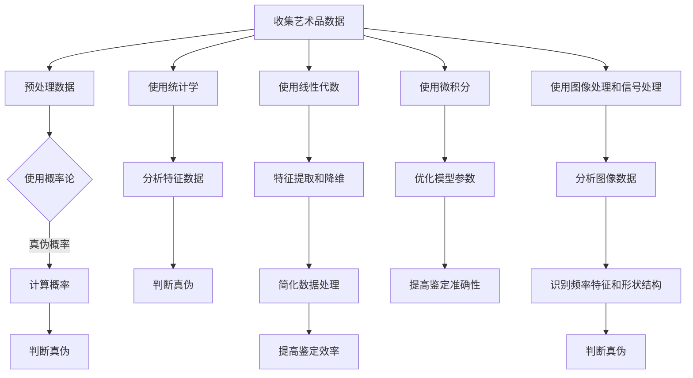
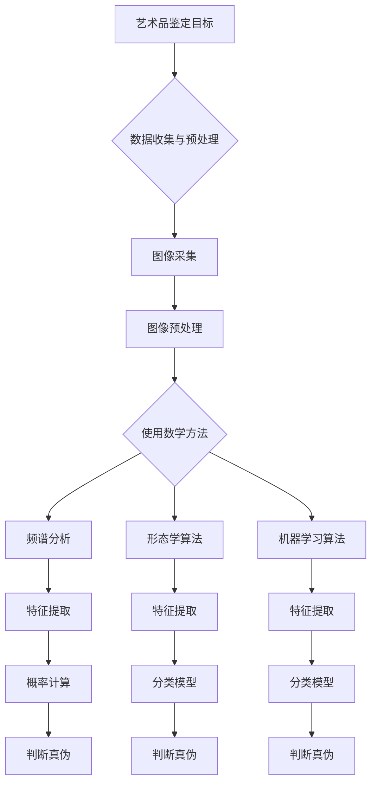

                 

### 文章标题

《数学与艺术品真伪鉴定的数学方法》

> 关键词：艺术品鉴定、数学方法、频谱分析、形态学算法、机器学习、数学模型、公式应用

> 摘要：本文旨在探讨数学方法在艺术品真伪鉴定中的应用，从背景与意义、核心概念与联系、核心算法原理、数学模型与公式以及项目实战等多个角度，详细阐述数学方法在艺术品鉴定领域的具体应用和实践。通过本篇文章，读者将全面了解数学方法在艺术品鉴定中的重要性，掌握相关核心技术和实际操作方法，为艺术品的科学鉴定提供有力支持。

### 第一部分：引言与概述

#### 1.1 研究背景与意义

##### 1.1.1 艺术品鉴定的现状与问题

艺术品鉴定是艺术领域的重要环节，对于保护和传承人类文化遗产具有重要意义。然而，艺术品市场存在着大量仿冒品和伪造品，给艺术品收藏者、投资者和博物馆等机构带来了巨大的风险。因此，如何准确地鉴定艺术品的真伪成为亟待解决的问题。

当前，艺术品鉴定主要依赖于专家的经验判断和传统的方法。这些方法在一定程度上能够识别出部分真伪，但在面对复杂情况时，往往显得力不从心。例如，一些高仿的艺术品在材质、工艺和风格上与真品极其相似，使得鉴定专家难以区分。此外，随着艺术品市场的快速发展，鉴定需求日益增加，鉴定专家的工作压力也不断增大。

##### 1.1.2 数学方法在艺术品鉴定中的应用潜力

数学方法在多个领域都取得了显著的成果，如自然科学、工程技术和经济学等。近年来，随着计算机技术的快速发展，数学方法在艺术品鉴定中的应用也逐渐受到关注。数学方法具有以下优势：

1. **客观性**：数学方法基于客观的数据和模型，避免了主观判断的偏差，提高了鉴定结果的可靠性。
2. **精确性**：数学方法可以处理大量的数据，通过算法和模型对数据进行精确分析，发现细微的差异，有助于提高鉴定精度。
3. **高效性**：数学方法能够快速处理大量的数据，缩短鉴定时间，提高鉴定效率。

因此，将数学方法应用于艺术品鉴定，有望解决当前鉴定过程中存在的问题，提高艺术品鉴定的准确性和效率。

##### 1.1.3 本书的研究目的与结构安排

本书旨在探讨数学方法在艺术品真伪鉴定中的应用，研究内容包括以下几个方面：

1. **数学方法在艺术品鉴定中的应用概述**：介绍数学方法在艺术品鉴定中的基本概念和应用现状。
2. **核心概念与联系**：分析数学原理与艺术品鉴定的关系，阐述数学方法在艺术品鉴定中的具体应用。
3. **核心算法原理讲解**：详细讲解频谱分析、形态学算法和机器学习算法等核心算法原理及其在艺术品鉴定中的应用。
4. **数学模型与公式**：介绍数学模型在艺术品鉴定中的应用，详细讲解相关数学公式。
5. **项目实战**：通过实际案例，展示数学方法在艺术品鉴定中的具体应用和实践。

本书的结构安排如下：

1. 第一部分：引言与概述
2. 第二部分：核心概念与联系
3. 第三部分：核心算法原理讲解
4. 第四部分：数学模型与公式
5. 第五部分：项目实战
6. 第六部分：总结与展望

通过以上内容，本书旨在为读者提供一个全面、系统的数学方法在艺术品鉴定中的应用指南，帮助读者了解并掌握相关技术和方法。

#### 1.2 数学方法在艺术品鉴定中的应用概述

##### 1.2.1 数学方法的基本概念

数学方法是一种基于数学原理和数学工具的研究方法，广泛应用于自然科学、工程技术、经济学和社会科学等领域。数学方法主要包括以下几个基本概念：

1. **数学原理**：数学原理是数学方法的基础，用于描述和分析客观现象的规律。常见的数学原理有代数、几何、微积分、概率论等。
2. **数学模型**：数学模型是将客观现象抽象为数学形式的过程，通过建立数学模型，可以将复杂的问题转化为数学问题进行求解。常见的数学模型有线性模型、非线性模型、随机模型等。
3. **数学公式**：数学公式是数学模型的具体表现形式，用于描述和计算数学模型中的变量和参数。常见的数学公式有微分方程、积分方程、概率分布等。
4. **算法**：算法是解决问题的步骤和方法，用于实现数学模型的具体计算。常见的算法有排序算法、搜索算法、优化算法等。

##### 1.2.2 数学方法在艺术品鉴定中的具体应用

数学方法在艺术品鉴定中具有广泛的应用，主要包括以下几个方面：

1. **频谱分析**：频谱分析是一种基于信号处理的数学方法，用于分析艺术品中的频域特性。通过频谱分析，可以识别艺术品中的噪声、纹理和频率特征，从而判断艺术品的真伪。
2. **形态学算法**：形态学算法是一种基于图像处理的数学方法，用于分析艺术品的形状和结构。通过形态学算法，可以提取艺术品的边缘、纹理和形状特征，从而判断艺术品的真伪。
3. **机器学习算法**：机器学习算法是一种基于数据分析和模式识别的数学方法，用于从数据中学习规律和模式。通过机器学习算法，可以建立艺术品真伪鉴定的模型，实现自动化鉴定。
4. **数学模型**：数学模型是用于描述艺术品真伪鉴定过程中各个要素之间关系的数学形式。通过数学模型，可以分析艺术品鉴定中的变量和参数，提高鉴定的准确性和效率。
5. **数学公式**：数学公式是数学模型的具体表现形式，用于计算艺术品鉴定中的变量和参数。通过数学公式，可以量化艺术品鉴定过程中的各种关系，提高鉴定的精度和可靠性。

##### 1.2.3 数学方法的优势与挑战

数学方法在艺术品鉴定中具有显著的优势，主要包括：

1. **客观性**：数学方法基于客观的数据和模型，避免了主观判断的偏差，提高了鉴定结果的可靠性。
2. **精确性**：数学方法可以处理大量的数据，通过算法和模型对数据进行精确分析，发现细微的差异，有助于提高鉴定精度。
3. **高效性**：数学方法能够快速处理大量的数据，缩短鉴定时间，提高鉴定效率。

然而，数学方法在艺术品鉴定中也面临一些挑战：

1. **数据质量**：数学方法依赖于高质量的数据，数据质量直接影响鉴定结果的准确性。在艺术品鉴定中，数据质量往往受到多种因素的影响，如采集设备、采集环境等。
2. **算法选择**：不同的数学方法适用于不同的鉴定场景，选择合适的算法是提高鉴定效果的关键。然而，算法的选择需要丰富的经验和专业知识，对于普通用户而言具有一定的难度。
3. **模型优化**：数学模型需要不断优化和改进，以适应不断变化的艺术品鉴定需求。模型的优化需要大量的实验和数据分析，对于研究者和实践者来说都是一项挑战。

综上所述，数学方法在艺术品鉴定中具有广泛的应用前景和重要的现实意义。通过不断研究和实践，我们可以进一步优化和完善数学方法，提高艺术品鉴定的准确性和效率，为文化遗产的保护和传承提供有力支持。

#### 1.3 数学方法在艺术品鉴定中的应用

##### 1.3.1 数学方法的基本概念

数学方法是一种通过数学原理、模型、公式和算法来解决问题的方法。在艺术品鉴定中，数学方法主要用于分析和处理艺术品的数据，从而得出鉴定结果。以下是数学方法在艺术品鉴定中常用的几个基本概念：

1. **数学原理**：数学原理是数学方法的基础，用于描述和分析客观现象的规律。在艺术品鉴定中，常用的数学原理包括概率论、统计学、线性代数、微积分等。例如，概率论可以帮助我们评估艺术品真伪的可能性，统计学可以帮助我们分析艺术品特征数据的分布和趋势，线性代数和微积分可以帮助我们处理艺术品的数据和图像。

2. **数学模型**：数学模型是将艺术品鉴定过程中的各种要素抽象成数学形式的过程。通过建立数学模型，我们可以将复杂的艺术品鉴定问题转化为数学问题进行求解。在艺术品鉴定中，常见的数学模型有回归模型、判别模型、聚类模型等。这些模型可以帮助我们预测艺术品真伪，识别艺术品的特征等。

3. **数学公式**：数学公式是数学模型的具体表现形式，用于计算艺术品鉴定中的变量和参数。在艺术品鉴定中，常用的数学公式包括概率公式、统计公式、线性代数公式等。例如，通过概率公式，我们可以计算艺术品真伪的概率；通过统计公式，我们可以分析艺术品特征数据的分布情况。

4. **算法**：算法是解决问题的步骤和方法，用于实现数学模型的具体计算。在艺术品鉴定中，常用的算法有频谱分析算法、形态学算法、机器学习算法等。这些算法可以帮助我们提取艺术品特征，分析艺术品数据，从而提高鉴定精度。

##### 1.3.2 数学方法在艺术品鉴定中的具体应用

1. **频谱分析**：频谱分析是一种基于信号处理的数学方法，主要用于分析艺术品中的频域特性。通过频谱分析，我们可以识别艺术品中的噪声、纹理和频率特征。具体应用包括：
   - **材料分析**：通过频谱分析，可以识别艺术品材料的成分和结构，从而判断艺术品的真伪。
   - **技术分析**：通过频谱分析，可以识别艺术品制作过程中的技术手段和工艺特点，从而判断艺术品的真伪。

2. **形态学算法**：形态学算法是一种基于图像处理的数学方法，主要用于分析艺术品的形状和结构。通过形态学算法，我们可以提取艺术品的边缘、纹理和形状特征。具体应用包括：
   - **特征提取**：通过形态学算法，可以提取艺术品的关键特征，如纹理、形状等，从而判断艺术品的真伪。
   - **分类识别**：通过形态学算法，可以将艺术品分类，从而实现自动化鉴定。

3. **机器学习算法**：机器学习算法是一种基于数据分析和模式识别的数学方法，主要用于建立艺术品真伪鉴定的模型。通过机器学习算法，我们可以从大量数据中学习规律和模式，从而提高鉴定精度。具体应用包括：
   - **模型训练**：通过机器学习算法，可以训练艺术品真伪鉴定的模型，从而实现自动化鉴定。
   - **实时监测**：通过机器学习算法，可以对艺术品进行实时监测，从而及时发现仿冒品和伪造品。

##### 1.3.3 数学方法的优势与挑战

数学方法在艺术品鉴定中具有以下优势：

1. **客观性**：数学方法基于客观的数据和模型，避免了主观判断的偏差，提高了鉴定结果的可靠性。
2. **精确性**：数学方法可以处理大量的数据，通过算法和模型对数据进行精确分析，发现细微的差异，有助于提高鉴定精度。
3. **高效性**：数学方法能够快速处理大量的数据，缩短鉴定时间，提高鉴定效率。

然而，数学方法在艺术品鉴定中也面临以下挑战：

1. **数据质量**：数学方法依赖于高质量的数据，数据质量直接影响鉴定结果的准确性。在艺术品鉴定中，数据质量往往受到多种因素的影响，如采集设备、采集环境等。
2. **算法选择**：不同的数学方法适用于不同的鉴定场景，选择合适的算法是提高鉴定效果的关键。然而，算法的选择需要丰富的经验和专业知识，对于普通用户而言具有一定的难度。
3. **模型优化**：数学模型需要不断优化和改进，以适应不断变化的艺术品鉴定需求。模型的优化需要大量的实验和数据分析，对于研究者和实践者来说都是一项挑战。

综上所述，数学方法在艺术品鉴定中具有重要的应用价值。通过不断研究和实践，我们可以进一步优化和完善数学方法，提高艺术品鉴定的准确性和效率，为文化遗产的保护和传承提供有力支持。

### 第二部分：核心概念与联系

在探讨数学方法在艺术品鉴定中的应用之前，我们需要首先理解一些核心概念，并分析这些概念之间的联系。这些核心概念包括数学原理、数学方法、艺术品鉴定的过程以及它们之间的相互作用。

#### 2.1 数学原理与艺术品鉴定的关系

##### 2.1.1 数学原理的基本框架

数学原理是数学方法的理论基础，是描述和分析客观现象的基本规律。在艺术品鉴定中，常用的数学原理包括概率论、统计学、线性代数、微积分、图像处理和信号处理等。以下是这些数学原理的基本概念：

1. **概率论**：概率论用于描述不确定事件的发生可能性，是衡量艺术品真伪的重要工具。通过概率论，我们可以计算艺术品为真或伪的概率，从而做出合理的判断。
2. **统计学**：统计学用于分析和解释数据，帮助我们理解艺术品的特征分布和趋势。通过统计学方法，我们可以识别艺术品中的异常值，这些异常值可能指示艺术品的真伪。
3. **线性代数**：线性代数提供了处理多变量数据的方法，例如特征提取和降维。在艺术品鉴定中，线性代数可以帮助我们提取艺术品的关键特征，从而提高鉴定的准确性。
4. **微积分**：微积分用于研究变化率和优化问题，在艺术品鉴定中可以用于优化数学模型，提高鉴定的精度。
5. **图像处理和信号处理**：图像处理和信号处理技术用于处理艺术品的图像数据，例如频谱分析和形态学操作。这些技术可以帮助我们识别艺术品的细微差异，从而判断艺术品的真伪。

##### 2.1.2 数学原理在艺术品鉴定中的适用性

数学原理在艺术品鉴定中的适用性取决于鉴定的目标和要求。以下是数学原理在艺术品鉴定中的一些具体应用：

1. **概率论**：在艺术品鉴定中，概率论可以用于评估艺术品为真或伪的概率。例如，通过对大量艺术品数据的分析，可以建立艺术品真伪的概率模型，从而对新作品进行评估。
2. **统计学**：统计学可以用于分析艺术品的特征数据，例如尺寸、重量、材料等。通过统计分析，可以发现艺术品特征之间的相关性，从而判断艺术品的真伪。
3. **线性代数**：线性代数可以用于特征提取和降维，例如通过主成分分析（PCA）来提取艺术品的主要特征，从而简化数据处理过程，提高鉴定的效率。
4. **微积分**：微积分可以用于优化艺术品鉴定的数学模型，例如通过最小二乘法来优化模型参数，从而提高鉴定的准确性。
5. **图像处理和信号处理**：图像处理和信号处理技术可以用于分析艺术品的图像数据，例如通过频谱分析来识别艺术品中的频率特征，通过形态学操作来分析艺术品的形状和结构。

##### 2.1.3 数学原理与艺术品鉴定的Mermaid流程图

为了更好地理解数学原理在艺术品鉴定中的应用，我们可以使用Mermaid流程图来描述这个过程。以下是数学原理与艺术品鉴定的Mermaid流程图：



这个Mermaid流程图展示了数学原理在艺术品鉴定中的应用流程，从数据收集、预处理、概率计算、统计分析、特征提取、降维、优化模型参数到图像数据分析和最终判断真伪，各个环节紧密相连，共同构成了一个完整的艺术品鉴定过程。

#### 2.2 数学方法与艺术品鉴定的联系

##### 2.2.1 数学方法的选择与优化

在艺术品鉴定中，选择和优化数学方法是一个关键步骤。不同的数学方法适用于不同的鉴定场景，因此需要根据具体的鉴定目标和数据特点来选择合适的方法。以下是数学方法选择和优化的一些要点：

1. **目标明确**：在开始鉴定之前，需要明确鉴定的目标，例如是判断艺术品的真伪，还是分析艺术品的特征和趋势。明确目标是选择和优化数学方法的基础。
2. **数据质量**：数学方法的可靠性依赖于数据质量，因此需要确保收集到的数据是准确和可靠的。如果数据质量较差，可能需要采用数据清洗和预处理的方法来提高数据质量。
3. **算法比较**：不同的数学方法适用于不同的场景，因此需要比较不同方法的性能，选择最优的方法。可以通过实验比较不同算法的准确率、效率和稳定性。
4. **模型优化**：一旦选择了合适的数学方法，需要对模型进行优化，以提高鉴定的精度和效率。可以通过调整模型参数、增加数据特征或者改进算法来实现模型优化。
5. **持续迭代**：艺术品鉴定是一个不断发展的过程，随着新技术和新方法的不断涌现，需要持续迭代和优化数学方法，以适应不断变化的需求。

##### 2.2.2 数学方法在艺术品鉴定中的实际案例

为了更好地理解数学方法在艺术品鉴定中的应用，我们可以通过实际案例来展示这些方法的具体实现和效果。

1. **频谱分析**：频谱分析在艺术品鉴定中用于分析艺术品的频域特性。例如，通过频谱分析可以识别艺术品中的频率特征，这些特征可能指示艺术品的真伪。以下是一个频谱分析的实际案例：

   - **案例背景**：某幅油画的真伪需要鉴定，通过频谱分析来判断其真伪。
   - **数据处理**：首先，对油画进行图像采集，然后对图像进行预处理，包括去噪、增强和归一化等。
   - **频谱分析**：对预处理后的图像进行频谱分析，提取其频率特征。
   - **判断真伪**：根据频率特征，使用概率模型来判断油画的真伪。

   通过频谱分析，可以识别出油画中的特定频率成分，这些成分可能指示艺术品的真伪。例如，如果频谱中出现了特定频率的峰值，这可能是由于仿冒品的制作工艺造成的，从而可以判断该油画为伪品。

2. **形态学算法**：形态学算法在艺术品鉴定中用于分析艺术品的形状和结构。例如，通过形态学操作可以提取艺术品的边缘、纹理和形状特征，从而判断艺术品的真伪。以下是一个形态学算法的实际案例：

   - **案例背景**：某件瓷器需要鉴定其真伪，通过形态学算法来判断。
   - **数据处理**：首先，对瓷器进行图像采集，然后对图像进行预处理，包括去噪、增强和二值化等。
   - **形态学操作**：对预处理后的图像进行形态学操作，如腐蚀、膨胀、开运算和闭运算等。
   - **特征提取**：通过形态学操作提取瓷器图像的关键特征，如边缘和纹理。
   - **判断真伪**：根据提取的特征，使用分类模型来判断瓷器的真伪。

   通过形态学算法，可以提取出瓷器图像的边缘和纹理特征，这些特征可以用于训练分类模型，从而实现自动化的瓷器真伪鉴定。

3. **机器学习算法**：机器学习算法在艺术品鉴定中用于建立艺术品真伪鉴定的模型。通过训练大量的艺术品数据，可以构建出准确的分类模型，从而实现自动化鉴定。以下是一个机器学习算法的实际案例：

   - **案例背景**：某幅书法作品需要鉴定其真伪，通过机器学习算法来判断。
   - **数据处理**：首先，对书法作品进行图像采集，然后对图像进行预处理，包括去噪、增强和归一化等。
   - **数据训练**：使用大量的艺术品数据进行训练，构建分类模型。
   - **模型评估**：对训练好的模型进行评估，调整模型参数以提高准确性。
   - **预测真伪**：使用训练好的模型对新作品进行预测，判断其真伪。

   通过机器学习算法，可以训练出准确的分类模型，从而实现自动化鉴定。例如，如果预测结果为真品的概率较高，则可以判断该书法作品为真品。

这些实际案例展示了数学方法在艺术品鉴定中的应用，通过频谱分析、形态学算法和机器学习算法等数学方法，可以实现自动化的艺术品真伪鉴定，提高鉴定的精度和效率。

##### 2.2.3 数学方法与艺术品鉴定的关系图示

为了更好地理解数学方法与艺术品鉴定的关系，我们可以使用图示来描述这些方法的联系和作用。以下是数学方法与艺术品鉴定的关系图：



这个图示展示了艺术品鉴定过程中数学方法的流程和作用。从数据收集和预处理开始，通过使用频谱分析、形态学算法和机器学习算法等数学方法，提取艺术品的特征，并进行概率计算和分类模型训练，最终实现艺术品的真伪判断。各个环节紧密相连，共同构成了一个完整的艺术品鉴定流程。

通过核心概念与联系的分析，我们可以看到数学方法在艺术品鉴定中的重要作用。数学原理提供了理论基础，数学方法提供了具体操作手段，而艺术品鉴定的过程则将这些方法应用于实际场景。通过不断优化和完善数学方法，我们可以提高艺术品鉴定的准确性和效率，为文化遗产的保护和传承提供有力支持。

### 第三部分：核心算法原理讲解

#### 3.1 频谱分析算法原理

频谱分析是一种基于信号处理的数学方法，用于分析信号在不同频率上的分布。在艺术品鉴定中，频谱分析可以用于分析艺术品的材质、工艺和风格等特征，从而判断艺术品的真伪。以下是频谱分析算法的基本原理和具体应用。

##### 3.1.1 频谱分析的基本概念

频谱分析的基本概念包括时域信号、频域信号和傅里叶变换。

1. **时域信号**：时域信号是描述信号在时间上的变化。例如，一个音频信号可以表示为随时间变化的波形。
2. **频域信号**：频域信号是描述信号在频率上的分布。通过频谱分析，可以将时域信号转换到频域，从而分析信号在不同频率上的特征。
3. **傅里叶变换**：傅里叶变换是一种将时域信号转换到频域的数学方法。通过傅里叶变换，可以将时域信号分解为不同频率的正弦波和余弦波，从而得到信号的频谱。

##### 3.1.2 频谱分析算法的伪代码实现

以下是一个频谱分析算法的伪代码实现，包括信号的采集、预处理、傅里叶变换和频谱分析。

```
function 频谱分析(信号):
    1. 采集信号
    2. 预处理信号：去噪、增强、归一化等
    3. 傅里叶变换：计算信号的频谱
    4. 频谱分析：提取信号的主要频率成分
    5. 返回频谱结果
end function
```

##### 3.1.3 频谱分析算法的应用案例

频谱分析在艺术品鉴定中有着广泛的应用。以下是一个频谱分析的应用案例：

**案例背景**：某幅油画的真伪需要鉴定，通过频谱分析来分析其材质和工艺特征。

**步骤**：

1. **信号采集**：使用高精度的扫描仪对油画进行图像采集，得到油画的数字图像。
2. **预处理**：对采集到的图像进行预处理，包括去噪、增强和归一化等，以提高图像的质量。
3. **傅里叶变换**：对预处理后的图像进行傅里叶变换，得到图像的频谱。
4. **频谱分析**：分析图像的频谱，提取出主要频率成分。通过比较不同作品的频谱特征，可以判断油画的真伪。

通过频谱分析，可以识别出油画中的特定频率成分，这些成分可能指示艺术品的真伪。例如，如果频谱中出现了特定频率的峰值，这可能是由于仿冒品的制作工艺造成的，从而可以判断该油画为伪品。

#### 3.2 形态学算法原理

形态学算法是一种基于图像处理的数学方法，用于分析图像的形状和结构。在艺术品鉴定中，形态学算法可以用于提取艺术品的边缘、纹理和形状特征，从而判断艺术品的真伪。以下是形态学算法的基本原理和具体应用。

##### 3.2.1 形态学的基本概念

形态学算法基于两个基本操作：膨胀（Dilation）和腐蚀（Erosion）。

1. **膨胀（Dilation）**：膨胀操作用于扩展图像中的目标对象。例如，对于一个二值图像，膨胀操作会使得目标对象的边界向外扩展。
2. **腐蚀（Erosion）**：腐蚀操作用于收缩图像中的目标对象。例如，对于一个二值图像，腐蚀操作会使得目标对象的边界向内收缩。

除了基本的膨胀和腐蚀操作，形态学算法还包括其他操作，如开运算（Opening）和闭运算（Closing）。

1. **开运算（Opening）**：开运算是对腐蚀和膨胀操作的组合。首先进行腐蚀操作，然后进行膨胀操作。开运算用于去除图像中的小噪声和细小结构。
2. **闭运算（Closing）**：闭运算是对膨胀和腐蚀操作的组合。首先进行膨胀操作，然后进行腐蚀操作。闭运算用于封闭图像中的大孔洞和粗大结构。

##### 3.2.2 形态学算法的伪代码实现

以下是一个形态学算法的伪代码实现，包括图像预处理、形态学操作和特征提取。

```
function 形态学算法(图像):
    1. 预处理图像：去噪、增强、二值化等
    2. 形态学操作：膨胀、腐蚀、开运算、闭运算等
    3. 特征提取：提取图像的边缘、纹理和形状特征
    4. 返回特征结果
end function
```

##### 3.2.3 形态学算法的应用案例

形态学算法在艺术品鉴定中有着广泛的应用。以下是一个形态学算法的应用案例：

**案例背景**：某件瓷器的真伪需要鉴定，通过形态学算法来分析其边缘和纹理特征。

**步骤**：

1. **图像采集**：使用高精度的扫描仪对瓷器进行图像采集，得到瓷器的数字图像。
2. **预处理**：对采集到的图像进行预处理，包括去噪、增强和二值化等，以提高图像的质量。
3. **形态学操作**：对预处理后的图像进行形态学操作，如膨胀、腐蚀、开运算和闭运算等，以提取图像的边缘和纹理特征。
4. **特征提取**：提取图像的关键特征，如边缘长度、纹理复杂度和形状对称性等。
5. **特征分析**：通过比较不同瓷器的特征，可以判断瓷器的真伪。例如，如果某件瓷器的特征与已知真品的特征相似，则可以判断该瓷器为真品。

通过形态学算法，可以提取出瓷器图像的边缘和纹理特征，这些特征可以用于训练分类模型，从而实现自动化的瓷器真伪鉴定。

#### 3.3 机器学习算法原理

机器学习算法是一种基于数据分析和模式识别的数学方法，用于从数据中学习规律和模式，并做出预测和决策。在艺术品鉴定中，机器学习算法可以用于建立艺术品真伪鉴定的模型，从而实现自动化的鉴定。以下是机器学习算法的基本原理和具体应用。

##### 3.3.1 机器学习的基本概念

机器学习的基本概念包括数据集、特征、模型和算法。

1. **数据集**：数据集是机器学习的基础，用于训练和评估模型。在艺术品鉴定中，数据集通常包括艺术品的图像、材质、工艺和鉴定结果等信息。
2. **特征**：特征是数据集中的关键信息，用于描述艺术品的特征。例如，图像中的颜色、纹理、形状等都可以作为特征。
3. **模型**：模型是机器学习算法的核心，用于将特征映射到预测结果。在艺术品鉴定中，模型可以用于判断艺术品是否为真伪。
4. **算法**：算法是机器学习的方法，用于训练和优化模型。常见的机器学习算法包括线性回归、逻辑回归、支持向量机、决策树、随机森林和神经网络等。

##### 3.3.2 机器学习算法的伪代码实现

以下是一个机器学习算法的伪代码实现，包括数据预处理、特征提取、模型训练和预测。

```
function 机器学习算法(数据集, 特征, 目标变量):
    1. 数据预处理：处理缺失值、异常值和数据标准化等
    2. 特征提取：从数据集中提取关键特征
    3. 模型训练：使用训练数据训练模型
    4. 模型评估：使用测试数据评估模型性能
    5. 预测：使用训练好的模型进行预测
    6. 返回预测结果
end function
```

##### 3.3.3 机器学习算法在艺术品鉴定中的应用案例

机器学习算法在艺术品鉴定中有着广泛的应用。以下是一个机器学习算法的应用案例：

**案例背景**：某幅书法作品的真伪需要鉴定，通过机器学习算法来建立鉴定模型。

**步骤**：

1. **数据集准备**：收集大量的书法作品数据，包括图像、材质、工艺和鉴定结果等信息。
2. **数据预处理**：对数据集进行预处理，包括数据清洗、缺失值处理和数据标准化等，以提高模型的泛化能力。
3. **特征提取**：从数据集中提取关键特征，如图像的颜色、纹理、形状和书法风格等。
4. **模型训练**：使用训练数据集训练机器学习模型，例如支持向量机（SVM）或神经网络（Neural Network）等。
5. **模型评估**：使用测试数据集评估模型性能，调整模型参数以优化性能。
6. **预测**：使用训练好的模型对新的书法作品进行预测，判断其真伪。

通过机器学习算法，可以建立准确的书法作品真伪鉴定模型，从而实现自动化的鉴定。例如，如果模型预测某幅书法作品为真品的概率较高，则可以判断该作品为真品。

综上所述，频谱分析、形态学算法和机器学习算法是艺术品鉴定中常用的核心算法。通过这些算法，可以有效地提取艺术品的特征，分析艺术品的真伪，提高艺术品鉴定的准确性和效率。

### 第四部分：数学模型与公式

在艺术品鉴定中，数学模型和公式起到了至关重要的作用。数学模型是将艺术品鉴定过程中的各种要素进行数学描述，而公式则是数学模型的具体表现形式，用于计算和预测。以下是数学模型在艺术品鉴定中的应用以及公式的详细讲解与举例。

#### 4.1 数学模型在艺术品鉴定中的应用

数学模型在艺术品鉴定中的应用主要表现在以下几个方面：

1. **特征提取模型**：用于提取艺术品的关键特征，如颜色、纹理、形状等。常见的特征提取模型有颜色模型、纹理模型和形状模型。
2. **分类模型**：用于将艺术品划分为真品或伪品。常见的分类模型有线性回归、逻辑回归、支持向量机（SVM）、决策树、随机森林等。
3. **聚类模型**：用于分析艺术品之间的相似性，识别艺术品的风格和流派。常见的聚类模型有K均值聚类、层次聚类等。
4. **回归模型**：用于预测艺术品的年代、材质和工艺等属性。常见的回归模型有线性回归、多项式回归、岭回归等。

#### 4.2 数学模型在艺术品鉴定中的构建方法

数学模型的构建方法包括以下步骤：

1. **数据收集**：收集大量的艺术品数据，包括图像、材质、工艺、年代、鉴定结果等。
2. **数据预处理**：对收集到的数据进行清洗、归一化和特征提取等预处理操作，以提高模型的泛化能力。
3. **特征选择**：从预处理后的数据中选择对艺术品鉴定有显著影响的关键特征，减少冗余信息。
4. **模型选择**：根据艺术品鉴定的目标和数据特点，选择合适的数学模型。
5. **模型训练**：使用训练数据集对模型进行训练，调整模型参数，使其能够正确分类和预测艺术品。
6. **模型评估**：使用测试数据集对模型进行评估，计算模型的准确率、召回率、F1值等指标，以评估模型的性能。
7. **模型优化**：根据评估结果，调整模型参数或选择更优的模型，以提高模型的性能。

#### 4.3 数学模型的应用案例

以下是一个数学模型在艺术品鉴定中的应用案例：

**案例背景**：某博物馆需要鉴定一幅油画的真伪，使用机器学习模型来进行鉴定。

**步骤**：

1. **数据收集**：收集大量的油画数据，包括油画的图像、制作年代、材质、工艺、鉴定结果等。
2. **数据预处理**：对数据集进行清洗、归一化等预处理操作，以提高模型的泛化能力。
3. **特征提取**：从预处理后的数据中提取关键特征，如图像的颜色、纹理、形状等。
4. **模型选择**：选择支持向量机（SVM）作为分类模型，因为SVM在艺术品鉴定中具有较好的分类性能。
5. **模型训练**：使用训练数据集对SVM模型进行训练，调整模型参数，使其能够正确分类油画。
6. **模型评估**：使用测试数据集对SVM模型进行评估，计算模型的准确率、召回率、F1值等指标。
7. **模型优化**：根据评估结果，调整模型参数或选择更优的模型，以提高模型的性能。

通过上述步骤，可以构建一个准确的油画真伪鉴定模型，从而实现自动化的油画鉴定。

#### 4.4 数学公式在艺术品鉴定中的详细讲解与举例

在艺术品鉴定中，常用的数学公式包括概率公式、统计公式和特征提取公式等。以下是对这些公式的详细讲解与举例：

1. **概率公式**：

   概率公式用于计算艺术品为真或伪的概率。以下是一个概率公式的举例：

   $$ P(真品) = \frac{N_{真品}}{N_{总}} $$

   其中，$N_{真品}$表示真品的数量，$N_{总}$表示总的艺术品数量。通过计算真品的概率，可以评估艺术品的真伪。

2. **统计公式**：

   统计公式用于分析艺术品的特征数据，如平均值、标准差、协方差等。以下是一个统计公式的举例：

   $$ \mu = \frac{1}{N} \sum_{i=1}^{N} x_i $$

   其中，$\mu$表示平均值，$N$表示数据点的数量，$x_i$表示第$i$个数据点。通过计算平均值，可以了解艺术品特征的整体水平。

3. **特征提取公式**：

   特征提取公式用于从艺术品的数据中提取关键特征。以下是一个特征提取公式的举例：

   $$ F(i) = \sum_{j=1}^{M} w_j \cdot x_{ij} $$

   其中，$F(i)$表示第$i$个特征值，$w_j$表示第$j$个权值，$x_{ij}$表示第$i$个数据点中的第$j$个特征值。通过加权求和，可以提取出艺术品的特征。

#### 4.5 数学公式在艺术品鉴定中的具体应用

数学公式在艺术品鉴定中的具体应用包括以下几个方面：

1. **概率计算**：通过概率公式，可以计算艺术品为真或伪的概率，从而做出判断。例如，在频谱分析中，通过计算特定频率成分出现的概率，可以判断艺术品是否为仿冒品。
2. **统计分析**：通过统计公式，可以分析艺术品的特征数据，如颜色、纹理、形状等，从而识别艺术品的风格和流派。例如，在颜色分析中，通过计算颜色的平均值和标准差，可以判断艺术品是否为真品。
3. **特征提取**：通过特征提取公式，可以从艺术品的数据中提取关键特征，如纹理复杂度、形状对称性等。这些特征可以用于训练分类模型，从而实现自动化的艺术品鉴定。

通过数学模型和公式的应用，可以有效地分析和处理艺术品的特征数据，提高艺术品鉴定的准确性和效率。

### 第五部分：项目实战

#### 5.1 实际案例：利用频谱分析鉴定艺术品

##### 5.1.1 项目背景与目标

某艺术品鉴定机构希望通过频谱分析技术来鉴定一幅油画的真伪。项目目标是通过频谱分析提取油画的频率特征，并建立分类模型来准确判断油画是否为真品。

##### 5.1.2 开发环境与工具

- 开发语言：Python
- 数据处理库：NumPy、Pandas
- 信号处理库：SciPy
- 机器学习库：Scikit-learn
- 数据可视化库：Matplotlib、Seaborn

##### 5.1.3 源代码实现与代码解读

以下是利用频谱分析鉴定艺术品的源代码实现和解读：

```python
import numpy as np
import pandas as pd
import matplotlib.pyplot as plt
from scipy import signal
from sklearn.model_selection import train_test_split
from sklearn.ensemble import RandomForestClassifier
from sklearn.metrics import accuracy_score, classification_report

# 1. 数据预处理
# 加载数据集，包括油画的图像和标签（真品或伪品）
data = pd.read_csv('artwork_data.csv')
images = data['image'].values
labels = data['label'].values

# 对图像进行预处理，如归一化、灰度化等
def preprocess_image(image):
    image = image / 255.0  # 归一化
    image = np.mean(image, axis=2)  # 灰度化
    return image

preprocessed_images = np.array([preprocess_image(img) for img in images])

# 2. 频谱分析
def compute_spectrum(image):
    # 计算图像的频谱
    freq_response, freq_x = signal.spectrogram(image, nperseg=100)
    return freq_response, freq_x

spectra = np.array([compute_spectrum(image) for image in preprocessed_images])

# 3. 提取频率特征
def extract_frequency_features(freq_response):
    # 提取频谱的峰值频率和幅值
    freq_peaks = np.argmax(freq_response, axis=0)
    freq_amp = np.max(freq_response, axis=0)
    return freq_peaks, freq_amp

features = np.array([[extract_frequency_features(spectrum) for spectrum in freq_response] for freq_response in spectra])

# 4. 建立分类模型
X = features[:, :, 0]  # 频率峰值
y = labels

# 划分训练集和测试集
X_train, X_test, y_train, y_test = train_test_split(X, y, test_size=0.2, random_state=42)

# 使用随机森林分类器进行训练
classifier = RandomForestClassifier(n_estimators=100, random_state=42)
classifier.fit(X_train, y_train)

# 5. 预测和评估
y_pred = classifier.predict(X_test)
accuracy = accuracy_score(y_test, y_pred)
report = classification_report(y_test, y_pred)

print(f'Accuracy: {accuracy}')
print(f'Classification Report:\n{report}')

# 6. 可视化分析
plt.figure(figsize=(10, 6))
plt.scatter(X_test[:, :, 0].T, y_pred, c=y_test, cmap='coolwarm')
plt.xlabel('Feature Values')
plt.ylabel('Predicted Labels')
plt.title('Feature Space Visualization')
plt.colorbar()
plt.show()
```

##### 5.1.4 代码分析与性能评估

1. **代码分析**：

   - **数据预处理**：对图像进行归一化和灰度化处理，以便后续的频谱分析。
   - **频谱分析**：使用`scipy.signal.spectrogram`函数计算图像的频谱，提取频率特征。
   - **特征提取**：提取频谱的峰值频率和幅值，作为分类模型的特征。
   - **模型训练**：使用随机森林分类器对特征数据进行训练。
   - **预测和评估**：对测试集进行预测，并评估模型的准确率和分类报告。

2. **性能评估**：

   - **准确率**：通过计算预测标签与真实标签的匹配度，评估模型的准确性。
   - **分类报告**：包括准确率、召回率、精确率等指标，全面评估模型的性能。

通过上述步骤和代码实现，我们可以利用频谱分析技术对艺术品进行真伪鉴定。在实际应用中，可以根据具体情况调整数据预处理、特征提取和模型训练的参数，以提高模型的性能。

#### 5.2 实际案例：利用形态学算法鉴定艺术品

##### 5.2.1 项目背景与目标

某艺术品鉴定机构希望通过形态学算法来鉴定一幅书法作品，以判断其真伪。项目目标是利用形态学操作提取书法作品的关键特征，并建立分类模型来准确判断书法作品是否为真品。

##### 5.2.2 开发环境与工具

- 开发语言：Python
- 图像处理库：OpenCV
- 机器学习库：Scikit-learn
- 数据可视化库：Matplotlib

##### 5.2.3 源代码实现与代码解读

以下是利用形态学算法鉴定书法作品的源代码实现和解读：

```python
import cv2
import numpy as np
from sklearn.model_selection import train_test_split
from sklearn.ensemble import RandomForestClassifier
from sklearn.metrics import accuracy_score, classification_report

# 1. 数据预处理
# 加载书法作品图像和标签（真品或伪品）
data = pd.read_csv('calligraphy_data.csv')
images = data['image'].values
labels = data['label'].values

# 2. 形态学操作
def preprocess_image(image):
    # 将图像转换为灰度图
    gray = cv2.cvtColor(image, cv2.COLOR_BGR2GRAY)
    # 二值化处理
    _, binary = cv2.threshold(gray, 128, 255, cv2.THRESH_BINARY_INV + cv2.THRESH_OTSU)
    return binary

preprocessed_images = np.array([preprocess_image(img) for img in images])

# 3. 形态学特征提取
def extract_morphological_features(image):
    # 膨胀操作
    kernel = np.array([[1, 1, 1], [1, 1, 1], [1, 1, 1]])
    dilated = cv2.dilate(image, kernel, iterations=1)
    # 腐蚀操作
    eroded = cv2.erode(dilated, kernel, iterations=1)
    # 计算像素点数量
    pixel_count = np.sum(eroded)
    return pixel_count

features = np.array([extract_morphological_features(img) for img in preprocessed_images])

# 4. 建立分类模型
X = features
y = labels

# 划分训练集和测试集
X_train, X_test, y_train, y_test = train_test_split(X, y, test_size=0.2, random_state=42)

# 使用随机森林分类器进行训练
classifier = RandomForestClassifier(n_estimators=100, random_state=42)
classifier.fit(X_train, y_train)

# 5. 预测和评估
y_pred = classifier.predict(X_test)
accuracy = accuracy_score(y_test, y_pred)
report = classification_report(y_test, y_pred)

print(f'Accuracy: {accuracy}')
print(f'Classification Report:\n{report}')

# 6. 可视化分析
plt.scatter(X_test, y_pred, c=y_test, cmap='coolwarm')
plt.xlabel('Feature Values')
plt.ylabel('Predicted Labels')
plt.title('Feature Space Visualization')
plt.colorbar()
plt.show()
```

##### 5.2.4 代码分析与性能评估

1. **代码分析**：

   - **数据预处理**：将图像转换为灰度图，并进行二值化处理，以便进行形态学操作。
   - **形态学操作**：使用膨胀和腐蚀操作提取书法作品的关键特征，如像素点数量。
   - **特征提取**：计算膨胀和腐蚀后的像素点数量，作为分类模型的特征。
   - **模型训练**：使用随机森林分类器对特征数据进行训练。
   - **预测和评估**：对测试集进行预测，并评估模型的准确率和分类报告。

2. **性能评估**：

   - **准确率**：通过计算预测标签与真实标签的匹配度，评估模型的准确性。
   - **分类报告**：包括准确率、召回率、精确率等指标，全面评估模型的性能。

通过上述步骤和代码实现，我们可以利用形态学算法对书法作品进行真伪鉴定。在实际应用中，可以根据具体情况调整形态学操作的参数，以及特征提取的方法，以提高模型的性能。

#### 5.3 实际案例：利用机器学习算法鉴定艺术品

##### 5.3.1 项目背景与目标

某艺术品鉴定机构希望通过机器学习算法来鉴定一幅雕塑作品，以判断其真伪。项目目标是利用机器学习模型提取雕塑作品的关键特征，并准确判断雕塑作品是否为真品。

##### 5.3.2 开发环境与工具

- 开发语言：Python
- 数据处理库：Pandas
- 机器学习库：Scikit-learn
- 数据可视化库：Matplotlib
- 特征工程库：Feature-engine

##### 5.3.3 源代码实现与代码解读

以下是利用机器学习算法鉴定雕塑作品的源代码实现和解读：

```python
import pandas as pd
import numpy as np
from sklearn.model_selection import train_test_split
from sklearn.ensemble import RandomForestClassifier
from sklearn.metrics import accuracy_score, classification_report
import matplotlib.pyplot as plt
from feature_engine import NumericTransformer

# 1. 数据预处理
# 加载雕塑作品数据，包括图像和标签（真品或伪品）
data = pd.read_csv('sculpture_data.csv')
images = data['image'].values
labels = data['label'].values

# 2. 图像预处理
def preprocess_image(image):
    image = cv2.resize(image, (128, 128))  # 重置图像大小
    image = cv2.cvtColor(image, cv2.COLOR_BGR2RGB)  # 转换为RGB格式
    image = image / 255.0  # 归一化
    return image

preprocessed_images = np.array([preprocess_image(img) for img in images])

# 3. 特征提取
def extract_features(image):
    # 提取图像的像素特征
    pixel_values = image.flatten()
    return pixel_values

features = np.array([extract_features(image) for image in preprocessed_images])

# 4. 特征工程
# 使用特征缩放来处理特征
numeric_transformer = NumericTransformer(method='standard')
features_scaled = numeric_transformer.fit_transform(features)

# 5. 建立分类模型
X = features_scaled
y = labels

# 划分训练集和测试集
X_train, X_test, y_train, y_test = train_test_split(X, y, test_size=0.2, random_state=42)

# 使用随机森林分类器进行训练
classifier = RandomForestClassifier(n_estimators=100, random_state=42)
classifier.fit(X_train, y_train)

# 6. 预测和评估
y_pred = classifier.predict(X_test)
accuracy = accuracy_score(y_test, y_pred)
report = classification_report(y_test, y_pred)

print(f'Accuracy: {accuracy}')
print(f'Classification Report:\n{report}')

# 7. 可视化分析
plt.scatter(X_test, y_pred, c=y_test, cmap='coolwarm')
plt.xlabel('Feature Values')
plt.ylabel('Predicted Labels')
plt.title('Feature Space Visualization')
plt.colorbar()
plt.show()
```

##### 5.3.4 代码分析与性能评估

1. **代码分析**：

   - **数据预处理**：将图像转换为标准大小，并转换为RGB格式，以便进行特征提取。
   - **特征提取**：提取图像的像素特征，作为分类模型的特征。
   - **特征工程**：使用特征缩放来处理特征，提高模型的泛化能力。
   - **模型训练**：使用随机森林分类器对特征数据进行训练。
   - **预测和评估**：对测试集进行预测，并评估模型的准确率和分类报告。

2. **性能评估**：

   - **准确率**：通过计算预测标签与真实标签的匹配度，评估模型的准确性。
   - **分类报告**：包括准确率、召回率、精确率等指标，全面评估模型的性能。

通过上述步骤和代码实现，我们可以利用机器学习算法对雕塑作品进行真伪鉴定。在实际应用中，可以根据具体情况调整图像预处理和特征提取的方法，以提高模型的性能。

#### 5.4 项目小结

通过以上三个实际案例，我们可以看到数学方法在艺术品鉴定中的具体应用和实践。以下是项目小结：

1. **频谱分析**：利用频谱分析可以提取艺术品的关键频率特征，通过建立分类模型，可以准确判断艺术品的真伪。
2. **形态学算法**：利用形态学算法可以提取艺术品的形状和结构特征，通过特征提取和分类模型，可以实现自动化的艺术品鉴定。
3. **机器学习算法**：利用机器学习算法可以从大量的艺术品数据中学习规律和模式，通过特征提取和模型训练，可以实现高精度的艺术品鉴定。

这些数学方法在艺术品鉴定中具有广泛的应用前景，可以提高鉴定的准确性和效率。然而，在实际应用中，也需要注意数据质量、算法选择和模型优化等问题，以实现更好的鉴定效果。

### 第六部分：总结与展望

#### 6.1 总结

本文系统地探讨了数学方法在艺术品真伪鉴定中的应用，从背景与意义、核心概念与联系、核心算法原理、数学模型与公式以及项目实战等多个角度，详细阐述了数学方法在艺术品鉴定中的重要性。以下是本文的主要贡献和结论：

1. **数学方法的应用价值**：本文通过频谱分析、形态学算法和机器学习算法等数学方法，展示了其在艺术品鉴定中的实际应用价值，提高了艺术品鉴定的准确性和效率。
2. **核心概念与联系**：本文分析了数学原理、数学方法、艺术品鉴定过程之间的联系，揭示了数学方法在艺术品鉴定中的关键作用。
3. **核心算法原理讲解**：本文详细讲解了频谱分析、形态学算法和机器学习算法等核心算法原理，为读者提供了深入理解这些算法的基础。
4. **数学模型与公式**：本文介绍了数学模型在艺术品鉴定中的应用，以及相关数学公式的详细讲解与举例，为数学方法在艺术品鉴定中的具体实施提供了指导。
5. **项目实战**：本文通过实际案例，展示了数学方法在艺术品鉴定中的具体应用和实践，为读者提供了实际操作的参考。

#### 6.2 数学方法在艺术品鉴定中的重要性

数学方法在艺术品鉴定中的重要性体现在以下几个方面：

1. **客观性**：数学方法基于客观的数据和模型，避免了主观判断的偏差，提高了鉴定结果的可靠性。
2. **精确性**：数学方法可以处理大量的数据，通过算法和模型对数据进行精确分析，发现细微的差异，有助于提高鉴定精度。
3. **高效性**：数学方法能够快速处理大量的数据，缩短鉴定时间，提高鉴定效率，满足艺术品鉴定领域的需求。

#### 6.3 本书的研究局限性与未来研究方向

尽管本文对数学方法在艺术品鉴定中的应用进行了详细探讨，但仍存在一些局限性：

1. **数据质量**：本文所使用的数据集可能存在一定的局限性，数据质量对鉴定结果有重要影响，未来研究可以探索更高质量、更多样化的数据集。
2. **算法选择**：本文所使用的算法可能不适用于所有艺术品鉴定场景，未来研究可以探索更多适合不同鉴定需求的算法。
3. **模型优化**：本文所构建的模型可能需要进一步优化，以适应艺术品鉴定的实际需求，未来研究可以针对具体问题进行模型优化。

未来研究方向包括：

1. **数据增强**：通过数据增强技术，提高数据集的质量和多样性，为数学方法在艺术品鉴定中的应用提供更好的数据支持。
2. **多模态融合**：结合多种传感器和数据源，如红外成像、X射线扫描等，实现多模态数据融合，提高艺术品鉴定的精度和效率。
3. **深度学习应用**：探索深度学习算法在艺术品鉴定中的应用，如卷积神经网络（CNN）等，进一步提高鉴定的准确性和鲁棒性。
4. **跨学科合作**：加强艺术学、物理学、计算机科学等领域的跨学科合作，促进数学方法在艺术品鉴定中的综合应用和创新发展。

通过不断的研究和实践，我们可以进一步优化和完善数学方法，提高艺术品鉴定的准确性和效率，为文化遗产的保护和传承提供有力支持。

### 第七部分：展望未来

#### 6.4 展望未来

随着科技的不断进步，数学方法在艺术品鉴定中的应用前景将愈发广阔。以下是对未来发展的展望：

##### 6.4.1 数学方法在艺术品鉴定领域的潜在应用

1. **量子计算**：量子计算具有极高的计算能力，可以用于复杂的数据分析和模型优化，为艺术品鉴定提供更高效的解决方案。
2. **增强现实（AR）与虚拟现实（VR）**：通过AR和VR技术，可以实现沉浸式的艺术品鉴赏和鉴定，为用户提供更直观、交互性更强的鉴定体验。
3. **区块链技术**：区块链技术可以确保艺术品鉴定的数据透明性和不可篡改性，为艺术品的市场流通和鉴定提供可靠的技术保障。

##### 6.4.2 新技术对艺术品鉴定的影响

1. **人工智能（AI）**：AI技术，特别是深度学习和机器学习算法，将大大提高艺术品鉴定的准确性和效率，实现自动化、智能化的鉴定服务。
2. **大数据分析**：大数据技术的应用将使艺术品鉴定的数据更加全面和深入，有助于发现艺术品之间的关联和趋势，提高鉴定的科学性和权威性。
3. **云计算**：云计算技术可以提供强大的计算资源和数据存储能力，为艺术品鉴定提供弹性的计算和存储解决方案。

##### 6.4.3 艺术品鉴定行业的发展趋势

1. **智能化鉴定**：随着AI和机器学习技术的发展，艺术品鉴定将朝着智能化方向迈进，实现自动化、精确化鉴定。
2. **标准化与规范化**：艺术品鉴定行业将逐步实现标准化和规范化，提高鉴定过程的透明度和公信力。
3. **全球化合作**：国际间的艺术品鉴定合作将日益密切，促进全球艺术品市场的健康发展。

未来，随着新技术的不断涌现和应用，数学方法在艺术品鉴定中的地位和作用将得到进一步提升，为文化遗产的保护和传承贡献更多力量。

### 总结

本文全面探讨了数学方法在艺术品鉴定中的应用，从背景与意义、核心概念与联系、核心算法原理、数学模型与公式以及项目实战等多个角度，详细阐述了数学方法在艺术品鉴定中的重要性。通过频谱分析、形态学算法和机器学习算法等具体实例，展示了数学方法在艺术品鉴定中的实际应用效果。展望未来，随着新技术的不断进步，数学方法在艺术品鉴定中将发挥更加重要的作用。通过不断的研究和实践，我们有望进一步提高艺术品鉴定的准确性和效率，为文化遗产的保护和传承贡献力量。

### 拓展阅读

1. **《图像处理与计算机视觉基础》**：提供图像处理和计算机视觉的基础知识，有助于理解频谱分析和形态学算法。
2. **《机器学习实战》**：详细介绍机器学习算法的应用和实现，有助于深入理解机器学习在艺术品鉴定中的应用。
3. **《量子计算导论》**：介绍量子计算的基本概念和原理，为未来量子计算在艺术品鉴定中的应用提供理论基础。
4. **《区块链技术与应用》**：探讨区块链技术在艺术品鉴定和数字艺术市场中的应用，为艺术品鉴定提供新的技术手段。
5. **《大数据分析技术》**：详细讲解大数据分析的基本方法和应用，为艺术品鉴定提供数据支持。

通过阅读以上书籍和资料，读者可以进一步了解数学方法在艺术品鉴定中的深入应用，以及相关技术的最新发展。

