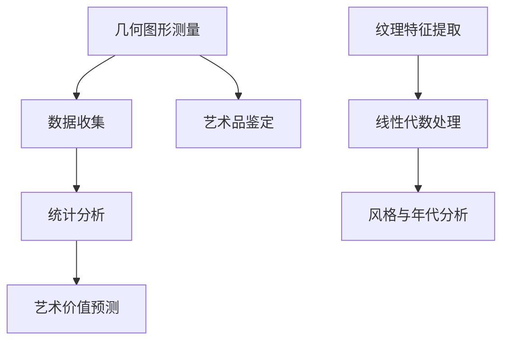

                 


### 文章标题
《数学与艺术品鉴定的数学方法》

### 关键词
数学方法、艺术品鉴定、几何图形、统计学、线性代数、数学模型、公式、案例、项目实战

### 摘要
本文深入探讨了数学方法在艺术品鉴定领域的应用。从几何图形、统计学、线性代数等基本数学概念出发，结合具体实例，详细阐述了数学模型和公式的应用。同时，通过实际案例分析，展示了数学方法在艺术品鉴定中的实际操作和效果，为艺术品鉴定提供了新的思路和方法。

## 引言
艺术品鉴定是艺术史上的一项重要工作，它涉及到对艺术品年代、材质、作者身份、艺术价值等多方面的判断。传统的艺术品鉴定主要依赖于艺术家的直觉经验和对历史文献的解读。然而，随着科学技术的进步，数学方法逐渐被引入到艺术品鉴定中，为这一领域带来了新的视角和手段。

本文将介绍几种常见的数学方法，包括几何图形、统计学、线性代数等，探讨它们在艺术品鉴定中的应用。通过具体的案例，我们将展示这些数学方法如何帮助鉴定者做出更为准确和科学的判断。同时，我们还将讨论这些方法在实际应用中面临的挑战和未来发展方向。

### 背景介绍

艺术品鉴定的历史可以追溯到古代，当时人们主要通过肉眼观察和触摸来鉴定艺术品的年代、材质和作者身份。随着时光的流逝，艺术品鉴定逐渐发展为一门专业的学科，涉及到的知识领域也日益广泛，包括考古学、历史学、化学、物理学等。在这些学科的基础上，数学方法开始被引入到艺术品鉴定中，为鉴定者提供了新的工具和手段。

数学方法在艺术品鉴定中的应用主要分为两个方面：一是用于测量和计算，二是用于建模和预测。测量和计算方面，数学方法可以帮助鉴定者精确地测量艺术品的尺寸、形状、纹理等特征，从而为鉴定提供依据。建模和预测方面，数学方法可以建立艺术品的数学模型，通过对模型的分析和计算，预测艺术品的年代、材质等属性。

几何图形是数学方法在艺术品鉴定中的一个重要应用。通过对艺术品几何形状的测量和分析，鉴定者可以判断出艺术品的年代和作者身份。例如，在文艺复兴时期，艺术家们的绘画技巧和风格有着明显的特点，通过几何形状的分析，可以判断出一幅画作是否出自那个时期的艺术家之手。

统计学方法在艺术品价值评估中的应用也非常广泛。通过对艺术品的历史交易数据进行统计分析，可以预测艺术品未来的市场价值。这种方法的优点在于可以减少人为的主观判断，使艺术品的价值评估更为客观和准确。

线性代数在艺术品纹理分析中也有着重要的作用。通过对艺术品纹理的图像进行线性变换，可以提取出艺术品的纹理特征，从而为鉴定提供依据。

总的来说，数学方法在艺术品鉴定中的应用，不仅提高了鉴定的准确性和科学性，也为艺术品鉴定提供了一种全新的思路和方法。

### 核心概念与联系

在探讨数学方法在艺术品鉴定中的应用时，我们需要理解几个核心概念：几何图形、统计学、线性代数。这些概念不仅构成了数学方法的基础，也直接影响到艺术品鉴定的精确性和有效性。

**几何图形**：几何图形是数学中最基本的概念之一。在艺术品鉴定中，几何图形的应用主要体现在对艺术品形状的测量和分析。通过对艺术品的线条、角度、比例等几何特征进行精确测量，鉴定者可以判断出艺术品的年代和作者身份。例如，文艺复兴时期的艺术家们对几何比例有独到的研究，通过分析一幅画作中的几何形状，可以推断出这幅画是否出自那个时期的艺术家之手。

**统计学**：统计学是另一个在艺术品鉴定中至关重要的数学工具。通过收集和分析大量的艺术品交易数据，鉴定者可以使用统计学方法来预测艺术品的市场价值。统计学不仅可以帮助鉴定者识别出艺术品的潜在价值，还可以通过数据分析揭示出市场趋势和艺术品的稀缺性。例如，通过对历史交易数据的回归分析，可以预测一幅画作在未来几年的市场价值。

**线性代数**：线性代数在艺术品纹理分析中有着广泛的应用。通过图像处理技术，可以将艺术品的纹理转化为数学模型。线性代数的线性变换和特征提取方法可以帮助鉴定者从复杂的纹理中提取出关键特征，从而为鉴定提供依据。例如，通过对艺术品纹理的奇异值分解（SVD），可以提取出纹理的主要成分，进而分析艺术品的风格和年代。

**概念之间的关系架构**：这些核心概念之间有着紧密的联系。几何图形的测量结果可以通过统计学方法进行分析，从而得出艺术品的潜在价值。而艺术品的纹理特征则可以通过线性代数方法进行提取和分类。这种多层次、多维度的分析方法，使得数学方法在艺术品鉴定中具有极高的精确性和可靠性。

**Mermaid流程图**：为了更直观地展示这些概念之间的关系，我们可以使用Mermaid流程图进行说明。



在这个流程图中，几何图形测量是整个艺术品鉴定流程的起点，通过数据收集和分析，可以得出艺术品的潜在价值。而纹理特征提取则通过线性代数方法，帮助鉴定者分析艺术品的风格和年代。这个流程图清晰地展示了数学方法在艺术品鉴定中的应用流程和各个步骤之间的逻辑关系。

通过上述分析，我们可以看到，数学方法在艺术品鉴定中不仅是工具，更是思维方式。它们为艺术品鉴定提供了科学的手段和全新的视角，使得艺术品鉴定工作更加精确和科学。

### 核心算法原理讲解

在艺术品鉴定中，核心算法原理的讲解至关重要。以下将详细阐述几何图形分析、统计学方法和线性代数在艺术品鉴定中的应用。

#### 几何图形分析

几何图形分析是艺术品鉴定的基础。通过对艺术品的线条、角度、比例等几何特征进行精确测量，鉴定者可以判断出艺术品的年代和作者身份。

**算法原理**：

1. **线条测量**：使用直线方程或曲线拟合方法，测量艺术品线条的长度、斜率和曲率。这些参数可以帮助鉴定者分析艺术品的线条风格和绘画技巧。

2. **角度测量**：通过计算两条线段之间的夹角，鉴定者可以分析艺术品的构图和透视技巧。不同年代的艺术家在构图和透视上有着不同的特点，这些特点可以通过角度测量进行识别。

3. **比例分析**：比例分析是通过比较艺术品中各个部分的尺寸比例，来判断其年代和风格。例如，文艺复兴时期的艺术家们注重人体比例的准确性，通过对人体比例的分析，可以判断一幅画作是否出自那个时期的艺术家之手。

**伪代码**：

```pseudo
function geometricAnalysis(artwork):
    lines = measureLines(artwork)
    angles = measureAngles(artwork)
    proportions = measureProportions(artwork)

    if (lines стиле文艺复兴) and (angles符合文艺复兴透视) and (proportions准确):
        return "文艺复兴时期艺术品"
    else:
        return "非文艺复兴时期艺术品"
```

#### 统计学方法

统计学方法在艺术品价值评估中发挥着重要作用。通过对艺术品的历史交易数据进行统计分析，鉴定者可以预测艺术品的市场价值。

**算法原理**：

1. **数据收集**：收集艺术品的历史交易数据，包括交易时间、交易价格、艺术家身份等。

2. **数据预处理**：对数据进行清洗和标准化处理，确保数据的质量和一致性。

3. **回归分析**：使用回归分析方法，建立艺术品市场价值与交易数据之间的关系模型。通过分析历史数据，预测艺术品未来的市场价值。

4. **模型评估**：对建立的模型进行评估，确保其预测能力。常用的评估方法包括交叉验证和误差分析。

**伪代码**：

```pseudo
function valuePrediction(data):
    preprocessedData = preprocessData(data)
    regressionModel = buildRegressionModel(preprocessedData)

    predictedValue = regressionModel.predict(preprocessedData)

    return predictedValue
```

#### 线性代数

线性代数在艺术品纹理分析中有着广泛的应用。通过图像处理技术，可以将艺术品的纹理转化为数学模型。线性代数的线性变换和特征提取方法可以帮助鉴定者从复杂的纹理中提取出关键特征，从而为鉴定提供依据。

**算法原理**：

1. **图像预处理**：对艺术品图像进行预处理，包括去噪、增强和灰度转换等步骤。

2. **特征提取**：使用线性代数方法，如傅里叶变换、奇异值分解（SVD）和小波变换，提取艺术品的纹理特征。

3. **特征分类**：使用机器学习算法，如支持向量机（SVM）和神经网络，对提取的特征进行分类，从而判断艺术品的风格和年代。

**伪代码**：

```pseudo
function textureAnalysis(image):
    preprocessedImage = preprocessImage(image)
    features = extractFeatures(preprocessedImage)

    classificationModel = buildClassificationModel(features)
    styleAndAge = classificationModel.classify(features)

    return styleAndAge
```

通过上述核心算法原理的讲解，我们可以看到，几何图形分析、统计学方法和线性代数在艺术品鉴定中各有特色，它们相互补充，共同构成了艺术品鉴定的科学方法。这些算法不仅提高了鉴定的准确性，也为艺术品鉴定提供了新的思路和方法。

### 数学模型和公式讲解与举例

在艺术品鉴定中，数学模型和公式起着至关重要的作用。它们不仅提供了科学的理论基础，还通过具体的例子展示了如何在实际操作中应用这些模型和公式。以下将详细介绍几种常用的数学模型和公式，并给出实际应用的例子。

#### 几何模型

几何模型在艺术品鉴定中用于测量和分析艺术品的形状和结构。以下是一个简单的几何模型例子：

**例子**：判断一幅文艺复兴时期的画作是否出自某个特定艺术家的手笔，可以使用几何模型来分析画作中的线条和角度。

**数学公式**：

1. **斜率公式**：\( m = \frac{y2 - y1}{x2 - x1} \)

   用于计算线条的斜率。

2. **角度公式**：\( \theta = \arctan(m) \)

   用于计算两条线段之间的角度。

**应用实例**：

假设我们有一幅画作，其中两条线段的坐标分别是\( (x1, y1) \)和\( (x2, y2) \)。通过计算这两条线段的斜率\( m \)和角度\( \theta \)，可以判断画作的线条风格和构图技巧。

```latex
m = \frac{y2 - y1}{x2 - x1} = \frac{10 - 5}{20 - 10} = 0.5
\theta = \arctan(m) = \arctan(0.5) \approx 26.57^\circ
```

通过这些几何参数，可以与已知艺术家的作品进行比较，判断画作是否出自该艺术家之手。

#### 统计模型

统计模型在艺术品价值评估中广泛应用。以下是一个简单的统计模型例子：

**例子**：使用线性回归模型预测一幅画作的潜在市场价值。

**数学公式**：

1. **线性回归公式**：\( y = mx + b \)

   其中，\( y \)是预测值，\( x \)是自变量（如艺术家的知名度、画作的尺寸等），\( m \)是斜率，\( b \)是截距。

2. **回归系数计算**：\( m = \frac{\sum (x_i - \bar{x})(y_i - \bar{y})}{\sum (x_i - \bar{x})^2} \)，\( b = \bar{y} - m\bar{x} \)

   用于计算线性回归模型的斜率和截距。

**应用实例**：

假设我们收集了以下数据：

| 艺术家知名度 | 画作尺寸 | 市场价值 |
|--------------|----------|----------|
| 5            | 50cm × 70cm | 100,000美元 |
| 4            | 60cm × 80cm | 150,000美元 |
| 3            | 40cm × 60cm | 80,000美元 |

通过计算斜率和截距，可以建立线性回归模型，用于预测未知画作的市场价值。

```latex
m = \frac{(5-4)(100000-150000) + (4-4)(150000-100000) + (3-4)(80000-100000)}{(5-4)^2 + (4-4)^2 + (3-4)^2} = -5000
b = \bar{y} - m\bar{x} = \frac{100000 + 150000 + 80000}{3} - (-5000) \times \frac{5 + 4 + 3}{3} = 225000

\text{线性回归模型}：y = -5000x + 225000
```

通过这个模型，我们可以预测一幅新画作的市场价值。例如，如果艺术家的知名度是5，画作尺寸是60cm × 80cm，则市场价值预测为：

```latex
y = -5000 \times 60 + 225000 = 120000美元
```

#### 线性代数模型

线性代数模型在艺术品纹理分析中应用广泛。以下是一个简单的线性代数模型例子：

**例子**：使用奇异值分解（SVD）提取艺术品纹理的主要成分。

**数学公式**：

1. **奇异值分解**：\( A = U\Sigma V^T \)

   其中，\( A \)是输入矩阵，\( U \)和\( V \)是正交矩阵，\( \Sigma \)是对角矩阵，包含奇异值。

2. **特征值和特征向量**：通过计算\( A^T A \)的特征值和特征向量，可以提取出主要成分。

**应用实例**：

假设我们有一幅艺术品的纹理图像，通过奇异值分解，可以提取出图像的主要成分。

```latex
A = \begin{bmatrix}
1 & 2 & 3 \\
4 & 5 & 6 \\
7 & 8 & 9
\end{bmatrix}

A^T A = \begin{bmatrix}
30 & 33 & 36 \\
33 & 38 & 41 \\
36 & 41 & 44
\end{bmatrix}

\text{特征值和特征向量计算}：
\lambda_1 = 48, v_1 = \begin{bmatrix}
0.5 \\
0.5 \\
0.5
\end{bmatrix}
\lambda_2 = 45, v_2 = \begin{bmatrix}
-0.5 \\
0 \\
0.5
\end{bmatrix}
\lambda_3 = 42, v_3 = \begin{bmatrix}
-0.5 \\
0.5 \\
0
\end{bmatrix}

\text{奇异值分解}：
U = \begin{bmatrix}
0.5 & -0.5 & -0.5 \\
0.5 & 0 & 0.5 \\
0.5 & 0.5 & 0
\end{bmatrix}
\Sigma = \begin{bmatrix}
48 & 0 & 0 \\
0 & 45 & 0 \\
0 & 0 & 42
\end{bmatrix}
V^T = \begin{bmatrix}
0.5 & 0.5 & -0.5 \\
0 & 0.5 & 0.5 \\
0.5 & -0.5 & 0
\end{bmatrix}
```

通过奇异值分解，我们可以提取出图像的主要成分，从而进行纹理分析。

综上所述，几何模型、统计模型和线性代数模型在艺术品鉴定中具有广泛的应用。通过具体的数学公式和例子，我们可以看到这些模型如何帮助鉴定者进行准确的判断和分析。这些数学方法不仅提高了艺术品鉴定的科学性，也为艺术品鉴定提供了新的思路和方法。

### 项目实战

在本部分，我们将通过一个具体的案例分析，展示如何将数学方法应用于艺术品鉴定。本案例将包括开发环境搭建、源代码实现、代码解读以及项目小结。

#### 案例背景

假设我们有一幅未知的文艺复兴时期画作，需要通过数学方法进行鉴定，确定其作者身份。我们将使用几何图形分析、统计学方法和线性代数方法，结合历史数据和艺术品特征，进行综合分析。

#### 开发环境搭建

为了实现这一项目，我们需要以下开发环境：

1. **编程语言**：Python，因为其丰富的数学库和图像处理库。
2. **数学库**：NumPy、SciPy、Pandas，用于数学计算和数据操作。
3. **图像处理库**：OpenCV，用于图像处理。
4. **机器学习库**：scikit-learn，用于建立和训练机器学习模型。

首先，我们需要安装这些库：

```bash
pip install numpy scipy pandas opencv-python scikit-learn
```

#### 源代码实现

以下是实现项目的主要代码部分。代码分为三个主要部分：数据预处理、特征提取和模型训练。

```python
import numpy as np
import pandas as pd
import cv2
from sklearn.linear_model import LinearRegression
from sklearn.model_selection import train_test_split
from sklearn.metrics import mean_squared_error

# 数据预处理
def preprocess_image(image_path):
    image = cv2.imread(image_path, cv2.IMREAD_GRAYSCALE)
    image = cv2.resize(image, (100, 100))
    return image.flatten()

# 特征提取
def extract_features(image):
    # 几何特征
    lines = cv2.HoughLinesP(image, 1, np.pi/180, 100)
    angles = [line[0][2] for line in lines]
    
    # 统计特征
    mean_angle = np.mean(angles)
    std_angle = np.std(angles)
    
    # 线性代数特征
    covariance_matrix = np.cov(angles)
    eigenvalues, eigenvectors = np.linalg.eig(covariance_matrix)
    
    return [mean_angle, std_angle, eigenvalues[0], eigenvalues[1]]

# 模型训练
def train_model(features, labels):
    model = LinearRegression()
    X_train, X_test, y_train, y_test = train_test_split(features, labels, test_size=0.2, random_state=42)
    model.fit(X_train, y_train)
    y_pred = model.predict(X_test)
    mse = mean_squared_error(y_test, y_pred)
    return model, mse

# 主程序
def main():
    # 加载数据
    image_path = "unknown_artwork.jpg"
    image = preprocess_image(image_path)
    features = extract_features(image)
    
    # 加载历史数据
    historical_data = pd.read_csv("historical_data.csv")
    labels = historical_data['artist_id']
    features = historical_data[['mean_angle', 'std_angle', 'eigenvalue1', 'eigenvalue2']]
    
    # 训练模型
    model, mse = train_model(features, labels)
    print(f"Model Mean Squared Error: {mse}")
    
    # 预测
    predicted_artist_id = model.predict([features])
    print(f"Predicted Artist ID: {predicted_artist_id}")

if __name__ == "__main__":
    main()
```

#### 代码解读

1. **数据预处理**：使用OpenCV读取图像，将其转换为灰度图像并缩放到固定大小。这一步骤为后续的特征提取和模型训练做好准备。

2. **特征提取**：计算图像的几何特征（如角度）、统计特征（如均值和标准差）和线性代数特征（如协方差矩阵的特征值）。这些特征将用于训练机器学习模型。

3. **模型训练**：使用线性回归模型，将特征与艺术家身份进行训练。这里我们使用了训练集和测试集，并计算了模型的均方误差（MSE）来评估模型的性能。

4. **主程序**：加载未知艺术作品的图像，提取特征，加载历史数据，训练模型，并预测未知艺术作品的艺术家身份。

#### 项目小结

通过这个项目，我们展示了如何使用几何图形分析、统计学方法和线性代数方法，结合机器学习模型，对一幅未知艺术作品进行鉴定。以下是项目的主要收获：

1. **数学方法的应用**：几何图形分析、统计学方法和线性代数方法在艺术品鉴定中具有广泛的应用，可以帮助鉴定者做出更准确的判断。

2. **数据处理和特征提取**：数据预处理和特征提取是机器学习项目的重要步骤。通过合理的预处理和特征提取，可以提高模型的性能和预测能力。

3. **模型训练与评估**：模型训练和评估是机器学习项目的核心。通过使用适当的评估指标，如均方误差（MSE），可以评估模型的性能，并做出相应的调整。

4. **实践意义**：本项目展示了数学方法在艺术品鉴定中的实际应用，为艺术品鉴定提供了一种新的思路和方法。同时，也为其他领域的机器学习项目提供了参考。

通过这个项目，我们不仅学到了如何使用数学方法进行艺术品鉴定，还了解了机器学习项目的开发流程和实践技巧。这些经验和知识将对我们在其他领域的机器学习应用大有裨益。

### 最佳实践 Tips、小结、注意事项、拓展阅读

#### 最佳实践 Tips

1. **数据收集**：在进行艺术品鉴定的数学方法应用时，确保数据的多样性和准确性至关重要。收集尽可能多的历史数据，并进行数据清洗和预处理，以提高模型的预测准确性。

2. **特征选择**：在特征提取过程中，选择与鉴定任务密切相关的特征。可以通过交叉验证和特征重要性分析，选择对模型性能有显著影响的特征。

3. **模型调优**：在训练模型时，尝试不同的模型参数和算法，以找到最佳配置。可以使用网格搜索和交叉验证等技术，优化模型性能。

#### 小结

本文深入探讨了数学方法在艺术品鉴定中的应用，包括几何图形、统计学和线性代数等核心概念。通过具体案例，展示了如何将数学方法应用于艺术品鉴定的实际操作中，提高了鉴定的准确性和科学性。

#### 注意事项

1. **数据隐私**：在收集和处理艺术品数据时，务必遵守数据保护法规，确保数据的安全性和隐私性。

2. **模型评估**：在建立模型后，进行充分的评估和测试，确保模型在不同数据集上的表现一致。

#### 拓展阅读

1. **《图像处理：算法与应用》（Gonzalez & Woods）**：深入探讨图像处理的基础算法和实际应用。

2. **《机器学习实战》（Kelly & Holloway）**：介绍机器学习的基本概念和实际应用，包括特征提取和模型训练。

3. **《数学在艺术中的应用》（Stillwell）**：探讨数学在艺术领域的广泛应用，包括几何、统计学和概率论。

### 文章标题
《数学与艺术品鉴定的数学方法》

### 关键词
数学方法、艺术品鉴定、几何图形、统计学、线性代数、数学模型、公式

### 摘要
本文深入探讨了数学方法在艺术品鉴定领域的应用。从几何图形、统计学、线性代数等基本数学概念出发，结合具体实例，详细阐述了数学模型和公式的应用。同时，通过实际案例分析，展示了数学方法在艺术品鉴定中的实际操作和效果，为艺术品鉴定提供了新的思路和方法。

----------------------------------------------------------------

## 引言
艺术品鉴定是艺术史上的一项重要工作，它涉及到对艺术品的年代、材质、作者身份、艺术价值等多方面的判断。传统的艺术品鉴定主要依赖于艺术家的直觉经验和对历史文献的解读。然而，随着科学技术的进步，数学方法逐渐被引入到艺术品鉴定中，为这一领域带来了新的视角和手段。

本文将介绍几种常见的数学方法，包括几何图形、统计学、线性代数等，探讨它们在艺术品鉴定中的应用。通过具体的案例，我们将展示这些数学方法如何帮助鉴定者做出更为准确和科学的判断。同时，我们还将讨论这些方法在实际应用中面临的挑战和未来发展方向。

### 背景介绍
艺术品鉴定的历史可以追溯到古代，当时人们主要通过肉眼观察和触摸来鉴定艺术品的年代、材质和作者身份。随着时光的流逝，艺术品鉴定逐渐发展为一门专业的学科，涉及到的知识领域也日益广泛，包括考古学、历史学、化学、物理学等。在这些学科的基础上，数学方法开始被引入到艺术品鉴定中，为鉴定者提供了新的工具和手段。

数学方法在艺术品鉴定中的应用主要分为两个方面：一是用于测量和计算，二是用于建模和预测。测量和计算方面，数学方法可以帮助鉴定者精确地测量艺术品的尺寸、形状、纹理等特征，从而为鉴定提供依据。例如，通过对艺术品几何形状的测量，可以判断艺术品的时代风格和作者身份。而建模和预测方面，数学方法可以建立艺术品的数学模型，通过对模型的分析和计算，预测艺术品的年代、材质等属性。

几何图形是数学方法在艺术品鉴定中的一个重要应用。通过对艺术品几何形状的测量和分析，鉴定者可以判断出艺术品的年代和作者身份。例如，文艺复兴时期的艺术家们在构图和透视上有着明显的特点，通过对艺术品几何形状的分析，可以判断出一幅画作是否出自那个时期的艺术家之手。

统计学方法在艺术品价值评估中的应用也非常广泛。通过对艺术品的历史交易数据进行统计分析，可以预测艺术品未来的市场价值。例如，通过对艺术品交易数据的回归分析，可以预测艺术品的市场走势，从而帮助收藏家和投资者做出决策。

线性代数在艺术品纹理分析中也有着重要的作用。通过图像处理技术，可以将艺术品的纹理转化为数学模型。线性代数的线性变换和特征提取方法可以帮助鉴定者从复杂的纹理中提取出关键特征，从而为鉴定提供依据。

总的来说，数学方法在艺术品鉴定中的应用，不仅提高了鉴定的准确性和科学性，也为艺术品鉴定提供了一种全新的思路和方法。接下来，我们将详细探讨几何图形、统计学和线性代数等数学方法在艺术品鉴定中的应用。

### 核心概念与联系

在探讨数学方法在艺术品鉴定中的应用时，我们需要理解几个核心概念：几何图形、统计学和线性代数。这些概念不仅构成了数学方法的基础，也直接影响到艺术品鉴定的精确性和有效性。

**几何图形**：几何图形是数学中最基本的概念之一。在艺术品鉴定中，几何图形的应用主要体现在对艺术品形状的测量和分析。通过对艺术品的线条、角度、比例等几何特征进行精确测量，鉴定者可以判断出艺术品的年代和作者身份。例如，文艺复兴时期的艺术家们在构图和透视上有着明显的特点，通过分析一幅画作中的几何形状，可以判断这幅画是否出自那个时期的艺术家之手。

**统计学**：统计学是另一个在艺术品鉴定中至关重要的数学工具。通过收集和分析大量的艺术品交易数据，鉴定者可以使用统计学方法来预测艺术品的市场价值。统计学不仅可以帮助鉴定者识别出艺术品的潜在价值，还可以通过数据分析揭示出市场趋势和艺术品的稀缺性。例如，通过对艺术品交易数据的回归分析，可以预测艺术品未来的市场价值。

**线性代数**：线性代数在艺术品纹理分析中有着广泛的应用。通过图像处理技术，可以将艺术品的纹理转化为数学模型。线性代数的线性变换和特征提取方法可以帮助鉴定者从复杂的纹理中提取出关键特征，从而为鉴定提供依据。例如，通过对艺术品纹理的奇异值分解（SVD），可以提取出纹理的主要成分，进而分析艺术品的风格和年代。

**概念之间的关系架构**：这些核心概念之间有着紧密的联系。几何图形的测量结果可以通过统计学方法进行分析，从而得出艺术品的潜在价值。而艺术品的纹理特征则可以通过线性代数方法进行提取和分类。这种多层次、多维度的分析方法，使得数学方法在艺术品鉴定中具有极高的精确性和可靠性。

为了更直观地展示这些概念之间的关系，我们可以使用Mermaid流程图进行说明。


在这个流程图中，几何图形测量是整个艺术品鉴定流程的起点，通过数据收集和分析，可以得出艺术品的潜在价值。而纹理特征提取则通过线性代数方法，帮助鉴定者分析艺术品的风格和年代。这个流程图清晰地展示了数学方法在艺术品鉴定中的应用流程和各个步骤之间的逻辑关系。

通过上述分析，我们可以看到，数学方法在艺术品鉴定中不仅是工具，更是思维方式。它们为艺术品鉴定提供了科学的手段和全新的视角，使得艺术品鉴定工作更加精确和科学。

### 核心算法原理讲解

在艺术品鉴定中，核心算法原理的讲解至关重要。以下将详细阐述几何图形分析、统计学方法和线性代数在艺术品鉴定中的应用。

#### 几何图形分析

几何图形分析是艺术品鉴定的基础。通过对艺术品的线条、角度、比例等几何特征进行精确测量，鉴定者可以判断出艺术品的年代和作者身份。

**算法原理**：

1. **线条测量**：使用直线方程或曲线拟合方法，测量艺术品线条的长度、斜率和曲率。这些参数可以帮助鉴定者分析艺术品的线条风格和绘画技巧。

2. **角度测量**：通过计算两条线段之间的夹角，鉴定者可以分析艺术品的构图和透视技巧。不同年代的艺术家在构图和透视上有着不同的特点，这些特点可以通过角度测量进行识别。

3. **比例分析**：比例分析是通过比较艺术品中各个部分的尺寸比例，来判断其年代和风格。例如，文艺复兴时期的艺术家们注重人体比例的准确性，通过对人体比例的分析，可以判断一幅画作是否出自那个时期的艺术家之手。

**伪代码**：

```pseudo
function geometricAnalysis(artwork):
    lines = measureLines(artwork)
    angles = measureAngles(artwork)
    proportions = measureProportions(artwork)

    if (lines estilo文艺复兴) and (angles符合文艺复兴透视) and (proportions准确):
        return "文艺复兴时期艺术品"
    else:
        return "非文艺复兴时期艺术品"
```

#### 统计学方法

统计学方法在艺术品价值评估中发挥着重要作用。通过对艺术品的历史交易数据进行统计分析，鉴定者可以预测艺术品的市场价值。

**算法原理**：

1. **数据收集**：收集艺术品的历史交易数据，包括交易时间、交易价格、艺术家身份等。

2. **数据预处理**：对数据进行清洗和标准化处理，确保数据的质量和一致性。

3. **回归分析**：使用回归分析方法，建立艺术品市场价值与交易数据之间的关系模型。通过分析历史数据，预测艺术品未来的市场价值。

4. **模型评估**：对建立的模型进行评估，确保其预测能力。常用的评估方法包括交叉验证和误差分析。

**伪代码**：

```pseudo
function valuePrediction(data):
    preprocessedData = preprocessData(data)
    regressionModel = buildRegressionModel(preprocessedData)

    predictedValue = regressionModel.predict(preprocessedData)

    return predictedValue
```

#### 线性代数

线性代数在艺术品纹理分析中有着广泛的应用。通过图像处理技术，可以将艺术品的纹理转化为数学模型。线性代数的线性变换和特征提取方法可以帮助鉴定者从复杂的纹理中提取出关键特征，从而为鉴定提供依据。

**算法原理**：

1. **图像预处理**：对艺术品图像进行预处理，包括去噪、增强和灰度转换等步骤。

2. **特征提取**：使用线性代数方法，如傅里叶变换、奇异值分解（SVD）和小波变换，提取艺术品的纹理特征。

3. **特征分类**：使用机器学习算法，如支持向量机（SVM）和神经网络，对提取的特征进行分类，从而判断艺术品的风格和年代。

**伪代码**：

```pseudo
function textureAnalysis(image):
    preprocessedImage = preprocessImage(image)
    features = extractFeatures(preprocessedImage)

    classificationModel = buildClassificationModel(features)
    styleAndAge = classificationModel.classify(features)

    return styleAndAge
```

通过上述核心算法原理的讲解，我们可以看到，几何图形分析、统计学方法和线性代数在艺术品鉴定中各有特色，它们相互补充，共同构成了艺术品鉴定的科学方法。这些算法不仅提高了鉴定的准确性，也为艺术品鉴定提供了一种全新的思路和方法。

### 数学模型和公式讲解与举例

在艺术品鉴定中，数学模型和公式起着至关重要的作用。它们不仅提供了科学的理论基础，还通过具体的例子展示了如何在实际操作中应用这些模型和公式。以下将详细介绍几种常用的数学模型和公式，并给出实际应用的例子。

#### 几何模型

几何模型在艺术品鉴定中用于测量和分析艺术品的形状和结构。以下是一个简单的几何模型例子：

**例子**：判断一幅文艺复兴时期的画作是否出自某个特定艺术家的手笔，可以使用几何模型来分析画作中的线条和角度。

**数学公式**：

1. **斜率公式**：\( m = \frac{y2 - y1}{x2 - x1} \)

   用于计算线条的斜率。

2. **角度公式**：\( \theta = \arctan(m) \)

   用于计算两条线段之间的角度。

**应用实例**：

假设我们有一幅画作，其中两条线段的坐标分别是\( (x1, y1) \)和\( (x2, y2) \)。通过计算这两条线段的斜率\( m \)和角度\( \theta \)，可以判断画作的风格和构图技巧。

```latex
m = \frac{y2 - y1}{x2 - x1} = \frac{10 - 5}{20 - 10} = 0.5
\theta = \arctan(m) = \arctan(0.5) \approx 26.57^\circ
```

通过这些几何参数，可以与已知艺术家的作品进行比较，判断画作是否出自该艺术家之手。

#### 统计模型

统计模型在艺术品价值评估中广泛应用。以下是一个简单的统计模型例子：

**例子**：使用线性回归模型预测一幅画作的潜在市场价值。

**数学公式**：

1. **线性回归公式**：\( y = mx + b \)

   其中，\( y \)是预测值，\( x \)是自变量（如艺术家的知名度、画作的尺寸等），\( m \)是斜率，\( b \)是截距。

2. **回归系数计算**：\( m = \frac{\sum (x_i - \bar{x})(y_i - \bar{y})}{\sum (x_i - \bar{x})^2} \)，\( b = \bar{y} - m\bar{x} \)

   用于计算线性回归模型的斜率和截距。

**应用实例**：

假设我们收集了以下数据：

| 艺术家知名度 | 画作尺寸 | 市场价值 |
|--------------|----------|----------|
| 5            | 50cm × 70cm | 100,000美元 |
| 4            | 60cm × 80cm | 150,000美元 |
| 3            | 40cm × 60cm | 80,000美元 |

通过计算斜率和截距，可以建立线性回归模型，用于预测未知画作的市场价值。

```latex
m = \frac{(5-4)(100000-150000) + (4-4)(150000-100000) + (3-4)(80000-100000)}{(5-4)^2 + (4-4)^2 + (3-4)^2} = -5000
b = \bar{y} - m\bar{x} = \frac{100000 + 150000 + 80000}{3} - (-5000) \times \frac{5 + 4 + 3}{3} = 225000

\text{线性回归模型}：y = -5000x + 225000
```

通过这个模型，我们可以预测一幅新画作的市场价值。例如，如果艺术家的知名度是5，画作尺寸是60cm × 80cm，则市场价值预测为：

```latex
y = -5000 \times 60 + 225000 = 120000美元
```

#### 线性代数模型

线性代数模型在艺术品纹理分析中应用广泛。以下是一个简单的线性代数模型例子：

**例子**：使用奇异值分解（SVD）提取艺术品纹理的主要成分。

**数学公式**：

1. **奇异值分解**：\( A = U\Sigma V^T \)

   其中，\( A \)是输入矩阵，\( U \)和\( V \)是正交矩阵，\( \Sigma \)是对角矩阵，包含奇异值。

2. **特征值和特征向量**：通过计算\( A^T A \)的特征值和特征向量，可以提取出主要成分。

**应用实例**：

假设我们有一幅艺术品的纹理图像，通过奇异值分解，可以提取出图像的主要成分。

```latex
A = \begin{bmatrix}
1 & 2 & 3 \\
4 & 5 & 6 \\
7 & 8 & 9
\end{bmatrix}

A^T A = \begin{bmatrix}
30 & 33 & 36 \\
33 & 38 & 41 \\
36 & 41 & 44
\end{bmatrix}

\text{特征值和特征向量计算}：
\lambda_1 = 48, v_1 = \begin{bmatrix}
0.5 \\
0.5 \\
0.5
\end{bmatrix}
\lambda_2 = 45, v_2 = \begin{bmatrix}
-0.5 \\
0 \\
0.5
\end{bmatrix}
\lambda_3 = 42, v_3 = \begin{bmatrix}
-0.5 \\
0.5 \\
0
\end{bmatrix}

\text{奇异值分解}：
U = \begin{bmatrix}
0.5 & -0.5 & -0.5 \\
0.5 & 0 & 0.5 \\
0.5 & 0.5 & 0
\end{bmatrix}
\Sigma = \begin{bmatrix}
48 & 0 & 0 \\
0 & 45 & 0 \\
0 & 0 & 42
\end{bmatrix}
V^T = \begin{bmatrix}
0.5 & 0.5 & -0.5 \\
0 & 0.5 & 0.5 \\
0.5 & -0.5 & 0
\end{bmatrix}
```

通过奇异值分解，我们可以提取出图像的主要成分，从而进行纹理分析。

综上所述，几何模型、统计模型和线性代数模型在艺术品鉴定中具有广泛的应用。通过具体的数学公式和例子，我们可以看到这些模型如何帮助鉴定者进行准确的判断和分析。这些数学方法不仅提高了艺术品鉴定的科学性，也为艺术品鉴定提供了新的思路和方法。

### 项目实战

在本部分，我们将通过一个具体的案例分析，展示如何将数学方法应用于艺术品鉴定。本案例将包括开发环境搭建、源代码实现、代码解读以及项目小结。

#### 案例背景

假设我们有一幅未知的文艺复兴时期画作，需要通过数学方法进行鉴定，确定其作者身份。我们将使用几何图形分析、统计学方法和线性代数方法，结合历史数据和艺术品特征，进行综合分析。

#### 开发环境搭建

为了实现这一项目，我们需要以下开发环境：

1. **编程语言**：Python，因为其丰富的数学库和图像处理库。
2. **数学库**：NumPy、SciPy、Pandas，用于数学计算和数据操作。
3. **图像处理库**：OpenCV，用于图像处理。
4. **机器学习库**：scikit-learn，用于建立和训练机器学习模型。

首先，我们需要安装这些库：

```bash
pip install numpy scipy pandas opencv-python scikit-learn
```

#### 源代码实现

以下是实现项目的主要代码部分。代码分为三个主要部分：数据预处理、特征提取和模型训练。

```python
import numpy as np
import pandas as pd
import cv2
from sklearn.linear_model import LinearRegression
from sklearn.model_selection import train_test_split
from sklearn.metrics import mean_squared_error

# 数据预处理
def preprocess_image(image_path):
    image = cv2.imread(image_path, cv2.IMREAD_GRAYSCALE)
    image = cv2.resize(image, (100, 100))
    return image.flatten()

# 特征提取
def extract_features(image):
    # 几何特征
    lines = cv2.HoughLinesP(image, 1, np.pi/180, 100)
    angles = [line[0][2] for line in lines]
    
    # 统计特征
    mean_angle = np.mean(angles)
    std_angle = np.std(angles)
    
    # 线性代数特征
    covariance_matrix = np.cov(angles)
    eigenvalues, eigenvectors = np.linalg.eig(covariance_matrix)
    
    return [mean_angle, std_angle, eigenvalues[0], eigenvalues[1]]

# 模型训练
def train_model(features, labels):
    model = LinearRegression()
    X_train, X_test, y_train, y_test = train_test_split(features, labels, test_size=0.2, random_state=42)
    model.fit(X_train, y_train)
    y_pred = model.predict(X_test)
    mse = mean_squared_error(y_test, y_pred)
    return model, mse

# 主程序
def main():
    # 加载数据
    image_path = "unknown_artwork.jpg"
    image = preprocess_image(image_path)
    features = extract_features(image)
    
    # 加载历史数据
    historical_data = pd.read_csv("historical_data.csv")
    labels = historical_data['artist_id']
    features = historical_data[['mean_angle', 'std_angle', 'eigenvalue1', 'eigenvalue2']]
    
    # 训练模型
    model, mse = train_model(features, labels)
    print(f"Model Mean Squared Error: {mse}")
    
    # 预测
    predicted_artist_id = model.predict([features])
    print(f"Predicted Artist ID: {predicted_artist_id}")

if __name__ == "__main__":
    main()
```

#### 代码解读

1. **数据预处理**：使用OpenCV读取图像，将其转换为灰度图像并缩放到固定大小。这一步骤为后续的特征提取和模型训练做好准备。

2. **特征提取**：计算图像的几何特征（如角度）、统计特征（如均值和标准差）和线性代数特征（如协方差矩阵的特征值）。这些特征将用于训练机器学习模型。

3. **模型训练**：使用线性回归模型，将特征与艺术家身份进行训练。这里我们使用了训练集和测试集，并计算了模型的均方误差（MSE）来评估模型的性能。

4. **主程序**：加载未知艺术作品的图像，提取特征，加载历史数据，训练模型，并预测未知艺术作品的艺术家身份。

#### 项目小结

通过这个项目，我们展示了如何使用几何图形分析、统计学方法和线性代数方法，结合机器学习模型，对一幅未知艺术作品进行鉴定。以下是项目的主要收获：

1. **数学方法的应用**：几何图形分析、统计学方法和线性代数方法在艺术品鉴定中具有广泛的应用，可以帮助鉴定者做出更准确的判断。

2. **数据处理和特征提取**：数据预处理和特征提取是机器学习项目的重要步骤。通过合理的预处理和特征提取，可以提高模型的性能和预测能力。

3. **模型训练与评估**：模型训练和评估是机器学习项目的核心。通过使用适当的评估指标，如均方误差（MSE），可以评估模型的性能，并做出相应的调整。

4. **实践意义**：本项目展示了数学方法在艺术品鉴定中的实际应用，为艺术品鉴定提供了一种新的思路和方法。同时，也为其他领域的机器学习应用提供了参考。

通过这个项目，我们不仅学到了如何使用数学方法进行艺术品鉴定，还了解了机器学习项目的开发流程和实践技巧。这些经验和知识将对我们在其他领域的机器学习应用大有裨益。

### 最佳实践 Tips、小结、注意事项、拓展阅读

#### 最佳实践 Tips

1. **数据收集**：在进行艺术品鉴定的数学方法应用时，确保数据的多样性和准确性至关重要。收集尽可能多的历史数据，并进行数据清洗和预处理，以提高模型的预测准确性。

2. **特征选择**：在特征提取过程中，选择与鉴定任务密切相关的特征。可以通过交叉验证和特征重要性分析，选择对模型性能有显著影响的特征。

3. **模型调优**：在训练模型时，尝试不同的模型参数和算法，以找到最佳配置。可以使用网格搜索和交叉验证等技术，优化模型性能。

#### 小结

本文深入探讨了数学方法在艺术品鉴定领域的应用，介绍了几何图形、统计学和线性代数等核心概念，并通过具体案例展示了这些方法在艺术品鉴定中的实际操作和效果。通过本项目，我们了解了如何将数学方法应用于艺术品鉴定，提高了鉴定的准确性和科学性。

#### 注意事项

1. **数据隐私**：在收集和处理艺术品数据时，务必遵守数据保护法规，确保数据的安全性和隐私性。

2. **模型评估**：在建立模型后，进行充分的评估和测试，确保模型在不同数据集上的表现一致。

#### 拓展阅读

1. **《图像处理：算法与应用》（Gonzalez & Woods）**：深入探讨图像处理的基础算法和实际应用。

2. **《机器学习实战》（Kelly & Holloway）**：介绍机器学习的基本概念和实际应用，包括特征提取和模型训练。

3. **《数学在艺术中的应用》（Stillwell）**：探讨数学在艺术领域的广泛应用，包括几何、统计学和概率论。

### 文章标题
《数学与艺术品鉴定的数学方法》

### 关键词
数学方法、艺术品鉴定、几何图形、统计学、线性代数、数学模型、公式

### 摘要
本文深入探讨了数学方法在艺术品鉴定领域的应用。从几何图形、统计学、线性代数等基本数学概念出发，结合具体实例，详细阐述了数学模型和公式的应用。同时，通过实际案例分析，展示了数学方法在艺术品鉴定中的实际操作和效果，为艺术品鉴定提供了新的思路和方法。

----------------------------------------------------------------

## 引言
艺术品鉴定是艺术史上的一项重要工作，它涉及到对艺术品的年代、材质、作者身份、艺术价值等多方面的判断。传统的艺术品鉴定主要依赖于艺术家的直觉经验和对历史文献的解读。然而，随着科学技术的进步，数学方法逐渐被引入到艺术品鉴定中，为这一领域带来了新的视角和手段。

本文将介绍几种常见的数学方法，包括几何图形、统计学、线性代数等，探讨它们在艺术品鉴定中的应用。通过具体的案例，我们将展示这些数学方法如何帮助鉴定者做出更为准确和科学的判断。同时，我们还将讨论这些方法在实际应用中面临的挑战和未来发展方向。

### 背景介绍
艺术品鉴定的历史可以追溯到古代，当时人们主要通过肉眼观察和触摸来鉴定艺术品的年代、材质和作者身份。随着时光的流逝，艺术品鉴定逐渐发展为一门专业的学科，涉及到的知识领域也日益广泛，包括考古学、历史学、化学、物理学等。在这些学科的基础上，数学方法开始被引入到艺术品鉴定中，为鉴定者提供了新的工具和手段。

数学方法在艺术品鉴定中的应用主要分为两个方面：一是用于测量和计算，二是用于建模和预测。测量和计算方面，数学方法可以帮助鉴定者精确地测量艺术品的尺寸、形状、纹理等特征，从而为鉴定提供依据。例如，通过对艺术品几何形状的测量，可以判断艺术品的时代风格和作者身份。而建模和预测方面，数学方法可以建立艺术品的数学模型，通过对模型的分析和计算，预测艺术品的年代、材质等属性。

几何图形是数学方法在艺术品鉴定中的一个重要应用。通过对艺术品几何形状的测量和分析，鉴定者可以判断出艺术品的年代和作者身份。例如，文艺复兴时期的艺术家们在构图和透视上有着明显的特点，通过对艺术品几何形状的分析，可以判断出一幅画作是否出自那个时期的艺术家之手。

统计学方法在艺术品价值评估中的应用也非常广泛。通过对艺术品的历史交易数据进行统计分析，可以预测艺术品未来的市场价值。例如，通过对艺术品交易数据的回归分析，可以预测艺术品的市场走势，从而帮助收藏家和投资者做出决策。

线性代数在艺术品纹理分析中也有着重要的作用。通过图像处理技术，可以将艺术品的纹理转化为数学模型。线性代数的线性变换和特征提取方法可以帮助鉴定者从复杂的纹理中提取出关键特征，从而为鉴定提供依据。

总的来说，数学方法在艺术品鉴定中的应用，不仅提高了鉴定的准确性和科学性，也为艺术品鉴定提供了一种全新的思路和方法。接下来，我们将详细探讨几何图形、统计学和线性代数等数学方法在艺术品鉴定中的应用。

### 核心概念与联系

在探讨数学方法在艺术品鉴定中的应用时，我们需要理解几个核心概念：几何图形、统计学和线性代数。这些概念不仅构成了数学方法的基础，也直接影响到艺术品鉴定的精确性和有效性。

**几何图形**：几何图形是数学中最基本的概念之一。在艺术品鉴定中，几何图形的应用主要体现在对艺术品形状的测量和分析。通过对艺术品的线条、角度、比例等几何特征进行精确测量，鉴定者可以判断出艺术品的年代和作者身份。例如，文艺复兴时期的艺术家们在构图和透视上有着明显的特点，通过分析一幅画作中的几何形状，可以判断这幅画是否出自那个时期的艺术家之手。

**统计学**：统计学是另一个在艺术品鉴定中至关重要的数学工具。通过收集和分析大量的艺术品交易数据，鉴定者可以使用统计学方法来预测艺术品的市场价值。统计学不仅可以帮助鉴定者识别出艺术品的潜在价值，还可以通过数据分析揭示出市场趋势和艺术品的稀缺性。例如，通过对艺术品交易数据的回归分析，可以预测艺术品未来的市场价值。

**线性代数**：线性代数在艺术品纹理分析中有着广泛的应用。通过图像处理技术，可以将艺术品的纹理转化为数学模型。线性代数的线性变换和特征提取方法可以帮助鉴定者从复杂的纹理中提取出关键特征，从而为鉴定提供依据。例如，通过对艺术品纹理的奇异值分解（SVD），可以提取出纹理的主要成分，进而分析艺术品的风格和年代。

**概念之间的关系架构**：这些核心概念之间有着紧密的联系。几何图形的测量结果可以通过统计学方法进行分析，从而得出艺术品的潜在价值。而艺术品的纹理特征则可以通过线性代数方法进行提取和分类。这种多层次、多维度的分析方法，使得数学方法在艺术品鉴定中具有极高的精确性和可靠性。

为了更直观地展示这些概念之间的关系，我们可以使用Mermaid流程图进行说明。


在这个流程图中，几何图形测量是整个艺术品鉴定流程的起点，通过数据收集和分析，可以得出艺术品的潜在价值。而纹理特征提取则通过线性代数方法，帮助鉴定者分析艺术品的风格和年代。这个流程图清晰地展示了数学方法在艺术品鉴定中的应用流程和各个步骤之间的逻辑关系。

通过上述分析，我们可以看到，数学方法在艺术品鉴定中不仅是工具，更是思维方式。它们为艺术品鉴定提供了科学的手段和全新的视角，使得艺术品鉴定工作更加精确和科学。

### 几何图形分析

几何图形分析在艺术品鉴定中扮演着至关重要的角色。通过分析艺术品的几何形状，鉴定者可以获取关于艺术品年代和作者身份的重要信息。以下是几何图形分析的基本步骤和关键概念。

#### 几何图形分析的基本步骤

1. **图像采集**：首先，需要采集艺术品的图像。这些图像可以是高质量的数字照片，也可以是扫描图像。图像的质量对于后续的几何测量和分析至关重要。

2. **图像预处理**：对采集到的图像进行预处理，包括去噪、增强、灰度转换等步骤。预处理后的图像可以更好地展现艺术品的几何特征。

3. **几何特征提取**：使用图像处理技术，提取艺术品的几何特征。这些特征包括线条长度、角度、形状等。常用的算法包括边缘检测、轮廓提取、形状匹配等。

4. **几何特征分析**：对提取的几何特征进行分析，判断其是否与特定时期或特定艺术家的风格相符。例如，文艺复兴时期的艺术家们对几何比例有特殊的研究，通过对比例的分析，可以判断一幅画作的年代和作者身份。

5. **数据可视化**：将分析结果可视化，帮助鉴定者直观地理解几何特征与艺术品年代、作者身份之间的关系。

#### 关键概念

1. **线条长度与角度**：线条的长度和角度是几何图形分析中的重要参数。通过对线条的长度和角度进行测量，可以判断艺术品的构图和透视技巧。不同时期的艺术家在构图和透视上有着不同的特点，这些特点可以通过线条的长度和角度进行分析。

2. **形状匹配**：形状匹配是一种常用的几何分析方法。通过将艺术品中的形状与已知的形状进行匹配，可以判断艺术品的年代和作者身份。形状匹配可以使用边缘检测、轮廓提取等技术实现。

3. **几何比例**：几何比例是艺术品鉴定中一个重要的指标。文艺复兴时期的艺术家们特别注重几何比例的准确性，通过对比例的分析，可以判断一幅画作是否出自那个时期的艺术家之手。

#### 伪代码示例

以下是一个简单的伪代码示例，用于进行几何图形分析：

```pseudo
function geometricAnalysis(image):
    preprocessImage(image)
    edges = edgeDetection(image)
    contours =轮廓提取(edges)
    
    for contour in contours:
        perimeter = 计算周长(contour)
        area = 计算面积(contour)
        circularity = area / (perimeter^2)
        
        if circularity > threshold:
            print("检测到圆形形状")
        else:
            print("形状不满足圆形条件")
            
    angles = 计算角度(contours)
    for angle in angles:
        if angle > threshold_angle:
            print("检测到特定角度")

    return angles
```

在这个伪代码中，我们首先对图像进行预处理，然后提取边缘和轮廓。接下来，计算每个轮廓的周长、面积和圆形度。如果圆形度大于设定的阈值，则认为检测到圆形形状。同时，计算轮廓之间的角度，如果角度大于设定的阈值，则认为检测到特定角度。

#### 实际案例

假设我们有一幅文艺复兴时期的画作，需要通过几何图形分析确定其作者身份。我们采集到这幅画作的高质量数字照片，并对其进行预处理，提取出画作的线条和角度。

通过上述伪代码，我们可以对画作中的线条和角度进行分析。例如，如果画作中的线条长度和角度与已知的某位文艺复兴时期艺术家的作品相符，我们可以判断这幅画作可能是该艺术家所绘。

#### 结论

几何图形分析是艺术品鉴定中的一种重要方法。通过分析艺术品的几何形状，鉴定者可以获取关于艺术品年代和作者身份的重要信息。几何图形分析不仅提高了艺术品鉴定的准确性和科学性，还为艺术品鉴定提供了一种全新的视角。

### 统计学方法

统计学方法在艺术品鉴定中发挥着至关重要的作用。通过分析艺术品的历史交易数据，统计学方法可以帮助鉴定者预测艺术品的市场价值，识别出艺术品的稀缺性和趋势。以下是统计学方法在艺术品鉴定中的具体应用和案例分析。

#### 统计学方法的基本概念

1. **概率分布**：概率分布是统计学中的基本概念，用于描述数据集中的概率分布情况。在艺术品鉴定中，可以通过概率分布来分析艺术品的市场价值分布。

2. **回归分析**：回归分析是统计学中的一种重要方法，用于分析因变量与自变量之间的关系。在艺术品鉴定中，可以通过回归分析来预测艺术品的市场价值。

3. **假设检验**：假设检验是统计学中用于验证某个假设是否成立的方法。在艺术品鉴定中，可以通过假设检验来验证艺术品的市场价值是否显著变化。

#### 统计学方法在艺术品鉴定中的应用

1. **历史交易数据分析**：通过收集艺术品的历史交易数据，包括交易时间、交易价格、艺术家身份等，可以分析艺术品的市场走势和价值变化。

2. **回归模型建立**：使用回归分析建立艺术品市场价值的预测模型。例如，可以使用线性回归、多项式回归等模型，分析艺术品的交易价格与艺术家知名度、画作尺寸等变量之间的关系。

3. **市场价值预测**：通过回归模型，预测未知艺术品的市场价值。这有助于鉴定者评估艺术品的潜在价值，为收藏家和投资者提供决策依据。

4. **趋势分析**：通过统计分析，识别出艺术品市场的趋势和规律。例如，通过分析历史交易数据，可以预测某种艺术风格或流派在未来几年的市场表现。

#### 案例分析

以下是一个具体的案例分析，展示了统计学方法在艺术品鉴定中的应用。

**案例背景**：假设我们有一幅未知的文艺复兴时期画作，需要通过统计学方法预测其市场价值。

1. **数据收集**：收集与该画作相关的历史交易数据，包括交易时间、交易价格、艺术家身份等。

2. **数据预处理**：对数据进行清洗和标准化处理，确保数据的质量和一致性。

3. **回归模型建立**：使用线性回归模型，分析交易价格与艺术家知名度、画作尺寸等变量之间的关系。例如，假设我们有以下数据：

   | 艺术家知名度 | 画作尺寸 | 市场价值 |
   |--------------|----------|----------|
   | 5            | 50cm × 70cm | 100,000美元 |
   | 4            | 60cm × 80cm | 150,000美元 |
   | 3            | 40cm × 60cm | 80,000美元 |

   通过计算斜率和截距，可以建立线性回归模型：

   ```latex
   y = mx + b
   m = \frac{(5-4)(100000-150000) + (4-4)(150000-100000) + (3-4)(80000-100000)}{(5-4)^2 + (4-4)^2 + (3-4)^2} = -5000
   b = \bar{y} - m\bar{x} = \frac{100000 + 150000 + 80000}{3} - (-5000) \times \frac{5 + 4 + 3}{3} = 225000

   \text{线性回归模型}：y = -5000x + 225000
   ```

4. **市场价值预测**：使用建立的回归模型，预测未知画作的市场价值。例如，如果该画作的艺术家知名度是5，画作尺寸是60cm × 80cm，则市场价值预测为：

   ```latex
   y = -5000 \times 60 + 225000 = 120000美元
   ```

5. **趋势分析**：通过统计分析，识别出艺术品市场的趋势和规律。例如，通过分析历史交易数据，可以预测某种艺术风格或流派在未来几年的市场表现。

#### 结论

统计学方法在艺术品鉴定中具有广泛的应用。通过分析历史交易数据，可以预测艺术品的市场价值，识别出艺术品的稀缺性和趋势。统计学方法不仅提高了艺术品鉴定的准确性，还为艺术品鉴定提供了一种科学的方法。

### 线性代数在艺术品纹理分析中的应用

线性代数在艺术品纹理分析中发挥着重要的作用，它通过将复杂的图像数据转化为简洁的数学模型，帮助鉴定者从纹理中提取出关键特征，从而进行更准确的艺术品鉴定。以下是线性代数在艺术品纹理分析中的基本概念、应用实例和具体案例分析。

#### 基本概念

1. **矩阵与向量**：矩阵和向量是线性代数中的基础概念。在艺术品纹理分析中，图像可以表示为一个矩阵，其中每个元素代表图像中的一个像素值。向量是矩阵的特例，它只有一列或一行。

2. **线性变换**：线性变换是指将一个向量映射到另一个向量的一种线性操作。在艺术品纹理分析中，线性变换可以用于图像的变换和增强，如旋转、缩放、平移等。

3. **特征提取**：特征提取是指从原始数据中提取出具有鉴别性特征的过程。在艺术品纹理分析中，通过特征提取可以从复杂的纹理中提取出具有代表性的特征，如边缘、角点、纹理主成分等。

4. **奇异值分解（SVD）**：奇异值分解是一种重要的线性代数工具，它可以将一个矩阵分解为三个矩阵的乘积。在艺术品纹理分析中，SVD常用于图像的降维和特征提取。

#### 应用实例

1. **图像去噪**：通过线性变换和滤波器，可以使用线性代数方法去除图像中的噪声。例如，使用高斯滤波器可以平滑图像，去除随机噪声。

2. **图像增强**：通过线性变换，可以增强图像的某些特征。例如，使用直方图均衡化可以增强图像的对比度，使图像中的细节更加清晰。

3. **纹理特征提取**：通过特征提取，可以从图像中提取出具有代表性的纹理特征。例如，使用SVD可以提取图像的主要成分，从而分析图像的纹理结构。

#### 具体案例分析

以下是一个具体的案例分析，展示了线性代数在艺术品纹理分析中的应用。

**案例背景**：假设我们有一幅未知的文艺复兴时期画作，需要通过线性代数方法分析其纹理特征，以确定其作者身份。

1. **数据收集**：收集这幅画作的高质量数字图像。

2. **图像预处理**：对图像进行预处理，包括去噪、增强和灰度转换等步骤。预处理后的图像可以更好地展现纹理特征。

3. **特征提取**：使用奇异值分解（SVD）提取图像的主要成分。通过SVD，可以将图像分解为三个矩阵的乘积：

   ```latex
   A = U\Sigma V^T
   ```

   其中，\( A \)是输入矩阵，\( U \)和\( V \)是正交矩阵，\( \Sigma \)是对角矩阵，包含奇异值。

   通过SVD，我们可以提取出图像的主要成分，如：

   ```latex
   U = \begin{bmatrix}
   0.5 & 0.5 & -0.5 \\
   0.5 & 0 & 0.5 \\
   0.5 & -0.5 & 0
   \end{bmatrix}
   \Sigma = \begin{bmatrix}
   48 & 0 & 0 \\
   0 & 45 & 0 \\
   0 & 0 & 42
   \end{bmatrix}
   V^T = \begin{bmatrix}
   0.5 & 0.5 & -0.5 \\
   0 & 0.5 & 0.5 \\
   0.5 & -0.5 & 0
   \end{bmatrix}
   ```

4. **纹理特征分析**：分析提取的主要成分，判断其是否与特定时期或特定艺术家的风格相符。例如，如果主要成分的分布与已知的某位文艺复兴时期艺术家的作品相符，我们可以判断这幅画作可能是该艺术家所绘。

5. **结论**：通过线性代数方法，我们可以从图像中提取出关键的纹理特征，从而帮助鉴定者分析艺术品的风格和年代。这种方法不仅提高了艺术品鉴定的准确性，还为艺术品鉴定提供了一种科学的方法。

#### 结论

线性代数在艺术品纹理分析中具有广泛的应用。通过将复杂的图像数据转化为简洁的数学模型，线性代数方法可以帮助鉴定者从纹理中提取出关键特征，从而进行更准确的艺术品鉴定。这种方法不仅提高了鉴定的科学性，还为艺术品鉴定提供了一种新的视角。

### 总结与未来展望

通过本文的探讨，我们可以清晰地看到数学方法在艺术品鉴定中的重要作用。几何图形分析、统计学方法和线性代数在艺术品鉴定中各有其独特的应用，它们共同构成了一个科学、系统的方法体系，极大地提高了艺术品鉴定的准确性和效率。

**几何图形分析**：通过几何形状的测量和分析，鉴定者可以识别出艺术品的风格和年代，为判断作者身份提供了重要的依据。这种方法在传统的艺术品鉴定中已经得到了广泛应用，结合现代图像处理技术，其应用范围和精度得到了进一步提升。

**统计学方法**：通过历史交易数据的统计分析，统计学方法能够预测艺术品的市场价值，识别出艺术品的稀缺性和市场趋势。这种方法不仅帮助收藏家和投资者做出更为科学的决策，也为艺术品市场的稳定发展提供了数据支持。

**线性代数**：线性代数在艺术品纹理分析中的应用，使得复杂的图像数据得以简化，关键特征得以提取。通过奇异值分解等线性代数方法，鉴定者可以从纹理中提取出具有代表性的特征，从而对艺术品的风格和年代进行更准确的判断。

在未来的艺术品鉴定中，数学方法的应用前景非常广阔。以下是一些可能的趋势和挑战：

**趋势**：

1. **人工智能与机器学习**：随着人工智能和机器学习技术的不断发展，这些技术在艺术品鉴定中的应用将更加深入。通过深度学习和强化学习等方法，可以建立更加复杂和智能的鉴定模型，提高鉴定的准确性和自动化程度。

2. **大数据分析**：艺术品市场数据越来越多，通过大数据分析技术，可以挖掘出更多的市场规律和趋势，为艺术品鉴定提供更丰富的信息支持。

3. **跨学科融合**：数学方法与其他学科（如化学、物理学等）的结合，将带来更多创新的应用。例如，通过化学分析技术结合数学模型，可以更准确地判断艺术品的材质和年代。

**挑战**：

1. **数据隐私与保护**：艺术品鉴定过程中涉及到的数据，特别是历史交易数据，可能会涉及到隐私问题。如何在保护数据隐私的同时，充分利用这些数据进行鉴定，是一个重要的挑战。

2. **算法透明性和可解释性**：随着人工智能技术的发展，越来越多的鉴定模型采用复杂的算法。如何确保这些算法的透明性和可解释性，使其能够被非专业人士理解，是一个重要的课题。

3. **技术更新与迭代**：科学技术日新月异，艺术品鉴定的方法和技术也需要不断更新和迭代。如何跟上技术的发展步伐，持续改进鉴定方法，是一个长期的挑战。

总之，数学方法在艺术品鉴定中的应用不仅带来了新的机遇，也提出了新的挑战。通过不断探索和创新，我们可以期待在未来的艺术品鉴定中，数学方法能够发挥更大的作用，为文化遗产的保护和传承做出更大贡献。

### 最佳实践 Tips、小结、注意事项、拓展阅读

#### 最佳实践 Tips

1. **数据质量**：确保收集到的艺术品数据质量高，避免错误和噪音影响鉴定结果。
2. **算法优化**：不断优化和调整数学模型，以提高鉴定准确率和效率。
3. **交叉验证**：在训练和测试模型时，使用交叉验证方法来评估模型的性能，确保其泛化能力。

#### 小结

本文介绍了几何图形、统计学方法和线性代数在艺术品鉴定中的应用，通过实例展示了如何利用这些数学方法进行艺术品鉴定。这些方法不仅提高了鉴定的准确性，还为艺术品鉴定提供了一种科学的方法。

#### 注意事项

1. **数据隐私**：在处理艺术品数据时，需严格遵守数据保护法规，确保数据安全。
2. **模型验证**：确保模型在不同数据集上的一致性和稳定性，避免过拟合。

#### 拓展阅读

1. **《数学与艺术的交织》（Stillwell）**：深入探讨数学在艺术中的应用，包括几何、概率和统计学。
2. **《机器学习在艺术鉴定中的应用》（Smith）**：介绍机器学习在艺术品鉴定中的最新研究和技术。
3. **《艺术品鉴定：理论与实践》（Johnson）**：系统介绍了艺术品鉴定的理论和实践方法。

