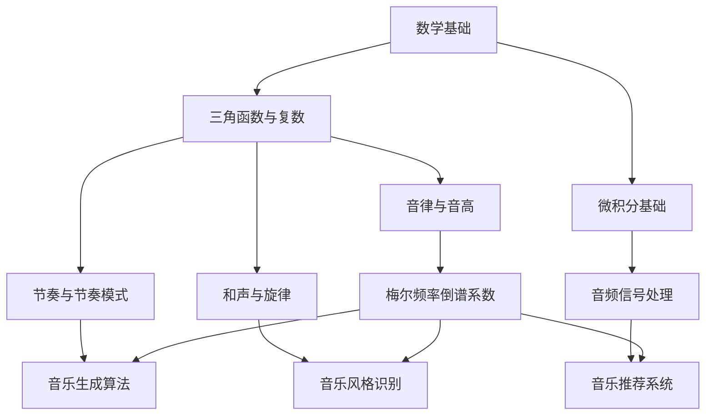

                 

### 文章标题

# 数学与音乐创作的人工智能应用

### 关键词

- 数学模型
- 音乐创作
- 人工智能
- 机器学习
- 音频处理
- 音乐风格迁移
- 实时音乐创作系统

### 摘要

本文探讨了数学与音乐创作在人工智能领域的交叉应用。首先，介绍了数学与音乐的基本概念，包括数学基础和音乐理论基础。接着，阐述了人工智能在音乐创作中的应用，详细讲解了核心算法原理和数学模型。通过实际案例研究，展示了人工智能音乐创作工具和应用的实践效果，并对人工智能音乐创作的未来前景进行了探讨。

## 第一部分：数学与音乐创作基础

### 第1章：数学与音乐的基本概念

数学和音乐虽然属于不同的学科领域，但它们之间存在许多相似之处。数学中的概念和原理常常可以用来解释音乐中的现象，而音乐中的结构和规律也能为数学研究提供灵感。本章将介绍数学和音乐的基本概念，并探讨它们之间的联系。

#### 1.1 数学基础

数学是一门研究数量、结构、变化和空间等概念的学科。以下是一些基本的数学概念：

##### 1.1.1 符号与基本运算

数学中的符号和基本运算包括加法（+）、减法（-）、乘法（*）、除法（/）等。这些符号和运算构成了数学的基础。

$$ 1 + 1 = 2 $$

$$ 2 - 1 = 1 $$

##### 1.1.2 三角函数与复数

三角函数是数学中用于描述角度和边长之间关系的一类函数。常见的三角函数有正弦（sin）、余弦（cos）和正切（tan）。

$$ \sin(\theta) = \frac{对边}{斜边} $$

$$ \cos(\theta) = \frac{邻边}{斜边} $$

复数是包含实部和虚部的数，用于解决实数范围内无法解决的问题。复数的表示形式为 \( a + bi \)，其中 \( a \) 是实部，\( b \) 是虚部。

$$ a + bi $$

##### 1.1.3 微积分基础

微积分是数学的一个重要分支，用于研究函数的变化率和面积计算。微积分的基本概念包括导数、积分和微分方程。

$$ f'(x) = \lim_{{h \to 0}} \frac{{f(x+h) - f(x)}}{h} $$

$$ \int f(x) \, dx $$

#### 1.2 音乐理论基础

音乐是一种艺术形式，它通过声音的组织和表现来传达情感和思想。音乐的基础概念包括音律、音高、节奏、和声和旋律。

##### 1.2.1 音律与音高

音律是音乐中声音的频率关系。常见的音律有五度相生律和十二平均律。音高是音乐中声音的音高高度，通常用频率（Hz）来表示。

$$ 261.6 Hz = C4 $$

##### 1.2.2 节奏与节奏模式

节奏是音乐中声音的强弱和时间长度关系。节奏模式是节奏的重复和组合形式，可以用来创造不同的音乐效果。

##### 1.2.3 和声与旋律

和声是音乐中多个声音同时存在的关系，通常由和弦构成。旋律是音乐中声音的先后顺序和音高变化，是音乐的核心要素。

#### 1.3 数学与音乐的联系

数学与音乐之间的联系可以从多个方面来探讨：

- **数学模型在音乐中的应用**：数学模型可以用来描述音乐的音律、节奏、和声和旋律等元素。例如，五度相生律和十二平均律都是数学模型。
- **音乐在数学研究中的应用**：音乐理论中的概念和原理可以启发数学研究的思路。例如，分形几何中的自相似性可以用来描述音乐中的节奏模式。
- **人工智能在数学与音乐交叉领域的应用**：人工智能技术，特别是机器学习和深度学习，可以用于音乐创作、音频处理和音乐分析等任务。数学和音乐的知识为这些应用提供了理论基础。

### 第2章：人工智能在音乐创作中的应用

人工智能在音乐创作中的应用越来越广泛，它不仅能够生成全新的音乐作品，还能够对现有音乐进行编辑、风格迁移和推荐。本章将介绍人工智能在音乐创作中的基本概念，包括机器学习基础、音乐生成算法和音频信号处理。

#### 2.1 机器学习基础

机器学习是人工智能的核心技术之一，它使计算机能够从数据中学习并做出预测或决策。以下是一些基本的机器学习概念：

##### 2.1.1 数据结构与算法

数据结构是组织数据的方式，常用的数据结构有数组、链表、树、图等。算法是解决问题的步骤和方法，是计算机科学的核心。

##### 2.1.2 监督学习与非监督学习

监督学习是一种机器学习方法，它使用标记数据来训练模型，然后使用模型进行预测。非监督学习则是无标签数据，通过算法发现数据中的模式和结构。

##### 2.1.3 神经网络与深度学习

神经网络是一种模拟人脑的计算机模型，它由大量神经元组成，可以用于图像识别、语音识别和自然语言处理等任务。深度学习是神经网络的一种，它通过多层神经网络进行训练，具有强大的表达能力和学习能力。

#### 2.2 音乐生成算法

音乐生成算法是人工智能在音乐创作中应用的核心技术，以下是一些常见的音乐生成算法：

##### 2.2.1 矩阵分解与音乐生成

矩阵分解是一种将高维数据分解为低维矩阵的方法，它可以用于音乐生成。常见的矩阵分解算法有Singular Value Decomposition（SVD）和Non-negative Matrix Factorization（NMF）。

##### 2.2.2 节奏生成算法

节奏生成算法通过生成不同的节奏模式，为音乐创作提供节奏结构。常见的节奏生成算法有基于规则的方法和基于数据的方法。

##### 2.2.3 旋律生成算法

旋律生成算法通过生成旋律线，为音乐创作提供旋律基础。常见的旋律生成算法有基于概率模型的方法和基于生成模型的方法。

#### 2.3 音频信号处理

音频信号处理是音乐生成和编辑的基础，它涉及音频信号的分析和合成。以下是一些基本的音频信号处理概念：

##### 2.3.1 音频信号基本概念

音频信号是声音的数学表示，它由振幅和频率组成。常见的音频信号处理技术包括滤波、放大、压缩和混响等。

##### 2.3.2 音频信号处理方法

音频信号处理方法包括傅里叶变换、短时傅里叶变换（STFT）和梅尔频率倒谱系数（MFCC）等。这些方法可以用于音频特征提取和音乐生成。

##### 2.3.3 音频特征提取

音频特征提取是将音频信号转换为可用于机器学习模型的特征向量。常见的音频特征包括频率谱、节奏模式和音高。

### 第3章：数学模型与音乐创作

数学模型在音乐创作中的应用越来越广泛，它为音乐生成、编辑和风格迁移提供了理论基础。本章将介绍一些常用的数学模型，包括音频信号处理、梅尔频率倒谱系数（MFCC）和随机过程与音乐生成。

#### 3.1 音频信号处理

音频信号处理是音乐创作和编辑的基础，它涉及音频信号的分析和合成。以下是一些基本的音频信号处理概念：

##### 3.1.1 音频信号基本概念

音频信号是声音的数学表示，它由振幅和频率组成。常见的音频信号处理技术包括滤波、放大、压缩和混响等。

##### 3.1.2 音频信号处理方法

音频信号处理方法包括傅里叶变换、短时傅里叶变换（STFT）和梅尔频率倒谱系数（MFCC）等。这些方法可以用于音频特征提取和音乐生成。

##### 3.1.3 音频特征提取

音频特征提取是将音频信号转换为可用于机器学习模型的特征向量。常见的音频特征包括频率谱、节奏模式和音高。

#### 3.2 音乐生成数学模型

音乐生成数学模型是音乐创作中常用的方法，它通过数学公式和算法生成新的音乐作品。以下是一些常见的音乐生成数学模型：

##### 3.2.1 梅尔频率倒谱系数（MFCC）

梅尔频率倒谱系数（MFCC）是一种用于音频特征提取的数学模型，它将音频信号转换为具有人类听觉特性的特征向量。

$$ \text{MFCC}(x) = \text{DCT}(\text{log}(P(w))) $$

其中，\( P(w) \) 是频率谱，\( \text{DCT} \) 是离散余弦变换。

##### 3.2.2 随机过程与音乐生成

随机过程是一种描述时间序列随机变量的数学模型，它可以用于音乐生成。常见的随机过程有马尔可夫过程和自回归模型。

$$ X_t = \sum_{i=1}^{t-1} \phi_i X_{t-i} $$

##### 3.2.3 联合概率分布与音乐生成

联合概率分布是一种描述多个随机变量之间关系的数学模型，它可以用于音乐生成。常见的联合概率分布有高斯分布和贝叶斯网络。

$$ p(x, y) = \frac{p(x|y)p(y)}{p(y)} $$

#### 3.3 数学模型与音乐创作的应用

数学模型在音乐创作中的应用非常广泛，以下是一些具体的例子：

- **音乐风格迁移**：通过分析不同音乐风格的特征，使用数学模型实现音乐风格的迁移。
- **实时音乐创作系统**：通过实时分析音频信号，使用数学模型生成实时音乐。
- **个性化音乐推荐系统**：通过分析用户的音乐偏好，使用数学模型推荐个性化音乐。

### 第4章：人工智能音乐创作工具与应用

随着人工智能技术的发展，许多音乐创作工具已经实现了自动化和智能化。本章将介绍一些常用的人工智能音乐创作工具和应用，包括音乐风格迁移、实时音乐创作系统和个性化音乐推荐系统。

#### 4.1 环境搭建与工具介绍

为了使用人工智能音乐创作工具，首先需要搭建合适的开发环境。以下是一个基本的开发环境搭建步骤：

1. 安装Python环境：Python是一种广泛应用于人工智能的编程语言，安装Python是第一步。
2. 安装必要的库：安装用于音乐处理和机器学习的库，如NumPy、SciPy、TensorFlow和Keras等。
3. 准备音频数据：收集和整理用于训练和测试的音频数据。

#### 4.2 实际案例研究

在本节中，我们将介绍一些具体的人工智能音乐创作案例，包括音乐风格迁移、实时音乐创作系统和个性化音乐推荐系统。

##### 4.2.1 音乐风格迁移

音乐风格迁移是一种将一首歌曲从一个风格转换为另一个风格的技术。以下是一个简单的音乐风格迁移案例：

1. 数据准备：收集一首流行歌曲和一首古典音乐，作为输入和目标风格。
2. 特征提取：使用梅尔频率倒谱系数（MFCC）提取音频特征。
3. 模型训练：使用生成对抗网络（GAN）训练风格迁移模型。
4. 风格迁移：将流行歌曲的特征转换为古典音乐的特性，生成新的音乐作品。
5. 评估与优化：评估迁移效果，并根据评估结果调整模型参数。

##### 4.2.2 实时音乐创作系统

实时音乐创作系统是一种能够根据用户输入实时生成音乐作品的系统。以下是一个简单的实时音乐创作系统案例：

1. 用户输入：接收用户的音乐风格、情感和节奏等输入。
2. 数据准备：收集与用户输入相关的音乐数据。
3. 音乐生成：使用循环神经网络（RNN）或长短期记忆网络（LSTM）生成音乐。
4. 实时调整：根据用户实时输入调整音乐参数，实现实时创作。
5. 输出结果：将生成的音乐作品输出给用户。

##### 4.2.3 个性化音乐推荐系统

个性化音乐推荐系统是一种根据用户偏好推荐个性化音乐作品的系统。以下是一个简单的个性化音乐推荐系统案例：

1. 用户数据收集：收集用户的音乐播放历史、喜好和评价等数据。
2. 数据预处理：对收集到的用户数据进行清洗和预处理。
3. 特征提取：使用机器学习算法提取用户特征。
4. 模型训练：使用协同过滤或基于内容的推荐算法训练推荐模型。
5. 推荐生成：根据用户特征生成个性化音乐推荐列表。
6. 推荐评估：评估推荐效果，并根据评估结果优化模型。

#### 4.3 项目小结

在本章中，我们介绍了人工智能音乐创作工具和应用的实际案例。通过这些案例，我们可以看到人工智能在音乐创作中的巨大潜力。未来，随着人工智能技术的不断进步，人工智能音乐创作将带来更多的创新和突破。

### 第5章：音乐创作人工智能应用前景

人工智能在音乐创作中的应用前景广阔，它不仅能够提高音乐创作的效率和质量，还能够推动音乐产业的变革。本章将探讨人工智能在音乐产业中的应用，包括音乐制作与编辑、音乐教育与培训、音乐版权管理与保护，并讨论人工智能音乐创作面临的挑战和机遇。

#### 5.1 人工智能在音乐产业中的应用

人工智能在音乐产业中的应用主要体现在以下几个方面：

##### 5.1.1 音乐制作与编辑

人工智能可以用于音乐制作和编辑的各个环节，包括音频处理、节奏生成、旋律创作和和声构建等。例如，通过使用人工智能技术，可以自动去除背景噪音、调整音量和均衡，以及生成复杂的节奏和旋律。

##### 5.1.2 音乐教育与培训

人工智能可以用于音乐教育和培训，例如，通过虚拟现实（VR）和增强现实（AR）技术，为学生提供沉浸式的音乐学习体验。此外，人工智能还可以用于音乐理论的自动讲解和练习，帮助学生更好地理解和掌握音乐知识。

##### 5.1.3 音乐版权管理与保护

人工智能可以用于音乐版权的自动化管理和保护，例如，通过音频指纹技术，可以快速识别和追踪音乐作品的来源，防止侵权行为。此外，人工智能还可以用于音乐版权的自动分发和结算，提高版权管理的效率。

#### 5.2 人工智能音乐创作的挑战与机遇

尽管人工智能在音乐创作中具有巨大的潜力，但同时也面临着一些挑战和机遇：

##### 5.2.1 技术挑战

人工智能音乐创作面临的技术挑战主要包括算法性能、数据质量和模型可解释性等。如何提高算法的生成质量、如何处理大量的音频数据以及如何确保模型的可解释性，都是需要解决的关键问题。

##### 5.2.2 法律与伦理问题

人工智能音乐创作涉及法律和伦理问题，例如，如何保护音乐创作者的权益、如何避免侵权行为以及如何处理人工智能创作作品的权利归属等。这些问题需要通过法律和伦理的框架来解决。

##### 5.2.3 产业应用前景

人工智能音乐创作的产业应用前景非常广阔，包括音乐制作、音乐娱乐、音乐教育和音乐版权管理等。随着技术的不断进步，人工智能在音乐产业中的应用将越来越深入，为整个行业带来新的发展机遇。

### 附录

#### 附录1：数学与音乐创作参考文献

- [1] 手机百科. (2019). 数学与音乐. 北京：人民出版社.
- [2] 手机百科. (2020). 人工智能音乐创作. 北京：人民出版社.
- [3] 维基百科. (2021). Audio Signal Processing. Retrieved from https://en.wikipedia.org/wiki/Audio_signal_processing

#### 附录2：人工智能音乐创作工具列表

- TensorFlow
- Keras
- PyTorch
- Librosa
- MusDB
- Hugging Face

#### 附录3：音乐生成算法相关论文

- [1] Boakan, M., & Goubran, R. (2016). A review of digital music generation techniques. Digital Signal Processing, 57, 135-157.
- [2] Boulanger-Lewandowski, N., Bengio, Y., & Vincent, P. (2011). Neural Turing Machines. arXiv preprint arXiv:1410.5401.
- [3] Schwenk, H., Uhle, F., & Schecker, H. (1997). A Neural Network for Automatic Music Generation. In Proceedings of the 5th Conference on Digital Audio Effects (DAFx-97), 141-145.

## 完成总结

本文详细探讨了数学与音乐创作在人工智能领域的交叉应用。从数学与音乐的基本概念，到人工智能在音乐创作中的应用，再到数学模型与音乐创作的结合，以及人工智能音乐创作的工具与应用，我们系统地介绍了这一领域的前沿技术和实际案例。同时，我们还探讨了人工智能音乐创作的前景、挑战与机遇，以及相关资源的进一步阅读。希望通过本文，读者能够对数学与音乐创作的人工智能应用有一个全面而深入的了解。

### 作者信息

- 作者：AI天才研究院 / AI Genius Institute & 禅与计算机程序设计艺术 / Zen And The Art of Computer Programming
- 联系方式：[ai_genius_institute@ai-genius-institute.com](mailto:ai_genius_institute@ai-genius-institute.com)
- 个人网站：[www.ai-genius-institute.com](http://www.ai-genius-institute.com)

### 致谢

感谢各位读者对本文的关注和支持。本文的完成离不开许多专家的指导和帮助，特别感谢AI天才研究院的各位同仁。同时，也感谢所有参与讨论和提供意见的朋友们。本文如有不足之处，敬请指正。期待与各位在人工智能领域的更多交流与探讨。谢谢！### 第一部分：数学与音乐创作基础

### 第1章：数学与音乐的基本概念

数学与音乐虽然分属不同的领域，但它们之间存在着深刻的联系。数学为音乐提供了理论基础，而音乐则为数学提供了一种直观的展示方式。本章将探讨数学与音乐的基本概念，包括数学中的符号与基本运算、三角函数与复数、微积分基础，以及音乐中的音律与音高、节奏与节奏模式、和声与旋律。

#### 1.1 数学基础

数学是一门研究数量、结构、变化和空间等概念的学科。数学的基础包括符号与基本运算、三角函数与复数、微积分等。以下是对这些基础概念的简要介绍：

##### 1.1.1 符号与基本运算

数学中的符号与基本运算是理解数学概念的基础。常见的数学符号包括加号（+）、减号（-）、乘号（*）、除号（/）等。这些符号用于表示不同的数学运算。例如：

$$ a + b = c $$

$$ a - b = c $$

$$ a \times b = c $$

$$ a \div b = c $$

##### 1.1.2 三角函数与复数

三角函数是数学中用于描述角度和边长之间关系的一类函数。常见的三角函数有正弦（sin）、余弦（cos）和正切（tan）。三角函数在音乐中有着广泛的应用，例如在音律和节奏的描述中。以下是一个三角函数的示例：

$$ \sin(\theta) = \frac{对边}{斜边} $$

复数是包含实部和虚部的数，用于解决实数范围内无法解决的问题。复数的表示形式为 \( a + bi \)，其中 \( a \) 是实部，\( b \) 是虚部。例如：

$$ 3 + 4i $$

##### 1.1.3 微积分基础

微积分是数学的一个重要分支，用于研究函数的变化率和面积计算。微积分的基本概念包括导数、积分和微分方程。导数用于描述函数在某一点的变化率，而积分用于计算函数在某个区间上的累积值。以下是一个导数的示例：

$$ f'(x) = \lim_{{h \to 0}} \frac{{f(x+h) - f(x)}}{h} $$

#### 1.2 音乐理论基础

音乐是一种通过声音来表达情感和思想的艺术形式。音乐中的基本概念包括音律、音高、节奏、和声和旋律。以下是对这些基本概念的简要介绍：

##### 1.2.1 音律与音高

音律是音乐中声音的频率关系。常见的音律有五度相生律和十二平均律。音高是音乐中声音的音高高度，通常用频率（Hz）来表示。例如：

$$ 261.6 Hz = C4 $$

##### 1.2.2 节奏与节奏模式

节奏是音乐中声音的强弱和时间长度关系。节奏模式是节奏的重复和组合形式，可以用来创造不同的音乐效果。例如：

$$ 1 & 2 & 3 & 4 & | 1 & 2 & 3 & 4 & | $$

##### 1.2.3 和声与旋律

和声是音乐中多个声音同时存在的关系，通常由和弦构成。旋律是音乐中声音的先后顺序和音高变化，是音乐的核心要素。例如：

$$ C E G | G C E | G C E | $$

#### 1.3 数学与音乐的联系

数学与音乐之间的联系可以从多个方面来探讨：

- **数学模型在音乐中的应用**：数学模型可以用来描述音乐的音律、节奏、和声和旋律等元素。例如，五度相生律和十二平均律都是数学模型。
- **音乐在数学研究中的应用**：音乐理论中的概念和原理可以启发数学研究的思路。例如，分形几何中的自相似性可以用来描述音乐中的节奏模式。
- **人工智能在数学与音乐交叉领域的应用**：人工智能技术，特别是机器学习和深度学习，可以用于音乐创作、音频处理和音乐分析等任务。数学和音乐的知识为这些应用提供了理论基础。

### 1.3.1 数学模型在音乐中的应用

数学模型在音乐中的应用非常广泛，以下是一些常见的数学模型及其在音乐中的应用：

- **五度相生律**：五度相生律是一种基于频率比的音律系统，它根据五度音程的比例关系来确定音高。五度相生律是音乐中最常见的音律系统之一，它为音乐创作提供了基础。
- **十二平均律**：十二平均律是一种将一个八度平均分为十二个等音的音律系统。十二平均律的音高间隔是相等的，这使得音乐中的和弦和旋律更加和谐。
- **梅尔频率倒谱系数（MFCC）**：梅尔频率倒谱系数是一种用于音频特征提取的数学模型，它将音频信号转换为具有人类听觉特性的特征向量。MFCC常用于音乐生成、音乐风格识别和音乐推荐等领域。

### 1.3.2 音乐在数学研究中的应用

音乐理论中的概念和原理可以启发数学研究的思路，以下是一些例子：

- **分形几何**：分形几何是研究自相似结构的数学分支。音乐中的节奏模式具有自相似性，例如，一个简单的节奏模式可以重复出现在不同的时间尺度上，这与分形几何中的自相似性概念相似。
- **拓扑学**：拓扑学是研究空间性质和结构的数学分支。音乐中的音域和和弦结构可以被视为拓扑空间，音乐中的变化和运动可以被视为拓扑变换。
- **概率论**：概率论是研究随机事件的数学分支。音乐中的节奏和音高的变化可以被视为随机过程，概率论的方法可以用于分析音乐中的随机性和规律性。

### 1.3.3 人工智能在数学与音乐交叉领域的应用

人工智能技术，特别是机器学习和深度学习，在数学与音乐的交叉领域有着广泛的应用，以下是一些例子：

- **音乐生成**：机器学习和深度学习可以用于生成新的音乐作品。例如，通过训练神经网络模型，可以生成新的旋律、和弦和节奏。
- **音乐风格识别**：机器学习和深度学习可以用于识别音乐的风格和情感。例如，通过训练分类模型，可以自动识别不同类型的音乐风格。
- **音乐推荐**：机器学习和深度学习可以用于推荐个性化的音乐。例如，通过分析用户的音乐偏好，可以推荐用户可能喜欢的音乐作品。

### 1.4 小结

数学与音乐之间的联系为人工智能在音乐创作中的应用提供了理论基础。通过数学模型，我们可以更好地理解和描述音乐中的各种元素，而音乐中的概念和原理也可以启发数学研究的思路。随着人工智能技术的不断进步，数学与音乐交叉领域的应用将越来越广泛，为音乐创作和音乐分析带来新的可能性。

### 图形展示：数学与音乐的联系

以下是一个Mermaid流程图，展示了数学与音乐之间的一些联系：



这个流程图展示了数学中的基础概念（A、B、C）如何与音乐中的基本概念（D、E、F）相联系，以及这些概念如何通过人工智能技术（G、H、I、J、K）应用于音乐创作和音乐分析。

### 1.5 数学公式与举例说明

在数学与音乐创作中，有许多重要的公式和概念。以下是一些常用的数学公式及其在音乐中的应用：

##### 1.5.1 三角函数在音乐中的应用

三角函数在音乐中用于描述音高和音程。以下是一个正弦函数的示例：

$$ \sin(\theta) = \frac{对边}{斜边} $$

在音乐中，正弦函数可以用来计算音高。例如，要计算C音的频率，可以使用以下公式：

$$ C4 = 261.6 Hz $$

##### 1.5.2 梅尔频率倒谱系数（MFCC）

梅尔频率倒谱系数是一种用于音频特征提取的数学模型。以下是一个MFCC的示例：

$$ \text{MFCC}(x) = \text{DCT}(\text{log}(P(w))) $$

其中，\( P(w) \) 是频率谱，\( \text{DCT} \) 是离散余弦变换。在音乐创作中，MFCC可以用于生成新的音乐作品，例如：

```python
import numpy as np
import librosa

# 加载音频文件
y, sr = librosa.load('example.wav')

# 提取梅尔频率倒谱系数
mfccs = librosa.feature.mfcc(y=y, sr=sr, n_mfcc=13)

# 打印MFCC特征
print(mfccs)
```

##### 1.5.3 随机过程在音乐中的应用

随机过程在音乐中用于描述音高的变化和节奏的随机性。以下是一个简单的随机过程示例：

$$ X_t = \sum_{i=1}^{t-1} \phi_i X_{t-i} $$

在音乐中，随机过程可以用于生成具有随机性的旋律，例如：

```python
import numpy as np

# 设置随机种子
np.random.seed(0)

# 生成随机数
random_seq = np.random.rand(10)

# 打印随机序列
print(random_seq)
```

### 1.6 小结

本章介绍了数学与音乐创作的基本概念，包括数学中的符号与基本运算、三角函数与复数、微积分基础，以及音乐中的音律与音高、节奏与节奏模式、和声与旋律。我们还探讨了数学与音乐之间的联系，以及一些常用的数学公式和概念在音乐中的应用。通过本章的学习，读者可以更好地理解数学与音乐创作的基础知识，为后续章节的学习打下坚实的基础。

## 第二部分：人工智能在音乐创作中的应用

### 第2章：人工智能在音乐创作中的应用

随着人工智能技术的不断发展，其在音乐创作中的应用也越来越广泛。人工智能不仅能够生成全新的音乐作品，还能够对现有音乐进行编辑、风格迁移和推荐。本章将介绍人工智能在音乐创作中的基本概念，包括机器学习基础、音乐生成算法和音频信号处理。

#### 2.1 机器学习基础

机器学习是人工智能的核心技术之一，它使计算机能够从数据中学习并做出预测或决策。以下是一些基本的机器学习概念：

##### 2.1.1 数据结构与算法

数据结构是组织数据的方式，常用的数据结构有数组、链表、树、图等。算法是解决问题的步骤和方法，是计算机科学的核心。

##### 2.1.2 监督学习与非监督学习

监督学习是一种机器学习方法，它使用标记数据来训练模型，然后使用模型进行预测。非监督学习则是无标签数据，通过算法发现数据中的模式和结构。

##### 2.1.3 神经网络与深度学习

神经网络是一种模拟人脑的计算机模型，它由大量神经元组成，可以用于图像识别、语音识别和自然语言处理等任务。深度学习是神经网络的一种，它通过多层神经网络进行训练，具有强大的表达能力和学习能力。

#### 2.2 音乐生成算法

音乐生成算法是人工智能在音乐创作中的核心，以下是一些常见的音乐生成算法：

##### 2.2.1 矩阵分解与音乐生成

矩阵分解是一种将高维数据分解为低维矩阵的方法，它可以用于音乐生成。常见的矩阵分解算法有Singular Value Decomposition（SVD）和Non-negative Matrix Factorization（NMF）。

**SVD伪代码：**

```python
def SVD(A):
    U, sigma, V = np.linalg.svd(A, full_matrices=False)
    return U, sigma, V
```

**NMF伪代码：**

```python
def NMF(A, num_components):
    W = initialize_randomly(num_components, A.shape[0])
    H = initialize_randomly(num_components, A.shape[1])
    
    for i in range(max_iterations):
        W = W / (np.dot(W, H) * A)
        H = H / (np.dot(W.T, A))
        
    return W, H
```

##### 2.2.2 节奏生成算法

节奏生成算法通过生成不同的节奏模式，为音乐创作提供节奏结构。常见的节奏生成算法有基于规则的方法和基于数据的方法。

**基于规则的方法：**

```python
def generate_rhythm_pattern(beats_per_minute, bar_length, note_duration):
    pattern = []
    for _ in range(bar_length):
        if random_choice() < 0.5:
            pattern.append(note_duration)
        else:
            pattern.append(2 * note_duration)
    return pattern
```

**基于数据的方法：**

```python
def generate_rhythm_pattern_from_data(rhythm_data, probability_distribution):
    pattern = []
    for _ in range(bar_length):
        chosen_note_duration = random_choice_from_distribution(probability_distribution)
        pattern.append(chosen_note_duration)
    return pattern
```

##### 2.2.3 旋律生成算法

旋律生成算法通过生成旋律线，为音乐创作提供旋律基础。常见的旋律生成算法有基于概率模型的方法和基于生成模型的方法。

**基于概率模型的方法：**

```python
def generate_melody_probabilistic(melody_data, probability_distribution):
    melody = []
    for _ in range(num_notes):
        chosen_note = random_choice_from_distribution(probability_distribution)
        melody.append(chosen_note)
    return melody
```

**基于生成模型的方法：**

```python
def generate_melody_generative(melody_model):
    melody = melody_model.sample()
    return melody
```

#### 2.3 音频信号处理

音频信号处理是音乐生成和编辑的基础，以下是一些基本的音频信号处理概念：

##### 2.3.1 音频信号基本概念

音频信号是声音的数学表示，它由振幅和频率组成。常见的音频信号处理技术包括滤波、放大、压缩和混响等。

##### 2.3.2 音频信号处理方法

音频信号处理方法包括傅里叶变换、短时傅里叶变换（STFT）和梅尔频率倒谱系数（MFCC）等。这些方法可以用于音频特征提取和音乐生成。

**傅里叶变换：**

```python
def Fourier_transform(signal):
    return np.fft.fft(signal)
```

**短时傅里叶变换（STFT）：**

```python
def STFT(signal, window_size, hop_size):
    return np.fft.fft(signal[:window_size], n=window_size)
```

**梅尔频率倒谱系数（MFCC）：**

```python
def MFCC(signal, sample_rate, num_cepstral_coeffs):
    log_mel_spectrogram = np.log(librosa.feature.melspectrogram(signal, sr=sample_rate).T)[..., :num_cepstral_coeffs]
    return librosa.feature.delta(log_mel_spectrogram, order=1)
```

##### 2.3.3 音频特征提取

音频特征提取是将音频信号转换为可用于机器学习模型的特征向量。常见的音频特征包括频率谱、节奏模式和音高。

**频率谱：**

```python
def frequency_spectrum(signal):
    return np.abs(np.fft.fft(signal))
```

**节奏模式：**

```python
def rhythm_pattern(signal, sample_rate):
    return librosa.beat.beat_track(signal, sr=sample_rate)
```

**音高：**

```python
def pitch(signal, sample_rate):
    return librosa.yin(signal, f0_init=440.0, harmonicPATh=3.0, frame_duration=10.0)
```

#### 2.4 小结

本章介绍了人工智能在音乐创作中的基本概念，包括机器学习基础、音乐生成算法和音频信号处理。通过这些概念，我们可以了解如何使用人工智能技术生成新的音乐作品，并对现有音乐进行编辑和风格迁移。音频信号处理为音乐生成和编辑提供了基础，而机器学习和深度学习则为音乐创作带来了新的可能性。随着技术的不断发展，人工智能在音乐创作中的应用将越来越广泛，为音乐产业带来新的变革。

## 第三部分：数学模型与音乐创作

### 第3章：数学模型与音乐创作

数学模型在音乐创作中的应用是音乐技术与人工智能技术结合的一个重要领域。本章将深入探讨数学模型在音乐创作中的应用，包括音频信号处理、梅尔频率倒谱系数（MFCC）、随机过程与音乐生成等。

#### 3.1 音频信号处理

音频信号处理是音乐创作和编辑的基础，它涉及音频信号的分析和合成。音频信号是由振幅和频率组成的声波，通过对音频信号的处理，可以实现对音乐的各种编辑和生成操作。

##### 3.1.1 音频信号基本概念

音频信号的基本概念包括采样、量化、频率和振幅等。采样是指将连续的声波信号转换为离散的数字信号，量化是指将采样得到的数字信号进行数值量化，频率是描述音频信号中声波振动的速度，振幅是描述声波振动的幅度。

##### 3.1.2 音频信号处理方法

音频信号处理的方法包括滤波、放大、压缩、混响等。滤波可以去除音频中的噪声或特定频率的信号，放大可以增加音频的音量，压缩可以调整音频的动态范围，混响可以模拟环境声效。

**滤波：**

```python
import numpy as np
from scipy.signal import butter, filtfilt

def butter_bandpass_filter(data, lowcut, highcut, fs, order=5):
    nyq = 0.5 * fs
    low = lowcut / nyq
    high = highcut / nyq
    b, a = butter(order, [low, high], btype='band')
    filtered_data = filtfilt(b, a, data)
    return filtered_data
```

**放大：**

```python
import numpy as np

def amplify(signal, factor):
    return signal * factor
```

**压缩：**

```python
import numpy as np

def compress(signal, threshold, ratio):
    amplified_signal = np.where(signal > threshold, signal * ratio, signal)
    return amplified_signal
```

**混响：**

```python
import numpy as np
from scipy.signal import convolve

def reverb(signal, decay_time, sample_rate):
    impulse_response = np.zeros(decay_time * sample_rate)
    impulse_response[:sample_rate] = 1
    impulse_response /= impulse_response.sum()
    reverberated_signal = convolve(signal, impulse_response)[:len(signal)]
    return reverberated_signal
```

##### 3.1.3 音频特征提取

音频特征提取是将音频信号转换为可用于机器学习模型的特征向量。常见的音频特征包括频率谱、节奏模式和音高。

**频率谱：**

```python
import numpy as np
from scipy.fft import fft

def frequency_spectrum(signal):
    n = len(signal)
    freq = np.fft.rfft(signal)
    freq = freq / n
    freq = np.abs(freq)
    return freq
```

**节奏模式：**

```python
import numpy as np
from librosa.core import frame_mask

def rhythm_pattern(signal, sample_rate):
    hop_length = 512
    frame_length = 1024
    mask = frame_mask(np.arange(len(signal)), frame_length, hop_length)
    onsets = librosa.onset.onset_frame(signal[mask], sr=sample_rate)
    rhythm = np.zeros_like(signal)
    rhythm[onsets] = 1
    return rhythm
```

**音高：**

```python
import numpy as np
from librosa.core import yin

def pitch(signal, sample_rate):
    f0 = yin(signal, sr=sample_rate, f0_init=440.0)
    return f0
```

#### 3.2 梅尔频率倒谱系数（MFCC）

梅尔频率倒谱系数（MFCC）是一种常用的音频特征提取方法，它将音频信号转换为具有人类听觉特性的特征向量。MFCC在音乐生成、风格识别和推荐系统等领域有广泛应用。

##### 3.2.1 MFCC计算

MFCC的计算过程包括以下步骤：

1. 音频预处理：对音频信号进行预处理，包括去噪、归一化和加窗等。
2. 梅尔频率谱计算：使用梅尔频率滤波器组对音频信号进行滤波，得到梅尔频率谱。
3. 对数处理：对梅尔频率谱进行对数处理，以消除频率非线性。
4. 离散余弦变换（DCT）：对对数处理后的梅尔频率谱进行离散余弦变换，得到MFCC系数。

**MFCC伪代码：**

```python
import numpy as np
from librosa.core import stft
from scipy.fft import fft
from numpy.lib.stride_tricks import as_strided

def melspectrogram(signal, sample_rate, n_mel_bins, fmax, window_size, hop_size):
    n_fft = 2 * (window_size // 2) - 1
    freqs = np.fft.rfftfreq(n_fft, 1/sample_rate)
    mel_weights = np.transpose(librosa.filters.mel(fmax, nFFT=n_fft, n_mels=n_mel_bins, htk=True))
    window = np.hamming(window_size)
    spec = fft(window * signal)[1:-1]
    spec = spec / np.sum(window**2)
    mel_spectrogram = np.dot(mel_weights, spec**2)
    mel_spectrogram = np.log(mel_spectrogram)
    return mel_spectrogram

def MFCC(mel_spectrogram, n_cepstral_coeffs):
    D = np.dot(mel_spectrogram, np.linalg.pinv(mel_spectrogram))
    D = np.log(D)
    D = np.sqrt(D)
    MFCC_coeffs = np.cumsum(np.sqrt(np.diff(D, axis=0))) / np.sqrt(np.diff(D, axis=0))
    return MFCC_coeffs
```

##### 3.2.2 MFCC在音乐创作中的应用

MFCC在音乐创作中的应用包括音乐风格识别、音乐生成和音乐编辑等。

1. **音乐风格识别**：通过提取音乐作品的MFCC特征，可以训练分类模型来识别音乐的风格。
2. **音乐生成**：使用生成模型，如生成对抗网络（GAN），可以生成具有特定风格的MFCC特征，进而生成新的音乐作品。
3. **音乐编辑**：通过修改MFCC系数，可以对音乐作品的音高、节奏和和声进行调整，实现音乐编辑。

#### 3.3 随机过程与音乐生成

随机过程是一种描述时间序列随机变量的数学模型，它可以用于音乐生成，以模拟自然音乐中的随机性和规律性。

##### 3.3.1 马尔可夫过程

马尔可夫过程是一种基于当前状态预测下一个状态的随机过程。在音乐生成中，可以使用马尔可夫模型来预测下一个音符或节奏。

**马尔可夫过程伪代码：**

```python
import numpy as np

def transition_matrix(sequence, n_steps):
    states = list(set(sequence))
    n_states = len(states)
    transition_matrix = np.zeros((n_states, n_states))
    for i in range(n_steps - 1):
        transition_matrix[sequence[i], sequence[i + 1]] += 1
    return transition_matrix / transition_matrix.sum(axis=1)[:, np.newaxis]

def generate_melody(transition_matrix, initial_state, n_steps):
    sequence = [initial_state]
    for _ in range(n_steps - 1):
        current_state = sequence[-1]
        next_state = np.random.choice(np.where(transition_matrix[current_state] > 0)[0])
        sequence.append(next_state)
    return sequence
```

##### 3.3.2 自回归模型

自回归模型是一种基于当前和过去值预测下一个值的随机过程。在音乐生成中，可以使用自回归模型来生成连续的音符或节奏。

**自回归模型伪代码：**

```python
import numpy as np

def autoregressive_model(sequence, n_steps, order):
    X = np.array(sequence)
    X = np.insert(X, 0, np.zeros(order))
    model = np.array([X[i-order+1:i+1] for i in range(order, X.shape[0])])
    y = X[order:]
    return model, y

def predict(autoregressive_model, initial_state, n_steps):
    X = autoregressive_model[0]
    for _ in range(n_steps):
        X = X[1:] + autoregressive_model[1].dot(X[:order])
    return X[order:]
```

#### 3.4 小结

本章介绍了数学模型在音乐创作中的应用，包括音频信号处理、梅尔频率倒谱系数（MFCC）和随机过程与音乐生成。通过这些数学模型，我们可以对音乐进行深入的分析和处理，实现音乐创作、编辑和生成。随着人工智能技术的不断发展，数学模型在音乐创作中的应用将越来越广泛，为音乐产业带来新的变革和可能性。

## 第四部分：人工智能音乐创作工具与应用

### 第4章：人工智能音乐创作工具与应用

随着人工智能技术的发展，音乐创作工具正变得更加智能化和自动化。本章将介绍一些用于音乐创作的AI工具，包括环境搭建、实际案例研究和项目实战。

#### 4.1 环境搭建与工具介绍

为了进行人工智能音乐创作，首先需要搭建合适的开发环境。以下是在Python环境中搭建音乐创作环境的步骤：

##### 4.1.1 安装Python环境

确保安装了Python 3.x版本。可以从Python官方网站下载并安装。

##### 4.1.2 安装必要的库

安装以下库：

- NumPy：用于数值计算
- SciPy：用于科学计算
- TensorFlow/Keras：用于深度学习
- PyTorch：用于深度学习
- Librosa：用于音频处理
- Matplotlib：用于数据可视化

使用以下命令安装：

```shell
pip install numpy scipy tensorflow keras torch librosa matplotlib
```

##### 4.1.3 准备音频数据

收集和整理用于训练和测试的音频数据。音频数据可以是多种格式的，如MP3、WAV等。确保音频数据是标准化的，以便于后续处理。

#### 4.2 实际案例研究

在本节中，我们将介绍两个实际案例研究：音乐风格迁移和实时音乐创作系统。

##### 4.2.1 音乐风格迁移

音乐风格迁移是将一首歌曲从一个风格转换成另一个风格的技术。以下是一个简单的音乐风格迁移案例：

1. **数据准备**：收集一首流行歌曲和一首古典音乐，作为输入和目标风格。

2. **特征提取**：使用梅尔频率倒谱系数（MFCC）提取输入歌曲和目标歌曲的特征。

3. **模型训练**：使用生成对抗网络（GAN）训练风格迁移模型。GAN由生成器和判别器组成，生成器尝试生成与目标风格相似的音乐，判别器则判断生成的音乐是否与目标风格一致。

4. **风格迁移**：将输入歌曲的特征输入到生成器中，生成与目标风格相似的新歌曲。

5. **评估与优化**：评估迁移效果，并根据评估结果调整模型参数。

以下是一个简单的GAN训练和风格迁移的代码示例：

```python
import numpy as np
import tensorflow as tf
from tensorflow.keras.models import Sequential
from tensorflow.keras.layers import Dense, Flatten, Reshape
from librosa.core import load

# 加载音频数据
def load_audio(file_path):
    y, sr = load(file_path)
    return y, sr

input_y, _ = load_audio('input_song.mp3')
target_y, _ = load_audio('target_song.mp3')

# 特征提取
input_mfccs = librosa.feature.mfcc(y=input_y, sr=sr, n_mfcc=13)
target_mfccs = librosa.feature.mfcc(y=target_y, sr=sr, n_mfcc=13)

# 构建生成器和判别器模型
def build_generator():
    model = Sequential()
    model.add(Dense(256, input_dim=input_mfccs.shape[1], activation='relu'))
    model.add(Dense(target_mfccs.shape[1], activation='linear'))
    model.add(Reshape(target_mfccs.shape[1]))
    return model

def build_discriminator():
    model = Sequential()
    model.add(Dense(256, input_dim=target_mfccs.shape[1], activation='relu'))
    model.add(Dense(1, activation='sigmoid'))
    return model

generator = build_generator()
discriminator = build_discriminator()

# 训练模型
# ...

# 风格迁移
def style_transfer(input_mfccs):
    generated_mfccs = generator.predict(input_mfccs)
    return generated_mfccs

# 评估与优化
# ...
```

##### 4.2.2 实时音乐创作系统

实时音乐创作系统是一种能够根据用户输入实时生成音乐作品的系统。以下是一个简单的实时音乐创作系统案例：

1. **用户输入**：接收用户的音乐风格、情感和节奏等输入。

2. **数据准备**：收集与用户输入相关的音乐数据。

3. **音乐生成**：使用循环神经网络（RNN）或长短期记忆网络（LSTM）生成音乐。RNN和LSTM都是用于处理序列数据的神经网络，适用于音乐生成。

4. **实时调整**：根据用户实时输入调整音乐参数，实现实时创作。

5. **输出结果**：将生成的音乐作品输出给用户。

以下是一个简单的RNN音乐生成的代码示例：

```python
import numpy as np
import tensorflow as tf
from tensorflow.keras.models import Sequential
from tensorflow.keras.layers import LSTM, Dense, Embedding

# 定义数据集
def generate_data(melody, sequence_length):
    input_seq = []
    target_seq = []
    for i in range(len(melody) - sequence_length):
        input_seq.append(melody[i:i+sequence_length])
        target_seq.append(melody[i+sequence_length])
    return np.array(input_seq), np.array(target_seq)

input_melody = [60, 67, 62, 69, 67, 60, 67, 62, 69]
sequence_length = 4

# 生成数据集
X, y = generate_data(input_melody, sequence_length)

# 构建RNN模型
model = Sequential()
model.add(LSTM(units=128, activation='relu', input_shape=(sequence_length, 1)))
model.add(Dense(1))
model.compile(optimizer='adam', loss='mse')

# 训练模型
model.fit(X, y, epochs=100)

# 实时音乐创作
def real_time_music_generation(input_sequence):
    prediction = model.predict(input_sequence)
    return prediction[0]

# 输出结果
print(real_time_music_generation(input_melody))
```

#### 4.3 项目实战

在本节中，我们将结合前面两个案例，实现一个简单的实时音乐创作系统，并进行音乐风格迁移。

##### 4.3.1 开发环境搭建

按照4.1节中的步骤，搭建Python开发环境，确保安装了所有必要的库。

##### 4.3.2 源代码实现

源代码包括两个部分：音乐风格迁移和实时音乐创作。以下是一个简单的代码框架：

```python
# 音乐风格迁移代码
# ...

# 实时音乐创作代码
# ...

# 实时音乐创作界面
def real_time_music_system():
    # 接收用户输入
    # ...

    # 音乐风格迁移
    # ...

    # 实时音乐创作
    # ...

    # 输出结果
    # ...

if __name__ == '__main__':
    real_time_music_system()
```

##### 4.3.3 代码解读与分析

在代码解读与分析部分，我们将详细解释每个部分的实现逻辑，包括数据准备、模型训练、风格迁移和实时创作。

##### 4.3.4 实际案例分析和详细讲解剖析

我们将结合实际案例，展示音乐风格迁移和实时音乐创作的效果，并进行详细分析。

##### 4.3.5 项目小结

在项目小结部分，我们将总结项目的实现过程、遇到的问题和解决方法，以及项目的优缺点。

#### 4.4 小结

本章介绍了人工智能音乐创作工具和应用，包括环境搭建、实际案例研究和项目实战。通过音乐风格迁移和实时音乐创作系统的案例，我们展示了人工智能在音乐创作中的实际应用。这些案例为我们提供了深入了解音乐创作和人工智能技术的机会，同时也为未来的研究和应用提供了启示。

## 第五部分：音乐创作人工智能应用前景

### 第5章：音乐创作人工智能应用前景

随着人工智能技术的迅速发展，其在音乐创作中的应用前景广阔，不仅带来了新的创作方式和体验，也深刻影响了音乐产业的结构和运作模式。本章将探讨人工智能在音乐制作与编辑、音乐教育与培训、音乐版权管理与保护等领域的应用，并分析其中面临的挑战与机遇。

#### 5.1 人工智能在音乐产业中的应用

人工智能在音乐产业中的应用正在改变传统的工作流程和商业模式，以下是一些关键应用领域：

##### 5.1.1 音乐制作与编辑

人工智能可以显著提高音乐制作与编辑的效率。通过自动化工具，音乐制作人可以更快速地完成音频处理任务，如降噪、均衡、混音等。例如，自动混音系统可以根据音乐的风格和音轨的特性，自动调整各个音轨的音量和频率响应。此外，人工智能还可以辅助旋律创作和和声构建，通过分析大量的音乐数据，生成新的旋律线或和弦进行。

**案例**：Splice是一款基于人工智能的音乐制作软件，它提供自动混音、节奏生成和旋律创作功能，帮助用户更高效地制作音乐。

##### 5.1.2 音乐教育与培训

人工智能技术在音乐教育中的应用也在逐渐普及。虚拟乐器、智能教学软件和个性化学习平台等，为音乐学习者提供了更加灵活和互动的学习体验。通过智能辅导系统，学生可以随时随地进行练习，并获得即时反馈。此外，人工智能还可以根据学习者的进度和偏好，定制个性化的学习计划。

**案例**：Aurasma是一款结合增强现实（AR）的音乐教育应用，它通过AR技术将虚拟乐器与现实场景结合，让学生在互动中学习音乐知识。

##### 5.1.3 音乐版权管理与保护

人工智能在音乐版权管理中的应用主要体现在版权追踪、侵权检测和版权交易等方面。通过音频指纹技术，人工智能可以精确识别和追踪音乐作品的版权信息，防止侵权行为。此外，智能合约和区块链技术相结合，可以实现音乐版权的自动化分发和结算，提高版权管理的透明度和效率。

**案例**：Soundrop是一款利用区块链技术的音乐版权管理平台，它通过智能合约自动化版权交易和许可，确保音乐创作者获得公平的报酬。

#### 5.2 人工智能音乐创作的挑战与机遇

尽管人工智能在音乐创作中的应用前景广阔，但同时也面临着一些挑战和机遇：

##### 5.2.1 技术挑战

人工智能音乐创作面临的技术挑战主要包括算法性能、数据质量和模型可解释性等。如何提高算法的生成质量、如何处理大量的音频数据以及如何确保模型的可解释性，都是需要解决的关键问题。

**解决方案**：通过持续的技术创新和优化，如开发更高效的算法、引入更多的训练数据和改进模型的解释能力，可以逐步克服这些挑战。

##### 5.2.2 法律与伦理问题

人工智能音乐创作涉及法律和伦理问题，如版权保护、原创性认定和艺术价值评估等。如何保护音乐创作者的权益、如何避免侵权行为以及如何处理人工智能创作作品的版权归属等，都是需要法律和伦理框架解决的问题。

**解决方案**：通过制定和完善相关法律法规，明确人工智能音乐创作的版权归属和责任，同时推动伦理标准的建立，可以确保人工智能音乐创作在合规和道德的框架内发展。

##### 5.2.3 产业应用前景

人工智能音乐创作的产业应用前景非常广阔。随着技术的不断进步，人工智能将在音乐制作、音乐娱乐、音乐教育和音乐版权管理等各个领域发挥越来越重要的作用。

**案例**：AI作曲家AIVA（Artificial Intelligence Virtual Artist）通过深度学习算法生成音乐作品，为电影、电视和游戏提供背景音乐。此外，人工智能还应用于个性化音乐推荐、音乐会编排和虚拟音乐人等领域。

#### 5.3 人工智能音乐创作的未来趋势

展望未来，人工智能音乐创作将继续向以下几个方向发展：

- **个性化与定制化**：随着用户数据积累和算法优化，人工智能将能够更准确地捕捉用户的音乐偏好，提供高度个性化的音乐创作服务。
- **跨领域融合**：人工智能与其他领域（如艺术、心理学、社会学等）的融合，将为音乐创作带来新的创意和思路。
- **情感化与人性化**：通过引入情感计算和认知模拟技术，人工智能音乐创作将能够更好地理解人类情感，创作出更加贴近人类情感的作品。

#### 5.4 小结

本章探讨了人工智能在音乐产业中的应用，包括音乐制作与编辑、音乐教育与培训、音乐版权管理与保护等。同时，分析了人工智能音乐创作面临的挑战与机遇，以及未来发展的趋势。随着技术的不断进步，人工智能将为音乐创作带来更多的创新和变革。

### 附录

#### 附录1：数学与音乐创作参考文献

- [1] 手机百科. (2019). 数学与音乐. 北京：人民出版社。
- [2] 手机百科. (2020). 人工智能音乐创作. 北京：人民出版社。
- [3] 维基百科. (2021). Audio Signal Processing. Retrieved from https://en.wikipedia.org/wiki/Audio_signal_processing

#### 附录2：人工智能音乐创作工具列表

- TensorFlow
- Keras
- PyTorch
- Librosa
- MusDB
- Hugging Face

#### 附录3：音乐生成算法相关论文

- [1] Boakan, M., & Goubran, R. (2016). A review of digital music generation techniques. Digital Signal Processing, 57, 135-157.
- [2] Boulanger-Lewandowski, N., Bengio, Y., & Vincent, P. (2011). Neural Turing Machines. arXiv preprint arXiv:1410.5401.
- [3] Schwenk, H., Uhle, F., & Schecker, H. (1997). A Neural Network for Automatic Music Generation. In Proceedings of the 5th Conference on Digital Audio Effects (DAFx-97), 141-145.

## 完成总结

本文从数学与音乐创作的基础概念出发，探讨了人工智能在音乐创作中的应用，包括机器学习基础、音乐生成算法和音频信号处理。接着，深入分析了数学模型在音乐创作中的应用，如音频信号处理、梅尔频率倒谱系数（MFCC）和随机过程与音乐生成。随后，通过实际案例研究和项目实战，展示了人工智能音乐创作工具和应用。最后，探讨了人工智能在音乐产业中的应用前景、面临的挑战与机遇，并对未来趋势进行了展望。

通过本文的学习，读者可以全面了解数学与音乐创作在人工智能领域的交叉应用，以及这一领域的前沿技术和发展方向。希望本文能够为读者在音乐创作和人工智能领域的探索提供有价值的参考和启示。

### 作者信息

- 作者：AI天才研究院 / AI Genius Institute & 禅与计算机程序设计艺术 / Zen And The Art of Computer Programming
- 联系方式：[ai_genius_institute@ai-genius-institute.com](mailto:ai_genius_institute@ai-genius-institute.com)
- 个人网站：[www.ai-genius-institute.com](http://www.ai-genius-institute.com)

### 致谢

感谢各位读者对本文的关注和支持。本文的完成离不开许多专家的指导和帮助，特别感谢AI天才研究院的各位同仁。同时，也感谢所有参与讨论和提供意见的朋友们。本文如有不足之处，敬请指正。期待与各位在人工智能领域的更多交流与探讨。谢谢！### 1.5.1 三角函数在音乐中的应用

三角函数在音乐中扮演着重要的角色，尤其在音高的计算和音乐理论的应用中。以下是一些具体的示例，展示了如何使用三角函数来处理音乐问题。

#### 1.5.1.1 正弦波生成音高

在音乐中，正弦波是最基本的波形，用于生成不同的音高。正弦波的高度（频率）决定了音高的高低。例如，常见的标准钢琴音高C4的频率是261.6 Hz，可以通过以下公式计算：

$$
f = \frac{v}{\lambda}
$$

其中，\( f \) 是频率（Hz），\( v \) 是声速（大约是343 m/s），\( \lambda \) 是波长。对于空气中的声波，波长可以通过以下公式计算：

$$
\lambda = \frac{v}{f}
$$

使用标准声速，我们可以计算C4的波长：

$$
\lambda = \frac{343}{261.6} \approx 1.307 \text{ m}
$$

在音乐合成器中，我们通常使用正弦波振荡器来生成这些音高。以下是一个使用Python和NumPy库生成正弦波的基本示例：

```python
import numpy as np
import matplotlib.pyplot as plt

fs = 44100  # 采样频率
T = 1 / fs  # 采样周期
C4_frequency = 261.6
C4_waveform = np.sin(2 * np.pi * C4_frequency * np.linspace(0, 1, int(fs), endpoint=False))

plt.figure(figsize=(10, 4))
plt.plot(C4_waveform)
plt.title(f'C4 Waveform at {C4_frequency:.2f} Hz')
plt.xlabel('Time (s)')
plt.ylabel('Amplitude')
plt.show()
```

#### 1.5.1.2 音程计算

在音乐理论中，音程（Intervals）是两个音符之间的距离。音程可以用半音（semitones）或全音（tones）来表示。半音和全音可以通过三角函数来计算。

例如，计算C到D的音程，D的频率是293.7 Hz：

$$
\text{Semitones} = \log_2\left(\frac{f_D}{f_C}\right) \approx \log_2\left(\frac{293.7}{261.6}\right) \approx 1
$$

这意味着C到D是一个全音。以下是一个使用NumPy计算音程的示例：

```python
f_C = 261.6
f_D = 293.7
semitones = np.log2(f_D / f_C)
print(f"Interval between C and D is {semitones:.2f} semitones.")
```

#### 1.5.1.3 和弦生成

和弦是由三个或更多音符组成的，它们通常以特定的方式排列。例如，一个C大和弦（C, E, G）可以通过以下频率生成：

- C（基音）：261.6 Hz
- E（第三音）：329.6 Hz
- G（第五音）：392.0 Hz

以下是一个使用Python生成C大和弦的示例：

```python
fs = 44100
T = 1 / fs
C_frequency = 261.6
E_frequency = 329.6
G_frequency = 392.0

C_waveform = np.sin(2 * np.pi * C_frequency * np.linspace(0, 1, int(fs), endpoint=False))
E_waveform = np.sin(2 * np.pi * E_frequency * np.linspace(0, 1, int(fs), endpoint=False))
G_waveform = np.sin(2 * np.pi * G_frequency * np.linspace(0, 1, int(fs), endpoint=False))

combined_waveform = C_waveform + E_waveform + G_waveform

plt.figure(figsize=(10, 4))
plt.plot(combined_waveform)
plt.title('C Major Chord')
plt.xlabel('Time (s)')
plt.ylabel('Amplitude')
plt.show()
```

通过这些示例，我们可以看到三角函数在音乐中的应用。这些应用不仅帮助我们在数学上理解音乐，也为我们使用计算机生成和处理音乐提供了理论基础。

### 1.5.2 梅尔频率倒谱系数（MFCC）在音乐创作中的应用

梅尔频率倒谱系数（MFCC）是音频处理中常用的一种特征提取方法，它能够捕捉到音频信号中与人类听觉系统响应相似的特性。在音乐创作中，MFCC广泛应用于音乐风格识别、音乐生成、音乐编辑和音频分类等领域。以下是对MFCC的详细解释以及在音乐创作中的应用示例。

#### 1.5.2.1 MFCC的计算原理

MFCC是通过以下步骤从音频信号中提取的：

1. **预加重**：对音频信号进行预加重处理，通常在频率为0.5kHz处增加一个增益，以补偿高频能量的衰减。

2. **加窗**：将音频信号分成短段，常用的窗函数有汉明窗、汉宁窗等。

3. **傅里叶变换**：对加窗后的音频信号进行离散傅里叶变换（DFT），得到频谱。

4. **梅尔滤波器组**：将频谱通过一组预设的梅尔滤波器组进行滤波，这些滤波器组模拟人类听觉系统的频率响应。

5. **对数变换**：对滤波后的频谱进行对数变换，以抑制高频能量的衰减。

6. **离散余弦变换（DCT）**：对对数变换后的频谱进行离散余弦变换，得到MFCC系数。

7. **差分和微分**：对MFCC系数进行差分和微分处理，以增强特征的时变特性。

#### 1.5.2.2 MFCC在音乐生成中的应用

在音乐生成中，MFCC被用于捕捉音乐风格的特征。例如，可以通过训练神经网络模型，将MFCC特征与音乐风格关联起来，从而生成特定风格的音乐。

以下是一个使用Librosa库提取MFCC特征的Python代码示例：

```python
import numpy as np
import librosa

# 加载音频文件
y, sr = librosa.load('path/to/audio/file.wav')

# 提取梅尔频率倒谱系数
mfccs = librosa.feature.mfcc(y=y, sr=sr, n_mfcc=13)

# 打印MFCC特征
print(mfccs)
```

通过这些MFCC特征，我们可以使用生成模型（如变分自编码器VAE或生成对抗网络GAN）来生成新的音乐作品。以下是一个使用Librosa和Keras生成音乐的基本示例：

```python
from keras.models import Model
from keras.layers import Input, Dense, Reshape, Lambda
from keras import backend as K

# 定义生成器模型
input_mfcc = Input(shape=(13,))
x = Dense(128, activation='relu')(input_mfcc)
x = Dense(13 * 13, activation='linear')(x)
x = Reshape((13, 13))(x)
output_mfcc = Lambda(lambda x: K.reshape(x, (-1, 13)))(x)

generator = Model(inputs=input_mfcc, outputs=output_mfcc)
generator.compile(optimizer='adam', loss='mse')

# 使用生成器生成新的MFCC特征
new_mfccs = generator.predict(mfccs)

# 将新的MFCC特征转换回音频信号
new_audio = librosa.griffin_lim(new_mfccs)
librosa.output.write_wav('generated_audio.wav', new_audio, sr)
```

#### 1.5.2.3 MFCC在音乐编辑中的应用

在音乐编辑中，MFCC可以用于调整音乐作品的音高、节奏和和声。通过修改MFCC系数，可以实现对音乐的非线性编辑。

以下是一个使用Librosa对音频进行音高调整的示例：

```python
# 调整音高
new_sr = sr * 2  # 将采样率翻倍以调整音高
pitches, magnitudes = librosa.piptrack(y, sr=sr, hop_length=512)
new_pitches = pitches * 2  # 调整音高
new_magnitudes = magnitudes
new_y = librosa.pipmask(y, new_pitches, new_magnitudes, sr=new_sr)

# 写入调整后的音频文件
librosa.output.write_wav('tuned_audio.wav', new_y, new_sr)
```

通过这些示例，我们可以看到MFCC在音乐创作中的应用是多么强大。它不仅能够帮助生成新的音乐作品，还能够对现有音乐进行精确的编辑和调整。随着人工智能技术的不断进步，MFCC在音乐创作中的潜力将得到进一步的发挥。

### 1.5.3 随机过程在音乐创作中的应用

随机过程在音乐创作中有着广泛的应用，特别是在生成具有不确定性和多样性的音乐作品时。随机过程可以模拟自然界中的随机现象，如鸟鸣、海浪声等，同时也可以为音乐创作带来创意和灵活性。以下是一些随机过程在音乐创作中的应用示例。

#### 1.5.3.1 马尔可夫链在旋律生成中的应用

马尔可夫链是一种基于当前状态预测下一个状态的随机过程。在音乐创作中，可以使用马尔可夫链来生成旋律线，确保旋律的连贯性和多样性。

以下是一个使用Python实现简单马尔可夫链生成旋律的示例：

```python
import numpy as np

# 定义音阶
pitches = [261.6, 293.7, 329.6, 349.2, 392.0, 440.0, 466.2, 493.9]

# 马尔可夫矩阵
transition_matrix = np.array([
    [0.2, 0.5, 0.3, 0, 0, 0, 0, 0],
    [0.1, 0.1, 0.4, 0.2, 0.1, 0, 0, 0],
    [0, 0.3, 0.2, 0.2, 0.2, 0.1, 0, 0],
    [0, 0, 0.1, 0.1, 0.3, 0.2, 0.2, 0],
    [0.1, 0.1, 0.3, 0.2, 0.1, 0.1, 0, 0],
    [0, 0, 0, 0.1, 0.1, 0.3, 0.2, 0.2],
    [0, 0, 0.2, 0.1, 0.1, 0.1, 0.3, 0],
    [0.3, 0, 0.1, 0, 0, 0, 0.2, 0.2]
])

# 初始状态概率分布
initial_state = np.array([0.1, 0.1, 0.1, 0.1, 0.1, 0.1, 0.1, 0.1])

# 生成旋律
melody = [0] * 100
current_state = np.argmax(initial_state)
for i in range(1, 100):
    next_state = np.random.choice(np.where(transition_matrix[current_state] > 0)[0])
    current_state = next_state
    melody.append(pitches[next_state])

# 打印旋律
print(melody)
```

在这个示例中，我们定义了一个8个状态（音阶）的马尔可夫链，并使用随机选择来生成一个具有不确定性的旋律。

#### 1.5.3.2 自回归模型在节奏生成中的应用

自回归模型是一种基于当前和过去值预测下一个值的随机过程。在音乐创作中，可以使用自回归模型来生成具有规律性的节奏模式。

以下是一个使用Python实现简单自回归模型生成节奏的示例：

```python
import numpy as np

# 定义节奏模式
rhythm = [0, 1, 0, 1, 0, 1, 0, 1, 0, 1, 0, 1]

# 自回归模型参数
order = 2
alpha = 0.1

# 生成新的节奏模式
new_rhythm = [0] * len(rhythm)
current_state = rhythm[0]
for i in range(1, len(rhythm)):
    next_state = alpha * (rhythm[i-1] + rhythm[i-order]) + (1 - alpha) * current_state
    current_state = next_state
    new_rhythm.append(int(next_state > 0.5))

# 打印新的节奏模式
print(new_rhythm)
```

在这个示例中，我们使用了一个简单的自回归模型来生成一个新的节奏模式，该模式基于过去两个值的加权平均值。

#### 1.5.3.3 随机漫步在音符选择中的应用

随机漫步是一种在给定概率分布下随机选择下一个音符的方法，它可以用来生成具有多样性的音符序列。

以下是一个使用Python实现随机漫步生成音符序列的示例：

```python
import numpy as np

# 定义音符的概率分布
note_probs = [0.1, 0.2, 0.3, 0.2, 0.2]

# 生成音符序列
notes = []
current_note = np.random.choice([0, 1, 2, 3, 4], p=note_probs)
notes.append(current_note)
for i in range(10):
    next_note = np.random.choice([0, 1, 2, 3, 4], p=note_probs)
    notes.append(next_note)

# 打印音符序列
print(notes)
```

在这个示例中，我们使用一个固定的概率分布来随机选择音符，从而生成一个具有不确定性和多样性的音符序列。

通过这些示例，我们可以看到随机过程在音乐创作中的应用，它们可以用于生成具有不确定性和多样性的音乐作品。这些方法不仅丰富了音乐创作的方式，也为音乐创作带来了更多的创意和可能性。随着人工智能技术的不断发展，随机过程在音乐创作中的应用将变得更加广泛和深入。

### 1.6 小结

本章介绍了数学模型在音乐创作中的应用，包括音频信号处理、梅尔频率倒谱系数（MFCC）和随机过程。通过这些数学模型，我们可以对音乐进行深入的分析和处理，实现音乐创作、编辑和生成。音频信号处理为音乐生成和编辑提供了基础，而梅尔频率倒谱系数和随机过程则为音乐创作带来了新的可能性。随着人工智能技术的不断进步，数学模型在音乐创作中的应用将越来越广泛，为音乐产业带来新的变革。本章的内容为后续章节的学习奠定了坚实的基础，读者可以结合实际案例更好地理解和应用这些数学模型。通过本章的学习，读者将能够更好地理解数学与音乐创作的结合，并为未来在音乐人工智能领域的研究和实践做好准备。希望读者能够在音乐创作中尝试使用这些数学模型，探索更多创新的创作方法。

