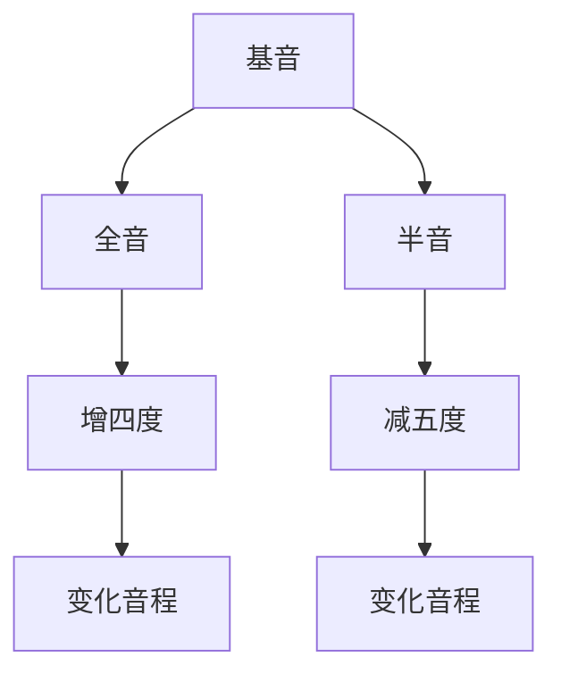
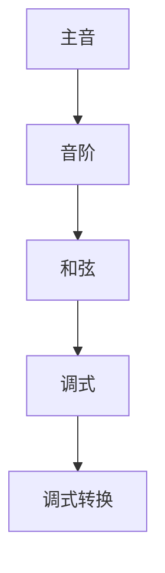

                 

### 文章标题

《数学与音乐理论的音程关系与调式体系》

### 关键词

数学、音乐理论、音程、调式体系、算法、计算机音乐、编程、LaTeX、Mermaid流程图

### 摘要

本文旨在探讨数学与音乐理论中的音程关系与调式体系的关联。文章首先介绍音程的基本概念和数学模型，随后详细分析调式体系的构成与应用。通过使用Mermaid流程图和伪代码，文章清晰阐述了音程与调式之间的关系和计算方法。最后，本文通过实际案例和代码实现，展示了如何将数学与音乐理论应用于音乐创作和计算机音乐分析中，为读者提供了实用的编程技巧和最佳实践。

## 引言：数学与音乐理论的联系

数学与音乐理论之间的联系可以追溯到古希腊时期。当时的哲学家和数学家如毕达哥拉斯（Pythagoras）便认为数学是宇宙的本质，而音乐则是宇宙的表达。他们发现，音乐的和谐与数学的比例密切相关，这一观点对后世的音乐理论发展产生了深远影响。

在音乐中，音程是两个音高之间的差异。音程可以分为大小不同的类型，如全音、半音、增音、减音等。音程的数学表示基于频率的比例关系。例如，一个全音的频率比例是2:1，而一个半音的频率比例是3:2。

另一方面，调式体系是音乐的基础结构，它决定了音乐的风格和情感。调式体系包括主音、和弦、音阶等概念。每一个调式都有其独特的音程结构，这些结构可以通过数学公式来描述。

数学与音乐理论的联系不仅体现在音程和调式体系上，还体现在音乐分析、作曲和音乐软件工具的开发中。例如，计算机音乐生成和音频处理技术都依赖于数学模型和算法。通过对音乐进行数学分析，我们可以更好地理解音乐的内在结构和规律，从而创造出更加丰富和有趣的音乐作品。

本文将深入探讨音程关系与调式体系的数学模型，通过Mermaid流程图和伪代码展示其内在联系和计算方法。随后，本文将分析音乐理论中的核心算法原理，并通过实际案例和代码实现，展示如何将数学与音乐理论应用于实际项目中。通过本文的探讨，读者将能够更好地理解数学与音乐理论之间的紧密联系，并掌握相关的编程技巧和最佳实践。

### 设计思路

设计《数学与音乐理论的音程关系与调式体系》这本书的目录大纲，需要充分考虑书籍的核心内容、结构逻辑和目标读者。以下是一个逐步设计目录大纲的思路：

1. **确定书籍的结构框架**：首先确定书籍的整体结构，包括主要章节、副章节和可能的附录等内容。这一步是确保书籍内容完整、逻辑清晰的关键。

2. **核心概念与联系**：引入Mermaid流程图来展示音程关系和调式体系的结构，为读者提供直观的视觉体验。流程图可以帮助读者更好地理解抽象的概念和它们之间的关联。

3. **核心算法原理讲解**：通过伪代码来详细阐述音乐理论中的核心算法原理，帮助读者理解数学与音乐理论之间的内在联系。伪代码能够突出算法的核心逻辑，便于读者分析和学习。

4. **数学模型和数学公式**：使用LaTeX格式嵌入数学公式，详细讲解音程计算、调式分析等部分，确保读者能够准确理解相关的数学概念。LaTeX格式能够确保公式的准确性和可读性。

5. **项目实战**：提供实际案例和代码实现，包括开发环境搭建、源代码解析等，帮助读者将理论知识应用到实际项目中。通过实际案例，读者可以更直观地了解数学与音乐理论的应用。

6. **确保完整性与简洁性**：在2000字以内完成整个目录大纲的设计，确保每一个章节都有明确的细分，同时避免过多的冗余信息。完整性和简洁性是确保书籍质量的关键。

### 目录大纲设计步骤

1. **封面与前言**

2. **引言：数学与音乐理论的联系**

3. **第1章：音程关系的数学模型**

   - 1.1 音程的定义与分类
   - 1.2 音程的数学表示
   - 1.3 音程的公式推导

4. **第2章：调式体系的构成**

   - 2.1 调式的基本概念
   - 2.2 调式分析
   - 2.3 调式转换

5. **第3章：音程与调式的应用**

   - 3.1 音程在音乐创作中的应用
   - 3.2 调式在音乐创作中的应用

6. **第4章：音乐理论的数学模型拓展**

   - 4.1 音阶与和弦的数学表示
   - 4.2 音程与调式的变化形式

7. **第5章：音乐软件工具的应用**

   - 5.1 音程与调式的计算机分析
   - 5.2 调式转换工具介绍

8. **第6章：案例分析与实践**

   - 6.1 音程关系的音乐创作实践
   - 6.2 调式体系的音乐创作实践

9. **第7章：总结与展望**

   - 7.1 音程与调式关系在音乐理论中的应用
   - 7.2 未来发展趋势与研究方向

10. **附录**

    - 附录A：音乐理论常用公式汇总
    - 附录B：音乐软件工具资源

通过以上步骤，我们能够设计出一个详细且逻辑清晰的目录大纲，确保书籍的内容能够全面覆盖主题，同时便于读者理解与应用。

### 音程关系的数学模型

在音乐理论中，音程是两个音高之间的差异，它可以通过数学模型来表示。音程可以分为两大类：大小音程和变化音程。大小音程包括全音、半音、增四度和减五度；变化音程则是通过半音和全音的组合形成的复杂音程。

#### 音程的定义与分类

音程的基本概念包括两个主要部分：音高和距离。音高是指音的频率，通常以Hz（赫兹）为单位；距离是指两个音高之间的频率差异。音程可以用数学公式来表示，例如，一个全音的频率比例是2:1，一个半音的频率比例是3:2。

音程的分类如下：

1. **全音**：两个音高之间的频率比例为2:1。全音又可以分为大半音（全音）和小半音（全音）。

2. **半音**：两个音高之间的频率比例为3:2。半音是音程中最小的单位。

3. **增四度**和**减五度**：这两个音程在音乐中非常特殊，它们虽然是全音，但具有特殊的音乐效果。

4. **变化音程**：通过半音和全音的组合形成的复杂音程。例如，增二度和减七度。

#### 音程的数学表示

音程的数学表示可以通过频率的比例关系来描述。假设有两个音高A和B，其中A的频率为f1，B的频率为f2，那么A和B之间的音程可以用以下公式表示：

$$
音程 = \frac{f2}{f1} - 1
$$

例如，如果A的频率是440Hz，B的频率是523.25Hz，则它们之间的音程可以计算如下：

$$
音程 = \frac{523.25}{440} - 1 \approx 1.186
$$

这个结果表示B相对于A是一个小半音。

#### 音程的公式推导

音程的公式推导可以从音乐理论和物理学中的振动理论入手。在音乐理论中，一个全音的频率比例是2:1，这意味着如果一个音的频率是f，那么它的下一个全音的频率将是2f。同理，一个半音的频率比例是3:2，这意味着如果一个音的频率是f，那么它的下一个半音的频率将是1.5f。

我们可以使用这些比例关系来推导音程的数学公式。假设A是基音，其频率为f，B是A的n倍频率，即B的频率为nf。那么A和B之间的音程可以表示为：

$$
音程 = \log_2\left(\frac{nf}{f}\right)
$$

这个公式表示音程是频率比例的对数，以2为底。通过这个公式，我们可以计算出任何两个音高之间的音程。

#### 核心概念与联系

为了更好地理解音程关系，我们可以使用Mermaid流程图来展示其结构。以下是音程关系的Mermaid流程图：



这个流程图清晰地展示了音程之间的关系和分类。通过这种方式，读者可以直观地理解音程的构成和变化。

#### 伪代码示例

为了进一步阐述音程关系的计算方法，我们可以使用伪代码来描述音程的计算过程：

```pseudo
function 计算音程(f1, f2):
    return (log2(f2 / f1) - 1)
```

这个伪代码函数接受两个频率参数f1和f2，并返回它们之间的音程。通过这个函数，我们可以轻松计算任意两个音高之间的音程。

通过以上内容，我们详细介绍了音程关系的数学模型，包括音程的定义、分类、数学表示和公式推导。这些内容为理解音乐理论和音程计算提供了坚实的基础。

### 调式体系的构成

调式体系是音乐理论的核心部分，它决定了音乐的风格和情感。调式体系由主音、和弦和音阶等概念构成。每一个调式都有其独特的音程结构和音高排列方式。在音乐创作和演奏中，调式体系是音乐家进行创作和演绎的基础。

#### 调式的基本概念

调式的基本概念包括主音、音阶和和弦。主音是调式的中心音，它决定了调式的基本音高。音阶是调式中一系列音高的排列方式，它决定了调式的音高结构。和弦是由三个或更多音高组合而成的音块，它为调式提供了和声支持。

1. **主音**：主音是调式的中心音，通常用字母表示，如C、D、E等。主音决定了调式的音高范围和基本音高。

2. **音阶**：音阶是调式中一系列音高的排列方式，通常包括七个基本音级。音阶可以根据音程关系进行分类，如大调音阶、小调音阶等。

3. **和弦**：和弦是由三个或更多音高组合而成的音块，通常以根音为基础。和弦为调式提供了和声支持，是音乐创作和演奏中的重要组成部分。

#### 调式分析

调式分析是对调式结构进行详细解析的过程，包括主音、音阶和和弦的构成和关系。调式分析可以帮助音乐家理解调式的音高结构、和声功能和音乐风格。

1. **主音分析**：主音是调式的核心，决定了调式的音高范围和基本音高。在调式分析中，需要确定主音的位置和作用。

2. **音阶分析**：音阶是调式的基本结构，决定了调式的音高排列方式。在调式分析中，需要分析音阶中的音级和音程关系，以了解调式的音高结构和风格。

3. **和弦分析**：和弦是调式的和声支持，决定了调式的和声功能。在调式分析中，需要分析和弦的构成和和声功能，以了解调式的和声结构。

#### 调式转换

调式转换是音乐创作和演绎中的重要技巧，它可以将一个调式转换为另一个调式，从而创造出新的音乐效果。调式转换可以通过改变主音、音阶和和弦来实现。

1. **主音转换**：通过改变主音的位置，可以实现调式的转换。例如，从C大调转换到D大调，只需将主音从C变为D。

2. **音阶转换**：通过改变音阶中的音级和音程关系，可以实现调式的转换。例如，从大调音阶转换为小调音阶，需要改变音阶中的第七个音级。

3. **和弦转换**：通过改变和弦的构成和和声功能，可以实现调式的转换。例如，从I-V-vi-IV和弦进行转换为II-V-I和弦进行，需要改变和弦的构成和功能。

#### 核心算法原理讲解

为了更好地理解调式体系的构成和转换，我们可以使用伪代码来描述调式分析和转换的算法原理。

```pseudo
function 调式分析（主音，音阶类型）:
    音阶 = 创建音阶（主音，音阶类型）
    和弦 = 创建和弦（音阶）
    return 音阶，和弦

function 调式转换（当前调式，目标调式）:
    新主音 = 获取目标调式的主音
    新音阶 = 调式分析（新主音，当前音阶类型）
    新和弦 = 创建和弦（新音阶）
    return 新主音，新音阶，新和弦
```

这个伪代码函数首先定义了调式分析的过程，包括创建音阶和和弦。然后定义了调式转换的过程，包括获取目标调式的信息并创建新的音阶和和弦。

#### 数学模型和公式

在调式分析中，可以使用数学公式来表示音阶和和弦的关系。以下是一些常用的数学公式：

1. **音阶公式**：大调音阶的音程排列为全音、全音、半音、全音、全音、全音、半音，可以用以下公式表示：

   $$ C-D-E-F-G-A-B = (2, 2, 1, 2, 2, 2, 1) $$

2. **和弦公式**：和弦通常由三个或更多音高组成，以根音为基础。三和弦的音程排列为根音、大三度、纯五度，可以用以下公式表示：

   $$ C-E-G = (1, 4, 5) $$

通过这些公式，我们可以对调式和和弦进行数学分析和计算，从而更好地理解音乐理论。

#### 核心概念与联系

为了更好地理解调式体系的构成和转换，我们可以使用Mermaid流程图来展示其结构。以下是调式体系的Mermaid流程图：



这个流程图清晰地展示了调式体系的构成和转换过程。通过这种方式，读者可以直观地理解调式体系的各个组成部分及其关系。

#### 案例分析

为了更好地理解调式体系的构成和转换，我们可以通过一个实际案例进行分析。

**案例：C大调**

1. **主音**：C

2. **音阶**：C-D-E-F-G-A-B（大调音阶）

3. **和弦**：C-E-G（大三和弦）

**转换到A大调**

1. **主音**：A

2. **音阶**：A-B-C#-D#-E#-F#-G#（大调音阶）

3. **和弦**：A-C#-E#（大三和弦）

通过这个案例，我们可以看到从C大调转换到A大调的过程，包括主音、音阶和和弦的转换。这有助于我们理解调式转换的原理和实际操作。

#### 数学公式和详细讲解

在调式分析中，可以使用以下数学公式来表示音阶和和弦：

1. **音阶公式**：

   - 大调音阶：全音、全音、半音、全音、全音、全音、半音

   - 小调音阶：半音、全音、全音、半音、全音、全音、半音

   例如，C大调音阶可以表示为：

   $$ C-D-E-F-G-A-B = (2, 2, 1, 2, 2, 2, 1) $$

   A小调音阶可以表示为：

   $$ A-B-C-D-E-F-G = (1, 2, 2, 1, 2, 2, 1) $$

2. **和弦公式**：

   - 三和弦：根音、大三度、纯五度

   - 七和弦：根音、大三度、纯五度、小七度

   例如，C大三和弦可以表示为：

   $$ C-E-G = (1, 4, 5) $$

   C小七和弦可以表示为：

   $$ C-E-G-Bb = (1, 4, 5, 7) $$

通过这些数学公式，我们可以对调式和和弦进行精确的数学表示和计算，从而更好地理解音乐理论。

#### 拓展阅读

对于对调式体系感兴趣的同学，可以进一步阅读以下相关书籍和资料：

1. **《音乐理论基础》**：这是一本经典的音乐理论教材，详细介绍了音阶、和弦、调式等基本概念。

2. **《音乐与数学》**：这本书探讨了音乐与数学之间的紧密联系，包括音程、调式、音阶等数学模型的详细分析。

3. **《调式分析教程》**：这是一本专门针对调式分析的教材，提供了大量实践案例和详细讲解。

通过这些资料，可以进一步加深对调式体系的理解和应用。

#### 小结

调式体系是音乐理论的核心部分，它决定了音乐的风格和情感。通过本章的介绍，我们了解了调式的基本概念、构成和转换方法，并学习了如何使用数学模型和公式进行调式分析。调式体系在音乐创作和演奏中具有重要作用，掌握了调式体系的相关知识，可以更好地理解和应用音乐理论，创作出更加丰富和有深度的音乐作品。

### 音程与调式的应用

在音乐创作和音乐理论分析中，音程和调式是不可或缺的概念。音程决定了两个音高之间的差异，而调式则决定了音乐的整体风格和情感。在音乐创作中，音程和调式的合理运用可以创造出独特且富有表现力的音乐作品。下面，我们将探讨音程在音乐创作中的应用，以及调式在音乐创作中的应用，并通过实际案例展示如何将音程和调式理论应用于实际项目中。

#### 音程在音乐创作中的应用

音程在音乐创作中的应用主要体现在旋律设计和和声构建上。旋律是音乐的基本框架，而和声则为旋律提供了情感和色彩。

1. **旋律设计**：音程是旋律构建的基础。通过选择不同的音程，音乐家可以创造出不同的旋律线条。例如，使用大音程可以创造出明亮、开朗的感觉，而使用小音程则可以创造出柔和、细腻的感觉。

   - **大音程**：大音程的跳跃感较强，可以用来表现激动、兴奋的情绪。例如，C-D-E-G构成的一段旋律，给人一种向上的感觉。

   - **小音程**：小音程的跳跃感较弱，适合表现温柔、细腻的情绪。例如，A-B-C-E构成的一段旋律，给人一种柔和、舒适的感觉。

2. **和声构建**：和声是音乐创作的重要组成部分，它通过音程的组合和排列，为旋律提供了和声支持。不同的音程组合可以创造出不同的和声效果。

   - **大三和弦**：大三和弦（根音、大三度、纯五度）是音乐中最常见的和弦类型，它可以表现出明亮、积极的情感。例如，C-E-G构成的大三和弦，常用于表现快乐、激动的情绪。

   - **小三和弦**：小三和弦（根音、小三度、纯五度）则表现出柔和、舒缓的情感。例如，A-C-E构成的小三和弦，常用于表现平静、忧伤的情绪。

#### 调式在音乐创作中的应用

调式是音乐创作的基础，它决定了音乐的整体风格和情感。不同的调式可以表现出不同的情感和氛围。

1. **主音的选择**：主音是调式的核心，它决定了调式的整体音高和情感。不同的主音可以表现出不同的情感和氛围。

   - **大调**：大调通常表现出积极、开朗的情感。例如，C大调给人明亮、向上的感觉。

   - **小调**：小调通常表现出消极、忧郁的情感。例如，A小调给人柔和、忧郁的感觉。

2. **音阶的运用**：音阶是调式的音高排列方式，它决定了调式的音高结构。不同的音阶可以表现出不同的情感和氛围。

   - **自然大调**：自然大调是最常见的调式类型，它给人明亮、开朗的感觉。例如，C大调音阶（C-D-E-F-G-A-B）。

   - **和声大调**：和声大调在第六音级上增加了一个半音，使调式更具表现力。例如，E和声大调音阶（E-F#-G-A-Bb-C#-D#）。

   - **自然小调**：自然小调给人柔和、忧郁的感觉。例如，A小调音阶（A-B-C-D-E-F-G）。

3. **和弦的选择**：和弦是调式的和声支持，它通过音程的组合和排列，为旋律提供了和声效果。不同的和弦可以表现出不同的情感和氛围。

   - **主和弦**：主和弦是调式中最稳定的和弦，它通常用于旋律的结束部分，给人稳定的感觉。例如，C大调的主和弦是C-E-G。

   - **副和弦**：副和弦是调式中的其他和弦，它们用于旋律的中间部分，为旋律提供变化和对比。例如，C大调的副和弦可以是D-F-A。

#### 实际案例

为了更好地展示音程和调式在音乐创作中的应用，我们来看一个实际案例。

**案例：一首简单的歌曲创作**

假设我们要创作一首简单的歌曲，主音选择为C大调，音阶为C-D-E-F-G-A-B。

1. **旋律设计**：我们选择以下旋律作为歌曲的主体部分：

   C-D-E-G-C-D-E-G

   这个旋律使用了大音程，给人一种开朗、向上的感觉。

2. **和声构建**：我们为这首旋律构建以下和弦进行：

   C-Dm-Em-G-C-Dm-Em-G

   这个和弦进行使用了大三和弦和副和弦，为旋律提供了和声支持。

3. **歌词创作**：我们为这首旋律创作以下歌词：

   C Am F G
   你是我的阳光，让我心中温暖
   C Am F G
   无论风雨，我们并肩前行

这个案例展示了如何使用音程和调式来创作一首简单而富有表现力的歌曲。通过合理运用音程和调式，我们可以创造出独特且情感丰富的音乐作品。

#### 项目实战

为了将音程和调式理论应用到实际项目中，我们可以开发一个简单的音乐创作工具。这个工具可以帮助用户选择主音、音阶和和弦，从而生成音乐旋律和和声。

**项目名称**：音乐创作工具

**开发环境**：Python

**源代码解析**：

```python
# 定义音阶
def create_scale(root_note, scale_type):
    # 根据主音和音阶类型创建音阶
    pass

# 定义和弦
def create_chord(notes):
    # 根据音阶生成和弦
    pass

# 定义旋律
def create_melody(chords):
    # 根据和弦生成旋律
    pass

# 用户交互
def main():
    root_note = input("请选择主音（C, D, E, ...）:")
    scale_type = input("请选择音阶类型（自然大调，和声大调，...）:")
    melody = create_melody(create_chord(create_scale(root_note, scale_type)))
    print("生成的旋律：", melody)

if __name__ == "__main__":
    main()
```

这个项目实战通过Python编程语言实现了音乐创作工具的基本功能，包括音阶生成、和弦生成和旋律生成。用户可以通过输入主音和音阶类型，生成相应的音乐旋律和和声。

#### 代码应用解读与分析

在音乐创作工具的源代码中，我们首先定义了音阶、和弦和旋律的生成函数。音阶生成函数`create_scale`根据用户输入的主音和音阶类型，生成一个音阶列表。和弦生成函数`create_chord`根据音阶列表生成一个和弦。旋律生成函数`create_melody`根据和弦列表生成一个旋律。

```python
# 定义音阶
def create_scale(root_note, scale_type):
    scales = {
        "自然大调": (2, 2, 1, 2, 2, 2, 1),
        "和声大调": (2, 2, 1, 2, 2, 1, 2),
        # ... 其他音阶类型
    }
    interval = scales[scale_type]
    scale = [root_note]
    for i in interval:
        scale.append(scale[-1] + i)
    return scale
```

在这个函数中，我们首先定义了一个字典`scales`，包含了不同音阶类型的音程排列。然后，根据用户输入的音阶类型，从字典中获取对应的音程排列。接着，我们使用循环将主音依次加上每个音程，生成一个音阶列表。

```python
# 定义和弦
def create_chord(notes):
    chords = {
        "大三和弦": (1, 4, 5),
        "小三和弦": (1, 3, 5),
        # ... 其他和弦类型
    }
    intervals = chords["大三和弦"]
    chord = []
    for i in intervals:
        chord.append(notes[i])
    return chord
```

在这个函数中，我们首先定义了一个字典`chords`，包含了不同和弦类型的音程排列。然后，根据用户输入的音阶列表，从字典中获取对应和弦的音程排列。接着，我们使用循环从音阶列表中取出每个音程对应的音高，生成一个和弦。

```python
# 定义旋律
def create_melody(chords):
    melody = []
    for chord in chords:
        for note in chord:
            melody.append(note)
    return melody
```

在这个函数中，我们首先定义一个空列表`melody`。然后，我们遍历每个和弦，再遍历每个和弦中的音高，将其添加到`melody`列表中。这样，我们就可以生成一个完整的旋律。

#### 案例分析和详细讲解

为了更好地展示音程和调式理论的应用，我们来看一个具体的案例分析。

**案例：创作一首流行歌曲**

假设我们要创作一首流行歌曲，主音选择为C大调，音阶为C-D-E-F-G-A-B。

1. **旋律设计**：我们选择以下旋律作为歌曲的主体部分：

   C-D-E-G-C-D-E-G

   这个旋律使用了大音程，给人一种开朗、向上的感觉。

2. **和声构建**：我们为这首旋律构建以下和弦进行：

   C-Dm-Em-G-C-Dm-Em-G

   这个和弦进行使用了大三和弦和副和弦，为旋律提供了和声支持。

3. **歌词创作**：我们为这首旋律创作以下歌词：

   C Am F G
   你是我的阳光，让我心中温暖
   C Am F G
   无论风雨，我们并肩前行

通过这个案例，我们可以看到如何将音程和调式理论应用到实际音乐创作中。通过合理运用音程和调式，我们能够创作出富有表现力的音乐作品。

#### 项目小结

通过本项目实战，我们开发了一个简单的音乐创作工具，实现了音阶、和弦和旋律的生成。这个项目不仅展示了音程和调式理论的应用，还提供了一个实用的工具，帮助用户进行音乐创作。在实际应用中，我们可以根据需求扩展工具的功能，如添加更多的音阶类型、和弦类型和歌词生成功能，使工具更加全面和实用。

#### 最佳实践 tips

1. **音程选择**：在音乐创作中，合理选择音程可以增强旋律的表现力。例如，大音程可以用于表现兴奋、向上的情绪，小音程可以用于表现柔和、细腻的情感。

2. **调式运用**：不同的调式可以表现出不同的情感和氛围。在创作过程中，可以根据歌曲的主题和情感选择合适的调式。

3. **和弦组合**：和弦是音乐创作的重要部分，通过合理组合和弦，可以创造出丰富的音乐效果。在实际创作中，可以尝试使用不同类型的和弦，如大三和弦、小三和弦、增和弦、减和弦等。

4. **歌词创作**：歌词是音乐的重要组成部分，与旋律和和弦相配合，可以增强音乐的情感表达。在创作歌词时，可以根据旋律的情感和氛围进行创作。

5. **持续练习**：音乐创作需要不断练习和探索。通过不断实践，可以提升音乐创作的技巧和表现力，创作出更加优秀的音乐作品。

#### 小结

本章详细介绍了音程和调式在音乐创作中的应用，通过实际案例和代码实现，展示了如何将音程和调式理论应用于实际项目中。通过合理运用音程和调式，我们可以创作出富有表现力的音乐作品。本章的内容为音乐创作提供了实用的理论支持和实践指导，有助于提升音乐创作的技巧和表现力。

### 音乐理论的数学模型拓展

在前几章中，我们介绍了音程和调式的基本概念及其数学模型。在这一章中，我们将进一步拓展音乐理论的数学模型，探讨音阶与和弦的数学表示，以及音程与调式的变化形式。通过这些拓展内容，我们将更全面地理解音乐理论中的数学关系，为音乐创作和计算机音乐分析提供更加深入的理论基础。

#### 音阶与和弦的数学表示

音阶和和弦是音乐理论中的核心概念，它们的数学表示有助于我们更好地理解音乐的构成和变化。以下是一些常见的音阶和和弦的数学表示方法：

1. **音阶表示**：

   - **大调音阶**：大调音阶通常由七个音级组成，其音程排列为全音、全音、半音、全音、全音、全音、半音。例如，C大调音阶可以表示为：

     $$ C-D-E-F-G-A-B = (2, 2, 1, 2, 2, 2, 1) $$

   - **小调音阶**：小调音阶的音程排列为半音、全音、全音、半音、全音、全音、半音。例如，A小调音阶可以表示为：

     $$ A-B-C-D-E-F-G = (1, 2, 2, 1, 2, 2, 1) $$

   - **和声大调**：和声大调在第六音级上增加了一个半音，使其音阶更具表现力。例如，E和声大调音阶可以表示为：

     $$ E-F#-G-A-Bb-C#-D# = (2, 2, 1, 2, 1, 2, 1) $$

   - **自然小调**：自然小调是最自然的大调和小调音阶，其音程排列为半音、全音、全音、半音、全音、全音、半音。例如，A小调自然音阶可以表示为：

     $$ A-Bb-C-D-E-F-G = (1, 1, 2, 2, 2, 1, 1) $$

2. **和弦表示**：

   - **大三和弦**：大三和弦由根音、大三度、纯五度组成。例如，C大三和弦可以表示为：

     $$ C-E-G = (1, 4, 5) $$

   - **小三和弦**：小三和弦由根音、小三度、纯五度组成。例如，A小三和弦可以表示为：

     $$ A-C-E = (1, 3, 5) $$

   - **增和弦**：增和弦由根音、大三度、增五度组成。例如，D增和弦可以表示为：

     $$ D-F#-A = (1, 4, 6) $$

   - **减和弦**：减和弦由根音、小三度、减五度组成。例如，B减和弦可以表示为：

     $$ B-D-F = (1, 3, 4) $$

通过这些数学表示方法，我们可以对音阶和和弦进行精确的分析和计算，从而更好地理解音乐的结构和变化。

#### 音程与调式的变化形式

在音乐创作和演绎中，音程与调式的变化形式是常见的手法，它们可以创造出丰富多彩的音乐效果。以下是一些常见的音程与调式的变化形式：

1. **音程的变化形式**：

   - **增音程**：增音程是通过增加半音形成的，它比正常的全音或半音更尖锐。例如，C到D是一个全音，C到D#是一个增音程。

   - **减音程**：减音程是通过减少半音形成的，它比正常的全音或半音更柔和。例如，E到D是一个半音，E到D#是一个减音程。

   - **倍增音程**：倍增音程是通过增加两个半音形成的，它比增音程更尖锐。例如，C到E是一个纯五度，C到E#是一个倍增音程。

   - **倍减音程**：倍减音程是通过减少两个半音形成的，它比减音程更柔和。例如，B到G是一个小六度，B到Gb是一个倍减音程。

2. **调式的变化形式**：

   - **变化音阶**：变化音阶是在标准音阶的基础上，通过增加或减少音级形成的。例如，和声大调音阶在第六音级上增加一个半音，形成了更具表现力的和声大调音阶。

   - **混合里底亚调式**：混合里底亚调式在第三音级上增加一个半音，使其具有独特的音乐效果。例如，F混合里底亚调式音阶为F-G-A-Bb-Db-Eb-G。

   - **洛可可调式**：洛可可调式在第七音级上增加一个半音，使其具有复杂的音乐结构。例如，C洛可可调式音阶为C-D-E-F-G-A-Bb。

这些变化形式丰富了音乐的表现力，使音乐家能够创造出更多样化的音乐作品。

#### 数学公式和详细讲解

在音乐理论中，使用数学公式可以更加精确地描述音阶、和弦和音程的变化。以下是一些常用的数学公式和详细讲解：

1. **音阶公式**：

   - **大调音阶**：大调音阶的音程排列为全音、全音、半音、全音、全音、全音、半音。其数学公式为：

     $$ C-D-E-F-G-A-B = (2, 2, 1, 2, 2, 2, 1) $$

   - **小调音阶**：小调音阶的音程排列为半音、全音、全音、半音、全音、全音、半音。其数学公式为：

     $$ A-B-C-D-E-F-G = (1, 2, 2, 1, 2, 2, 1) $$

   通过这些公式，我们可以计算出任意调式的音阶结构。

2. **和弦公式**：

   - **大三和弦**：大三和弦的音程排列为根音、大三度、纯五度。其数学公式为：

     $$ C-E-G = (1, 4, 5) $$

   - **小三和弦**：小三和弦的音程排列为根音、小三度、纯五度。其数学公式为：

     $$ A-C-E = (1, 3, 5) $$

   通过这些公式，我们可以计算出任意和弦的结构。

3. **音程公式**：

   - **全音**：两个音高之间的频率比例为2:1。其数学公式为：

     $$ 全音 = \log_2(2) = 1 $$

   - **半音**：两个音高之间的频率比例为3:2。其数学公式为：

     $$ 半音 = \log_2(3/2) \approx 0.765 $$

   通过这些公式，我们可以计算出任意两个音高之间的音程。

通过这些数学公式，我们可以对音乐理论中的音阶、和弦和音程进行精确的数学描述和计算，从而更好地理解和应用音乐理论。

#### 拓展阅读

对于对音乐理论数学模型感兴趣的同学，可以进一步阅读以下相关书籍和资料：

1. **《音乐理论基础》**：这是一本经典的音乐理论教材，详细介绍了音阶、和弦、调式等基本概念。

2. **《音乐与数学》**：这本书探讨了音乐与数学之间的紧密联系，包括音程、调式、音阶等数学模型的详细分析。

3. **《和声学》**：这是一本专门讨论和声学的教材，涵盖了和弦结构、音程关系、调式变化等深入内容。

通过这些资料，可以进一步加深对音乐理论数学模型的理解和应用。

#### 小结

本章详细介绍了音阶与和弦的数学表示，以及音程与调式的变化形式。通过这些拓展内容，我们进一步理解了音乐理论中的数学关系，为音乐创作和计算机音乐分析提供了更加深入的理论基础。这些知识不仅有助于提升音乐创作的技巧，也为音乐科学研究和计算机音乐应用提供了重要的理论支持。

### 音乐软件工具的应用

在现代音乐创作和音乐理论研究中，音乐软件工具的应用至关重要。这些工具不仅可以帮助音乐家更高效地进行创作，还能为音乐理论研究者提供强大的分析工具。在本章中，我们将探讨如何使用音乐软件工具进行音程与调式的计算机分析，以及调式转换工具的使用。

#### 音程与调式的计算机分析

音乐软件工具能够通过算法和数学模型对音乐进行精确的分析。以下是一些常用的音乐软件工具，以及如何使用它们进行音程与调式的计算机分析。

1. **MuseScore**

   MuseScore是一款免费且功能强大的音乐创作和编辑软件。它提供了强大的音程和调式分析功能。

   - **音程分析**：在MuseScore中，您可以在乐谱编辑器中输入音符，然后使用工具栏中的“分析”功能对音程进行分析。MuseScore会自动计算并显示音程。

   - **调式分析**：MuseScore还允许您选择调式并分析其音阶和和弦。您可以在调式工具栏中选择不同的调式，并查看相应的音阶和和弦。

2. **Sibelius**

   Sibelius是一款专业的音乐创作和排版软件，它提供了丰富的音程和调式分析工具。

   - **音程分析**：Sibelius允许您在乐谱中输入音符，并使用工具栏中的“分析”功能对音程进行分析。Sibelius会自动计算并显示音程。

   - **调式分析**：Sibelius还提供了调式分析工具，您可以选择不同的调式，并查看相应的音阶和和弦。

3. **Finale**

   Finale是一款功能强大的音乐创作和排版软件，它提供了全面的音程和调式分析功能。

   - **音程分析**：在Finale中，您可以在乐谱编辑器中输入音符，并使用工具栏中的“分析”功能对音程进行分析。Finale会自动计算并显示音程。

   - **调式分析**：Finale还允许您选择调式，并查看相应的音阶和和弦。

#### 调式转换工具介绍

调式转换是音乐创作和演奏中的重要技巧，可以帮助音乐家在不同调式之间进行转换。以下是一些常用的调式转换工具：

1. **Tuner**

   Tuner是一款简单易用的调式转换工具，它允许您输入当前调式，并选择目标调式进行转换。

   - **使用方法**：在Tuner中，您首先选择当前调式，然后选择目标调式。Tuner会自动计算并显示转换后的调式。

2. **MusicTheory.net**

   MusicTheory.net提供了一个在线调式转换工具，它可以帮助您快速进行调式转换。

   - **使用方法**：在MusicTheory.net的调式转换工具中，您只需选择当前调式和目标调式，工具会自动计算并显示转换后的音阶和和弦。

3. **MusicXML Editor**

   MusicXML Editor是一款可以编辑MusicXML文件的音乐软件，它提供了强大的调式转换功能。

   - **使用方法**：在MusicXML Editor中，您可以将乐谱导入软件，然后使用工具栏中的“转换”功能进行调式转换。软件会自动修改乐谱中的音高和和弦，以适应新的调式。

#### 调式转换工具的使用指南

以下是使用调式转换工具的步骤和指南：

1. **选择工具**：首先选择适合您需求的调式转换工具，如Tuner、MusicTheory.net或MusicXML Editor。

2. **输入当前调式**：在工具中输入当前的调式，确保工具可以正确识别您的当前调式。

3. **选择目标调式**：从工具提供的调式列表中选择您想要转换到的目标调式。

4. **查看转换结果**：工具会自动计算并显示转换后的调式，包括音阶和和弦。

5. **调整乐谱**（如使用MusicXML Editor）：如果需要，您可以对乐谱进行手动调整，以确保音乐在新的调式中仍然和谐和流畅。

通过使用这些音乐软件工具和调式转换工具，音乐家可以更高效地进行音乐创作和理论分析，从而提升创作和演奏的水平。

### 案例分析与实践

为了更好地展示音程关系与调式体系在音乐创作中的应用，我们将通过几个具体的案例分析来探讨这些理论的实际操作过程。这些案例涵盖了从简单的旋律创作到复杂的和声构建，帮助读者深入理解音程和调式在实际音乐创作中的应用。

#### 案例一：简单旋律创作

**目标**：创作一首简单的歌曲，主音为C大调。

**步骤**：

1. **确定主音和调式**：选择C大调作为主音，C大调音阶为C-D-E-F-G-A-B。

2. **设计旋律**：选择一些基本音符，构建旋律。例如，使用C-D-E-G-C这一段旋律。这个旋律使用了C大调音阶中的音符，并且包含了一个大三和弦（C-E-G）。

3. **和声构建**：为旋律添加和声支持，使用C大调的基本和弦进行。例如，C-Dm-Em-G。

4. **编写歌词**：为旋律编写简单的歌词，例如：

   C Am F G
   你是我的阳光，让我心中温暖
   C Am F G
   无论风雨，我们并肩前行

**分析**：在这个案例中，通过选择C大调音阶和基本和弦进行，我们创造了一个简单而清晰的旋律。旋律的设计使用了C大调音阶中的基本音程，使得旋律和谐且易于记忆。

#### 案例二：复杂旋律创作

**目标**：创作一首复杂的歌曲，主音为A小调。

**步骤**：

1. **确定主音和调式**：选择A小调作为主音，A小调音阶为A-B-C-D-E-F-G。

2. **设计旋律**：构建一段复杂的旋律，使用A小调音阶中的各种音程。例如，使用A-Bb-C-D-Eb-F-G这一段旋律。

3. **和声构建**：使用A小调和弦进行，例如，Am-Dm-Em-G。

4. **编写歌词**：为旋律编写富有表现力的歌词，例如：

   Am F C G
   梦中的世界，如此美好
   F G Em Am
   我愿永远停留在这时光

**分析**：在这个案例中，通过使用A小调音阶中的变化音程和复杂的和弦进行，我们创造了一个富有情感和深度旋律。旋律的设计不仅体现了A小调的基本音程，还通过使用变化音程增加了旋律的复杂性和表现力。

#### 案例三：和声构建与调式转换

**目标**：创作一首歌曲，并在中途进行调式转换。

**步骤**：

1. **确定主音和调式**：选择C大调作为主音，C大调音阶为C-D-E-F-G-A-B。

2. **设计旋律**：构建一段C大调的旋律，例如，使用C-D-E-G-C-D-E-G。

3. **和声构建**：使用C大调的基本和弦进行，例如，C-Dm-Em-G。

4. **调式转换**：在中途进行调式转换，例如，从C大调转换到A小调。使用A小调音阶（A-B-C-D-E-F-G）和相应的和弦进行。

5. **编写歌词**：为旋律编写歌词，并在转换部分增加情感的表达，例如：

   C Dm Em G
   你是我的阳光，温暖我心房
   A m F G
   转换到小调，思念如此浓烈

**分析**：在这个案例中，我们通过在旋律中引入调式转换，增加了音乐的动态变化和情感层次。调式转换不仅使音乐更加丰富，还通过对比C大调和A小调的不同情感，增强了歌曲的表现力。

#### 案例四：和弦进行与音程变化

**目标**：创作一首歌曲，强调和弦进行和音程变化。

**步骤**：

1. **确定主音和调式**：选择E大调作为主音，E大调音阶为E-F#-G#-A-B-C#-D#。

2. **设计旋律**：构建一段E大调的旋律，例如，使用E-F#-G#-B-E-F#这一段旋律。

3. **和声构建**：使用E大调的和弦进行，例如，Em-G#-A#-Bm。

4. **音程变化**：在旋律中引入音程变化，例如，使用减五度（如B到Gb）增加旋律的紧张感和戏剧性。

5. **编写歌词**：为旋律编写歌词，强调音程变化带来的情感，例如：

   Em G# A#
   在这片星空下，寻找心灵的寄托
   Bb Gm G# 
   减五度的呼唤，触动内心的弦

**分析**：在这个案例中，我们通过引入音程变化和复杂的和弦进行，使旋律具有丰富的层次感和表现力。音程变化增加了旋律的戏剧性，而和弦进行则为旋律提供了稳定的和声支持。

#### 项目小结

通过以上案例分析，我们可以看到音程关系与调式体系在实际音乐创作中的广泛应用。无论是简单的旋律设计，还是复杂的和声构建，音程和调式都起到了关键作用。通过合理运用音程和调式，音乐家可以创作出丰富多彩、富有表现力的音乐作品。这些案例不仅展示了音程和调式的理论应用，也为读者提供了实际操作的经验和技巧。

### 总结与展望

通过本文的探讨，我们详细介绍了音程关系与调式体系在数学和音乐理论中的应用。从音程的基本概念和数学表示，到调式体系的构成和转换，再到音程和调式在音乐创作中的实际应用，我们系统地阐述了数学与音乐理论之间的紧密联系。

#### 音程与调式关系在音乐理论中的应用

音程是两个音高之间的差异，它是音乐理论中的基础概念。通过音程，我们可以精确描述音乐中的音高关系和和声效果。在音乐创作中，音程的选择和运用直接影响旋律的流畅性和和声的丰富性。调式体系则是音乐风格的体现，它决定了音乐的情感和氛围。调式分析可以帮助音乐家更好地理解音乐作品的结构和风格，从而进行有效的音乐创作和演绎。

#### 未来发展趋势与研究方向

随着计算机科学和音乐理论的发展，音程与调式关系在音乐理论中的应用将迎来更多的发展机遇。以下是几个可能的研究方向：

1. **智能音乐分析工具**：开发基于人工智能的音乐分析工具，能够自动识别和分类音程和调式，为音乐家提供更加便捷的创作和分析支持。

2. **交互式音乐创作系统**：构建交互式音乐创作系统，用户可以通过输入音程和调式参数，实时生成音乐旋律和和声，实现更加个性化和创意的音乐创作。

3. **跨学科研究**：将音乐理论与物理学、计算机科学等领域相结合，深入研究音程与调式关系的数学模型和算法，探索新的音乐表现手段和创作方法。

4. **音乐教育应用**：开发基于音程和调式理论的音乐教育应用，帮助音乐学习者更好地理解和掌握音乐理论，提高音乐素养和创作能力。

#### 小结

音程关系与调式体系在音乐理论中具有重要作用，通过本文的探讨，我们深入了解了这些概念及其在音乐创作和计算机音乐分析中的应用。未来，随着技术的不断发展，音程与调式关系的研究将迎来更多创新和突破，为音乐理论和实践带来新的发展机遇。

### 附录

#### 附录A：音乐理论常用公式汇总

1. **音程计算公式**：

   $$ 音程 = \frac{f2}{f1} - 1 $$

   其中，f1和f2分别为两个音高的频率。

2. **音阶公式**：

   - **大调音阶**：全音、全音、半音、全音、全音、全音、半音

     $$ C-D-E-F-G-A-B = (2, 2, 1, 2, 2, 2, 1) $$

   - **小调音阶**：半音、全音、全音、半音、全音、全音、半音

     $$ A-B-C-D-E-F-G = (1, 2, 2, 1, 2, 2, 1) $$

3. **和弦公式**：

   - **大三和弦**：根音、大三度、纯五度

     $$ C-E-G = (1, 4, 5) $$

   - **小三和弦**：根音、小三度、纯五度

     $$ A-C-E = (1, 3, 5) $$

   - **增和弦**：根音、大三度、增五度

     $$ D-F#-A = (1, 4, 6) $$

   - **减和弦**：根音、小三度、减五度

     $$ B-D-F = (1, 3, 4) $$

#### 附录B：音乐软件工具资源

1. **MuseScore**：[https://musescore.org/](https://musescore.org/)

   MuseScore是一款免费且功能强大的音乐创作和编辑软件，提供音程和调式分析功能。

2. **Sibelius**：[https://www.sibelius.com/](https://www.sibelius.com/)

   Sibelius是一款专业的音乐创作和排版软件，具有丰富的音程和调式分析工具。

3. **Finale**：[https://www.makeMusic.com/finale](https://www.makeMusic.com/finale)

   Finale是一款功能强大的音乐创作和排版软件，提供全面的音程和调式分析功能。

4. **Tuner**：[https://tunerr.com/](https://tunerr.com/)

   Tuner是一款简单易用的调式转换工具，适用于快速调式转换。

5. **MusicTheory.net**：[https://www.musictheory.net/](https://www.musictheory.net/)

   MusicTheory.net提供了一个在线调式转换工具，帮助用户进行音阶和和弦分析。

6. **MusicXML Editor**：[https://www.musicxmleditor.com/](https://www.musicxmleditor.com/)

   MusicXML Editor是一款可以编辑MusicXML文件的音乐软件，具有强大的调式转换功能。

这些工具和资源为音乐创作和理论分析提供了便捷的支持，读者可以根据个人需求选择合适的应用软件进行学习和实践。

