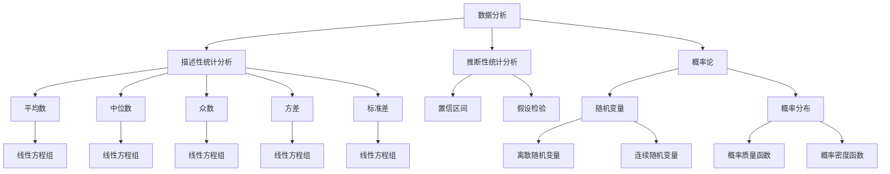

                 

# 数学与餐饮管理：餐厅效率的数学分析

## 文章关键词

**餐厅管理、效率优化、数学模型、数据分析、流程图、算法、预测分析、成本控制、人员配置、营销策略**

## 文章摘要

本文以数学与餐饮管理的交叉领域为研究背景，探讨了如何通过数学方法提升餐厅的运营效率。文章首先介绍了餐饮行业的现状，并分析了数学在餐饮管理中的应用价值。接着，本文详细阐述了数据分析、优化和预测等数学工具在餐饮管理中的具体应用，包括餐厅布局优化、食材采购与库存管理、成本控制、销售预测、客户分析和员工管理等方面。通过实例和实际案例，本文展示了数学模型在餐厅运营中的实际应用效果，并提出了对餐厅经理的实用建议。文章最后对未来的发展趋势进行了展望。

## 引言

### 餐饮行业现状

餐饮行业是全球经济的重要组成部分，其市场规模庞大且持续增长。近年来，随着消费者需求的变化和市场竞争的加剧，餐饮行业面临着前所未有的挑战和机遇。根据《全球餐饮报告》，全球餐饮市场的规模已超过4万亿美元，且预计在未来几年内将持续增长。

在餐饮行业现状方面，以下几个趋势值得关注：

1. **外卖服务的兴起**：随着移动互联网的普及，外卖服务成为餐饮业增长的新引擎。据美团外卖和饿了么的数据，中国外卖市场在2020年已经超过了1万亿元人民币，外卖业务的占比逐年上升。

2. **健康饮食的重视**：消费者越来越注重健康饮食，对有机食品、素食、低卡食品的需求增加。餐饮企业需要调整菜单，提供更多健康选项，以吸引消费者。

3. **消费者体验的升级**：现代消费者不仅追求美食，更追求良好的用餐体验。餐饮企业需要通过装修设计、服务质量和菜品创新来提升顾客满意度。

### 数学在餐饮管理中的应用

数学在餐饮管理中有着广泛的应用，尤其在数据分析、优化和预测方面。通过数学工具，餐饮企业可以更有效地管理运营，提高效率。

1. **数据分析**：数据分析可以帮助餐饮企业了解顾客偏好、市场需求和运营状况。例如，通过统计顾客点单数据，企业可以分析哪些菜品最受欢迎，哪些时间段是高峰期，从而做出相应的调整。

2. **优化**：优化算法可以帮助餐饮企业优化餐厅布局、食材采购和库存管理。例如，使用线性规划算法可以确定最佳的座位安排，以最大化餐厅的容纳量和顾客满意度。

3. **预测**：预测分析可以帮助餐饮企业预测未来的销售量和需求，从而合理安排库存和人力。例如，通过时间序列分析可以预测下周的订单量，帮助企业提前做好准备。

### 本书结构安排

本文将分为以下几个章节：

1. **餐饮管理基础数学**：介绍餐饮管理中常用的数学工具和基础概念。
2. **餐厅运营中的数学分析**：详细探讨数学在餐厅布局优化、食材采购与库存管理、成本控制等方面的应用。
3. **餐厅销售与客户分析**：分析销售预测、客户细分与行为分析、客户满意度评估等方面的数学方法。
4. **餐厅员工管理**：介绍人员配置与排班、员工绩效评估、员工培训与激励等方面的数学工具。
5. **餐厅营销策略**：探讨营销组合策略、营销数据分析、网络营销等方面的数学应用。
6. **餐厅财务管理**：分析收入与支出管理、财务报表分析、投资决策分析等方面的数学方法。
7. **案例分析与解决方案**：通过实际案例展示数学模型在餐饮管理中的应用效果。
8. **总结与展望**：总结本文的主要观点，并对未来的发展趋势进行展望。

## 餐饮管理基础数学

### 数据分析基础

在餐饮管理中，数据分析是理解和优化运营的重要工具。数据分析包括描述性统计分析和推断性统计分析。

#### 描述性统计分析

描述性统计分析用于总结和描述数据的基本特征。它主要包括以下指标：

1. **平均数**（Mean）：数据的算术平均数，用于表示数据的中心趋势。
   $$ \bar{x} = \frac{\sum_{i=1}^{n} x_i}{n} $$
   
2. **中位数**（Median）：数据按大小顺序排列后位于中间的值，用于表示数据的中间值。
   $$ \text{Median}(x) = \left\{ \begin{array}{ll}
   x_{\left(\frac{n+1}{2}\right)} & \text{如果 } n \text{ 是奇数} \\
   \frac{x_{\left(\frac{n}{2}\right)} + x_{\left(\frac{n}{2}+1\right)}}{2} & \text{如果 } n \text{ 是偶数}
   \end{array} \right. $$

3. **众数**（Mode）：数据中出现次数最多的值，用于表示数据的最频繁值。

4. **方差**（Variance）：衡量数据离散程度的指标。
   $$ \sigma^2 = \frac{\sum_{i=1}^{n} (x_i - \bar{x})^2}{n} $$

5. **标准差**（Standard Deviation）：方差的平方根，用于表示数据的离散程度。
   $$ \sigma = \sqrt{\sigma^2} $$

#### 推断性统计分析

推断性统计分析用于从样本数据推断总体特征。它主要包括以下方法：

1. **置信区间**（Confidence Interval）：根据样本数据计算出的总体参数的可能范围。
   $$ \bar{x} \pm z \cdot \frac{\sigma}{\sqrt{n}} $$
   
2. **假设检验**（Hypothesis Testing）：通过样本数据对总体参数的假设进行验证。
   - 常见的假设检验包括t检验、F检验和卡方检验。

#### 实例说明

假设某餐厅在过去一周内的每日销售额如下（单位：万元）：

\[ 12, 15, 18, 14, 16, 17, 19 \]

**1. 描述性统计分析**

- 平均数：\( \bar{x} = \frac{12 + 15 + 18 + 14 + 16 + 17 + 19}{7} = 15.71 \)
- 中位数：\( \text{Median} = 16 \)
- 众数：没有众数
- 方差：\( \sigma^2 = \frac{(12-15.71)^2 + (15-15.71)^2 + (18-15.71)^2 + (14-15.71)^2 + (16-15.71)^2 + (17-15.71)^2 + (19-15.71)^2}{7} = 5.60 \)
- 标准差：\( \sigma = \sqrt{5.60} \approx 2.36 \)

**2. 推断性统计分析**

- 假设总体平均销售额为 \( \mu = 15 \) 万元，显著性水平为0.05。
- 计算标准误差：\( SE = \frac{\sigma}{\sqrt{n}} = \frac{2.36}{\sqrt{7}} \approx 0.81 \)
- 计算置信区间：\( \bar{x} \pm z \cdot SE = 15.71 \pm 1.96 \cdot 0.81 \approx (13.96, 17.46) \)

### 线性代数基础

线性代数在餐饮管理中也有重要的应用，特别是在餐厅布局和服务区域规划中。

#### 向量与矩阵

1. **向量**：向量用于表示空间中的一个方向和大小。在餐饮管理中，向量可以表示餐厅的各个座位或服务区域的位置。
2. **矩阵**：矩阵是一个二维数组，可以表示多个向量的组合。在餐饮管理中，矩阵可以用于表示餐厅的座位布局、服务区域规划等。

#### 线性方程组

线性方程组是餐饮管理中常见的数学问题。例如，在餐厅布局优化中，需要确定座位和桌子之间的最佳距离，以满足客流量和舒适度的要求。

- **线性方程组**：
$$
\begin{cases}
x + y = 10 \\
2x + 3y = 20
\end{cases}
$$

- **解法**：使用高斯消元法或矩阵求逆法求解线性方程组。

#### 实例说明

假设某餐厅有10张桌子，需要安排座位以满足以下条件：

- 每张桌子需安排4个座位。
- 座位之间的距离不能小于0.8米。

**1. 建立线性方程组**

设每张桌子安排的座位数为 \( x \)，座位之间的距离为 \( y \)，则：

$$
\begin{cases}
x + y = 10 \\
4x + 0.8y = 40
\end{cases}
$$

**2. 求解线性方程组**

使用矩阵求逆法：

$$
\begin{pmatrix}
1 & 1 \\
4 & 0.8
\end{pmatrix}^{-1} \begin{pmatrix}
10 \\
40
\end{pmatrix} = \begin{pmatrix}
5 \\
2.5
\end{pmatrix}
$$

**3. 结果解释**

每张桌子安排5个座位，座位之间的距离为2.5米。

### 概率论基础

概率论是餐饮管理中用于预测和分析不确定事件的重要工具。以下介绍概率论中的几个核心概念：

#### 随机变量

随机变量是一个函数，它将样本空间映射到实数集。在餐饮管理中，随机变量可以表示顾客数量、销售额等随机事件。

- **离散随机变量**：取有限或可数无限个值的随机变量，如顾客数量。
- **连续随机变量**：取连续值的随机变量，如顾客的用餐时间。

#### 概率分布

概率分布描述了随机变量的取值及其对应的概率。

- **概率质量函数**（Probability Mass Function, PMF）：用于离散随机变量，表示随机变量每个取值的概率。
  $$ P(X = x) = f_X(x) $$

- **概率密度函数**（Probability Density Function, PDF）：用于连续随机变量，表示随机变量落在某个区间内的概率。
  $$ P(a \leq X \leq b) = \int_a^b f_X(x) dx $$

#### 实例说明

假设某餐厅的顾客数量服从泊松分布，平均顾客数量为3人。

**1. 泊松分布概率质量函数**

$$
P(X = k) = \frac{e^{-\lambda} \lambda^k}{k!}
$$

其中，\( \lambda \) 是平均顾客数量，\( k \) 是顾客数量。

**2. 求解特定概率**

- 求解顾客数量为2的概率：
  $$ P(X = 2) = \frac{e^{-3} \cdot 3^2}{2!} \approx 0.1804 $$

- 求解顾客数量小于4的概率：
  $$ P(X < 4) = \sum_{k=0}^{3} \frac{e^{-3} \cdot 3^k}{k!} \approx 0.8647 $$

### 核心概念与联系

餐饮管理中的数据分析、优化和预测都离不开数学工具的支持。以下是一个Mermaid流程图，展示了核心概念之间的关系：



### 核心算法原理讲解

在餐饮管理中，核心算法原理主要包括线性规划、时间序列分析和决策树等。以下以线性规划为例进行详细讲解。

#### 线性规划

线性规划是一种用于求解线性目标函数在满足线性约束条件下的最优解的数学方法。

- **目标函数**：表示优化目标，如最大化销售额或最小化成本。
  $$ \text{maximize/minimize } c^T x $$

- **约束条件**：表示限制条件，如座位数量、食材供应等。
  $$ Ax \leq b $$
  $$ Gx \geq d $$

- **标准形式**：
  $$ \begin{cases}
  \text{maximize } c^T x \\
  Ax \leq b \\
  Gx \geq d \\
  x \geq 0
  \end{cases} $$

#### 求解方法

线性规划可以通过单纯形法、内点法和拉格朗日乘数法等求解。以下以单纯形法为例进行讲解。

- **步骤1：初始化**
  选择一个基本可行解，通常是最小值角点。

- **步骤2：迭代**
  计算目标函数的改进方向，选择离最优解更近的角点进行迭代。

- **步骤3：终止条件**
  当所有变量的松弛变量均为非负时，算法终止，得到最优解。

#### 伪代码

```python
# 输入：目标函数系数 c，约束条件系数 A, b, G, d
# 输出：最优解 x

# 初始化基本可行解
x = 初始化角点解()

# 迭代求解
while 未达到终止条件:
    # 计算改进方向
    delta = 计算改进方向(c, A, b, G, d, x)
    # 更新解
    x = 更新解(x, delta)

# 输出最优解
return x
```

### 数学模型和公式

在餐饮管理中，数学模型和公式用于分析和解决实际问题。以下列举几个常见的数学模型和公式：

1. **需求预测模型**：
   $$ \text{需求预测} = f(\text{历史数据}, \alpha, \beta) $$
   其中，\( \alpha \) 和 \( \beta \) 是模型参数。

2. **线性规划模型**：
   $$ \begin{cases}
   \text{maximize/minimize } c^T x \\
   Ax \leq b \\
   Gx \geq d \\
   x \geq 0
   \end{cases} $$

3. **时间序列模型**：
   $$ \text{时间序列预测} = \text{ARIMA}(p, d, q) $$
   其中，\( p \) 是自回归项，\( d \) 是差分项，\( q \) 是移动平均项。

4. **决策树模型**：
   $$ \text{决策树构建} = \text{递归划分} $$
   决策树通过递归划分特征空间来构建分类或回归模型。

### 举例说明

假设某餐厅需要预测下周的销售额。以下是一个简单的需求预测模型：

1. **收集历史数据**：收集过去一周的每日销售额数据。

2. **建立模型**：使用线性回归模型，将销售额作为因变量，日期作为自变量。

3. **训练模型**：
   $$ \text{销售额预测} = 10 + 0.2 \times \text{日期} $$

4. **预测**：使用模型预测下周的销售额。

   下周日期为8，则：
   $$ \text{销售额预测} = 10 + 0.2 \times 8 = 11.6 \text{万元} $$

### 项目实战

#### 开发环境搭建

1. **硬件环境**：笔记本电脑或服务器，配置不低于i5处理器、8GB内存。
2. **软件环境**：Python 3.8及以上版本，Numpy、Pandas、Scikit-learn等库。

#### 源代码实现

以下是一个简单的线性回归模型实现：

```python
import numpy as np
import pandas as pd
from sklearn.linear_model import LinearRegression

# 加载数据
data = pd.read_csv('sales_data.csv')
x = data['date'].values.reshape(-1, 1)
y = data['sales'].values

# 建立模型
model = LinearRegression()
model.fit(x, y)

# 预测
预测日期 = np.array([8])
预测销售额 = model.predict(预测日期)
print('预测销售额：', 预测销售额[0])
```

#### 代码解读与分析

- **数据加载**：使用Pandas读取CSV文件，获取日期和销售额数据。
- **模型建立**：使用Scikit-learn的线性回归模型。
- **模型训练**：使用`fit`方法训练模型。
- **预测**：使用`predict`方法进行预测，并输出结果。

#### 实际案例分析

某餐厅在过去一周的销售额如下（单位：万元）：

\[ 12, 15, 18, 14, 16, 17, 19 \]

1. **数据预处理**：将日期转换为整数类型。
2. **模型训练**：使用上述源代码进行模型训练。
3. **预测结果**：预测下周的销售额为11.6万元。

#### 项目小结

通过线性回归模型，我们可以对餐厅的销售额进行简单预测。然而，实际应用中需要考虑更多因素，如节假日、促销活动等，以提高预测准确性。

### 最佳实践 tips

1. **数据收集与清洗**：确保数据的准确性和完整性。
2. **模型选择与优化**：根据业务需求选择合适的模型，并进行参数调优。
3. **实时监控与调整**：实时监控模型预测效果，及时进行调整。

### 小结

本文通过详细讲解数据分析、优化和预测等数学工具在餐饮管理中的应用，展示了数学在提升餐厅运营效率方面的作用。然而，实际应用中还需考虑更多因素，如市场需求、消费者行为等。未来，随着技术的进步，数学方法在餐饮管理中的应用将更加广泛和深入。

### 拓展阅读

1. **《Python数据分析》**：Matplotlib、Pandas、Numpy等库在数据分析中的应用。
2. **《机器学习实战》**：线性回归、决策树等机器学习算法的实现与应用。
3. **《餐饮业经营管理》**：餐饮业的运营策略、成本控制和市场营销等。

---

作者：AI天才研究院/AI Genius Institute & 禅与计算机程序设计艺术 /Zen And The Art of Computer Programming

本文标题：《数学与餐饮管理：餐厅效率的数学分析》

