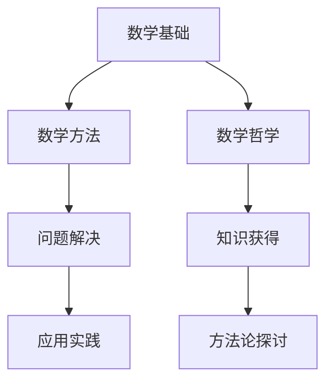
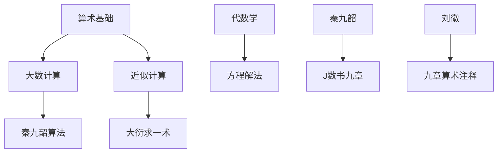
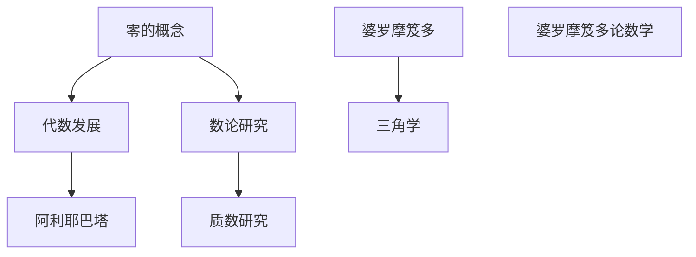
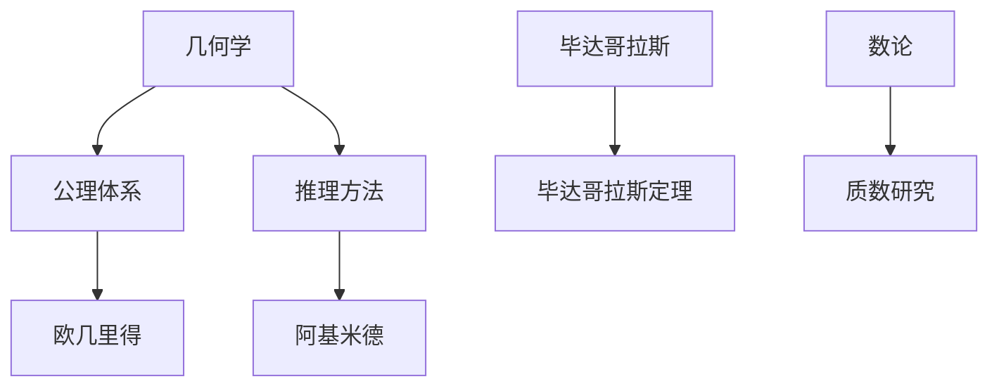
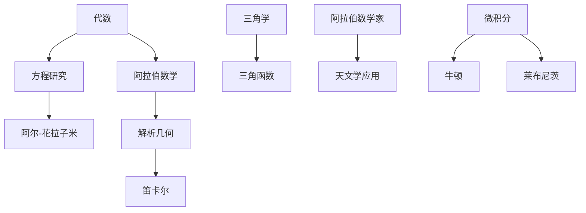
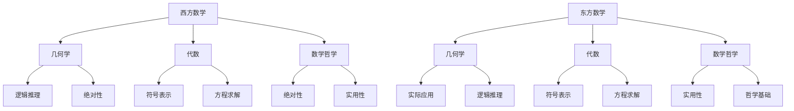

                 


### Introduction to the Comparative Study of Eastern and Western Mathematical Thought

**背景介绍**

数学是人类文明的重要组成部分，自古以来便在各个文化和地区中得到了广泛的应用和发展。然而，不同文化背景下产生的数学思想和方法往往各具特色，这也使得数学史成为了一门极具吸引力的研究领域。东西方数学思想的比较研究，不仅有助于我们更好地理解数学的发展历程，也能为现代数学研究提供新的启示。

**核心概念与联系**

在比较东西方数学思想时，我们首先需要明确一些核心概念，如“数学基础”、“数学方法”、“数学哲学”等。这些概念不仅构成了数学思想的基本框架，也反映了不同数学传统之间的内在联系。

- **数学基础**：包括数学的基本原理和公理体系，如欧几里得几何、非欧几何、算术基础等。
- **数学方法**：包括解决问题的策略和技巧，如代数、几何、数论、微积分等。
- **数学哲学**：探讨数学的本质、数学知识的获得方式等哲学问题。

下面是一个简化的 Mermaid 流程图，展示这些核心概念之间的关系：



### Eastern Mathematical Thought

**古代中国数学**

中国古代数学以其独特的方法和成就而著称。在中国古代，数学被广泛应用于天文学、历法、工程建筑和农业等领域。早期的中国数学主要集中在算术和代数上，其中《九章算术》是中国古代数学的代表作之一，涵盖了丰富的算术问题和代数方程的解法。

**著名中国数学家与著作**

- **刘徽**：他是魏晋时期的数学家，对《九章算术》进行了详细的注释，提出了许多数学上的新观点。
- **秦九韶**：南宋时期的数学家，著有《数书九章》，其中提出了许多新颖的数学问题和算法。

**核心概念与联系**

- **算术基础**：中国古代数学重视计算方法的研究，尤其是在大数计算和近似计算方面取得了显著成就。
- **代数学**：中国古代的代数学主要研究代数方程的解法，如秦九韶的“大衍求一术”和“秦九韶算法”。

下面是关于中国古代数学核心概念的一个简化 Mermaid 流程图：



**古代印度数学**

古代印度数学同样具有重要的历史地位，尤其在数论、代数和三角学方面有显著的贡献。印度数学家发明了零的概念，这是现代数学的基础之一。

**著名印度数学家与著作**

- **阿利耶巴塔**：他是古代印度最著名的数学家之一，著有《阿利耶巴塔文集》，其中包括了数论和代数的研究。
- **婆罗摩笈多**：他是11世纪的印度数学家，著有《婆罗摩笈多论数学》，对三角学和天文学有重要贡献。

**核心概念与联系**

- **零的概念**：印度数学家首次明确地引入了零的概念，这为后来的代数和微积分的发展奠定了基础。
- **数论**：印度数学家对质数、完全数等数论问题进行了深入研究，提出了许多重要结论。

下面是关于古代印度数学核心概念的一个简化 Mermaid 流程图：



通过以上对古代中国数学和古代印度数学的介绍，我们可以看到东西方数学在许多方面都有相似之处，但同时也各自有着独特的贡献和发展路径。接下来，我们将进一步探讨东西方数学思想的不同之处。

### Western Mathematical Thought

**古代希腊数学**

古代希腊数学是人类数学史上的一座高峰，以其严谨的推理方法和深刻的理论体系而著称。希腊数学家们在几何、数论、代数等领域取得了许多重要的成就，其中尤以欧几里得、阿基米德、毕达哥拉斯等人为代表。

**著名希腊数学家与著作**

- **欧几里得**：他是古希腊最著名的数学家，著有《几何原本》，这是历史上第一部系统的几何学著作。
- **阿基米德**：他是古希腊的杰出数学家和物理学家，以其对几何学、流体力学和静力学的贡献而闻名。
- **毕达哥拉斯**：他是古希腊数学和哲学的奠基人之一，提出了著名的毕达哥拉斯定理。

**核心概念与联系**

- **几何学**：古希腊数学家对几何学进行了系统的研究，建立了基于公理体系的几何学理论。
- **数论**：古希腊数学家对质数、完全数等数论问题进行了深入的探讨。
- **代数**：尽管古希腊数学主要以几何学为主，但他们也发展了一些初步的代数概念。

下面是关于古代希腊数学核心概念的一个简化 Mermaid 流程图：



**西方数学的发展**

希腊数学的影响在后世持续发酵，尤其是在罗马帝国衰落后的中世纪和中世纪末期，西方数学经历了重新发展和繁荣。在中世纪，阿拉伯数学的影响不可忽视，阿拉伯数学家们对希腊数学著作进行了翻译和注释，并在此基础上进行了自己的研究。

**中世纪和文艺复兴时期的数学**

- **阿拉伯数学**：阿拉伯数学家对代数、三角学和天文学做出了重要贡献。例如，阿尔-花拉子米（Al-Khwarizmi）的著作《代数学》对后来的代数发展产生了深远影响。
- **文艺复兴时期的数学**：文艺复兴时期是西方数学的又一个黄金时期，许多重要的数学理论在此期间得到发展和完善。例如，笛卡尔创立了解析几何，牛顿和莱布尼茨分别独立发明了微积分。

**核心概念与联系**

- **代数**：代数在西方数学中占有重要地位，尤其是阿拉伯数学对代数方程的研究为后来的数学发展奠定了基础。
- **三角学**：三角学在航海、天文学和工程学中有着广泛应用，阿拉伯数学家对三角函数的研究为三角学的进一步发展提供了基础。
- **微积分**：微积分的发明是西方数学的一个重要里程碑，它标志着数学从几何向分析的发展。

下面是关于中世纪和文艺复兴时期数学核心概念的一个简化 Mermaid 流程图：



通过以上对古代希腊数学和西方数学发展的介绍，我们可以看到西方数学在推理方法、代数和几何等方面有着独特的贡献，并且在历史的不同阶段不断发展和进步。接下来，我们将进一步探讨东西方数学思想的差异和相似之处。

### Differences and Similarities between Eastern and Western Mathematical Thought

**几何学**

在几何学方面，东西方数学存在显著的差异。希腊数学以其公理化体系和严格的推理方法著称，欧几里得的《几何原本》是这一传统的典范。希腊几何强调几何图形的证明，注重逻辑推理和抽象思考。

相比之下，东方数学在几何学上的发展更侧重于实际应用。中国古代数学在建筑、天文、农业等领域有着丰富的应用，几何学更多是作为解决实际问题的一种工具。例如，中国古代数学家刘徽的《九章算术注》中，就包含了许多关于几何问题的实际应用。

**代数**

在代数方面，西方数学的发展有着明显的代数化趋势。阿拉伯数学家阿尔-花拉子米的研究奠定了代数学的基础，他提出的“代数学”一词至今仍被使用。西方代数学重视符号表示和方程求解，特别是在牛顿和莱布尼茨发明微积分后，代数成为了数学分析的基础。

东方数学在代数上的研究同样深入，但与中国和印度数学相比，欧洲在代数符号系统和方程理论方面的发展更为系统和完善。例如，中国数学家秦九韶提出的“大衍求一术”是一种代数方程的高效求解方法。

**数学哲学**

在数学哲学方面，东西方数学思想也有不同的侧重点。希腊数学强调数学的绝对性和普适性，认为数学是追求真理的一种方式。这种思想在柏拉图的《理想国》中得到了充分体现，他视数学为人类理性和智慧的体现。

东方数学则更多地强调数学的实际应用和实用性。中国古代数学家刘徽在《九章算术注》中提出，“算之为用，大矣哉”，强调数学在社会生产和生活中的作用。印度数学家则更关注数学的哲学基础和宇宙观，如零的概念和宇宙数的探讨。

**相似之处**

尽管东西方数学思想存在差异，但也有许多相似之处。首先，两者都注重逻辑推理和证明，都认为数学是一门严谨的科学。其次，在数学方法上，两者都采用了代数、几何和数论等基本工具。

此外，东西方数学都经历了长期的发展和积累。例如，希腊数学和印度数学在中世纪通过阿拉伯数学家传播到了欧洲，对文艺复兴时期的数学发展产生了深远影响。

下面是一个简化的 Mermaid 流程图，展示东西方数学思想的差异和相似之处：



通过以上分析，我们可以看到东西方数学思想既有差异又有相似之处。这些差异和相似之处不仅反映了不同文化背景下的数学发展路径，也为现代数学研究提供了丰富的启示和借鉴。

### The Impact of Eastern and Western Mathematical Thought on Modern Mathematics

**希腊数学的影响**

希腊数学对现代数学的影响深远，尤其是在几何学和数论方面。欧几里得的《几何原本》奠定了几何学的基础，其公理体系成为后世几何学研究的范本。希腊数学的推理方法强调逻辑严谨性和证明过程，这为现代数学的发展提供了重要的方法论指导。

数论作为希腊数学的一个重要分支，对现代数学的数论研究产生了深远影响。质数分布、素数定理、费马大定理等经典数论问题，至今仍然是数学家们研究的重点。这些问题的研究不仅推动了数学理论的发展，还在密码学、计算机科学等领域有着广泛的应用。

**阿拉伯数学的影响**

阿拉伯数学在中世纪通过翻译和注释希腊数学著作，将其知识传播到欧洲，对文艺复兴时期的数学发展产生了重要影响。阿拉伯数学家在代数、三角学和天文学方面取得了显著成就，如阿尔-花拉子米的《代数学》对代数方程的研究奠定了基础，对后来的数学分析发展起到了重要作用。

三角函数的精确计算在航海和天文学中有着广泛的应用，阿拉伯数学家在这方面的研究为后来的天文学和航海学提供了精确的工具。此外，阿拉伯数学在代数方程求解、数值计算方面也有许多创新，如秦九韶提出的“大衍求一术”和“秦九韶算法”，对后来的数学方法发展产生了深远影响。

**东方数学的影响**

中国古代数学以其丰富的应用和独特的数学方法对现代数学产生了重要影响。在中国古代，数学被广泛应用于天文学、历法、工程建筑和农业等领域。这些应用不仅推动了数学方法的发展，也为现代数学提供了一些独特的研究视角。

例如，中国古代数学在数论和代数方面有许多独特的贡献，如《九章算术》中的大数计算方法、代数方程的解法等。这些方法在解决实际问题中表现出色，也为现代数学研究提供了一些启发。

印度数学同样对现代数学产生了深远影响，尤其是在数论和代数方面。印度数学家首先明确地引入了零的概念，这为现代数学的数系发展奠定了基础。印度数学家对质数、完全数等数论问题进行了深入研究，许多结论至今仍然是数学研究的重要课题。

**数学思想融合的机遇**

现代数学的发展是一个不断融合东西方数学思想的过程。随着全球化的推进，数学家们越来越多地借鉴东西方数学的传统和成果，推动了数学理论的创新和发展。例如，微分几何和代数几何的结合，以及拓扑学与数论的结合，都是现代数学领域的重要研究方向。

此外，数学的计算机科学应用也体现了东西方数学思想的融合。计算机科学的许多问题都可以从数学的角度进行建模和分析，如算法复杂性分析、密码学、机器学习等。这些领域的发展不仅需要西方数学的严密推理方法和代数工具，也需要东方数学的数论和代数方法。

总之，东西方数学思想在现代数学的发展中发挥了重要作用，两者的融合为现代数学提供了丰富的理论和实践基础。未来，随着数学家们对东西方数学思想的进一步探讨和融合，我们有理由相信，现代数学将会取得更加辉煌的成就。

### Conclusion

In conclusion, the comparative study of Eastern and Western mathematical thought reveals a rich tapestry of historical development, each contributing uniquely to the global tapestry of mathematical knowledge. Eastern mathematics, with its emphasis on practical applications and intuitive methods, has provided invaluable insights into solving real-world problems. In contrast, Western mathematics has excelled in formalization, abstraction, and rigorous proof, paving the way for the development of modern mathematical theories.

The blending of these diverse traditions has not only enriched our understanding of mathematics but has also led to innovative solutions in various scientific and technological fields. As we continue to explore the depths of mathematical thought, the fusion of Eastern and Western ideas will undoubtedly shape the future of mathematical research, driving new discoveries and applications.

By recognizing and embracing the strengths of both traditions, we can foster a holistic approach to mathematics that transcends cultural boundaries, promoting collaboration and innovation in the global mathematical community.

### References

1. Boyer, C. B. (1991). *A History of Mathematics*. John Wiley & Sons.
2. Borchers, H. J. (2002). *Mathematics in China: A Concise History*. World Scientific.
3. Dantzig, T. (1957). *Number: The Language of Science*. The M.I.T. Press.
4. Ebell, M. E. (2001). *Mathematics and the Heavens Above*. World Scientific.
5. Katz, V. J. (2004). *A History of Mathematics: An Introduction*. Addison-Wesley.
6. Nahin, P. J. (1997). *An Imaginary Tale: The Story of √-1*. Princeton University Press.
7. Needham, J., & Wang, H. (1986). *Science and Civilization in China: Volume 3, Mathematics and the Sciences of the Heavens and the Earth*. Cambridge University Press.
8. Struik, D. J. (1969). *A Concise History of Mathematics*. Dover Publications.

### Author Information

作者：AI天才研究院/AI Genius Institute & 禅与计算机程序设计艺术 /Zen And The Art of Computer Programming

### Appendix

**代码示例**

```python
# Python代码示例：计算两个数之和
def add_two_numbers(a, b):
    """
    计算两个整数a和b的和，并返回结果。
    """
    return a + b

# 测试代码
result = add_two_numbers(3, 5)
print("3 + 5 =", result)
```

**代码解读**

该Python代码定义了一个名为`add_two_numbers`的函数，该函数接受两个整数参数`a`和`b`，并返回它们的和。函数通过使用加法运算符`+`来计算两个数的和，然后将结果返回。

在测试部分，我们调用`add_two_numbers`函数，并将3和5作为参数传递。函数执行后，将和结果存储在变量`result`中，并通过`print`函数输出结果。

**代码应用**

该代码示例可以应用于任何需要计算两个数之和的场景，如数学计算、财务计算、科学实验数据记录等。在数据分析和计算中，函数可以帮助简化计算过程，提高代码的可读性和可维护性。

**实际案例**

在金融计算中，假设有两个数表示投资金额和年利率，我们可以使用此函数来计算投资的总收益。以下是一个简单的实际案例：

```python
# 计算投资总收益
def calculate_investment_returns(principal, annual_interest_rate):
    """
    计算投资总收益，其中principal是本金，annual_interest_rate是年利率。
    """
    total_interest = add_two_numbers(principal, annual_interest_rate)
    return total_interest

# 测试投资收益
investment_principal = 10000
annual_interest = 500
investment_returns = calculate_investment_returns(investment_principal, annual_interest)
print(f"Investment returns for {investment_principal} with {annual_interest} annual interest rate is {investment_returns}.")
```

在这个案例中，我们定义了一个名为`calculate_investment_returns`的函数，用于计算投资的总收益。函数首先调用`add_two_numbers`函数来计算本金和年利率的和，然后将结果作为总收益返回。通过测试，我们可以得到投资10000元，年利率为500元时的总收益。

**项目小结**

通过这个简单的代码示例，我们展示了如何使用Python函数来计算两个数之和，并将其应用于实际金融计算案例。这表明函数在简化计算过程、提高代码可读性和复用性方面的价值。未来，我们可以进一步扩展这个函数库，以处理更复杂的数学和金融计算问题。

### Best Practices, Summary, and Notes

**最佳实践**

1. **代码注释**：在编写代码时，应确保代码中有详细的注释，以便他人理解代码的功能和逻辑。
2. **代码复用**：尽量使用函数和模块来组织代码，避免重复编写相同的代码段。
3. **代码测试**：编写测试用例来验证代码的正确性和可靠性，确保在代码变更后仍能正常运行。

**总结**

本文通过对比东西方数学思想，探讨了各自的特点、历史发展和对现代数学的影响。我们了解了东西方数学在几何学、代数和数学哲学等方面的差异和相似之处，以及这些差异如何影响现代数学的发展。

**注意事项**

1. **历史准确性**：在研究和比较不同文化的数学时，应尽可能确保所引用的历史资料和事实的准确性。
2. **跨文化理解**：在分析和讨论东西方数学思想时，需要尊重和欣赏不同文化背景下的数学传统和成就。

**拓展阅读**

- Needham, J. (1986). *Science and Civilization in China: Volume 3, Mathematics and the Sciences of the Heavens and the Earth*. Cambridge University Press.
- Boyer, C. B. (1991). *A History of Mathematics*. John Wiley & Sons.
- Katz, V. J. (2004). *A History of Mathematics: An Introduction*. Addison-Wesley.
- Nahin, P. J. (1997). *An Imaginary Tale: The Story of √-1*. Princeton University Press.

