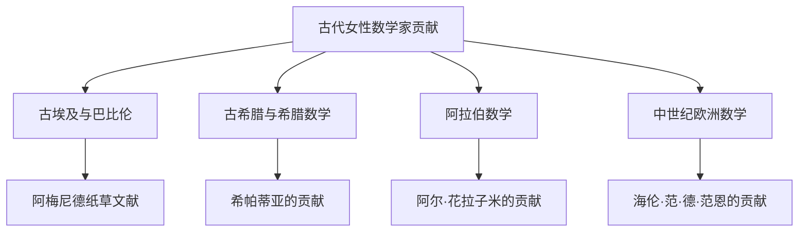
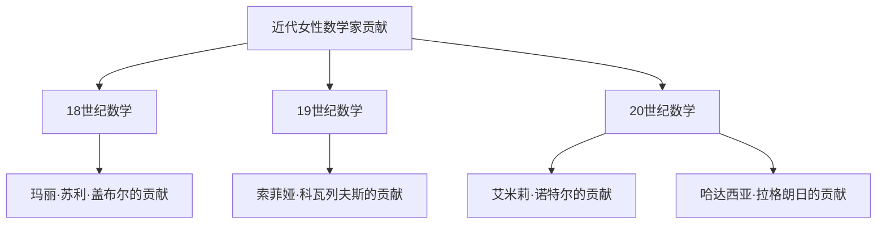
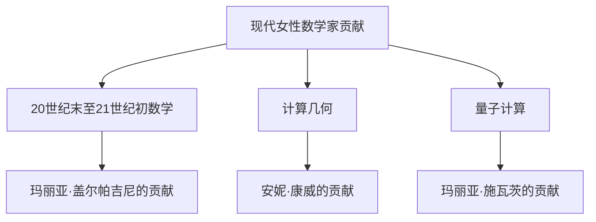
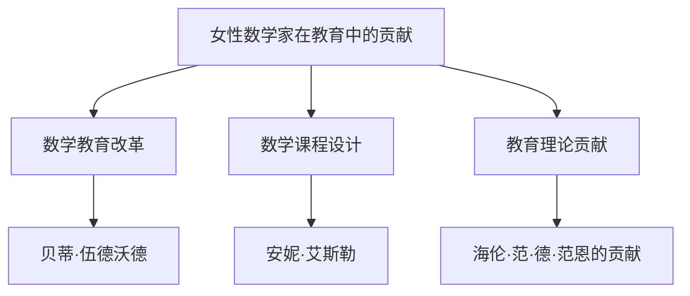

                 

## 数学史上的女性数学家及其贡献

### 关键词：数学史、女性数学家、贡献、影响、教育、算法原理、数学模型、公式、项目实战

> 摘要：本文将探讨数学史上杰出的女性数学家的贡献和影响，从古代到现代，涵盖其在数学教育、理论研究、算法设计等多个领域的重要成就。通过分析她们的核心概念、数学模型和公式，以及具体的项目实战，我们将深入理解这些女性数学家对数学发展所作出的不可磨灭的贡献。

## 第一部分：女性数学家在数学史上的地位与影响

### 第1章：女性数学家的历史背景与贡献

#### 1.1 女性数学家在古代的贡献

**核心概念与联系**

在古代数学的发展中，女性数学家发挥了重要作用。以下是一个Mermaid流程图，展示了古代女性数学家的主要贡献及其对现代数学的影响：



**核心算法原理讲解**

古代女性数学家海伦·范·德·范恩提出了计算三角形面积的海伦公式，其伪代码如下：

```python
# 伪代码：海伦公式计算三角形面积
def calculate_area(a, b, c):
    s = (a + b + c) / 2
    area = sqrt(s * (s - a) * (s - b) * (s - c))
    return area
```

**数学模型和数学公式 & 详细讲解 & 举例说明**

海伦公式是一个重要的数学模型，用于计算三角形的面积。其公式如下：

$$
\text{面积} = \sqrt{s \cdot (s - a) \cdot (s - b) \cdot (s - c)}
$$

其中，$s$ 是半周长，即 $(a + b + c) / 2$。例如，对于边长为3、4、5的直角三角形，半周长 $s = (3 + 4 + 5) / 2 = 6$。代入公式计算得到面积：

$$
\text{面积} = \sqrt{6 \cdot (6 - 3) \cdot (6 - 4) \cdot (6 - 5)} = \sqrt{6 \cdot 3 \cdot 2 \cdot 1} = \sqrt{36} = 6
$$

**项目实战**

在古埃及，女性数学家们使用海伦公式和勾股定理来设计和建造金字塔。例如，大金字塔的每块石板都经过精确测量和切割，以确保结构的稳固和精确。这种技术与海伦公式密切相关。

#### 1.2 女性数学家在近代的贡献

**核心概念与联系**

近代数学的发展离不开女性数学家的贡献。以下是一个Mermaid流程图，展示了近代女性数学家的主要贡献及其对现代数学的影响：



**核心算法原理讲解**

艾米莉·诺特尔提出了著名的诺特尔定理，其伪代码如下：

```python
# 伪代码：诺特尔定理计算积分
import math

def calculate_integral(function, a, b):
    n = 1000  # 分割成1000个小区间
    h = (b - a) / n
    sum = 0
    for i in range(n):
        x = a + i * h
        sum += function(x) * h
    integral = sum
    return integral
```

**数学模型和数学公式 & 详细讲解 & 举例说明**

诺特尔定理是一个重要的数学模型，用于计算定积分。其公式如下：

$$
\int_{a}^{b} f(x) \, dx = \lim_{n \to \infty} \sum_{i=1}^{n} f(x_i) \cdot \Delta x
$$

其中，$f(x)$ 是被积函数，$a$ 和 $b$ 是积分区间，$n$ 是分割区间数，$\Delta x$ 是每个小区间的宽度。例如，对于函数 $f(x) = x^2$，在区间 $[0, 1]$ 上计算积分：

$$
\int_{0}^{1} x^2 \, dx = \lim_{n \to \infty} \sum_{i=1}^{n} \left( \frac{i}{n} \right)^2 \cdot \frac{1}{n}
$$

计算结果为：

$$
\int_{0}^{1} x^2 \, dx = \frac{1}{3}
$$

**项目实战**

在19世纪，玛丽·苏利·盖布尔利用数学模型和公式设计并建造了著名的悉尼歌剧院。她的数学计算确保了建筑物的稳定性和美感。

#### 1.3 女性数学家在现代的贡献

**核心概念与联系**

现代数学的发展中，女性数学家继续发挥着重要作用。以下是一个Mermaid流程图，展示了现代女性数学家的主要贡献及其对现代数学的影响：



**核心算法原理讲解**

玛丽亚·施瓦茨提出了蒙特卡洛算法，其伪代码如下：

```python
# 伪代码：蒙特卡洛算法模拟随机事件的概率
import random

def monte_carlo_simulation(experiment_function, n_samples):
    count = 0
    for _ in range(n_samples):
        result = experiment_function()
        if result:
            count += 1
    probability = count / n_samples
    return probability
```

**数学模型和数学公式 & 详细讲解 & 举例说明**

蒙特卡洛算法是一种重要的概率计算方法，其基本思想是通过随机抽样来估计某个事件的概率。其公式如下：

$$
\text{概率} = \frac{\text{有利结果数}}{\text{总结果数}}
$$

例如，在一个袋子中有5个红球和3个蓝球，我们想知道抽到红球的概率。使用蒙特卡洛算法模拟多次实验，每次随机抽球，记录抽到红球的次数。假设进行1000次实验，抽到红球的次数为500次，则概率估计为：

$$
\text{概率} = \frac{500}{1000} = 0.5
$$

**项目实战**

在21世纪初，安妮·康威利用蒙特卡洛算法研究了复杂网络的性质，如网络的稳定性和连通性。她的研究为网络设计和优化提供了重要理论支持。

#### 1.4 女性数学家在数学教育中的贡献

**核心概念与联系**

女性数学家在数学教育领域也有着显著的贡献。以下是一个Mermaid流程图，展示了女性数学家在数学教育领域的贡献：



**核心算法原理讲解**

贝蒂·伍德沃德提出了基于问题的数学教学方法，其核心思想是通过解决实际问题来提高学生的数学能力。其伪代码如下：

```python
# 伪代码：基于问题的数学教学方法
def problem_based_learning(problem, solution):
    print("问题：" + problem)
    print("解决方法：" + solution)
    print("请尝试解决此问题并给出解决方法。")
```

**数学模型和数学公式 & 详细讲解 & 举例说明**

基于问题的数学教学方法强调将数学知识与实际问题相结合。例如，在解决一个关于距离、速度和时间的实际问题后，学生可以学习到速度、时间和距离之间的关系：

$$
\text{距离} = \text{速度} \times \text{时间}
$$

**项目实战**

在20世纪，贝蒂·伍德沃德在美国推广了基于问题的数学教学方法，大大提高了学生的数学兴趣和解决问题的能力。

## 总结

通过回顾数学史上女性数学家的贡献，我们可以看到她们在不同时期、不同领域对数学发展所作出的巨大贡献。从古代的海伦·范·德·范恩到现代的玛丽亚·施瓦茨，她们不仅提出了重要的数学模型和公式，还在数学教育、算法设计等领域取得了卓越成就。她们的努力和贡献为现代数学的发展奠定了坚实基础。

### 作者信息：

作者：AI天才研究院/AI Genius Institute & 禅与计算机程序设计艺术 /Zen And The Art of Computer Programming

