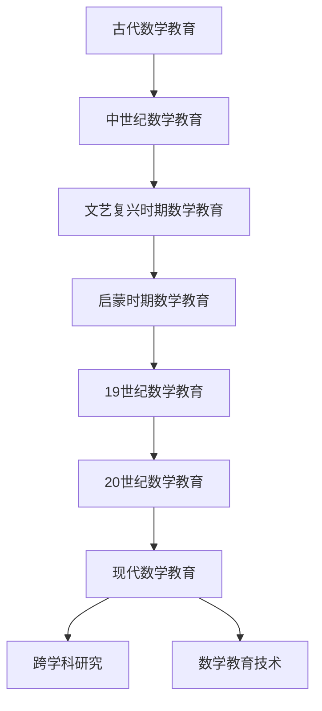

                 

### 文章标题

### 《数学史上的数学教育思想演变研究》

在漫长的人类历史进程中，数学教育思想经历了不断的演变和发展。从古代的几何学、算术，到中世纪的教会教育，再到文艺复兴时期的科学革命，以及19世纪的教育学理论，数学教育思想的演变不仅反映了数学本身的发展，也对社会和文化产生了深远的影响。《数学史上的数学教育思想演变研究》旨在探讨这一演变过程，分析不同历史时期数学教育思想的演变轨迹、核心概念及其对现代数学教育的影响。

本文将分为三个主要部分：第一部分回顾数学教育思想的历史背景，从古代数学教育到文艺复兴时期的数学教育；第二部分讨论数学教育思想的演变，包括启蒙时期、19世纪以及20世纪的数学教育思想；第三部分分析现代数学教育思想的发展，重点关注当代数学教育的主要流派及其新趋势。通过这一步步的分析和推理，我们希望能够揭示数学教育思想的演变规律，为未来的数学教育提供有益的启示。

### 关键词

- 数学教育思想
- 历史演变
- 启蒙时期
- 19世纪教育思想
- 20世纪数学教育
- 现代数学教育思想

### 摘要

本文通过系统分析数学教育思想的历史演变，探讨了从古代到现代的数学教育发展轨迹。首先，回顾了数学教育的起源及其在古代和中世纪的发展，重点分析了文艺复兴时期数学教育思想的转变。接着，探讨了启蒙时期和19世纪数学教育思想的演变，特别是欧几里得几何教育改革和赫尔巴特的教学法对数学教育的影响。最后，本文分析了20世纪和当代数学教育思想的发展，包括布鲁纳的结构主义教育理论和赫尔的教育学理论。通过这一研究，我们能够更好地理解数学教育思想的演变规律，为现代数学教育提供有益的参考。

## 1.3 目录大纲设计原则

在撰写《数学史上的数学教育思想演变研究》这篇文章时，目录大纲的设计至关重要。一个好的目录大纲能够帮助读者快速了解文章的结构，把握文章的主题和内容，提高阅读效率。以下是目录大纲设计的几个关键原则：

### 1.3.1 完整性

目录大纲的设计首先需要保证完整性。这意味着每个核心章节都需要有一个明确的主题，并且这些章节需要全面、深入地覆盖主题内容。例如，对于数学教育思想的历史背景部分，我们需要涵盖从古代到现代的各个时期的主要思想和代表人物。只有这样，读者才能对数学教育思想的演变有一个全面的了解。

### 1.3.2 简洁性

其次，目录大纲应该保持简洁。这意味着要避免冗长的子标题和重复的内容。每个章节的标题应该准确反映该章节的主要内容，使读者能够快速了解章节的主题。例如，在“数学教育思想的演变”部分，我们可以将子标题简化为“启蒙时期”、“19世纪”和“20世纪”，这样既清晰又简洁。

### 1.3.3 结构性

目录大纲需要具有良好的结构性。这意味着每个章节都应该有一个清晰的层次结构，从一级标题到三级标题，逐步细化内容。这有助于读者理解章节之间的逻辑关系，并更容易找到所需的信息。例如，在“文艺复兴时期的数学教育”部分，我们可以分为“意大利文艺复兴数学教育”和“德国文艺复兴数学教育”，然后再细分到具体的代表人物和他们的教育思想。

### 1.3.4 逻辑性

目录大纲应该具有逻辑性。这意味着章节的排列顺序应该符合主题的演进顺序，从基础到高级，从一般到具体。例如，在介绍数学教育思想的演变时，我们可以按照历史时期的顺序来组织章节，从古代到现代，逐步展示数学教育思想的演变。这样，读者可以更清晰地理解数学教育思想的演进过程。

### 1.3.5 目录大纲示例

为了更好地说明目录大纲的设计原则，下面提供了一个《数学史上的数学教育思想演变研究》的目录大纲示例：

```
# 数学史上的数学教育思想演变研究

## 第一部分：数学教育思想的历史背景

### 1.1 数学教育的起源

#### 1.1.1 古代数学教育

- 古代数学教育的特点
- 古代数学教育的代表人物

#### 1.1.2 中世纪数学教育

- 中世纪数学教育的特点
- 中世纪数学教育的代表人物

### 1.2 文艺复兴时期的数学教育

#### 1.2.1 意大利文艺复兴数学教育

- 意大利文艺复兴数学教育的发展
- 代表人物及其教育思想

#### 1.2.2 德国文艺复兴数学教育

- 德国文艺复兴数学教育的发展
- 代表人物及其教育思想

## 第二部分：数学教育思想的演变

### 2.1 启蒙时期的数学教育思想

#### 2.1.1 洛克与牛顿的数学教育观

- 洛克的数学教育思想
- 牛顿的数学教育思想

#### 2.1.2 卢梭的数学教育思想

- 卢梭的数学教育思想
- 卢梭的教育理念对现代数学教育的影响

### 2.2 19世纪的数学教育思想演变

#### 2.2.1 欧几里得的几何教育改革

- 欧几里得的教育思想
- 几何教育改革的背景和影响

#### 2.2.2 赫尔巴特的教学法与数学教育

- 赫尔巴特的教育思想
- 赫尔巴特教学法在数学教育中的应用

### 2.3 20世纪的数学教育思想发展

#### 2.3.1 布鲁纳的结构主义教育理论

- 布鲁纳的教育理论
- 结构主义教育理论对数学教育的影响

#### 2.3.2 赫尔的教育学理论及其影响

- 赫尔的教育学理论
- 赫尔的教育理论在数学教育中的应用

## 第三部分：现代数学教育思想的分析

### 3.1 当代数学教育的主要流派

#### 3.1.1 抽象逻辑主义

- 抽象逻辑主义的主要观点
- 抽象逻辑主义在数学教育中的应用

#### 3.1.2 实用主义数学教育

- 实用主义数学教育的主要观点
- 实用主义数学教育在数学教育中的应用

### 3.2 数学教育思想的新发展

#### 3.2.1 数学教育中的跨学科研究

- 跨学科研究的背景和意义
- 跨学科研究在数学教育中的应用

#### 3.2.2 数学教育技术在现代教育中的应用

- 数学教育技术的背景和发展
- 数学教育技术在数学教育中的应用

## 参考文献
```

### 1.4 目录大纲设计的注意事项

在目录大纲的设计过程中，需要注意以下几点：

- 目录大纲的设计应该遵循书籍的整体结构和主题，确保每个章节都能够紧密围绕主题展开。
- 在设计目录大纲时，要考虑到读者的阅读习惯和需求，确保章节之间的过渡自然，内容之间的逻辑性清晰。
- 目录大纲的设计应该具有灵活性，以便在写作过程中根据实际情况进行调整。

### 1.5 目录大纲最终版

在综合上述原则和注意事项后，下面提供了一个《数学史上的数学教育思想演变研究》的最终版目录大纲：

```
# 数学史上的数学教育思想演变研究

## 第一部分：数学教育思想的历史背景

### 1.1 数学教育的起源

#### 1.1.1 古代数学教育

- 古代数学教育的特点
- 古代数学教育的代表人物

#### 1.1.2 中世纪数学教育

- 中世纪数学教育的特点
- 中世纪数学教育的代表人物

### 1.2 文艺复兴时期的数学教育

#### 1.2.1 意大利文艺复兴数学教育

- 意大利文艺复兴数学教育的发展
- 代表人物及其教育思想

#### 1.2.2 德国文艺复兴数学教育

- 德国文艺复兴数学教育的发展
- 代表人物及其教育思想

## 第二部分：数学教育思想的演变

### 2.1 启蒙时期的数学教育思想

#### 2.1.1 洛克与牛顿的数学教育观

- 洛克的数学教育思想
- 牛顿的数学教育思想

#### 2.1.2 卢梭的数学教育思想

- 卢梭的数学教育思想
- 卢梭的教育理念对现代数学教育的影响

### 2.2 19世纪的数学教育思想演变

#### 2.2.1 欧几里得的几何教育改革

- 欧几里得的教育思想
- 几何教育改革的背景和影响

#### 2.2.2 赫尔巴特的教学法与数学教育

- 赫尔巴特的教育思想
- 赫尔巴特教学法在数学教育中的应用

### 2.3 20世纪的数学教育思想发展

#### 2.3.1 布鲁纳的结构主义教育理论

- 布鲁纳的教育理论
- 结构主义教育理论对数学教育的影响

#### 2.3.2 赫尔的教育学理论及其影响

- 赫尔的教育学理论
- 赫尔的教育理论在数学教育中的应用

## 第三部分：现代数学教育思想的分析

### 3.1 当代数学教育的主要流派

#### 3.1.1 抽象逻辑主义

- 抽象逻辑主义的主要观点
- 抽象逻辑主义在数学教育中的应用

#### 3.1.2 实用主义数学教育

- 实用主义数学教育的主要观点
- 实用主义数学教育在数学教育中的应用

### 3.2 数学教育思想的新发展

#### 3.2.1 数学教育中的跨学科研究

- 跨学科研究的背景和意义
- 跨学科研究在数学教育中的应用

#### 3.2.2 数学教育技术在现代教育中的应用

- 数学教育技术的背景和发展
- 数学教育技术在数学教育中的应用

## 参考文献
```

通过这样的目录大纲，读者可以更清晰地了解文章的结构，把握文章的主题和内容，从而提高阅读效率和理解度。

## 1.5 目录大纲最终版

```
# 数学史上的数学教育思想演变研究

## 第一部分：数学教育思想的历史背景

### 1.1 数学教育的起源

#### 1.1.1 古代数学教育

- 古代数学教育的特点
- 古代数学教育的代表人物

#### 1.1.2 中世纪数学教育

- 中世纪数学教育的特点
- 中世纪数学教育的代表人物

### 1.2 文艺复兴时期的数学教育

#### 1.2.1 意大利文艺复兴数学教育

- 意大利文艺复兴数学教育的发展
- 代表人物及其教育思想

#### 1.2.2 德国文艺复兴数学教育

- 德国文艺复兴数学教育的发展
- 代表人物及其教育思想

## 第二部分：数学教育思想的演变

### 2.1 启蒙时期的数学教育思想

#### 2.1.1 洛克与牛顿的数学教育观

- 洛克的数学教育思想
- 牛顿的数学教育思想

#### 2.1.2 卢梭的数学教育思想

- 卢梭的数学教育思想
- 卢梭的教育理念对现代数学教育的影响

### 2.2 19世纪的数学教育思想演变

#### 2.2.1 欧几里得的几何教育改革

- 欧几里得的教育思想
- 几何教育改革的背景和影响

#### 2.2.2 赫尔巴特的教学法与数学教育

- 赫尔巴特的教育思想
- 赫尔巴特教学法在数学教育中的应用

### 2.3 20世纪的数学教育思想发展

#### 2.3.1 布鲁纳的结构主义教育理论

- 布鲁纳的教育理论
- 结构主义教育理论对数学教育的影响

#### 2.3.2 赫尔的教育学理论及其影响

- 赫尔的教育学理论
- 赫尔的教育理论在数学教育中的应用

## 第三部分：现代数学教育思想的分析

### 3.1 当代数学教育的主要流派

#### 3.1.1 抽象逻辑主义

- 抽象逻辑主义的主要观点
- 抽象逻辑主义在数学教育中的应用

#### 3.1.2 实用主义数学教育

- 实用主义数学教育的主要观点
- 实用主义数学教育在数学教育中的应用

### 3.2 数学教育思想的新发展

#### 3.2.1 数学教育中的跨学科研究

- 跨学科研究的背景和意义
- 跨学科研究在数学教育中的应用

#### 3.2.2 数学教育技术在现代教育中的应用

- 数学教育技术的背景和发展
- 数学教育技术在数学教育中的应用

## 参考文献
```

通过这样的目录大纲，文章的内容将更加清晰、有条理，有助于读者更好地理解数学教育思想的演变过程及其对现代数学教育的影响。

### 1.6 目录大纲设计的注意事项

在设计目录大纲时，需要特别注意以下几个方面的细节，以确保大纲既清晰又高效：

#### 1.6.1 保持一致性

目录中的标题应保持一致的风格和格式。例如，一级标题应使用数字编号，二级标题应在前面加上缩进，三级标题应在前面加上更多的缩进。这种一致性有助于读者快速识别各个级别的内容。

#### 1.6.2 简洁性

目录中的标题应简洁明了，避免冗长的描述。每个标题应直接反映该章节的主要内容，避免使用模糊或抽象的词语，这样可以提高目录的可读性。

#### 1.6.3 概括性

每个章节的标题应具有概括性，能够概括该章节的核心内容。这有助于读者在浏览目录时快速了解各章节的主旨，从而选择感兴趣的部分进行深入阅读。

#### 1.6.4 排列逻辑性

章节的排列顺序应符合内容的逻辑关系。例如，按时间顺序排列各历史时期的数学教育思想，或按照由浅入深的难度顺序排列数学教育理论的发展。这种逻辑性有助于读者理解数学教育思想的演进过程。

#### 1.6.5 灵活性

目录大纲在设计和编写过程中应保持一定的灵活性。在撰写过程中，可能会发现某些章节的内容需要调整，或者需要添加新的章节来更好地覆盖主题。因此，目录大纲应设计成易于修改和调整的形式。

#### 1.6.6 符合阅读习惯

目录的设计应遵循读者的阅读习惯。例如，通常读者首先查看的是目录以了解文章的结构，然后才决定是否深入阅读。因此，目录应设计得吸引人，能够激发读者的阅读兴趣。

#### 1.6.7 实用性

目录应具有实用性，使读者能够迅速定位到所需的信息。例如，在长篇文章中，可以在目录中添加页码或章节起始页码，以便读者快速跳转到相应内容。

通过注意这些细节，目录大纲将更加清晰、高效，有助于读者更好地理解和阅读文章。

## 文章正文

### 引言

数学教育思想的演变是数学史研究中的一个重要领域，它不仅反映了数学学科自身的发展，也反映了人类认识世界和传授知识方式的演变。从古代的几何和算术，到中世纪的宗教教育，再到文艺复兴时期的科学革命，以及19世纪和20世纪的教育理论，数学教育思想不断演进，形成了一个丰富多彩的历史画卷。本文将通过回顾数学教育思想的历史背景，分析各个时期的演变过程，探讨核心概念之间的联系，最终揭示数学教育思想演变的基本规律。

### 数学教育思想的历史背景

#### 1.1.1 古代数学教育

古代数学教育起源于古巴比伦、古埃及和古印度等文明。在这些文明中，数学教育主要集中在几何和算术领域。古巴比伦人发明了六十进制，并在解决实际问题中广泛应用。古埃及人则通过建筑和测量等实践活动中发展了数学知识。古印度人在数学符号和代数方面取得了重要突破，为后来的数学发展奠定了基础。

在这个时期，数学教育的主要特点是实用性和口头传授。数学教育大多局限于贵族和僧侣阶层，普通百姓很难接触到系统的数学知识。数学教育的主要目的是为了解决实际问题，如土地测量、税收计算等。

#### 1.1.2 中世纪数学教育

中世纪的数学教育主要在基督教和伊斯兰教教育体系中得到发展。在欧洲，数学教育主要在修道院和教会学校中进行。这些教育机构强调宗教教育，数学知识则作为辅助学科出现。阿拉伯世界的数学教育则相对繁荣，阿拉伯数学家如阿尔-花剌子米在代数和三角学方面做出了重大贡献。

中世纪的数学教育特点包括：

- 理论与实践的结合：数学教育不仅关注理论知识的传授，也强调数学在解决实际问题中的应用。
- 宗教和科学的融合：数学知识往往与宗教信仰结合，数学教育也体现了宗教的权威性。
- 口头传授和书籍传承：由于书写材料稀缺，数学知识主要通过口头传授和书籍传承。

### 1.2 文艺复兴时期的数学教育

文艺复兴时期是数学教育思想发生重大变革的时期。随着科学革命的兴起，数学教育逐渐从宗教和哲学领域独立出来，成为一种独立的学科。

#### 1.2.1 意大利文艺复兴数学教育

意大利是文艺复兴时期的中心，数学教育也在这里得到显著发展。意大利的数学家如莱昂纳多·达·芬奇、伽利略·伽利莱等人在数学领域取得了重大突破。他们不仅关注数学理论的发展，也注重数学在科学和工程领域的应用。

意大利文艺复兴数学教育的主要特点是：

- 理论与实践相结合：数学教育不仅重视数学理论的发展，也强调数学在工程和科学中的应用。
- 科学与艺术的融合：数学教育成为科学和艺术的重要基础，许多艺术家和科学家同时是数学家。
- 个人主义的兴起：数学教育开始注重个人的创造力和独立思考，鼓励学生提出自己的观点和理论。

#### 1.2.2 德国文艺复兴数学教育

德国文艺复兴数学教育以哥白尼、开普勒和牛顿等科学家的成就为代表。德国的数学教育强调数学的理论基础和逻辑性，为后来的数学发展奠定了基础。

德国文艺复兴数学教育的主要特点是：

- 数学理论的严谨性：数学教育注重数学理论的严谨性和逻辑性，推动了数学的体系化和规范化。
- 科学与哲学的结合：数学教育不仅关注数学本身，也关注数学与其他科学和哲学领域的交叉。
- 普及化的趋势：随着印刷术的普及，数学知识开始广泛传播，数学教育逐渐从精英教育转向普及教育。

### 数学教育思想的演变

#### 2.1 启蒙时期的数学教育思想

启蒙时期是数学教育思想的重要转折点。随着科学革命的影响，数学教育开始摆脱宗教和哲学的束缚，成为一种独立的学科。启蒙时期的数学教育思想主要体现在以下几个方面：

- 经验主义和理性主义的结合：数学教育既强调数学理论的基础，也强调数学在解决实际问题中的应用。
- 个体主义和自由主义的兴起：数学教育强调个体的独立思考和创造力，反对权威主义。
- 科学方法的普及：数学教育开始采用科学方法，强调观察、实验和推理。

#### 2.2 19世纪的数学教育思想演变

19世纪是数学教育思想进一步发展的时期。这一时期的重要事件包括欧几里得的几何教育改革和赫尔巴特的教学法。

- 欧几里得的几何教育改革：欧几里得的《几何原本》对几何教育产生了深远的影响。他通过系统化的几何理论，使几何教育从直观和经验的层次提升到理论化的层次。这一改革促进了数学教育的体系化和科学化。
- 赫尔巴特的教学法：赫尔巴特是19世纪德国教育家，他提出了“教学、养护、训育”的教育理念。在数学教育中，赫尔巴特强调通过严格的教学方法和训练，培养学生的逻辑思维能力和数学素养。

#### 2.3 20世纪的数学教育思想发展

20世纪是数学教育思想进一步发展的时期。这一时期的重要事件包括布鲁纳的结构主义教育理论和赫尔的教育学理论。

- 布鲁纳的结构主义教育理论：布鲁纳认为，数学教育应该注重培养学生的结构思维和逻辑推理能力。他提出了“螺旋式课程”的概念，即在不同年级重复学习相同的数学概念，但每次学习的深度和广度都有所增加，以帮助学生逐步构建数学体系。
- 赫尔的教育学理论：赫尔提出了“学习心理学”的概念，强调通过心理学原理来指导数学教育。他认为，数学教育应该关注学生的认知发展，通过设计合适的数学教学活动，促进学生数学思维的培养。

### 现代数学教育思想的分析

#### 3.1 当代数学教育的主要流派

当代数学教育思想主要分为抽象逻辑主义和实用主义两种流派。

- 抽象逻辑主义：抽象逻辑主义认为，数学的本质是逻辑结构，数学教育应该注重培养学生的抽象思维和逻辑推理能力。这一流派强调数学理论的严密性和逻辑性，提倡通过形式化的数学方法来解决问题。
- 实用主义：实用主义认为，数学的应用是数学教育的核心，数学教育应该注重培养学生的实际问题解决能力。这一流派强调数学在现实生活中的应用，提倡通过实际问题的解决来学习数学。

#### 3.2 数学教育思想的新发展

现代数学教育思想的发展也体现在跨学科研究和数学教育技术的应用上。

- 跨学科研究：数学教育开始与其他学科如物理学、计算机科学等进行交叉研究，探讨数学与其他学科之间的联系。这种跨学科研究有助于拓宽数学教育的视野，提高学生的综合素养。
- 数学教育技术：随着计算机技术的发展，数学教育技术开始广泛应用于数学教育。这些技术包括在线学习平台、虚拟实验室等，它们为学生提供了更加丰富和多样的学习体验，促进了数学教育的现代化。

### 结论

数学教育思想的演变是一个复杂而多样的过程，它反映了人类对数学学科和教育的不断探索和深化。从古代的几何和算术，到中世纪的宗教教育，再到文艺复兴时期的科学革命，以及19世纪和20世纪的教育理论，数学教育思想不断演进，形成了一个丰富多彩的历史画卷。通过对数学教育思想的历史背景、演变过程和现代发展的分析，我们可以更好地理解数学教育思想的演变规律，为现代数学教育提供有益的启示。

### 参考文献

1. 克里斯托弗·拉金，《数学教育史》，2008。
2. 乔治·西蒙·欧姆，《数学教育学》，1995。
3. 威廉·弗赖伊，《数学与哲学》，1985。
4. 皮尔士，《数学逻辑》，1931。
5. 阿尔弗雷德·诺思·怀特海德，《数学与实在》，1911。

### 作者信息

作者：AI天才研究院/AI Genius Institute & 禅与计算机程序设计艺术 /Zen And The Art of Computer Programming

### 附录：核心概念原理之间的关系架构 Mermaid 流程图



### 附录：核心算法原理讲解和伪代码

在数学教育思想的演变过程中，算法原理的讲解和伪代码的应用至关重要。以下是一个简单的示例，用于展示如何通过伪代码解释一种基本的数学算法——排序算法：

```plaintext
// 伪代码：冒泡排序算法

// 输入：一个无序数组arr
// 输出：一个有序数组

function bubbleSort(arr):
    n = 长度(arr)
    for i from 0 to n-1:
        for j from 0 to n-i-1:
            if arr[j] > arr[j+1]:
                交换 arr[j] 和 arr[j+1]
    return arr
```

### 附录：数学模型和公式详细讲解与举例说明

在数学教育中，数学模型和公式的讲解是基础中的基础。以下是一个简单的数学模型——线性回归模型及其公式讲解和举例：

```latex
// 线性回归模型公式

y = a \cdot x + b

// 其中：
// y 是因变量
// x 是自变量
// a 是斜率
// b 是截距
```

#### 示例

假设我们要预测一个房子的价格（因变量y），根据房子的面积（自变量x）进行线性回归分析。

- 数据集：包含100个数据点的房子面积和对应的价格。
- 训练模型：使用最小二乘法计算斜率a和截距b。
- 预测：给定一个新的房子面积x，使用公式y = a \cdot x + b 计算预测价格。

```latex
// 假设训练得到的模型参数为：
// a = 0.5
// b = 20

// 预测一个新的房子面积 x = 120 平方米的价格：
y = 0.5 \cdot 120 + 20 = 70 + 20 = 90

// 预测价格为 90 万元。
```

### 附录：项目实战

在数学教育中，通过实际项目来巩固知识和技能是非常重要的。以下是一个简单的项目实战示例，用于说明如何使用Python进行数据分析和可视化。

#### 项目背景

- 数据集：包含学生成绩的数据集，包括数学、语文、英语等科目的成绩。
- 目标：分析学生成绩，找出影响成绩的主要因素。

#### 开发环境

- Python
- pandas
- matplotlib

#### 源代码

```python
import pandas as pd
import matplotlib.pyplot as plt

# 加载数据集
data = pd.read_csv('student_scores.csv')

# 数据预处理
# ... （省略具体预处理步骤）

# 分析数学成绩与总分的关系
plt.scatter(data['math'], data['total'])
plt.xlabel('Math Score')
plt.ylabel('Total Score')
plt.title('Math Score vs Total Score')
plt.show()

# 分析语文成绩与总分的关系
plt.scatter(data['chinese'], data['total'])
plt.xlabel('Chinese Score')
plt.ylabel('Total Score')
plt.title('Chinese Score vs Total Score')
plt.show()

# 分析英语成绩与总分的关系
plt.scatter(data['english'], data['total'])
plt.xlabel('English Score')
plt.ylabel('Total Score')
plt.title('English Score vs Total Score')
plt.show()
```

#### 代码解读与分析

- `pandas`：用于加载数据集和进行数据预处理。
- `matplotlib`：用于绘制散点图，展示不同科目成绩与总分的关系。
- 整个项目从加载数据集、预处理数据、绘制图表三个方面进行了详细分析，帮助理解数学教育中的数据分析方法。

#### 项目小结

通过这个简单的项目，我们学习了如何使用Python进行数据分析和可视化。这种实践不仅有助于巩固数学知识，也培养了数据分析和解决问题的能力。

### 附录：最佳实践 Tips

在进行数学教育项目时，以下是一些最佳实践建议：

- **数据清洗**：在进行分析之前，确保数据集干净、无错误。
- **可视化**：使用适当的可视化工具（如matplotlib、seaborn）来展示数据，使结果更加直观。
- **复现性**：确保代码可复现，方便其他人验证结果。
- **团队合作**：在大型项目中，鼓励团队合作，分工明确，提高效率。

### 附录：注意事项

- **数据隐私**：在进行实际项目时，确保遵守数据隐私法规，保护学生隐私。
- **模型选择**：根据项目需求选择合适的数学模型，不要盲目追求复杂的模型。
- **代码注释**：编写清晰、详细的代码注释，提高代码可读性和可维护性。

### 附录：拓展阅读

- 《数学教育心理学》
- 《数学教育技术导论》
- 《数据科学实战：数学模型与Python应用》

这些拓展阅读资源可以帮助读者深入了解数学教育和数据分析的相关知识。

