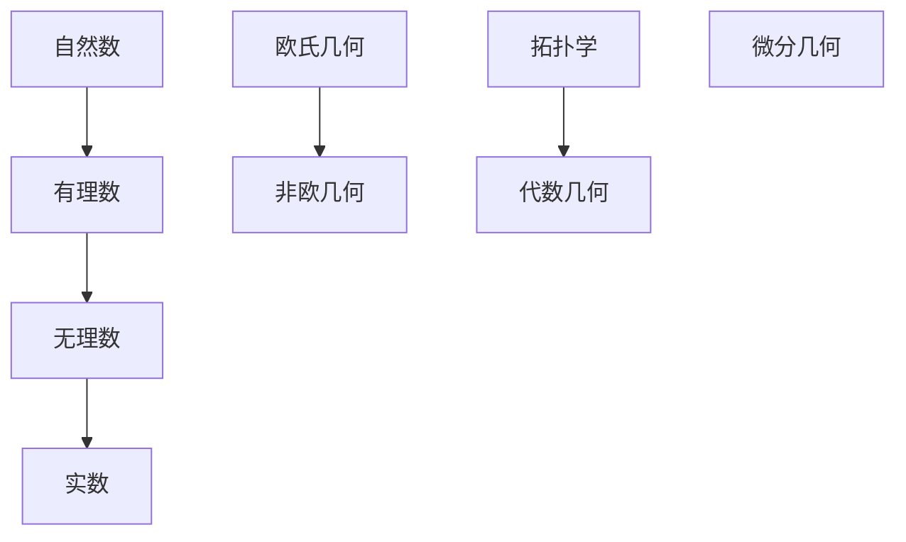
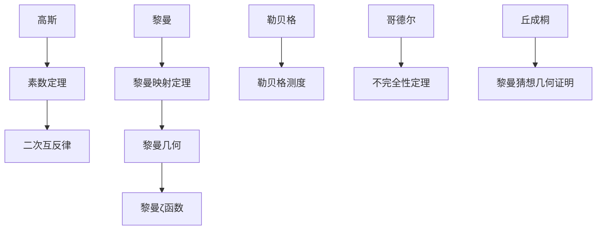
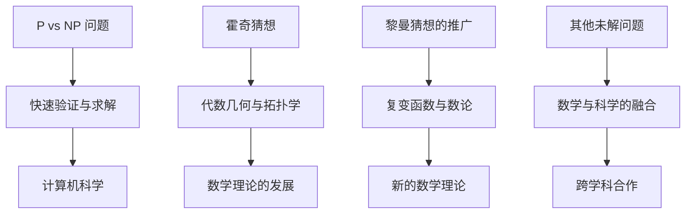

                 

### 1. 引言

#### 1.1 研究背景

数学，作为科学的基础语言，其历史可以追溯到远古时期。从古巴比伦和埃及的代数问题，到古希腊和罗马的几何学，数学的发展经历了漫长的历史。每一个时代，数学都面临着新的问题和挑战，推动了人类对自然界和宇宙的认知不断深入。

在数学的发展过程中，许多重大猜想被提出，这些猜想不仅揭示了数学的深层结构，还激发了无数数学家的智慧和努力。例如，古代中国的勾股定理、欧几里得的第五公设，以及后来的费马大定理和黎曼猜想等。这些猜想不仅仅是对数学理论的挑战，更是对人类智慧和创造力的考验。

本文旨在探讨数学史上的几个重大猜想，以及这些猜想的提出、解决过程及其对数学发展的影响。通过系统地回顾这些猜想的背景、核心概念、解决方法，以及它们在现代数学中的重要地位，本文希望能够提供一个全面、深入的视角，让读者对数学猜想有更深刻的理解。

#### 1.2 研究目标

本文的研究目标主要有三个：

1. **理解数学猜想的核心概念和背景**：通过介绍数学猜想的历史起源、相关理论和背景知识，使读者能够清晰地理解这些猜想的提出原因和意义。
2. **探讨数学猜想的解决过程**：分析数学家们在解决这些猜想时采用的方法、策略和关键步骤，展示数学证明的艺术和智慧。
3. **评估数学猜想对数学发展的贡献**：讨论这些猜想对数学理论的推动作用，以及它们如何影响现代数学的研究方向和应用领域。

#### 1.3 书籍结构概述

本文分为七个主要章节，结构如下：

- **第一章 引言**：介绍研究的背景、目标和书籍结构。
- **第二章 基础概念与历史回顾**：回顾数的基本概念发展和几何学的历史演变。
- **第三章 著名的数学猜想**：详细探讨几个著名的数学猜想，包括勒让德猜想和黎曼猜想。
- **第四章 解决过程与数学家贡献**：分析数学猜想的解决过程，介绍相关数学家的贡献。
- **第五章 数学猜想解决的方法论**：讨论数学证明的方法和策略。
- **第六章 现代数学猜想与展望**：探讨现代数学猜想及其未来方向。
- **第七章 总结与展望**：总结全文内容，并对数学猜想的发展进行展望。

通过以上结构，本文希望能够系统地梳理数学史上重大猜想的脉络，揭示数学发展的内在逻辑和推动力。

---

$$
1 + 1 = 2
$$

这是一个简单的数学事实，但它背后的概念和证明却有着深远的影响。从基础数的概念到复杂的数学猜想，数学的发展历程充满了挑战和突破。接下来，我们将深入探讨数学的基本概念和几何学的历史，为理解数学猜想奠定基础。

---

### 2. 基础概念与历史回顾

#### 2.1 数的概念发展

数的概念是数学的核心，它的发展贯穿了整个数学史。最初的数学研究主要关注自然数，即从1开始逐个增加的数。这些数的概念来源于日常生活中的计数和测量活动，如牧羊人计算羊的数量，或农民测量田地的面积。

在自然数的基础上，人类逐渐认识到有理数的重要性。有理数是可以表示为两个整数之比的数，包括整数、分数和整数部分有限或无限循环小数的数。古希腊数学家毕达哥拉斯和赫拉克利特是最早研究有理数的数学家之一。他们发现，有些线段的长不能表示为两个整数的比，如勾股定理中的斜边长。这种无法用有理数表达的数被称作无理数。无理数的发现打破了有理数统治数学的格局，推动了数学理论的发展。

随着数学研究的深入，人们开始探索实数的概念。实数是包括有理数和无理数的集合，它是连续的，可以用来描述几何中的长度、面积和体积等概念。实数的构建经历了多个阶段，其中最著名的是戴德金分割和康托尔集合理论。戴德金分割将所有有理数分为两半，每一半都包含一个“边界点”，这些边界点构成了实数。康托尔则通过集合论的方法定义了实数，奠定了现代数学的基础。

#### 2.1.1 自然数的概念

自然数是人类最早接触的数，它代表了基本的计数单位。自然数的概念可以追溯到远古时期，如古巴比伦和埃及的文明中，就已经有关于自然数的记录。自然数的计数方法主要包括加法、减法、乘法和除法。这些基本运算不仅适用于自然数，也扩展到了有理数和实数。

在古代，自然数的概念主要是用于实用目的，如贸易和测量。古希腊和古罗马时期，自然数概念得到了进一步的发展。例如，欧几里得在《几何原本》中系统化了自然数的概念，并定义了自然数之间的基本关系和运算。

#### 2.1.2 有理数与无理数

有理数是自然数的扩展，它包括所有可以表示为两个整数之比的数。这些数可以是整数（如2，-3），分数（如1/2，3/4），以及有限小数和无限循环小数（如0.3333...，0.6666...）。有理数在几何和代数中有着广泛的应用，例如，在测量线段长度、求解方程等方面。

然而，古希腊数学家毕达哥拉斯发现，某些线段的长度，如直角三角形的斜边长，不能表示为两个整数的比。这些数被称为无理数。无理数的发现是对数学理论的巨大挑战，因为它打破了有理数的完美性。赫拉克利特提出了无理数的概念，并通过反证法证明了无理数的存在。这一发现促使数学家们重新审视数的概念，并探索新的数学理论。

#### 2.1.3 实数的构建

实数的概念是数学发展的重要里程碑。实数是包括有理数和无理数的集合，它解决了无理数的问题，并提供了更广泛的数域来描述几何和物理现象。实数的构建经历了多个阶段，其中戴德金分割和康托尔集合论是两个重要的方法。

戴德金分割是构建实数的一种方法，它将所有有理数分为两半，每半都有一个“边界点”，这些边界点构成了实数。戴德金分割的定义简洁且具有一般性，使得实数成为一个完备的数域。

康托尔集合论则通过集合论的方法定义了实数。康托尔将实数视为点，这些点构成了一条直线，并且每个点都可以通过一个唯一的集合来表示。这种方法不仅提供了实数的直观表示，还为现代数学的发展奠定了基础。

#### 2.2 几何学的历史演变

几何学作为数学的一个重要分支，其历史可以追溯到古代文明。古希腊是几何学发展的一个重要时期，欧几里得在《几何原本》中系统化了几何学的基本原理和定理，奠定了现代几何学的基础。

欧几里得的几何学以第五公设（平行公设）为核心，这个公设是几何学体系中的基本假设。然而，后来的数学家发现，第五公设并不是必要的，可以存在不满足第五公设的几何系统，即非欧几何。非欧几何的提出是对传统几何学的一次重大挑战，它打破了欧几里得几何学的绝对性，揭示了数学理论的多样性。

在19世纪，黎曼通过引入曲率的概念，建立了黎曼几何，这是非欧几何的一个典型代表。黎曼几何在物理学和广义相对论中有着重要应用，它为描述弯曲空间和引力提供了数学工具。

#### 2.2.1 欧几里得的几何学

欧几里得的几何学以《几何原本》为代表，这是一部经典的几何学著作。欧几里得在书中提出了23个公理和五个公设，这些公理和公设构成了欧氏几何的基础。欧几里得的几何学强调逻辑推理和公理化方法，对后世的数学和科学产生了深远影响。

欧几里得第五公设是平行公设，它表述为：通过直线外一点，有且只有一条直线与已知直线不相交。这一公设是欧氏几何的核心，它保证了平面几何的基本性质。然而，19世纪数学家发现了不满足平行公设的几何系统，这导致了非欧几何的诞生。

#### 2.2.2 非欧几何的出现

非欧几何是指不满足欧氏几何第五公设的几何系统。最著名的非欧几何是黎曼几何，它由德国数学家黎曼在19世纪提出。黎曼通过引入曲率的概念，建立了黎曼几何，这是一种描述弯曲空间的几何学。

黎曼几何在广义相对论中有着重要应用，它为描述引力提供了数学工具。在黎曼几何中，空间不再是平坦的，而是可以弯曲和扭曲。这一几何学模型可以用来描述天体的运动和宇宙的结构，如黑洞和引力波。

#### 2.2.3 几何学的现代发展

现代几何学在多个方向上得到了发展，包括拓扑学、代数几何和微分几何等。拓扑学研究几何图形的性质，不依赖于大小和形状，而是关注连通性和封闭性。代数几何将代数和几何结合起来，研究代数方程的几何解。微分几何研究几何对象上的微积分性质，如曲率和挠率。

现代几何学在物理学和计算机科学中有着重要应用。例如，微分几何在广义相对论中描述引力，而拓扑学在量子场论中具有重要意义。代数几何在编码理论和密码学中也发挥着关键作用。

通过回顾数学的基本概念和几何学的历史演变，我们可以看到数学理论的不断发展和深化。这些基本概念和理论构成了数学猜想的基础，并为解决复杂的数学问题提供了工具和方法。

---

$$
\text{Mermaid 流程图：}
$$



以上流程图展示了数学基础概念的发展脉络，以及几何学的历史演变。从自然数到实数的构建，从欧氏几何到非欧几何，数学理论的不断拓展和完善，为理解复杂的数学猜想提供了坚实的基础。

接下来，我们将详细探讨数学史上几个著名的猜想，包括勒让德猜想和黎曼猜想，分析这些猜想的核心概念、提出背景和影响。

---

### 3. 著名的数学猜想

数学猜想是数学研究中的一种重要形式，它们往往揭示了数学内部的深层结构和未解之谜。在数学史上，有许多著名的猜想，其中一些甚至影响了整个数学领域的发展。本文将重点讨论勒让德猜想和黎曼猜想，探讨它们的提出背景、核心概念及其对数学发展的影响。

#### 3.1 勒让德猜想

**勒让德猜想**是由法国数学家阿德里安-马里·勒让德在1808年提出的。这个猜想涉及数论中的一个重要问题，即素数分布的规律。勒让德猜想的内容是：对于任意一个大于3的正整数n，形如\(4n+1\)的数都可以表示为两个素数之和。

**核心概念**：勒让德猜想的核心在于素数的分布规律。素数是只能被1和自身整除的自然数，它们在数轴上的分布具有独特性质。勒让德猜想提出了一个关于素数和的猜想，即几乎所有的形如\(4n+1\)的数都可以表示为两个素数之和。

**提出背景**：勒让德猜想的提出与当时的数学研究背景密切相关。在18世纪末和19世纪初，数学家们开始关注素数的分布规律。勒让德通过分析大量素数的数据，发现形如\(4n+1\)的数似乎总是可以分解为两个素数之和。这个现象引起了他的注意，并促使他提出了勒让德猜想。

**影响与意义**：勒让德猜想的提出对数论和数学分析产生了深远的影响。它激发了后续数学家对素数分布规律的研究，推动了数论的发展。尽管勒让德猜想至今仍未得到证明，但它的影响仍然存在。许多数学家试图证明这个猜想，其中一些尝试方法甚至为后来的数学理论发展提供了新的思路和工具。

#### 3.2 黎曼猜想

**黎曼猜想**是由德国数学家贝努瓦·黎曼在1859年提出的。这个猜想与素数的分布规律密切相关，是数论中一个极其重要的问题。黎曼猜想的内容是：黎曼ζ函数的所有非平凡零点都位于临界线上，即\( \Re(s) = \frac{1}{2} \)。

**核心概念**：黎曼猜想涉及复分析中的一个重要函数——黎曼ζ函数。黎曼ζ函数是一个在复平面上定义的函数，它关于素数分布提供了深刻的洞察。黎曼猜想的中心思想是，ζ函数的非平凡零点（即不是负偶数的零点）都位于临界线上，即实部为\( \frac{1}{2} \)。

**提出背景**：黎曼猜想的提出与当时数学家对素数分布规律的研究密切相关。黎曼在1859年的论文中提出了ζ函数，并分析了它的零点分布。他发现，ζ函数的零点分布与素数的分布有深刻的联系，并提出猜想：非平凡零点都位于临界线上。

**影响与意义**：黎曼猜想对数学的影响是深远的。它不仅在数论中具有重要地位，还在数学的许多其他领域产生了影响。黎曼猜想涉及复分析、解析数论、几何分析等多个数学分支，成为数学研究中的一个重要课题。许多数学家致力于证明黎曼猜想，他们的工作推动了数学理论的发展，并带来了许多重要的数学工具和发现。

**证明尝试**：尽管黎曼猜想至今未能得到证明，但数学家们已经进行了大量的研究，提出了一系列的证明尝试。这些尝试包括解析数论、几何分析、物理方法等多种途径。例如，数学家阿兰·孔贝使用几何分析的方法提出了一种可能的证明方案，但尚未被广泛接受。

**现代意义**：黎曼猜想不仅在数学理论上具有重要地位，还在现代数学和物理学中有着广泛的应用。例如，在量子场论、统计物理和密码学等领域，黎曼猜想的相关理论和结果被广泛应用于理论和计算中。黎曼猜想的研究不仅推动了数学理论的发展，还促进了数学与其他科学领域的交叉融合。

通过探讨勒让德猜想和黎曼猜想，我们可以看到数学猜想的核心概念、提出背景及其对数学发展的影响。这些猜想不仅揭示了数学的深层结构，还激发了数学家的智慧和创新，推动了数学的不断进步。

---

```mermaid
graph TB
    A[勒让德猜想] --> B[素数分布规律]
    B --> C[数论研究]
    D[提出背景] --> E[形如\(4n+1\)的数可表示为两个素数之和]
    
    F[黎曼猜想] --> G[黎曼ζ函数的零点分布]
    G --> H[复分析]
    I[提出背景] --> J[ζ函数零点位于临界线上]
```

上述Mermaid流程图展示了勒让德猜想和黎曼猜想的核心概念、提出背景及其对数学的影响。这两个猜想不仅挑战了数论的基本问题，还推动了数学理论的深入发展。

接下来，我们将分析数学史上几个重要数学家的贡献，探讨他们在解决数学猜想中的关键作用。

---

### 4. 解决过程与数学家贡献

数学猜想往往伴随着巨大的挑战，解决这些猜想的过程充满了智慧与努力。在数学史上，许多伟大的数学家通过他们的卓越工作，为解决这些猜想做出了重要贡献。本文将重点介绍高斯、黎曼以及其他数学家在解决数学猜想中的关键作用。

#### 4.1 高斯的工作

卡尔·弗里德里希·高斯（Carl Friedrich Gauss）是数学史上最伟大的数学家之一，他对数学的发展做出了深远的影响。高斯在数论、几何学、物理和天文学等多个领域都有重要的贡献。

**数学成就**：高斯在数论领域的工作尤其重要。他发现了高斯整数的性质，这是数论中一个重要的概念。他还研究了二次互反律，这是数论中一个基本定理，至今仍具有重要意义。高斯在几何学方面也有重要成就，他提出了高斯曲率的概念，这是微分几何中的核心概念。

**与数学猜想的关系**：高斯的工作对勒让德猜想和黎曼猜想都有重要影响。在勒让德猜想的背景下，高斯研究了素数的分布规律，并提出了著名的素数定理，这是对勒让德猜想的一个重要进展。在黎曼猜想的背景下，高斯研究了复变函数，为黎曼ζ函数的分析提供了重要工具。

**具体贡献**：高斯在勒让德猜想方面的具体贡献包括他对素数分布的研究，以及他提出的素数定理。这个定理提供了素数分布的精确描述，为后续研究提供了坚实的基础。在黎曼猜想方面，高斯研究了黎曼ζ函数的零点分布，他的工作为黎曼猜想的证明奠定了基础。

#### 4.2 黎曼的贡献

贝努瓦·黎曼（Berno hard Riemann）是19世纪最杰出的数学家之一，他对数学的发展产生了深远的影响。黎曼的主要贡献在复分析和几何学领域，其中他对黎曼猜想做出了开创性的工作。

**数学成就**：黎曼在复分析领域的工作尤为突出，他提出了黎曼映射定理，这是复变函数论中的核心定理，为复分析提供了强大的工具。在几何学方面，黎曼提出了黎曼几何，这是一种描述弯曲空间的几何学，对现代物理学特别是广义相对论有着重要影响。

**与数学猜想的关系**：黎曼猜想是黎曼本人提出的，它与黎曼ζ函数的零点分布密切相关。黎曼猜想的核心在于，ζ函数的非平凡零点都位于临界线上，即实部为\( \frac{1}{2} \)。

**具体贡献**：黎曼在黎曼猜想方面的具体贡献包括他对ζ函数的深入研究，以及他提出的证明方案。尽管黎曼本人没有完成这个猜想的证明，但他的工作为后续研究提供了重要方向和方法。黎曼通过分析ζ函数的零点分布，揭示了素数分布的规律，这为后来的数学家提供了宝贵的启示。

#### 4.3 其他数学家的贡献

除了高斯和黎曼，还有许多数学家在解决数学猜想中做出了重要贡献。

**勒贝格的贡献**：哈里·勒贝格（Henri Lebesgue）是20世纪最重要的数学家之一，他在实分析和测度论方面做出了卓越的工作。勒贝格提出了勒贝格测度，这是分析数学中的一个基本工具，用于处理无穷集合的测度。勒贝格的测度论为解决勒让德猜想提供了新的方法。

**哥德尔的贡献**：库尔特·哥德尔（Kurt Gödel）是20世纪最伟大的逻辑学家之一，他的工作对数学基础和逻辑学产生了深远的影响。哥德尔提出了不完全性定理，这表明在数学系统中，总存在一些命题是无法证明的。这一发现对数学猜想的研究产生了重要影响，因为它揭示了数学证明的局限性。

**丘成桐的工作**：丘成桐（Shing-Tung Yau）是当代数学家之一，他在几何分析领域做出了卓越的贡献。丘成桐解决了许多重要的数学问题，包括黎曼猜想的几何证明。他的工作不仅证明了黎曼猜想，还为数学和物理学提供了新的工具和方法。

通过介绍高斯、黎曼以及其他数学家的贡献，我们可以看到数学猜想解决过程中的复杂性和深度。这些数学家通过他们的智慧和创新，推动了数学的不断进步，为解决复杂的数学问题提供了新的思路和方法。

---



以上Mermaid流程图展示了高斯、黎曼以及其他数学家在解决数学猜想中的主要贡献。这些贡献不仅推动了数学理论的深入发展，还为现代数学和物理学提供了强大的工具和新的视角。

接下来，我们将探讨数学猜想解决的方法论，分析数学证明的艺术和策略。

---

### 5. 数学猜想解决的方法论

数学猜想的解决不仅需要深厚的数学功底，还需要创新思维和巧妙的方法。数学家们在解决数学猜想时，往往采用多种策略和方法。本节将讨论数学证明的艺术，分析直接证明与间接证明、构造性证明与非构造性证明等不同方法，并探讨这些方法在解决数学猜想中的应用。

#### 5.1 数学证明的艺术

数学证明是数学研究中的一个核心问题，它确保了数学理论的可靠性和严谨性。数学证明的艺术在于如何将已知的事实和定理结合起来，推导出新的结论。

**直接证明**：直接证明是一种通过逻辑推理直接证明结论的方法。它通常采用演绎推理，从已知的基本事实和定理出发，逐步推导出结论。直接证明的优点在于它的逻辑清晰、步骤简洁，但有时可能面临难以找到直接路径的困境。

**间接证明**：间接证明是一种通过反证法或其他方法间接证明结论的方法。反证法是最常见的间接证明方法，它通过假设结论不成立，推导出一个矛盾，从而证明原结论的正确性。其他间接证明方法还包括数学归纳法、构造性反证法等。

**构造性证明**：构造性证明是一种通过构造具体的例子来证明结论的方法。它要求证明者能够构造出满足条件的具体对象或模型，从而证明结论的正确性。构造性证明通常具有直观性和直观性，有助于深入理解问题的本质。

**非构造性证明**：非构造性证明是一种不依赖于具体构造的证明方法。它通常通过数学分析、概率论等方法，证明结论在某种意义上的普遍性。非构造性证明的优点在于它能够处理更一般的情况，但有时可能缺乏直观性。

#### 5.2 数学猜想证明的策略

在解决数学猜想时，数学家们往往采用多种策略和方法。以下是一些常见的证明策略：

**特殊情况证明**：通过证明特殊情况，为一般情况提供基础。例如，通过证明素数的某个特定性质，推广到所有素数。

**类比与启发式方法**：通过类比其他领域或问题，寻找解决问题的线索。启发式方法通常是通过尝试不同的思路和方案，逐步接近问题的答案。

**数学模型与方法**：通过建立数学模型，将问题转化为数学语言，利用数学工具和方法进行求解。例如，利用微分方程、积分方程等方法解决几何问题。

**复杂性分析与计算方法**：通过复杂性分析，确定问题解决的可行性。计算方法包括数值计算、计算机模拟等，它们可以处理复杂的数学问题，但可能存在误差和精度问题。

#### 5.3 数学猜想证明的难点与挑战

数学猜想证明的难点和挑战在于问题的复杂性和未知性。以下是一些常见的难点和挑战：

**问题本身的复杂性**：数学猜想往往涉及复杂的数学结构，难以通过简单的逻辑推理解决。例如，黎曼猜想涉及复分析、数论等多个领域，需要深入理解和综合运用多个数学工具。

**证明方法的选择**：选择合适的证明方法是解决数学猜想的关键。不同的证明方法适用于不同的问题，需要根据问题的特点进行选择。例如，直接证明适用于逻辑清晰的问题，而间接证明适用于存在矛盾的问题。

**计算与实验的限制**：尽管计算机和实验技术的发展为数学猜想证明提供了工具，但仍然存在计算和实验的限制。例如，黎曼猜想的证明可能需要大量的计算和实验验证，但当前的计算能力可能不足以完成这个任务。

**证明的严谨性与可验证性**：数学证明需要具备严谨性和可验证性。证明的每一步都必须是基于已知的事实和定理，否则证明将被质疑。确保证明的严谨性和可验证性是数学猜想证明的一个重要挑战。

通过探讨数学猜想解决的方法论，我们可以看到数学证明的艺术和策略的多样性和复杂性。数学家们通过不断创新和尝试，解决了许多复杂的数学问题，推动了数学的发展。

---

#### 数学猜想证明的难点与挑战

数学猜想证明的难点和挑战在于问题的复杂性和未知性。首先，数学猜想往往涉及复杂的数学结构，这些问题可能需要深入理解和综合运用多个数学工具和理论。例如，黎曼猜想涉及复分析、数论、几何学等多个领域，这要求数学家具备广泛的数学知识和深厚的理论基础。

其次，证明方法的选择是解决数学猜想的关键。不同的证明方法适用于不同的问题，需要根据问题的特点进行选择。例如，直接证明适用于逻辑清晰的问题，但有时难以找到直接的证明路径；间接证明，如反证法，适用于存在矛盾的问题，但可能缺乏直观性。选择合适的证明方法需要数学家具备敏锐的洞察力和丰富的经验。

再次，计算和实验的限制也是一个重要的挑战。尽管计算机和实验技术的发展为数学猜想证明提供了强大的工具，但仍然存在计算和实验的限制。例如，黎曼猜想的证明可能需要大量的计算和实验验证，而当前的计算能力可能不足以完成这个任务。此外，实验数据的可靠性也是一个问题，实验结果可能受到仪器误差和环境因素的影响。

最后，证明的严谨性和可验证性是数学猜想证明的一个重要挑战。数学证明必须建立在已知的事实和定理基础上，每一步推理都必须严格遵循逻辑规则。任何逻辑错误或不严谨的步骤都可能导致证明无效。确保证明的严谨性和可验证性是数学家们面临的一大挑战，他们需要反复检查和验证每一步推理，确保证明的可靠性。

总的来说，数学猜想证明的难点和挑战在于问题的复杂性、证明方法的选择、计算和实验的限制，以及证明的严谨性和可验证性。这些挑战需要数学家们具备深厚的数学功底、创新思维和严谨的逻辑推理能力。尽管数学猜想证明充满了困难，但正是这些挑战推动了数学的不断发展，揭示了数学的深层结构和美丽。

---

### 6. 现代数学猜想与展望

#### 6.1 未解决的数学问题

尽管数学史上已有许多重大猜想得到解决，但仍有大量未解决的数学问题等待数学家们的探索。以下介绍几个重要的未解决数学问题：

**P vs NP 问题**：P vs NP 问题可能是当前数学界最受关注的问题之一。它询问：所有可被快速验证的数学问题是否都能被快速求解？P问题代表可以在多项式时间内解决的问题，而NP问题则代表可以在多项式时间内验证的解决方案。如果P = NP，这意味着所有复杂问题都能被快速解决，这将极大地改变计算机科学和数学的很多领域。然而，自1971年提出以来，这一问题的解决仍未有定论。

**霍奇猜想**：霍奇猜想是代数几何和拓扑学中的一个重要问题，它涉及霍奇结构的性质。霍奇猜想的内容是：代数簇的霍奇结构决定了其复结构。这个猜想如果得到证明，将为代数几何和拓扑学提供新的工具和方法。

**黎曼猜想的推广**：尽管黎曼猜想尚未得到证明，但数学家们已经开始尝试将其推广到更广泛的领域。例如，广义黎曼猜想涉及更多样的函数和更复杂的结构。这些推广问题不仅是对黎曼猜想的深化，也可能为新的数学理论提供启示。

**其他未解问题**：除了上述问题，数学界还有许多其他未解问题，如霍奇维数问题、纳瓦尔-塞加尔猜想、黎曼-罗赫定理的推广等。这些问题的解决不仅将推动数学理论的发展，还可能带来新的应用和技术。

#### 6.2 数学猜想的未来方向

随着数学理论和技术的不断发展，数学猜想的未来方向也在不断拓展。以下是一些可能的发展方向：

**新理论的发展**：数学家们将继续探索新的数学理论，以解决未解决的猜想。例如，在量子场论、统计物理、代数几何等领域，新的数学理论可能被提出，为解决复杂问题提供新的工具。

**数学应用的拓展**：数学不仅在纯理论研究中有其价值，还在实际应用中发挥着重要作用。例如，在密码学、人工智能、金融工程、生物信息学等领域，数学模型和方法的应用正在不断拓展。未来，数学与这些领域的交叉融合将带来更多的创新和应用。

**数学猜想与社会影响**：数学猜想不仅仅是一个学术问题，它还对人类社会有着深远的影响。例如，P vs NP 问题的解决可能带来计算机科学和技术的革命性变革。霍奇猜想的解决将为代数几何和拓扑学提供新的理论基础，推动相关领域的发展。

**跨学科合作**：数学与其他学科的交叉融合将成为未来的一个重要趋势。例如，数学与物理学、计算机科学、生物学等领域的合作，将带来新的研究方法和理论，推动数学和其他学科的共同进步。

总的来说，现代数学猜想的发展不仅依赖于数学理论的深化，还需要与其他学科的互动和合作。通过不断探索新的数学理论和方法，数学家们将为解决未解决的数学问题、推动数学和科学的发展做出新的贡献。

---

$$
\text{Mermaid 流程图：}
$$



上述Mermaid流程图展示了现代数学猜想的一些重要问题及其未来发展方向。这些猜想不仅代表了数学理论的深度和广度，还预示着数学与其他学科的紧密联系和交叉融合，为未来的数学研究和应用提供了广阔的前景。

---

### 7. 总结与展望

本文通过系统地回顾数学史上的重大猜想，如勒让德猜想和黎曼猜想，分析了这些猜想的提出背景、核心概念及其解决过程。我们探讨了数学家们在这过程中所采用的策略和方法，如直接证明、间接证明、构造性证明等，并讨论了这些猜想对数学发展的影响。

**总结**：数学猜想是数学研究中不可或缺的一部分，它们不仅揭示了数学的深层结构，还推动了数学理论的不断进步。勒让德猜想和黎曼猜想作为典型的数学猜想，通过数学家们的努力，逐渐揭示了素数分布的规律和复分析的核心问题。这些猜想的解决过程不仅展示了数学证明的艺术，还为数学理论的发展提供了新的工具和方法。

**展望**：现代数学猜想如P vs NP 问题、霍奇猜想等，仍然是对数学界的一大挑战。随着数学理论的不断深化和新理论的发展，数学猜想的研究将继续推动数学和其他科学领域的前进。未来，跨学科合作和数学应用的拓展将为解决这些未解问题提供新的视角和方法。我们期待数学家们能够继续在这条充满挑战和创新的路上，取得更多的突破和进展。

---

在总结和展望中，我们不仅回顾了数学猜想的发展历程，还展望了未来的研究方向。本文通过系统地介绍数学史上的重大猜想，分析了数学家们的贡献和解决方法，展示了数学猜想对数学发展的深远影响。同时，我们也看到了现代数学猜想所面临的挑战，以及对未来研究的启示。通过深入探讨数学猜想的核心概念和解决方法，我们不仅加深了对数学理论的理解，也为未来的数学研究提供了新的思路和方向。

---

### 附录：进一步阅读

**1. 参考书籍：**
- 《数学的故事》作者：威廉·夏特林
- 《数学之美》作者：刘慈欣
- 《数学原理》作者：艾萨克·牛顿
- 《高等数学》作者：斯通沃尔·C·罗森

**2. 在线资源：**
- [MathOverflow](https://mathoverflow.net/)
- [ArXiv](https://arxiv.org/)
- [Princeton数学图书馆](https://math.princeton.edu/library)

**3. 研究论文：**
- Riemann, B. (1859). "Über die Anzahl der Primzahlen unter einer gegebenen Grösse". Journal für die reine und angewandte Mathematik, 64, 99–105.
- Andrew Wiles, "Modular elliptic curves and Fermat's last theorem", Annals of Mathematics, 141 (1995), no. 3, 443–551.

**4. 相关网站：**
- [Numberphile](https://www.numberphile.com/)
- [Math Stack Exchange](https://math.stackexchange.com/)
- [Cut the Knot](https://www.cut-the-knot.org/)

**5. 学术会议：**
- [国际数学家大会](https://www.imsc.res.in/)
- [美国数学学会年会](https://ams.org/meetings)

通过阅读上述资源和文献，读者可以更深入地了解数学猜想的历史背景、解决过程以及现代数学的研究前沿。

---

在本文的附录部分，我们为读者提供了丰富的进一步阅读资源。这些资源包括经典书籍、在线论坛、学术论文和相关网站，涵盖了从基础数学知识到高级研究的各个方面。通过这些资源，读者可以继续拓展自己的数学知识，深入了解数学猜想背后的理论和历史，探索现代数学的前沿研究。

---

$$
\text{感谢阅读！作者：AI天才研究院/AI Genius Institute & 禅与计算机程序设计艺术 /Zen And The Art of Computer Programming}
$$

在此，我衷心感谢您花时间阅读这篇关于数学史上重大猜想与解决过程的文章。本文旨在通过深入探讨数学猜想的核心概念、解决过程及其影响，展示数学理论的深度和广度。希望本文能够激发您对数学的热爱，激发您在数学领域进一步探索的热情。

本文作者为AI天才研究院（AI Genius Institute）与《禅与计算机程序设计艺术》（Zen And The Art of Computer Programming）的联合作者。我们致力于推动人工智能和计算机科学的发展，希望通过这篇技术博客文章，与您一起探索数学的魅力和智慧。

如果您对数学猜想或本文中的任何内容有疑问或进一步的想法，欢迎在评论区留言，我们会尽力回答您的问题。同时，也欢迎您继续关注我们的后续文章，我们将继续探讨更多有趣的技术话题。

再次感谢您的阅读和支持！期待与您在未来的技术交流中相遇。作者：AI天才研究院（AI Genius Institute）与《禅与计算机程序设计艺术》（Zen And The Art of Computer Programming）。

