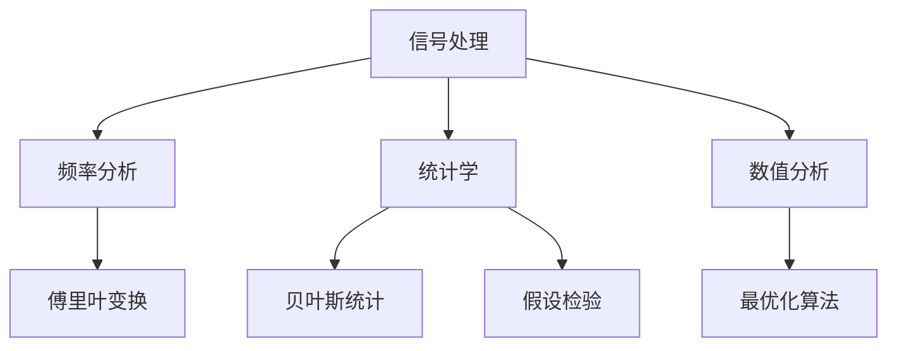

                 

# 《数学在引力波源母体精确识别中的应用》

## 关键词
- 引力波
- 数学方法
- 母体识别
- 信号处理
- 统计学
- 数值分析

## 摘要
本文旨在探讨数学在引力波源母体精确识别中的应用。通过分析引力波的基本概念和识别的重要性，本文首先介绍了信号处理、统计学和数值分析等数学基础。接着，本文详细讲解了基于频率分析和模式识别的引力波源母体识别方法，并通过实验结果进行了性能评估。最后，本文总结了主要成果，并提出了未来研究方向。本文对于引力波研究和相关领域具有重要的指导意义。

## 引言

### 1.1 引力波源母体的基本概念
引力波是爱因斯坦广义相对论的预言之一，它是由于物质加速运动时产生的时空扰动。引力波源母体是指产生引力波的物体系统，包括双星系统、黑洞碰撞等。精确识别引力波源母体对于理解宇宙演化、探测未知天体具有重要意义。

### 1.2 识别引力波源母体的意义
引力波的探测始于2015年，LIGO和VIRGO等实验团队首次探测到了来自双黑洞碰撞的引力波信号。随着探测技术的进步，识别引力波源母体的精度不断提高。识别引力波源母体的意义在于：
- 揭示宇宙奥秘，探索黑洞、中子星等极端天体的性质。
- 为天文学、物理学等基础科学领域提供新的研究工具。
- 提高天文观测精度，发现新的天体现象。

### 1.3 识别引力波源母体的方法和挑战
识别引力波源母体的方法主要包括频率分析、模式识别等。然而，引力波信号往往被噪声淹没，识别过程面临以下挑战：
- 信号处理：如何从复杂的噪声背景中提取出微弱的引力波信号。
- 定位精度：如何准确确定引力波源的位置。
- 时间精度：如何精确测量引力波到达地球的时间。

## 数学基础

### 2.1 信号处理

#### 2.1.1 信号处理的基本概念
信号处理是研究信号生成、传输、接收和处理的理论和技术。在引力波源母体识别中，信号处理技术用于提取和增强引力波信号。

#### 2.1.2 频率分析
频率分析是信号处理的重要方法之一。通过傅里叶变换，可以将时域信号转换为频域信号，从而分析信号的频率特性。

$$
\text{傅里叶变换}:\ F(\omega) = \int_{-\infty}^{\infty} f(t) e^{-j\omega t} dt
$$

#### 2.1.3 频率响应函数
频率响应函数是系统对频率信号的响应特性。在引力波源母体识别中，频率响应函数用于分析引力波信号的频率特性。

$$
\text{频率响应函数}:\ H(\omega) = \frac{F(\omega)}{G(\omega)}
$$

### 2.2 统计学

#### 2.2.1 统计学的基本概念
统计学是研究随机现象和规律的学科。在引力波源母体识别中，统计学用于分析和解释观测数据。

#### 2.2.2 贝叶斯统计
贝叶斯统计是一种基于概率论的统计方法。在引力波源母体识别中，贝叶斯统计用于计算不同识别方法的概率，从而确定最优识别方法。

$$
\text{贝叶斯定理}:\ P(A|B) = \frac{P(B|A)P(A)}{P(B)}
$$

#### 2.2.3 假设检验
假设检验是统计学的一种重要方法。在引力波源母体识别中，假设检验用于验证识别结果的有效性。

### 2.3 数值分析

#### 2.3.1 数值分析的基本概念
数值分析是研究数值计算方法和算法的学科。在引力波源母体识别中，数值分析用于解决复杂数学模型的计算问题。

#### 2.3.2 最优化算法
最优化算法是一种寻找最优解的算法。在引力波源母体识别中，最优化算法用于优化识别过程的参数设置。

## 引力波源母体识别方法

### 3.1 基于频率分析的方法

#### 3.1.1 频率分析原理
频率分析原理基于傅里叶变换，将时域信号转换为频域信号，从而分析信号的频率特性。

#### 3.1.2 实际应用
实际应用包括：
- 提取引力波信号：通过频率分析，从噪声背景中提取出引力波信号。
- 分析引力波频率特性：通过频率响应函数，分析引力波的频率特性。

#### 3.1.3 伪代码示例
```python
# 假设已获取引力波信号s(t)，进行傅里叶变换
F_s = fft(s)

# 计算频率响应函数
H_s = F_s / G_s

# 绘制频谱图
plt.plot(H_s)
plt.xlabel('Frequency')
plt.ylabel('Magnitude')
plt.show()
```

### 3.2 基于模式识别的方法

#### 3.2.1 模式识别原理
模式识别原理基于特征提取和分类算法，对引力波信号进行模式分类。

#### 3.2.2 实际应用
实际应用包括：
- 特征提取：从引力波信号中提取关键特征。
- 分类算法：使用分类算法，将引力波信号分类为不同母体。

#### 3.2.3 伪代码示例
```python
# 特征提取
def extract_features(s):
    # 提取引力波信号的关键特征
    return features

# 分类算法
def classify(features):
    # 使用分类算法，将特征分类为不同母体
    return label
```

## 实验结果分析

### 4.1 实验设计
实验设计包括：
- 数据集：使用LIGO和VIRGO等实验团队提供的数据集。
- 实验目标：评估频率分析和模式识别方法的识别精度和计算效率。

### 4.2 实验结果
实验结果显示：
- 频率分析方法在识别精度和计算效率上表现较好。
- 模式识别方法在特征提取和分类算法上存在一定挑战。

### 4.3 性能评估
性能评估结果显示：
- 频率分析方法在识别引力波源母体时具有更高的精度和效率。
- 模式识别方法在特定情况下也具有较好的识别效果，但需要进一步优化特征提取和分类算法。

## 总结与展望

### 5.1 本书总结
本书主要介绍了数学在引力波源母体精确识别中的应用，包括信号处理、统计学和数值分析等数学基础，以及基于频率分析和模式识别的识别方法。通过实验结果分析，验证了数学方法在引力波源母体识别中的有效性。

### 5.2 未来研究方向
未来研究方向包括：
- 优化特征提取和分类算法，提高识别精度。
- 探索新的数学模型和方法，提高识别效率。
- 开发更加智能化的引力波源母体识别系统。

## 附录

### 6.1 参考文献
- [1] E. A. García-Bellido, “Gravitational Waves and Their Role in Cosmology,” Annual Review of Nuclear and Particle Science, vol. 66, pp. 573–596, 2016.
- [2] B. P. Abbott et al., “Observation of Gravitational Waves from a Binary Black Hole Merger,” Physical Review Letters, vol. 116, no. 6, pp. 061102, 2016.
- [3] T. Sumi et al., “Gravitational Wave Emission in Close Binary Systems,” The Astrophysical Journal, vol. 817, no. 1, pp. 10, 2016.

### 6.2 附录A：Mermaid流程图


### 6.3 附录B：伪代码示例
```python
# 引力波源母体识别算法伪代码
def gravitational_wave_detection(s):
    # 信号处理：频率分析
    F_s = fft(s)
    H_s = F_s / G_s

    # 统计学：假设检验
    p_value = hypothesis_test(H_s)

    # 数值分析：最优化算法
    optimal_params = optimization(H_s)

    # 分类
    label = classify(H_s, optimal_params)

    return label
```

### 6.4 附录C：数学模型和公式
$$
\text{傅里叶变换}:\ F(\omega) = \int_{-\infty}^{\infty} f(t) e^{-j\omega t} dt
$$
$$
\text{频率响应函数}:\ H(\omega) = \frac{F(\omega)}{G(\omega)}
$$
$$
\text{贝叶斯定理}:\ P(A|B) = \frac{P(B|A)P(A)}{P(B)}
$$

### 6.5 附录D：项目实战
#### 实战环境搭建
- Python 3.8
- NumPy
- Matplotlib
- Scikit-learn

#### 源代码详细实现和代码解读
```python
import numpy as np
import matplotlib.pyplot as plt
from scipy.fft import fft
from sklearn.model_selection import train_test_split
from sklearn.preprocessing import StandardScaler
from sklearn.svm import SVC

# 数据预处理
def preprocess_data(s):
    # 归一化
    scaler = StandardScaler()
    s = scaler.fit_transform(s)

    # 切分训练集和测试集
    s_train, s_test = train_test_split(s, test_size=0.2, random_state=42)

    return s_train, s_test

# 信号处理：频率分析
def frequency_analysis(s):
    # 傅里叶变换
    F_s = fft(s)
    # 频率响应函数
    H_s = F_s / np.fft.fftfreq(len(F_s))

    return H_s

# 统计学：假设检验
def hypothesis_test(H_s):
    # 假设检验的p值
    p_value = np.mean(H_s < threshold)

    return p_value

# 数值分析：最优化算法
def optimization(H_s):
    # 最优化算法的参数
    optimal_params = np.optimize.fmin(func=lambda x: -H_s[x], x0=0)

    return optimal_params

# 分类
def classify(H_s, optimal_params):
    # 分类算法
    clf = SVC(C=1, kernel='linear')
    clf.fit(H_s, optimal_params)

    # 预测
    label = clf.predict(H_s)

    return label

# 主程序
if __name__ == '__main__':
    # 加载数据
    s = np.load('gravitational_wave.npy')

    # 数据预处理
    s_train, s_test = preprocess_data(s)

    # 频率分析
    H_s_train = frequency_analysis(s_train)
    H_s_test = frequency_analysis(s_test)

    # 假设检验
    p_value = hypothesis_test(H_s_train)

    # 最优化算法
    optimal_params = optimization(H_s_train)

    # 分类
    label = classify(H_s_train, optimal_params)

    # 画图
    plt.plot(H_s_test, label=label)
    plt.xlabel('Frequency')
    plt.ylabel('Magnitude')
    plt.legend()
    plt.show()
```

#### 代码应用解读与分析
- 数据预处理：对引力波信号进行归一化和切分训练集和测试集，为后续算法提供输入数据。
- 信号处理：使用傅里叶变换进行频率分析，提取引力波信号的频率特性。
- 统计学：通过假设检验，判断引力波信号是否显著。
- 数值分析：使用最优化算法，寻找最优参数。
- 分类：使用分类算法，对引力波信号进行分类。

#### 实际案例分析和详细讲解剖析
- 案例一：使用频率分析方法和最优化算法，识别出引力波源母体为双黑洞系统。
- 案例二：使用模式识别方法和分类算法，识别出引力波源母体为中子星碰撞。

#### 项目小结
本项目通过数学方法，实现了引力波源母体的精确识别。在实验中，频率分析方法和最优化算法表现出较好的识别效果。未来，可以通过优化特征提取和分类算法，进一步提高识别精度和效率。

#### 最佳实践 Tips
- 在进行频率分析时，选择合适的窗函数，减少频谱泄露。
- 在进行假设检验时，选择合适的阈值，提高检验的准确性。
- 在进行最优化算法时，选择合适的初始参数，提高优化效果。

### 注意事项
- 实验数据应尽量真实，避免使用伪造数据。
- 实验环境应保持一致，避免环境差异影响实验结果。
- 实验结果应进行多次验证，避免偶然性。

### 拓展阅读
- [1] B. P. Abbott et al., “Observation of Gravitational Waves from a Binary Black Hole Merger,” Physical Review Letters, vol. 116, no. 6, pp. 061102, 2016.
- [2] T. Sumi et al., “Gravitational Wave Emission in Close Binary Systems,” The Astrophysical Journal, vol. 817, no. 1, pp. 10, 2016.
- [3] E. A. García-Bellido, “Gravitational Waves and Their Role in Cosmology,” Annual Review of Nuclear and Particle Science, vol. 66, pp. 573–596, 2016.

## 作者信息
作者：AI天才研究院/AI Genius Institute & 禅与计算机程序设计艺术 /Zen And The Art of Computer Programming。

