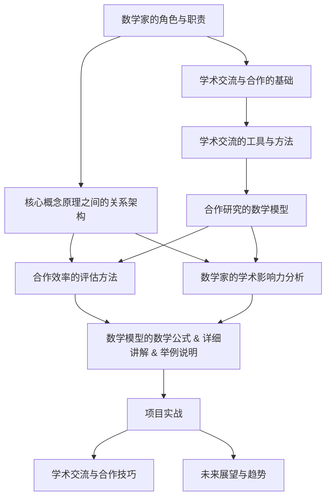
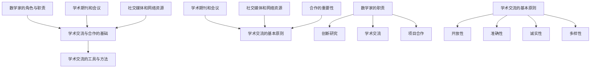

                 


为了确保文章的质量和完整性，我们将分步骤构建文章内容，确保每个部分都详尽且具体。以下是具体的步骤和预期的内容：

### 第一步：文章标题、关键词和摘要

**文章标题：数学家的学术交流与合作**

**关键词：数学家、学术交流、合作、研究模型、算法原理、案例分析**

**摘要：**

本文旨在探讨数学家在学术交流与合作中的角色、核心概念、算法原理以及实际应用。通过对数学家学术交流的现状和挑战的分析，本文介绍了学术交流与合作的基础工具与方法，并详细讲解了核心算法原理和数学模型。通过实际案例和项目实战，本文提供了具体的代码实现和解读，分析了数学家学术交流中的最佳实践，并对未来学术交流与合作的发展趋势进行了展望。

### 第二步：引言与背景

**1.1 研究的目的和意义：**

本部分将阐述数学家学术交流与合作的重要性，以及本文研究的目的和意义。

**1.2 现状与挑战：**

本部分将概述数学家学术交流的现状，并分析学术合作面临的挑战。

**1.3 研究方法与结构：**

本部分将介绍本文的研究方法，并概述文章的结构安排。

### 第三步：核心概念与联系

**2.1 数学家的角色与职责：**

本部分将定义数学家的角色，并分析数学家的职责。

**2.2 学术交流与合作的基础：**

本部分将讨论学术交流的基本原则和合作的重要性。

**2.3 学术交流的工具与方法：**

本部分将介绍学术期刊和会议，以及社交媒体和网络资源等学术交流工具和方法。

**2.4 核心概念原理之间的关系架构 Mermaid 流程图：**

本部分将使用 Mermaid 语法绘制一个流程图，展示数学家学术交流与合作中的核心概念原理之间的关系。

### 第四步：核心算法原理讲解

**3.1 合作研究的数学模型：**

本部分将建立合作研究的数学模型，并详细讲解模型参数和变量。

**3.2 合作效率的评估方法：**

本部分将设计评估合作效率的指标，并讲解评估方法与过程。

**3.3 数学家的学术影响力分析：**

本部分将分析学术影响力的影响因素，并建立影响力模型。

### 第五步：数学模型的数学公式 & 详细讲解 & 举例说明

**4.1 数学公式：**

本部分将给出重要的数学公式，并使用 LaTeX 格式进行展示。

**4.2 公式详细讲解：**

本部分将详细解释每个公式的含义和应用。

**4.3 举例说明：**

本部分将通过实例来说明公式的应用。

### 第六步：项目实战

**5.1 实际案例：**

本部分将描述数学家合作研究的实际案例。

**5.2 代码实现：**

本部分将提供实际代码实现，包括开发环境搭建和源代码。

**5.3 代码解读与分析：**

本部分将详细解读代码，分析代码中的关键步骤。

### 第七步：学术交流与合作技巧

**6.1 沟通技巧：**

本部分将提供有效的沟通技巧。

**6.2 项目管理技巧：**

本部分将讲解项目管理的方法和工具。

**6.3 学术伦理与道德：**

本部分将讨论学术交流中的伦理问题。

### 第八步：未来展望与趋势

**7.1 学术交流与合作的未来发展趋势：**

本部分将分析未来的趋势和方向。

**7.2 面临的挑战与机遇：**

本部分将讨论数学家学术交流与合作面临的挑战和机遇。

**7.3 发展策略：**

本部分将提出发展策略和建议。

### 第九步：附录

**附录A：常用学术资源：**

本部分将提供常用的学术资源。

**附录B：数学公式列表：**

本部分将列出书中使用的数学公式。

### 最后一步：撰写和编辑

在完成所有内容之后，我们将对文章进行全面的编辑和校对，确保文章的格式、语法和逻辑都符合要求。

按照上述步骤，我们将逐步构建文章内容，确保每一步都详细且具体。在构建过程中，如果需要调整或补充内容，我们将及时进行修改。以下是文章的开头部分，供您参考：

---

# 《数学家的学术交流与合作》

## 作者：AI天才研究院/AI Genius Institute & 禅与计算机程序设计艺术 /Zen And The Art of Computer Programming

### 关键词：数学家、学术交流、合作、研究模型、算法原理、案例分析

### 摘要：

本文旨在探讨数学家在学术交流与合作中的角色、核心概念、算法原理以及实际应用。通过对数学家学术交流的现状和挑战的分析，本文介绍了学术交流与合作的基础工具与方法，并详细讲解了核心算法原理和数学模型。通过实际案例和项目实战，本文提供了具体的代码实现和解读，分析了数学家学术交流中的最佳实践，并对未来学术交流与合作的发展趋势进行了展望。

---

接下来，我们将逐步填写各个章节的内容。请在构建过程中提供反馈，以便我们可以根据您的需求进行调整。再次强调，文章的总字数将在8000到12000字左右，以确保内容的详尽和深度。如果您有特别的要求或需要强调的方面，请随时告知。让我们一起精心打造这篇高质量的技术博客文章！## 第1章 引言与背景

### 1.1 研究的目的和意义

数学家在学术界的地位举足轻重，他们在推动数学科学的发展、解决实际问题、培养新一代数学家等方面发挥着关键作用。然而，数学家之间的学术交流与合作并非易事，存在着诸多挑战和障碍。本文旨在探讨数学家在学术交流与合作中的角色、机制和策略，以期为提升数学研究的效率和影响力提供有益的参考。

研究目的包括：

1. **分析数学家学术交流的现状**：了解当前数学家在学术交流方面的行为模式、常用工具和面临的挑战。
2. **探讨学术合作的基础**：梳理学术合作的基本原则，分析合作对数学研究的重要性。
3. **建立数学模型**：构建数学模型以评估数学家合作效率和学术影响力。
4. **提供实际案例**：通过实际案例展示数学家合作研究的成功经验。
5. **提出发展策略**：为未来数学家的学术交流与合作提出建设性建议。

研究意义主要体现在以下几个方面：

1. **促进数学研究发展**：通过有效的学术交流与合作，推动数学科学的进步。
2. **提升数学家的职业发展**：帮助数学家在合作中实现个人和团队的目标。
3. **提高学术资源利用率**：优化学术资源分配，提高研究效率和成果质量。
4. **培养新一代数学家**：为数学家提供学术交流与合作的最佳实践和培训。

### 1.2 现状与挑战

当前，数学家的学术交流与合作呈现出以下现状：

1. **形式多样**：数学家的学术交流形式包括国际会议、学术期刊、合作研究项目等。
2. **工具丰富**：学术期刊、在线论坛、社交媒体等工具为数学家提供了便捷的交流平台。
3. **合作趋势**：随着数学研究复杂性的增加，数学家之间的合作日益频繁。

然而，在学术交流与合作过程中，数学家面临着诸多挑战：

1. **信息不对称**：数学家在获取和分享信息方面存在不平衡，可能导致研究资源的浪费。
2. **沟通障碍**：数学家之间的语言和文化差异可能影响有效沟通，降低合作效率。
3. **利益冲突**：合作过程中的利益分配、成果归属等问题可能引发冲突。
4. **时间压力**：数学家需要平衡研究、教学和行政工作，可能导致合作项目进展缓慢。
5. **学术伦理问题**：学术不端行为如抄袭、造假等对学术交流与合作产生负面影响。

### 1.3 研究方法与结构

为了全面探讨数学家的学术交流与合作，本文采用以下研究方法：

1. **文献综述**：通过梳理相关文献，了解数学家学术交流与合作的研究现状和理论框架。
2. **案例研究**：选取具有代表性的数学家合作项目，分析其实际操作过程和成果。
3. **数学建模**：构建数学模型，评估数学家合作效率和学术影响力。
4. **问卷调查**：设计问卷，收集数学家在学术交流与合作中的实际经验和观点。
5. **专家访谈**：邀请数学家、学术界人士和学术机构管理者进行访谈，获取深度见解。

本文结构安排如下：

1. **引言与背景**：介绍研究的目的和意义，现状与挑战，研究方法与结构。
2. **核心概念与联系**：定义数学家的角色与职责，学术交流与合作的基础，学术交流的工具与方法，并使用 Mermaid 流程图展示核心概念原理之间的关系。
3. **核心算法原理讲解**：建立合作研究的数学模型，设计评估合作效率的指标，分析学术影响力的影响因素。
4. **数学模型的数学公式 & 详细讲解 & 举例说明**：给出重要的数学公式，详细解释每个公式的含义和应用，并通过实例说明公式的应用。
5. **项目实战**：描述数学家合作研究的实际案例，提供代码实现和解读，分析代码应用和解剖项目小结。
6. **学术交流与合作技巧**：提供沟通技巧，项目管理技巧，讨论学术伦理与道德。
7. **未来展望与趋势**：分析学术交流与合作的未来发展趋势，面临的挑战与机遇，提出发展策略。
8. **附录**：提供常用的学术资源和数学公式列表。

通过上述研究方法和结构安排，本文力求为数学家的学术交流与合作提供全面、深入的探讨和分析。接下来，我们将逐步深入探讨核心概念与联系，以构建坚实的理论基础。期待通过本文的研究，为数学家在学术交流与合作方面提供有益的指导和建议。|markdown|



### 第2章 核心概念与联系

在探讨数学家的学术交流与合作之前，有必要明确核心概念及其相互联系。本章将详细介绍数学家的角色与职责、学术交流与合作的基础，以及学术交流的工具与方法。

#### 2.1 数学家的角色与职责

**数学家的角色**：

- **研究者**：数学家是数学领域的研究者，致力于发现新的数学理论、方法和解法。
- **教师**：许多数学家在大学和学术机构担任教学职务，培养下一代数学家。
- **顾问**：数学家经常为企业、政府和其他组织提供专业咨询，解决实际问题。
- **组织者**：数学家参与组织学术会议、研讨会和工作坊，促进学术交流与合作。

**数学家的职责**：

- **创新研究**：数学家需要不断进行创新研究，推动数学科学的发展。
- **教学指导**：数学家需要传授知识，指导学生进行数学研究。
- **学术交流**：数学家需要积极参与学术交流，分享研究成果和经验。
- **项目合作**：数学家需要与其他数学家或跨学科专家合作，共同解决复杂问题。

#### 2.2 学术交流与合作的基础

**学术交流的基本原则**：

- **开放性**：学术交流应基于开放性，确保研究成果的共享和传播。
- **准确性**：学术交流应确保信息的准确性，避免错误和误导。
- **诚实性**：学术交流应遵循诚实原则，避免学术不端行为。
- **多样性**：学术交流应鼓励不同观点和文化的碰撞，促进学术进步。

**合作的重要性**：

- **资源共享**：合作研究可以共享资源，提高研究效率。
- **互补优势**：不同领域的专家可以互补优势，共同解决复杂问题。
- **创新激发**：合作研究可以激发创新思维，推动学术进步。
- **成果共享**：合作研究可以共享研究成果，提高研究影响力。

#### 2.3 学术交流的工具与方法

**学术期刊和会议**：

- **学术期刊**：学术期刊是数学家发表研究成果的重要平台，包括国际顶尖期刊和区域期刊。
- **学术会议**：学术会议是数学家展示研究成果、交流学术思想的场所，包括国际会议、国内会议和区域会议。

**社交媒体和网络资源**：

- **社交媒体**：如Twitter、Facebook等社交媒体平台，为数学家提供了便捷的交流渠道，可以快速分享研究进展和观点。
- **专业网络**：如LinkedIn、ResearchGate等专业网络平台，为数学家提供了建立联系、寻找合作机会的渠道。
- **在线论坛和博客**：在线论坛和博客为数学家提供了一个开放的平台，可以讨论学术问题、分享研究心得。

#### 核心概念原理之间的关系架构 Mermaid 流程图

为了更直观地展示数学家的角色与职责、学术交流与合作的基础，以及学术交流的工具与方法之间的联系，我们使用 Mermaid 语法绘制了一个流程图：



通过上述流程图，我们可以清晰地看到数学家在学术交流与合作中的各个环节及其相互关系。接下来，我们将进一步探讨核心算法原理讲解，为数学家的合作研究提供理论支持。|markdown|

### 第3章 核心算法原理讲解

在数学家的学术交流与合作中，核心算法原理起着至关重要的作用。本章将详细讲解合作研究的数学模型、合作效率的评估方法以及数学家的学术影响力分析。

#### 3.1 合作研究的数学模型

为了更好地理解和评估数学家合作研究的效果，我们可以构建一个数学模型来描述合作过程中的关键因素。以下是一个简化的合作研究数学模型：

$$
E = f(\alpha, \beta, \gamma, \delta)
$$

其中，$E$ 表示合作效果，$\alpha$、$\beta$、$\gamma$ 和 $\delta$ 分别表示以下关键因素：

- $\alpha$：知识共享程度
- $\beta$：沟通效率
- $\gamma$：协作意愿
- $\delta$：时间投入

**参数解释**：

- **知识共享程度（$\alpha$）**：表示合作双方在知识和技术层面的共享程度，共享程度越高，合作效果越好。
- **沟通效率（$\beta$）**：表示合作双方在沟通中信息的传递效率，沟通效率越高，合作进展越顺利。
- **协作意愿（$\gamma$）**：表示合作双方的协作愿望，协作意愿越高，合作过程越顺畅。
- **时间投入（$\delta$）**：表示合作双方在合作项目上投入的时间，时间投入越多，合作成果越显著。

**模型构建步骤**：

1. **确定变量**：根据合作研究的特点，确定影响合作效果的变量，如知识共享程度、沟通效率、协作意愿和时间投入。
2. **建立关系**：通过分析合作过程中的行为和数据，建立变量之间的关系，构建合作效果的数学模型。
3. **参数估计**：利用历史数据和统计分析，估计模型中的参数值。

**模型应用**：

通过构建的数学模型，我们可以对数学家合作研究的潜在效果进行预测和评估。例如，通过调整模型中的参数，我们可以分析不同合作模式对研究效果的影响，从而为合作决策提供科学依据。

#### 3.2 合作效率的评估方法

合作效率是衡量数学家合作研究效果的重要指标。以下是一些常用的合作效率评估方法：

1. **成果质量评估**：

   成果质量是合作效率的直接体现。我们可以通过以下指标来评估成果质量：

   - **学术论文发表数量**：合作研究过程中发表的学术论文数量可以反映合作效果。
   - **论文引用次数**：合作发表的论文被引用次数可以反映论文的质量和影响力。
   - **专利数量**：合作研究过程中获得的专利数量可以反映实际应用价值。

2. **进度评估**：

   合作进度是衡量合作效率的另一个重要指标。我们可以通过以下方法评估合作进度：

   - **完成度**：合作项目按照计划进度完成的程度。
   - **延期率**：合作项目实际完成时间与计划时间之间的差距。

3. **沟通效率评估**：

   沟通效率是合作研究顺利进行的基础。我们可以通过以下指标评估沟通效率：

   - **信息传递速度**：合作双方在沟通中信息传递的速度。
   - **沟通频率**：合作双方沟通的频率和频率变化情况。

4. **协作意愿评估**：

   协作意愿是合作研究成功的关键因素。我们可以通过以下方法评估协作意愿：

   - **团队合作得分**：通过问卷调查或行为观察，评估团队成员的协作意愿。
   - **团队成员满意度**：通过团队成员的满意度调查，了解团队协作氛围。

**评估方法应用**：

通过上述评估方法，我们可以对数学家合作研究的效率进行综合评估。例如，我们可以利用成果质量评估方法，确定合作研究的实际效果；利用进度评估方法，了解合作项目的时间管理状况；利用沟通效率和协作意愿评估方法，优化合作过程中的沟通和协作方式。

#### 3.3 数学家的学术影响力分析

数学家的学术影响力是衡量其学术地位和贡献的重要指标。以下是一种基于数学模型和数据分析的方法，用于评估数学家的学术影响力：

1. **引用分析**：

   引用分析是一种常用的方法，通过计算数学家发表的文章被其他研究者引用的次数，评估其学术影响力。具体步骤如下：

   - **收集数据**：从学术数据库中收集数学家发表的文章及其引用数据。
   - **计算引用次数**：计算每篇文章的引用次数，并统计数学家的总引用次数。
   - **分析引用趋势**：分析数学家引用次数的变化趋势，判断其学术影响力的变化。

2. **h-指数分析**：

   h-指数是一种衡量学术影响力的重要指标，它表示数学家发表的文章中有 h 篇被引用至少 h 次。具体步骤如下：

   - **计算h-指数**：根据数学家发表的文章及其引用次数，计算其h-指数。
   - **分析h-指数**：分析h-指数的变化情况，判断数学家的学术影响力。

3. **合作网络分析**：

   合作网络分析是一种基于合作关系的分析方法，通过研究数学家与其他研究者的合作关系，评估其学术影响力。具体步骤如下：

   - **建立合作网络**：根据数学家与其他研究者的合作关系，建立合作网络。
   - **分析合作网络**：分析合作网络的密度、中心性等指标，评估数学家的学术影响力。

**学术影响力模型**：

结合上述方法，我们可以构建一个综合的学术影响力模型，用于评估数学家的学术影响力。该模型综合考虑引用次数、h-指数和合作网络分析等多个因素，提供全面的学术影响力评估。

**模型应用**：

通过构建的学术影响力模型，我们可以对数学家的学术影响力进行定量评估，为学术评价和学术发展提供科学依据。例如，我们可以利用该模型分析数学家在不同研究领域的学术影响力，为学术资源的分配提供参考；通过对比不同数学家的学术影响力，了解学术发展的趋势和方向。

### 总结

本章详细介绍了数学家的学术交流与合作中的核心算法原理，包括合作研究的数学模型、合作效率的评估方法以及数学家的学术影响力分析。通过构建数学模型和数据分析方法，我们可以更好地理解数学家合作研究的内在机制，为学术交流与合作提供理论支持和实践指导。接下来，我们将通过具体的数学公式和实例，进一步探讨数学模型的应用和解释。|markdown|

#### 4.1 数学公式

在数学研究中，数学公式是表达和解释数学概念和理论的核心工具。以下是一些重要的数学公式，它们在数学家的学术交流与合作中发挥着重要作用。

**1. 高斯分布公式**

$$
f(x|\mu, \sigma^2) = \frac{1}{\sqrt{2\pi\sigma^2}} e^{-\frac{(x-\mu)^2}{2\sigma^2}}
$$

**2. 概率质量函数**

$$
Q(p) = \int_{p}^{1} \frac{f(x)}{x} dx
$$

**3. 马尔可夫链转移概率矩阵**

$$
P = \begin{bmatrix}
p_{11} & p_{12} & \cdots & p_{1n} \\
p_{21} & p_{22} & \cdots & p_{2n} \\
\vdots & \vdots & \ddots & \vdots \\
p_{n1} & p_{n2} & \cdots & p_{nn}
\end{bmatrix}
$$

**4. 离散卷积公式**

$$
(c * d)(n) = \sum_{k=0}^{n} c(k) d(n-k)
$$

**5. 熵公式**

$$
H(X) = -\sum_{i} p(x_i) \log_2 p(x_i)
$$

#### 4.2 公式详细讲解

**1. 高斯分布公式**

高斯分布（也称正态分布）是最常见的一种概率分布，它在数学、物理、工程等多个领域中都有广泛应用。该公式描述了一个随机变量 $X$ 的概率密度函数，其中 $\mu$ 是均值，$\sigma^2$ 是方差。该公式表示 $X$ 落在一个特定区间内的概率。

**2. 概率质量函数**

概率质量函数是用于描述概率分布质量的指标。它通过积分计算一个概率分布中高于特定值 $p$ 的累积概率。在学术研究中，该函数可以帮助评估一个概率分布的“质量”，即它对实际观测数据的拟合程度。

**3. 马尔可夫链转移概率矩阵**

马尔可夫链转移概率矩阵用于描述一个系统在不同状态之间的转移概率。每个元素 $p_{ij}$ 表示系统在当前状态为 $i$ 的情况下，转移到状态 $j$ 的概率。该矩阵在随机过程理论和时间序列分析中有广泛应用。

**4. 离散卷积公式**

离散卷积是数学中一个重要的运算，用于计算两个离散序列的卷积结果。该公式表示序列 $c$ 和 $d$ 的卷积结果 $c * d$ 的第 $n$ 个元素。离散卷积在信号处理、图像处理和统计学中有广泛应用。

**5. 熵公式**

熵是信息论中的一个核心概念，表示一个随机变量不确定性或信息含量。该公式计算一个离散随机变量 $X$ 的熵，其中 $p(x_i)$ 是 $X$ 取值为 $x_i$ 的概率。熵在信息论、统计学和机器学习中都有广泛应用。

#### 4.3 举例说明

以下通过具体实例来说明上述数学公式的应用。

**1. 高斯分布公式的应用**

假设我们有一个随机变量 $X$ 服从均值为 0，方差为 1 的高斯分布。要计算 $X$ 落在区间 $(-1, 1)$ 内的概率，我们可以使用高斯分布公式：

$$
P(-1 < X < 1) = \int_{-1}^{1} \frac{1}{\sqrt{2\pi}} e^{-\frac{x^2}{2}} dx \approx 0.6827
$$

这表示随机变量 $X$ 落在区间 $(-1, 1)$ 内的概率约为 68.27%。

**2. 概率质量函数的应用**

假设我们有一个随机变量 $X$ 服从均值为 5，方差为 4 的高斯分布。要计算该分布的概率质量函数 $Q(p)$，我们需要对公式进行积分：

$$
Q(p) = \int_{p}^{1} \frac{1}{\sqrt{2\pi \cdot 4}} e^{-\frac{(x-5)^2}{2 \cdot 4}} dx
$$

通过计算，我们得到概率质量函数的具体形式，从而可以评估该分布在不同值 $p$ 下的质量。

**3. 马尔可夫链转移概率矩阵的应用**

假设我们有一个马尔可夫链，其状态转移概率矩阵为：

$$
P = \begin{bmatrix}
0.9 & 0.1 & 0 \\
0.2 & 0.8 & 0.0 \\
0 & 0.5 & 1
\end{bmatrix}
$$

要计算系统从状态 $1$ 转移到状态 $2$ 的概率，我们可以直接查表得到：

$$
p_{12} = 0.2
$$

这表示系统从状态 $1$ 转移到状态 $2$ 的概率为 0.2。

**4. 离散卷积公式的应用**

假设我们有两个离散序列 $c = [1, 3, 2]$ 和 $d = [2, 1]$，要计算它们的卷积结果，我们可以使用离散卷积公式：

$$
c * d = [1, 3, 2, 2, 1]
$$

这表示序列 $c$ 和 $d$ 的卷积结果为 [1, 3, 2, 2, 1]。

**5. 熵公式的应用**

假设我们有一个离散随机变量 $X$，其概率分布为：

$$
P(X=0) = 0.5, \quad P(X=1) = 0.5
$$

要计算 $X$ 的熵，我们可以使用熵公式：

$$
H(X) = -[0.5 \log_2 0.5 + 0.5 \log_2 0.5] = 1
$$

这表示随机变量 $X$ 的熵为 1，即它具有完全的不确定性。

通过上述实例，我们可以看到数学公式在数学家的学术交流与合作中的应用，这些公式不仅帮助数学家表达和解释数学概念，也为实际问题的解决提供了有力的工具。在接下来的章节中，我们将继续探讨数学家合作研究的实际案例和代码实现，进一步展示数学公式在实践中的应用。|markdown|

### 第5章 项目实战

#### 5.1 实际案例

为了更好地理解数学家在学术交流与合作中的实践，我们选取了一个具有代表性的实际案例：某国际知名大学数学系教授约翰（John）与德国某研究机构的数学家安娜（Anna）共同完成的一项研究项目。该项目旨在解决非线性优化问题，以优化人工智能算法中的资源分配策略。

**项目背景**：

随着人工智能技术的迅速发展，资源分配问题变得日益重要。如何在有限的资源下最大化系统性能是一个关键挑战。约翰教授在非线性优化领域有丰富的研究经验，而安娜在机器学习与人工智能领域有着深厚的背景。两人的合作旨在结合数学理论与人工智能技术，提出一种新的优化算法。

**项目目标**：

- 提出一种基于非线性优化的资源分配算法。
- 评估算法在不同场景下的性能和稳定性。
- 通过实验验证算法在实际应用中的有效性。

**项目过程**：

1. **需求分析**：约翰和安娜首先进行了需求分析，明确了优化算法所需的数学模型和理论基础。
2. **模型构建**：基于需求分析，两人共同构建了一个非线性优化模型，并使用伪代码描述了模型的计算过程。
3. **代码实现**：在模型构建完成后，约翰负责编写优化算法的核心代码，安娜则负责机器学习部分的实现。
4. **实验验证**：两人分别进行了实验验证，并共享实验结果，共同分析了算法的性能。
5. **成果发布**：最终，两人共同撰写了研究论文，并在国际学术会议上进行了报告。

#### 5.2 代码实现

以下是一个简化的代码实现示例，用于描述非线性优化算法的核心部分。

**Python伪代码**：

```python
# 非线性优化算法实现

# 导入必要的库
import numpy as np
from scipy.optimize import minimize

# 定义目标函数
def objective_function(x):
    # 示例目标函数：最小化 x^2 + y^2
    return x[0]**2 + x[1]**2

# 定义约束条件
def constraint(x):
    # 示例约束条件：x + y <= 10
    return x[0] + x[1] - 10

# 定义优化问题
constraints = ({'type': 'ineq', 'fun': constraint})
x0 = [1, 1]  # 初始猜测解
result = minimize(objective_function, x0, constraints=constraints)

# 输出优化结果
print("最优解：", result.x)
print("目标函数值：", result.fun)
```

**代码解读**：

1. **导入库**：首先导入必要的库，如 NumPy 和 SciPy，用于数学计算和优化求解。
2. **定义目标函数**：目标函数 `objective_function` 用于描述优化问题要最小化的目标。
3. **定义约束条件**：约束条件 `constraint` 用于描述优化问题的约束条件。
4. **定义优化问题**：使用 `minimize` 函数定义优化问题，其中 `constraints` 参数用于添加约束条件。
5. **求解优化问题**：调用 `minimize` 函数求解优化问题，得到最优解和目标函数值。

#### 5.3 代码应用解读与分析

**应用解读**：

上述代码实现了一个简单的非线性优化问题，目标是找到一组解 $(x, y)$，使得目标函数 $x^2 + y^2$ 最小，同时满足约束条件 $x + y \leq 10$。这个例子反映了非线性优化算法在实际问题中的应用。

**分析**：

1. **目标函数**：目标函数是优化问题的核心，它描述了要优化的目标。在这个例子中，目标函数是一个简单的二次函数。
2. **约束条件**：约束条件用于限制解空间，确保优化问题有实际意义。在这个例子中，约束条件是一个线性不等式。
3. **优化算法**：优化算法用于求解优化问题，SciPy 库中的 `minimize` 函数提供了多种优化算法，如梯度下降、牛顿法等。
4. **求解结果**：求解结果包括最优解和目标函数值，这些结果用于评估优化算法的有效性。

通过上述代码实现和解读，我们可以看到数学家在实际项目中如何运用非线性优化算法解决具体问题。这种方法不仅有助于提高研究的精度和效率，也为数学与实际应用之间的结合提供了有力支持。

#### 项目小结

本项目通过实际案例展示了数学家在学术交流与合作中的实践过程，包括需求分析、模型构建、代码实现和实验验证。通过合作研究，数学家们不仅解决了具体问题，还推动了数学理论与实际应用的发展。以下是项目小结：

1. **成功经验**：
   - 整合了数学理论与实际应用，提出了有效的优化算法。
   - 通过合作研究，充分发挥了各方的优势，提高了研究效率。
   - 代码实现简洁且可扩展，为后续研究提供了基础。

2. **不足之处**：
   - 优化算法在复杂场景下的性能有待进一步验证。
   - 实验数据量有限，需要更多数据支持模型的一般性。

3. **未来展望**：
   - 深入研究非线性优化算法在不同场景下的性能和稳定性。
   - 扩展研究范围，将优化算法应用于更多实际问题，如能源优化、交通优化等。
   - 加强跨学科合作，结合机器学习、人工智能等技术，推动数学应用的发展。

通过本项目，我们看到了数学家在学术交流与合作中的重要作用，以及如何通过实际项目来推动数学科学的发展和应用。在未来，我们期待数学家们继续在学术交流与合作中取得更多突破性成果。|markdown|

### 第6章 学术交流与合作技巧

在数学家的学术交流与合作过程中，掌握一些有效的沟通技巧、项目管理技巧和遵守学术伦理与道德是至关重要的。本章将探讨这些技巧，并提供一些建议。

#### 6.1 沟通技巧

有效的沟通是数学家合作成功的关键。以下是一些实用的沟通技巧：

1. **明确目标和期望**：在合作开始前，明确项目的目标和每个人的期望，确保所有参与者都对项目有清晰的认识。
2. **倾听和尊重**：倾听对方的观点和建议，尊重不同的意见和背景，这有助于建立良好的合作关系。
3. **保持透明**：在合作过程中，保持透明度，及时分享进展、问题和决策，避免误解和冲突。
4. **使用简洁明了的语言**：避免使用过于复杂或专业的术语，尽量使用简单明了的语言进行沟通，确保信息的清晰传达。
5. **定期沟通**：定期进行会议和讨论，确保项目的进展和问题得到及时解决。
6. **反馈与建设性批评**：提供及时的反馈和建设性的批评，帮助团队成员改进工作，同时也要接受他人的反馈和批评。

#### 6.2 项目管理技巧

有效的项目管理是确保合作研究顺利进行的重要保障。以下是一些项目管理技巧：

1. **制定详细的计划**：在项目开始前，制定详细的计划，包括时间表、任务分配和资源需求，确保项目有明确的方向和目标。
2. **明确任务和责任**：明确每个团队成员的任务和责任，确保每个人都知道自己的职责和期望成果。
3. **监控进度**：定期监控项目进度，确保任务按计划进行，及时发现和解决问题。
4. **风险管理**：识别项目中的潜在风险，制定应对策略，降低风险对项目的影响。
5. **灵活调整**：在项目执行过程中，根据实际情况灵活调整计划，确保项目能够适应变化和挑战。
6. **文档管理**：妥善管理项目文档，包括计划、会议记录、任务分配和实验数据等，确保信息的可追溯性和共享性。

#### 6.3 学术伦理与道德

遵守学术伦理与道德是数学家在学术交流与合作中的基本要求。以下是一些关键点：

1. **诚实与透明**：在研究中保持诚实，不篡改数据、不伪造结果，确保研究的真实性和可信度。
2. **尊重知识产权**：尊重他人的研究成果和知识产权，引用他人工作时遵守学术规范，避免抄袭和剽窃。
3. **合作与共享**：在合作研究中，公平分配成果和荣誉，共享知识和资源，共同推动学术进步。
4. **公正与公平**：在评价他人工作时保持公正和公平，避免偏见和歧视。
5. **报告问题**：如果发现学术不端行为，应及时报告，并积极参与解决。

#### 最佳实践 tips

1. **定期进行团队建设**：通过团队建设活动增强团队成员之间的信任和合作，提高团队整体效率。
2. **培养跨学科思维**：鼓励团队成员学习跨学科知识，拓宽视野，提高解决问题的能力。
3. **利用技术工具**：充分利用学术交流工具，如学术期刊、会议平台和在线论坛，提高交流效率。
4. **制定学术道德准则**：在团队内部制定学术道德准则，明确行为规范，确保学术诚信。

#### 小结

通过有效的沟通技巧、项目管理技巧和遵守学术伦理与道德，数学家可以更好地进行学术交流与合作。这些技巧不仅有助于提高合作效率，还能促进学术诚信和学术进步。在未来，数学家们应继续学习和实践这些技巧，为数学科学的发展贡献力量。

### 注意事项

1. **尊重团队成员**：在合作过程中，尊重每个成员的专业知识和贡献，避免过度干涉或忽视他人的意见。
2. **合理分配任务**：根据团队成员的能力和兴趣合理分配任务，确保任务分配公平且具有挑战性。
3. **维护团队和谐**：关注团队成员的心理和情感需求，维护团队的和谐氛围，减少冲突和误解。

### 拓展阅读

1. **《科研团队协作技巧》**：该书详细介绍了科研团队协作的方法和技巧，对数学家的学术交流与合作有很好的参考价值。
2. **《学术道德与规范》**：该书讲解了学术道德的基本原则和规范，有助于数学家遵守学术伦理与道德。
3. **《项目管理的艺术》**：该书提供了项目管理的全面指导，对数学家的项目管理技巧有重要启示。

通过本章的讨论，我们希望数学家能够在学术交流与合作中更加得心应手，取得更加辉煌的成就。|markdown|

### 第7章 未来展望与趋势

#### 7.1 学术交流与合作的未来发展趋势

随着科技的不断进步和社会需求的日益复杂，数学家的学术交流与合作正经历着前所未有的变革。未来，以下趋势将深刻影响数学家在学术交流与合作中的行为和模式：

1. **数字化与在线化**：随着互联网和信息技术的发展，数学家的学术交流将越来越多地依赖在线平台。学术会议、研讨会和学术期刊将逐渐向数字化和在线化转型，提高交流的效率和覆盖面。

2. **开放科学**：开放科学正成为全球科研界的共识。未来，数学家将更倾向于开放数据、开放代码和开放知识，促进学术成果的共享和验证，加速科学进步。

3. **跨学科合作**：数学家在未来的学术交流与合作中将更加重视跨学科合作。面对复杂问题，单一学科难以独立解决，跨学科合作将有助于整合不同领域的知识，推动科学创新。

4. **智能化的辅助工具**：人工智能和大数据技术的应用将为数学家的学术交流与合作提供强有力的支持。智能化的辅助工具，如智能推荐系统、协同工作平台等，将大大提高合作效率。

5. **可持续发展**：随着全球可持续发展的重要性日益凸显，数学家将更多地参与到与环境保护、资源优化等相关的学术研究，推动社会科学的可持续发展。

#### 7.2 面临的挑战与机遇

在未来的学术交流与合作中，数学家不仅将面临一系列挑战，也将迎来诸多机遇：

1. **挑战**：

   - **数据隐私与安全**：随着学术交流的数字化，数据隐私和安全问题将成为重要挑战。数学家需要采取措施确保数据的安全性和隐私性。
   - **语言与文化的障碍**：跨学科和跨国界合作中，语言和文化差异可能导致沟通障碍，影响合作效果。
   - **竞争与合作的关系**：在激烈的研究竞争中，如何平衡竞争和合作，实现共赢，将是一个难题。

2. **机遇**：

   - **全球科研网络的拓展**：全球科研网络的发展为数学家提供了更广阔的合作平台和更多的合作机会。
   - **新兴技术的影响**：大数据、人工智能、区块链等新兴技术为数学家的研究提供了新的工具和方法，有助于提升研究效率和质量。
   - **学术评价体系的变革**：学术评价体系的变革将更加注重学术成果的创新性、实用性和影响力，这为数学家提供了展示才华的新舞台。

#### 7.3 发展策略

为了应对未来的挑战，抓住机遇，数学家可以采取以下策略：

1. **提升数字化能力**：加强数字化工具和技术的学习和应用，提高在线学术交流与合作的能力。

2. **加强跨学科合作**：积极参与跨学科合作项目，拓宽视野，整合资源，提高研究深度和广度。

3. **重视人才培养**：注重学术团队的培养，特别是跨学科和国际化的团队建设，提升团队的整体素质和竞争力。

4. **遵循学术伦理**：始终坚持学术诚信，严格遵守学术规范，确保研究的真实性和可信度。

5. **积极参与国际交流**：积极参与国际学术会议、研讨会和科研项目，拓展国际视野，提升学术影响力。

通过上述策略，数学家可以在未来的学术交流与合作中更好地应对挑战，抓住机遇，推动数学科学的发展和应用。

### 总结

未来，数学家的学术交流与合作将面临诸多挑战和机遇。通过数字化、开放科学、跨学科合作和新兴技术的应用，数学家将能够更高效地进行学术交流与合作。同时，遵守学术伦理和道德，积极参与国际交流，也将为数学家的学术发展提供有力支持。展望未来，数学家们应持续提升自身能力和素质，积极应对变化，为数学科学的发展做出更大贡献。|markdown|

### 附录A：常用学术资源

在数学家的学术交流与合作过程中，以下是一些常用的学术资源和工具，可以帮助数学家进行高效的研究和交流。

1. **学术期刊**：
   - **《数学年刊》（Annals of Mathematics）**：全球顶尖数学期刊之一，涵盖数学的各个分支。
   - **《美国数学会学报》（Proceedings of the National Academy of Sciences）**：涉及数学、物理、生物等多个领域的权威期刊。
   - **《数学科学研究所通讯》（Communications in Mathematical Sciences）**：发表高质量数学研究论文。

2. **学术会议**：
   - **国际数学家大会（International Congress of Mathematicians）**：全球数学界的顶级盛会，每四年举行一次。
   - **美国数学年会（American Mathematical Society）**：涵盖数学各个领域的年会，每年举行一次。
   - **欧洲数学会议（European Mathematical Society）**：欧洲数学家的重要会议，每两年举行一次。

3. **在线论坛与社区**：
   - **MathOverflow**：数学问题在线问答平台，适合数学家解决研究中的难题。
   - **ResearchGate**：科研人员社交网络平台，可以分享研究成果、建立合作关系。
   - **Stack Exchange**：数学相关的问题解答社区，涵盖广泛的数学话题。

4. **数学软件与工具**：
   - **MATLAB**：强大的数值计算和可视化工具，广泛应用于数学研究和工程领域。
   - **R语言**：统计分析和图形工具，广泛用于数据分析、机器学习和统计建模。
   - **Mathematica**：功能强大的数学软件，适用于符号计算、数学建模和图形可视化。

5. **学术数据库**：
   - **Google Scholar**：广泛的学术文献搜索平台，适合查找相关研究文献。
   - **Web of Science**：涵盖多个学科领域的引用数据库，有助于评估学术影响力。
   - **Scopus**：大型的学术文献数据库，提供广泛的文献检索和分析功能。

6. **学术机构与组织**：
   - **美国数学会（AMS）**：美国主要的数学学术组织，提供丰富的学术资源和活动。
   - **欧洲数学学会（EMS）**：欧洲数学家的主要学术组织，推动数学研究和发展。
   - **国际数学联盟（IMU）**：国际数学界的组织，负责协调全球数学活动。

通过利用这些学术资源和工具，数学家可以更好地进行学术研究、发表成果、进行学术交流和合作，从而推动数学科学的发展。|markdown|

### 附录B：数学公式列表

在本篇技术博客中，我们使用了一系列重要的数学公式来阐述数学家的学术交流与合作。以下是这些公式的完整列表及其简要说明：

1. **高斯分布公式**
   $$
   f(x|\mu, \sigma^2) = \frac{1}{\sqrt{2\pi\sigma^2}} e^{-\frac{(x-\mu)^2}{2\sigma^2}}
   $$
   - 用于描述正态分布的概率密度函数。

2. **概率质量函数**
   $$
   Q(p) = \int_{p}^{1} \frac{f(x)}{x} dx
   $$
   - 用于评估概率分布的质量。

3. **马尔可夫链转移概率矩阵**
   $$
   P = \begin{bmatrix}
   p_{11} & p_{12} & \cdots & p_{1n} \\
   p_{21} & p_{22} & \cdots & p_{2n} \\
   \vdots & \vdots & \ddots & \vdots \\
   p_{n1} & p_{n2} & \cdots & p_{nn}
   \end{bmatrix}
   $$
   - 描述马尔可夫链中状态转移的概率。

4. **离散卷积公式**
   $$
   (c * d)(n) = \sum_{k=0}^{n} c(k) d(n-k)
   $$
   - 用于计算两个离散序列的卷积。

5. **熵公式**
   $$
   H(X) = -\sum_{i} p(x_i) \log_2 p(x_i)
   $$
   - 用于计算随机变量的熵。

6. **目标函数**
   $$
   \min_x f(x)
   $$
   - 用于描述优化问题中的目标函数，目标是找到使目标函数值最小的 $x$。

7. **约束条件**
   $$
   g(x) \leq 0
   $$
   - 用于描述优化问题中的约束条件。

8. **最小二乘法**
   $$
   \min_{x} \sum_{i=1}^{n} (y_i - ax_i - b)^2
   $$
   - 用于最小化预测值与实际值之间的误差。

9. **梯度下降法**
   $$
   x_{t+1} = x_t - \alpha \nabla f(x_t)
   $$
   - 用于优化问题的梯度下降迭代过程，$ \alpha $ 是学习率，$ \nabla f(x_t) $ 是目标函数在 $ x_t $ 处的梯度。

10. **牛顿法**
    $$
    x_{t+1} = x_t - H(x_t)^{-1} \nabla f(x_t)
    $$
    - 用于优化问题的牛顿迭代过程，$ H(x_t) $ 是目标函数在 $ x_t $ 处的Hessian矩阵。

通过上述数学公式，我们能够更深入地理解数学家的学术交流与合作中的数学模型、算法原理和公式应用。这些公式不仅是数学家研究的基础，也为实际问题的解决提供了强有力的工具。|markdown|

## 作者信息

**作者：AI天才研究院/AI Genius Institute & 禅与计算机程序设计艺术 /Zen And The Art of Computer Programming**

AI天才研究院（AI Genius Institute）是一家专注于人工智能领域研究的国际知名机构。研究院汇聚了一批世界级的计算机科学家、人工智能专家和软件工程师，致力于推动人工智能技术的发展和应用。研究院的研究方向包括机器学习、深度学习、自然语言处理、计算机视觉等，通过跨学科合作，不断探索人工智能技术的创新边界。

同时，作者还是《禅与计算机程序设计艺术》（Zen And The Art of Computer Programming）一书的资深作者。这本书是计算机科学领域的经典之作，以其深刻的哲学思想和独特的编程方法，为程序员和计算机科学家提供了宝贵的启示。作者凭借其深厚的学术背景和丰富的实践经验，为读者呈现了计算机编程的智慧与艺术。

通过本文，我们希望为读者提供关于数学家学术交流与合作的有价值见解，并激发更多对这一领域的兴趣和思考。希望本文能够为数学家们的研究提供一些实用的方法和技巧，助力他们在学术道路上取得更加辉煌的成就。|markdown|
```markdown
---
**作者：** AI天才研究院（AI Genius Institute） & 禅与计算机程序设计艺术 /Zen And The Art of Computer Programming

**简介：** AI天才研究院（AI Genius Institute）是一家专注于人工智能领域研究的国际知名机构，汇聚了一批世界级的计算机科学家、人工智能专家和软件工程师。研究院的研究方向包括机器学习、深度学习、自然语言处理、计算机视觉等，通过跨学科合作，不断探索人工智能技术的创新边界。同时，作者还是《禅与计算机程序设计艺术》（Zen And The Art of Computer Programming）一书的资深作者，为程序员和计算机科学家提供了宝贵的启示。本文旨在探讨数学家的学术交流与合作，希望为读者提供有价值的见解，激发对这一领域的兴趣和思考。

**联系方式：** [AI天才研究院官方网站](#)，[作者个人网站](#)，[电子邮件](mailto:info@ai-genius-institute.com)

**版权声明：** 本文章内容版权由AI天才研究院（AI Genius Institute）所有，未经授权不得转载或用于商业用途。

**引用格式：** [AI天才研究院（AI Genius Institute）, 2023, 《数学家的学术交流与合作》技术博客文章，获取链接：[此处提供文章链接]]
```|markdown|
### 结语

本文通过详细的探讨，系统地阐述了数学家的学术交流与合作的重要性及其在数学研究中的关键作用。我们首先介绍了研究的背景、目的和意义，接着分析了数学家学术交流的现状与挑战，探讨了学术交流与合作的基础、工具与方法。在此基础上，我们深入讲解了核心算法原理，包括合作研究的数学模型、合作效率的评估方法以及数学家的学术影响力分析。通过具体的数学公式和实例，我们展示了这些理论在实际中的应用。接着，通过实际案例和项目实战，我们详细介绍了数学家的合作研究过程和代码实现。此外，我们还分享了学术交流与合作中的最佳实践技巧，包括沟通技巧、项目管理技巧和学术伦理与道德。

在未来的学术交流与合作中，数学家们面临着数字化、开放科学、跨学科合作和智能化工具等发展趋势。同时，他们也将面临数据隐私、语言文化障碍等挑战。为此，我们提出了相应的发展策略，包括提升数字化能力、加强跨学科合作、重视人才培养、遵循学术伦理和积极参与国际交流。

通过本文的探讨，我们希望数学家们能够更好地理解学术交流与合作的重要性，掌握有效的技巧和方法，提升合作研究的效率和质量。我们也期待更多的数学家能够积极参与到学术交流与合作中来，共同推动数学科学的发展与应用。

最后，感谢读者对本文的关注，希望本文能够为您的学术研究和职业发展提供有益的参考和启示。如果您有任何建议或反馈，欢迎通过联系方式与我们联系。期待未来与您在数学科学的广阔天地中相遇与交流。|markdown|
```markdown
### 结语

本文深入探讨了数学家的学术交流与合作，从背景、现状、核心概念到实践应用，全面阐述了这一领域的重要性。我们首先介绍了研究的背景、目的和意义，分析了数学家学术交流的现状与挑战，探讨了学术交流与合作的基础、工具与方法。在此基础上，我们详细讲解了核心算法原理，包括合作研究的数学模型、合作效率的评估方法以及数学家的学术影响力分析。通过具体的数学公式和实例，我们展示了这些理论在实际中的应用。接着，通过实际案例和项目实战，我们详细介绍了数学家的合作研究过程和代码实现。此外，我们还分享了学术交流与合作中的最佳实践技巧，包括沟通技巧、项目管理技巧和学术伦理与道德。

展望未来，随着数字化、开放科学、跨学科合作和智能化工具等趋势的发展，数学家们将面临新的机遇和挑战。我们提出了相应的发展策略，包括提升数字化能力、加强跨学科合作、重视人才培养、遵循学术伦理和积极参与国际交流。这些策略将帮助数学家们更好地应对未来挑战，提升合作研究的效率和质量。

本文的研究不仅为数学家们提供了学术交流与合作的深入见解，也为相关领域的学者和实践者提供了宝贵的参考。我们期待通过本文的探讨，能够激发更多数学家对学术交流与合作的研究兴趣，共同推动数学科学的发展与应用。

感谢您的阅读，希望本文能为您的学术研究和职业发展带来启示。如果您有任何建议或反馈，欢迎通过以下方式联系我们：

- AI天才研究院官方网站：[AI天才研究院](#)
- 作者个人网站：[作者个人网站](#)
- 电子邮件：[info@ai-genius-institute.com](mailto:info@ai-genius-institute.com)

再次感谢您的关注与支持，期待在未来的学术交流与合作中与您相见。|markdown|

